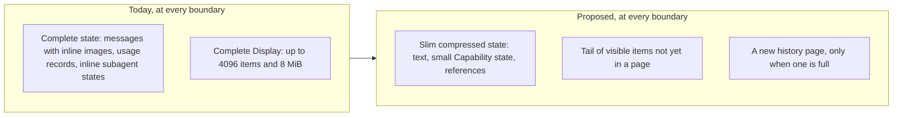

# Service run persistence proposal

> **Discussion proposal, not the current specification.** This directory records a design under discussion in [issue #849](https://github.com/converge-ai-labs/agent-foundation/issues/849). It does not describe implemented behavior, amend the accepted Service specification, or authorize implementation by itself. The existing [Service chapters](../README.md) remain authoritative until a reviewed change adopts and implements the proposal. Field names, routes, and initial values below are proposed.

This proposal is kept in a separate Service subdirectory at the project owner's request. That placement is an exception to the repository's usual practice of keeping proposals in GitHub Issues; it does not make this material normative.

Earlier revisions in this directory proposed a semantic event journal, then PostgreSQL staging of running state. Review replaced both with the smaller design below; see [what was dropped](04-validation-and-rollout.md#dropped-from-earlier-revisions).

## Problem

A long-running Service conversation pays costs that grow with the conversation rather than with what changed, and it loses work and history it should keep:

1. **Every safe boundary rewrites everything.** Before each model request and each tool batch, the worker serializes and uploads the complete Harness state and the complete Display, then moves two pointers in a fenced transaction ([`execute.py`](../../../packages/a13n-service/a13n_service/runs/execute.py), [`checkpoints.py`](../../../packages/a13n-service/a13n_service/runs/checkpoints.py)). Tool execution waits for that commit. #781 estimated about 9–10 MB uploaded per boundary to record 5–20 KB of change once Display reaches its cap. Screenshots from computer use stay inline in message history ([`computer.py`](../../../packages/a13n-harness/a13n_harness/toolsets/computer.py)), so every boundary uploads all of them again.
2. **Bookkeeping can fail a long Run.** The state object carries `a13n.usage` (up to 10,000 records per attempt, while the Service resumes with `resume_usage=False`) and the complete state of every retained inline subagent (`a13n.subagents`, never pruned). An object over `objects.max_bytes` (16 MiB by default) fails the Run with `payload_too_large`. After a retained subagent's revision changes, every later Run of the Thread fails at start with `subagent_state_incompatible`.
3. **Visible history is truncated and unpaged.** Display keeps at most 4096 items and `worker.display_bytes` (8 MiB); older items are dropped or emptied. `GET …/runs/{run}/items` returns the whole retained Display.
4. **Failed and cancelled work is lost to the conversation.** Only completed and waiting Runs become the Thread's head ([`seal.py`](../../../packages/a13n-service/a13n_service/runs/seal.py)). After a Run fails or is interrupted, the next message continues from the last completed or waiting Run, so everything the failed Run did, however long it ran, is gone from the model's context ([`accept.py`](../../../packages/a13n-service/a13n_service/runs/accept.py)).

## The proposal in one paragraph

Keep today's recovery model, in which every safe boundary commits a complete state object, but make that object small: usage stays only in its ledger, inline subagent states and large binary content are stored once as separate objects referenced from the state, and state objects are compressed. Split Display into immutable history pages, written once and kept permanently, and a small tail of items not yet in a page, written with each checkpoint. Let the next Run continue from the last checkpoint of a failed or cancelled Run.

| Piece                 | Today, at every boundary                | Proposed                                                             |
| --------------------- | --------------------------------------- | -------------------------------------------------------------------- |
| Message text          | Inside the complete state object        | Inside the state object, compressed                                  |
| Large binary content  | Inline in messages, uploaded every time | A content object written once; messages hold a reference             |
| `a13n.usage`          | Inside the state object                 | Not persisted with state; `usage_records` only                       |
| Inline subagent state | Inside the parent's `a13n.subagents`    | A subagent state object written once; the registry holds a reference |
| Visible items         | Complete Display object                 | Permanent history pages plus a small tail                            |

## Unchanged

- Every safe boundary still writes a complete state object and commits it in one fenced transaction. Recovery loads the last checkpoint exactly as today. Lease fencing, at-most-once input incorporation, and pre-effect tool durability are unchanged.
- Completed and waiting Runs seal with their final checkpoint, so continue, fork, resume, and child-result successors start as today.
- Waiting and deferred-resume lifecycle, subagent hosting, and the live thread stream protocol are unchanged. Inline children still execute inside the parent tool call; asynchronous children remain separate Threads and Runs.

## Not in scope

- Incremental state writes: staging changes in PostgreSQL, a state change log, or replay. They remain possible later if measured checkpoint cost requires them; see [incremental state](04-validation-and-rollout.md#incremental-state-deferred).
- A semantic event journal, historical state inspection between checkpoints, and Session-wide timelines.
- Hosting synchronous subagents in separate Threads, and durability of an inline child's progress while it runs.
- The Harness usage-scope capacity of 10,000 records per attempt.

## Reading order

| Document                                                   | Owns                                                                               |
| ---------------------------------------------------------- | ---------------------------------------------------------------------------------- |
| [01: State and continuation](01-state-and-continuation.md) | State contents, the storage binding, compression, continuing after failed Runs     |
| [02: Visible history](02-visible-history.md)               | Items, history pages, the tail, final items, reads                                 |
| [03: Storage and APIs](03-storage-and-apis.md)             | Object keys, Run columns, cleanup, API and settings                                |
| [04: Validation and rollout](04-validation-and-rollout.md) | Capacity, tests, delivery order, decisions, deferred work, dropped earlier designs |
