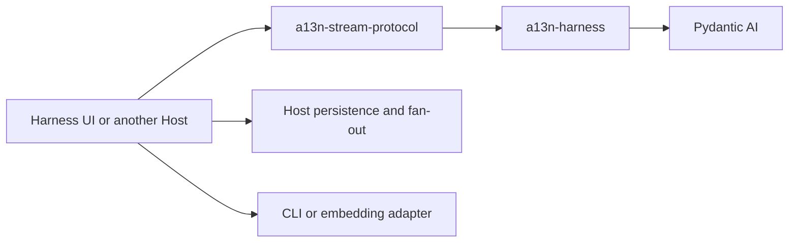

# Agent Stream Protocol Observation

## Design Position

`a13n-stream-protocol` is the shared process-local adapter from public Harness stream items to Agent User Interaction Protocol events. One `HarnessAguiObserver` converts the items for one Harness Run, uses standard AG-UI events where their semantics match directly, falls back to `CUSTOM` for every other public observation, applies an optional Host processor, and accumulates the resulting events in observation order. A fresh observer can atomically reconstruct that process-local state by folding a finite Host-supplied history of the same public source items before live observation continues.

The wire contract is AG-UI 1.0, using canonical camelCase standard fields and upstream content parts. Optional absent fields are omitted; required payload values such as `CUSTOM.value: null` are retained. There is no 0.x negotiation, dual decoding, or legacy event alias layer. Hosts retain their own transport and continuation APIs; adopting AG-UI does not make them `HttpAgent` endpoints.

The package does not define another execution or lifecycle layer. It does not run or resume an Agent, manufacture missing Harness lifecycle observations, accept application commands, retain or select durable history, assign Host event identities, or own a transport. A Host consumes each live Harness item once, routes each root stream to one stream observer (or a strictly single-Run source to one single-Run observer), and decides whether and how to retain source history, persist, broadcast, filter, compact, or render the returned AG-UI events.

## Boundaries

| Concern                                        | Owner                          | Relationship                                                                                             |
| ---------------------------------------------- | ------------------------------ | -------------------------------------------------------------------------------------------------------- |
| Model, tool, and provider event semantics      | Pydantic AI                    | The observer maps its public events without redefining their lifecycle                                   |
| Process-local event correlation and lifecycle  | Harness                        | Supplies ordered `HarnessEvent` and terminal `HarnessRunResultEvent` values with Thread and Run identity |
| Harness-to-AG-UI conversion                    | Agent Stream Protocol          | Uses standard AG-UI events where they apply directly and `CUSTOM` otherwise                              |
| Application visibility and filtering           | Host processor                 | May retain, replace declared content fields on, or drop each converted event                             |
| Process-local reconstruction and accumulation  | Agent Stream Protocol observer | Folds Host-supplied source history and retains post-processor events for one Run in observation order    |
| History retention, selection, and live cutover | Host                           | Supplies an exact finite source prefix and selects where subsequent live observation begins              |
| Persistence, event IDs, replay, and fan-out    | Host                           | Stores or delivers returned events under its own Session or Execution contract                           |
| HTTP, SSE, WebSocket, or in-process delivery   | Host transport                 | Serializes and carries AG-UI events without becoming their execution authority                           |
| Display semantics                              | Agent Stream Protocol          | Normalizes raw events or a compact checkpoint plus suffix into stable blocks and active accumulations    |

The [Harness event contract](../a13n-harness/12-events-observability-and-usage.md) owns the source stream. [Harness UI local storage and recovery](../a13n-harness-ui/03-local-storage-and-recovery.md) own local retention. [Service facts and delivery](../a13n-service/07-facts-and-delivery.md) owns hosted run facts, display and the thread stream.

## Dependency Direction



The Harness imports no AG-UI, UI, Session, HTTP, or terminal-rendering type. Agent Stream Protocol depends only on public Harness and Pydantic AI stream types plus the upstream AG-UI schema library. It imports no Harness UI session implementation, a13n Service persistence model, or transport framework.

Harness and Agent Stream Protocol are one release group. A `release/a13n-harness-v<version>` release assigns both distributions the same version, and the published Protocol artifact requires that exact Harness version. This shared release defines the supported source event union; runtime protocol-profile negotiation is not part of the process-local observer.

## Observer Contract

The single-Run observer contract is intentionally small; `HarnessAguiStreamObserver` exposes the same API for a root stream with inline children:

```python
type AguiEventProcessor = Callable[
    [HarnessStreamEvent[Any], Event],
    Event | None,
]


class HarnessAguiObserver:
    def __init__(
        self,
        *,
        processor: AguiEventProcessor | None = None,
        retain_events: bool = True,
    ) -> None: ...

    @property
    def thread_id(self) -> str | None: ...

    @property
    def run_id(self) -> str | None: ...

    async def resume(
        self,
        history: AsyncIterable[HarnessStreamEvent[Any]],
    ) -> None: ...

    def observe(
        self,
        item: HarnessStreamEvent[Any],
    ) -> tuple[Event, ...]: ...

    @property
    def event_count(self) -> int: ...

    def snapshot(self, *, start: int = 0, stop: int | None = None) -> tuple[Event, ...]: ...
```

`event_count` counts accumulated post-processor frames. `snapshot` returns detached frames in the half-open range `[start, stop)`; omission of `stop` uses the current count, and the no-argument call returns all frames. Invalid ranges fail explicitly. A Host can capture the count once and read that fixed prefix in bounded batches while later events accumulate. These positions are local to one observer, not Harness source sequence numbers or Host transport cursors. The Host still owns publication visibility and replay-to-live cutover.

With `retain_events=False`, conversion and processing remain identical but no event journal is retained. `event_count` is zero and `snapshot()` rejects the request rather than returning an apparently complete empty history. Atomic `resume()` rebuilds conversion continuity without retaining historical frames in this mode. Hosts using compact display choose this mode. Child multipart converters are released at the parent's accepted delegation completion, not at a child provider's last token.

The first successfully observed item binds `HarnessAguiObserver` to the source `thread_id` and `run_id`. Later items must carry the same correlation.

`HarnessAguiStreamObserver` provides the same observation, processor, snapshot, and atomic resumption API for a root Harness stream containing forwarded inline child observations. The first item binds the root identity. Each source Run has independent multipart conversion state and stable Thread correlation, while one accumulator preserves the Host's ordered stream. Child text, reasoning, tool results, and custom facts carry `subagentRunId`; their native message and tool-call IDs remain unchanged. Hosts namespace display identity by that attribution rather than treating it as a new execution or continuation ID. Child logical Run-start observations do not emit nested `RUN_STARTED` events in the parent stream. Host-managed asynchronous executions use independent stream observers and retain their own checkpoint and Environment publication boundaries.

`resume()` is valid only on a fresh, unbound observer. Its `history` is a finite asynchronous iterable containing the exact ordered public source-item prefix selected by the Host: one Run for `HarnessAguiObserver`, or one root stream and its inline children for `HarnessAguiStreamObserver`. The Host owns history retention and decoding, cursor and gap semantics, duplicate exclusion, the finite replay boundary, and the subsequent replay-to-live cutover; the observer imports no storage or transport type and does not acknowledge the history source.

Each historical item follows the same conversion, processor, validation, and accumulation path as `observe()`, but `resume()` returns no historical events for republication. After successful exhaustion, `snapshot()` contains the reconstructed post-processor sequence and later `observe()` calls continue from the reconstructed multipart state. A non-empty history binds the fresh observer to its source `thread_id` and `run_id`; resumption never rewrites source correlation, combines unrelated root Runs, reconstructs a Harness execution, or treats AG-UI events and display snapshots as source history.

The complete resumption is atomic with respect to observer state. The observer stages reconstruction separately and adopts it only after the history iterable exhausts successfully. An iteration failure, invalid source item, changed correlation, conversion failure, processor failure, or cancellation leaves the original observer fresh. Calling `resume()` after any successful observation or resumption is an error.

One observer is a serial-call object. While `resume()` is in progress, `observe()` and another `resume()` fail with `AguiObservationError`; properties and `snapshot()` continue to expose the pre-resumption fresh state. Failure or cancellation clears the in-progress gate so the Host can retry with another complete history iterable.

`DisplayFold` accepts the same optional processor at construction and restoration. It applies Host content replacement or omission before its payload bounds, event sequencing and common display fold, so live frames and persisted items represent the same processed content. A restoring Host supplies the same stable processor configuration; executable callbacks are not serialized in the continuation.

A processor is replay-stable: its result derives only from the supplied source item, converted event, and stable Host configuration. It retains no mutable processing state and performs no persistence, publication, acknowledgement, or other externally observable side effect. Replaying the same ordered history with the same configuration therefore reconstructs the same retained event sequence.

`observe()` performs one complete operation:

1. stage the multipart conversion state for the source item;
2. convert the source item to one or more AG-UI events;
3. call the optional processor once for each converted event;
4. omit only events for which the processor returns `None`, then frame retained oversized custom events;
5. commit the staged conversion state and accumulate retained events;
6. return detached copies of the events added by that call.

Without a processor, every converted event is retained unchanged. A replacement must preserve the AG-UI event type and source-derived Thread, Run, message, tool, and lifecycle correlation. A processor cannot turn another observation into a lifecycle event or expand one event into several.

All events produced from one source item are converted and processed before the observer changes its state or accumulator. A conversion failure, invalid processor replacement, or processor exception leaves the current source item unaccumulated. `snapshot()` returns detached copies of the complete post-processor event sequence. The observer does not compact chunks, remove lifecycle boundaries, create cursors, or apply a retention limit.

A Host persists incrementally from the values returned by live `observe()` calls rather than injecting a storage callback into the observer. Historical events reconstructed by `resume()` are accumulated for state and snapshot continuity but are not returned for duplicate publication. This keeps event conversion and reconstruction independent from asynchronous databases, brokers, and transports.

## Compact display semantics

The shared display fold consumes converted, post-processor events and maintains ordered text, reasoning, tool-call and observation items. Stable identity includes inline scope; argument completion does not imply tool success. Host-assigned coverage records the position that created and last changed each item. Hosts choose value retention independently of item identity and observation selection. Items support inline values, truncation metadata and Host-owned content references; storage and authorized retrieval belong to the Host. Service owns its [display persistence](../a13n-service/07-facts-and-delivery.md#checkpoints-and-display).

Raw AG-UI events remain the live wire representation. A Host may attach stream position and item identity, ordinal, state, response grouping or native failure metadata; that envelope does not replace events with item set/append commands. Hosts coalesce unpublished adjacent fragments before allocating display sequences and flush them before freezing a checkpoint. Published events are never rewritten.

A compact baseline and its parser continuation plus an intact raw-event suffix reconstruct the same items as the fold. It is not execution history, a terminal authority, or a promise that uncommitted output survives transport loss. The memory target is retained display content plus active conversion state and bounded delivery buffers, not constant total conversation memory.

## Standard Event Conversion

The observer uses standard AG-UI events for direct semantic matches:

| Public source observation                        | AG-UI representation                                                                     |
| ------------------------------------------------ | ---------------------------------------------------------------------------------------- |
| Assistant `TextPart` start, delta, and end       | `TEXT_MESSAGE_START`, `TEXT_MESSAGE_CONTENT`, and `TEXT_MESSAGE_END`                     |
| `ThinkingPart` start, delta, signature, and end  | Reasoning message events and `REASONING_ENCRYPTED_VALUE`                                 |
| Completed `ToolCallPart` at its end observation  | `TOOL_CALL_START`, complete `TOOL_CALL_ARGS`, and `TOOL_CALL_END`                        |
| Successful function or output tool return        | `TOOL_CALL_RESULT`                                                                       |
| Logical `run_started` observation                | `RUN_STARTED` with `protocolVersion: "1.0"`                                              |
| Completed terminal `HarnessRunResultEvent`       | `RUN_FINISHED` with success outcome and a JSON-safe result when available                |
| Cancelled terminal `HarnessRunResultEvent`       | `RUN_FINISHED` with cancelled outcome                                                    |
| Suspended terminal `HarnessRunResultEvent`       | `RUN_FINISHED` with interrupt outcome and one interrupt per native deferred tool-call ID |
| Failed terminal `HarnessRunResultEvent`          | `RUN_ERROR` with the Harness-owned public failure                                        |
| Inline delegation lifecycle in a stream observer | `SUBAGENT_STARTED`, `SUBAGENT_FINISHED`, or `SUBAGENT_ERROR`                             |
| Non-success tool return or retry prompt          | Namespaced `CUSTOM` preserving authoritative Harness correlation and public payload      |
| Other native Pydantic AI `CapabilityEvent`       | Namespaced `CUSTOM` preserving Capability, Tool-call, Harness correlation, and payload   |

Successful tool results use the execution value explicitly identified by Harness tool-content annotations, or the complete native `ToolReturnPart.content` when no such marker exists, as their readable `TOOL_CALL_RESULT` payload. They retain `role: tool` and the original tool-call ID. Ordinary JSON execution values remain text. Explicit native content in the execution value becomes an ordered list of AG-UI `TextPart`, `ImagePart`, `AudioPart`, `VideoPart`, or `DocumentPart` values. HTTP(S) URLs use `UrlSource`; provider file handles use `FileSource` without inventing a downloadable URL. Binary data and unsafe URLs become payload-omitted descriptors, never inline bytes or base64. Order, duplicate attachments, and `display: false` annotations are preserved. The exported `tool_result_content` projection can also serve explicit saved-content adapters. Supplemental media remains model-only even when it is a transportable URL or provider handle; it neither replaces the readable execution value nor generates user-input events. Host-authenticated screenshot materialization remains separate from this IO-free projection. The native `DeferredToolResultsEvent` custom projection carries only `event_kind`, resolved `call_ids`, and `approval_ids`; each result is observed separately, without serializing the batch's media payloads.

Harness `InputTextEvent` maps to source-specific custom names: `a13n.input.user`, `a13n.input.steering`, `a13n.input.context`, `a13n.input.recovery`, `a13n.input.async_subagent`, or `a13n.input.background_process`. Its source envelope has `event.input_id`, `event.source`, and `event.content: str`, not a serialized `TextContent`. `InputMediaEvent` maps to `a13n.input.media` with the same grouping and source fields. Input observations do not produce standard `TEXT_MESSAGE_*` events. Each custom event carries `role` (`user` for authored input or steering, otherwise `system`) and `message_id` inside `value.event`, with standard top-level `metadata`. Message IDs derive from the source Run and sequence; multipart groups share their `input_id`. No history reconstruction, text matching, hashes, or timestamp matching identifies display content. Cache markers are model-only and produce no presentation event.

The package root exports `AUTHORED_INPUT_EVENT_NAMES`, the immutable set containing `a13n.input.user` and `a13n.input.steering`, for consumers selecting authored text observations.

`a13n.input.media` uses the normal source-correlation envelope with `event.content` containing a payload-free descriptor. It preserves the native `kind`. URL inputs include their HTTP(S) `url` and available media type; uploaded files include `file_id`, `provider_name`, and media type. Binary inputs include media type, byte size, and `payload_omitted: true`, never `data` or base64. Inline data URLs and local URLs have omitted payloads instead of transportable URLs. Projection never downloads, uploads, creates an asset ID, resolves an object ID, or serializes native media wholesale before stripping payloads. The enqueue control custom event contains its kind and enqueue ID, not a second raw copy of delivered messages, and does not independently project their content. The Harness emits separate typed input observations after delivery. Generated input sources remain system observations, not authored conversation messages; clients render visible `user` and `steering` text according to their own presentation contract.

`ContentMetadata` is owned by Harness and re-exported by Stream Protocol. It preserves caller-supplied JSON metadata, including application references such as `image_object_id`, with the conventional `display` (default true), optional `source_id`, and `media` (default false, true for media events) fields. Projection reads Harness `ContentItem` annotations or canonical request annotations as defined by [Input](../a13n-harness/16-input-model-and-output.md#content-annotations). Native `TextContent.metadata` can supply application annotations; media `vendor_metadata` is never a presentation source. Hosts decide which metadata to supply and clients decide how to resolve its references. Metadata does not convey model instruction or access authority. Consumers omit `display: false` content from normal presentation; processors cannot change role, identity, or metadata. Explicit retained-history adapters can reuse the content projection without making history a live-input source.

`RunStartedEvent.input` is reserved for a Host's actual `RunAgentInput` request when such a request exists. The observer does not invent state, tools, forwarded properties, or conversation history to populate it. It is not a substitute for input events and cannot represent later steering.

Other Capability events, including compaction summaries, handoff summaries, file edits, and shell status, retain their native custom names and payloads. Clients interpret those facts into their own panels.

The observer maintains only the state needed to translate multipart events consistently: the current Harness model-request index, open part identities, accumulated tool name, and whether text or reasoning content has already been emitted. Harness model-request lifecycle observations remain visible as `CUSTOM`; they also provide the request index used when a Pydantic part has no native identity. A next-request notification can precede the previous stream’s final part event during steering. Already open parts retain their original identity until their own end or replacement start; advancing the request index does not relabel or discard them.

Tool names and mapping-valued argument deltas can be incomplete during Pydantic streaming. Their start and delta observations therefore remain visible through `CUSTOM`, while the completed `PartEndEvent` produces one coherent standard tool-call lifecycle from the final public `ToolCallPart`. The observer never mixes AG-UI chunk convenience events with explicit start/end events or concatenates independently serialized mapping deltas.

A text or reasoning part delta or end without a preceding start is normalized into a valid standard lifecycle by emitting the missing start from the information present in that same public event. A conflicting part kind or identity is a conversion error rather than a reason to rewrite prior events.

## Complete Custom Fallback

An observation without a direct standard representation is never silently dropped. It becomes:

- `a13n.harness.tool.<name>` for a typed Tool extra extension;
- `a13n.harness.<kind>` for another `HarnessExtensionEvent`;
- the unchanged native `CapabilityEvent.kind` for a Capability event; or
- `a13n.pydantic_ai.<event_kind>` for another Pydantic AI event.

The Tool specialization makes semantic events such as `a13n.harness.tool.filesystem.changed` directly subscribable without changing the source representation. Its `CUSTOM.value.event` remains the complete `HarnessExtensionEvent`, including Tool call correlation and the namespaced Tool event name.

The `CUSTOM.value` is:

```python
{
    "thread_id": item.thread_id,
    "run_id": item.run_id,
    "sequence": item.sequence,
    "occurred_at": item.occurred_at.isoformat(),
    "event": public_source_representation,
}
```

A Harness extension uses `model_dump(mode="json", by_alias=True)`. A Pydantic AI-compatible event uses the concrete runtime value's Pydantic JSON-mode serializer with aliases enabled; the observer does not snapshot the installed `AgentStreamEvent` union or maintain an event-kind registry. A native `CapabilityEvent` uses its concrete `kind` as the custom name and retains `kind`, `capability_id`, optional Tool-call correlation, and its public payload inside `CUSTOM.value.event`. Unknown native Capability events use the native event-family serializer to recover the original flattened payload. User-defined kinds require no first-party converter or allowlist. Serialization warnings are conversion failures rather than permission to emit a partial representation. A value may satisfy the Harness process-local `AgentStreamEventProtocol` while lacking a Pydantic-compatible JSON serializer; such a value fails conversion atomically, and the observer does not invent a serializer for it. The shared Harness/Protocol release defines these source fields; the fallback does not introduce a manual event allowlist, custom schema registry, or independent version negotiation.

A source item with a direct standard mapping is not duplicated as a second custom event, except inline delegation: its custom fact retains Harness invocation and ownership details absent from the standard child lifecycle. The processor receives both the source item and each converted event, and a Host can separately retain source records when its product requires them.

### Large Custom Events

All oversized custom events use a generic lossless framing codec after whole-event processing and validation. A custom event whose JSON encoding is at most 48 KiB remains intact. Larger events become ordered `CUSTOM` frames named `a13n.stream.fragment`, each carrying `{id, index, count, data}`. The ID derives from the source Thread, Run, sequence, and retained converted-event index; zero-based indices and count describe the fragments of the original custom event JSON. Data chunks contain at most 4096 code points, keeping each encoded frame below the App's 64 KiB payload bound. Framing does not rename domain fields, render content, or imply another event lifecycle.

`fragment_custom_event` exposes the same codec to other producers. Clients reassemble frames before interpreting the original custom name and value. `CustomEventAssembler` supports interleaved identities and retains at most eight pending events with a combined 64 MiB text budget by default. Invalid order, inconsistent counts, missing fragments, invalid JSON, or exceeded budgets never produce a partial domain event; the assembler reports an observation gap. Consumers own subscription lifetime and discard incomplete assemblies on reset. Transport loss remains possible and does not invalidate completed tool effects. Processors see the original complete custom name and value before fragmentation, so visibility filtering is independent of event size. Fragments are not independently meaningful domain observations.

## Lifecycle Ownership

Agent Stream Protocol translates explicit lifecycle facts; it does not create them from local control flow. Constructing or resuming an observer, opening a subscriber, catching an exception, losing a transport, or committing Host state does not by itself emit a run lifecycle event.

Model-request lifecycle extensions use the generic custom fallback because they are not equivalent to AG-UI Run lifecycle. Harness publishes one logical Run-start fact after preparation and at the beginning of public iteration, including Runs with no model request. The observer translates that fact, not the first token, model request, Host admission, or connection.

Suspended results carry one interrupt for each deferred call or approval. Both `id` and `toolCallId` use the native tool-call ID. Reasons are `external` or `approval`; metadata retains the tool name, arguments, and deferred metadata. These observations do not replace Host pending-request validation, continuation selection, or partial-answer policy. Terminal usage includes cache-read and cache-write input counters; it remains presentation, never a replacement for usage reports or the accounting ledger. Provider/model attribution is absent when the aggregate does not establish it.

On a real terminal result, open text and reasoning presentations end before the terminal event; incomplete tool calls are not fabricated as completed. Inline child completion derives from the delegation lifecycle after output projection and state retention, not the private child result consumed by Harness. The stream observer closes that child's open presentations before its standard terminal child event. Failed or cancelled inline invocations use `SUBAGENT_ERROR` only when the corresponding failure observation exists. Preparation failures without a child Run ID retain custom facts without inventing an identity.

A Harness stream that ends through an unhandled exception or cleanup failure without a terminal item does not gain a synthetic terminal event. Host acceptance, persistence commit, cancellation request, reconnect, and external delivery remain separate Host facts.

## Host Processing and Persistence

The optional processor is the policy seam. It can drop observations or replace only declared standard-event content fields while preserving type, timestamp, role, lifecycle variant, custom name, identities, and source correlation. A `CUSTOM.value` is the public source representation and is therefore retained unchanged or dropped as a whole. Host-specific metadata belongs in the Host-owned retained or delivery envelope rather than a rewritten protocol structure. Agent Stream Protocol has no built-in allowlist that suppresses otherwise public Harness events and adds no second visibility policy over the public source stream.

Host persistence wraps AG-UI events in any IDs, sequence numbers, timestamps, transaction records, or replay cursors required by that Host. Those values are not part of the observer because their identity and durability depend on the owning Session, Execution, and store. When a Host supports observer reconstruction, it additionally retains or reconstructs the exact typed Harness source prefix accepted by the selected Harness/Protocol release and supplies that prefix through `resume()`. AG-UI delivery records and visible blocks alone are not substitutes for native source history because conversion has multipart cursors. Alternatively, a Host saves and restores the observer's explicit conversion continuation with stable processor configuration; this contains identities, open part cursors and inline-child routing, not raw token history.

The observer's in-memory accumulation and history reconstruction are conveniences for process-local continuation, inspection, and snapshot access, not a durable event log or replay authority. A Host that starts a new Harness Run after worker takeover creates a new observer for that new `run_id`; it may retain earlier Run projections in the same Host timeline without feeding them into the new observer.

A Host derives a compact display with one stream observer per independently executed root or asynchronous child Run, preserving inline-child attribution within that stream. Its replay-stable processor may drop encrypted reasoning and unrelated custom events, redact or truncate declared Tool content fields, and clear `RUN_FINISHED.result` when closed text already represents the final answer. The Host owns retention limits, durable selection, paging and checkpoint acknowledgement; the shared normalizer owns block content and parsing continuation.

## Normalized Display Checkpoints

A normalized snapshot contains completed blocks, active blocks with accumulated text or arguments, and the continuation required to interpret the next event. Stable block IDs, ordinals, source positions, timestamps and lifecycle state survive export and restore. Completed blocks replace their accumulated fragments; token boundaries are not retained. Export is detached and pure: it does not synthesize END, interrupt a block, finish a tool, or imply execution completion.

Continuation includes the next ordinal and semantic position, response grouping, unfinished argument observations, incomplete custom assemblies and, for producer conversion, native observer cursors. An AG-UI consumer needs the normalization continuation but does not execute the native converter. Incomplete JSON or custom fragments are not valid completed domain content.

For every supported ordered event cut, normalizing the full stream equals restoring the exported prefix and normalizing the intact suffix. Equality covers content, identities, ordering and lifecycle, not original token boundaries. Interleaved inline scopes and fragmented custom events obey the same invariant. Host page retirement must preserve the next ordinal and may retire only immutable blocks; a historical window alone is not a resumable baseline.

Restoring display state does not resume provider generation or execution. The Host owns attempt replacement and terminal/interruption policy separately. Raw AG-UI remains the live event vocabulary; compact checkpoints do not require a public set/append operation protocol.

## Failure and Schema Boundary

An invalid source type, source event without a Pydantic-compatible JSON representation, changed Run correlation, conflicting multipart identity, failed AG-UI construction, invalid processor replacement, or processor exception is reported to the caller. A failed `resume()` additionally leaves the observer fresh so the Host can retry with another complete history iterable. Completed output is normalized to JSON before accumulation; when a valid code-first output has no JSON representation, `RUN_FINISHED.result` is omitted and `rawEvent.result_omitted` records that presentation fact while the source Harness result remains available to the Host. The observer does not convert its own failure into a synthetic Harness or AG-UI lifecycle fact.

Standard AG-UI names and fields retain their upstream meaning. The selected Harness/Protocol release and its pinned AG-UI dependency define one current observation schema. Hosts and renderers consume that schema together; source history supplied to `resume()` uses the same current public source types. Superseded pre-public event formats have no migration, name aliases, or dual-read path. Native user-defined and unknown Capability events remain observable through their original `kind` and payload; this is current extensibility, not support for an older observation schema.

## Invariants

1. Agent Stream Protocol observes public Harness stream items; observer resumption reconstructs observation state and never executes or resumes an Agent.
2. A single-Run observer binds to exactly one Harness Thread and Run. A stream observer binds to one root and maintains independent correlated state for its inline children, including during resumption.
3. A fresh observer atomically adopts a successfully exhausted finite source history or remains fresh after resumption failure.
4. Lifecycle facts originate in the Harness source stream; the observer does not infer them from Host or transport behavior.
5. A successfully converted direct semantic match uses standard AG-UI meaning, and every other successfully converted public observation falls back to `CUSTOM`.
6. No converted event is dropped by default; only the replay-stable Host processor can explicitly omit one.
7. One source item is processed and accumulated atomically, and returned events and snapshots are detached from observer state.
8. The observer owns no durable identity, history retention or selection, cursor, gap policy, durable replay, fan-out, backpressure, cancellation, or transport behavior.
9. AG-UI observation and reconstruction never become Harness continuation state or strengthen a Host lifecycle fact.
