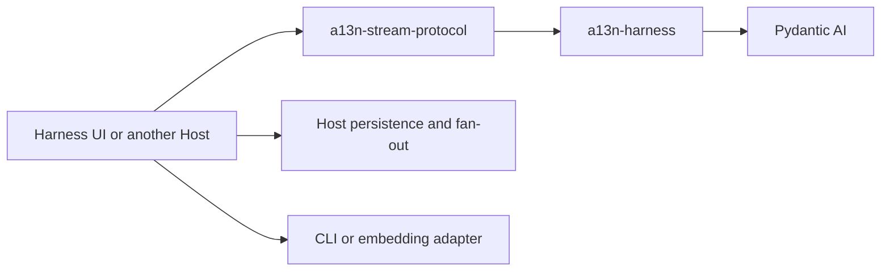

# Agent Stream Protocol Observation and Display

## Design Position

`a13n-stream-protocol` owns shared native-to-display semantics and public Harness-to-AG-UI conversion. Its compact display projector joins native message history with live native events by source address; both Hosts use the same interpretation. Browsers apply typed operations rather than maintaining a second semantic event fold. `HarnessAguiConverter` converts one Run without retaining its event transcript. `HarnessAguiObserver` additionally supports explicit finite source-history reconstruction and accumulation; live Host display recovery uses compact snapshots, not that accumulator.

The package does not define another execution or lifecycle layer. It does not run or resume an Agent, manufacture missing Harness lifecycle observations, accept application commands, retain or select durable history, assign Host event identities, or own a transport. A Host binds producer capture to canonical native boundaries and decides visibility, persistence, retention, and transport. Explicit AG-UI consumers route each live Run to a converter or finite-history observer without using that accumulator as compact display recovery.

## Boundaries

| Concern                                         | Owner                          | Relationship                                                                                             |
| ----------------------------------------------- | ------------------------------ | -------------------------------------------------------------------------------------------------------- |
| Model, tool, and provider event semantics       | Pydantic AI                    | The observer maps its public events without redefining their lifecycle                                   |
| Process-local event correlation and lifecycle   | Harness                        | Supplies ordered `HarnessEvent` and terminal `HarnessRunResultEvent` values with Thread and Run identity |
| Harness-to-AG-UI conversion                     | Agent Stream Protocol          | Uses standard AG-UI events where they apply directly and `CUSTOM` otherwise                              |
| Application visibility and filtering            | Host processor                 | May retain, replace declared content fields on, or drop each converted event                             |
| Process-local reconstruction and accumulation   | Agent Stream Protocol observer | Folds Host-supplied source history and retains post-processor events for one Run in observation order    |
| History retention, selection, and live cutover  | Host                           | Supplies an exact finite source prefix and selects where subsequent live observation begins              |
| Persistence, event IDs, replay, and fan-out     | Host                           | Stores or delivers returned events under its own Session or Execution contract                           |
| HTTP, SSE, WebSocket, or in-process delivery    | Host transport                 | Serializes and carries AG-UI events without becoming their execution authority                           |
| Compact display semantics and atomic operations | Agent Stream Protocol          | Projects native values once; Python and TypeScript applicators share the operation contract              |
| Visual presentation                             | Renderer                       | Renders compact blocks without interpreting native or AG-UI lifecycle semantics                          |

The [Harness event contract](../a13n-harness/12-events-observability-and-usage.md) owns the source stream. [Harness UI local storage and recovery](../a13n-harness-ui/03-local-storage-and-recovery.md) own local retention. [Service facts and delivery](../a13n-service/07-facts-and-delivery.md) owns hosted run facts, display and the thread stream.

## Dependency Direction



The Harness imports no AG-UI, UI, Session, HTTP, or terminal-rendering type. Agent Stream Protocol depends only on public Harness and Pydantic AI stream types plus the upstream AG-UI schema library. It imports no Harness UI session implementation, a13n Service persistence model, or transport framework.

Harness and Agent Stream Protocol are one release group. A `release/a13n-harness-v<version>` release assigns both distributions the same version, and the published Protocol artifact requires that exact Harness version. This shared release defines the supported source event union; runtime protocol-profile negotiation is not part of the process-local observer.

## Compact Display Contract

A display is an observation, never resumable Agent state or execution authority. The Host pairs a detached display capture with its selected native checkpoint and owns publication, fencing, retention, and recovery. The projector retains compact blocks and positional continuity, not a second native message transcript or an unbounded raw event log.

### Identity and coverage

`Producer = {run_id, generation}` identifies one writer. A `DisplayPosition` contains that producer and its nonnegative `sequence`. A Host selects a fresh generation for an execution attempt; restoring another attempt starts from the last durable baseline at sequence zero, discarding any superseded provisional suffix. Sequence is semantic coverage, not a Redis ID, WebSocket cursor, checkpoint revision, or timestamp.

Inline child Runs have distinct scopes (`id`, `thread_id`, `run_id`, parent scope and tool call, optional invocation identity), but share their root producer and sequence. Async child Runs have their own producer and selected checkpoint coverage. Scope identity is immutable; its `running`, `completed`, `failed`, `cancelled`, or `deferred` status may change independently from its parent tool.

Blocks have a stable `id`, `scope_id`, positive `revision`, `kind`, `status`, JSON `content`, and optional native `message_index` and `part_index` for inspection and comments. Kinds are `input`, `text`, `reasoning`, `tool_chunk`, `context_summary`, `media`, and `extension`. Status is `pending`, `running`, `succeeded`, `failed`, `cancelled`, `deferred`, or `unknown`. Native addresses, not text equality, join live parts with canonical history, including identical adjacent inputs and context replacement. Tool call IDs correlate arguments and results within their owning scope.

### Wire values and atomic application

`DisplaySnapshot` has format `display/1`, a position, ordered scopes and blocks, cumulative `omitted` count, and producer-only JSON `continuity`. It is self-contained. A `DisplayDelta` has format `display-delta/1`, producer, `from_sequence`, `through_sequence`, and a nonempty ordered operations array. One complete batch advances exactly one sequence (`through_sequence = from_sequence + 1`).

| Operation                                                      | Preconditions and effect                                                                                                                   |
| -------------------------------------------------------------- | ------------------------------------------------------------------------------------------------------------------------------------------ |
| `block.put {block, expected_revision}`                         | Absent blocks have revision zero. The replacement revision is exactly `expected_revision + 1`; an existing block keeps its scope and kind. |
| `block.append {id, field, value, expected_revision, revision}` | Append text to `text`, `arguments`, or `signature` on an existing block, advancing exactly one revision.                                   |
| `scope.put {scope}`                                            | Create a scope whose parent already exists, or update only its status. Scope lineage is acyclic.                                           |
| `blocks.remove {ids, omitted}`                                 | Remove existing blocks and publish a nondecreasing cumulative omission count.                                                              |

The applicator stages only affected values. It validates the entire batch before exposing any change; a failed suffix cannot partially apply a valid prefix. A covered same-producer batch is a no-op. An uncovered sequence gap, producer mismatch, or failed revision/identity precondition requires an authoritative baseline. Captures and restores are detached from caller mutation. Python and browser implementations apply the same protocol fixtures.

### Native projection and capture

Canonical native messages supply input visibility, payload-free media references, text/reasoning, tool arguments/results, and inspection addresses. `display: false` content stays hidden, including when input is also delivered as a native capability event. Binary bytes are not serialized into display media. Custom display-bearing capability/extension events retain their named JSON payload; Host control events are excluded by the Host, and usage, state, and diagnostic observations do not become transcript content. Lifecycle and context-operation updates collapse into one scope-keyed extension summary per model request or context operation, preserving known outcome and context measurements without retaining raw event history. Native provider tools remain distinguishable from application tools. Unknown timing is not invented.

Argument completion does not mean execution completion. A call with complete arguments remains `pending` until its execution wrapper enters; `running` means execution was entered, not that an external side effect occurred. Tool results or retry failures determine completion, and observed cancellation is not relabeled as success or ordinary failure by later native reconciliation. Tool return metadata stays attached to the same tool block. Context summaries survive handoff or compaction exactly once while synthetic helper prompts do not become user-visible history.

Native `on_event` is a live observation hook, not a universal emission-time checkpoint barrier. A Host captures canonical history at its producer-owned boundary without waiting for public stream delivery. Validated Harness extension observation runs synchronously before the bounded delivery queue; forwarding an inline event does not observe it again. Context-summary decisions reach producer hooks before replacement checkpoints. Publication callbacks must be nonblocking and loss-handling: live delivery failure cannot roll back producer state or become checkpoint authority.

Retention is Host policy. Limits on block count, block bytes, and field characters are applied through explicit operations, including truncation metadata and removals, so replay matches capture. Retained display does not replace full native state. A self-contained checkpoint still serializes its retained history; this format does not claim changed-page storage or constant checkpoint-write cost.

## Observer Contract

The public contract is intentionally small:

```python
type AguiEventProcessor = Callable[
    [HarnessStreamEvent[Any], Event],
    Event | None,
]


class HarnessAguiObserver:
    def __init__(
        self,
        *,
        processor: AguiEventProcessor | None = None,
    ) -> None: ...

    @property
    def thread_id(self) -> str | None: ...

    @property
    def run_id(self) -> str | None: ...

    async def resume(
        self,
        history: AsyncIterable[HarnessStreamEvent[Any]],
    ) -> None: ...

    def observe(
        self,
        item: HarnessStreamEvent[Any],
    ) -> tuple[Event, ...]: ...

    @property
    def event_count(self) -> int: ...

    def snapshot(self, *, start: int = 0, stop: int | None = None) -> tuple[Event, ...]: ...
```

`event_count` counts accumulated post-processor frames. `snapshot` returns detached frames in the half-open range `[start, stop)`; omission of `stop` uses the current count, and the no-argument call returns all frames. Invalid ranges fail explicitly. A Host can capture the count once and read that fixed prefix in bounded batches while later events accumulate. These positions are local to one observer, not Harness source sequence numbers or Host transport cursors. The Host still owns publication visibility and replay-to-live cutover.

The first successfully observed item binds the observer to the source `thread_id` and `run_id`. Later items must carry the same correlation. A root Run and each exposed child Run therefore use separate observers even when their source items were delivered through one parent Harness stream.

`resume()` is valid only on a fresh, unbound observer. Its `history` is a finite asynchronous iterable containing the exact ordered public source-item prefix selected by the Host for one Harness Run. The Host owns history retention and decoding, cursor and gap semantics, duplicate exclusion, the finite replay boundary, and the subsequent replay-to-live cutover; the observer imports no storage or transport type and does not acknowledge the history source.

Each historical item follows the same conversion, processor, validation, and accumulation path as `observe()`, but `resume()` returns no historical events for republication. After successful exhaustion, `snapshot()` contains the reconstructed post-processor sequence and later `observe()` calls continue from the reconstructed multipart state. A non-empty history binds the fresh observer to its source `thread_id` and `run_id`; resumption never rewrites that source correlation, crosses into another Harness Run, reconstructs a Harness execution, or treats AG-UI events and display snapshots as source history.

The complete resumption is atomic with respect to observer state. The observer stages reconstruction separately and adopts it only after the history iterable exhausts successfully. An iteration failure, invalid source item, changed correlation, conversion failure, processor failure, or cancellation leaves the original observer fresh. Calling `resume()` after any successful observation or resumption is an error.

One observer is a serial-call object. While `resume()` is in progress, `observe()` and another `resume()` fail with `AguiObservationError`; properties and `snapshot()` continue to expose the pre-resumption fresh state. Failure or cancellation clears the in-progress gate so the Host can retry with another complete history iterable.

A processor is replay-stable: its result derives only from the supplied source item, converted event, and stable Host configuration. It retains no mutable processing state and performs no persistence, publication, acknowledgement, or other externally observable side effect. Replaying the same ordered history with the same configuration therefore reconstructs the same retained event sequence.

`observe()` performs one complete operation:

1. stage the multipart conversion state for the source item;
2. convert the source item to one or more AG-UI events;
3. call the optional processor once for each converted event;
4. omit only events for which the processor returns `None`, then frame retained oversized custom events;
5. commit the staged conversion state and accumulate retained events;
6. return detached copies of the events added by that call.

Without a processor, every converted event is retained unchanged. A replacement must preserve the AG-UI event type and source-derived Thread, Run, message, tool, and lifecycle correlation. A processor cannot turn another observation into a lifecycle event or expand one event into several.

All events produced from one source item are converted and processed before the observer changes its state or accumulator. A conversion failure, invalid processor replacement, or processor exception leaves the current source item unaccumulated. `snapshot()` returns detached copies of the complete post-processor event sequence. The observer does not compact chunks, remove lifecycle boundaries, create cursors, or apply a retention limit.

A Host persists incrementally from the values returned by live `observe()` calls rather than injecting a storage callback into the observer. Historical events reconstructed by `resume()` are accumulated for state and snapshot continuity but are not returned for duplicate publication. This keeps event conversion and reconstruction independent from asynchronous databases, brokers, and transports.

## Standard Event Conversion

The observer uses standard AG-UI events for direct semantic matches:

| Public source observation                            | AG-UI representation                                                                    |
| ---------------------------------------------------- | --------------------------------------------------------------------------------------- |
| Assistant `TextPart` start, delta, and end           | `TEXT_MESSAGE_START`, `TEXT_MESSAGE_CONTENT`, and `TEXT_MESSAGE_END`                    |
| `ThinkingPart` start, delta, signature, and end      | Reasoning message events and `REASONING_ENCRYPTED_VALUE`                                |
| Completed `ToolCallPart` at its end observation      | `TOOL_CALL_START`, complete `TOOL_CALL_ARGS`, and `TOOL_CALL_END`                       |
| Successful function or output tool return            | `TOOL_CALL_RESULT`                                                                      |
| Completed terminal `HarnessRunResultEvent`           | `RUN_FINISHED` with success outcome and a JSON-safe result when available               |
| Failed or cancelled terminal `HarnessRunResultEvent` | `RUN_ERROR` with the Harness-owned public failure or cancellation code                  |
| Suspension, non-success tool return, or retry prompt | Namespaced `CUSTOM` preserving the authoritative Harness correlation and public payload |
| Other native Pydantic AI `CapabilityEvent`           | Namespaced `CUSTOM` preserving Capability, Tool-call, Harness correlation, and payload  |

Successful tool results use the native `ToolReturnPart.content` as their readable `TOOL_CALL_RESULT` payload, with `role: tool` and the original tool-call ID. Supplemental `FunctionToolResultEvent.content` remains model content; it does not replace the return value, serialize binary media into the event, or generate user-input events.

Native `a13n.context.model_input` and delivered `EnqueuedMessagesEvent` content share one ordered input conversion. Strings and `TextContent` map to standard user-role `TEXT_MESSAGE_START` / `TEXT_MESSAGE_CONTENT` / `TEXT_MESSAGE_END` events, with deltas of at most 8192 code points. Media maps to `a13n.input.media` custom events rather than fabricated text or assistant messages. Each event carries the same top-level `role`, `message_id`, and `metadata` conventions. IDs derive from source Run, sequence, and content position; no history reconstruction, text matching, hashes, or timestamp matching identifies display content. Cache markers are model-only and produce no presentation event.

`a13n.input.media` uses the normal source-correlation envelope with `event.content` containing a payload-free descriptor. It preserves the native `kind`. URL inputs include their HTTP(S) `url` and available media type; uploaded files include `file_id`, `provider_name`, and media type. Binary inputs include media type, byte size, and `payload_omitted: true`, never `data` or base64. Inline data URLs and local URLs have omitted payloads instead of transportable URLs. Projection never downloads, uploads, creates an asset ID, resolves an object ID, or serializes native media wholesale before stripping payloads. The enqueue control custom event contains its kind and enqueue ID, not a second raw copy of delivered messages.

`ContentMetadata` preserves caller-supplied JSON metadata, including application references such as `image_object_id`. It retains the conventional `display` (default true), optional `source_id`, and `media` (default false, true for media events) fields without filtering other keys. Text uses native `TextContent.metadata`; media uses native `vendor_metadata`. Hosts decide which metadata to supply and clients decide how to resolve its references. Metadata does not convey model instruction or access authority. Consumers omit `display: false` content from normal presentation; processors cannot change role, identity, or metadata. Explicit retained-history adapters can reuse the content projection without making history a live-input source.

`RunStartedEvent.input` is reserved for a Host's actual `RunAgentInput` request when such a request exists. The observer does not invent state, tools, forwarded properties, or conversation history to populate it. It is not a substitute for input events and cannot represent later steering.

Other Capability events, including compaction summaries, handoff summaries, file edits, and shell status, retain their native custom names and payloads. Clients interpret those facts into their own panels.

The observer maintains only the state needed to translate multipart events consistently: the current Harness model-request index, open part identities, accumulated tool name, and whether text or reasoning content has already been emitted. Harness model-request lifecycle observations remain visible as `CUSTOM`; they also provide the request index used when a Pydantic part has no native identity. A next-request notification can precede the previous stream’s final part event during steering. Already open parts retain their original identity until their own end or replacement start; advancing the request index does not relabel or discard them.

Tool names and mapping-valued argument deltas can be incomplete during Pydantic streaming. Their start and delta observations therefore remain visible through `CUSTOM`, while the completed `PartEndEvent` produces one coherent standard tool-call lifecycle from the final public `ToolCallPart`. The observer never mixes AG-UI chunk convenience events with explicit start/end events or concatenates independently serialized mapping deltas.

A text or reasoning part delta or end without a preceding start is normalized into a valid standard lifecycle by emitting the missing start from the information present in that same public event. A conflicting part kind or identity is a conversion error rather than a reason to rewrite prior events.

## Complete Custom Fallback

An observation without a direct standard representation is never silently dropped. It becomes:

- `a13n.harness.tool.<name>` for a typed Tool extra extension;
- `a13n.harness.<kind>` for another `HarnessExtensionEvent`;
- the unchanged native `CapabilityEvent.kind` for a Capability event; or
- `a13n.pydantic_ai.<event_kind>` for another Pydantic AI event.

The Tool specialization makes semantic events such as `a13n.harness.tool.filesystem.changed` directly subscribable without changing the source representation. Its `CUSTOM.value.event` remains the complete `HarnessExtensionEvent`, including Tool call correlation and the namespaced Tool event name.

The `CUSTOM.value` is:

```python
{
    "thread_id": item.thread_id,
    "run_id": item.run_id,
    "sequence": item.sequence,
    "occurred_at": item.occurred_at.isoformat(),
    "event": public_source_representation,
}
```

A Harness extension uses `model_dump(mode="json", by_alias=True)`. A Pydantic AI-compatible event uses the concrete runtime value's Pydantic JSON-mode serializer with aliases enabled; the observer does not snapshot the installed `AgentStreamEvent` union or maintain an event-kind registry. A native `CapabilityEvent` uses its concrete `kind` as the custom name and retains `kind`, `capability_id`, optional Tool-call correlation, and its public payload inside `CUSTOM.value.event`. Unknown native Capability events use the native event-family serializer to recover the original flattened payload. User-defined kinds require no first-party converter or allowlist. Serialization warnings are conversion failures rather than permission to emit a partial representation. A value may satisfy the Harness process-local `AgentStreamEventProtocol` while lacking a Pydantic-compatible JSON serializer; such a value fails conversion atomically, and the observer does not invent a serializer for it. The shared Harness/Protocol release defines these source fields; the fallback does not introduce a manual event allowlist, custom schema registry, or independent version negotiation.

A source item with a direct standard mapping is not duplicated as a second custom event. The processor receives both the source item and each converted event, and a Host can separately retain source records when its product requires them.

### Large Custom Events

All oversized custom events use a generic lossless framing codec after whole-event processing and validation. A custom event whose JSON encoding is at most 48 KiB remains intact. Larger events become ordered `CUSTOM` frames named `a13n.stream.fragment`, each carrying `{id, index, count, data}`. The ID derives from the source Thread, Run, sequence, and retained converted-event index; zero-based indices and count describe the fragments of the original custom event JSON. Data chunks contain at most 4096 code points, keeping each encoded frame below the App's 64 KiB payload bound. Framing does not rename domain fields, render content, or imply another event lifecycle.

`fragment_custom_event` exposes the same codec to other producers. Clients reassemble frames before interpreting the original custom name and value. `CustomEventAssembler` supports interleaved identities and retains at most eight pending events with a combined 64 MiB text budget by default. Invalid order, inconsistent counts, missing fragments, invalid JSON, or exceeded budgets never produce a partial domain event; the assembler reports an observation gap. Consumers own subscription lifetime and discard incomplete assemblies on reset. Transport loss remains possible and does not invalidate completed tool effects. Processors see the original complete custom name and value before fragmentation, so visibility filtering is independent of event size. Fragments are not independently meaningful domain observations.

## Lifecycle Ownership

Agent Stream Protocol translates explicit lifecycle facts; it does not create them from local control flow. Constructing or resuming an observer, opening a subscriber, catching an exception, losing a transport, or committing Host state does not by itself emit a run lifecycle event.

Model-request lifecycle extensions emitted by the Harness use the generic custom fallback because they are not equivalent to AG-UI Run lifecycle. Completed, failed, and cancelled terminal results have direct standard AG-UI terminal mappings. A suspended result remains `a13n.harness.run_result` with its exact deferred calls and approvals because one aggregate AG-UI interrupt would invent continuation correlation. If a reusable Run-start observation is required, the Harness must first expose that fact publicly; the Protocol does not infer `RUN_STARTED` from the first token or model request.

A Harness stream that ends through an unhandled exception or cleanup failure without a terminal item does not gain a synthetic terminal event. Host acceptance, persistence commit, cancellation request, reconnect, and external delivery remain separate Host facts.

## Host Processing and Persistence

The optional processor is the policy seam. It can drop observations or replace only declared standard-event content fields while preserving type, timestamp, role, lifecycle variant, custom name, identities, and source correlation. A `CUSTOM.value` is the public source representation and is therefore retained unchanged or dropped as a whole. Host-specific metadata belongs in the Host-owned retained or delivery envelope rather than a rewritten protocol structure. Agent Stream Protocol has no built-in allowlist that suppresses otherwise public Harness events and adds no second visibility policy over the public source stream.

Host persistence wraps AG-UI events in any IDs, sequence numbers, timestamps, transaction records, or replay cursors required by that Host. Those values are not part of the observer because their identity and durability depend on the owning Session, Execution, and store. When a Host supports observer reconstruction, it additionally retains or reconstructs the exact typed Harness source prefix accepted by the selected Harness/Protocol release and supplies that prefix through `resume()`. AG-UI delivery records, compacted display messages, and renderer snapshots are not substitutes for source history because conversion loses multipart source state.

The observer's in-memory accumulation and history reconstruction are conveniences for process-local continuation, inspection, and snapshot access, not a durable event log or replay authority. A Host that starts a new Harness Run after worker takeover creates a new observer for that new `run_id`; it may retain earlier Run projections in the same Host timeline without feeding them into the new observer.

A Host can derive a compact child display with one observer per child Run. Its replay-stable processor may drop encrypted reasoning and unrelated custom events, redact or truncate declared Tool content fields, and clear `RUN_FINISHED.result` when closed text already represents the final answer. The Host then compacts only closed message, reasoning, and completed Tool lifecycles. Open multipart state and running Tool calls remain observer state and are not publishable as a closed checkpoint. These are Host retention choices; Agent Stream Protocol owns neither the compact display schema nor its persistence or checkpoint acknowledgement.

## Failure and Schema Boundary

An invalid source type, source event without a Pydantic-compatible JSON representation, changed Run correlation, conflicting multipart identity, failed AG-UI construction, invalid processor replacement, or processor exception is reported to the caller. A failed `resume()` additionally leaves the observer fresh so the Host can retry with another complete history iterable. Completed output is normalized to JSON before accumulation; when a valid code-first output has no JSON representation, `RUN_FINISHED.result` is omitted and `rawEvent.result_omitted` records that presentation fact while the source Harness result remains available to the Host. The observer does not convert its own failure into a synthetic Harness or AG-UI lifecycle fact.

Standard AG-UI names and fields retain their upstream meaning. The selected Harness/Protocol release and its pinned AG-UI dependency define one current observation schema. Hosts and renderers consume that schema together; source history supplied to `resume()` uses the same current public source types. Superseded pre-public event formats have no migration, name aliases, or dual-read path. Native user-defined and unknown Capability events remain observable through their original `kind` and payload; this is current extensibility, not support for an older observation schema.

## Invariants

1. Agent Stream Protocol observes public Harness stream items; observer resumption reconstructs observation state and never executes or resumes an Agent.
2. One observer binds to exactly one Harness Thread and Run, including every source item supplied during resumption.
3. A fresh observer atomically adopts a successfully exhausted finite source history or remains fresh after resumption failure.
4. Lifecycle facts originate in the Harness source stream; the observer does not infer them from Host or transport behavior.
5. A successfully converted direct semantic match uses standard AG-UI meaning, and every other successfully converted public observation falls back to `CUSTOM`.
6. No converted event is dropped by default; only the replay-stable Host processor can explicitly omit one.
7. One source item is processed and accumulated atomically, and returned events and snapshots are detached from observer state.
8. The observer owns no durable identity, history retention or selection, cursor, gap policy, durable replay, fan-out, backpressure, cancellation, or transport behavior.
9. AG-UI observation and reconstruction never become Harness continuation state or strengthen a Host lifecycle fact.
