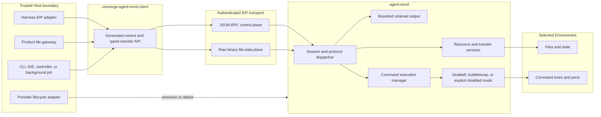
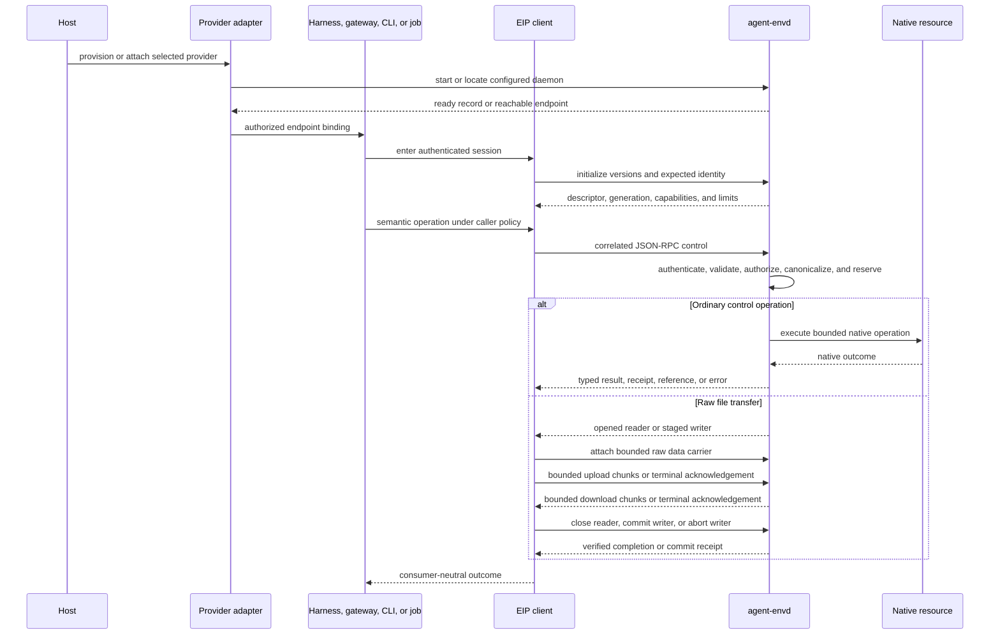

# agent-envd Overview

## Design Position

`agent-envd` is a first-class, client-neutral Environment host and data-plane daemon. One daemon process serves one user and one Environment for one daemon generation. It keeps native filesystem canonicalization and transfer, command and process control, port observation, retained output, and resource enforcement beside the governed resources and exposes them through one versioned Environment Interaction Protocol (EIP).

The Harness is one EIP client, not the reason file and process capabilities exist. Foundation or product file gateways, CLIs and IDEs, provider controllers, and trusted background jobs can use the same low-level client and protocol. Envd does not know whether bytes will become model input, a browser preview, a user download, an upload, or another backend operation.

The daemon is not mandatory for every Harness Environment. Direct `LocalFileOperator` and `LocalShell` implementations are first-class for an embedding process that intentionally grants local roots and commands. Docker, E2B, remote, and optional local-daemon providers use EIP when they need a daemon boundary. Both implementations satisfy the provider-neutral contracts owned by [Harness Environment Integration](../agent-harness/08-environment-integration.md); they are peers rather than fallback paths.

`agent-envd` is also not a container or VM manager. A provider adapter provisions, attaches, suspends, and destroys its native resource before it creates a fresh EIP-backed binding. The daemon governs operations inside the selected Environment. It can additionally contain each command tree with [OS-native execution isolation](07-execution-isolation.md), or explicitly leave containment to an outer sandbox while preserving all other daemon enforcement.

## Architecture

A single EIP session uses one transport. An envd network listener can admit both HTTP and WebSocket sessions when both profiles are enabled, but transport choice never changes method semantics.

## Boundaries

| Concern                                                             | Owner                                                                                  | Contract                                                                           |
| ------------------------------------------------------------------- | -------------------------------------------------------------------------------------- | ---------------------------------------------------------------------------------- |
| Provider and deployment selection                                   | Host                                                                                   | Selects direct local, optional local daemon, Docker, E2B, or another provider      |
| Provision, attach, suspend, destroy, and vendor credentials         | Provider adapter                                                                       | Vendor-specific lifecycle outside EIP data-plane methods                           |
| Harness run identity, topology, and binding ceiling                 | Host and Harness                                                                       | Fresh run bindings and provider-neutral routing                                    |
| Product-user authentication and scoped browser file access          | Product or Foundation gateway                                                          | Server-side EIP proxy; envd credential never reaches browser                       |
| Harness-to-EIP adaptation                                           | [Harness Environment Integration](../agent-harness/08-environment-integration.md)      | One provider-neutral consumer of the generated client                              |
| IDL, generated wire surfaces, and low-level Python client           | [Protocol Source, Client, and Generation](08-protocol-source-client-and-generation.md) | Reusable daemon/client protocol realization and release group                      |
| EIP control, transfer, result, and receipt semantics                | [EIP Protocol](02-eip-protocol.md)                                                     | JSON-RPC control plus correlated raw file data                                     |
| Framing, peer authentication, data attachment, sessions, liveness   | [Transports and Sessions](03-transports-and-sessions.md)                               | Stdio, HTTP, and WebSocket profiles                                                |
| Native paths, text operations, raw file transfer, search, and ports | [Resource Operations](04-resource-operations.md)                                       | Canonical resource enforcement inside the selected Environment                     |
| Initial commands and process trees                                  | [Command and Process Execution](05-command-and-process-execution.md)                   | One foreground/background lifecycle and ownership model                            |
| Per-operation and aggregate output safety                           | [Output Retention](06-output-retention.md)                                             | Producer-side counting, bounded response and storage, cursors, release, and expiry |
| Inner command containment                                           | [Execution Isolation](07-execution-isolation.md)                                       | Fail-closed native isolation or explicit delegation to an outer sandbox            |
| Durable Agent execution and completion                              | Host                                                                                   | Never inferred from an EIP response, receipt, process exit, or connection state    |

`agent-envd` is not an Agent runtime, scheduler, model gateway, tool registry, durable execution store, provider marketplace, product policy engine, or human-facing terminal. EIP does not own Presets, Agent definitions, model calls, Pydantic AI tool dispatch, delegation scheduling, provider billing, or Foundation Service lifecycle records.

## Major Components

### Daemon boundary

The [daemon lifecycle](01-daemon-lifecycle-and-configuration.md) validates trusted configuration, establishes Environment identity and generation, initializes resource stores, runs the production isolation probe when required, binds the selected transport, and only then reports readiness. Configuration that defines authority or security posture is immutable for one daemon generation.

### Protocol source and client

One canonical Protobuf descriptor generates Rust daemon models/dispatch and the `converge-agent-envd-client` Python models, codecs, registry, and typed method stubs. A small shared client runtime owns stdio, HTTP, and WebSocket sessions. The Harness directly adapts its Environment protocols to that client without duplicating wire types or introducing another adapter package.

### Session and protocol dispatcher

The authenticated transport creates an uninitialized connection or HTTP logical session. The first EIP operation negotiates a protocol version, verifies the expected Environment identity, and publishes a descriptor with observed capabilities and hard limits. The dispatcher validates envelopes and operation context, checks session authority and generation, applies admission limits, and invokes one semantic resource operation.

### Resource services

Filesystem operations use logical mount-scoped paths, not host paths. Strict UTF-8 text conveniences remain bounded JSON operations, while exact raw content uses session-scoped readers and privately staged writers over the binary data plane. Only an integrity-checked writer commit changes a destination. Port operations observe or wait for local listeners but do not provision provider ingress. Native files remain ordinary Environment state across daemon restarts; EIP does not export or restore daemon runtime registries.

### Command execution manager

One execution manager is the sole native owner of every command tree created by `shell.exec` or `process.start`. Both methods use one transactional start pipeline and produce the same typed status and cleanup facts. Background process records are EIP-visible projections over manager-owned executions, not a second native process owner.

### Output retention

Every retained-output producer uses either an explicit finite protocol-native `OutputPolicy` or the generous finite default advertised by the daemon. The daemon counts bytes while producing command output and structured results, keeps frames bounded, reserves daemon-global capacity before retaining data, and reports truncation or gaps explicitly. Raw file transfer has its own bounded, backpressured lifecycle and staging quotas rather than pretending a native file is retained output. Envd never materializes an unbounded command, text page, directory, search result, or transferred file in memory and then applies policy afterward.

### Native execution isolation

In `required` mode, each command tree enters Linux bubblewrap or macOS Seatbelt before the requested executable can run. Startup fails if the production backend probe fails. In explicit `disabled` mode, the same transactional manager and lifecycle cleanup remain in use, but the command executes with the authority made available by the outer sandbox or native host. There is no automatic or best-effort fallback.

## Provider Profiles

| Profile               | Provider-adapter responsibility                                                                                  | Envd posture                                                                                              |
| --------------------- | ---------------------------------------------------------------------------------------------------------------- | --------------------------------------------------------------------------------------------------------- |
| Optional local daemon | Starts or attaches envd with explicit roots, transport, credentials, and isolation mode                          | Defaults to required inner isolation on supported user-machine targets                                    |
| Docker or OCI sandbox | Creates or attaches the container, injects non-vendor envd configuration, and establishes an authenticated route | Inner isolation is explicitly required or disabled; disabled means the container runtime owns containment |
| E2B or remote sandbox | Uses vendor APIs outside the target to provision or resume the Environment and bootstrap a compatible daemon     | Usually explicitly disabled when the remote sandbox already owns containment                              |
| Remote machine        | Establishes a protected route and verifies Environment identity and protocol compatibility                       | Required unless another documented outer boundary owns command containment                                |

Provider lifecycle credentials such as an E2B key, Docker host credential, or cloud control-plane token remain exclusively in the Host adapter. Envd receives only its own independent transport secret and configured Environment authority. Provider profile identity can appear in trusted Host metadata, but EIP method behavior never branches on labels such as `local`, `docker`, or `e2b`.

Provisioning and EIP initialization are separate completion boundaries. A vendor resource is not usable until a compatible daemon session is authenticated and initialized. Conversely, a successful EIP operation does not commit vendor billing state or Host durable execution state.

## End-to-End Flow

Initialization returns observed capabilities, not authority. The client must already possess a trusted transport credential or parent-process channel, and each operation remains subject to daemon policy. Provider denial can only narrow a Harness allow decision.

A descriptor refresh or reconnect can reveal a different generation or narrower capability set. The Host and Harness reconcile that observation before further use. Handles, operation records, receipts, cursors, and retained references never move between generations or provider resources.

## Identity, Lifetime, and Completion Boundaries

The Host supplies the stable `environment_id` for the selected provider Environment. Each daemon start creates a fresh unpredictable nonzero `generation`; it is an incarnation fence, not a recovery sequence or ordering signal. An envd client can be independent of an Agent run, but it still receives endpoint authority from a trusted Host boundary rather than inventing Environment identity or scope from user input.

Four lifetime classes remain separate:

1. **Provider lifecycle state** belongs to the Host adapter and can identify a Docker container, E2B environment, local daemon instance, or remote resource. It is consumed before a fresh binding is constructed.
2. **Native Environment state** consists primarily of files and other provider-owned resources. It can outlive envd without becoming an EIP state object.
3. **Daemon-generation state** contains sessions, operation-owned receipt/idempotency evidence, process handles, output references, cursors, and private spool data. File readers and pre-handoff writers have a still narrower session sub-lifetime. Staged candidates live only beneath pinned, caller-inaccessible per-mount roots and remain conservatively owned until commit or confirmed deletion. All protocol state is volatile and is not restored after restart; recognizable stale staging artifacts are scavenged before staged-write readiness rather than becoming Environment files.
4. **Host execution state** owns durable Agent attempts, checkpoints, outcomes, and delivery. It is never committed by envd.

A native operation can have several independent facts: accepted by envd, dispatched to the OS, initial command exec confirmed, initial command exited, command tree cleaned, EIP result observed, Harness run completed, and Host execution committed. A generation-scoped receipt records only the envd facts it names.

## Security Posture

Transport authentication, protocol authorization, resource policy, output bounds, process ownership, and command containment are separate controls:

- HTTP and WebSocket require an envd-specific API key supplied to the daemon through its process environment and never through CLI arguments or EIP payloads.
- A product gateway keeps that key and all EIP selectors server-side; browser identity, path policy, MIME handling, and user-facing delivery remain product responsibilities.
- Stdio relies on the security of the parent-created pipes and daemon configuration; unrelated local principals must not be able to attach to them.
- Native file and process checks remain active in every isolation mode.
- `required` execution isolation adds a per-command OS sandbox.
- `disabled` execution isolation delegates command containment to the outer host but does not disable any other control.

The daemon API key, transport session values, daemon configuration, and business credentials are distinct. Daemon secrets are removed from child environments and excluded from logs, errors, descriptors, output previews, and receipts.

## Failure Model

Failures preserve the boundary at which certainty was lost:

| Boundary                                                         | Outcome                                                                                                                           |
| ---------------------------------------------------------------- | --------------------------------------------------------------------------------------------------------------------------------- |
| Configuration, required isolation probe, or bind fails           | Daemon never reports ready and admits no EIP session                                                                              |
| Transport authentication or initialization fails                 | No initialized session and no method dispatch                                                                                     |
| Validation, authorization, capability, or canonicalization fails | Typed pre-dispatch error; no native side effect                                                                                   |
| Transport fails before dispatch is established                   | Client may retry only when non-dispatch is proven                                                                                 |
| File data carrier ends before terminal consumer acceptance       | Reader completes with no digest or pre-handoff writer aborts; connection loss is never verified EOF or commit                     |
| Transport fails after possible mutation dispatch                 | Outcome remains unknown until receipt, idempotency, or resource reconciliation provides evidence                                  |
| Deadline or cancellation races native work                       | Result distinguishes cancelled, timed out, completed, or unknown from available provider evidence                                 |
| Output exceeds policy                                            | Bounded failure, explicit truncation, or bounded retained reference according to `OutputPolicy`; side effects are not rewritten   |
| Generation, handle, cursor, or output reference is stale         | Typed stale or retention-gap error; no silent retargeting                                                                         |
| Daemon shutdown begins                                           | New admission stops, active work is boundedly drained or terminated, and native command trees remain daemon-owned through cleanup |

Transport loss, timeout, or connection close is never proof that an accepted mutation did not occur. Likewise, a command exit is not proof that its full process tree is cleaned until the cleanup outcome says so.

## Trade-offs

### First-class daemon without mandatory daemon

A daemon adds a process, protocol, and compatibility boundary where native or remote enforcement requires it. Keeping it optional avoids forcing trusted embedded local operations through unnecessary RPC while shared provider-neutral semantics and conformance fixtures prevent model-facing divergence.

### Inspectable control plus raw file data

JSON-RPC keeps authority, lifecycle, errors, and completion evidence inspectable and shared across stdio, HTTP, and WebSocket. Raw file bytes use a correlated binary carrier to avoid base64 expansion, whole-value JSON allocation, and range-loop round trips. This adds transfer state, terminal consumer acknowledgement, private per-mount staging, and backpressure conformance, but keeps one semantic reader/writer lifecycle across carriers and leaves retained process output as a separate resource.

### Provider-local semantic operations

Provider-local search, patching, canonicalization, command control, and retention make envd richer than a syscall proxy. They keep races, path semantics, quotas, and cleanup at the resource boundary and avoid excessive round trips.

### Optional inner isolation

Fail-closed native isolation protects direct user-machine deployments. Explicitly disabling only that layer avoids nested sandbox incompatibility and overhead where a container or remote sandbox already owns containment. The cost is that deployment configuration must state the boundary honestly; envd never infers it.

## Invariants

01. The Harness reaches daemon-governed resources only through its provider-neutral Environment abstraction and direct EIP adapter over `converge-agent-envd-client`; it imports no envd implementation, Docker, E2B, or remote-vendor execution semantics into model-facing tools.
02. Every daemon-backed provider makes a compatible, authenticated envd endpoint available before producing a binding; direct-local providers require no daemon.
03. Stdio, HTTP, and WebSocket carry one EIP control and file-transfer contract with identical method, lifecycle, integrity, error, side-effect, and compatibility semantics.
04. Transport authentication and Host routing never replace daemon-side canonicalization, generation fencing, authorization, quotas, or resource enforcement.
05. `shell.exec` and `process.start` cross one transactional execution manager, and one owner controls every native command tree through cleanup.
06. `required` execution isolation fails closed; `disabled` is explicit and cannot result from probing, platform detection, test mode, or transport selection.
07. Disabling inner isolation does not disable authentication, EIP file and cwd policy, environment filtering, process ownership, output bounds, quotas, or cleanup; the outer sandbox then owns the child's actual host-resource containment.
08. Every producer is bounded while bytes are produced: retained output uses finite aggregate byte/object quotas, while file transfer uses finite frame, active-transfer, caller-inaccessible staging, file-size, idle, and duration limits; physical staging usage remains charged until commit or confirmed deletion.
09. Provider lifecycle credentials never enter envd; the envd transport key never enters commands, model data, EIP payloads, or logs.
10. Handles, descriptors, cursors, references, and receipts are non-authoritative selectors scoped to Environment identity and one daemon generation; file transfer handles are additionally session-scoped, and none survives daemon restart.
11. Reader or writer transport loss is never terminal consumer acceptance; before commit handoff it preserves the destination, while loss during or after handoff cannot resolve the mutation without operation-owned receipt or idempotency evidence.
12. One canonical IDL generates daemon and client wire surfaces; neither language maintains an editable parallel method catalog.
13. The Foundation Service owns no Sandbox domain and never interprets provider-native Environment state.
14. Envd is a client-neutral Environment host; it never receives product-user identity, browser credentials, model-media semantics, or arbitrary URL-fetch authority through the base EIP contract.
