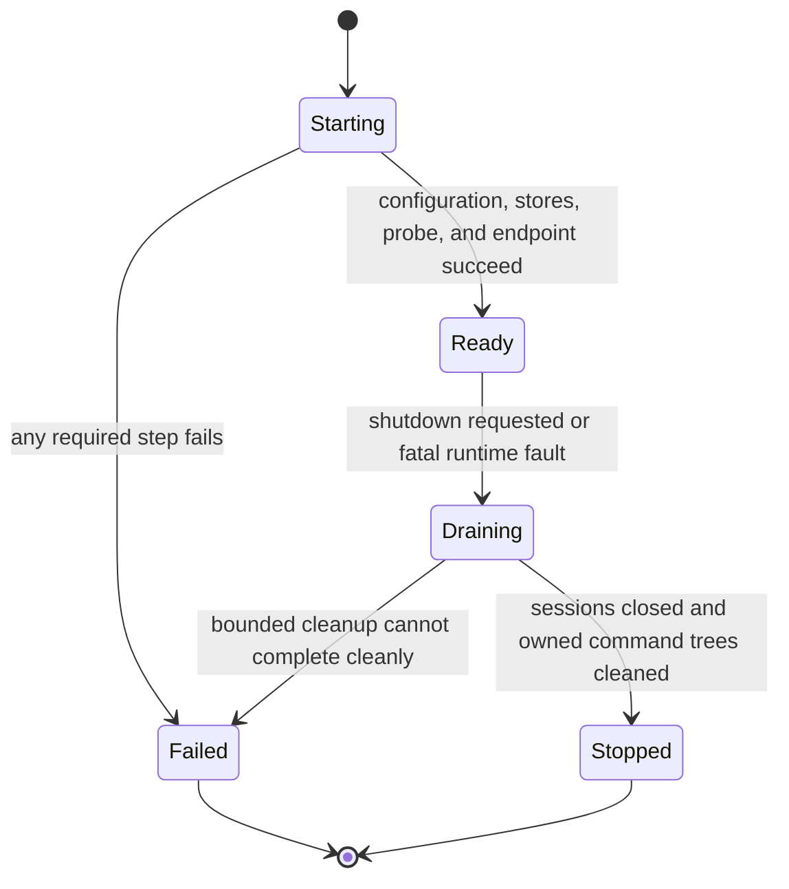

# Daemon Lifecycle and Configuration

## Design Position

`agent-envd` is one authority-bearing daemon for one user, one Environment identity, and one process generation. It validates all trusted bootstrap configuration, prepares volatile resource stores and command execution, binds its own network listener when selected, and reports readiness only after every required enforcement component is usable.

Bootstrap configuration is operator or provider-adapter input. Ordinary EIP requests can select only resources and behavior already permitted by that immutable configuration; they cannot change mount roots, transport authentication, isolation mode, protected paths, hard quotas, or Environment identity.

## Boundaries

| Concern                                                                                       | Owner                                                    | Relationship                                           |
| --------------------------------------------------------------------------------------------- | -------------------------------------------------------- | ------------------------------------------------------ |
| Provider resource creation and lifecycle credential                                           | Host provider adapter                                    | Completes before envd data-plane admission             |
| Envd executable, trusted configuration, process environment, and endpoint exposure            | Operator or provider adapter                             | Launches envd inside the selected Environment boundary |
| Configuration validation, native stores, listener bind, readiness, drain, and command cleanup | `agent-envd`                                             | One daemon lifecycle                                   |
| EIP initialization and logical sessions                                                       | [Transports and Sessions](03-transports-and-sessions.md) | Begin only after daemon readiness                      |
| Harness run and durable execution lifecycle                                                   | Harness and Host                                         | Independent of daemon process lifecycle                |

A daemon process is not a Host execution attempt. One ready daemon can serve multiple sequential or concurrent authenticated EIP sessions for the same configured user within daemon-global ceilings. A session is a protocol carrier, not a tenant, principal, or run. It owns only the ephemeral lifetime of its file readers, pre-handoff writers, and data attachments; it does not own generation-scoped processes, operations, receipts, or retained output. Another user or mutually untrusted workload requires another daemon instance, API key, runtime root, and provider binding.

## Trusted Configuration

The following conceptual schema defines the stable configuration classes. It is not the CLI parser or a serialized EIP schema.

```python
type EndpointMode = Literal["stdio", "network"]
type ExecutionIsolationMode = Literal["required", "disabled"]
type ExecutionNetworkMode = Literal["host", "deny"]


class NetworkEndpointConfig(BaseModel):
    listen_address: str
    http_enabled: bool = True
    websocket_enabled: bool = True
    api_key: SecretStr
    allowed_origins: tuple[str, ...] = ()
    tls_terminated_by_trusted_peer: bool = False


class DaemonLimits(BaseModel):
    max_request_bytes: int
    max_response_bytes: int
    max_transfer_frame_bytes: int
    max_concurrent_operations: int
    max_concurrent_file_transfers: int
    max_file_transfer_records: int
    file_transfer_record_ttl_ms: int
    max_staged_file_bytes: int
    max_staged_file_objects: int
    staging_scavenge_timeout_ms: int
    file_transfer_idle_ttl_ms: int
    max_file_transfer_duration_ms: int
    max_pending_operations: int
    max_sessions: int
    session_idle_ttl_ms: int
    max_processes: int
    max_process_records: int
    terminal_process_record_ttl_ms: int
    max_operation_duration_ms: int
    max_inline_output_bytes: int
    max_output_bytes: int
    max_retained_bytes: int
    max_retained_objects: int
    default_retention_ttl_ms: int
    max_retention_ttl_ms: int
    max_operation_records: int
    operation_record_ttl_ms: int


class DaemonConfig(BaseModel):
    environment_id: str
    runtime_directory: str | None
    endpoint_mode: EndpointMode
    network: NetworkEndpointConfig | None
    mounts: tuple[TrustedMountConfig, ...]
    executable_search_roots: tuple[str, ...]
    shell_profiles: tuple[TrustedShellProfile, ...]
    limits: DaemonLimits
    execution_isolation: ExecutionIsolationMode = "required"
    execution_network: ExecutionNetworkMode = "host"
    execution_extra_read_only_paths: tuple[str, ...] = ()
    payload_uid: int | None = None
    payload_gid: int | None = None
```

All numeric limits are positive and finite. `max_processes` does not exceed `max_process_records`, `max_concurrent_operations` does not exceed `max_operation_records`, `max_concurrent_file_transfers` does not exceed `max_file_transfer_records`, and `max_inline_output_bytes` does not exceed `max_output_bytes`. `max_transfer_frame_bytes` leaves room for the fixed header and maximum permitted handle and cannot exceed the fixed header field widths. Daemon-global retained-byte, retained-object, request-size, response-size, transfer-frame, active-transfer, transfer-record/TTL, staged-file byte/object, staging-scavenge duration, transfer-duration/idle, active-process, process-record, operation-duration, operation-record, session, and admission ceilings cannot be disabled. An EIP request can only narrow them.

Sessions receive no independent budget for generation-scoped operations, processes, receipts, or retained output. They do own finite active file-transfer records and uncommitted staged writers. Those records still count against daemon-global transfer and staging ceilings, so opening many sessions cannot multiply capacity. Staging usage remains charged while a physical candidate exists, including after a cleanup fault; quota is never returned merely because an in-memory handle was discarded.

`TrustedMountConfig` is operator-owned configuration described by [Resource Operations](04-resource-operations.md); each mount that allows staged mutation also supplies a private same-filesystem staging root outside every caller-visible mount or command grant. `TrustedShellProfile` is described by [Command and Process Execution](05-command-and-process-execution.md). `executable_search_roots` is the ordered operator-owned search list for bare `argv` executables. Native roots, staging roots, and executables are canonicalized, identity-checked, and validated against protected paths before readiness. A model, tool argument, or `initialize` request cannot add another native root, staging location, or executable.

### Configuration sources and conflicts

The executable accepts trusted configuration from an operator-selected config file, explicit non-secret CLI flags, and documented process environment variables. One effective immutable value is computed before subsystem initialization. Duplicate sources with different values fail startup rather than depending on source order for authority-bearing settings.

Secret material is never accepted through CLI arguments because process listings and service definitions can expose argv. The network API key has exactly one bootstrap source:

| Variable                                                | Requirement                                        | Meaning                                                                              |
| ------------------------------------------------------- | -------------------------------------------------- | ------------------------------------------------------------------------------------ |
| `AGENT_ENVD_API_KEY`                                    | Required for `network`; must be absent for `stdio` | High-entropy bearer secret used to authenticate HTTP requests and WebSocket upgrades |
| `AGENT_ENVD_TRANSPORT`                                  | `stdio` or `network`; default `stdio`              | Selects process-pipe framing or an envd-owned listener                               |
| `AGENT_ENVD_LISTEN_ADDRESS`                             | Network mode; default `127.0.0.1:0`                | Address passed to envd's own bind and listen operation                               |
| `AGENT_ENVD_HTTP_ENABLED`                               | Boolean; default `true` in network mode            | Enables JSON-RPC `POST /rpc` and file-data `GET/PUT /rpc/data`                       |
| `AGENT_ENVD_WEBSOCKET_ENABLED`                          | Boolean; default `true` in network mode            | Enables `GET /rpc/ws` upgrade                                                        |
| `AGENT_ENVD_ENVIRONMENT_ID`                             | Required                                           | Stable Environment identity expected by the launching provider                       |
| `AGENT_ENVD_RUNTIME_DIR`                                | Optional absolute path                             | Private generation-local spool root; never a command filesystem grant                |
| `AGENT_ENVD_EXECUTION_ISOLATION`                        | `required` or `disabled`; default `required`       | Selects envd's inner command-isolation posture                                       |
| `AGENT_ENVD_EXECUTION_NETWORK`                          | `host` or `deny`; default `host`                   | Selects command-tree IP networking when inner isolation is required                  |
| `AGENT_ENVD_EXECUTION_EXTRA_READ_ONLY_PATHS`            | JSON array of absolute path strings; default `[]`  | Adds explicit operator-trusted command runtime roots in required mode                |
| `AGENT_ENVD_EXECUTION_UID` / `AGENT_ENVD_EXECUTION_GID` | Optional paired positive Linux IDs                 | Selects a trusted final payload identity; both must be present together              |

Network mode requires at least one of `AGENT_ENVD_HTTP_ENABLED` or `AGENT_ENVD_WEBSOCKET_ENABLED` to be true. Stdio mode rejects listener, route-enable, API-key, origin, and trusted-TLS settings rather than accepting ineffective network policy.

An API key is at least 32 bytes after UTF-8 encoding, contains no surrounding whitespace or control character, and is compared in constant time. Envd cannot prove entropy from a string, so deployment tooling generates a uniformly random value rather than using a human password. Empty or malformed keys fail startup. The key is immutable for one daemon process; rotation restarts envd, creates a fresh generation, and invalidates every prior volatile selector.

`AGENT_ENVD_*` names are reserved daemon configuration. EIP command-environment input cannot override them. The daemon process environment is not inherited wholesale by child commands, and `AGENT_ENVD_API_KEY` is always removed before any supervisor, sandbox helper, or payload starts.

The endpoint can bind port `0`. In that case envd discovers the assigned port from its bound listener before reporting readiness. A provider adapter never guesses the selected port and never interprets a log line as readiness.

### Network exposure and TLS

The built-in network endpoint speaks HTTP/1.1 and WebSocket over that listener. TLS can terminate in a trusted sidecar, sandbox gateway, loopback tunnel, or provider fabric; envd does not treat a caller-controlled forwarding header as proof of TLS or identity.

A non-loopback listen address requires either:

- a listener protected end to end by a trusted private provider network or tunnel; or
- trusted TLS termination that preserves the `Authorization` header only to envd and prevents untrusted plaintext access on the terminating hop.

The API key remains mandatory in both cases. Enabling a public plaintext listener is invalid configuration. Loopback does not replace the key because other processes inside the same host or sandbox may be untrusted.

## Environment Identity and Generation

```python
class EnvironmentIdentity(BaseModel):
    environment_id: str
    generation: int
```

`environment_id` identifies the logical provider Environment and is mandatory trusted bootstrap input. The provider adapter obtains it from its own lifecycle state and supplies the same expected value to the EIP client. In stdio mode the parent must know the value before launch; envd never invents an identity and asks the parent to trust it afterward.

At every daemon start, envd generates a fresh unpredictable nonzero unsigned 64-bit `generation` with a cryptographically secure random source. It is an equality fence for volatile runtime state, not a monotonic counter, restart-recovery marker, credential, or ordering signal. Generation collision with a previous daemon incarnation must be cryptographically negligible and envd never deliberately reuses one.

A transport reconnect, logical session expiry, or new Harness run against the same daemon does not change generation. Daemon restart always creates another generation. Process handles, file transfers, operations, receipts, output references, cursors, private spool records, and idempotency records from the prior generation are invalid and are never restored or adopted. File reader/writer handles are additionally invalid after their owning session ends. A writer commit receipt can remain for generation-scoped reconciliation after the session-scoped staging handle disappears. Native files remain ordinary provider Environment state.

## Startup State Machine



Startup follows this order:

1. Parse all trusted sources and reject unknown, conflicting, malformed, or unsafe configuration.
2. Validate the configured Environment identity and create a fresh generation.
3. Canonicalize mounts, their private same-filesystem staging roots, protected paths, shell executables, private runtime spool, output retention, execution home, and temporary roots.
4. Scan each flat staging root for at most `max_staged_file_objects` recognized candidates whose summed physical sizes are at most `max_staged_file_bytes`, delete them within `staging_scavenge_timeout_ms`, and fail startup on any excess, unexpected entry shape, symlink, timeout, deletion uncertainty, or accounting uncertainty.
5. Create bounded in-memory admission, transfer/staging, operation, process, and retention stores; receipt and provider-idempotency evidence is attached to and charged by its owning operation record.
6. Initialize the configured command execution backend.
7. In `required` isolation mode, run the production backend probe against the effective filesystem and network policy.
8. For network mode, bind and listen on the configured address; for stdio, reserve stdin and stdout for EIP framing.
9. Publish one readiness record and begin session admission.

No network socket is bound and no stdio EIP frame is accepted before a required isolation probe succeeds. An unsupported platform or failed probe in `required` mode is a startup failure, not a reason to use native execution.

## Readiness and Health

### Startup readiness record

A network-mode daemon writes exactly one newline-terminated JSON readiness record to stdout after the listener is bound and every startup gate has succeeded, then closes stdout. Stderr remains the structured log stream. A provider launcher treats only that typed record from the child it started as readiness; ordinary logs are never parsed for endpoint discovery.

```json
{
  "type": "agent-envd.ready",
  "schema_version": 1,
  "environment_id": "env_01...",
  "generation": 7,
  "listen_address": "127.0.0.1:43127",
  "http_path": "/rpc",
  "http_data_path": "/rpc/data",
  "websocket_path": "/rpc/ws",
  "protocol_major_versions": [1]
}
```

Disabled routes are represented as `null`. The record contains no API key, session value, mount path, protected path, native helper location, provider credential, or process environment. The launcher validates schema, expected Environment identity, and actual child ownership before using the endpoint.

In stdio mode, stdout carries only content-length-framed EIP messages and no standalone readiness line. The parent establishes readiness by successfully completing `initialize`; startup errors go to stderr and process exit.

### Network health routes

A network endpoint exposes:

- `GET /healthz`, which returns only process liveness;
- `GET /readyz`, which returns success only in `Ready` and failure during `Starting` or `Draining`.

These routes disclose no descriptor, identity, generation, version detail, policy, metrics, or failure cause and do not create an EIP session. They are suitable for a colocated supervisor but are not proof of EIP authentication or compatibility.

## Admission and Runtime Ownership

Admission is bounded at two levels:

1. daemon-global active and pending operation counts plus logical-session count;
2. method-specific process, output, file, transfer-frame, staging, and payload limits.

Capacity is reserved before native dispatch. When no pending slot exists, envd returns a bounded `busy` error with retry guidance and performs no native work. Queue position is not durable, and a disconnected client does not retain a pending admission slot indefinitely.

One runtime coordinator owns:

- lightweight initialized protocol sessions and their idle expiry;
- session-scoped file readers, staged writers, data attachments, transfer deadlines, `awaiting_close` readers, and bounded post-close transfer records/tombstones;
- generation-unique accepted operation IDs, cancellation state, and operation-owned bounded idempotency/receipt evidence;
- one atomic domain-admission handoff from a sealed session writer to a generation-scoped commit operation;
- native command-tree ownership through the command execution manager;
- retained outputs and cursors;
- Environment generation and descriptor publication.

An active file-transfer record is never capacity-reclaimed; `max_concurrent_file_transfers <= max_file_transfer_records` guarantees one record for every admitted reader or writer. A reader remains active and non-reclaimable while open, streaming, or `awaiting_close`; a sealed writer and a staged candidate owned by a handoff-complete commit operation are also nonterminal. Only a post-close reader result, post-abort writer result, or tombstone is terminal and can be reclaimed at `file_transfer_record_ttl_ms` or oldest-terminal-first when capacity is needed. Session close can remove remaining session terminal records immediately because no later request can use them.

A staged candidate is owned through one pinned per-mount staging root and one linear lifecycle. Confirmed commit or deletion returns byte/object quota exactly once. Unlink, identity, or cleanup uncertainty keeps the physical usage charged and transitions the affected mount or daemon into cleanup fault and bounded drain; envd never advertises capacity for bytes it may still own.

A session-resource open idempotency mapping is attached to its live transfer record and counts under `max_file_transfer_records`; it disappears with that record or session. A terminal operation record owns its canonical request digest, optional provider-idempotency mapping, bounded result, and receipt selector/evidence. All of those count as one `max_operation_records` entry and share `operation_record_ttl_ms` plus oldest-terminal-first capacity reclamation. There is no independent unbounded receipt or idempotency store and no guaranteed minimum retention under capacity pressure. Missing reclaimed evidence never proves that native dispatch or mutation did not occur.

An EIP-visible process or output record never independently owns the corresponding native resource. This single ownership rule prevents duplicate cleanup, conflicting status, and detached native children.

## Draining and Shutdown

Shutdown begins from an operator signal, parent-process loss in stdio mode, explicit administrative lifecycle action outside ordinary EIP methods, or an unrecoverable daemon fault. EIP clients cannot request process-wide shutdown through the Environment method catalog.

The daemon then:

01. enters `Draining` atomically and refuses new sessions and operations;
02. permits already completed results to drain within response deadlines;
03. requests cancellation of accepted foreground operations;
04. closes every file reader and aborts every writer whose candidate remains session-owned;
05. lets a handoff-complete commit operation finish or preserve unknown-outcome evidence within the bounded drain budget;
06. closes every daemon-owned process stdin and output writer;
07. terminates every non-terminal command tree using the strongest backend cleanup operation;
08. waits within a finite daemon shutdown budget and records each cleanup outcome;
09. deletes generation-local transfer, staging, output, and volatile registry state, retaining conservative fault evidence if physical cleanup cannot be proven;
10. closes transports and exits.

No process is contractually allowed to outlive envd shutdown. A provider that needs background work to survive a client disconnect or Harness run keeps the same envd generation alive. Provider adapter teardown remains a separate Host action after daemon cleanup or loss.

If cleanup cannot prove complete teardown, envd exits nonzero and exposes bounded diagnostics to its supervisor. On Linux required isolation, namespace teardown normally proves completeness. On macOS, a surviving descendant can be reported as `residual_confined` because Seatbelt remains inherited even when complete process-tree observation is unavailable. Native disabled mode cannot claim confinement and therefore treats unproven residuals as cleanup failure.

## Observability

Structured daemon logs and metrics describe control-plane facts without copying request or output content by default.

Safe dimensions include:

- daemon version, protocol major, transport profile, and lifecycle state;
- Environment identity hash or approved opaque correlation, never native roots;
- isolation mode, backend class, network policy, and probe outcome class;
- method family, operation outcome, dispatch stage, duration, and bounded byte counts;
- active and pending operations, file transfers, staged bytes/objects, processes, retained bytes/objects, and quota denials;
- process termination reason and cleanup outcome;
- transport authentication, initialization, protocol, frame, and logical-session expiry outcome classes.

Logs and metrics exclude API keys, authorization headers, session values, transfer handles, full commands, request environments, file contents, output content, native private paths, generated isolation profiles, helper paths, and protected-path names. A content-enabled diagnostic policy is a separate trusted operator choice and still never includes credentials.

The EIP descriptor exposes non-secret posture and limits required by clients. It reports whether envd inner isolation and network isolation are active, but it cannot infer or represent the strength of an outer container, VM, or provider sandbox.

## Failure Semantics

| Failure                                     | State and observable result                                                           |
| ------------------------------------------- | ------------------------------------------------------------------------------------- |
| Invalid or conflicting configuration        | Exit nonzero before readiness; no listener admission                                  |
| Missing or invalid network API key          | Exit nonzero before bind                                                              |
| Required isolation backend or probe failure | Exit nonzero before bind or stdio initialization                                      |
| Listen failure                              | Exit nonzero; no ready record                                                         |
| Ready-record delivery fails                 | Treat startup as failed and drain the bound listener                                  |
| Runtime admission exhausted                 | Typed pre-dispatch `busy` error; no native work                                       |
| Transfer or staging quota exhausted         | Typed `busy` or `quota_exceeded`; no unbounded buffering or target mutation           |
| Private runtime spool cannot be created     | Exit before readiness; no generation-local objects are admitted                       |
| Fatal runtime ownership inconsistency       | Enter `Draining`, stop admission, clean owned trees, and exit nonzero                 |
| Shutdown cleanup incomplete                 | Exit nonzero with safe supervisor diagnostics; never report normal stopped completion |

## Compatibility

Readiness-record schema, configuration names, EIP protocol versions, and daemon package versions are independent compatibility axes. Additive optional readiness fields are compatible; changing a field meaning, stdout framing, route path, secret source, or ready timing requires a schema or package compatibility change.

A configuration parser rejects unknown authority-bearing fields by default. This prevents a misspelled security option from silently taking its default. A deployment migration explicitly updates the accepted config schema and restarts the daemon; live EIP requests never migrate daemon policy.

## Invariants

01. Envd reports ready only after trusted configuration, stores, required isolation probe, and endpoint setup all succeed.
02. Network mode always uses an envd-bound listener and an API key obtained only from `AGENT_ENVD_API_KEY`.
03. An envd API key never appears in argv, readiness, EIP payloads, descriptors, state, logs, metrics, or child environments.
04. Authority-bearing daemon configuration is immutable for one generation and cannot be changed through EIP.
05. Every daemon, request, data-frame, transfer, staging, and retained-output limit is finite; request input can only narrow an effective limit.
06. One runtime coordinator owns sessions, file transfers, atomic commit handoff, operation-owned receipt/idempotency evidence, retained objects, staging cleanup, and command-tree lifecycle; only pre-handoff file transfers are session-owned.
07. `required` isolation probes before transport admission; failed probing never selects `disabled`.
08. Port `0` is resolved from the bound socket and communicated only through the typed readiness record.
09. Shutdown stops admission before cleanup and leaves no command contractually allowed to survive the daemon.
10. Health and readiness endpoints reveal no identity, version, policy, or secret and do not create protocol sessions.
