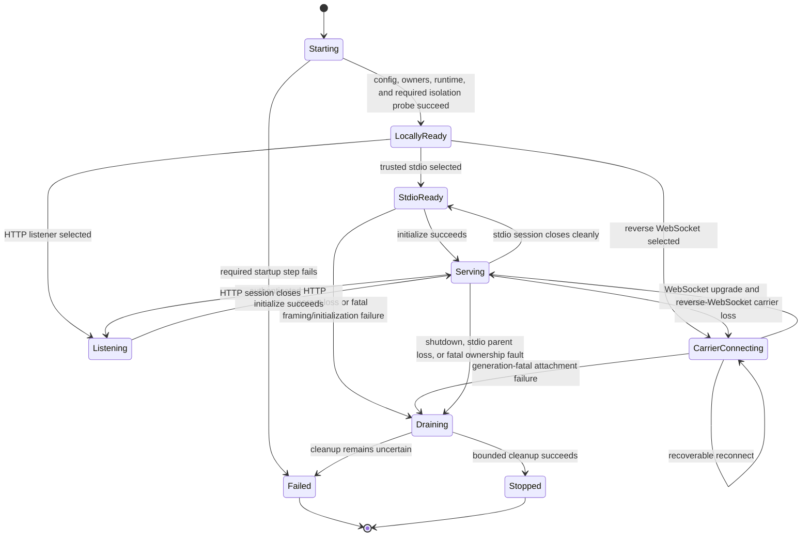

# Daemon Lifecycle and Configuration

## Design Position

`agent-envd` is one authority-bearing daemon for one user, one Environment identity, and one process generation. It validates trusted bootstrap configuration, creates fresh generation-private runtime state, initializes resource owners and command isolation, and admits EIP only after every required enforcement component is usable.

A daemon uses trusted stdio, Host-dialed HTTP, or outbound reverse WebSocket. HTTP binds one dedicated authenticated EIP listener; reverse WebSocket makes envd the carrier dialer. Neither network profile exposes a browser, generic HTTP, inbound WebSocket, health, or readiness API.

Bootstrap configuration is operator or provider-adapter input. EIP requests can use only configured mounts, methods, profiles, limits, and isolation posture. They cannot change Environment identity, native roots, carrier endpoint/credentials, hard quotas, isolation mode, protected paths, or daemon generation.

## Boundaries

| Concern                                                                                                     | Owner                                                    | Relationship                                  |
| ----------------------------------------------------------------------------------------------------------- | -------------------------------------------------------- | --------------------------------------------- |
| Current state, lifecycle policy, credentials, endpoint routing, and attachment-token issuance               | Host and fresh Provider-specific Environment adapter     | Completes trusted bootstrap                   |
| Envd executable, configuration, protected bootstrap inputs, and process lifecycle                           | Operator or provider adapter                             | Launches envd inside the selected Environment |
| Configuration validation, generation, resource owners, isolation probe, carrier startup, drain, and cleanup | `agent-envd`                                             | One daemon lifecycle                          |
| Carrier framing, HTTP listener, reverse-WebSocket handshake/reconnect, EIP Session, and readiness operation | [Transports and Sessions](03-transports-and-sessions.md) | Begins only after daemon bootstrap            |
| Harness run and durable execution lifecycle                                                                 | Harness and Host                                         | Independent of daemon process lifetime        |

One ready daemon admits at most one active initialized EIP session and can then serve fresh sequential sessions over its selected carrier while retaining generation-owned resources. A session is a protocol carrier, not a tenant, principal, or run. Another user, mutually untrusted workload, or concurrent independent session requires another daemon instance, runtime root, bootstrap binding, and backing-target boundary.

## Trusted Configuration

The following conceptual schema defines stable configuration classes. It is not the CLI parser or EIP wire shape.

```python
type TransportMode = Literal["stdio", "http", "reverse_websocket"]
type ExecutionIsolationMode = Literal["required", "disabled"]
type ExecutionNetworkMode = Literal["host", "deny"]


class HttpListenerConfig(BaseModel):
    bind_host: str
    bind_port: int
    credential_file: str
    tls_certificate_file: str | None = None
    tls_private_key_file: str | None = None
    plaintext_scope: Literal["loopback", "provider_private_link"] | None = None


class ReverseWebSocketConfig(BaseModel):
    endpoint: str
    credential_file: str
    tls_ca_file: str | None = None


class DaemonLimits(BaseModel):
    max_request_bytes: int
    max_response_bytes: int
    max_transfer_frame_bytes: int
    max_concurrent_operations: int
    max_concurrent_file_transfers: int
    max_file_transfer_bytes: int
    max_processes: int
    max_operation_duration_ms: int
    max_output_preview_bytes: int
    max_output_bytes_per_stream: int
    max_spool_bytes: int


class DaemonConfig(BaseModel):
    environment_id: str
    runtime_directory: str
    transport: TransportMode
    http: HttpListenerConfig | None
    reverse_websocket: ReverseWebSocketConfig | None
    root_mount_id: str | None
    mounts: tuple[TrustedMountConfig, ...]
    executable_search_roots: tuple[str, ...]
    shell_profiles: tuple[TrustedShellProfile, ...]
    limits: DaemonLimits
    execution_isolation: ExecutionIsolationMode = "required"
    execution_network: ExecutionNetworkMode = "host"
    execution_extra_read_only_paths: tuple[str, ...] = ()
    payload_uid: int | None = None
    payload_gid: int | None = None
```

All numeric limits are positive and finite. Connection, initialization, liveness, reconnect, transfer, and shutdown timing is also finite internal policy owned by the relevant lifecycle or transport contract rather than a separate compatibility surface. `max_spool_bytes` is at least twice `max_output_bytes_per_stream`, so one command can reserve both streams. `max_response_bytes` leaves room for both base64-encoded stream previews and the largest valid command-result envelope at `max_output_preview_bytes`. The wire-visible `EIPLimits` contains only values a client needs to construct work and therefore omits the daemon-wide spool ceiling. Envd also bounds session, operation-record, process-record, transfer, staging, spool-record, queue, and shutdown resources internally; those implementation limits are not separate protocol features. Exhaustion returns `busy` or `quota_exceeded` before unsafe allocation.

`max_output_bytes_per_stream` is reserved independently for stdout and stderr before one command starts, and `max_output_preview_bytes` bounds each stream preview. `max_spool_bytes` is the finite daemon-wide spool disk ceiling. Existing output and process records are not evicted to admit new work; callers reclaim them explicitly.

## Configured Mounts and Executables

`TrustedMountConfig` is owned by [Resource Operations](04-resource-operations.md). Every native root is operator-provided, canonicalized, checked against protected paths, and opened or fixed through the strongest platform-relative authority before local readiness. The provider keeps the containing directory stable during bootstrap. Envd never synthesizes a server-filesystem view and never accepts a root from EIP.

`root_mount_id` is optional with zero mounts, can be inferred only when exactly one mount exists, and is required with multiple mounts when Environment-relative routing needs a default. It must identify exactly one configured mount.

A deliberate whole-filesystem configuration uses ordinary mounts, for example `/` on POSIX or explicit Windows volume roots. Such a root can physically contain the generation runtime, so startup admits it only when the EIP resource resolver can subtract every protected runtime root with capability-relative, no-follow enforcement. Required command isolation independently subtracts the same roots from payload authority and proves that projection in its production probe. Failure of either layer fails startup rather than exposing daemon state or silently narrowing the configured mount.

Executable search roots and shell profiles are trusted canonical configuration defined by [Command and Process Execution](05-command-and-process-execution.md). Typed executable paths resolve through configured mounts. Models and ordinary request fields cannot add search roots, native paths, shell helpers, or platform capabilities.

## Configuration Sources and Secrets

The executable accepts trusted configuration from an operator-selected file, explicit non-secret CLI values, documented process environment, and a provider-created private bootstrap channel. One effective immutable value is computed before owner initialization. For execution policy, documented environment values override the corresponding strict JSON `execution` fields, which override the defaults; the complete merged policy is canonicalized and validated once before owner initialization.

The optional JSON `execution` object contains `isolation`, `network`, and `extra_read_only_paths` with the same values and defaults as the environment settings below. Unknown fields fail startup. The packaged sandbox container image explicitly sets `AGENT_ENVD_EXECUTION_ISOLATION=disabled` because that image delegates child containment to its outer container boundary; the standalone binary does not change its `required` default.

Stable non-secret environment configuration includes:

| Variable                                                         | Values/requirement                                                 | Meaning                                                             |
| ---------------------------------------------------------------- | ------------------------------------------------------------------ | ------------------------------------------------------------------- |
| `AGENT_ENVD_ENVIRONMENT_ID`                                      | Required                                                           | Stable provider Environment identity                                |
| `AGENT_ENVD_TRANSPORT`                                           | `stdio`, `http`, or `reverse_websocket`; default `stdio`           | Selects the carrier profile                                         |
| `AGENT_ENVD_HTTP_BIND`                                           | Required only for HTTP                                             | Dedicated listener host and port                                    |
| `AGENT_ENVD_HTTP_CREDENTIAL_FILE`                                | Required only for HTTP                                             | Protected bootstrap Bearer-token file                               |
| `AGENT_ENVD_HTTP_TLS_CERT_FILE` / `AGENT_ENVD_HTTP_TLS_KEY_FILE` | Optional paired PEM files                                          | Envd-native custom HTTPS identity                                   |
| `AGENT_ENVD_HTTP_PLAINTEXT_SCOPE`                                | `loopback` or `provider_private_link`; required without native TLS | Permits a trusted plaintext listener, including behind provider TLS |
| `AGENT_ENVD_REVERSE_WS_URL`                                      | Required only for reverse WebSocket                                | Normalized outbound `ws://` or `wss://` endpoint                    |
| `AGENT_ENVD_REVERSE_WS_CREDENTIAL_FILE`                          | Required only for reverse WebSocket                                | Absolute path to the protected Bearer token file                    |
| `AGENT_ENVD_REVERSE_WS_CA_FILE`                                  | Optional absolute PEM file for `wss`                               | Additional operator-trusted certificate roots                       |
| `AGENT_ENVD_RUNTIME_DIR`                                         | Required absolute path                                             | Parent for fresh generation-private runtime state                   |
| `AGENT_ENVD_EXECUTION_ISOLATION`                                 | `required` or `disabled`; default `required`                       | Selects envd inner command isolation                                |
| `AGENT_ENVD_EXECUTION_NETWORK`                                   | `host` or `deny`; default `host`                                   | Selects required-backend network ceiling                            |
| `AGENT_ENVD_EXECUTION_EXTRA_READ_ONLY_PATHS`                     | JSON array; default `[]`                                           | Adds trusted command runtime roots                                  |
| `AGENT_ENVD_EXECUTION_UID` / `AGENT_ENVD_EXECUTION_GID`          | Optional paired positive Linux IDs                                 | Selects trusted final Linux payload identity                        |

The runtime parent is required on every platform and carrier profile because generation-private spool, control, probe, and connector state is unconditional. Envd does not derive an authority-bearing parent from the ambient current directory, user home, or platform temporary-directory environment. The provider creates and protects the parent before launch; envd creates a fresh unpredictable generation child and validates ownership, permissions or ACLs, and no-link/reparse shape before use.

Envd starts its selected carrier only after configuration, generation-private runtime state, resource owners, and required command isolation are usable. Providers establish externally observable readiness through the mandatory EIP initialize/readiness sequence while concurrently observing process or carrier failure; envd creates no readiness marker and exposes no separate readiness endpoint.

Each network profile requires a provider-owned short-lived attachment token stored in the regular file selected by its profile-specific `*_CREDENTIAL_FILE` setting. The path is non-secret trusted bootstrap configuration; it is absolute and must identify a non-symlink regular file. Envd reads one bounded non-empty token before network admission or a connection attempt, removes one optional trailing line ending, and rejects whitespace or control characters. A missing, unreadable, empty, malformed, or oversized configured token is generation-fatal. The provider can replace the protected reverse-WebSocket token file before a later reconnect attempt, but an upgrade `401` or `403` is immediately generation-fatal rather than triggering unauthenticated retry or an in-process refresh protocol.

The token is not accepted directly through a CLI argument, normal process-environment value, or endpoint URL. Attachment tokens, lifecycle credentials, and their digests are absent from EIP, descriptors, readiness, argv, command environments, logs, metrics, traces, and errors. Configured credential-file paths are never copied into ordinary observability. `AGENT_ENVD_API_KEY` is unsupported: each network profile uses its mandatory protected token file rather than a long-lived environment secret or an unauthenticated listener.

`AGENT_ENVD_*` names are reserved and cannot be set or unset by a command request. Child environments are rebuilt rather than inheriting the daemon environment wholesale.

## HTTP TLS Policy

The HTTP listener can terminate TLS itself with the optional paired certificate and private-key files. Those files are an optional deployment feature, not a requirement to operate the HTTP profile. When they are absent, the listener is plaintext and `plaintext_scope` must explicitly restrict it to loopback or a trusted provider-private link. A provider can terminate ordinary platform-managed HTTPS outside envd and route that private hop to the scoped plaintext listener.

The requester-facing endpoint uses HTTPS with ordinary certificate-chain and hostname validation whenever it is public or provider-routed across an untrusted link. Clients use platform trust roots by default and can add an explicitly configured deployment CA without replacing the platform trust store. Custom server certificates and custom CAs are never mandatory when platform/provider TLS already supplies the required identity and confidentiality. Verification is never disabled.

## Reverse-WebSocket Endpoint Policy

The configured URL must use `ws://` or `wss://`, contain no user information, query, or fragment, and normalize to one fixed endpoint. `wss` performs ordinary certificate-chain and hostname validation against platform roots plus the optional configured PEM CA file. It never follows redirects, disables verification, or accepts caller-controlled forwarding metadata as identity. `ws` remains an explicit deployment choice for loopback, a private tunnel, or an outer network boundary that already supplies confidentiality; because the Bearer token and EIP content are plaintext on that hop, cross-host and production deployments should use `wss`.

The connector presents the mandatory short-lived attachment token as an `Authorization: Bearer` upgrade header and offers exactly `eip.v1`. The control service validates the token to the provider's expected Environment before accepting the upgrade and must select exactly `eip.v1`. Authentication at the HTTP upgrade authenticates the resulting WebSocket; the token is not repeated in WebSocket messages or EIP params.

Invalid TLS or hostname for `wss`, endpoint policy, redirect, subprotocol, token rejection, or malformed upgrade is non-recoverable for the generation. Missing token configuration fails before any connection attempt. Transient DNS, connect, remote-unavailable, and liveness failures use capped exponential backoff with full jitter as owned by [Transports and Sessions](03-transports-and-sessions.md).

## Environment Identity and Generation

```python
class EnvironmentIdentity(BaseModel):
    environment_id: str
    generation: int
```

`environment_id` is mandatory trusted provider input. The provider supplies the same expected value to its control service/requester. Envd never invents an identity and asks the peer to trust it afterward.

Each daemon start creates a fresh unpredictable nonzero unsigned 64-bit `generation`. It is an equality fence for volatile runtime state, not a monotonic counter, recovery marker, credential, or ordering signal. Reconnect does not change generation; restart always does.

Operation records and receipts, process handles, output references, file transfer handles, and private spool data never survive restart. Reader/writer handles also end with their exact session. Native files remain provider Environment state.

## Generation-Private Runtime State

The trusted runtime parent is dedicated to one Environment's envd lifecycle and contains no provider or user data. Before inspecting or changing children, envd acquires one platform-native exclusive, non-inherited lifetime lock for that parent. Failure to acquire the lock means another generation may still own it and fails startup.

While holding the lock and before creating a new generation, envd uses capability-relative, no-follow operations to enumerate the parent's immediate entries. Apart from the stable lock object, every entry must match envd's private generation-directory format, daemon identity, ownership, and non-link/reparse shape. Envd removes each validated crash-left generation tree recursively without following links. An unexpected entry, uncertain ownership or shape, traversal escape, or deletion that cannot be proven complete fails startup before local readiness. It never ignores or merely stops accounting for stale spool bytes.

Only after stale-state cleanup succeeds does envd create one fresh unpredictable generation subtree beneath the trusted runtime parent. It never reuses fixed prior-generation command-home, command-temp, spool, control, or probe contents. A normal shutdown removes the current subtree while still holding the parent lock; process or Host failure releases the native lock so the next start can perform the same verified cleanup.

The subtree contains only envd-owned classes:

- private command home and temporary roots;
- append-only command-output spool files and metadata;
- isolation control/probe state;
- internal connector and supervisor state;
- bounded cleanup evidence.

It is outside EIP mount authority and required-isolation command grants except the exact command-home/temp projection intended for one command policy. This is an authorization property, not a claim that the native path is physically disjoint from a deliberately broad mount. Every EIP path resolution and traversal subtracts the opened protected runtime roots before access; list, find, search, and recursive mutation refuse a protected entry before descending or returning its contents. Required command isolation performs its own subtraction. Native permissions or ACLs are restrictive defense in depth. Runtime startup fails if freshness, ownership, non-link/reparse shape, capacity policy, or either protected-path boundary cannot be established.

Destination-local mutation candidates remain beside their target because publication must stay on the destination filesystem. They are not private spool objects and can be visible to another actor that already controls that directory.

## Startup State Machine



Startup order is:

1. Parse trusted sources and reject unknown, conflicting, malformed, or unsafe authority configuration.
2. Validate Environment identity and create a fresh generation.
3. Create and validate the generation-private runtime subtree.
4. Canonicalize configured mounts, protected paths, executables, and shell profiles.
5. Create the operation ledger, transfer/process records, and command-output spool.
6. Initialize the selected execution backend.
7. In `required` mode, run the native production probe for Linux, macOS, or Windows.
8. Reserve stdio framing, bind the scoped authenticated HTTP listener, or initialize the outbound connector and credential source.
9. Begin carrier admission; a requester establishes externally observable readiness through EIP initialization and `environment.readiness`.

No stdio frame is accepted, HTTP listener begins admission, or reverse-WebSocket attempt begins before the required isolation probe succeeds. Only the selected HTTP profile binds an inbound EIP socket.

`agent-envd isolation probe [--config <absolute-json-path>] --json` runs the same selected-backend production probe without admitting a carrier. It reports required containment or explicit outer-Host delegation as bounded JSON and exits unsuccessfully when required isolation cannot establish its configured guarantees.

## Readiness

Readiness has two distinct facts:

- **local readiness**: configuration, generation-private state, mounts, owners, and isolation probe are usable;
- **Session readiness**: one current trusted carrier has completed EIP initialization and a successful `environment.readiness` operation for the expected Environment and generation.

In stdio mode, the initialize/readiness sequence is the usable boundary for each logical Session. After a successful `session.close` response and session cleanup, the generation-owned carrier returns to local `StdioReady` state and requires another initialize/readiness sequence before admitting application work. Stdout contains only framed EIP messages; startup diagnostics use stderr and process exit.

In HTTP mode, the provider obtains the configured listener address through its trusted launch boundary and the client observes Session readiness only after authenticated initialization and `environment.readiness`. In reverse-WebSocket mode, the provider observes local readiness through that launch boundary while the control service observes Session readiness through the same EIP sequence on the accepted carrier. There is no readiness JSON line and no `/healthz` or `/readyz` route. Consumers dispatch only after Session readiness. Losing Session readiness leaves local generation-owned resources intact while a fresh Session can be established.

Readiness never contains credentials, native roots, protected paths, helper locations, command content, or private runtime names.

## Admission and Runtime Ownership

Admission is bounded at daemon-global request/operation/session level and at method-specific transfer, staging, process, output, payload, and platform resource level. Capacity is reserved before native allocation or dispatch.

Generation state has four clear domains:

- a session contains initialization and session-scoped file transfers;
- one operation ledger contains running requests and retained terminal evidence/receipts for effectful methods; completed observation entries are removed after response handoff;
- the command manager contains owned command records and backend-managed native targets;
- the output spool contains stdout/stderr records and disk files.

Filesystem candidates remain in the file-transfer or mutation domain. These domains can coordinate one handoff, such as a sealed writer becoming commit-owned, without introducing generic ownership tokens or overlapping registries.

Operation admission inserts its ledger entry synchronously before handler work can run. The ledger's observable replay and cancellation behavior is owned by [EIP Protocol](02-eip-protocol.md#operation-ledger-and-cancellation).

A command reserves process and output capacity before payload release. Output appends to private files and keeps only bounded previews in memory. Process and output records remain until explicit release or generation end; finite capacity rejects later starts instead of silently reclaiming valid handles.

Session close removes only session-owned transfers. Accepted operations, processes, receipts, and output remain generation-owned. A peer that violates bounded transfer or correlation state loses the carrier rather than forcing unbounded bookkeeping.

## Draining and Shutdown

Shutdown begins from an operator signal, stdio parent loss, explicit provider lifecycle action outside EIP, generation-fatal reverse-WebSocket state, or unrecoverable ownership fault. EIP has no daemon-shutdown method.

Envd stops new admission, closes session transfers, asks accepted foreground work to cancel, and lets already owned mutations publish their strongest terminal evidence within a finite drain budget. It closes process stdin, applies the active backend's strongest cleanup to every backend-managed command target, waits for bounded cleanup evidence, removes generation-private state, closes carrier/bootstrap channels, and exits.

Envd does not report normal completion while cleanup of an active backend's managed target remains unresolved. Required Linux namespace and Windows Job cleanup prove complete tree teardown. Required macOS cleanup manages the initial process group; a descendant that deliberately creates another process group or session before observation remains Seatbelt-confined but is outside bare-host whole-tree proof. A Host that requires adversarial whole-tree teardown owns a disposable outer Environment boundary. Disabled mode likewise relies on outer-Host teardown for authority outside envd's native target.

If required cleanup of the backend-managed target cannot be proven, envd exits nonzero with safe supervisor diagnostics and never reports normal stopped completion. A provider can then destroy the outer Environment boundary.

## Observability

Structured logs and metrics describe control-plane facts without copying request, file, or output content by default.

Safe dimensions include daemon version, EIP major, transport profile, lifecycle state, approved Environment correlation, connector/reconnect outcome class, isolation backend/probe class, method name, operation stage/outcome/duration, byte counts, active owner counts, quota denials, process termination, and cleanup outcome.

Observability excludes attachment credentials, authorization headers, bootstrap-channel identifiers, operation IDs unless explicitly approved for secure diagnostics, transfer handles, full commands, request environments, native paths, ACL/profile source, file/output content, and provider lifecycle credentials.

The EIP descriptor exposes only non-secret client-actionable limits, exact available methods, configured logical mounts, generation, and envd isolation posture. It never infers outer provider security.

## Failure Semantics

| Failure                                                                  | State and observable result                                                        |
| ------------------------------------------------------------------------ | ---------------------------------------------------------------------------------- |
| Invalid/conflicting configuration                                        | Exit nonzero before local readiness                                                |
| Runtime parent cannot be locked or stale generation cleanup is uncertain | Exit nonzero before local readiness                                                |
| Runtime subtree cannot be created fresh and private                      | Exit nonzero before admission                                                      |
| Required isolation backend/probe fails                                   | Exit nonzero; no carrier admission or fallback                                     |
| Stdio framing setup fails                                                | Exit nonzero before initialization                                                 |
| HTTP bind, credential, native TLS, or plaintext-scope validation fails   | Exit nonzero before listener admission                                             |
| Reverse-WebSocket endpoint/TLS/subprotocol is invalid                    | Generation-fatal drain and nonzero exit                                            |
| Network-profile token is missing, malformed, unreadable, or rejected     | Generation-fatal drain and nonzero exit                                            |
| Transient DNS/connect/liveness failure                                   | Capped jittered reconnect; generation-owned state remains                          |
| Runtime admission exhausted                                              | Typed pre-dispatch `busy`; no native work                                          |
| Transfer/staging/spool quota exhausted                                   | Typed `busy` or `quota_exceeded`; no unbounded allocation                          |
| Candidate/spool cleanup is transiently uncertain                         | Conservative charge plus bounded retry; safe unaffected work can continue          |
| Cleanup uncertainty crosses safety threshold                             | Block affected admission or drain; never undercount ownership                      |
| Fatal owner inconsistency                                                | Enter `Draining`, preserve strongest evidence, clean managed targets, exit nonzero |
| Shutdown cleanup remains incomplete                                      | Exit nonzero; never report normal completion                                       |

## Compatibility

Configuration names, bootstrap-channel contract, EIP version, descriptor, and package version are independent axes. Unknown authority-bearing config fails closed. Adding an optional non-authority configuration field is compatible; changing a field's authority, transport role, credential location, local-ready timing, generation lifetime, or cleanup guarantee requires explicit compatibility review.

Provider configuration changes restart envd and create a new generation. Live EIP requests never migrate mount, isolation, carrier, or quota policy.

## Invariants

01. Envd becomes locally ready only after trusted configuration, fresh generation-private runtime state, bounded owners, and required platform isolation probe succeed.
02. Envd supports trusted stdio, Host-dialed HTTP, or outbound reverse WebSocket; only HTTP binds a dedicated inbound EIP listener, and no profile exposes browser, generic HTTP, inbound WebSocket, health, or readiness routes.
03. Every network profile requires its protected short-lived token file and Bearer authentication; missing configured tokens are generation-fatal, reverse-WebSocket upgrade rejection is generation-fatal, and tokens never enter URLs, EIP, argv, child environments, or observability.
04. Authority-bearing configuration is immutable for one generation; sessions observe only configured mounts and exact available methods.
05. Every request, response, queue, operation, transfer, staging, process, spool, and shutdown resource is finitely bounded.
06. One operation ledger owns running admission and retained terminal replay/receipt evidence for effectful methods; response-waiter loss cannot erase accepted mutation evidence.
07. Command output capacity is reserved before payload release, and valid process/output records are reclaimed only explicitly or at generation end.
08. Required isolation probes Linux, macOS, or Windows before carrier admission and never selects disabled after failure.
09. Local readiness and EIP Session readiness remain distinct; initialization alone is not Session readiness, and reconnect does not change generation or erase generation-owned resources.
10. Each start exclusively locks its dedicated runtime parent, proves removal of every validated crash-left generation tree, then creates fresh command-home, command-temp, spool, control, and probe state; stale spool bytes are never left outside current capacity accounting while service starts.
11. Shutdown stops admission before cleanup, applies the strongest platform cleanup to every backend-managed command target, removes volatile generation state, and reports uncertainty rather than false success.
