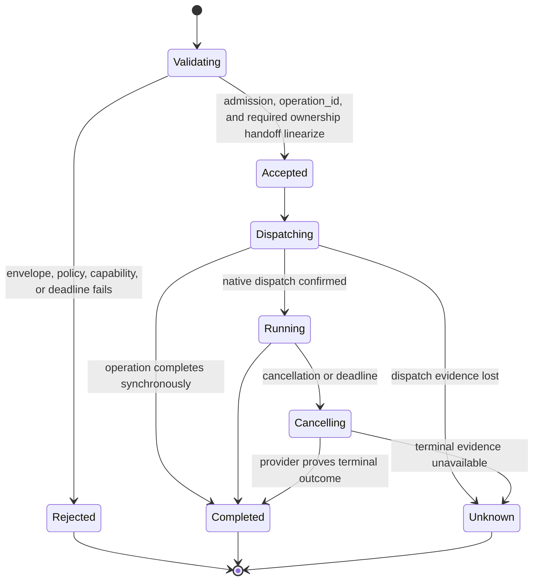

# Environment Interaction Protocol

## Design Position

The Environment Interaction Protocol (EIP) is the transport-neutral wire contract between an authenticated Environment client and `agent-envd`. The initial protocol version is EIP `1.0`. EIP uses JSON-RPC 2.0 for bounded control operations and a correlated raw-binary data plane for file transfer. One versioned contract owns method names, transfer lifecycles, typed errors, opaque handles, limits, and explicit side-effect evidence across every transport.

EIP is a semantic Environment protocol, not a remote syscall interface. Operations such as canonical path resolution, bounded search, patch validation, command-tree control, retained-output reads, and local-port observation execute beside the native resources. Client-side validation improves errors but never replaces envd enforcement.

## Boundaries

| Concern                                                                                         | Owner                                                                                  | Relationship                                             |
| ----------------------------------------------------------------------------------------------- | -------------------------------------------------------------------------------------- | -------------------------------------------------------- |
| JSON-RPC control methods, transfer lifecycles, params, results, errors, and version negotiation | EIP                                                                                    | Identical semantics across every transport               |
| Canonical IDL and generated Rust/Python realization                                             | [Protocol Source, Client, and Generation](08-protocol-source-client-and-generation.md) | Must encode this protocol without semantic drift         |
| Framing, API-key verification, connection liveness, and session carrier                         | [Transports and Sessions](03-transports-and-sessions.md)                               | Establishes authenticated context before method dispatch |
| Multi-Environment routing and Harness tool policy                                               | Harness                                                                                | Selects a binding and maps provider-neutral calls to EIP |
| Native canonicalization, process control, receipts, and resource evidence                       | `agent-envd`                                                                           | Executes an accepted EIP operation                       |
| Provider provisioning and durable Agent completion                                              | Host                                                                                   | Outside EIP                                              |

Transport headers, WebSocket upgrade fields, stdio pipes, and HTTP session selectors never appear in ordinary EIP params. Conversely, changing transport cannot change a method name, successful result, side-effect classification, or retry rule.

## Control Envelope

Every EIP control message is one UTF-8 JSON object conforming to JSON-RPC 2.0. EIP 1.0 control operations use correlated request/response only and do not support batch arrays or application notifications. A request has a string or signed 64-bit integer `id`; booleans and wider integers are invalid IDs. A response carries the same nullable `id` member and exactly one of `result` or `error`.

Raw file bytes are not control messages. They use the bounded data carrier defined by [Transports and Sessions](03-transports-and-sessions.md) after a correlated `file.open_reader` or `file.open_writer` response has established a typed transfer handle. Data frames cannot name a path, create authority, commit a mutation, or carry an unrelated EIP method.

```json
{
  "jsonrpc": "2.0",
  "id": "req-42",
  "method": "shell.exec",
  "params": {
    "context": {
      "operation_id": "op-01J...",
      "deadline": "2026-08-20T10:40:00Z"
    },
    "request": {
      "command": {
        "kind": "argv",
        "executable": "git",
        "arguments": ["status", "--short"]
      },
      "cwd": {"mount_id": "workspace", "path": "/repo"}
    }
  }
}
```

JSON text, nesting depth, collection lengths, identifiers, paths, argument arrays, environment maps, and every encoded byte field are bounded before domain validation. Small control payloads that inherently belong to a JSON method, such as initial process stdin, use unpadded base64 in a typed byte field. Native file content never uses that representation; binary readers and writers carry raw bytes without base64 or JSON copies. Numbers that represent byte counts, offsets, generations, or durations are non-negative integers within the documented range.

Unknown top-level JSON-RPC fields are ignored only when JSON-RPC permits that behavior and they do not use a reserved `eip_` prefix. Unknown fields inside typed EIP params or results fail validation unless the selected protocol revision explicitly marks that object as additive. This keeps authority-bearing requests fail closed.

## Initialization

`initialize` is the first EIP request on a stdio or WebSocket connection and the request that creates an HTTP logical session. No other method is accepted before it.

The following schema is serialized EIP JSON:

```python
class EIPClientInfo(BaseModel):
    name: str
    version: str


class InitializeParams(BaseModel):
    supported_protocol_versions: tuple[str, ...]
    client: EIPClientInfo
    expected_environment_id: str
    required_capabilities: tuple[str, ...] = ()
    optional_capabilities: tuple[str, ...] = ()


class EIPServerInfo(BaseModel):
    name: Literal["agent-envd"]
    version: str


class EIPLimits(BaseModel):
    max_request_bytes: int
    max_response_bytes: int
    max_transfer_frame_bytes: int
    max_concurrent_operations: int
    max_concurrent_file_transfers: int
    max_file_transfer_records: int
    file_transfer_record_ttl_ms: int
    max_staged_file_bytes: int
    max_staged_file_objects: int
    file_transfer_idle_ttl_ms: int
    max_file_transfer_duration_ms: int
    max_processes: int
    max_process_records: int
    terminal_process_record_ttl_ms: int
    max_operation_duration_ms: int
    max_inline_output_bytes: int
    max_output_bytes: int
    max_retained_bytes: int
    max_retained_objects: int
    max_retention_ttl_ms: int
    max_operation_records: int
    operation_record_ttl_ms: int
    session_idle_ttl_ms: int


class EnvironmentDescriptor(BaseModel):
    environment_id: str
    generation: int
    capabilities: tuple[str, ...]
    mounts: tuple[MountDescriptor, ...]
    shell_profiles: tuple[ShellProfileDescriptor, ...]
    limits: EIPLimits
    isolation: IsolationPosture


class InitializeResult(BaseModel):
    protocol_version: str
    server: EIPServerInfo
    descriptor: EnvironmentDescriptor
```

Protocol versions use `<major>.<minor>`. The server selects the highest mutually supported minor within a mutually supported major. For EIP major 1, that successful selection also fixes stdio/WebSocket binary data-frame profile version 1; no binary attachment is legal before initialization, and an incompatible frame layout requires another EIP major rather than an unnegotiated profile bump. `expected_environment_id` is mandatory and is compared before a session becomes initialized; a mismatch fails without publishing a usable descriptor. A directly launched adapter learns the value from trusted provider lifecycle state or the validated readiness record, not from model input.

A required capability absent from the effective descriptor fails initialization. Optional capabilities are negotiation hints; the result's descriptor is authoritative observed support. Neither list grants capability or widens daemon policy.

The descriptor contains no API key, transport session value, native path, provider lifecycle credential, protected path, helper location, or model-visible authority. Mount and shell descriptors use logical IDs. Limits are hard observed ceilings that a request can only narrow.

Initialization itself has no `EIPCallContext`, cannot cause a native resource mutation, and is never retried inside an existing connection or HTTP logical session. Reinitialization requires a new transport session.

## Common Operation Context

Every method other than `initialize` and transport health carries this serialized context:

```python
class EIPCallContext(BaseModel):
    operation_id: str
    deadline: datetime | None = None
    idempotency_key: str | None = None
```

`operation_id` is a client-generated, unpredictable correlation value of 1–128 Unicode scalar values, and therefore at most 512 UTF-8 bytes, that the client never reuses within one daemon generation. The same bound applies wherever EIP serializes an operation ID as a selector, receipt field, or error field. At acceptance, the daemon atomically rejects collision with a live operation or retained operation record or tombstone, including a collision from another protocol session. Once bounded record retention expires, continued generation-wide uniqueness remains the client's responsibility rather than requiring an unbounded daemon ID set. The value lets cancellation and receipt lookup target an accepted operation before or after its original response arrives. It is not a replay key, process handle, receipt, or credential.

`deadline` is an absolute UTC deadline. Envd narrows it with method and daemon hard ceilings. Expiry before dispatch returns a pre-dispatch timeout. Expiry after dispatch triggers method-specific cancellation and reconciliation; it does not prove the side effect absent.

`idempotency_key` is allowed only on methods whose catalog declares idempotency-key support. It is scoped to the daemon user, Environment identity and generation, method, and canonical semantic request digest. For session-resource opens it is additionally scoped to the exact initialized session and expires with that session; it can recover a lost open response but cannot revive a handle after reconnect. Reusing a key with different params returns `idempotency_conflict`. A matching completed record can replay the same bounded result or receipt. A matching in-progress record attaches only when the method declares safe coalescing; otherwise it returns `operation_in_progress`.

The semantic digest is SHA-256 over the selected protocol version, exact JSON-RPC method name, and generated canonical JSON encoding of the method params after removing `context.operation_id`, `context.deadline`, and `context.idempotency_key`. Canonical encoding sorts object keys, emits UTF-8 without insignificant whitespace, uses the EIP integer/timestamp/base64 profile, and omits absent values, schema defaults, and empty non-presence-sensitive collections. The digest never depends on transport headers, JSON-RPC request ID, session selector, or original object-key order. Idempotency and receipts use this one generated canonicalization path rather than handler-local hashing.

### Method idempotency classes

| Class                    | Methods                                                                                                                                                                               | Contract                                                                                                                                                                                                       |
| ------------------------ | ------------------------------------------------------------------------------------------------------------------------------------------------------------------------------------- | -------------------------------------------------------------------------------------------------------------------------------------------------------------------------------------------------------------- |
| Read-only retry          | `environment.describe`, `file.stat`, `file.read_text`, file listing/search, `process.inspect`, `process.read_output`, `process.wait`, port observations, `output.read`, `receipt.get` | No native mutation or persistent resource allocation; retries still obey revision, cursor, generation, and deadline semantics                                                                                  |
| Session-resource replay  | `file.open_reader`, `file.open_writer`                                                                                                                                                | Allocate no target mutation but accept an optional session-scoped idempotency key that replays the same live handle for the same request; session loss destroys the resource and a new session opens a new one |
| Provider-key replay      | `file.write_text`, `file.commit_writer`, other file mutations, `shell.exec`, `process.start`, `process.write_stdin`, `process.signal`                                                 | Accept an optional idempotency key whose mapping, request/result, and receipt evidence are owned by one bounded generation-local operation record                                                              |
| State-idempotent control | `file.close_reader`, `file.abort_writer`, `operation.cancel`, `process.close_stdin`, `process.kill`, `process.release`, `output.release`                                              | Repeating the same target action converges while the owning record or bounded tombstone remains; a conflicting reader-close acceptance choice is not the same action, and a key never widens lifetime          |
| Session terminal         | `session.close`                                                                                                                                                                       | Applying close again cannot reopen the session; closing protocol metadata aborts only session-scoped file transfers and does not transition daemon-generation processes or retained output                     |

Session-resource and provider-key methods can execute without a key unless their owning method requires one, but then a lost response has no automatic replay guarantee. A session-resource open mapping is attached to the same live transfer record, counts against `max_file_transfer_records`, and disappears with that record or session. A provider-key mapping and its bounded result/receipt evidence are attached to one generation-scoped operation record and share its accounting and reclamation. A client includes a key before the first dispatch whenever it may need safe mutation retry. Envd never retrofits a key after an ambiguous attempt.

## Capability and Method Catalog

A method is callable only when its capability appears in the initialized descriptor and current daemon policy permits it. The initial catalog is:

| Capability             | Methods                                                                                                                                                                      | Owning semantics                                                                                        |
| ---------------------- | ---------------------------------------------------------------------------------------------------------------------------------------------------------------------------- | ------------------------------------------------------------------------------------------------------- |
| `environment.describe` | `environment.describe`                                                                                                                                                       | Refresh descriptor, generation, limits, and posture                                                     |
| `file.read`            | `file.stat`, `file.read_text`, `file.open_reader`, `file.close_reader`, `file.list`                                                                                          | Text convenience and raw readers in [Resource Operations](04-resource-operations.md)                    |
| `file.find`            | `file.find`                                                                                                                                                                  | Path-name discovery in [Resource Operations](04-resource-operations.md)                                 |
| `file.search`          | `file.search`                                                                                                                                                                | File-content search in [Resource Operations](04-resource-operations.md)                                 |
| `file.write`           | `file.write_text`, `file.open_writer`, `file.commit_writer`, `file.abort_writer`, `file.mkdir`, `file.patch_text`, `file.copy`, `file.move`, `file.remove`                   | Text convenience, staged raw writers, and mutations in [Resource Operations](04-resource-operations.md) |
| `shell.exec`           | `shell.exec`                                                                                                                                                                 | [Command and Process Execution](05-command-and-process-execution.md)                                    |
| `process.manage`       | `process.start`, `process.inspect`, `process.read_output`, `process.write_stdin`, `process.close_stdin`, `process.signal`, `process.wait`, `process.kill`, `process.release` | [Command and Process Execution](05-command-and-process-execution.md)                                    |
| `port.observe`         | `port.inspect`, `port.wait`                                                                                                                                                  | [Resource Operations](04-resource-operations.md)                                                        |
| `output.read`          | `output.read`, `output.release`                                                                                                                                              | [Output Retention](06-output-retention.md)                                                              |
| `operation.cancel`     | `operation.cancel`                                                                                                                                                           | This document                                                                                           |
| `receipt.read`         | `receipt.get`                                                                                                                                                                | This document                                                                                           |
| `session.close`        | `session.close`                                                                                                                                                              | [Transports and Sessions](03-transports-and-sessions.md)                                                |

Advertising a capability means the daemon implements every method listed for that capability with the common EIP semantics; partial family support is invalid. Optional or computationally heavier features such as path discovery, content search, and enforceable execution limits use independent capability keys so a daemon can omit them honestly. Methods not listed in the selected protocol version return standard JSON-RPC `method_not_found`. A known method whose capability is absent returns EIP `unsupported`; this distinction lets a client detect protocol incompatibility separately from current provider posture.

The method catalog contains no provider provisioning, container lifecycle, daemon shutdown, API-key rotation, arbitrary host networking, native PID lookup, unrestricted path open, or shell-evaluated administrative method.

## Descriptor Refresh

`environment.describe` returns the current `EnvironmentDescriptor`. It can report a narrower capability set or unavailable posture, but the generation remains immutable for the daemon process lifetime. Envd never rotates generation underneath an initialized session; a fault requiring a new generation drains or terminates the daemon and therefore destroys its sessions.

After a daemon restart, a newly initialized session observes the new generation and the client treats every operation ID, receipt, resource handle, output reference, and cursor from the prior daemon incarnation as gone. When an old selector carries enough structure to identify its prior generation, envd returns `stale_generation`; otherwise it returns the selector family's non-disclosing invalid-handle or not-found error. EIP never restores, migrates, or rewrites prior-generation selectors.

The core utility method shapes are serialized EIP JSON:

```python
class EnvironmentDescribeParams(BaseModel):
    context: EIPCallContext


class EnvironmentDescribeResult(BaseModel):
    descriptor: EnvironmentDescriptor


class OperationCancelParams(BaseModel):
    context: EIPCallContext
    target_operation_id: str


class OperationCancelResult(BaseModel):
    status: Literal[
        "not_found",
        "already_terminal",
        "cancellation_requested",
        "not_cancellable",
    ]
```

## Opaque Selectors

The following wire values are bounded opaque strings:

```python
class ProcessHandle(RootModel[str]): ...
class FileReaderHandle(RootModel[str]): ...
class FileWriterHandle(RootModel[str]): ...
class FileTextCursor(RootModel[str]): ...
class OutputReference(RootModel[str]): ...
class OutputCursor(RootModel[str]): ...
class ReceiptRef(RootModel[str]): ...
```

Their private records bind at least:

- Environment identity and generation;
- authenticated daemon user;
- object kind and creating operation;
- current lifecycle state and expiry;
- any mount, process, output, or request-shape facts required for safe follow-up.

A selector reveals no native PID, path, file descriptor, provider ID, storage key, or secret. Possessing it is insufficient: every use repeats transport authentication, capability, kind, lifecycle, and current-generation checks. No selector survives daemon restart. A malformed, expired, released, or foreign selector returns `not_found_or_denied` or the narrower typed stale/gap error without revealing native internals.

Process handles, receipts, and retained-output selectors are generation-scoped under their owning contracts. File reader and writer handles are narrower: they bind the exact initialized session, direction, one data-carrier attachment, next expected offset, idle/absolute expiry, and lifecycle state. They are invalid from another session even when the authenticated user and generation match. Commit receipts and idempotency records remain generation-scoped after the writer disappears so an ambiguous commit can be reconciled without reviving its byte stream.

## Binary File-Transfer Control

[Resource Operations](04-resource-operations.md) owns file-reader and staged-writer semantics. EIP control establishes and completes them:

1. `file.open_reader` authorizes a path and optional byte range and returns one reader handle plus observed metadata before raw delivery.
2. The transport binds one server-to-client data attachment. Exact offsets, bounded raw frames, terminal EOF, backpressure, and carrier failure are transport facts governed by the same transfer state.
3. The first `file.close_reader` chooses complete acceptance or incomplete abandonment. Complete acceptance requires clean terminal consumer acknowledgement and returns count, SHA-256 digest, and revision-stability evidence; abandonment returns honest producer progress with no digest. A high-level iterator treats successful complete close validation as part of normal EOF.
4. `file.open_writer` authorizes and reserves one private staged candidate without changing the target.
5. One client-to-server attachment sends exact contiguous raw bytes and a terminal marker. Envd counts and hashes while reserving storage incrementally.
6. `file.commit_writer` compares the required count and transfer digest, revalidates destination preconditions, and performs the only target mutation. `file.abort_writer` or any pre-commit transfer teardown deletes the candidate.

A data frame is not a JSON-RPC notification or an independently retryable operation. It is valid only for the already opened handle and direction and cannot be replayed after interruption. A reader resumes by opening another explicit range under an expected revision. A writer restarts with a new private candidate. Only a possibly dispatched writer commit has mutation ambiguity; its `operation_id`, idempotency key, and receipt follow the ordinary generation-scoped reconciliation rules.

## Operation Acceptance, Cancellation, and Completion



Acceptance reserves `operation_id` and admission capacity in the daemon-generation operation registry and completes any method-declared domain ownership handoff. For `file.commit_writer`, sealed-writer validation, operation-record reservation, and session-to-operation candidate handoff are one coordinator linearization; a session already marked closing rejects it pre-dispatch, while a winning handoff removes the candidate from session cleanup. A live nonterminal record is never evicted; `max_concurrent_operations <= max_operation_records` guarantees registry capacity for every admitted operation.

One operation record owns its canonical request digest, optional provider-idempotency mapping, bounded result, and receipt selector/evidence. Those attachments do not form separate unbounded stores. After terminal completion the complete record remains visible across fresh authenticated sessions until `operation_record_ttl_ms` or, when a new acceptance needs capacity, oldest-terminal-first reclamation. The TTL is an upper bound, not a minimum reservation under capacity pressure. It is never persisted across daemon restart. Missing or reclaimed operation, idempotency, or receipt evidence never proves non-dispatch or mutation failure. JSON-RPC response delivery is independent of native completion evidence.

`operation.cancel` has params `{context, target_operation_id}`. It requests cancellation of an accepted operation in the same daemon generation. The result reports one of:

- `not_found`: no matching accepted operation is visible;
- `already_terminal`: terminal provider evidence already exists;
- `cancellation_requested`: the owning resource manager accepted the request;
- `not_cancellable`: the method or current stage cannot be safely interrupted.

A successful cancellation request is not terminal proof. The original operation or later receipt reconciliation reports `cancelled`, `completed`, `timed_out`, or `unknown_outcome`. Closing a connection or logical session does not request cancellation and is never evidence of cancellation.

## Receipts and Side-effect Evidence

A mutating operation can return a bounded receipt alongside its method result:

```python
class OperationReceipt(BaseModel):
    receipt_ref: ReceiptRef
    operation_id: str
    method: str
    environment_id: str
    generation: int
    request_digest: str
    stage: Literal[
        "accepted",
        "dispatched",
        "exec_confirmed",
        "completed",
        "unknown",
    ]
    outcome: Literal[
        "succeeded",
        "failed",
        "cancelled",
        "timed_out",
        "unknown",
    ] | None
    observed_at: datetime


class ReceiptGetParams(BaseModel):
    context: EIPCallContext
    receipt_ref: ReceiptRef | None = None
    operation_id: str | None = None


class ReceiptGetResult(BaseModel):
    receipt: OperationReceipt
```

A receipt records only facts directly observed by envd. `accepted` proves no native dispatch. `dispatched` proves the receiver crossed its native dispatch boundary but not whether the mutation completed. `exec_confirmed` is specific to a command whose requested executable passed the exec handshake. `completed` has a terminal outcome. `unknown` preserves ambiguity.

Exactly one of `receipt_ref` or `operation_id` is present. `receipt.get` re-reads receipt evidence attached to an operation record visible to the daemon user in the current generation; lookup by `operation_id` supports reconciliation after a transport or logical-session reconnect. The receipt selector, provider-idempotency mapping, semantic request/result, and receipt evidence share that record's `max_operation_records` accounting, `operation_record_ttl_ms`, and oldest-terminal-first reclamation. Missing or expired evidence is not converted into operation failure or proof of non-dispatch, and no evidence survives daemon restart. Receipts are observations, not Host durable completion, business transaction commits, provider billing records, or credentials.

## Error Contract

A JSON-RPC method error has this bounded `error.data` schema:

```python
type RetryHint = Literal[
    "never",
    "same_request",
    "after_refresh",
    "after_capacity",
    "after_authority_change",
    "reconcile_first",
]

type DispatchStage = Literal[
    "pre_dispatch",
    "dispatching",
    "dispatched",
    "completed",
    "unknown",
]


class EIPErrorData(BaseModel):
    error_type: str
    retry_hint: RetryHint
    dispatch_stage: DispatchStage
    operation_id: str | None = None
    environment_id: str | None = None
    generation: int | None = None
    capability: str | None = None
    field: str | None = None
    handle_kind: str | None = None
    produced_bytes: int | None = None
    captured_bytes: int | None = None
    dropped_bytes: int | None = None
    emitted_items: int | None = None
    dropped_items: int | None = None
    available_start: int | None = None
    available_end: int | None = None
    process_status: ProcessStatus | None = None
    receipt: OperationReceipt | None = None
    safe_detail: str | None = None
```

Stable error codes are:

| JSON-RPC code | `error_type`                 | Meaning                                                                                        |
| ------------: | ---------------------------- | ---------------------------------------------------------------------------------------------- |
|      `-32700` | `parse_error`                | Invalid JSON before an EIP envelope exists                                                     |
|      `-32600` | `invalid_request`            | Invalid JSON-RPC envelope or forbidden batch                                                   |
|      `-32601` | `method_not_found`           | Method is absent from the selected protocol version                                            |
|      `-32602` | `invalid_params`             | Typed params fail validation                                                                   |
|      `-32603` | `internal_error`             | Bounded unexpected server fault with no safe narrower class                                    |
|      `-32001` | `not_initialized`            | Method used before successful initialization                                                   |
|      `-32002` | `already_initialized`        | Initialization repeated in one session                                                         |
|      `-32003` | `protocol_incompatible`      | No version or required-capability agreement                                                    |
|      `-32010` | `denied`                     | Authenticated daemon-user policy denies the action                                             |
|      `-32011` | `not_found_or_denied`        | Object is absent or intentionally not distinguishable under current policy                     |
|      `-32012` | `unsupported`                | Known method or option is unavailable under current capability or policy                       |
|      `-32020` | `stale_generation`           | Request or selector belongs to another generation                                              |
|      `-32021` | `invalid_handle`             | Handle kind, state, or request shape is invalid                                                |
|      `-32022` | `retention_gap`              | Requested output interval is no longer available; data includes the current available bounds   |
|      `-32030` | `busy`                       | Bounded admission has no capacity                                                              |
|      `-32031` | `quota_exceeded`             | A finite resource quota cannot reserve capacity                                                |
|      `-32032` | `output_limit_exceeded`      | Effective `OutputPolicy` selected fail-on-overflow                                             |
|      `-32040` | `timeout`                    | Deadline expired with a known timeout outcome                                                  |
|      `-32041` | `cancelled`                  | Provider proves cancellation before successful completion                                      |
|      `-32042` | `unknown_outcome`            | A possible side effect cannot be classified safely                                             |
|      `-32043` | `operation_in_progress`      | Matching operation or idempotency record is still active and cannot coalesce                   |
|      `-32044` | `idempotency_conflict`       | Key was reused for another semantic request                                                    |
|      `-32050` | `provider_unavailable`       | Native or provider resource is not currently usable                                            |
|      `-32051` | `execution_isolation_failed` | Required per-command containment or pre-exec identity policy could not be established          |
|      `-32052` | `cleanup_failed`             | Native resource reached a terminal command state but required cleanup could not be established |
|      `-32053` | `command_start_failed`       | The selected executable could not be executed after transactional preparation                  |
|      `-32060` | `conflict`                   | Compare-and-swap, topology, revision, or resource-state precondition failed                    |
|      `-32061` | `integrity_mismatch`         | A completed data attachment does not match its required byte count or SHA-256 digest           |

Transport authentication failures occur before JSON-RPC dispatch and therefore use transport-native status or connection close rather than fabricating an EIP error. Once a valid request is parsed in an initialized session, a method failure uses JSON-RPC even on HTTP.

The code and `error_type` pair is fixed and generated validation rejects a mismatched pair before an outbound error is serialized. For `retention_gap`, `available_start` and `available_end` are both present and identify the currently readable half-open interval when the object still exists.

The optional byte/item counts and `process_status` carry only bounded producer and command-state evidence for failures such as output overflow; they never carry output content or a native process identifier. `safe_detail` is optional, bounded, and stable only for human diagnosis. Clients branch on code and `error_type`, not message text. Errors exclude credentials, authorization headers, command environments, full command text, native private paths, file content, output content, isolation profiles, and unrelated native identifiers.

## Retry and Unknown Outcomes

Reads can be retried only when the method's snapshot and cursor semantics permit it. Mutations can be retried when one of these is true:

- the error proves `dispatch_stage="pre_dispatch"`;
- the same idempotency key and semantic request are supported and retained;
- a receipt or resource read reconciles the prior operation to a terminal fact that makes retry safe.

A timeout, cancellation race, dropped HTTP response, WebSocket close, or stdio EOF after possible dispatch produces `unknown_outcome` unless envd has stronger evidence. A client never automatically switches transport or provider and repeats an ambiguous mutation.

## Observation Without Push

EIP 1.0 defines no JSON-RPC application notifications. Clients observe changing process and retained-output state through bounded `process.inspect`, `process.read_output`, `process.wait`, and `output.read` requests; `wait_ms` and operation deadlines provide bounded long polling where the method supports it. An incoming JSON-RPC object without an `id` is not dispatched as an EIP method.

Binary file data is not state notification. It exists only while a correlated reader or writer is active, carries exact sequential bytes plus a terminal marker, and has no subscription, replay, fan-out, or independent authority. HTTP, WebSocket, and stdio expose the same transfer lifecycle even though their byte-carrier framing differs.

## Compatibility and Versioning

EIP protocol version is independent of daemon package, provider profile, readiness schema, and Harness package version.

Within one protocol major version:

- adding an optional result field is compatible when old clients can ignore it safely;
- adding a capability-gated method or enum value is compatible only when receivers do not treat unknown values as an existing behavior;
- adding an optional request field is compatible only in a negotiated newer minor, with an explicit non-widening default; a client that negotiated an older minor omits the field rather than relying on that server to ignore it;
- method names, existing field meaning, error meaning, default side-effect behavior, idempotency scope, cursor semantics, and generation fencing remain stable.

Removing a field, changing an existing default, widening authority, making an incomplete result appear complete, changing retry or cancellation meaning, changing a selector's scope, changing transfer offset/terminal/integrity semantics, or moving the writer mutation boundary away from commit requires a new major version. Clients fail explicitly when no compatible major exists or a required capability is absent.

Common conformance fixtures run the generated Python client against the Rust daemon with identical request/result/error cases over stdio, HTTP, and WebSocket. Descriptor, generated-code, and golden-wire drift gates are owned by [Protocol Source, Client, and Generation](08-protocol-source-client-and-generation.md). Transport tests add framing, authentication, reconnect, concurrency, liveness, and size cases but cannot redefine protocol behavior.

## Invariants

01. Every control message contains exactly one JSON-RPC envelope; EIP batch requests and JSON-RPC notifications are invalid, while raw file data uses only the correlated bounded data carrier.
02. `initialize` is the first and only initialization request in a session and verifies expected Environment identity before method or data-plane admission.
03. Transport identity and session state never come from EIP params.
04. Every non-initialization method carries one bounded `EIPCallContext` with a daemon-generation-unique operation ID.
05. A method executes only when present in the selected protocol and enabled by the observed capability and current policy.
06. Opaque selectors grant no authority and are revalidated against the daemon user, Environment identity, current generation, kind, state, and expiry; none survives daemon restart.
07. Cancellation is a request; only provider evidence establishes a terminal cancellation outcome.
08. A receipt states only the envd stage and outcome it directly observed and never implies Host durable completion.
09. Errors preserve pre-dispatch, dispatched, completed, and unknown distinctions and never expose secrets or native object existence beyond current policy.
10. Automatic mutation retry requires proven non-dispatch, retained idempotency, or reconciliation evidence.
11. File bytes never enter JSON/base64; a reader or writer has one direction, one session, one attachment, exact contiguous offsets, finite limits, and an explicit terminal consumer-acceptance boundary before complete digest evidence.
12. Writer open and data delivery never mutate the destination; only an integrity-checked commit can do so, and an ambiguous commit is reconciled without resuming the expired writer.
13. Every EIP 1.0 control operation uses a correlated request and response; changing process and output state remains observable through bounded reads and waits.
14. Transport choice cannot change method, transfer lifecycle, error, output, side-effect, idempotency, or compatibility semantics.
