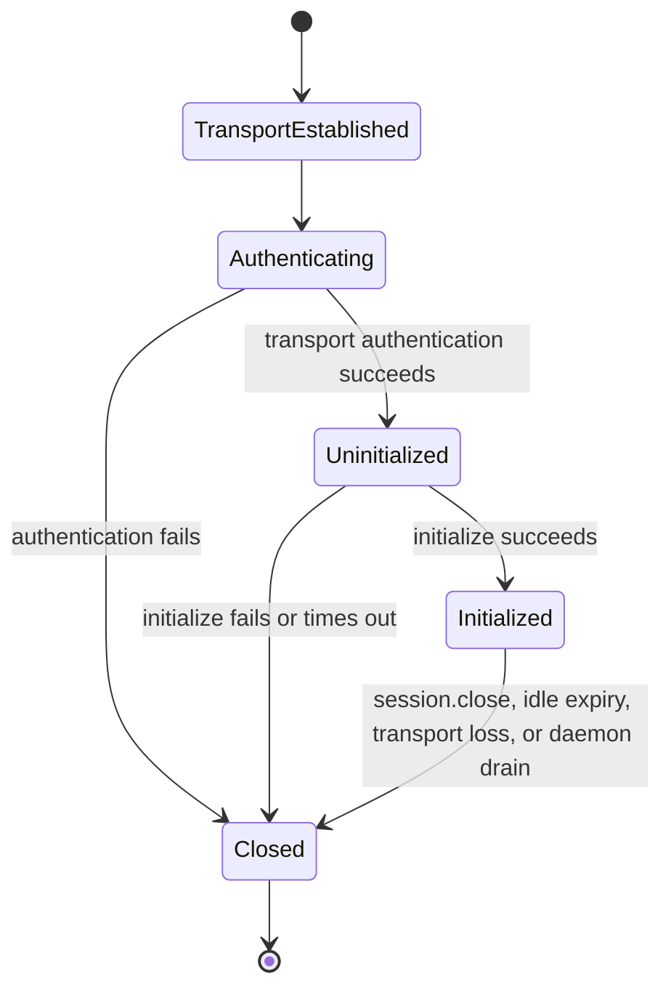
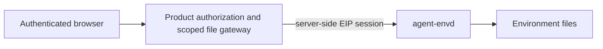

# Transports and Sessions

## Design Position

Stdio, HTTP, and WebSocket are framing and authenticated-session profiles over the same EIP contract. JSON-RPC control messages negotiate and operate resources; a correlated raw-binary carrier moves file bytes after a reader or writer is opened. A transport establishes peer context, control and data boundaries, size limits, backpressure, session lifetime, and liveness. It cannot add provider-specific methods or change transfer, operation, or commit semantics.

Network profiles are authenticated with one envd-specific API key supplied to the daemon through `AGENT_ENVD_API_KEY`. The key authenticates the daemon's single user; it is not a model-visible argument, EIP field, business credential, or provider lifecycle credential.

## Boundaries

| Concern                                                                                     | Owner                                                                          | Relationship                                                 |
| ------------------------------------------------------------------------------------------- | ------------------------------------------------------------------------------ | ------------------------------------------------------------ |
| Listener bind and API-key bootstrap                                                         | [Daemon Lifecycle and Configuration](01-daemon-lifecycle-and-configuration.md) | Completes before network admission                           |
| HTTP headers/body streaming, WebSocket messages, stdio framing, and logical session carrier | This document                                                                  | Authenticates and frames EIP control and raw data            |
| Initialization params, methods, transfer lifecycles, results, and errors                    | [EIP Protocol](02-eip-protocol.md)                                             | Identical semantics on every transport                       |
| Provider routing and optional TLS/tunnel                                                    | Host provider adapter                                                          | Supplies a protected route without injecting caller identity |
| Method authorization and native enforcement                                                 | `agent-envd` resource owners                                                   | Repeated after transport authentication                      |

A transport session authenticates access to the daemon's configured Environment ceiling. The single network key maps to the daemon's one user; the secret bytes or their digest are never used as object identity. Capabilities, current daemon policy, method params, generation, handles, and daemon-global safety limits still apply.

## Session Model



An initialized EIP session binds:

- the authenticated daemon user;
- selected EIP protocol version;
- Environment identity and generation observed at initialization;
- effective capabilities and hard limits;
- bounded correlation metadata and idle expiry.

It does not bind a Harness run, own a generation-scoped operation, process, receipt, or retained output, or create an authority partition. It does own the narrower lifetime of file readers, uncommitted file writers, and their data attachments because those ephemeral resources cannot be transferred safely across sessions. A Host requiring separation between users or mutually untrusted workloads uses distinct envd instances, keys, runtime roots, and provider bindings. Envd never accepts `run_id`, tenant, actor, principal, mount ceiling, or capability claims from a caller-controlled header or ordinary method param as a replacement for trusted daemon configuration.

Session count and metadata are daemon-bounded. The descriptor advertises `session_idle_ttl_ms`; a successfully authenticated control request or valid data-frame/body progress refreshes idle time after its session and transfer selector are validated. An active data attachment pins idle expiry while progress continues, but every transfer still has finite idle and absolute deadlines and cannot renew itself indefinitely. EIP defines no general absolute session lifetime, renewal protocol, or expiring notification. Idle expiry requires reinitialization, closes readers, aborts writers not yet owned by commit, and has no process, receipt, committed operation, or retained-output lifetime effect.

Session IDs and connection IDs are correlation selectors rather than bearer credentials. HTTP always re-authenticates the API key. WebSocket authenticates the upgrade and ties the session to that one connection. Stdio ties the session to the parent-created pipes.

## Shared Transport Rules

All profiles enforce:

- one complete UTF-8 JSON-RPC object per control message and no JSON-RPC batch arrays or notifications;
- raw file bytes only after a successful typed open and data attachment for the exact session, handle, and direction;
- finite control-message, data-frame, nesting, string, collection, decompression, transfer, queue, and in-flight limits before full allocation;
- independent JSON-RPC IDs for multiplexed requests and typed transfer handles for multiplexed data;
- out-of-order control responses when operations execute concurrently, while each transfer preserves exact contiguous stream offsets;
- one response for each control request unless the transport fails;
- no secrets in URLs, query strings, cookies, subprotocol values, data payloads, readiness, or EIP params;
- no implicit fallback to another transport after a possibly dispatched mutation.

One reader or writer accepts exactly one data attachment. Reader and writer stream offsets start at zero; for a reader, native file offset is `range_start + stream_offset`. Gaps, duplicates, reordering, wrong direction, wrong session, a second attachment, payload after terminal, or a frame over `max_transfer_frame_bytes` resets that transfer. A reset or carrier EOF is not successful file EOF. For a reader, bounded transport prefetch never sends terminal acknowledgement before the high-level consumer drains every chunk; early abandonment remains explicitly incomplete. Raw bytes remain provisional until `file.close_reader` or `file.commit_writer` establishes the typed completion boundary.

A transport can stop reading when admission or memory limits are reached. Per-transfer queues and the aggregate scheduler are bounded. Control responses, cancellation, abort, session close, and unrelated transfers receive fair progress and cannot be starved by one large producer. Backpressure bounds both client and server memory rather than accumulating parsed requests, file chunks, or outbound frames.

## Stdio Profile

### Framing

Stdio is the direct parent-process profile. Every control or data frame uses Language Server Protocol-style outer framing:

```text
Content-Length: <decimal byte length>\r\n
Content-Type: application/json; charset=utf-8\r\n
\r\n
<exact UTF-8 JSON control bytes>
```

or:

```text
Content-Length: <decimal byte length>\r\n
Content-Type: application/vnd.converge.eip-data\r\n
\r\n
<one EIP binary data frame>
```

`Content-Length` is mandatory, decimal, non-negative, canonical, and within the applicable control-message or data-frame ceiling. `Content-Type` is mandatory for binary data and optional for JSON input; when present for control it must identify UTF-8 JSON. Unknown headers are rejected if repeated, oversized, malformed, or security-sensitive. Header and body reads have finite deadlines during startup and drain.

The EIP binary data-frame profile has one fixed network-byte-order header followed by the UTF-8 handle and raw payload:

| Field               | Width | Contract                                                                                                          |
| ------------------- | ----: | ----------------------------------------------------------------------------------------------------------------- |
| magic               |     4 | ASCII `EIPD`                                                                                                      |
| profile version     |     1 | `1`                                                                                                               |
| frame kind          |     1 | `1=ATTACH`, `2=ATTACHED`, `3=CHUNK`, `4=END`, `5=END_ACK`, or `6=RESET`                                           |
| terminal status     |     2 | Zero except on `RESET`: `1=protocol`, `2=denied`, `3=expired`, `4=source`, `5=limit`, `6=cancelled`, `7=internal` |
| handle byte length  |     2 | Positive and within the EIP selector bound                                                                        |
| reserved            |     2 | Zero                                                                                                              |
| stream offset       |     8 | Unsigned offset; cumulative bytes before a `CHUNK` payload and total transferred bytes for terminal frames        |
| payload byte length |     4 | Raw payload length and zero for all kinds except `CHUNK`                                                          |

The body contains exactly `handle byte length + payload byte length` bytes after the 24-byte header, and the complete 24-byte header plus body is at most `max_transfer_frame_bytes`. Configuration must leave room for the fixed header and maximum handle and must fit the two-byte handle and four-byte payload length fields. Attach/attached offsets are zero; a reset reports the next expected or accepted offset. `ATTACH` requests the one attachment only after the open control response has been consumed; `ATTACHED` confirms that the peer installed transfer state. `END` marks clean producer completion, `END_ACK` confirms that the consumer accepted the entire stream at the terminal offset, and `RESET` terminates the transfer without claiming EOF or commit. A reader client does not emit `END_ACK` merely because a transport task prefetched `END`; it waits until the public iterator has yielded and the caller has consumed every preceding chunk. Reader flow is client `ATTACH`, server `ATTACHED`, server `CHUNK*`, server `END`, client `END_ACK`. Writer flow is client `ATTACH`, server `ATTACHED`, client `CHUNK*`, client `END`, server `END_ACK`. The bounded reset reason is diagnostic classification; `file.close_reader`, `file.commit_writer`, or `file.abort_writer` remains the typed control result.

This fixed layout and its generated enums are a versioned transport artifact with one shared Python/Rust source, golden fixtures, and strict malformed-frame tests; it is not duplicated as unrelated handwritten layouts. Negotiating EIP major 1 selects data-frame profile version 1 after initialization for stdio and WebSocket. The header version detects mismatch; it is not an independently selectable version. An incompatible layout requires another EIP major and WebSocket `eip.v<major>` family, while compatible additions require the selected EIP minor to define them explicitly. EIP 1.0 permits attachment only to typed file reader/writer handles. A later capability can reuse the physical framing only with its own typed handle, direction, lifecycle, authorization, completion, and negotiated EIP version; the frame profile never creates one universal resource stream.

Stdin carries client-to-server control and data frames. Stdout carries server-to-client control and data frames. A bounded fair scheduler reserves prompt control progress without starving data and never splits a frame. Stderr carries structured daemon logs and never protocol frames. Command stdout and stderr remain EIP retained-output data, not raw file-transfer frames or daemon stdout.

### Trust and lifecycle

Stdio has no API-key header. Authentication relies on the parent creating private pipes, launching the expected executable under trusted configuration, validating child ownership, and preventing another local principal from replacing or attaching to those descriptors. If this assumption is not valid, the provider uses an authenticated network profile or another protected channel.

The first request is `initialize`. EOF before initialization closes without a session. Parent stdin EOF after initialization normally requests daemon shutdown. The daemon stops admission, closes readers, aborts writers whose candidates remain session-owned, lets handoff-complete commit operations follow bounded drain semantics, terminates every owned command tree, cleans generation-local output, and exits after bounded cleanup. EOF is not successful transfer EOF and is not proof that a handoff-complete commit was cancelled.

## HTTP Profile

### Endpoint and request shape

Envd binds its own configured listener and serves JSON-RPC control at:

```http
POST /rpc HTTP/1.1
Authorization: Bearer <AGENT_ENVD_API_KEY value>
Content-Type: application/json
Accept: application/json
EIP-Session: <session selector, except initialize>
Content-Length: <bounded length>
```

The request body is exactly one EIP JSON-RPC request. Query parameters, fragments, form encoding, multipart bodies, cookies, bearer values in URLs, and alternate authentication headers are rejected. Redirects are never emitted for `/rpc`.

After `file.open_reader` or `file.open_writer`, raw bytes use static authenticated routes rather than JSON/base64 or a handle-bearing URL:

```http
GET /rpc/data HTTP/1.1
Authorization: Bearer <AGENT_ENVD_API_KEY value>
EIP-Session: <session selector>
EIP-Transfer: <FileReaderHandle>
Accept: application/octet-stream
```

```http
PUT /rpc/data HTTP/1.1
Authorization: Bearer <AGENT_ENVD_API_KEY value>
EIP-Session: <session selector>
EIP-Transfer: <FileWriterHandle>
Content-Type: application/octet-stream
Content-Length: <optional bounded length>
```

Each request repeats API-key authentication before transfer lookup. `EIP-Transfer` is a non-bearer selector bound to that authenticated logical session and exact direction. `GET` returns a streaming octet body only after attachment succeeds and declares the selected interval length as `Content-Length`; receiving fewer bytes is therefore failure, not EOF. Exact body completion is producer data `END`, while premature response termination is failure. After consuming that exact body, `file.close_reader(accept_complete=true)` supplies the HTTP consumer acknowledgement and verifies count, digest, and stability; early exit cancels the body and uses `accept_complete=false`, which can never report complete even if the server raced ahead. `PUT` streams the request body into private staging and returns `204 No Content` only after clean body EOF has been accepted and sealed as data `END_ACK`; it never commits the destination. `file.commit_writer` or `file.abort_writer` completes the writer lifecycle. The profiles do not depend on HTTP trailers.

An active body uses bounded buffers and transport backpressure; each internal read or write chunk is no larger than `max_transfer_frame_bytes` even though the HTTP body does not carry the stdio/WebSocket frame header. Unknown transfer, wrong direction/session, second attachment, expired handle, oversized declared body, or pre-body quota denial fails before bytes with a non-disclosing HTTP status. A failure after body streaming begins terminates the body; the later control method exposes the strongest typed transfer evidence. HTTP middleware never retries `GET /rpc/data` as a continuation or `PUT /rpc/data` as a new upload automatically.

The client sends `Authorization` on `initialize` and every later request. Envd parses the standard Bearer scheme strictly, rejects duplicate or folded authorization headers, verifies the API key in constant time before parsing an ordinary body, and never accepts proxy-injected identity as a substitute.

`initialize` omits `EIP-Session`. A successful response contains a newly created opaque selector:

```http
HTTP/1.1 200 OK
Content-Type: application/json
EIP-Session: <opaque selector>
Cache-Control: no-store
```

Every later request supplies both the same API key and `EIP-Session`. The selector chooses negotiated protocol and logical-session metadata but is not sufficient without successful API-key authentication. It is bound to the authenticated daemon user, Environment identity and generation, selected protocol, idle expiry, and safe backend routing state. It is never stored in Harness state or model data and is excluded from normal logs to avoid unnecessary correlation leakage.

HTTP logical sessions are independent of TCP connections, HTTP keep-alive, connection pools, source ports, trusted reverse proxies, and backend connection reuse. A client can send concurrent requests for one session over multiple TCP connections. Envd serializes only operations whose domain invariants require it.

### HTTP status and JSON-RPC errors

HTTP status represents failure before a valid EIP exchange:

| Status | Meaning                                                                                  |
| -----: | ---------------------------------------------------------------------------------------- |
|  `200` | A valid JSON-RPC response or an attached reader body                                     |
|  `204` | A writer body reached clean EOF and was sealed; the destination is not committed         |
|  `400` | Malformed HTTP request, control envelope, transfer header, or body framing               |
|  `401` | Missing or invalid Bearer API key; includes no diagnostic distinction                    |
|  `404` | Unknown route                                                                            |
|  `405` | Wrong method for a known route                                                           |
|  `409` | Missing, expired, mismatched, or draining session/transfer selector before dispatch      |
|  `413` | Body exceeds the transport ceiling                                                       |
|  `415` | Unsupported content type or encoding                                                     |
|  `429` | Transport-level parse/admission capacity unavailable before an EIP operation is accepted |
|  `503` | Daemon is not ready or is draining before EIP dispatch                                   |

Once envd parses a valid JSON-RPC request in an initialized session, method validation, authorization, quota, timeout, cancellation, provider, and isolation failures return HTTP `200` with the typed JSON-RPC error. This preserves one control-error contract across transports. The data route returns `200` for an attached reader and `204` for a sealed writer; pre-body authentication, session, transfer, media-type, size, admission, and readiness failures use the corresponding non-`200` transport status above without fabricating JSON-RPC.

Control and file-data responses set `Cache-Control: no-store`; intermediaries must not cache, transform, compress, retry, or replay `/rpc` or `/rpc/data`. A trusted internal gateway preserves `Authorization`, `EIP-Session`, `EIP-Transfer`, body framing, and response headers end to end and strips caller-provided internal routing headers.

### HTTP retries

A dropped HTTP response does not reveal whether envd dispatched the method. Standard HTTP client middleware must not automatically retry EIP `POST` requests. The EIP client uses operation receipts, method idempotency, or proven pre-dispatch status before retrying. A new TCP connection does not require new initialization, while an expired logical session does. Reinitialization against the same generation can continue using generation-scoped process handles and output references, but never a file reader or writer from the expired session.

## WebSocket Profile

### Upgrade handshake

WebSocket uses the same envd-owned network listener and exact route:

```http
GET /rpc/ws HTTP/1.1
Host: <configured endpoint>
Authorization: Bearer <AGENT_ENVD_API_KEY value>
Upgrade: websocket
Connection: Upgrade
Sec-WebSocket-Version: 13
Sec-WebSocket-Key: <standard random handshake value>
Sec-WebSocket-Protocol: eip.v1
```

`eip.v1` selects the EIP major protocol family and WebSocket framing profile. Minor-version and capability negotiation still occurs in the first `initialize` request. A client offers only subprotocols it supports; the server selects exactly one supported `eip.v<major>` value and returns it in the `101 Switching Protocols` response. No API key, tenant, Environment identity, session token, or provider name is encoded in the subprotocol.

Envd verifies the Bearer API key before accepting the upgrade. Failed authentication returns the same non-distinguishing HTTP `401` as the HTTP profile and never creates a WebSocket. Missing or unsupported subprotocol returns HTTP `426` or `400` without upgrade. The route does not accept API keys from query parameters, cookies, WebSocket messages, or an application-level authentication frame.

Browser-originated WebSockets are not a default client surface. An upgrade with an `Origin` header is rejected unless the exact normalized origin appears in trusted `allowed_origins` configuration. Absence of `Origin` is valid for non-browser provider adapters. An origin allowlist never replaces API-key authentication.

WebSocket extension negotiation is disabled by default. In particular, envd does not accept `permessage-deflate` unless a trusted deployment explicitly enables bounded decompression and the resulting profile remains within request and memory ceilings.

### Application initialization handshake

After the standard HTTP upgrade succeeds:

1. The server creates an authenticated but uninitialized connection with a finite initialization deadline.
2. The client's first application message is one text message containing an EIP `initialize` request; ordinary WebSocket fragmentation can carry that message within the configured aggregate ceiling.
3. The server verifies expected Environment identity, negotiates the protocol minor and capabilities, and sends the `InitializeResult` in one text frame.
4. Only after that result is sent does the connection become an initialized EIP session and admit other requests.

No custom cryptographic challenge is added on top of the standard authenticated WebSocket upgrade and protected transport. The API key authenticates the upgrade; the mandatory first-frame `initialize` binds EIP identity, version, generation, and capabilities. Adding a home-grown nonce protocol would not protect plaintext transport or a stolen bearer key and would create another compatibility surface.

A non-`initialize` first message, another request received before initialization completes, any binary message before initialization, invalid JSON, forbidden batch, or initialization timeout fails application initialization and closes the connection. Before close, the server can send a bounded JSON-RPC initialization error only when a valid request ID and envelope exist. An `initialize` request received after the session is already initialized returns `already_initialized` under the ordinary EIP error contract; it never renegotiates the live session.

### Frames, multiplexing, and liveness

Each EIP control request or response occupies exactly one complete WebSocket text message. Fragmentation at the WebSocket protocol layer is allowed only within the configured aggregate message ceiling; envd reassembles with bounded memory before JSON parsing. Multiple JSON objects in one message are invalid.

After initialization, one complete WebSocket binary message carries one EIP binary data frame in the fixed profile above. A client sends `ATTACH` only after it has consumed the corresponding open result and installed bounded demultiplexing state. Text controls and binary transfer frames can interleave; per-transfer state enforces direction, offsets, terminal acknowledgement, and one attachment. WebSocket protocol fragmentation never permits an aggregate data frame over `max_transfer_frame_bytes`.

After initialization, control requests and transfers can be multiplexed and control responses can arrive out of order by JSON-RPC ID. Control ping and pong frames provide transport liveness and carry no EIP data, authority, or completion meaning. Envd closes an unresponsive connection after bounded missed-liveness intervals.

Standard close behavior is:

|   Code | Use                                                          |
| -----: | ------------------------------------------------------------ |
| `1000` | Normal `session.close` or orderly daemon drain               |
| `1001` | Daemon shutdown or endpoint relocation                       |
| `1002` | WebSocket or EIP framing protocol violation                  |
| `1008` | Initialization/session policy violation after upgrade        |
| `1009` | Message exceeds size ceiling                                 |
| `1011` | Bounded unexpected server failure requiring connection close |

A close reason is bounded and contains no secrets or request content. WebSocket close first stops session admission, then discards protocol-session metadata, closes readers, and aborts writers still owned by that session; it does not cancel generation-scoped operations, race a handoff-complete commit, terminate processes, release retained output, or prove native non-dispatch.

## Session Close and Resource Lifetime

`session.close` uses these serialized EIP shapes:

```python
class SessionCloseParams(BaseModel):
    context: EIPCallContext


class SessionCloseResult(BaseModel):
    closed: Literal[True]
```

`session.close` linearizes by atomically marking the session `closing` and rejecting every later admission before it publishes the correlated result. It then closes readers and aborts writers that remain session-owned and invalidates the selector after the response is queued through the already admitted close request. A concurrent `file.commit_writer` either completes its atomic domain-admission handoff first, in which case cleanup ignores its candidate, or loses to `closing` and fails pre-dispatch before cleanup deletes the candidate. Session close does not cancel generation-scoped operations, close process stdin, terminate processes, or release retained-output objects. Processes, operation-owned receipts/idempotency evidence, handoff-complete commits, and retained output belong to the daemon generation and remain available to a fresh authenticated session for the same Environment identity and generation.

HTTP session idle expiry, WebSocket transport loss, and stdio carrier loss have the same transfer teardown effect. A client reconnects by creating a new session and reinitializing; it never resumes a reader, writer, WebSocket, or stdio stream itself. Reader resume opens a fresh explicit range under revision checks. Writer retry starts a fresh staging candidate, unless a prior commit must first be reconciled through its generation-scoped operation ID, idempotency record, or receipt. Explicit `operation.cancel`, process-control, `process.release`, and `output.release` methods own other resource transitions. Daemon shutdown is the only protocol-lifecycle event that unconditionally terminates all command trees and invalidates every volatile selector.

## Browser and Product-Gateway Boundary

The envd network key authenticates one daemon user and is never delivered to browser JavaScript or an untrusted end-user client. Browser remote control uses a product or Foundation gateway:



The gateway authenticates the product user, resolves one authorized Environment binding and logical path, applies product preview/upload/download policy, and proxies with bounded memory and backpressure. It keeps the envd API key, session selector, transfer handles, native metadata, and internal revisions server-side. It owns MIME and content-disposition safety, product HTTP Range handling, and whether a verified transfer is spooled before publication. An origin allowlist or WebSocket support does not convert envd into a multi-user browser authorization boundary.

## Authentication and Secret Handling

The API key authenticates only the envd endpoint. It is distinct from:

- provider lifecycle credentials held by the Host adapter;
- business or model-provider credentials optionally projected into a particular command;
- HTTP `EIP-Session` and `EIP-Transfer` selectors;
- opaque process, output, cursor, and receipt selectors.

Envd and trusted proxies redact `Authorization` completely. The key is absent from access logs, panic reports, telemetry, request mirrors, state, readiness, errors, and child environments. Authentication failure uses one response shape and does not reveal whether a key was absent, malformed, expired, or incorrect.

The process environment is a practical bootstrap secret carrier, not a claim that all environment variables are generally safe. The operator protects the daemon process environment and service definition, and envd removes its secret as early as the platform permits after loading it into protected memory. On platforms with a stable facility, envd also marks the secret-bearing daemon non-dumpable or otherwise denies same-user process-memory inspection. Crash dumps, debugger authority, root inspection, and service-manager environment access remain within the operator trust boundary.

A deployment using `AGENT_ENVD_EXECUTION_ISOLATION=disabled` must ensure that payloads cannot inspect envd memory, its original process environment, service configuration, or a trusted proxy's headers. Typical enforcement uses a distinct non-privileged payload identity, outer PID/process isolation, protected `/proc`, and no debugger capability. Running untrusted payloads with the same unrestricted process-inspection or root authority as envd collapses API-key authentication and is not a valid outer-sandbox security boundary.

## Failure Semantics

| Failure boundary                                   | Observable result                                          | Dispatch meaning                                         |
| -------------------------------------------------- | ---------------------------------------------------------- | -------------------------------------------------------- |
| API-key or WebSocket upgrade failure               | HTTP status; no EIP session                                | No EIP method dispatched                                 |
| Stdio framing or HTTP body invalid before envelope | Transport error or JSON-RPC parse error where correlatable | No EIP method dispatched                                 |
| Initialization identity/version/capability failure | JSON-RPC error, then no usable session                     | No resource method dispatched                            |
| HTTP session missing or expired                    | HTTP `409` before body dispatch                            | No EIP method dispatched for that request                |
| Message too large                                  | HTTP `413`, WebSocket `1009`, or stdio framing failure     | No EIP method dispatched                                 |
| Connection loss before envd accepts operation      | Transport failure with proven pre-dispatch stage           | Retry can follow method policy                           |
| Connection loss after possible acceptance          | Transport failure and potentially unknown outcome          | Reconcile before mutating retry                          |
| Data reset, premature body EOF, or attachment loss | Transfer fails; reader closes or pre-handoff writer aborts | No terminal consumer acceptance or target commit implied |
| Ping/pong failure or session idle expiry           | Protocol session closes and session-owned transfers end    | Generation-scoped resources remain                       |

## Compatibility

Transport profile compatibility is constrained by the selected EIP version:

- EIP major 1 selects stdio/WebSocket data-frame profile version 1 after initialization; an incompatible outer or binary layout requires another EIP major rather than a separately unnegotiated profile revision;
- HTTP route, header meaning, and status mapping remain stable within the EIP major profile;
- WebSocket `eip.v<major>` identifies the EIP major framing family before minor initialization negotiation;
- additive HTTP response headers are compatible when clients can ignore them;
- changing API-key location, permitting query authentication, changing first-frame rules, or turning a session selector into a bearer credential is incompatible.

A provider adapter declares supported transport profiles and chooses one before initialization. It can reconnect with another profile only by creating a fresh session. It never falls back and replays an operation whose dispatch outcome is ambiguous.

## Invariants

01. All transports carry one EIP protocol; transport choice never changes method or side-effect semantics.
02. HTTP and WebSocket authenticate `Authorization: Bearer` against `AGENT_ENVD_API_KEY`; neither accepts secrets from URLs, cookies, subprotocols, or EIP messages.
03. Every HTTP request re-authenticates the API key and later requests also present a non-bearer `EIP-Session` selector.
04. HTTP sessions are independent of TCP connection affinity and permit bounded concurrent requests.
05. A WebSocket upgrade selects exactly one `eip.v<major>` subprotocol, and its first application message is `initialize`.
06. Browser origins are denied by default and an allowlisted origin never replaces API-key authentication.
07. Stdio stdout contains only framed EIP traffic and stderr contains only logs.
08. Batch requests, JSON-RPC notifications, binary messages before WebSocket initialization, and unbounded decompression are unsupported; initialized binary messages carry only the fixed EIP file-data frame.
09. Every transfer has one direction, one session, one attachment, exact stream offsets, finite frame/total/time bounds, and an explicit terminal acknowledgement.
10. Connection or logical-session close never proves cancellation, non-dispatch, successful file EOF, or mutation failure; it closes readers and aborts only writers still owned by that session, without owning process or retained-output cleanup.
11. Processes, handoff-complete commit operations and their receipt/idempotency evidence, output references, and cursors belong to the daemon generation and can be used from a fresh authenticated session under their owning rules; file reader and writer handles cannot.
12. API keys, authorization headers, session correlation values, and transfer handles never enter model content, Harness state, child environments, URLs, or normal logs.
13. Browser users authenticate to a product gateway; origin checks never replace that boundary and the envd API key never reaches the browser.
14. Transport-level retries never repeat a possibly dispatched mutation without EIP idempotency or reconciliation evidence.
