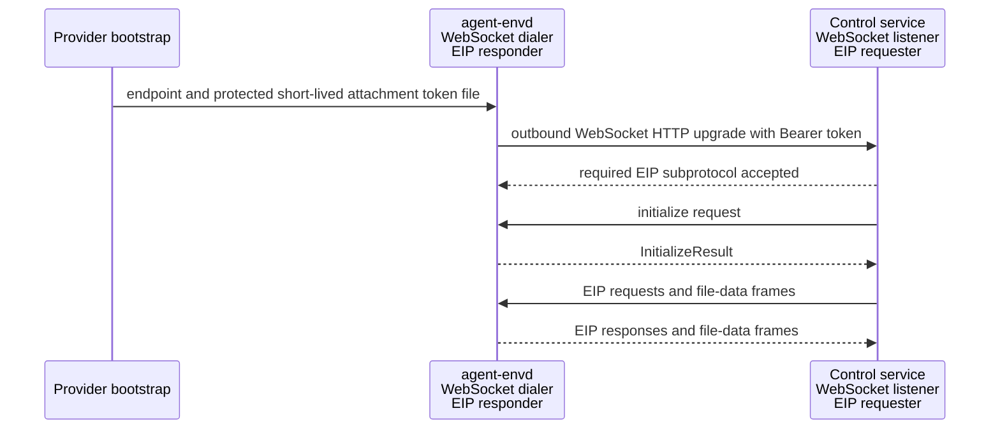
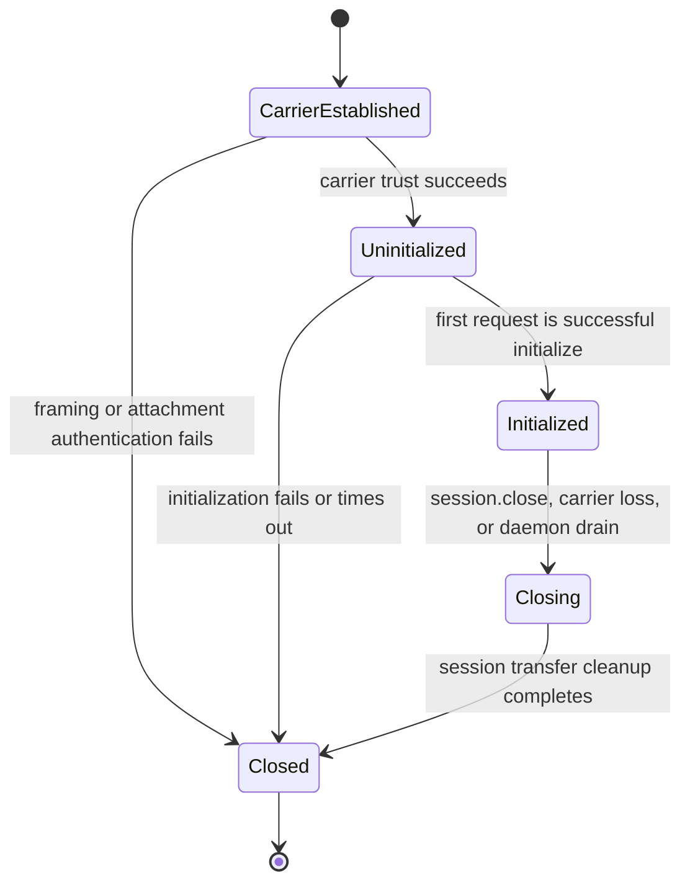

# Transports and Sessions

## Design Position

EIP has three carrier profiles:

- trusted stdio for a provider that launches `agent-envd` and owns its private pipes;
- Host-dialed HTTP(S) for a provider that exposes a dedicated authenticated envd listener;
- outbound reverse WebSocket for a provider that needs envd to dial a trusted Host listener.

All profiles carry the same JSON-RPC methods and raw file bytes. Stdio and reverse WebSocket use the fixed EIP binary data-frame profile; HTTP uses bounded streaming request or response bodies tied to the same typed transfer handles. Carrier choice establishes peer context, framing, bounds, backpressure, session lifetime, and liveness; it never changes operation, transfer, commit, receipt, cancellation, or retry semantics.

The reverse-WebSocket direction does not reverse protocol roles. The control service is always the EIP requester/client. Envd is always the EIP responder/server. Envd initiates the TCP/TLS/WebSocket carrier because the controlled Environment need not accept inbound connections.

Only the HTTP profile binds an inbound listener, and that listener exposes only dedicated EIP control and transfer resources. Envd exposes no generic HTTP API, browser API, arbitrary download/upload route, inbound WebSocket, health, or readiness endpoint.

## Boundaries

| Concern                                                                                        | Owner                                                                          | Relationship                                        |
| ---------------------------------------------------------------------------------------------- | ------------------------------------------------------------------------------ | --------------------------------------------------- |
| Endpoint, bootstrap credential, and Environment lifecycle configuration                        | Host provider integration                                                      | Supplies trusted carrier configuration              |
| Daemon startup, local readiness, listener/connector policy, and fatal carrier state            | [Daemon Lifecycle and Configuration](01-daemon-lifecycle-and-configuration.md) | Prepares the carrier without granting EIP authority |
| Stdio framing, HTTP resources/bodies, reverse-WebSocket messages, authentication, and sessions | This document                                                                  | Carries EIP control and file data                   |
| Initialization, methods, operation replay, transfers, results, and errors                      | [EIP Protocol](02-eip-protocol.md)                                             | Identical on all profiles                           |
| Method authorization and native enforcement                                                    | `agent-envd` resource owners                                                   | Repeated after carrier authentication               |
| Control-service user or tenant authorization                                                   | Host or product control plane                                                  | Never inferred by envd from an EIP parameter        |

A network-profile credential authenticates the expected requester to the HTTP listener or the expected envd instance to its reverse-WebSocket control-service binding. It is not a business credential, product-user identity, model-visible value, EIP selector, or substitute for Environment identity, generation, mount, method, and resource checks.

## Protocol Roles and Carrier Direction



Carrier establishment and EIP message direction are independent:

- envd opens, reconnects, and closes the outbound network connection;
- the control service sends every EIP request, including the first `initialize` request;
- envd sends correlated EIP responses;
- binary frame direction follows the typed file reader or writer, not the WebSocket dialer;
- neither peer sends JSON-RPC notifications or server-initiated EIP requests in EIP 1.0.

This fixed role model keeps generated requester stubs on the client/control-service side and generated responder dispatch on the daemon side for stdio, HTTP, and reverse WebSocket.

## Session Model

Each accepted stdio carrier and successfully upgraded reverse-WebSocket connection creates one fresh uninitialized EIP session. In HTTP, the first authenticated control POST carrying `initialize` creates the session and returns its opaque selector in a protected response header.



An initialized session binds:

- the trusted carrier peer;
- the selected EIP protocol version;
- the expected Environment identity and observed daemon generation;
- the descriptor's exact `available_methods`, configured mounts, root mount, limits, and isolation posture;
- bounded request correlation and session-owned transfer state.

A session is not a Harness run, tenant, principal, generation lease, or resource-authority partition. It does not own accepted operations, process records, receipts, or command output. It owns only file readers, writers that have not handed their candidate to a commit operation, and their binary attachments.

Carrier loss destroys the session and all session-owned transfers. Generation-owned operations, handoff-complete commits, processes, receipts, and command output remain under their daemon records. A later reverse-WebSocket connection always initializes a new session; it never resumes the prior WebSocket, request correlation table, reader, writer, or binary stream.

`session.close` atomically stops later session admission before cleaning session-owned transfers. A concurrently admitted `file.commit_writer` either completes its candidate handoff first and becomes operation-owned, or loses to session closing and remains cleanup-owned by the session. Session close does not cancel operations, close process stdin, terminate processes, or release command output.

## Shared Carrier Rules

All profiles enforce:

- one complete UTF-8 JSON-RPC object per control message or bounded control POST, with no batch arrays or notifications;
- one response for each admitted control request unless the carrier fails;
- independent JSON-RPC IDs and bounded out-of-order responses for concurrent requests;
- binary file data only after a successful typed reader or writer open;
- one direction, session, transfer handle, and attachment per binary stream;
- exact contiguous stream offsets starting at zero for the attachment;
- finite control, binary frame, nesting, string, collection, queue, transfer, and in-flight bounds before unbounded allocation;
- bounded fair scheduling so control, cancellation, reset, close, and unrelated transfers continue to make progress;
- no implicit carrier fallback or replay after a possibly dispatched operation.

A carrier can stop reading when admission or memory capacity is exhausted. Its per-transfer and aggregate queues apply backpressure to the producer rather than accumulating frames. Request correlation remains finite. Abandoning a sent request releases caller-side admission; if a late response can no longer be correlated safely within bounded state, the client closes the carrier rather than reusing an ambiguous request ID.

Carrier liveness and EIP operation timeout are separate. A liveness failure tears down the session but does not classify an accepted operation as cancelled or failed. `EIPCallContext.timeout_ms` is interpreted by the daemon after request admission using a monotonic clock. File transfer timeout is separately selected at open.

## Binary Data-Frame Profile

Stdio bodies and reverse-WebSocket binary messages carry one fixed network-byte-order EIP data frame. HTTP transfer bodies do not wrap chunks in this frame; the [HTTP profile](#host-dialed-http-profile) maps the same transfer lifecycle onto one bounded streaming body.

| Field               | Width | Contract                                                                                 |
| ------------------- | ----: | ---------------------------------------------------------------------------------------- |
| magic               |     4 | ASCII `EIPD`                                                                             |
| profile version     |     1 | `1`                                                                                      |
| frame kind          |     1 | `1=ATTACH`, `2=ATTACHED`, `3=CHUNK`, `4=END`, `5=END_ACK`, `6=RESET`                     |
| terminal status     |     2 | Zero except on `RESET`: protocol, denied, expired, source, limit, cancelled, or internal |
| handle byte length  |     2 | Positive and within the EIP selector bound                                               |
| reserved            |     2 | Zero                                                                                     |
| stream offset       |     8 | Bytes preceding a chunk, or accepted/terminal byte count                                 |
| payload byte length |     4 | Raw chunk length; zero for every non-`CHUNK` frame                                       |

The 24-byte header is followed by the UTF-8 handle and raw payload. The complete frame is at most `max_transfer_frame_bytes`. Attach and attached offsets are zero. Gaps, duplicates, reordering, wrong direction, wrong session, a second attachment, data after terminal, malformed lengths, or oversize reset that transfer. A `RESET` offset reports the next expected or accepted byte.

### Reader lifecycle

A reader uses:

```text
client ATTACH
server ATTACHED
server CHUNK*
server END
client file.close_reader
```

`END` proves only clean producer termination at the terminal byte count. The client does not send `END_ACK` for a reader. Successful `file.close_reader` is the sole semantic consumer-acceptance action and returns the daemon's produced-byte count and SHA-256 digest. The high-level client calls it only after the public consumer has drained every queued chunk and its local count and digest agree. Early abandonment, cancellation, or carrier failure sends `RESET` when the carrier remains usable and never calls successful close. A prefetched `END` is not consumer acceptance.

### Writer lifecycle

A writer uses:

```text
client ATTACH
server ATTACHED
client CHUNK*
client END
server END_ACK
client file.commit_writer or file.abort_writer
```

Writer `END_ACK` confirms that envd accepted and sealed the complete uploaded stream at the terminal offset. It does not publish the destination. Only `file.commit_writer` can hand off candidate ownership and perform the target mutation.

When a client sends `RESET` for a live session-owned transfer, envd performs cleanup and can return one `RESET` acknowledgement. Reset handling is finite; a peer that cannot finish transfer teardown loses the carrier. Envd-initiated reset is already terminal. A reset received after writer ownership has handed off to commit cannot demote or cancel that operation.

EIP major 1 selects data-frame profile version 1 after initialization. An incompatible layout requires another EIP major. Later features can reuse the physical frame only with a typed handle, direction, lifecycle, and negotiated EIP contract; the frame does not create a generic byte-stream authority.

## Trusted Stdio Profile

Stdio is the direct parent-process profile. Each control or data frame uses Language Server Protocol-style outer framing:

```text
Content-Length: <decimal byte length>\r\n
Content-Type: application/json; charset=utf-8\r\n
\r\n
<exact UTF-8 JSON control bytes>
```

or:

```text
Content-Length: <decimal byte length>\r\n
Content-Type: application/vnd.converge.eip-data\r\n
\r\n
<one EIP binary data frame>
```

`Content-Length` is mandatory, decimal, non-negative, and checked before body allocation. `Content-Type` is mandatory for binary data and, when present for control, identifies UTF-8 JSON. Header count, line length, and aggregate header bytes are bounded while reading; a parser never reads an unbounded line and checks it afterward. Repeated, malformed, or conflicting framing headers fail the carrier.

Stdin carries requester-to-envd control and data frames. Stdout carries envd-to-requester control and data frames. A fair scheduler never splits an outer frame. Stderr carries structured daemon logs and never protocol frames. Command stdout and stderr remain command-output data and never appear on daemon stdout.

Stdio has no bearer credential. Its trust boundary requires the provider to create private pipes, launch the expected executable with trusted configuration, validate child ownership, and prevent another principal from replacing or attaching to the descriptors. The first request is `initialize`. Parent stdin EOF is carrier loss and normally also triggers daemon shutdown because the parent owns this daemon lifecycle. EOF is never successful transfer EOF or evidence that an operation was not dispatched.

## Host-Dialed HTTP Profile

### Listener and authentication

The HTTP profile binds one dedicated EIP listener configured by the provider. A public or provider-routed endpoint uses HTTPS with ordinary certificate and hostname validation. Platform trust roots are the default; an explicitly configured deployment CA can add trust without making custom certificates mandatory. Plain HTTP is permitted only on an explicitly trusted loopback or private provider link, including the private hop behind provider-managed TLS termination. The client never follows redirects or upgrades the request to a browser or generic HTTP API.

Every request carries a bootstrap or session Bearer credential in `Authorization`. The credential is required even when an outer provider link also authenticates traffic. It never appears in a URL, query, cookie, EIP payload, model-visible value, log, trace, or provider resource state.

The listener exposes fixed-purpose control and transfer resources only. It has no generic JSON endpoint, file path route, arbitrary URL fetch, health route, browser CORS surface, or directory listing.

### Session creation and control

The first authenticated control POST contains exactly one `initialize` JSON-RPC request. Success creates one initialized EIP session and returns an opaque session selector in a protected response header. The selector is never placed in a URL, cookie, JSON-RPC field, or response body. Every later control or transfer request presents both current authentication and that selector in protected headers.

One bounded control POST carries one JSON-RPC request and one JSON-RPC response. Concurrent control POSTs are permitted within the negotiated and daemon-global limits, and responses complete independently. HTTP connection reuse is optional and has no session meaning; a session can span multiple TCP connections while its authenticated selector remains valid.

The daemon admits at most one active initialized session across all carriers. `session.close`, provider drain, authentication revocation, or fatal protocol failure closes the HTTP session. The same daemon generation can then accept a fresh sequential session. A selector is unpredictable, generation-bound, expires with its session, and grants no authority without current authentication and repeated Environment checks.

### Streaming file transfer

Raw file bytes use a fixed transfer resource with the session selector, transfer handle, and direction in protected headers. The session and handle never form a path or query component.

For a reader, the client opens through the ordinary EIP control method, then sends one authenticated transfer request. The response body streams raw bytes under backpressure. Clean body completion proves only producer termination; successful `file.close_reader` after local count and digest verification remains the sole consumer acceptance.

For a writer, the client opens through EIP control, then streams raw request-body bytes. A successful bounded transfer response confirms the complete upload was accepted and sealed, equivalent to writer `END_ACK`; only `file.commit_writer` publishes the destination. An early client abort, body error, count/digest mismatch, or reset leaves the reader unaccepted or aborts the pre-handoff writer. The client invokes the typed abort/close path when the control session remains usable.

HTTP bodies have the same byte, timeout, queue, and aggregate transfer ceilings as framed carriers. Content encoding and transparent compression are disabled. Range requests, multipart forms, base64 JSON, resumable upload offsets, generic GET download semantics, and automatic transfer retry are unsupported.

### Disconnect and liveness

An HTTP request disconnect releases only that request's delivery waiter and transfer body where applicable. It does not cancel a possibly accepted operation, close the EIP session automatically, or prove non-dispatch. A lost control response is reconciled by operation ID under the ordinary EIP rules. The client never automatically replays a mutation or resumes a file body.

HTTP has no carrier ping/pong requirement. Finite request deadlines and an explicit bounded session idle policy provide liveness. Provider process state and the trusted launch channel own daemon readiness; the EIP listener exposes no health route.

## Outbound Reverse-WebSocket Profile

### Trusted bootstrap

The provider supplies envd with:

- one normalized `ws://` or `wss://` endpoint with no query, fragment, or embedded credential;
- an absolute path to a provider-protected regular file containing one short-lived attachment Bearer token;
- optional additional PEM CA roots for `wss`;
- finite connection, initialization, liveness, and reconnect bounds.

The token is mandatory secret bootstrap input. It is never accepted directly in argv, a normal environment value, URL, query, cookie, subprotocol, EIP message, command environment, readiness record, log, trace, or error. The non-secret token-file path is trusted process configuration and is not logged. Envd reads the bounded file before each attempt and discards the token after that attempt. Missing or malformed token input and HTTP `401` or `403` are generation-fatal.

### Network and upgrade

With `wss`, envd performs ordinary certificate-chain and hostname validation against platform roots plus the optional configured PEM CA file. It does not disable verification, follow redirects, accept a mismatched host, or use caller-controlled forwarding headers as trust evidence. `ws` is an explicit profile for loopback, a private tunnel, or an outer network boundary that already owns confidentiality. It provides no transport secrecy for the Bearer token or EIP content, so cross-host and production deployments should use `wss`.

The upgrade request includes:

```http
Authorization: Bearer <short-lived attachment credential>
Sec-WebSocket-Protocol: eip.v1
```

The control service must select exactly the offered supported `eip.v<major>` value. Missing or different subprotocol, redirect, invalid TLS, malformed upgrade, or an unexpected extension fails the connection before EIP initialization. Per-message compression is disabled unless a later accepted profile defines bounded decompression explicitly.

The mandatory Bearer token authenticates the envd attachment to the control service. The control service independently resolves that token to the expected Environment binding before accepting the upgrade. Successful HTTP upgrade authenticates the resulting WebSocket, so the token is not repeated after upgrade. The service never forwards browser or product-user credentials as the envd attachment token.

### Initialization and multiplexing

After upgrade, the control service's first application message is one text message containing `initialize`. Envd admits no other request or binary frame before initialization succeeds. A second pre-initialization message, a non-`initialize` first request, invalid JSON, a batch, notification, binary message, or initialization timeout closes the connection. When a valid request ID is available, envd may first return the bounded typed initialization error.

After initialization:

- one text message contains one complete JSON-RPC request or response;
- one binary message contains one complete EIP data frame;
- WebSocket fragmentation is allowed only within the configured aggregate message ceiling;
- text and binary messages can interleave while per-transfer ordering remains exact;
- WebSocket ping/pong provides carrier liveness and has no EIP completion meaning.

The control service can multiplex bounded control requests and transfers on one connection. Envd can return control responses out of order by JSON-RPC ID. Neither peer relies on TCP connection affinity beyond that one WebSocket session.

### Reconnect and fatal attachment states

Every carrier failure closes that session. Envd reconnects only by creating a new TLS/WebSocket connection and waiting for a fresh `initialize` request. It never automatically replays an EIP request, resumes a transfer, or treats the new connection as the old session.

Recoverable connection failures use bounded exponential backoff with full jitter and a configured cap. Backoff state is bounded and reset only after a connection remains initialized for the configured stability interval; a flapping endpoint cannot create a tight reconnect loop.

The following failures are generation-fatal rather than retried:

- missing, unreadable, empty, malformed, or oversized attachment token input;
- HTTP `401` or `403` attachment-token rejection;
- invalid TLS chain or hostname for `wss`;
- unsupported or missing mandatory `eip.v1` subprotocol;
- invalid endpoint policy, redirect, malformed upgrade, or incompatible peer framing.

A generation-fatal attachment failure stops carrier admission, triggers bounded daemon drain, and exits nonzero with a non-secret failure class. Transient DNS, connect, remote-unavailable, or liveness failures remain reconnectable within provider lifecycle policy.

## Readiness

Daemon-local readiness and initialized-carrier readiness are distinct:

- **local readiness** means configuration, generation-private stores, mounts, execution backend, and required isolation probe succeeded and the reverse-WebSocket connector can start;
- **carrier readiness** means one current WebSocket is authenticated, upgraded with the required subprotocol, and initialized for the configured Environment and generation.

Envd never binds a health endpoint. The provider observes process state and typed connector state through its trusted launch/control channel. A consumer must not dispatch EIP work until carrier readiness is established. Loss of carrier readiness does not make local daemon state, processes, or accepted operation evidence disappear.

## Control-Service and Browser Boundary

The reverse-WebSocket listener belongs to a trusted control service, not to browser JavaScript. That service owns product-user authentication, tenant and Environment routing, endpoint admission, credential issuance, and any browser-facing file or terminal policy. It keeps attachment credentials, EIP operation IDs, process handles, output references, and file transfer handles server-side unless another accepted product contract safely projects a logical reference.

Origin checks are not an envd concern because envd is the non-browser WebSocket client. The control service applies its own browser and HTTP security policy at its external boundary. EIP does not accept product user, tenant, run, mount, or authority claims from ordinary request parameters as a substitute for trusted provider routing.

## Failure Semantics

| Failure boundary                                                       | Observable result                                                 | Dispatch meaning                                             |
| ---------------------------------------------------------------------- | ----------------------------------------------------------------- | ------------------------------------------------------------ |
| Stdio framing, HTTP authentication/framing, or WebSocket upgrade fails | Carrier/request failure; no initialized session                   | No method dispatched when rejected before admission          |
| Attachment authentication fails                                        | Upgrade rejected; daemon generation drains and exits nonzero      | No EIP method dispatched                                     |
| Initialization identity, version, or required-method check fails       | Typed error when correlatable, then close                         | No resource method dispatched                                |
| Message or HTTP body exceeds a carrier ceiling                         | Framing failure, bounded HTTP error, or WebSocket close           | No method dispatched when rejected before envelope admission |
| Carrier loss before operation acceptance                               | Transport failure with proven pre-dispatch evidence               | Same operation may be retried                                |
| Carrier loss after possible acceptance                                 | Transport failure and potentially unknown outcome                 | Reconcile by operation ID before mutation retry              |
| Binary reset or premature carrier EOF                                  | Transfer fails; reader is unaccepted or pre-handoff writer aborts | No reader success or target commit implied                   |
| Ping/pong or liveness failure                                          | Current session closes                                            | Generation-owned resources remain                            |
| Missing/rejected token or invalid TLS/subprotocol                      | Daemon generation drains and exits nonzero                        | No unauthenticated retry or insecure fallback                |

## Compatibility

Transport compatibility is bound to the selected EIP version:

- EIP major 1 selects data-frame profile version 1 for stdio/reverse WebSocket and reverse-WebSocket subprotocol `eip.v1`;
- changing stdio outer framing, HTTP session/header/body mapping, first-request initialization, binary frame layout, requester/responder roles, reader acceptance, or credential location is incompatible;
- adding another carrier profile does not change existing EIP method semantics;
- making envd the EIP requester or adding an inbound WebSocket, browser, or generic HTTP API is an architecture change rather than a deployment option;
- additive HTTP or WebSocket response headers are compatible only when clients can ignore them safely and trust semantics remain unchanged.

A provider selects stdio, HTTP, or reverse WebSocket before session establishment. It cannot fall back to another profile and replay an operation whose dispatch is ambiguous.

## Invariants

01. Trusted stdio, Host-dialed HTTP, and outbound reverse WebSocket carry one EIP contract; carrier choice never changes method or side-effect semantics.
02. Envd is always the EIP responder; the low-level client/control service is always the requester even though envd initiates the reverse-WebSocket carrier.
03. Only the HTTP profile binds an inbound EIP listener; envd exposes no inbound WebSocket, browser, generic HTTP, arbitrary download/upload, health, or readiness API.
04. Public or provider-routed HTTP uses validated HTTPS; plaintext HTTP is limited to an explicitly trusted loopback or private provider link. Reverse WebSocket retains its defined `ws`/validated `wss` endpoint policy, token, redirect, and `eip.v1` rules.
05. Every carrier requires its defined bootstrap authentication except trusted private stdio, and credentials/session selectors never enter URLs, cookies, EIP payloads, model state, or ordinary observability.
06. The requester's first EIP request is `initialize`, and every successful carrier or HTTP initialization creates a fresh session; one daemon admits at most one active initialized session and supports fresh sequential sessions.
07. Carrier or request loss removes affected session transfer delivery but does not erase generation-owned operations, processes, receipts, or command output.
08. Reconnect never automatically replays a request or resumes a file transfer.
09. Every transfer has one session, direction, attachment, exact byte sequence, finite bounds, and typed completion.
10. Reader acceptance occurs only through successful `file.close_reader`; a writer upload acknowledgement precedes commit on every carrier.
11. Stdio stdout contains only framed EIP traffic and stderr contains only logs.
12. Missing/rejected reverse-WebSocket tokens and invalid TLS/subprotocol are generation-fatal; transient reverse connectivity uses capped exponential backoff with full jitter.
13. Closing a carrier or HTTP request never proves cancellation, non-dispatch, successful file EOF, or mutation failure.
