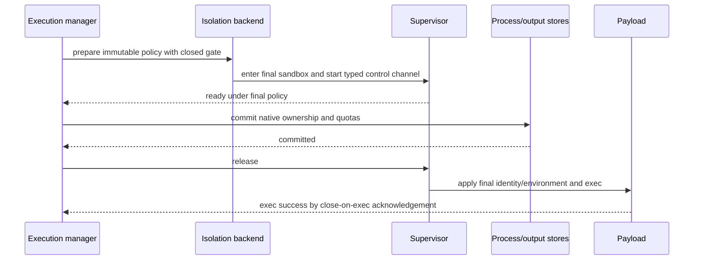

# Execution Isolation

## Design Position

Every `shell.exec` and `process.start` command is treated as untrusted local code. By default, envd places each command tree inside an operating-system sandbox before the requested executable starts: Linux uses bubblewrap namespaces and macOS uses Seatbelt. This inner layer protects host resources outside explicitly granted command roots when envd runs directly on a user machine.

A deployment that already runs envd inside a container, VM, E2B environment, or equivalent sandbox can explicitly select `disabled`. In that mode the outer host owns command filesystem, process, device, IPC, and network containment. Envd retains transactional spawn, command validation, environment filtering, process ownership, output bounds, quotas, signaling, and cleanup, but it makes no inner-sandbox claim.

There is no `auto`, `best_effort`, or probe-driven fallback. Required isolation either passes its production probe and remains active or the daemon fails before transport admission.

## Security Boundary and Non-goals

The required backends provide host containment for an Environment under the daemon's OS user and configured roots. They reduce accidental destructive behavior and malicious dependency-script access to unrelated files, credentials, processes, and IPC. They are not a hostile multi-tenant boundary and do not claim resistance to kernel, bubblewrap, or Seatbelt vulnerabilities.

The isolation layer does not:

- provision a container or VM;
- isolate trusted envd file methods from envd itself;
- turn installed Harness Python plugins into untrusted code;
- provide domain-name egress policy;
- promise identical macOS and Linux process-tree teardown strength;
- replace daemon admission, output quotas, wall-time limits, or outer resource controls;
- accept profiles, helper paths, native roots, disable flags, user IDs, or network widening from EIP callers.

A stronger VM-backed provider can replace the physical containment tier while preserving EIP and Harness contracts. Its lifecycle remains provider-owned rather than part of this per-command backend.

## Configuration Contract

| Environment variable                         | Values                              | Default    | Meaning                                                                                         |
| -------------------------------------------- | ----------------------------------- | ---------- | ----------------------------------------------------------------------------------------------- |
| `AGENT_ENVD_EXECUTION_ISOLATION`             | `required`, `disabled`              | `required` | Enables fail-closed envd-native isolation or explicitly delegates containment to the outer host |
| `AGENT_ENVD_EXECUTION_NETWORK`               | `host`, `deny`                      | `host`     | Maximum IP-network posture for required isolation                                               |
| `AGENT_ENVD_EXECUTION_EXTRA_READ_ONLY_PATHS` | JSON array of absolute path strings | `[]`       | Adds operator-trusted read-only executable/runtime roots in required mode                       |
| `AGENT_ENVD_EXECUTION_UID`                   | Positive decimal OS user ID         | Unset      | Optional Linux final-payload identity; valid only with paired GID and trusted daemon authority  |
| `AGENT_ENVD_EXECUTION_GID`                   | Positive decimal OS group ID        | Unset      | Optional Linux final-payload primary group                                                      |

The valid isolation/path/network matrix is:

| Isolation  | Configured network | Extra read-only roots | Result                                                                                                                           |
| ---------- | ------------------ | --------------------- | -------------------------------------------------------------------------------------------------------------------------------- |
| `required` | `host`             | Empty or valid        | Commands have required filesystem/process containment and can use host IP networking; a request can narrow one command to `deny` |
| `required` | `deny`             | Empty or valid        | Every command has required containment and denied IP networking                                                                  |
| `disabled` | `host`             | Empty                 | Valid explicit delegation to the outer sandbox or operator risk acceptance                                                       |
| `disabled` | `deny`             | Any                   | Invalid because native spawn cannot honestly enforce network denial                                                              |
| `disabled` | `host`             | Non-empty             | Invalid because envd cannot honestly enforce command read-only roots without an isolation backend                                |

Unknown values and every unlisted combination fail startup. Container detection, root UID, CI, debug build, test mode, daemon transport, executable path, and failed backend probing never select `disabled` implicitly.

The optional payload UID and GID are paired trusted configuration, never request environment values. On Linux, envd validates that it has authority to adopt the identity, clears supplementary groups, sets real/effective/saved GID and UID immediately before final payload exec, verifies the resulting identity, proves root cannot be regained, and applies `PR_SET_NO_NEW_PRIVS`. Any failure is reported through the gated exec handshake. On unsupported platforms the paired setting fails startup.

All isolation configuration is immutable for one Environment generation. EIP command input can only narrow `host` to `deny` when the required backend advertises and probes that behavior.

## Ownership and Policy Snapshot

One isolation manager is created before transport readiness. It owns immutable backend identity, protected roots, curated runtime roots, execution home and temporary roots, payload identity, network ceiling, and probe evidence.

Each command captures one policy snapshot containing:

- Environment identity and generation;
- the canonical `cwd` mount root and its read/write ceiling;
- canonical cwd and executable authority;
- curated runtime and explicit extra read-only roots;
- private execution home and temporary root;
- protected-path identities;
- effective host-or-deny network posture;
- final payload identity and environment;
- backend-independent wall-time, output, and process lifecycle limits.

A later provider topology change does not mutate a running command's sandbox. Revoking the mount or authority held by an existing process requires terminating and cleaning that process tree before the revocation is acknowledged. A daemon restart terminates all old-generation trees and never retargets them.

The isolation manager returns a backend-neutral execution object to the sole command execution manager. Callers cannot assume the host child PID is the requested executable, process-group leader, or complete tree. Status, signaling, force cleanup, initial-command wait, and tree-cleanup wait use semantic operations defined by [Command and Process Execution](05-command-and-process-execution.md).

## Filesystem Authority

Required isolation starts from deny-by-default filesystem authority.

| Root class                                                                                          | Payload access                                                                                                              |
| --------------------------------------------------------------------------------------------------- | --------------------------------------------------------------------------------------------------------------------------- |
| Command `cwd` mount                                                                                 | The complete selected mount, read-only or read-write according to its trusted ceiling; no other EIP mount is exposed        |
| Private execution home                                                                              | Read-write; distinct from the daemon or host user's home                                                                    |
| Private execution temporary root                                                                    | Read-write and presented through forced temporary-directory environment values                                              |
| Curated immutable platform runtime                                                                  | Read and executable mapping only as required for shells, loaders, tools, certificates, locale, and basic account resolution |
| Explicit extra read-only root                                                                       | Read and executable mapping, after trusted startup validation                                                               |
| Minimal devices and inherited stdio                                                                 | Backend-specific minimum for null, random, terminal, and pipe behavior                                                      |
| Envd daemon state, per-mount staging, transport, retention, helper, config, logs, and control roots | Denied                                                                                                                      |
| Host home, unrelated workspaces, credentials, sockets, and everything else                          | Denied                                                                                                                      |

Runtime roots are narrow reviewed paths, not whatever appears in `PATH`. The daemon does not recursively expose `/`, a host home, `/opt`, `/usr/local`, or package-manager mutable state merely for compatibility. Platform-owned shell, loader, library, certificate, locale, and compiler roots can be curated per supported target. User-managed toolchains require explicit extra read-only roots and never receive implicit write authority.

Required isolation grants executable mapping only where code execution is intended. It does not mount host SSH agents, container-engine sockets, D-Bus sockets, cloud metadata credentials, daemon API sockets, Keychain configuration, or unrelated Unix sockets.

### Protected paths and overlap

Protected paths include daemon configuration and credentials, `AGENT_ENVD_RUNTIME_DIR` except an exact dedicated execution-home child, every private per-mount staging root, retained-output storage, transport sockets, logs, install and helper roots, service definitions, isolation control data, and probe sentinels. A staging root is configured outside every logical mount and command grant; envd never relies on nested allow/deny precedence to hide an upload candidate inside a writable payload mount.

Protected denial has absolute precedence. Every root is canonicalized and identity checked. A selected mount, runtime root, or extra root is rejected when it:

- equals a protected path;
- contains a protected path;
- is contained by a protected path;
- equals the host filesystem root or host home;
- overlaps another authorized root with a different policy.

This symmetric rule avoids relying on platform-specific nested allow/deny precedence. The exact dedicated execution-home child is the sole explicit protected-parent exception. Symlink aliases are evaluated after canonicalization, and root identity is revalidated immediately before command setup. A changed root fails the command.

### Disabled-mode meaning

In `disabled` mode, envd still validates the requested cwd, executable policy, command schema, and EIP file operations. It does not claim that the child is restricted to configured mounts. The payload can access every path, process, device, IPC endpoint, and network resource made visible by its outer container/VM or the native host OS user.

The outer host must also prevent payloads from inspecting envd memory, its original process environment, service configuration, trusted proxy headers, retained output, or private per-mount staging roots; otherwise a payload can steal `AGENT_ENVD_API_KEY`, alter a sealed candidate, or bypass the EIP boundary. A distinct final payload UID/GID, outer mount and process/PID isolation, protected process filesystems, and removal of debugger/root capability are valid mechanisms. Explicit `disabled` mode accepts the outer boundary only when it provides that separation, not merely because a container exists.

The descriptor therefore reports envd inner filesystem, process, and network isolation as false. An outer provider can separately report its own sandbox posture through Host-owned provider metadata; envd never conflates the two.

## Child Environment and Launch Integrity

Request-controlled environment is dangerous before isolation because dynamic loaders, language runtimes, and helper lookup can execute behavior. Envd therefore separates launcher and payload environments:

- bubblewrap, `sandbox-exec`, the trusted supervisor, and payload launcher receive only a minimal daemon-owned environment;
- the command plan and final environment travel through a bounded inherited descriptor using a typed versioned encoding;
- internal descriptors have fixed purpose and close-on-exec behavior;
- request values are installed only in the final payload after the sandbox, release gate, payload identity, and no-new-privileges policy are active;
- all other inherited descriptors close before payload exec.

Command arguments are structured argv. Paths become backend parameters or descriptor-backed sources and are never concatenated into a Seatbelt profile or shell wrapper. Trusted helpers resolve by verified absolute identity, not the workspace or child `PATH`.

The final payload environment is cleared and rebuilt as defined by [Command and Process Execution](05-command-and-process-execution.md#environment-construction). `HOME` and temporary-directory variables always point to private execution roots. `AGENT_ENVD_API_KEY`, transport/session values, daemon state paths, internal carrier names, and ambient host credentials are absent.

## Transactional Spawn

Isolation participates in the shared two-phase start transaction:



No requested executable or payload launcher with request environment runs before final sandbox entry and store commit. Every precommit failure leaves the gate closed and forces bounded helper cleanup. Gate-release, identity, or exec failure rolls back public records and never retries with disabled isolation.

The supervisor protocol separately reports:

- final-policy ready;
- release accepted;
- final-payload launcher ready;
- requested executable exec success or bounded setup error;
- initial-command terminal status;
- backend loss;
- tree-cleanup outcome.

A wrapper's exit cannot overwrite requested-command status. Control frames and plans are bounded, typed, and authenticated by private inherited descriptors rather than parseable command strings or ambient environment variables.

## Linux bubblewrap Backend

Linux required isolation uses a verified non-setuid bubblewrap component as filesystem and namespace constructor. The helper is selected by trusted release-relative identity, is a regular executable with no setuid/setgid bit or file capabilities, and is verified as part of the envd release unit. Envd never searches `PATH` or falls back to an arbitrary distro helper.

For each command tree, the backend creates:

- a fresh user and mount namespace;
- an empty synthetic root populated only with approved read-only and read-write projections;
- a PID namespace with private `/proc` and an envd-owned PID 1 supervisor;
- isolated IPC and UTS namespaces;
- minimal `/dev`;
- a new session and dropped capabilities;
- `PR_SET_NO_NEW_PRIVS` before final payload exec;
- a fresh network namespace when effective network posture is `deny`.

Source roots are opened or identity-pinned before bubblewrap setup and revalidated so a concurrent symlink or replacement cannot redirect a bind. The namespace supervisor reaps descendants, preserves the initial executable's status, forwards supported interrupt/terminate semantics, and tears down residual descendants after the initial command exits. Force cleanup destroys the namespace from the outer manager. A descendant cannot escape cleanup by creating another process group or session inside the PID namespace.

The network-deny mechanism is a fresh network namespace with no host routes. It preserves Unix-domain IPC created inside the sandbox and does not claim domain-level filtering. Host D-Bus, SSH-agent, container-engine, and similar sockets remain absent because they are not mounted.

Landlock is not a primary or automatic fallback because it does not provide the same synthetic filesystem, PID namespace, private `/proc`, device, IPC, and network semantics. It can be defense in depth only when the bubblewrap contract remains satisfied.

Required Linux support is advertised only on targets whose kernel, unprivileged user namespace, LSM, linkage, helper, and namespace behavior pass the production probe. A disabled user-namespace configuration or LSM denial fails required startup; envd never uses a privileged setuid helper to bypass host policy.

## macOS Seatbelt Backend

macOS required isolation uses the fixed system Seatbelt launcher at `/usr/bin/sandbox-exec` with a dynamically generated `deny default` profile. Paths are passed as canonical profile parameters rather than interpolated profile source. Descendants inherit the Seatbelt restriction.

The profile permits only the reviewed minimum for:

- process fork and exec;
- signaling and process inspection within the same sandbox where stable Seatbelt filters support it;
- selected filesystem roots and executable mappings;
- required devices, pseudo-terminals, and narrow platform IPC;
- selected IP socket behavior under the effective network posture.

The profile denies unrelated host paths, Unix sockets, Mach services, IOKit user clients, preferences, and IPC by default. It uses a reviewed versioned Mach-service allowlist and does not intentionally grant blanket Keychain or `securityd` access. Because stable complete Keychain-denial probing is not available across all supported macOS versions, the security claim is limited to deny-by-default filesystem and reviewed service grants rather than absolute Keychain isolation.

Under `host`, the profile allows required IP socket operations and DNS/trust services while retaining filesystem and process restrictions. Under `deny`, it omits IP networking grants while preserving only narrow Unix-domain and platform IPC required for ordinary subprocess behavior.

The gated supervisor starts under the final Seatbelt profile, tracks the initial process group, forwards semantic signals, and performs bounded descendant cleanup. macOS has no PID namespace, so a descendant that escapes tracked group observation might outlive cleanup. It remains under inherited Seatbelt confinement, and envd reports `residual_confined` rather than falsely claiming complete teardown. A failed confinement guarantee is `cleanup_failed`.

Apple deprecates `sandbox-exec`/Seatbelt's public launch surface. Envd treats that as an explicit compatibility cost: each supported macOS release must pass the production probe, and removal or semantic breakage fails required startup. App Sandbox is not a transparent replacement because it requires signed application entitlements and app-oriented file grants. Any signed-helper or Virtualization.framework replacement remains behind the same observable EIP and execution-manager contracts.

## Network Policy

| Effective policy | Linux required                                                                  | macOS required                                                              | Disabled                                  |
| ---------------- | ------------------------------------------------------------------------------- | --------------------------------------------------------------------------- | ----------------------------------------- |
| `host`           | Keeps host IP networking while filesystem, PID, mount, and IPC isolation remain | Grants IP networking under Seatbelt while filesystem/process policy remains | Outer sandbox or host owns all networking |
| `deny`           | Fresh network namespace with no host routes                                     | No IP network grants; narrow required local IPC remains                     | Unsupported                               |

`host` means unrestricted IP networking as visible from the outer Environment, including localhost services, LAN, cloud metadata endpoints, inbound binds, downloads, and exfiltration of intentionally readable sandbox content. It is a compatibility posture, not an egress-security claim.

Daemon configured `deny` is a ceiling for every command. Configured `host` allows a request to narrow one command to `deny` only when the backend probe validated both paths. Neither mode provides domain, URL, port-destination, proxy, or metadata-only policy. Such behavior belongs to an explicit provider network/proxy capability.

## Production Probe and Readiness

In `required` mode, envd runs the same installed helper, profile builder, supervisor, path policy, payload launcher, and cleanup path used for real commands before binding a network listener or accepting stdio initialization.

The bounded probe proves:

- helper/system-launcher identity and executable integrity;
- allowed read and configured mount write behavior;
- read-only mount denial;
- protected, staging-root, and random host sentinel denial;
- symlink containment;
- execution home and temporary root behavior;
- child environment secret and descriptor hygiene;
- descendant inheritance after fork and exec;
- initial-command status preservation;
- signal and whole-tree cleanup behavior;
- effective host or deny networking;
- per-command network narrowing when advertised;
- platform-specific namespace or Seatbelt posture.

Checking that `bwrap` or `/usr/bin/sandbox-exec` exists is insufficient. A timeout, helper mismatch, unsupported kernel/OS, LSM denial, profile failure, filesystem-policy discrepancy, network discrepancy, or cleanup failure causes daemon startup failure.

Disabled mode runs no sandbox conformance probe, emits one prominent structured startup warning, and reports false inner-isolation posture. It does not warn once per command.

## Descriptor Posture

The Environment descriptor includes:

```python
class IsolationPosture(BaseModel):
    mode: Literal["required", "disabled"]
    backend: Literal[
        "linux_bubblewrap", "macos_seatbelt", "outer_host"
    ]
    filesystem_containment: bool
    process_containment: bool
    network_containment: bool
    network_policy: Literal["host", "deny"]
    cleanup_guarantee: Literal[
        "namespace_complete", "residual_confined_possible", "outer_host"
    ]
```

For required mode, true fields mean the production probe passed for the current generation. `network_containment` is true only for effective daemon-wide `deny`. A required backend that probes per-command denial adds `execution.network_deny` to `EnvironmentDescriptor.capabilities`; disabled mode omits it. Enforceable optional tree limits use the capability keys `execution.limit.process_count`, `execution.limit.memory`, and `execution.limit.cpu_time`. Envd advertises one only when the selected backend or trusted outer resource controller can enforce it for the complete command tree rather than only the initial process.

For disabled mode, all three containment booleans are false, backend is `outer_host`, and cleanup guarantee states that envd itself cannot claim containment beyond managed native lifecycle.

The descriptor reveals no native profile, helper path, protected path, host identity, sentinel, API key, or outer provider security claim. A Host can combine envd posture with separately trusted container/VM metadata but never rewrites envd's own report.

## Failure Semantics

| Failure                                                                 | Outcome                                                                  |
| ----------------------------------------------------------------------- | ------------------------------------------------------------------------ |
| Invalid mode/network/path/identity matrix                               | Daemon startup fails before readiness                                    |
| Required backend unsupported, helper invalid, or production probe fails | Daemon startup fails; no fallback                                        |
| Per-command root identity or policy construction fails                  | `execution_isolation_failed` before payload release                      |
| Supervisor not ready under final policy                                 | Prepared tree killed/reaped; no payload starts                           |
| Store commit fails                                                      | Gate remains closed; prepared tree killed/reaped                         |
| Gate, payload identity, or no-new-privileges setup fails                | Public start rolls back; tree cleaned; `execution_isolation_failed`      |
| Selected requested executable cannot be executed                        | Public start rolls back; tree cleaned; `command_start_failed`            |
| Child filesystem or network access denied                               | Ordinary command stderr/exit behavior; never fallback                    |
| Backend lost after exec                                                 | Strongest cleanup, `backend_lost`, and receipt/unknown-outcome semantics |
| Linux namespace cleanup fails                                           | `cleanup_failed`; complete teardown not claimed                          |
| macOS descendants cannot all be observed but remain under Seatbelt      | `residual_confined` with explicit posture                                |
| Disabled native cleanup cannot prove residual exit                      | `cleanup_failed`, never `residual_confined`                              |

Safe diagnostics identify platform and failure class but exclude command text, environment, API key, profile source, helper path, denied path, file content, and sensitive host structure.

## Compatibility and Conformance

An isolation backend is compatible only when it preserves:

- required/disabled fail-closed selection;
- command policy and protected-path semantics;
- transactional no-unregistered-execution gate;
- initial executable exec acknowledgement and status;
- backend-neutral signaling and cleanup outcomes;
- child environment and descriptor hygiene;
- descriptor posture and startup probe behavior.

Changing backend internals behind those contracts is compatible. Weakening deny-by-default roots, silently falling back, reporting complete cleanup without evidence, changing `disabled` to mean “best effort,” or exposing a request-selectable profile is incompatible and requires explicit architecture revision.

Conformance includes failure injection before and after every transactional boundary, native platform tests for descendant inheritance and cleanup, filesystem overlap and symlink races, secret/descriptor inheritance, host/deny networking, common toolchain compatibility, and disabled-mode posture. Every published native target runs its probe and tests on the actual supported OS/kernel matrix rather than relying solely on cross-compilation.

## Trade-offs

### Native isolation instead of per-command VM

Bubblewrap and Seatbelt have low startup and deployment cost and preserve host toolchains. They provide weaker protection than a VM and inherit platform limitations, especially deprecated Seatbelt and macOS process cleanup. Deployments requiring hostile multi-tenancy use an outer VM/container provider and can disable the redundant inner layer explicitly.

### Fail closed instead of automatic compatibility fallback

Required mode can make envd unavailable on machines with disabled user namespaces, restrictive LSM policy, or changed Seatbelt behavior. This is preferable to silently turning a packaging or OS regression into unrestricted host execution. The operator can explicitly accept the outer-host boundary with `disabled`.

### Curated runtime roots instead of ambient `PATH`

Narrow runtime grants can require explicit configuration for Homebrew, Nix, or custom toolchains. They prevent command convenience from exposing mutable package state, credentials, or the whole host filesystem.

## Invariants

01. Every command uses exactly one immutable isolation policy snapshot selected before transactional preparation.
02. Required mode defaults on, runs a production probe before transport admission, and never falls back.
03. Disabled mode is explicit and delegates only OS command containment; all other envd controls remain active.
04. EIP callers cannot select isolation mode, backend, profile, helper, native root, payload identity, or wider network policy.
05. Required filesystem authority starts deny-by-default and includes only the command's `cwd` mount, private execution roots, curated runtime, explicit read-only roots, minimal devices, and stdio.
06. Protected-path overlap is rejected symmetrically after canonicalization; symlinks and concurrent root replacement cannot widen grants.
07. Request environment reaches only the final payload after isolation and identity setup; daemon secrets and transport state never reach helpers or payloads.
08. No requested executable starts before final sandbox readiness and process/output ownership commit.
09. Linux uses verified non-setuid bubblewrap with user/mount/PID/IPC/UTS namespaces, private `/proc`, PID 1 supervision, and optional network namespace.
10. macOS uses a parameterized deny-default Seatbelt profile and reports its no-PID-namespace cleanup limitation honestly.
11. Network `host` is unrestricted IP compatibility, while `deny` is actual IP-network removal; neither implies domain policy.
12. Only provider evidence can report complete cleanup; disabled native mode never calls an unobserved residual confined.
13. Envd posture reports only its inner layer and never infers outer container, VM, or provider isolation strength.
