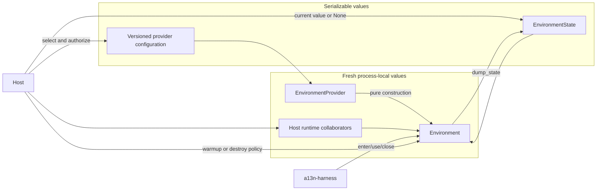
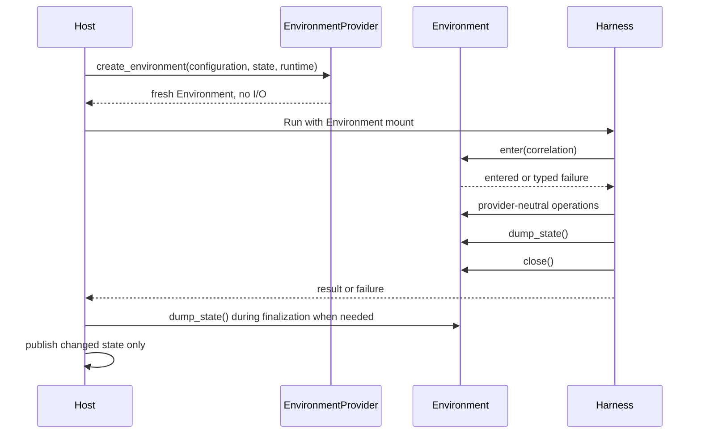
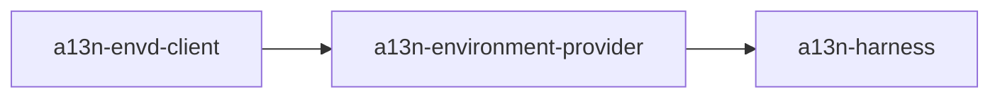

# Environment Provider Architecture

## Design Position

`a13n-environment-provider` is the shared contract and built-in implementation package for one Environment. It separates inert provider selection from process-local operation and portable re-entry state.

The package has exactly three core Environment entities:

1. `EnvironmentProvider` is an inert trusted plugin/factory for one namespaced provider key.
2. `Environment` is a fresh process-local adapter that implements provider operations and re-entry lifecycle.
3. `EnvironmentState` is a provider-owned portable semantic soft reference.

A Provider validates configuration and constructs Environment instances without external I/O. An Environment enters or creates its target, exposes file/shell/process/output/port operations, dumps current state, closes process-local resources without destroying the target, and destroys the target only when a Host explicitly requests it.

## Architecture

Desired configuration and current state are independent. Configuration says what provider target is acceptable. State identifies the current target and codec version when the provider needs a portable reference. A stateless provider may return no state.

## Boundaries

| Concern                                      | Owner                                                  |
| -------------------------------------------- | ------------------------------------------------------ |
| Namespaced Provider key and configuration    | Environment Provider package and implementation        |
| Provider discovery and trusted selection     | Package catalog and Host authorization                 |
| Fresh runtime collaborators and credentials  | Host                                                   |
| Environment construction                     | `EnvironmentProvider` without external I/O             |
| File, shell, process, output, and port I/O   | Entered `Environment`                                  |
| Create, re-enter, and confirmed replacement  | `Environment.enter()` or optional `warmup()`           |
| Portable re-entry state                      | `EnvironmentState`; provider owns opaque payload codec |
| Process-local cleanup                        | `Environment.close()`                                  |
| Backing-target destruction                   | Host policy invoking `Environment.destroy()`           |
| Durable state publication and Thread linkage | Host                                                   |
| Multi-mount routing and Agent-facing policy  | Harness                                                |
| Retention, unused cleanup, and orphan prune  | Host                                                   |

The package does not own Harness state aggregation, mount names, model-facing tools, Agent identity schemas, Thread relationships, durable records, queues, leases, user APIs, or product retention policy.

## Core Flow

For each independent Run:

01. The Host resolves one authorized Provider configuration and its current authoritative `EnvironmentState | None`.
02. The Host supplies fresh process-local runtime collaborators.
03. The Provider validates configuration and state compatibility and constructs a new Environment without I/O.
04. The Host passes that Environment to Harness as one mount candidate.
05. Harness supplies ephemeral Run/Thread/mount correlation and calls `enter()`.
06. The Environment creates, re-enters, or safely replaces a confirmed-absent target and exposes provider-neutral operations.
07. Harness uses the Environment through its Run-local routing and policy facade.
08. Harness snapshots `dump_state()` into portable continuation when requested.
09. Harness calls non-destructive `close()` during Run cleanup.
10. In unconditional finalization, the Host compares supplied and dumped state and publishes only a changed value.
11. Separately, the Host may construct an Environment and invoke `warmup()` or `destroy()` according to retention or prune policy.

## Re-entry Position

`EnvironmentState` is available before entry. No restore step mutates an already entered adapter. A provider can:

- create on absent state;
- re-enter a compatible target identified by state;
- create a replacement only after proving that target absent;
- fail on incompatible, unavailable, or unknown evidence.

A successful create or replacement updates known state before later readiness work. State therefore remains available to Host finalization even if entry, execution, checkpointing, cancellation, or local close later fails.

`close()` never destroys the backing target. This is true for explicit close, context exit, successful completion, failure, and cancellation.

## Operation Backends

The Provider package owns provider-neutral single-Environment contracts for:

- canonical paths and bounded file operations;
- foreground commands and provider process handles;
- retained stdout/stderr access;
- readiness requirements;
- provider ports;
- operation receipts and typed errors;
- state dump, local close, and explicit destruction.

Direct Local implements these contracts over the embedding operating system. Local Envd, Docker, and E2B implement them through `agent-envd` and EIP after provider-specific entry. Harness adds mount names, access ceilings, routing, stale-incarnation fencing, aggregate projection, and model Toolsets.

## Dependency and Release Direction

`a13n-environment-provider` depends on `a13n-envd-client` and exposes Direct Local/EIP operation contracts and built-ins. `a13n-harness` depends on the Provider package. The Provider package never imports Harness.

The package releases independently. Provider configuration and state codec compatibility follow explicit schema and `state_version` values rather than Harness release identity.

## Security Position

- Provider discovery grants no authority. A Host allowlists keys and supplies trusted runtime collaborators.
- Configuration and state carry no credentials, clients, sessions, bearer URLs, process handles, or mutable authority objects.
- State is a selector, not authorization. Entry revalidates provider key, codec version, configuration compatibility, and target metadata.
- Provider denial narrows Harness policy; Harness permission never bypasses provider enforcement.
- Direct Local is an explicit embedding trust choice and does not claim native sandbox isolation.
- Docker and E2B credentials remain in Host runtime collaborators; EIP credentials remain process-local.
- Public errors and observations redact provider-native secrets and unnecessary Host identifiers.

## Stable Principles

01. `EnvironmentProvider`, `Environment`, and `EnvironmentState` are the only shared Environment lifecycle entities.
02. Provider discovery, validation, and Environment construction perform no external I/O.
03. Every independent Run receives fresh Environment instances.
04. State is supplied before entry and is never a live object or existence proof.
05. Confirmed absence may create a replacement; unknown evidence fails.
06. `close()` and context exit are always non-destructive.
07. Only explicit Host policy invokes `destroy()`.
08. Harness owns multi-mount routing, not provider discovery or backing-target lifecycle.
09. Hosts own current state, Thread association, changed-only publication, retention, and prune without a prescribed persistence model.
10. Credentials and process-local clients never enter configuration, `EnvironmentState`, or Harness continuation.
