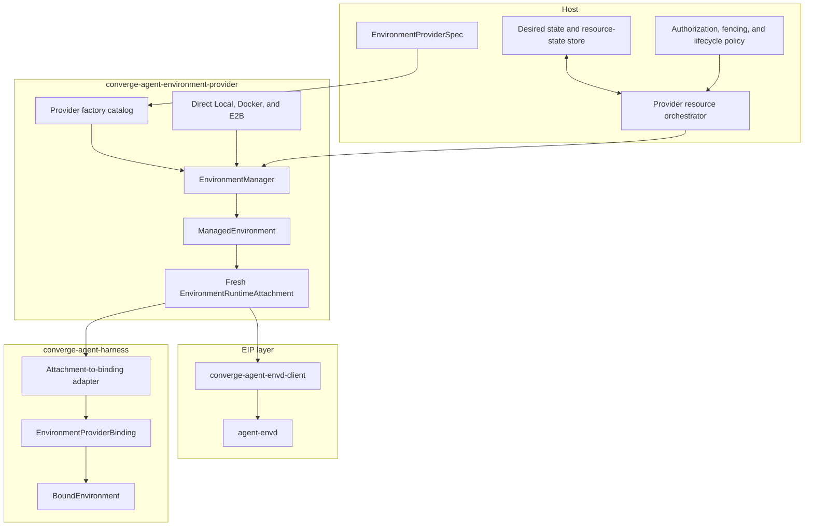
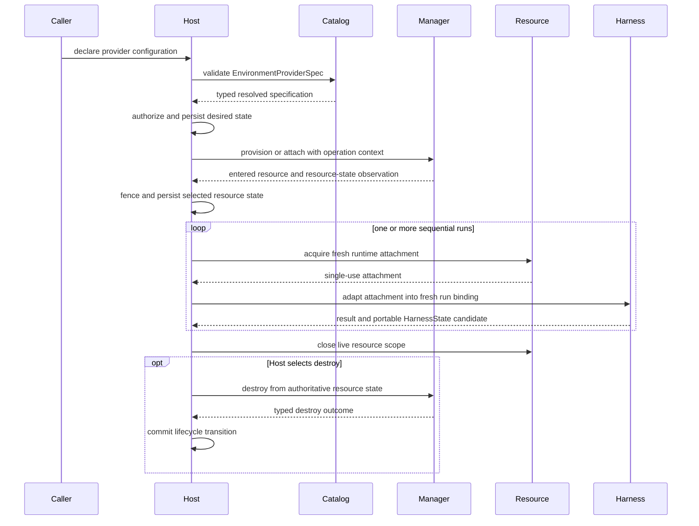

# Environment Provider Architecture

## Design Position

`converge-agent-environment-provider` is the shared Host-facing package for declaring, validating, provisioning, attaching, observing, and retiring Environment provider resources. It lets independently structured Host components understand the same provider configuration without importing Pydantic AI or the complete Harness runtime.

The package separates three values with different authority:

1. an `EnvironmentProviderSpec` is serializable desired configuration;
2. `EnvironmentProviderResourceState` is sensitive provider-owned data persisted and selected by a Host;
3. an `EnvironmentRuntimeAttachment` is a fresh process-local value used to create one Harness run binding.

The package contains built-in Direct Local, Docker, and E2B factories. `converge-agent-harness` depends on it and adapts attachments into provider-neutral run bindings. Any Host can use the same manager directly while retaining its own optional persistence and lifecycle authority.

## Architecture

The Host decides whether to provision, attach, keep, replace, or destroy a resource. A provider manager performs the selected operation and returns typed observations. It never commits those observations durably. The Host stores a resource-state envelope only after its own authorization and fencing checks.

## Boundaries

| Concern                                                                        | Owner                                         | Explicit boundary                                      |
| ------------------------------------------------------------------------------ | --------------------------------------------- | ------------------------------------------------------ |
| Provider specification schema and provider key                                 | Provider package and selected factory         | Serializable, credential-free desired configuration    |
| User authorization and allowed provider configuration                          | Host                                          | Evaluated before manager invocation                    |
| Catalog selection and installed-code trust                                     | Host and provider package                     | Availability is not authorization                      |
| Provision, attach, inspect, maintenance, and destroy implementation            | Provider manager                              | External effects with typed outcomes                   |
| Durable resource records, operation fencing, retry policy, and lease selection | Host                                          | Never delegated to package-global state                |
| Resource-state field meaning and codec                                         | Selected provider                             | Opaque to the Host except envelope and policy metadata |
| Resource-state storage, encryption, retention, and authoritative selection     | Host                                          | Separate from `HarnessState`                           |
| Live provider client and reusable resource scope                               | Bound provider resource                       | Process-local and explicitly closed                    |
| Fresh runtime attachment                                                       | Bound provider resource                       | Single-use, process-local, and non-serializable        |
| Attachment-to-binding adaptation and Environment operations                    | Harness                                       | No provider lifecycle authority                        |
| EIP protocol and session behavior                                              | `converge-agent-envd-client` and `agent-envd` | Independent from vendor provisioning                   |

The provider package does not own an Agent schema, Harness `EnvironmentState`, desired Environment topology, model-facing aliases, tools, durable Execution, queue, database, user API, or product policy.

## Core Flow

Provider resource operations and Host commits are independent. A successful provider API response is not a durable Host transition; a Host transaction cannot make an uncertain provider side effect known. Operation IDs, provider tags, and current provider inspection supply reconciliation evidence without claiming exactly-once execution.

## Operation Backends

Direct Local and EIP are the only operation backends consumed by the Harness:

| Resource integration   | Runtime attachment                 | Harness operation backend |
| ---------------------- | ---------------------------------- | ------------------------- |
| Direct Local           | `DirectLocalEnvironmentAttachment` | Direct Local              |
| Docker                 | `EIPEnvironmentAttachment`         | EIP                       |
| E2B                    | `EIPEnvironmentAttachment`         | EIP                       |
| Compatible third party | One accepted attachment type       | Direct Local or EIP       |

Docker and E2B never use vendor file or command APIs as hidden fallback operations. The vendor SDK manages the outer resource; `agent-envd` and EIP own file, shell, process, output, and port behavior.

## Dependency and Release Direction

The package imports no Harness, Pydantic AI, Host implementation, database, or presentation type. It can depend on the low-level `converge-agent-envd-client`, Docker SDK, E2B SDK, Pydantic, AnyIO, and package-discovery support required by its public contracts.

`converge-agent-harness` depends on `converge-agent-environment-provider`. A Host can depend on either or both according to whether it manages resources, executes Harness runs, or does both; provider configuration and resource management never require importing Harness internals.

`converge-agent-environment-provider` belongs to the Harness release group with `converge-agent-harness` and `converge-agent-stream-protocol`. One Harness release assigns the same version to all three. Published Harness metadata requires the exact provider-package version, while the provider package selects a compatible independently released `converge-agent-envd-client` range. Package version does not replace EIP version negotiation.

## Security Position

Importing the package, reading a provider schema, discovering metadata, building a catalog, constructing a factory, or constructing a manager performs no provider I/O and reads no credential. External effects begin only through an explicit async management operation or entered resource/attachment scope.

Provider specifications contain no credential, bearer token, Docker socket, E2B API key, private endpoint, container ID, sandbox ID, or live session. Current credentials enter through a Host-supplied runtime collaborator. Resource state is sensitive even when it contains no bearer secret because it can carry resource identity and attachment information; it is never model-visible or stored in `HarnessState`.

## Stable Principles

01. One provider specification is understood consistently across Host components without importing the Harness.
02. The Host owns durable desired state, resource-state selection, fencing, and lifecycle decisions.
03. Provider managers implement resource effects but do not persist or commit Host lifecycle.
04. A reusable bound resource and a single-use runtime attachment have separate lifetimes.
05. Harness binding and operation semantics remain independent from provider resource management.
06. Direct Local and EIP are the only Environment operation backends.
07. Docker and E2B use vendor SDKs for lifecycle and EIP for operations.
08. Provider specification, resource state, runtime attachment, Harness state, and EIP session never substitute for one another.
09. Import and construction are inert; async management entry is the first effectful boundary.
10. Failure after possible provider dispatch remains unknown until provider-specific reconciliation supplies evidence.
