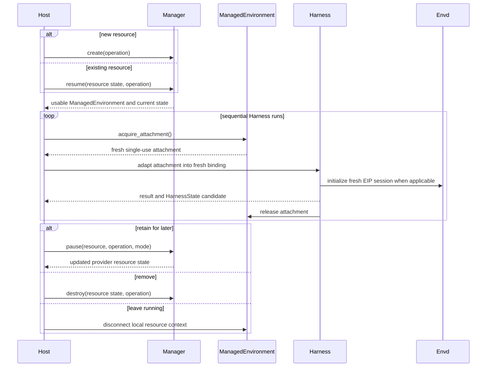

# Resource Management and Runtime Attachments

## Design Position

An `EnvironmentManager` is the small Host-facing management API for one resolved provider specification. It creates a resource, resumes an existing resource, pauses it when the provider supports suspension, destroys it, reconciles uncertain lifecycle operations, and exposes fresh runtime attachments while the resource is usable.

The Manager encapsulates vendor lifecycle differences without becoming a durable store or a second Environment operation API. A Host chooses whether to retain the returned provider state and when to invoke each lifecycle action. The Harness consumes only a fresh attachment and continues to own file, shell, process, output, port, topology, and portable Environment-state behavior.

## Resource Model

The following Python-like API is conceptual and process-local except for `EnvironmentProviderResourceState`:

```python
class EnvironmentProviderResourceState(BaseModel):
    model_config = ConfigDict(frozen=True, extra="forbid")

    provider_key: str
    state_version: str
    data: JsonValue


class EnvironmentPauseMode(StrEnum):
    FULL = "full"
    FILESYSTEM = "filesystem"


class EnvironmentResourceAllocation(StrEnum):
    SINGLE_FROM_SPEC = "single_from_spec"
    MULTIPLE_FROM_SPEC = "multiple_from_spec"


class EnvironmentAttachmentConcurrency(StrEnum):
    SINGLE = "single"
    SHARED = "shared"


class EnvironmentLifecycleCapabilities(BaseModel):
    model_config = ConfigDict(frozen=True)

    pause_modes: frozenset[EnvironmentPauseMode] = frozenset()
    resource_allocation: EnvironmentResourceAllocation
    attachment_concurrency: EnvironmentAttachmentConcurrency


class EnvironmentManagementAction(StrEnum):
    CREATE = "create"
    RESUME = "resume"
    PAUSE = "pause"
    DESTROY = "destroy"


class EnvironmentOperationContext(BaseModel):
    model_config = ConfigDict(frozen=True, extra="forbid")

    operation_id: str
    action: EnvironmentManagementAction
    resource_correlation: str
    attempt: int


class EnvironmentReconciliationPhase(StrEnum):
    RUNNING = "running"
    PAUSED = "paused"
    ABSENT = "absent"
    UNKNOWN = "unknown"


class EnvironmentReconciliationResult(BaseModel):
    model_config = ConfigDict(frozen=True, extra="forbid")

    operation_id: str
    phase: EnvironmentReconciliationPhase
    state: EnvironmentProviderResourceState | None
    evidence: JsonValue | None


class EnvironmentManager(ABC):
    @property
    def lifecycle_capabilities(
        self,
    ) -> EnvironmentLifecycleCapabilities: ...

    async def create(
        self,
        *,
        operation: EnvironmentOperationContext,
    ) -> ManagedEnvironment: ...

    async def resume(
        self,
        state: EnvironmentProviderResourceState,
        *,
        operation: EnvironmentOperationContext,
    ) -> ManagedEnvironment: ...

    async def pause(
        self,
        environment: ManagedEnvironment,
        *,
        operation: EnvironmentOperationContext,
        mode: EnvironmentPauseMode = EnvironmentPauseMode.FULL,
    ) -> EnvironmentProviderResourceState: ...

    async def destroy(
        self,
        state: EnvironmentProviderResourceState,
        *,
        operation: EnvironmentOperationContext,
    ) -> None: ...

    async def reconcile(
        self,
        operation: EnvironmentOperationContext,
        *,
        last_known_state: EnvironmentProviderResourceState | None,
    ) -> EnvironmentReconciliationResult: ...


class ManagedEnvironment(AbstractAsyncContextManager["ManagedEnvironment"]):
    @property
    def state(self) -> EnvironmentProviderResourceState: ...

    def acquire_attachment(
        self,
    ) -> AsyncContextManager[EnvironmentRuntimeAttachment]: ...
```

A factory constructs one inert Manager from validated provider configuration and a fresh Host runtime context containing credential and client construction collaborators. Entering or invoking the Manager is the first effectful boundary. Provider SDK clients, subprocesses, and network calls remain lazy and explicit.

Every effectful method requires a Host-generated `EnvironmentOperationContext`. `operation_id` is globally unique within the Host's provider-resource scope, `action` must match the method, `resource_correlation` is the stable Host resource-instance correlation, and `attempt` increases only when Host policy permits a retry. Providers pass the operation identity to vendor idempotency fields or durable resource tags where available. Reusing one operation context cannot target a different action or Host resource.

`create()` returns a usable new resource. `resume()` takes provider-owned state for an existing resource and returns it in a usable running form. If the resource is already running, resume attaches without replacing it; if it is suspended, resume performs the provider's restore/start operation. It never silently creates a different resource when the selected state is missing or incompatible.

`pause()` consumes the live resource and returns updated state after the provider confirms suspension. `FULL` asks the provider to preserve its complete resumable runtime when supported. `FILESYSTEM` preserves the provider filesystem but permits processes and memory to be discarded. An unsupported mode fails before changing the resource. `destroy()` is explicit and terminal; leaving a `ManagedEnvironment` context only disconnects local clients and maintenance tasks.

`reconcile()` performs bounded read-only provider inspection for one exact prior operation. It returns `RUNNING` or `PAUSED` only with a validated provider state for the identified resource, `ABSENT` only when provider evidence authoritatively proves no matching resource exists, and `UNKNOWN` with no state when the provider cannot establish a safe fact. It never creates, resumes, pauses, or destroys a resource. For an uncertain create with no returned state, the provider uses the operation identity and resource correlation recorded in vendor metadata to find the exact resource or prove absence. For other actions, it validates both the last known state and operation correlation.

A Manager exposes only lifecycle behavior shared well enough to be dependable. Provider-specific template authoring, account administration, image building, billing, unscoped listing, and arbitrary vendor API passthrough are not added to this interface. Reconciliation is exact-operation inspection, not a generic provider browser.

## Provider Resource State

`EnvironmentProviderResourceState` is the minimum provider-owned value needed to find and resume or destroy one resource. It commonly contains a container or sandbox ID plus a bounded provider generation or configuration fingerprint. It can contain private routing facts when required, but never a credential or live client.

The provider owns `state_version`, data validation, and compatibility. A Host may keep the state in memory or persist it under its own security and retention policy. Possession of the value does not grant access: every resume or destroy operation still uses current Host-supplied credentials and provider checks.

Provider resource state is not portable Harness state. It never enters `HarnessState.environment_state`, model context, Environment descriptors, tool results, or ordinary events. It also does not contain an EIP session, transfer, process handle, output reference, or `agent-envd` operation record.

## Runtime Attachments

The shared attachment union is deliberately small:

```python
@dataclass(frozen=True, slots=True)
class DirectLocalEnvironmentAttachment:
    attachment_id: str
    environment_id: str
    configuration: DirectLocalProviderConfiguration


@dataclass(frozen=True, slots=True)
class EIPEnvironmentAttachment:
    attachment_id: str
    environment_id: str
    session_source: EIPSessionSource


type EnvironmentRuntimeAttachment = (
    DirectLocalEnvironmentAttachment | EIPEnvironmentAttachment
)
```

An attachment is fresh, process-local, non-serializable, and single-use. `attachment_concurrency=SINGLE` permits at most one active attachment from a managed resource. `SHARED` permits several independently scoped active attachments only when the provider explicitly implements safe concurrent access to the same underlying resource. Closing one attachment releases only its binding-local resources and leaves the managed provider resource and other authorized attachments available.

The provider package imports no Harness type. The Harness adapter exhaustively converts:

- `DirectLocalEnvironmentAttachment` to a fresh Direct Local provider binding;
- `EIPEnvironmentAttachment` to a fresh EIP-backed provider binding.

Unknown attachment types fail before aggregate transfer. Docker and E2B never return vendor-native file or command attachments.

## EIP Session Sources

An EIP attachment carries an explicit session source:

```python
class EIPSessionSource(ABC):
    @abstractmethod
    def open_session(
        self,
        *,
        expected_environment_id: str,
        required_methods: frozenset[str],
    ) -> AsyncContextManager[EIPSession]: ...

    async def discard(self) -> None: ...
```

Each entry returns a fresh initialized low-level `EIPSession` or fails. `discard()` releases the unentered source's private subprocess pipes or accepted WebSocket and clears retained HTTP credential material; it is idempotently invoked only through the owning attachment/binding cleanup path. The source owns carrier acquisition and transport authentication. Generated methods, initialization validation, operation IDs, transfers, timeout, cancellation, reconciliation, and errors remain owned by `converge-agent-envd-client` and EIP.

Supported sources are:

| Public source                       | Acquisition                                                               | Protocol role                  |
| ----------------------------------- | ------------------------------------------------------------------------- | ------------------------------ |
| `StdioEIPSessionSource`             | Claim one private asyncio subprocess with `agent-envd` stdin/stdout pipes | Client requests; envd responds |
| `HttpEIPSessionSource`              | Dial one dedicated authenticated EIP HTTP(S) endpoint                     | Client requests; envd responds |
| `AcceptedWebSocketEIPSessionSource` | Claim one already-authenticated `websockets.ServerConnection`             | Client requests; envd responds |

Each concrete source is a fresh single-use process-local value. Stdio captures the subprocess and transport bounds; HTTP captures the normalized endpoint, Bearer credential, optional additive CA trust, and finite client/session bounds; accepted reverse WebSocket captures the Host-accepted connection and transport bounds. The common initialization arguments remain the `expected_environment_id` and exact `required_methods` supplied by the Harness binding.

For reverse WebSocket, the Host listener authenticates and bounds the upgrade before constructing the source, then transfers the accepted `ServerConnection` exactly once. `AcceptedWebSocketEIPSessionSource` passes that object to the low-level `AcceptedWebSocketTransport` and sends `initialize`; it does not inspect or repeat the Bearer credential. Envd remains the responder even though it opened the carrier.

A source never shares an initialized session, resumes a transfer, or automatically retries an operation whose dispatch is ambiguous. Same-generation reconnect creates a fresh EIP session. A changed daemon generation requires a fresh Harness binding revision.

## Lifecycle and Harness Flow



A `ManagedEnvironment` can span sequential Harness runs. Every run still receives a fresh `EnvironmentProviderBinding`, and every EIP-backed binding receives a fresh initialized session. A Host requesting concurrent access either uses an explicitly `SHARED` managed resource or, when `resource_allocation=MULTIPLE_FROM_SPEC`, creates independently fenced resources. It never infers sharing or independent allocation from repeated Host record creation.

Closing a Harness binding, disconnecting a `ManagedEnvironment`, pausing a resource, and destroying it are separate facts. Harness cleanup never chooses pause or destroy policy.

## Resume Semantics

Resume restores provider resources, not Harness authority:

1. the Host selects a validated provider specification and matching provider resource state;
2. `EnvironmentManager.resume()` makes that resource usable or fails explicitly;
3. the managed resource starts or validates `agent-envd` as required by the provider;
4. the resource issues a fresh attachment;
5. the Harness creates a fresh binding and EIP session;
6. the Harness restores optional portable `EnvironmentState` only after fresh binding authority exists.

A full-memory sandbox resume can preserve the in-sandbox `agent-envd` process and daemon generation, but every external connection and EIP session is still fresh. A filesystem-only resume can reboot the sandbox, so the provider restarts `agent-envd`; its daemon generation changes and no prior EIP handle, process reference, receipt, or output reference remains valid.

EIP 1.0 contributes no `EnvironmentBindingState`. Provider-managed filesystem persistence and Harness portable Environment state are separate mechanisms and must not be double-counted as session restoration.

## Failure Semantics

| Failure                                                | Outcome                                                                              |
| ------------------------------------------------------ | ------------------------------------------------------------------------------------ |
| Create fails before a resource exists                  | No `ManagedEnvironment` is returned                                                  |
| Create outcome is uncertain                            | Typed unknown outcome; caller reconciles the exact operation before another create   |
| Resume state is missing, expired, or incompatible      | Explicit failure; no replacement resource is created                                 |
| Pause fails before acceptance                          | Resource remains live when the provider can prove it                                 |
| Pause outcome is uncertain                             | No claim that the resource is running or paused; reconcile before another transition |
| Attachment acquisition or initialization fails         | No Harness binding is published; managed resource can remain usable                  |
| Reconciliation proves exact resource running/paused    | Return validated state that the Host can select under its own fence                  |
| Reconciliation proves authoritative absence            | Return `ABSENT`; Host policy can permit retry or terminal destroy                    |
| Reconciliation evidence is insufficient                | Return `UNKNOWN`; no lifecycle transition is inferred                                |
| EIP carrier fails after possible operation dispatch    | EIP operation outcome remains owned by EIP; provider lifecycle is unchanged          |
| Harness binding cleanup fails                          | Harness preserves the nearest valid operation/result candidate                       |
| Managed-resource disconnect fails                      | Provider cleanup failure; no implied pause or destroy                                |
| Destroy reports not found                              | Successful absence only when the provider response is authoritative                  |
| External cancellation after possible provider dispatch | Cancellation propagates with unknown outcome preserved                               |

Management, reconciliation, and attachment entry have finite timeouts and preserve provider error categories needed for a caller to distinguish invalid input, unavailable service, missing resource, unsupported lifecycle action, and unknown outcome. Reconciliation evidence is bounded, credential-free, and safe for Host diagnostics; it does not expose raw credentials, request bodies, unbounded listings, or vendor object representations.

## Security and Dependencies

Provider credentials are supplied through a live Host collaborator and are absent from specification, resource state, attachment values, Harness state, model context, and default telemetry. Docker daemon access, E2B API credentials, and EIP session credentials remain separate authorities.

Synchronous vendor SDK calls execute through a bounded worker-thread boundary such as `anyio.to_thread.run_sync`. The Manager does not create a second thread scheduler or hide long-running work on the event loop.

## Compatibility

Provider configuration schema, Manager API, provider resource-state codec, lifecycle allocation/concurrency capabilities, attachment union, vendor SDK, EIP version, and Harness adapter are independent compatibility axes. The Harness release group aligns package APIs; provider and wire states retain their own versions.

Making attachment values reusable, treating resource-context exit as pause/destroy, silently recreating on failed resume, using vendor operations as Harness file/process fallbacks, or storing provider resource state in `HarnessState` is incompatible.

## Invariants

01. The Manager API is limited to create, resume, pause, destroy, exact-operation reconciliation, and fresh attachment acquisition.
02. A Host chooses lifecycle actions and optional storage; the provider package owns no durable resource registry.
03. Resume returns the selected existing resource or fails; it never silently creates a replacement.
04. Provider resource state is credential-free, provider-owned, and distinct from `HarnessState`.
05. A managed resource spans sequential runs, while every attachment, binding, and EIP session is fresh and single-use.
06. Closing a binding, disconnecting a resource, pausing it, and destroying it are independent operations.
07. Pause modes, resource-allocation cardinality, and attachment concurrency are explicit capabilities rather than inferred from provider names.
08. Docker and E2B use EIP for all Harness Environment operations.
09. Resume reestablishes provider and binding authority before portable Environment state restoration.
10. Cancellation and transport failure never convert possible side effects into non-dispatch or rollback.
11. Every effectful management call carries one stable Host operation identity, and reconciliation inspects only that exact operation/resource correlation.
12. Reconciliation is read-only and returns running, paused, absent, or unknown evidence; it never creates a replacement resource.
