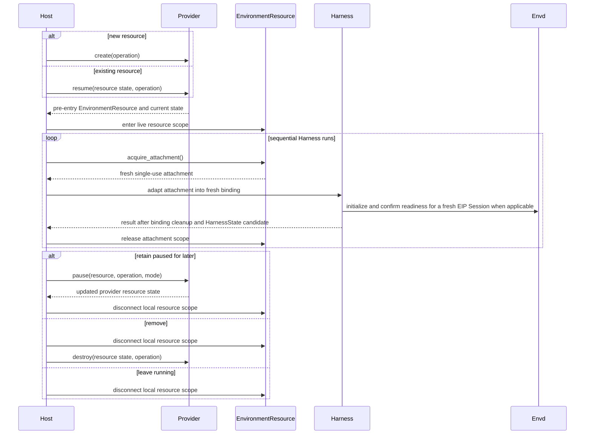

# Resource Management and Runtime Attachments

## Design Position

An `EnvironmentProvider` is the small Host-facing management API for one resolved provider specification. It creates a resource, resumes an existing resource, pauses it when the provider supports suspension, destroys it, reconciles uncertain lifecycle operations, and exposes fresh runtime attachments while the resource is usable.

The Provider encapsulates vendor lifecycle differences without becoming a durable store or a second Environment operation API. A Host chooses whether to retain the returned provider state and when to invoke each durable lifecycle action. The shared `ephemeral()` scope is the one convenience path for a caller that intentionally owns a temporary resource only for the duration of one use. The Harness consumes a Provider through that scope or borrows an already entered Resource, then continues to own file, shell, process, output, port, topology, and portable Environment-state behavior.

## Resource Model

The following Python-like API is conceptual and process-local except for `EnvironmentProviderResourceState`:

```python
class EnvironmentProviderResourceState(BaseModel):
    model_config = ConfigDict(frozen=True, extra="forbid")

    provider_key: str
    state_version: str
    data: JsonValue


class EnvironmentPauseMode(StrEnum):
    FULL = "full"
    FILESYSTEM = "filesystem"


class EnvironmentResourceAllocation(StrEnum):
    SINGLE_FROM_SPEC = "single_from_spec"
    MULTIPLE_FROM_SPEC = "multiple_from_spec"


class EnvironmentAttachmentConcurrency(StrEnum):
    SINGLE = "single"
    SHARED = "shared"


class EnvironmentLifecycleCapabilities(BaseModel):
    model_config = ConfigDict(frozen=True)

    pause_modes: frozenset[EnvironmentPauseMode] = frozenset()
    resource_allocation: EnvironmentResourceAllocation
    attachment_concurrency: EnvironmentAttachmentConcurrency


class EnvironmentManagementAction(StrEnum):
    CREATE = "create"
    RESUME = "resume"
    PAUSE = "pause"
    DESTROY = "destroy"


class EnvironmentOperationContext(BaseModel):
    model_config = ConfigDict(frozen=True, extra="forbid")

    operation_id: str
    action: EnvironmentManagementAction
    resource_correlation: str
    attempt: int


class EnvironmentReconciliationPhase(StrEnum):
    RUNNING = "running"
    PAUSED = "paused"
    ABSENT = "absent"
    UNKNOWN = "unknown"


class EnvironmentReconciliationResult(BaseModel):
    model_config = ConfigDict(frozen=True, extra="forbid")

    operation_id: str
    phase: EnvironmentReconciliationPhase
    state: EnvironmentProviderResourceState | None
    evidence: JsonValue | None


class EnvironmentProvider(ABC):
    @property
    @abstractmethod
    def lifecycle_capabilities(
        self,
    ) -> EnvironmentLifecycleCapabilities: ...

    @abstractmethod
    async def create(
        self,
        *,
        operation: EnvironmentOperationContext,
    ) -> EnvironmentResource: ...

    @abstractmethod
    async def resume(
        self,
        state: EnvironmentProviderResourceState,
        *,
        operation: EnvironmentOperationContext,
    ) -> EnvironmentResource: ...

    @abstractmethod
    async def pause(
        self,
        environment: EnvironmentResource,
        *,
        operation: EnvironmentOperationContext,
        mode: EnvironmentPauseMode = EnvironmentPauseMode.FULL,
    ) -> EnvironmentProviderResourceState: ...

    @abstractmethod
    async def destroy(
        self,
        state: EnvironmentProviderResourceState,
        *,
        operation: EnvironmentOperationContext,
    ) -> None: ...

    @abstractmethod
    async def reconcile(
        self,
        operation: EnvironmentOperationContext,
        *,
        last_known_state: EnvironmentProviderResourceState | None,
    ) -> EnvironmentReconciliationResult: ...

    def ephemeral(
        self,
        *,
        resource_correlation: str | None = None,
    ) -> AbstractAsyncContextManager[EnvironmentResource]: ...


class EnvironmentResource(AbstractAsyncContextManager["EnvironmentResource"]):
    @property
    @abstractmethod
    def state(self) -> EnvironmentProviderResourceState: ...

    @property
    def is_entered(self) -> bool: ...

    @abstractmethod
    def acquire_attachment(
        self,
    ) -> AbstractAsyncContextManager[EnvironmentRuntimeAttachment]: ...
```

A factory constructs one inert Provider from validated provider configuration and a fresh Host runtime context containing credential and client construction collaborators. Invoking a Provider lifecycle or reconciliation method is the first effectful boundary. Provider SDK clients, subprocesses, and network calls remain lazy and explicit.

Every Provider call requires a Host-generated `EnvironmentOperationContext`. For `create()`, `resume()`, `pause()`, and `destroy()`, `action` matches the invoked method. `reconcile()` instead receives the context of the exact prior lifecycle action being inspected; it does not invent a `reconcile` action. `operation_id` identifies one logical lifecycle operation and remains stable across its permitted attempts and reconciliation calls. `attempt` starts at one and increases only when Host policy permits another dispatch attempt for that same operation. `resource_correlation` remains stable for the Host resource record across different lifecycle operations. A different operation ID denotes a different lifecycle decision and cannot bypass an unresolved prior operation. Providers pass the stable operation identity to vendor idempotency fields or durable resource tags where available, and reject reuse with another action or resource correlation.

`create()` establishes the provider's resource for the resolved specification and returns a pre-entry `EnvironmentResource` whose current `state` is immediately available for Host fencing and persistence. An allocating provider provisions a resource; a deterministic non-allocating provider can validate and expose its one logical target without creating an external object. `resume()` takes provider-owned state for an existing resource and similarly returns a pre-entry Resource in a usable running form. If the resource is already running, resume attaches without replacing it; if it is suspended, resume performs the provider's restore/start operation. It never silently creates a different resource when the selected state is missing or incompatible.

A returned `EnvironmentResource` is a single-entry process-local resource scope. Entry starts only live clients, maintenance, attachment issuance, and any Resource-local backend needed while the already identified logical provider resource is in use. A provider whose durable identity is configuration and correlation rather than an external allocation can therefore launch an entry-owned local process here; that process is not retroactively the resource identity returned by `create()` or `resume()`. When an EIP-backed Resource must prove daemon availability before issuing attachments, entry opens a provider-owned EIP Session, completes initialize plus the mandatory initial `environment.readiness` operation, and cleanly closes that Session; it does not use a provider-native command, filesystem marker, generic health route, or future attachment as readiness evidence. Exit closes those local responsibilities and Resource-local backends and does not pause, destroy, or rewrite the logical provider state. `state` remains the latest provider observation for that Resource. `acquire_attachment()` is valid only while the resource scope is entered.

`pause()` requires the matching entered Resource after all attachment scopes have closed and returns updated state after the provider confirms suspension. `FULL` asks the provider to preserve its complete resumable runtime when supported. `FILESYSTEM` preserves the provider filesystem but permits processes and memory to be discarded. An unsupported mode fails before changing the resource. A successful pause makes that Resource scope unavailable for new attachments; the Host then exits it. `destroy()` is explicit and terminal, uses validated state only after live attachment/resource scopes have closed, and never acts through a stale `EnvironmentResource`. Leaving an `EnvironmentResource` context only disconnects local clients and maintenance tasks.

`reconcile()` performs bounded read-only provider inspection for one exact prior operation. It returns `RUNNING` or `PAUSED` only with a validated provider state for the identified resource, `ABSENT` only when provider evidence authoritatively proves no matching resource exists, and `UNKNOWN` with no state when the provider cannot establish a safe fact. `RUNNING` and `PAUSED` therefore require `state`; `ABSENT` and `UNKNOWN` require `state=None`; every result repeats the inspected `operation_id`. It never creates, resumes, pauses, or destroys a resource.

For a provider that allocates one of several possible resources from the same specification, uncertain create reconciliation uses operation identity and resource correlation recorded in provider metadata to find the exact allocation or prove absence. A deterministic `SINGLE_FROM_SPEC` provider that performs no allocation can instead derive the one target from its exact resolved specification and inspect it directly; it does not manufacture resource tags merely to mirror an allocating provider. For actions with returned state, reconciliation validates that state and the operation correlation applicable to the provider's actual lifecycle effects.

### Ephemeral ownership

`ephemeral()` creates one temporary Resource, enters it, yields it, exits it, and destroys its latest observed state. It generates one stable resource correlation when the caller does not supply one and distinct lifecycle operation IDs for create, resume when needed, and destroy. A retry of the same uncertain operation keeps its operation ID and increments only `attempt`.

If create has an unknown outcome, the scope reconciles that exact operation. Authoritative absence permits one create retry; authoritative running or paused evidence resumes the identified Resource; any still-unknown or invalid reconciliation fails without allocating another identity. If destroy has an unknown outcome, authoritative absence completes cleanup, while running or paused evidence permits one destroy retry. Reconciliation always repeats the inspected operation ID.

Resource entry failure, caller failure, normal return, and cancellation all trigger Resource exit when entry completed and then destroy. A caller failure and cleanup failure are both preserved. Cancellation remains the primary exception and records cleanup failure as secondary diagnostic information. The scope does not pause, persist state, or make a Resource reusable after it exits.

This convenience scope is appropriate when the caller owns the complete temporary lifetime, including Harness-owned Provider inputs. Durable or reusable flows use explicit `create()` or `resume()`, enter the Resource outside one run, acquire a fresh attachment for each run, then explicitly pause or destroy after every attachment closes.

A Provider exposes only lifecycle behavior shared well enough to be dependable. Provider-specific template authoring, account administration, image building, billing, unscoped listing, and arbitrary vendor API passthrough are not added to this interface. Reconciliation is exact-operation inspection, not a generic provider browser.

## Public Errors and Outcome Certainty

Provider specification, catalog, Provider, Resource, and attachment failures use one common public exception contract. Stable generic fields let any Host recover consistently, while a rich description, structured provider details, and the protected original cause remain available to trusted developers.

```python
class EnvironmentProviderErrorCategory(StrEnum):
    INVALID = "invalid"
    UNSUPPORTED = "unsupported"
    MISSING = "missing"
    DENIED = "denied"
    CONFLICT = "conflict"
    UNAVAILABLE = "unavailable"
    TIMEOUT = "timeout"
    UNKNOWN_OUTCOME = "unknown_outcome"
    CLEANUP = "cleanup"
    PROVIDER_FAILURE = "provider_failure"


class EnvironmentProviderOutcomeCertainty(StrEnum):
    NOT_DISPATCHED = "not_dispatched"
    KNOWN = "known"
    UNKNOWN = "unknown"


class EnvironmentProviderRecoveryHint(StrEnum):
    NONE = "none"
    FIX_INPUT = "fix_input"
    REFRESH_RUNTIME = "refresh_runtime"
    RETRY_SAME_OPERATION = "retry_same_operation"
    RECONCILE = "reconcile"


class EnvironmentProviderErrorContext(BaseModel):
    model_config = ConfigDict(frozen=True, extra="forbid")

    provider_key: str | None = None
    schema_version: str | None = None
    state_version: str | None = None
    action: EnvironmentManagementAction | None = None
    operation_id: str | None = None
    resource_correlation: str | None = None
    attachment_id: str | None = None
    distribution_name: str | None = None
    distribution_version: str | None = None


class EnvironmentProviderSafeError(BaseModel):
    model_config = ConfigDict(frozen=True, extra="forbid")

    code: str
    category: EnvironmentProviderErrorCategory
    certainty: EnvironmentProviderOutcomeCertainty
    message: str
    recovery_hint: EnvironmentProviderRecoveryHint
    context: EnvironmentProviderErrorContext


class EnvironmentProviderError(Exception):
    code: str
    category: EnvironmentProviderErrorCategory
    certainty: EnvironmentProviderOutcomeCertainty
    description: str
    recovery_hint: EnvironmentProviderRecoveryHint
    context: EnvironmentProviderErrorContext
    details: Mapping[str, JsonValue]

    def safe_projection(self) -> EnvironmentProviderSafeError: ...
```

`category`, `certainty`, and `recovery_hint` are the provider-independent decision fields. `code` is a bounded stable diagnostic identifier. The package reserves the `provider_` prefix for its standard codes; a third-party provider can add finer codes under its own provider-key namespace while mapping each to one standard category and certainty. A Host uses category and certainty for generic lifecycle decisions and can use an exact code for provider-specific developer experience.

The standard package codes are:

| Code                              | Category           | Meaning                                                        |
| --------------------------------- | ------------------ | -------------------------------------------------------------- |
| `provider_spec_invalid`           | `invalid`          | Invalid provider key, envelope, parameters, or intrinsic value |
| `provider_schema_unsupported`     | `unsupported`      | Unsupported configuration schema version                       |
| `provider_factory_missing`        | `missing`          | Selected built-in or extension factory is unavailable          |
| `provider_factory_duplicate`      | `conflict`         | Catalog key collision or duplicate selection                   |
| `provider_factory_target_invalid` | `invalid`          | Selected target is not the required factory class              |
| `provider_factory_load_failed`    | `provider_failure` | Selected factory target or constructor failed                  |
| `provider_factory_failed`         | `provider_failure` | Factory failed to construct a Provider                         |
| `provider_runtime_invalid`        | `invalid`          | Runtime collaborator has the wrong provider type or shape      |
| `provider_state_invalid`          | `invalid`          | State key, version, codec, or correlation is incompatible      |
| `provider_action_unsupported`     | `unsupported`      | Requested lifecycle action or pause mode is unsupported        |
| `provider_resource_missing`       | `missing`          | Provider authoritatively reports the selected resource absent  |
| `provider_denied`                 | `denied`           | Current provider credentials or account policy deny the action |
| `provider_conflict`               | `conflict`         | Existing resource or operation conflicts with this request     |
| `provider_unavailable`            | `unavailable`      | Provider service or required local dependency is unavailable   |
| `provider_timeout`                | `timeout`          | A known-safe or non-dispatched operation exceeded its deadline |
| `provider_unknown_outcome`        | `unknown_outcome`  | A lifecycle effect may have occurred and requires reconcile    |
| `provider_attachment_invalid`     | `invalid`          | Attachment identity, configuration, or source is incompatible  |
| `provider_attachment_conflict`    | `conflict`         | Attachment or acquisition scope was reused or overlaps policy  |
| `provider_cleanup_failed`         | `cleanup`          | Local resource, attachment, or client cleanup failed           |
| `provider_failure`                | `provider_failure` | No narrower stable provider category applies                   |

`description` is rich trusted-developer diagnostics and is the normal exception string. It can name the failing validation field, non-secret native path, vendor status/code/request ID, attempted lifecycle step, and bounded provider-specific facts needed to debug the integration. `details` is recursively detached finite JSON and can provide the same information structurally. Neither value is automatically safe for a user response, model context, ordinary event, or default telemetry. Even the developer form never contains credentials, authorization headers, bearer material, raw request bodies, or unbounded SDK object representations. The original exception remains available through normal Python exception chaining for a trusted local traceback.

`safe_projection()` is the explicit bounded publication boundary. Its generic `message` and typed context omit `description`, provider-specific `details`, native paths, parameter/state payloads, endpoints, vendor exception text, and traceback data. Hosts use this projection, not `str(error)` or `repr(error)`, when persisting ordinary diagnostics or emitting events and telemetry.

`NOT_DISPATCHED` proves that no provider lifecycle effect was requested. `KNOWN` means the call has a terminal known success-independent failure, including an authoritative missing or denied result. `UNKNOWN` means an external lifecycle effect may have occurred and the exact prior operation must be reconciled before another lifecycle decision or dispatch attempt. `provider_unknown_outcome` is the only standard code permitted with `certainty=UNKNOWN`; it requires action, operation ID, and resource correlation in the context and uses `recovery_hint=RECONCILE`. A timeout or unavailable response after possible dispatch is therefore unknown outcome, not a retry-shaped timeout or unavailable error.

Successful methods retain the Provider signatures above: create/resume return a Resource, pause returns updated state, destroy returns `None`, and reconcile returns `EnvironmentReconciliationResult`. Authoritative not-found during destroy is successful absence and returns `None`. Errors describe failure or uncertainty rather than forming an alternate success union.

Native task cancellation remains cancellation and is never wrapped in `EnvironmentProviderError`. A Host conservatively records a cancelled in-flight lifecycle call as unknown when that provider may have dispatched an external lifecycle effect, then reconciles its exact operation before retry or another lifecycle decision. A provider whose accepted contract proves the call performs no external lifecycle effect, such as Direct Local validation and logical detach, can safely repeat the same operation after cancellation. Cancellation of read-only `reconcile()` can likewise rerun that reconciliation. Providers perform bounded cancellation-shielded local cleanup and preserve the protected cause but never swallow cancellation to manufacture a normal return value.

After `pause()` raises an unknown-outcome error or is cancelled in flight, the Resource rejects new attachment acquisition. The Host closes its live scope and reconciles before deciding whether to resume, destroy, or report the resource running. A pause failure known not to have dispatched, or a known provider rejection that authoritatively leaves the resource running, does not by itself revoke that entered scope. Create/resume unknown outcomes return no Resource; destroy unknown outcome retains the Host's last authoritative state.

A Host can increment `attempt` for the same operation only after a non-dispatched failure, after a provider-documented replay-safe known result, or after reconciliation establishes a phase from which replay is safe. It never uses a new operation ID or a higher attempt to bypass unknown outcome. `recovery_hint` guides developer and Host behavior but never overrides current authorization, Host retry policy, or these certainty rules.

## Provider Resource State

`EnvironmentProviderResourceState` is the minimum provider-owned value needed to find and resume or destroy one resource. It commonly contains a container or sandbox ID plus a bounded provider generation or configuration fingerprint. It can contain private routing facts when required, but never a credential or live client.

The provider owns `state_version`, recursively detached finite-JSON `data`, validation, and compatibility. A Provider accepts only state whose `provider_key` matches its resolved specification and whose state version and payload validate under that provider's exact codec. A Host may keep the state in memory or persist it under its own security and retention policy. Possession of the value does not grant access: every resume or destroy operation still uses current Host-supplied credentials and provider checks.

Provider resource state is not portable Harness state. It never enters `HarnessState.environment_state`, model context, Environment descriptors, tool results, or ordinary events. It also does not contain an EIP session, transfer, process handle, output reference, or `agent-envd` operation record.

## Runtime Attachments

The shared attachment union is deliberately small:

```python
@dataclass(frozen=True, slots=True)
class DirectLocalEnvironmentAttachment:
    attachment_id: str
    environment_id: str
    configuration: DirectLocalProviderConfiguration


@dataclass(frozen=True, slots=True)
class EIPEnvironmentAttachment:
    attachment_id: str
    environment_id: str
    session_source: EIPSessionSource


type EnvironmentRuntimeAttachment = (
    DirectLocalEnvironmentAttachment | EIPEnvironmentAttachment
)
```

An attachment is fresh, process-local, non-serializable, and single-use. `attachment_id` is a bounded correlation value unique among attachments issued by one entered Resource scope; it is neither resource identity nor authority. `environment_id` matches the Resource, and a Direct Local attachment's configuration carries that same identity. An identity mismatch fails before Harness binding publication.

The async context returned by `acquire_attachment()` is the attachment concurrency lease. The Host keeps it open around attachment adaptation and the complete lifetime of the resulting Harness binding. Claiming the attachment transfers its binding-local runtime material to that binding; exiting the acquisition scope then releases only the Resource concurrency lease. If the attachment was never claimed, scope exit discards its private runtime material. The acquisition scope never pauses, destroys, or closes the Resource.

`attachment_concurrency=SINGLE` permits at most one active acquisition scope from a Resource. `SHARED` permits several independently scoped active attachments only when the provider explicitly implements safe concurrent access to the same underlying resource. Closing one attachment and its acquisition scope releases only its binding-local resources and leaves the managed provider resource and other authorized attachments available.

### Replacement and Cleanup Layers

Provider plugins replace the complete management and attachment behavior through the abstract contracts above. Cleanup has three independent layers:

1. the Harness closes or discards one transferred provider binding when a run ends or topology replacement retires that binding;
2. exiting `acquire_attachment()` releases its concurrency lease and any untransferred attachment material, while exiting `EnvironmentResource` closes process-local provider clients, maintenance tasks, and attachment admission;
3. only the Host selects a later Provider `pause()` or `destroy()` operation for an external provider resource after its own reference, policy, and fencing checks.

A plugin implements all Provider methods even when one action is a validated no-op or explicitly unsupported. Direct Local destroy is logical detach with no directory mutation. Local Envd Resource exit removes its entry-owned daemon/private runtime while destroy ends only the correlated logical lifecycle and preserves the Host workspace. Docker and E2B destroy their exact outer provider resource when the Host selects that action. Neither Harness cleanup nor Resource exit escalates into durable provider-resource reclamation. Replacing a binding inside one Harness run therefore never silently destroys the reusable logical provider resource from which it came.

The provider package imports no Harness type. The Harness adapter exhaustively converts:

- `DirectLocalEnvironmentAttachment` to a fresh Direct Local provider binding;
- `EIPEnvironmentAttachment` to a fresh EIP-backed provider binding.

Unknown attachment types fail before aggregate transfer. Local Envd, Docker, and E2B never return provider-native file or command attachments.

## EIP Session Sources

An EIP attachment carries an explicit session source:

```python
class EIPSessionSource(ABC):
    @abstractmethod
    def open_session(
        self,
        *,
        expected_environment_id: str,
        required_methods: frozenset[str],
    ) -> AsyncContextProvider[EIPSession]: ...

    async def discard(self) -> None: ...
```

Each entry returns a fresh initialized and readiness-confirmed low-level `EIPSession` or fails. After `initialize`, the source/client performs the mandatory initial `environment.readiness` operation with a fresh operation ID and finite timeout before exposing the Session. `discard()` returns an unentered stdio lease to its Resource without closing resource-owned pipes, closes an unclaimed accepted WebSocket, and clears retained HTTP credential material; it is idempotently invoked only through the owning attachment/binding cleanup path. The source owns its single-use Session admission and profile-specific transport authentication, but never the managed stdio process or pipes. Generated methods, initialization/readiness validation, operation IDs, transfers, timeout, cancellation, reconciliation, and errors remain owned by `a13n-envd-client` and EIP.

Supported sources are:

| Public source                       | Acquisition                                                                            | Protocol role                  |
| ----------------------------------- | -------------------------------------------------------------------------------------- | ------------------------------ |
| `StdioEIPSessionSource`             | Claim one exclusive one-shot lease over provider-owned private envd stdin/stdout pipes | Client requests; envd responds |
| `HttpEIPSessionSource`              | Dial one dedicated authenticated EIP HTTP(S) endpoint                                  | Client requests; envd responds |
| `AcceptedWebSocketEIPSessionSource` | Claim one already-authenticated `websockets.ServerConnection`                          | Client requests; envd responds |

Each concrete source is a fresh single-use process-local value. Stdio captures one exclusive carrier lease issued by the Resource plus transport bounds; HTTP captures the normalized endpoint, Bearer credential, optional additive CA trust, and finite client/session bounds; accepted reverse WebSocket captures the Host-accepted connection and transport bounds. The common initialization arguments remain the `expected_environment_id` and exact application `required_methods` supplied by the Harness binding; the low-level client always requires and invokes `environment.readiness` as protocol foundation rather than making every caller remember it.

For stdio, the entered `EnvironmentResource` is the sole owner of the daemon subprocess, complete process tree, private runtime, and underlying pipes. A fresh source claims exclusive requester access for one initialized and readiness-confirmed EIP Session. On clean exit it sends ordinary `session.close` and returns the healthy carrier lease without closing the process or pipes only after envd delivers the close response, cleans session-owned state, and rearms the physical stdio carrier for a fresh `initialize`. The resource can then issue another sequential source against the same daemon generation. Lost close response, failed initialization, fatal protocol/carrier failure, or unexpected process exit marks the Resource unavailable; attachment acquisition never starts a replacement process. Only the selected Provider create/resume lifecycle starts a daemon, and pause/destroy owns process termination and private-runtime cleanup.

For reverse WebSocket, the Host listener authenticates and bounds the upgrade before constructing the source, then transfers the accepted `ServerConnection` exactly once. `AcceptedWebSocketEIPSessionSource` passes that object to the low-level `AcceptedWebSocketTransport` and sends `initialize`; it does not inspect or repeat the Bearer credential. Envd remains the responder even though it opened the carrier.

A source never shares an initialized session, resumes a transfer, or automatically retries an operation whose dispatch is ambiguous. Same-generation reconnect creates a fresh EIP session. A changed daemon generation requires a fresh Harness binding version.

## Lifecycle and Harness Flow



An `EnvironmentResource` can span sequential Harness runs. Every run still receives a fresh `EnvironmentProviderBinding`, and every EIP-backed binding receives a fresh initialized and readiness-confirmed Session. A Host requesting concurrent access either uses an explicitly `SHARED` Resource or, when `resource_allocation=MULTIPLE_FROM_SPEC`, creates independently fenced resources. It never infers sharing or independent allocation from repeated Host record creation.

Closing a Harness binding, disconnecting a `EnvironmentResource`, pausing a resource, and destroying it are separate facts. Harness cleanup never chooses pause or destroy policy.

## Resume Semantics

Resume restores provider resources, not Harness authority:

1. the Host selects a validated provider specification and matching provider resource state;
2. `EnvironmentProvider.resume()` returns the exact pre-entry Resource or fails explicitly;
3. the Host enters that resource scope, which starts or validates `agent-envd` as required by the provider;
4. the entered resource issues a fresh attachment;
5. the Harness creates a fresh binding and EIP session;
6. the Harness restores optional portable `EnvironmentState` only after fresh binding authority exists.

A full-memory sandbox resume can preserve the in-sandbox `agent-envd` process and daemon generation, but every external connection and EIP session is still fresh. A filesystem-only resume can reboot the sandbox, so the provider restarts `agent-envd`; its daemon generation changes and no prior EIP handle, process reference, receipt, or output reference remains valid.

EIP 1.0 contributes no `EnvironmentBindingState`. Provider-managed filesystem persistence and Harness portable Environment state are separate mechanisms and must not be double-counted as session restoration.

## Failure Semantics

| Failure                                                | Outcome                                                                              |
| ------------------------------------------------------ | ------------------------------------------------------------------------------------ |
| Create fails before a resource exists                  | No `EnvironmentResource` is returned                                                 |
| Create outcome is uncertain                            | Typed unknown outcome; caller reconciles the exact operation before another create   |
| Resume state is missing, expired, or incompatible      | Explicit failure; no replacement resource is created                                 |
| Pause fails before acceptance                          | Resource remains live when the provider can prove it                                 |
| Pause outcome is uncertain                             | No claim that the resource is running or paused; reconcile before another transition |
| Attachment acquisition or initialization fails         | No Harness binding is published; Resource can remain usable                          |
| Reconciliation proves exact resource running/paused    | Return validated state that the Host can select under its own fence                  |
| Reconciliation proves authoritative absence            | Return `ABSENT`; Host policy can permit retry or terminal destroy                    |
| Reconciliation evidence is insufficient                | Return `UNKNOWN`; no lifecycle transition is inferred                                |
| EIP carrier fails after possible operation dispatch    | EIP operation outcome remains owned by EIP; provider lifecycle is unchanged          |
| Harness binding cleanup fails                          | Harness preserves the nearest valid operation/result candidate                       |
| Managed-resource disconnect fails                      | Provider cleanup failure; no implied pause or destroy                                |
| Destroy reports not found                              | Successful absence only when the provider response is authoritative                  |
| External cancellation after possible provider dispatch | Cancellation propagates with unknown outcome preserved                               |

Management, reconciliation, and attachment entry have finite timeouts and preserve provider error categories needed for a caller to distinguish invalid input, unavailable service, missing resource, unsupported lifecycle action, and unknown outcome. Reconciliation evidence is bounded, credential-free, and safe for Host diagnostics; it does not expose raw credentials, request bodies, unbounded listings, or vendor object representations.

## Security and Dependencies

Provider credentials are supplied through a live Host collaborator and are absent from specification, resource state, attachment values, Harness state, model context, and default telemetry. Docker daemon access, E2B API credentials, and EIP session credentials remain separate authorities.

Synchronous vendor SDK calls execute through a bounded worker-thread boundary such as `anyio.to_thread.run_sync`. The Provider does not create a second thread scheduler or hide long-running work on the event loop.

## Compatibility

Provider configuration schema, Provider API, provider resource-state codec, lifecycle allocation/concurrency capabilities, attachment union, vendor SDK, EIP version, and Harness adapter are independent compatibility axes. The Harness release group aligns package APIs; provider and wire states retain their own versions.

Making attachment values reusable, treating resource-context exit as pause/destroy, silently recreating on failed resume, using vendor operations as Harness file/process fallbacks, or storing provider resource state in `HarnessState` is incompatible.

## Invariants

01. The Provider API is limited to create, resume, pause, destroy, exact-operation reconciliation, and fresh attachment acquisition.
02. A Host chooses lifecycle actions and optional storage; the provider package owns no durable resource registry.
03. Resume returns the selected existing resource or fails; it never silently creates a replacement.
04. Provider resource state is credential-free, provider-owned, and distinct from `HarnessState`.
05. A Resource spans sequential runs, while every attachment, binding, and EIP session is fresh and single-use.
06. Closing a binding, disconnecting a resource, pausing it, and destroying it are independent operations.
07. Pause modes, resource-allocation cardinality, and attachment concurrency are explicit capabilities rather than inferred from provider names.
08. Local Envd, Docker, and E2B use EIP for all Harness Environment operations.
09. Resume reestablishes provider and binding authority before portable Environment state restoration.
10. Cancellation and transport failure never convert possible side effects into non-dispatch or rollback.
11. Every effectful management call carries one stable Host operation identity, and reconciliation inspects only that exact operation/resource correlation.
12. Reconciliation is read-only and returns running, paused, absent, or unknown evidence; it never creates a replacement resource.
13. For stdio, the Resource is the sole subprocess/private-runtime owner; each fresh session source carries only one exclusive single-use lease over that resource-owned carrier.
