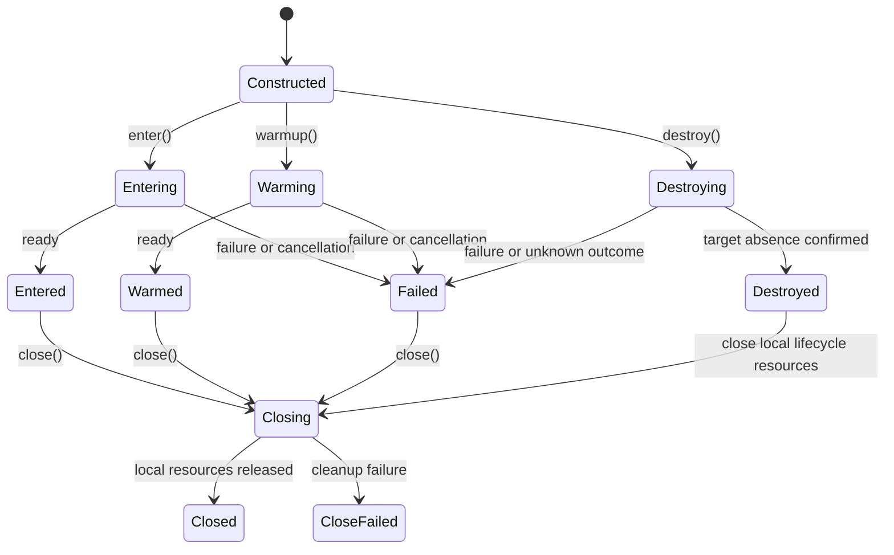
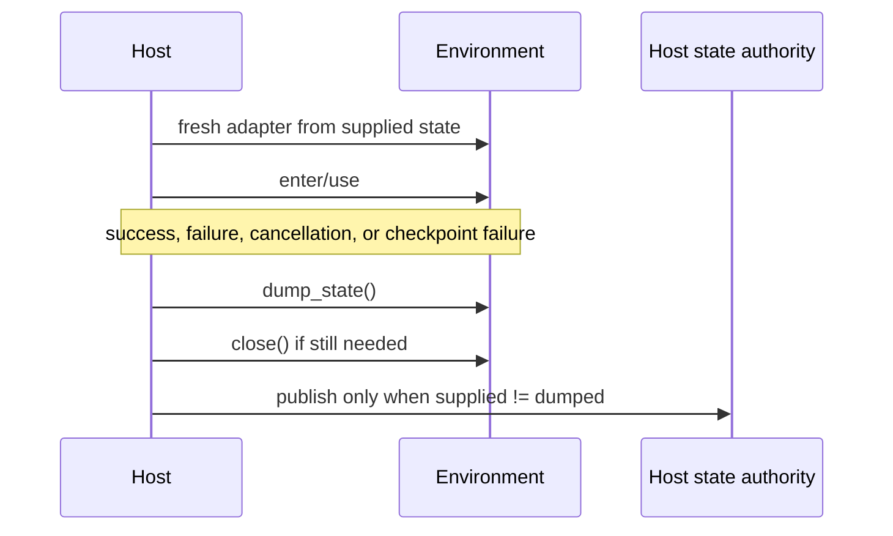

# Environment Re-entry Lifecycle

## Design Position

`Environment` is the process-local implementation of one provider target. It combines provider-neutral operations with the minimum lifecycle needed to create or re-enter that target from portable state.

`EnvironmentState` is the only shared durable lifecycle value. There is no shared Resource, runtime attachment, Provider binding, operation record, pause mode, or lifecycle capability graph. Hosts can persist, correlate, and prune targets using their own models without imposing those models on embedded applications or other Hosts.

Construction is inert. External effects begin only when a caller invokes `enter()`, `warmup()`, or `destroy()`.

## State Envelope

```python
class EnvironmentState(BaseModel):
    model_config = ConfigDict(frozen=True, extra="forbid")

    provider_key: str
    state_version: str
    state: JsonValue
```

Fields:

| Field           | Meaning                                                            |
| --------------- | ------------------------------------------------------------------ |
| `provider_key`  | Stable namespaced Provider discriminator                           |
| `state_version` | Provider-owned version for the opaque state payload codec          |
| `state`         | Canonical JSON needed to validate and re-enter one provider target |

State is a semantic soft reference. It can identify a Docker container or E2B sandbox, but it is not a credential, a lease, a Python `weakref`, a live client, an ownership claim, or proof that the target still exists.

State contains only values that remain meaningful across process restart. It contains no:

- Provider, Environment, client, SDK object, transport, session, callback, task, or lock;
- credential, bearer URL, secret bootstrap material, or ambient configuration;
- PID, subprocess handle, pipe, private temporary path, daemon generation, or open port route;
- Harness mount name, mount ID, permission ceiling, working directory, Agent identity, or Thread relationship;
- Host record key, persistence generation, lease, retention policy, or prune status.

Providers validate the exact state version and payload model. Unknown fields, unsupported versions, invalid canonical JSON, provider-key mismatch, and configuration incompatibility fail before target mutation.

A deterministic stateless provider can return `None`. State absence does not mean target absence; it means the provider must apply its documented no-state entry semantics.

## Environment Contract

The conceptual process-local contract is:

```python
class Environment(ABC):
    @property
    def provider_key(self) -> str: ...

    async def enter(
        self,
        *,
        thread_id: str,
        run_id: str,
        agent_instance_id: str,
        mount_id: str,
        host_refs: Mapping[str, str] = {},
    ) -> None: ...

    async def warmup(self) -> None: ...

    def dump_state(self) -> EnvironmentState | None: ...

    async def close(self) -> None: ...

    async def destroy(self) -> None: ...
```

Provider-neutral file, shell, process, output, readiness, and port facets are exposed by the same Environment or typed views obtained from it. Harness imports those contracts and adds multi-mount routing; it does not wrap Environment in another provider lifecycle object.

### Construction

One Provider call creates one fresh Environment. Construction:

- accepts validated desired configuration;
- accepts `EnvironmentState | None` before entry;
- accepts fresh process-local runtime collaborators;
- validates deterministic type and codec compatibility;
- performs no filesystem, subprocess, Docker, E2B, network, or envd I/O.

An Environment is single-use for one independent Run or one explicit Host lifecycle operation. It is not shared concurrently across independent Runs and is not retained in durable records.

### Entry metadata

`thread_id`, `run_id`, `agent_instance_id`, `mount_id`, and bounded `host_refs` are ephemeral correlation supplied to `enter()`. They can be keyword arguments or an implementation-internal immutable value. They are not Environment state, Agent state, provider target identity, or another shared domain entity.

Providers may use these values for logs, traces, operation correlation, or envd session metadata. They must not persist them into `EnvironmentState` unless a provider's target identity independently requires an equivalent provider-owned value.

### Entry

`enter()` establishes one process-local operation scope:

1. validate supplied state and runtime collaborators;
2. inspect or prepare the provider target according to provider semantics;
3. create on no state when supported;
4. re-enter an exact compatible target when it exists;
5. create a replacement only after authoritative target absence;
6. update known state immediately after successful create or replacement;
7. establish fresh operation clients, descriptor, readiness, and provider facets;
8. return only after the Environment can serve its documented entered operations.

An unavailable, inaccessible, incompatible, or unknown target is not absent. Entry fails without speculative replacement.

Entry is idempotent only as documented by a provider. The common contract does not promise exactly-once target creation. Cancellation or transport failure can leave an unknown outcome. State or provider discovery evidence is used on a later fresh Environment to reconcile that outcome.

### Warmup

`warmup()` is optional Host-only proactive entry work. It can ensure that the backing target exists and reaches a provider-defined reusable readiness point without granting Agent operations. It follows the same create/re-entry/replacement and state rules as `enter()`.

A Provider that has no meaningful warmup may implement it as normal entry preparation or a no-op. Harness never calls `warmup()` and never assumes it occurred.

### State dump

`dump_state()` returns a detached copy of the latest validated provider state cached by the adapter or `None` for a stateless/destroyed target. It is an infallible synchronous process-local read: it performs no external I/O or target refresh, returns promptly for every valid constructed adapter, and never commits to Host storage. Mutating a caller-owned input state or a previously returned nested JSON value cannot change the adapter's cache.

Known state must remain available after:

- successful entry and execution;
- a create or replacement followed by later entry/readiness failure;
- execution failure or cancellation;
- Harness checkpoint/export failure;
- process-local close failure.

A Provider updates the cache immediately whenever `enter()`, `warmup()`, `destroy()`, or another explicit operation obtains validated evidence of a changed target state. A failed or unknown-outcome observation leaves the last validated cache intact and reports its own operation failure separately. Serialization and codec validation happen before a value becomes the cached known state, so a later refresh failure can never make that state unavailable to the Host.

### Close

`close()` fences new operations and releases process-local resources such as:

- SDK clients and HTTP sessions;
- EIP sessions and carriers;
- readiness watchers and keepalive tasks;
- local daemon processes owned only for the current adapter;
- local process handles, streams, and temporary private runtime data;
- ephemeral entry correlation.

`close()` never destroys the backing Environment target represented by state. It never removes a Docker container, terminates an E2B sandbox, deletes a Host workspace, removes external volumes, or selects retention policy.

Context-manager exit is exactly `close()` semantics. Cancellation and failure do not convert it into destruction. `close()` is also valid after successful `destroy()` and releases the process-local clients and runtime collaborators used by that explicit lifecycle operation without repeating target destruction. Close is idempotent where practical; repeated close never gains destructive behavior.

### Destroy

`destroy()` is an explicit Host-only backing-target operation. It validates selected configuration, state, runtime authority, and current target evidence before mutation. It removes only the exact provider target and provider-owned secret/bootstrap material represented by that state.

Rules:

1. Harness never invokes `destroy()`.
2. A Host constructs a fresh Environment specifically for cleanup or prune.
3. Target identity and immutable metadata are revalidated before mutation.
4. Incompatible evidence fails; it is never adopted or removed.
5. Authoritative prior absence is success when provider-owned auxiliary material is also absent.
6. Unknown outcome preserves state so a later Host operation can inspect or retry.
7. Success makes `dump_state()` return `None`.
8. The caller invokes `close()` in unconditional cleanup after either success or failure; `destroy()` does not leave process-local clients or collaborators as durable authority.
9. External bind sources, user files, named volumes not owned by the provider, and shared workspaces are never removed unless their ownership is an explicit provider contract.

## Provider-neutral Operations

The package owns one typed single-Environment operation surface. Exact models can be grouped into facets, but the semantic families are:

| Family    | Operations                                                                                             |
| --------- | ------------------------------------------------------------------------------------------------------ |
| Files     | stat, bounded read/list/glob/search, streaming read/write, patch, create directory, move, copy, remove |
| Commands  | bounded foreground execution, optional provider process start/control, working-directory validation    |
| Output    | independent stdout/stderr cursors, retained-range disclosure, truncation, bounded pages                |
| Readiness | operation-family readiness requirements and typed timeout/unavailable results                          |
| Ports     | provider-local port observation and bounded wait                                                       |
| State     | dump current portable state                                                                            |
| Lifecycle | enter, optional warmup, non-destructive close, explicit destroy                                        |

Providers advertise an immutable entered descriptor containing their supported operation families and safe provider identity. Harness intersects that descriptor with its mount access ceiling. A descriptor never carries credentials, state payload, native handles, or Host mutation authority.

Every side-effecting operation returns typed evidence sufficient to distinguish known completion from unknown outcome where the backend can do so. Provider-native exceptions are translated to stable bounded errors.

## Lifecycle State Machine

The process-local adapter lifecycle is conceptual:



`dump_state()` is available in every state after construction. Its return can change as soon as create, replacement, or destroy has a known outcome.

An adapter does not transition from `Closed` back to `Entered`. Re-entry always constructs another fresh adapter from state.

## Host State Authority

The provider package defines state values but not their durable authority. A Host selects state before construction and publishes state after execution.

For a Host-managed Environment:

- current Host state wins, including authoritative `None`;
- deleted or authoritative absent Host association suppresses stale portable fallback;
- Harness continuation state is adopted only through an explicit unmanaged/import flow;
- changed values publish last-write-wins;
- equal values do not write;
- displaced targets and provider-discoverable orphans are handled by Host prune.

These are behavioral requirements. No standard Host record, Thread-link model, prune-candidate model, database table, foreign key, lock, or fencing field is part of this package.

## Unconditional Finalization

A Host treats execution, checkpointing, state publication, and local cleanup as independent outcomes.



Publication is attempted from unconditional finalization even when execution, cancellation, checkpointing, or close fails. Because `dump_state()` always returns the adapter's last validated cache without refresh, a later lifecycle or observation failure cannot hide already known changed state. The Host reports independent execution, publication, and cleanup failures without pretending one erased another.

Equal-state no-op prevents an older completing Run from overwriting a concurrent changed state merely because it finished later. A genuinely changed later value can win under ordinary last-write-wins and can orphan the displaced target. Explicit Host prune is the repair mechanism; the common contract adds no global lock or exactly-once creation guarantee.

## Concurrency

- Independent Runs use independent Environment instances.
- A provider can permit several adapters to re-enter the same backing target when its target and operation semantics support it.
- Provider-local operation serialization and generation checks protect native handles within each adapter.
- Harness mount IDs and leases protect Run-local routing across mount replacement.
- Hosts decide whether to serialize state publication or lifecycle policy. The shared contract requires only changed-only last-write-wins semantics.
- Inline child execution borrows the already entered parent Harness facade and does not construct, enter, close, or publish another Environment.
- Async child execution is an independent Run and therefore uses fresh adapters selected from Host state.

## Failure Semantics

| Condition                                  | Required behavior                                                    |
| ------------------------------------------ | -------------------------------------------------------------------- |
| Invalid configuration, Provider key, state | Fail before external effects                                         |
| Missing required runtime collaborator      | Fail before target mutation where possible                           |
| No state                                   | Apply documented provider no-state semantics                         |
| Exact compatible target exists             | Re-enter                                                             |
| Exact target authoritatively absent        | Create replacement only when provider supports it                    |
| Target unavailable or outcome unknown      | Fail without speculative create                                      |
| Target metadata incompatible               | Fail conflict; do not adopt, mutate, or destroy                      |
| Entry fails after create/replacement       | Preserve changed known state                                         |
| Operation cancellation                     | Preserve unknown-outcome evidence; do not assume rollback            |
| State refresh or observation fails         | Retain the last validated cache; `dump_state()` still returns it     |
| Close fails                                | Report cleanup failure; never escalate to backing-target destruction |
| Destroy outcome unknown                    | Retain state for later inspection/retry                              |

## Security and Dependencies

- Runtime collaborators are explicit trusted process-local values.
- Credentials are read as late as the provider requires and are never serialized into state.
- State selectors are revalidated against desired configuration and current provider evidence before use.
- Direct Local relies on the embedding OS account and does not claim adversarial filesystem isolation.
- EIP-backed providers authenticate fresh sessions and validate descriptor identity and method support before admitting operations.
- Docker container IDs and E2B sandbox IDs can be sensitive Host state even though they are not bearer credentials; model-facing surfaces omit them.
- Raw PIDs remain provider runtime details. Logical Agent-managed process references belong to Agent/Capability state, not Environment re-entry state.
- Blocking SDK and filesystem work stays off the event loop and uses bounded timeouts.

## Compatibility

`EnvironmentState.state_version` owns provider payload compatibility. Providers reject unsupported versions and expose explicit migrations only when they can preserve target identity and semantics safely.

The direct pre-release replacement removes Resource, attachment, Provider binding, lifecycle capability, pause, reconcile-action, and ephemeral-scope APIs. Context exit is permanently non-destructive. No compatibility wrapper may recreate Run-owned target lifetime.

## Invariants

01. State is supplied before entry.
02. Construction performs no external I/O.
03. One adapter serves one independent Run or Host lifecycle operation.
04. Confirmed absence and unknown evidence are distinct.
05. Every known create or replacement is immediately cached; synchronous `dump_state()` returns that cache without external I/O or failure.
06. State contains no credential, PID, live client, or Host persistence model.
07. Close releases only process-local resources.
08. Only explicit Host policy invokes destroy.
09. State publication is independent from successful Harness checkpoint production.
10. Equal state does not write; changed state is last-write-wins.
11. Orphan cleanup is explicit Host prune behavior.
12. Harness owns multi-mount routing but no provider target lifecycle.
