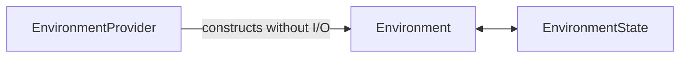

# Environment Provider Specifications

## Overview

This directory defines `agent-environment-provider`, distributed as `a13n-environment-provider`. It owns the shared single-Environment operation contracts, the three core lifecycle entities, provider discovery, and the built-in Direct Local, Local Envd, Docker, and E2B providers.

The core model is:

A Host selects a trusted Provider, desired configuration, current state, and fresh process-local collaborators. The Provider constructs a fresh `Environment`; the Host chooses eager or lazy preparation, and the caller binds, uses, snapshots and closes its local scope. Stop and keepalive are separate Host-directed operations. `close()` is non-destructive. Only explicit Host policy invokes `destroy()`.

The package performs no durable storage and owns no Agent loop, model-facing Toolset, Thread relationship, retention policy, or Harness multi-mount aggregate.

## Document Catalog

| Document                                                             | Owns                                                                                                                    |
| -------------------------------------------------------------------- | ----------------------------------------------------------------------------------------------------------------------- |
| [00-overview.md](00-overview.md)                                     | Package position, architecture, boundaries, end-to-end flow, dependency direction, and stable principles                |
| [01-provider-specs-and-catalog.md](01-provider-specs-and-catalog.md) | Provider configuration schemas, inert factory contract, catalog, discovery, authorization, and evolution                |
| [02-environment-lifecycle.md](02-environment-lifecycle.md)           | `Environment`, `EnvironmentState`, eager/lazy preparation, stop/keepalive/destroy, local scope, failure and concurrency |
| [03-built-in-providers.md](03-built-in-providers.md)                 | Direct Local, Local Envd, Docker, and E2B configuration, state, entry, close, and destruction behavior                  |

## Reading Paths

### Select or persist an Environment

Read `00`, `01`, and `02`, then the chosen built-in section in `03`. Desired provider configuration and `EnvironmentState` are distinct: configuration states what should exist; state is a provider-owned soft reference used to re-enter what currently exists.

### Integrate the Harness

Read `00` and `02`, then [Harness Environment Integration](../agent-harness/08-environment-integration.md). The Host constructs fresh Environment instances before each independent Harness Run. Harness receives those instances and owns only Run-local multi-mount routing and policy.

### Implement a provider

Read `01` and `02`. A third-party Provider registers one namespaced key, validates one versioned configuration schema, constructs Environment instances without I/O, validates its own state codec, and implements provider-neutral operations plus preparation, resume, state dump, non-destructive close, and supported stop, keepalive and destroy operations.

## Authority Rules

- A Host authorizes Provider selection, supplies current credentials and runtime collaborators, owns current state, and chooses retention, destruction, and prune policy.
- `EnvironmentProvider` validates desired configuration and constructs fresh Environment instances without external I/O.
- `Environment` exposes one provider's process-local operations and Host-directed target lifecycle; scope entry is independent from preparation.
- `EnvironmentState` is portable provider data, not a credential, live client, durable lease, or proof of target existence.
- Harness never discovers Providers or invokes backing-target destruction.
- Provider state and configuration validity never authorize an Agent operation; Harness and provider operation policy still apply.

## Specification Conventions

- Provider keys use a namespaced lowercase form such as `a13n.docker`.
- Configuration and state versions are explicit and independently owned.
- Configuration and state contain canonical JSON only; live collaborators and credentials remain process-local.
- Cancellation never proves that an external operation did not occur.
- Public errors expose stable bounded codes and safe fields rather than provider-native exceptions or sensitive identifiers.
