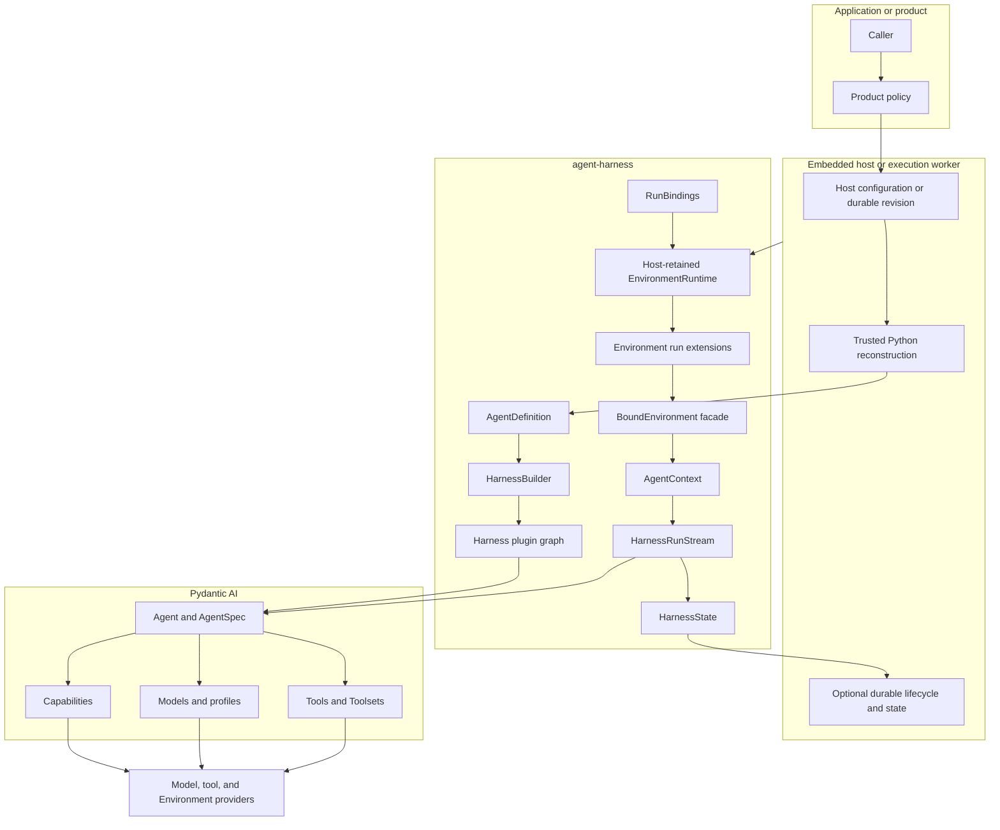
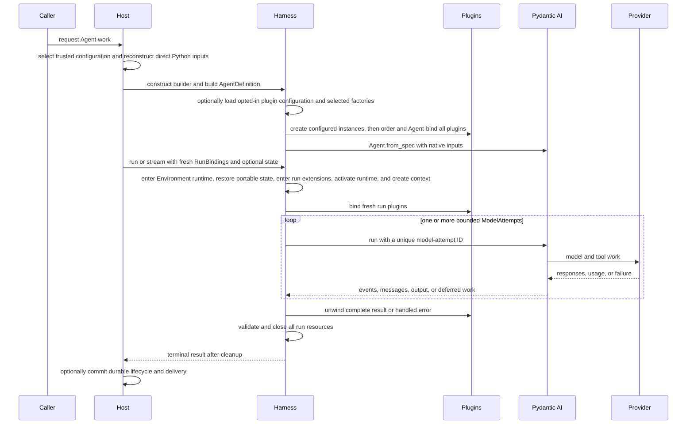

# Harness Architecture Overview

## Definition

`agent-harness` is the reusable process-local execution layer that composes native Pydantic AI configuration and trusted Python extensions into a reusable Agent, then runs it with fresh Identity, Environment, model, and Capability bindings.

Embedded applications and hosted workers use the same code-first API. A Host may persist its own definition and execution records, but the Harness defines no Agent-definition wire format or durable lifecycle.

## Design Position

Pydantic AI owns the Agent loop, Models, profiles, Toolsets, Capabilities, messages, deferred values, outputs, and usage. The Harness adds:

- immutable process-local `AgentDefinition` composition;
- trusted ordered plugins around semantic input, events, errors, and the complete result, with optional Harness-owned preferred YAML or supported JSON configuration that selects package factories and produces the same concrete plugin objects;
- one typed `AgentContext` per logical run;
- fresh `RunBindings` for Identity, an Environment lifecycle resource, model resolution, and run Capabilities;
- Host-retained Environment runtime mutation across the complete logical run;
- ordered Environment aggregate extensions entered after state restore and closed before provider teardown;
- detached `HarnessState` containing messages, Capability namespaces, and optional portable Environment data;
- a single-consumer event/result stream with deterministic cleanup;
- optional independently selected OpenTelemetry traces and metrics, with tracing either off or fully instrumented;
- narrow Model self-healing and bounded recovery from interrupted model execution.

It does not add a second Agent loop, Model/profile system, Toolset hierarchy, Capability registry, serialized compiler/catalog, universal plugin package manager, or durable workflow engine.

## Architecture

The trusted Host reconstructs Python objects from its own configuration and dependency locks. The Harness validates their process-local composition but does not serialize or attest their origin.

## Major Components

| Component                       | Responsibility                                                                                                                                        | Explicit boundary                                                       |
| ------------------------------- | ----------------------------------------------------------------------------------------------------------------------------------------------------- | ----------------------------------------------------------------------- |
| `AgentDefinition`               | Hold native `AgentSpec`, one build-time output, Model, top-level Capabilities, plugins, child definitions, and recovery policy                        | Process-local Python value only                                         |
| `HarnessBuilder`                | Resolve an explicit or opted-in ambient plugin context, bind plugins, authorize Capability types, and call `Agent.from_spec()` once                   | Ambient I/O and discovery occur only when explicitly enabled            |
| Plugin graph                    | Deterministic ordering, fresh run binding, outer middleware, and Capability contribution                                                              | Trusted code; Pydantic owns inner hooks                                 |
| Plugin configuration            | Validate the narrow JSON envelope and create fresh configured instances through selected factories                                                    | Not an Agent or Environment configuration language                      |
| `RunBindings`                   | Carry fresh Agent instance, Environment aggregate, optional model resolver, run Capabilities, and metadata                                            | No durable state or generic service locator                             |
| Environment attachment adapter  | Convert a fresh shared-package Direct Local or EIP attachment into one single-use `EnvironmentRuntimeMount`                                           | No provider create, resume, pause, destroy, or resource-state ownership |
| Environment extension factories | Discover installed metadata and load only explicitly selected aggregate-extension factories into an immutable catalog                                 | No Harness-owned configuration document                                 |
| Environment run extensions      | Enter ordered runtime-wide scopes after state restore and exit them before provider teardown                                                          | Trusted code; no model or mutation access                               |
| Environment core                | Enter provider scopes, publish immutable mount snapshots, coordinate readiness/state, and serve Host runtime mutations                                | Not a Capability, provider factory, or durable command API              |
| `AgentContext`                  | Share run Identity, Environment facade, state, plugins, child collection, model resolver, and metadata                                                | One context per logical Harness run                                     |
| `HarnessRunStream`              | Lazy single-consumer events, cancellation, state export, model attempts, results, and cleanup                                                         | Not a Host durable `ExecutionAttempt`, queue, replay stream, or lease   |
| Harness Observation             | Optional independently selected trace levels and metrics nested under one current Host OTel parent when present                                       | Host owns root, SDK, filtering, export, sampling, vendors, and audit    |
| `HarnessState`                  | Detached messages, JSON Capability namespaces, and optional portable Environment data                                                                 | Host chooses persistence and checkpoint selection                       |
| Tool execution boundary         | Mandatory outer wrapper for function dispatch and text/JSON results; managed authority activates only from complete trusted metadata and fresh policy | Native unannotated tools remain trusted in-process code                 |
| Message integrity Filter        | Mandatory innermost request hook that removes orphan or duplicate ordinary function-tool results                                                      | Not provider rendering or interrupted-history recovery                  |

## End-to-End Flow

## Recovery Ownership

| Recovery kind                          | Owner                                      |
| -------------------------------------- | ------------------------------------------ |
| Provider-suspended continuation        | Pydantic AI                                |
| Transport retry                        | Provider/client and Pydantic `RetryConfig` |
| Exact provider-history repair          | `SelfHealingModel`                         |
| Interrupted `ModelAttempt` recovery    | `HarnessRunStream`                         |
| Worker crash, durable replay, delivery | Host                                       |

`ModelAttempt` recovery remains inside one logical Run and shares context, Environment, plugins, state, and usage. A Host retry creates a fresh Harness run and fresh bindings.

## Completion Boundaries

| Boundary                  | Meaning                                                        | Authority                   |
| ------------------------- | -------------------------------------------------------------- | --------------------------- |
| Inner `ModelAttempt`      | One Agent loop ended or was interrupted                        | Pydantic AI                 |
| Logical Harness result    | Plugins produced a structurally valid terminal candidate       | Harness                     |
| Harness terminal delivery | All run-scoped cleanup succeeded and the result event was sent | Harness and stream consumer |
| Durable completion        | Host committed its lifecycle transition                        | Host                        |
| External delivery         | Product or connector committed delivery                        | Downstream owner            |

These facts are independent. A result candidate retained by `RunCleanupError` is not a clean Harness terminal delivery, and a Harness terminal result is not a Host durable commit.

## Extension Taxonomy

| Extension                      | Selection                                                                                   | Trust boundary                                    |
| ------------------------------ | ------------------------------------------------------------------------------------------- | ------------------------------------------------- |
| Harness plugin                 | Direct concrete object, or builder-local configured factory result appended during build    | Trusted in-process Python                         |
| Pydantic Capability            | `AgentSpec`, definition, plugin, or run contribution                                        | Pydantic lifecycle plus caller trust              |
| Native Model/tool/Toolset      | Concrete `AgentDefinition` field                                                            | Trusted in-process object                         |
| Run-scoped model resolver      | Fresh `RunModelResolver`                                                                    | Host/provider policy                              |
| Environment Resource           | Reusable Host-owned scope or Harness-owned ephemeral scope from `a13n-environment-provider` | Provider lifecycle and resource-state authority   |
| Environment runtime attachment | Fresh single-use Direct Local or EIP attachment from that Resource                          | Source owner and provider enforcement             |
| Environment runtime mount      | Fresh process-local `EnvironmentRuntimeMount` adapted from an attachment                    | Harness run mount and operation scope             |
| Environment run extension      | Direct object or Host-selected factory result registered on the runtime                     | Trusted runtime-wide resource scope               |
| Dynamic Environment Capability | Optional Agent-loop context and Toolset composition                                         | No provider lifecycle or mount mutation authority |

A hosted system can persist the Harness-owned plugin document and maintain artifact locks without implementing plugin reconstruction itself. Artifact trust, durable revisions, and Environment configuration remain Host contracts. Installed Harness plugin and Environment run-extension entry-point metadata represent availability only, and importing the Harness activates no extension. The Harness owns no configuration document for Environment run extensions. Provider specifications, catalogs, Providers, Resources, built-ins, resource state, and runtime attachments belong to the separate [Environment Provider package](../agent-environment-provider/README.md) and remain inert until explicitly selected.

## Stable Principles

01. Pydantic AI remains the Agent-loop authority.
02. Agent construction is code-first and process-local.
03. Hosted schemas and revisions belong to the Host, not the Harness package.
04. Trusted plugins own outer middleware; Capabilities own behavior inside the Agent loop.
05. One logical run has one context, one `EnvironmentRuntime` lifetime, ordered Environment run-extension scopes, plugin graph, state coordinator, usage accumulator, and public run ID.
06. Internal model attempts have unique Pydantic run IDs and a bounded total budget.
07. State is detached continuation data, never restored authority, desired mounts, or provider launch state.
08. Plugin state transformation is trusted composition, not provenance-policed data flow.
09. Cancellation, usage limits, output retry exhaustion, tool failure, and deferred/HITL boundaries stop semantic recovery.
10. Provider and external side-effect uncertainty is never rewritten as exactly-once success or rollback.
11. Model-facing resource references are compact, scope-local, non-authoritative selectors; trusted internal, provider, and durable identities retain their owning representations.
12. Terminal delivery occurs only after cleanup.
13. Host durability, event projection, telemetry export, external delivery, usage accounting, billing, and payment remain separate facts.
14. [Harness Observation](19-observation-model.md) independently selects traces and metrics: the Harness owns logical-run and focused-operation telemetry, while Pydantic AI owns its native Agent/model/tool spans and model metrics.

## Trade-offs

### Native Python Composition vs. a Universal Definition Format

Native objects preserve Pydantic AI's full type and extension model. Hosts must own explicit schemas and reconstruction adapters, but the Harness avoids a lossy compiler and duplicate package system.

### Narrow Recovery vs. Workflow Replay

The Harness repairs exact Model-history problems and interrupted Model execution. Durable replay and side-effect reconciliation stay with owners that have the required evidence.

## Specification Ownership

The [Harness specification catalog](README.md) identifies the detail owner for each contract. This overview owns only architecture, recovery layering, and completion boundaries.
