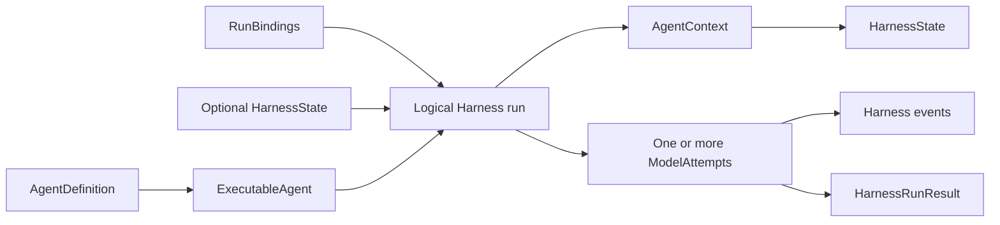

# Harness Domain Model

## Design Position

The Harness domain contains process-local Agent construction, one logical execution, its trusted bindings, events, usage observations, results, and portable continuation state. Durable definitions, executions, worker `ExecutionAttempt` values, leases, queues, and delivery remain Host domains.



## Ownership

| Concept              | Meaning                                                                                            | Owner                                                                      |
| -------------------- | -------------------------------------------------------------------------------------------------- | -------------------------------------------------------------------------- |
| `AgentDefinition`    | Immutable process-local native build inputs                                                        | [Agent Definition and Build](03-agent-definition-and-build.md)             |
| `ExecutableAgent`    | Reusable built Pydantic Agent plus Agent-bound plugins                                             | [Public API](14-public-api-and-packaging.md)                               |
| `RunBindings`        | Fresh trusted Agent instance, Environment, model resolver, Capabilities, and metadata              | [Execution Context](06-execution-context-and-lifecycle.md)                 |
| `AgentContext`       | One logical run's shared Pydantic dependency                                                       | [Capability Model](04-capability-model.md)                                 |
| `BoundPluginContext` | Immutable index of fresh plugins used by one logical run                                           | [Plugin System](05-plugin-system.md)                                       |
| Logical Harness run  | One outer context/plugin/Environment/usage scope with one public `run_id`                          | [Execution Context](06-execution-context-and-lifecycle.md)                 |
| `ModelAttempt`       | One inner `Agent.run_stream_events()` invocation with a unique upstream run ID                     | Pydantic AI and [Execution Context](06-execution-context-and-lifecycle.md) |
| `HarnessState`       | Stable Thread ID, detached messages, Capability namespaces, and optional portable Environment data | [State and Resume](10-snapshot-and-resume.md)                              |
| `HarnessRunResult`   | Immutable process-local terminal outcome                                                           | [Public API](14-public-api-and-packaging.md)                               |
| `BoundEnvironment`   | Identity-bound provider-neutral facade entered for one logical run                                 | [Environment Integration](08-environment-integration.md)                   |
| `EnvironmentRuntime` | Process-local lifecycle and Host mutation authority retained for the entered logical run           | [Environment Integration](08-environment-integration.md)                   |
| Pydantic `RunUsage`  | Live accumulator shared across all `ModelAttempt` values of the logical run                        | Pydantic AI                                                                |

## Identity

```python
class AgentIdentityRef:
    issuer: str
    subject: str
    claims: Mapping[str, str]

    def __init__(
        self,
        *,
        issuer: str,
        subject: str,
        **claims: str,
    ) -> None: ...

    def get_claim(self, key: str) -> str | None: ...

    def require_claim(self, key: str) -> str: ...


class AgentInstanceRef(BaseModel):
    identity: AgentIdentityRef
    agent_instance_id: str


class AgentInstanceContext(BaseModel):
    identity: AgentIdentityRef
    agent_instance_id: str
    parent_agent_instance_id: str | None
    delegation_id: str | None
    actor: ActorRef | None
    host_refs: Mapping[str, str]
```

The trusted Host supplies `AgentInstanceContext`. `AgentIdentityRef.issuer` and `subject` name the workload principal for the Agent graph. Its immutable string claims carry Host-selected identity dimensions shared with trusted Capabilities; `user_id` and `agent_id` are the conventional claims for the represented business user and current logical Agent. Other non-blank claim names are allowed. Claims contain no credential, live collaborator, or policy decision and are never projected to a model or external transport merely by being present. Actor, lineage, and Host references remain separate correlation and policy inputs; model content cannot replace them.

The identity hierarchy is explicit: `issuer` plus `subject` identify the workload principal, `agent_id` identifies the current logical Agent when supplied, `agent_instance_id` identifies one Host-owned Agent instance, `thread_id` identifies one independently advancing message history, and `run_id` identifies one logical Harness invocation. A Host can preserve one Agent instance and its effective identity across a durable continuation while every logical Harness run receives fresh context and bindings. `AgentInstanceRef` is a Host-supplied workload and lineage reference used for policy and correlation; it is not the identity of Pydantic message history. Identity and claims are never restored from Harness state or message metadata. The Harness owns the stable `thread_id` in `HarnessState`, restores it into every fresh `AgentContext`, and does not accept a run-binding, metadata, or invocation override for it.

## Execution Identities

The platform distinguishes:

| Identity                        | Lifetime and owner                                                                   |
| ------------------------------- | ------------------------------------------------------------------------------------ |
| Workload principal              | Host-bound `issuer` and `subject`, shared across one Agent graph when policy permits |
| Logical Agent ID                | Optional `agent_id` claim selected by the Host for the current Agent                 |
| Agent definition ID             | Logical process-local correlation; Host may map its own revision                     |
| Agent instance ID               | Host-supplied workload and lineage correlation used by current policy                |
| Thread ID                       | Stable Harness-owned identity stored with one independently advancing history        |
| Provider affinity               | Provider-facing cache/session correlation derived by the selected model integration  |
| Harness run ID                  | One logical process-local invocation                                                 |
| Model-attempt ID                | One `ModelAttempt` inside the logical run                                            |
| Host Execution/ExecutionAttempt | Durable work and worker generation outside the Harness                               |
| Tool call ID                    | Pydantic call correlation                                                            |

A Thread is one independently advancing Pydantic message history. Its `thread_id` is generated when a new `HarnessState` is created, preserved by ordinary state export and continuation, and copied into the fresh `AgentContext` selected for a run. A root and every nested inline child state therefore carry independent IDs. A Host-managed child starts from its own state, and `HarnessState.fork()` copies portable continuation data while generating a new ID. The selected model integration reads the ID from `AgentContext` to derive or look up provider-facing affinity; [Input, Model, and Output Boundaries](16-input-model-and-output.md#thread-affinity) owns the detailed cache and session rules.

An ordinary deep copy, serialization round trip, checkpoint selection, or trusted complete-state transform preserves the ID unless it intentionally creates a fork. `AgentInstanceRef`, product interaction correlation, and Host Execution identity remain independent and may change or remain stable under their owning policies without changing model-history identity. A continuation receives a fresh `AgentIdentityRef`; a Host that expects the same effective user or logical Agent scope supplies the same `user_id`, `agent_id`, and relevant claims again.

No identifier, claim, or affinity value grants authority by itself.

## Model-facing References

When a model must name a resource in a later tool call, the owning Capability exposes a compact scoped reference instead of serializing an internal, provider, or globally durable identifier. First-party forms use a bounded readable prefix plus the shortest suffix suitable for the owning scope, such as `process-1`, `output-1`, `task-1`, or `code-reviewer-a7b9`.

A compact model reference:

- is unique only within an explicit owner scope, such as one logical Harness run, one Working State task scope, or one parent Thread's Subagent Capability state;
- maps through trusted code to the exact internal identity or opaque handle and is reauthorized on every use;
- is a selector, never a bearer credential, idempotency identity, provider receipt, or substitute for a durable resource ID;
- is allocated under the owning scope's mutation boundary with collision detection and a finite namespace limit;
- is never reused or silently redirected after release, expiry, removal, incompatible restore, or mount replacement; and
- fails explicitly when unknown, stale, exhausted, or no longer authorized rather than exposing a longer private identifier as fallback.

The owner persists a compact reference only when its semantic continuation crosses runs. Environment mount, cursor, and provider retained-output projections are run-local. Background `process-N` references remain in Dynamic Environment state with one opaque operator backend ID; Working State task references remain in their task scope; inline child references remain in parent Subagent Capability state; and async `subagent-N` references remain only in that parent Agent's async projection. Harness run IDs, Pydantic tool-call IDs, `AgentInstanceRef`, `thread_id`, provider handles and cursors, operator backend identities, receipts, operation IDs, and Host Execution or `ExecutionAttempt` IDs retain their owning opaque/full representations and are not rewritten by this projection rule. The Environment, Working State, and Subagent specifications own each concrete allocator and lifetime.

## Process-local and Durable State

A Host revision reconstructs a process-local `AgentDefinition`; it is not itself a Harness value. A Host Execution selects an executable, fresh `RunBindings`, optional input, and optional prior `HarnessState`. The Harness result and state become durable only if the Host commits them.

One logical Harness Run can use several model-attempt IDs during bounded model recovery. This does not change the Foundation `ExecutionAttempt`, Harness run ID, context, `EnvironmentRuntime` lifetime, plugins, state coordinator, or usage accumulator. Runtime mount mutations publish immutable snapshots inside that one Environment lifetime rather than creating another run identity.

## Version Boundaries

| Version                       | Owner                |
| ----------------------------- | -------------------- |
| Harness state envelope        | Harness              |
| Capability state entry        | Owning Capability    |
| Pydantic message codec        | Pydantic AI          |
| Environment provider state    | Environment provider |
| Host definition revision      | Host                 |
| Host durable lifecycle schema | Host                 |

These versions evolve independently.

## Invariants

1. `AgentDefinition` is process-local and code-first.
2. A logical Harness Run has one public `run_id` and may have several unique model-attempt IDs.
3. One `HarnessState.thread_id` identifies one independently advancing model history; it survives continuation and is never derived from Host bindings or transient Harness or model-attempt IDs.
4. `AgentContext` is fresh per logical run, exposes the selected State's Thread ID as a read-only field, and is shared only by that run's internal `ModelAttempt` values.
5. `HarnessState` restores model-history identity and data, not authority, desired Environment mounts, provider launch state, runtime mutation authority, or live resources.
6. Trusted plugins may intentionally transform complete result state; the Harness does not infer provenance.
7. A process-local terminal result does not commit a Host Execution or external delivery.
8. Events and usage snapshots are observations until their owning Host subsystem persists them.
9. A compact model-facing reference is scoped, non-authoritative, collision-checked, and never substitutes for its internal or durable identity.

## Trade-offs

### Small Shared Model

This document owns identities and cross-contract relationships only. Detailed schemas and failure rules stay in their owning documents.

### Independent Workload and Model-history Identity

Host-supplied Agent instance identity supports policy, lineage, and credentials, while State-owned Thread identity follows the selected message history. Keeping them independent prevents a caller from changing provider affinity through each run's bindings and prevents an explicit history fork from accidentally retaining the same cache or session scope.
