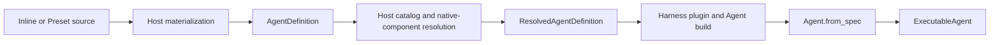
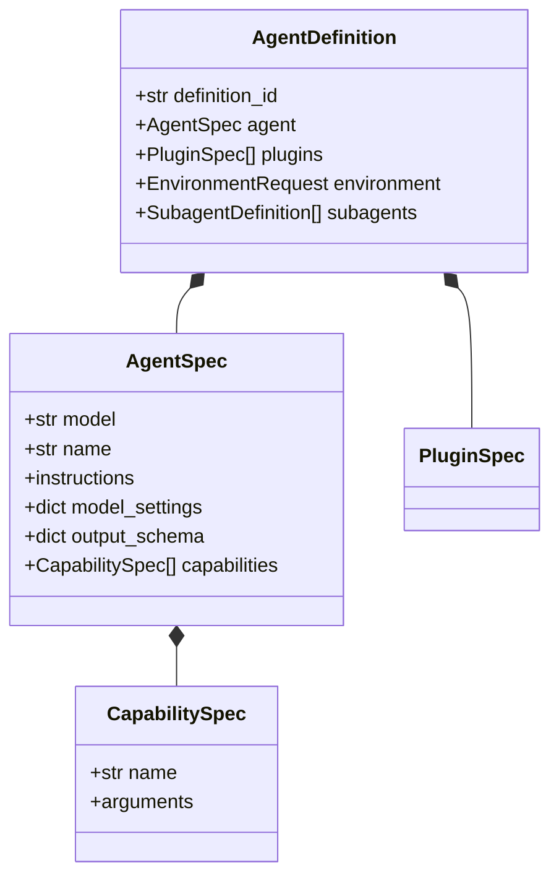
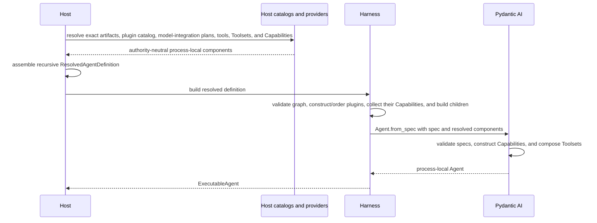

# Agent Definition and Build

## Design Position

`AgentDefinition` is the complete materialized logical definition shared by embedded and hosted execution. It aggregates a native Pydantic AI `AgentSpec` behavior core with Harness-owned plugin, Environment, and subagent composition. The upstream `AgentSpec` remains responsible for declarative model-loop configuration and typed `CapabilitySpec` values; Harness `PluginSpec` values configure input-to-result middleware and optional Capability contribution outside that nested spec; the resolved native Pydantic `Model` remains responsible for its effective `ModelProfile`. `AgentSpec` is not the complete Agent Foundation definition, `ModelProfile` is not an `AgentSpec` field, and `Agent.from_spec()` is not the Host configuration resolver.

A hosted control plane materializes inline or typed Preset input into one immutable definition revision before execution. An execution Host then resolves logical model references, a selected trusted plugin catalog, native tools and Toolsets, and reentrant build Capabilities that carry no current-run authority into one process-local `ResolvedAgentDefinition`. The Harness consumes that build plan, constructs and orders the exact definition plugins, obtains their Capability contributions, and uses `Agent.from_spec()` only as the final Pydantic Agent construction step.



Preset catalogs, immutable definition revisions, dependency locks, and rollout policy belong to the host. The hosted contract is defined by [Agent Definitions and Presets](../foundation-service/01-agent-definitions-and-presets.md). The Harness defines the canonical materialized definition and process-local build plan without importing hosted lifecycle types.

## AgentDefinition

```python
type EnvironmentOperation = Literal[
    "files", "shell", "processes", "ports", "state"
]


class EnvironmentRequest(BaseModel):
    model_config = ConfigDict(frozen=True)

    operations: frozenset[EnvironmentOperation] = frozenset()


class AgentDefinition(BaseModel):
    model_config = ConfigDict(frozen=True)

    definition_id: str
    agent: AgentSpec
    plugins: tuple[PluginSpec, ...] = ()
    environment: EnvironmentRequest | None = None
    subagents: tuple[SubagentDefinition, ...] = ()
```

| Field           | Meaning                                                                                    |
| --------------- | ------------------------------------------------------------------------------------------ |
| `definition_id` | Stable logical definition identifier; it grants no execution authority                     |
| `agent`         | Native Pydantic AI model-loop, instructions, settings, output, retry, and Capability specs |
| `plugins`       | Harness plugin specs for ordered input-to-result middleware and Capability contribution    |
| `environment`   | Portable Environment operation families required from the host                             |
| `subagents`     | Named complete child definitions built into the executable's immutable child collection    |

The definition is the one effective logical view after any Host Preset materialization. Execution never reconstructs behavior from separate global `ModelConfig`, `ToolConfig`, plugin-selection, and override bags. Reusable model and Toolset Presets materialize their owned values into `agent.model`, `agent.model_settings`, or typed `agent.capabilities`; they do not remain unresolved inheritance layers inside the Harness. Because Pydantic `ModelProfileSpec` is a native `Model` construction contract rather than an `AgentSpec` field, a Model Preset selects the logical model integration whose resolver constructs that native Model instead of inventing a serialized `agent.model_profile` property.

`agent.capabilities` uses Pydantic AI `CapabilitySpec` syntax. `plugins` uses the concrete Harness plugin types selected in `ResolvedPluginCatalog`; each plugin owns its typed spec and stable ID. A plugin can wrap the complete run and contribute ordinary Pydantic Capabilities, but its spec remains outside `AgentSpec` because input and complete-result middleware are Harness boundaries. Portable behavior configuration belongs to the owning Capability or plugin schema. The first-party Client Tools Capability can contain exact default external-tool declarations and an explicit `allow_run_override` policy; that typed opt-in is the only run path that can replace a model-visible tool schema without creating another definition revision. Host-only provider selection, artifact locks, secret resolution, and live collaborators remain outside the serialized definition.

`EnvironmentRequest.operations` is a minimal portable requirement: every listed operation family must be advertised by the run's effective Environment surface with an enforceable readiness path before model or tool work. Concrete resources can finish provisioning lazily under scoped `ensure_ready()` calls. The request does not name a provider, binding, alias, path, default, mount, credential, multiplicity, or topology. The generic `EnvironmentRoleRequest` abstraction is deliberately absent because a semantic role cannot be resolved consistently without feature-specific meaning. If a feature genuinely needs a named Environment slot, that feature's Capability owns the slot schema and validation. Runtime aliases, the default binding, local or remote backend selection, and multi-binding topology remain Host binding concerns.

The request grants no authority. The Host can reject it or satisfy it with a direct-local, EIP-backed, or mixed `EnvironmentRunBinding`; stream entry binds and enters that value to obtain `AgentContext.environment`. A topology can contain any number of bindings as long as the effective surface satisfies the declared operations. Host-specific mount sources and durable lifecycle records remain in the Host definition layer.

Raw credentials, executable objects, ambient environment substitutions, and implicit Python import paths are not definition fields. Capability configuration can contain typed logical provider or secret references, but the host resolves those references only through fresh run bindings after selecting a trusted definition revision.

`frozen=True` is only the outer model guard. Materialization and Harness build defensively copy and recursively normalize every Harness-owned nested tuple, mapping, context policy, usage limit, and child value. Upstream `AgentSpec` or Capability values that cannot guarantee deep freezing are never exposed from the executable as the same object used for `Agent.from_spec()`: the builder retains a private validated copy and public definition/declaration access returns a read-only projection or defensive copy. Mutating caller input or a nested value obtained from public inspection therefore cannot change child selectors, policy ceilings, Agent behavior, or the already built Pydantic Agent. Compatibility tests enforce this behavioral immutability rather than relying on a frozen dataclass or Pydantic model alone.

Durable `AgentSpec.model_settings` contains only canonical JSON model-request intent. For every hosted root and child logical model, the locked integration validates the value through its strict route-envelope-aware settings schema before revision commit. The validation policy rejects unknown keys, arbitrary `extra_headers` and `extra_body` passthrough, non-JSON client or timeout objects, target-incompatible fields, and every raw header, token, API key, cookie, proxy credential, or other secret carrier. Hosted native Models use `settings=None`, so no integration adds hidden static request defaults below the materialized definition. Request headers and credentials are live provider inputs resolved through the current run. Embedded code-first callers can use the broader native Pydantic type in process, but that value cannot be committed until it passes the hosted codec.

Authored instructions use literal strings or Pydantic AI `TemplateStr` and dynamic-instruction semantics already supported by `AgentSpec`. Request headers, secret values, and ambient environment variables are not instruction-template inputs. A Host authoring system that supports Preset parameters materializes and validates them before the Harness receives the definition; Jinja or another general template engine is not a Harness dependency.

### Configuration Ownership

| Configuration                                                                                | Durable owner and representation                                        | Build or run representation                                         |
| -------------------------------------------------------------------------------------------- | ----------------------------------------------------------------------- | ------------------------------------------------------------------- |
| Model ID, instructions, request intent, retries, output, and tool timeout                    | Pydantic `AgentSpec`                                                    | Native Pydantic values                                              |
| Hosted durable model-settings schema, validation, and canonicalization                       | Locked Host model integration                                           | Canonical JSON in `AgentSpec.model_settings`; `Model.settings=None` |
| Model/provider/adapter compatibility facts and request/response rendering                    | Pydantic `ModelProfile` plus the Host's locked model integration        | Effective `Model.profile` on the resolved native `Model`            |
| Portable compaction, media, tool, memory, and other Pydantic-run behavior                    | Owning typed `CapabilitySpec`                                           | Capability constructed by Pydantic                                  |
| Semantic-input, stream, and complete-result middleware with optional Capability contribution | Owning typed Harness `PluginSpec`                                       | Harness-constructed Agent- and run-bound plugin graph               |
| Residual Agent-, Host-, or run-specific model transformation and recovery                    | Owning typed `CapabilitySpec` or fresh run Capability                   | Public Pydantic model-request hooks                                 |
| Client-side external-tool defaults and explicit run-replacement policy                       | Client Tools `CapabilitySpec`                                           | Per-run upstream `ExternalToolset` values                           |
| Model and Toolset reuse                                                                      | Host typed Preset revisions materialized into `AgentDefinition`         | No unresolved Preset layer                                          |
| Logical model alias                                                                          | `AgentSpec.model` plus exact integration dependency lock                | Reserved integration Capability or attested credential-free Model   |
| Trusted native tools, Toolsets, and reentrant build integrations                             | Host artifact and provider configuration, not serialized Python objects | `ResolvedAgentComponents`                                           |
| Identity, Environment, policy, credential, checkpoint, telemetry, and other run authority    | Host and provider state                                                 | `RunBindings` and run Capabilities                                  |
| Environment requirements                                                                     | `EnvironmentRequest`                                                    | Fresh `EnvironmentRunBinding`                                       |
| Model cost pricing policy and revision                                                       | Host pricing catalog, not Agent behavior                                | Optional `RunBindings.model_cost_calculator`                        |
| Live context-window limits and routing health                                                | Provider observation and Host routing policy                            | Resolver or owning feature Capability, not `ModelProfile` data      |

Non-secret request intent and tuning remain in `AgentSpec.model_settings`; the locked hosted integration validates them as canonical JSON and contributes no hidden `Model.settings` defaults. Stable model/provider/adapter compatibility facts belong to native `ModelProfile`; Agent policy and dynamic request, response, or recovery behavior belong to an owning Capability only when Pydantic AI does not already provide the behavior. For example, a unified `thinking` setting expresses requested reasoning effort, while support, always-on behavior, thinking tags, and provider-specific thinking-part round trips remain profile-and-adapter concerns. Context-window observations, media normalization limits, compaction policy, tool implementation settings, headers, and credentials do not become arbitrary extra model settings or profile keys merely because the former SDK grouped them in one `ModelConfig` or `ToolConfig`.

### Capability-aware Schema

Composition preserves Pydantic AI Capability-aware schema generation. The Harness generates the nested `agent` schema through `AgentSpec.model_json_schema_with_capabilities(...)` for the exact built-in and permitted custom Capability type set. It generates the `plugins` tagged union from the exact concrete plugin spec types in `ResolvedPluginCatalog`, then combines ordinary schemas for its other fields. It does not rely on subclass schema behavior, accept an arbitrary plugin configuration map, or reproduce every upstream field.



The complete definition has more than one schema authority: Pydantic AI owns `AgentSpec` and Capability construction, the Harness owns Environment and subagent fields, each Capability owns its arguments, and a hosted control plane owns Preset source and revision schemas. Validation errors retain that ownership instead of being flattened into one untyped configuration error.

## Code-first Materialization

`HarnessBuilder.build_code()` accepts a native `AgentSpec` rather than reproducing its model, instruction, settings, retry, output, or Capability arguments. Its explicit `output_type: OutputSpec[OutputT]` supplies the Python generic that a serialized output schema cannot carry. The builder validates that the Pydantic output schema produced from that value agrees with any `agent.output_schema` already present. An explicit `str` output therefore requires no conflicting structured schema.

A code-first caller can additionally provide `definition_id`, an opaque `source_ref`, typed `PluginSpec` values, `EnvironmentRequest`, complete `SubagentDefinition` values, and one optional `ResolvedAgentComponents` bundle for the selected plugin catalog plus process-local model, tool, Toolset, and Capability contributions. Omitting `definition_id` creates a process-local identifier valid for that executable. Advanced callers with independently resolved child components construct the recursive `ResolvedAgentDefinition` directly rather than adding per-child override arguments to `build_code()`.

The code-first path creates the same canonical `AgentDefinition` and `ResolvedAgentDefinition` used by hosted execution. It retains typed plugin specs and the same Harness plugin lifecycle, portable Environment requirements, subagent declarations, Capability composition, state, and hosting semantics; it does not create another Agent model or execution runtime.

## ResolvedAgentDefinition

`ResolvedAgentDefinition` is the immutable process-local build plan after Host definition-revision, Preset, provider, artifact, and trust decisions have completed. Its frozen dataclass shell is supplemented by the same defensive recursive normalization and private-copy rule above; shallow dataclass freezing alone is insufficient. It is never a durable wire format.

```python
class ResolvedDefinitionRef(BaseModel):
    value: str


@dataclass(frozen=True)
class ResolvedModelIntegration:
    source_ref: ResolvedDefinitionRef
    logical_model_ids: frozenset[str]
    run_capability_type: type[AbstractCapability[AgentContext]]
    run_capability_id: str


@dataclass(frozen=True)
class ResolvedAgentComponents:
    plugin_catalog: ResolvedPluginCatalog = ResolvedPluginCatalog()
    model: Model | str | None = None
    model_integration: ResolvedModelIntegration | None = None
    tools: tuple[
        Tool[AgentContext] | ToolFuncEither[AgentContext, ...], ...
    ] = ()
    toolsets: tuple[AgentToolset[AgentContext], ...] = ()
    capability_types: tuple[
        type[AbstractCapability[AgentContext]], ...
    ] = ()
    capabilities: tuple[
        AbstractCapability[AgentContext], ...
    ] = ()


@dataclass(frozen=True)
class ResolvedSubagentDefinition:
    declaration: SubagentDefinition
    definition: "ResolvedAgentDefinition"


@dataclass(frozen=True)
class ResolvedAgentDefinition:
    definition: AgentDefinition
    output_type: OutputSpec[Any]
    components: ResolvedAgentComponents
    subagents: tuple[ResolvedSubagentDefinition, ...]
    source_ref: ResolvedDefinitionRef | None
```

`components.model_integration` is an authority-neutral process-local descriptor of the exact hosted integration lock, the logical IDs it owns at this node, and the one reserved run Capability role that realizes it. It is required for every hosted node with a logical model selection and absent on ordinary embedded code-first plans. It contains no factory closure, client, credential, route decision, or Model. At run entry, the Harness requires exactly one Host-supplied Capability with the declared concrete type and reserved ID; that Capability is the only hosted model selector and must resolve every owned ID to an allowed Model or raise. Other configured, build, or run Capabilities that contribute `get_model()` or `resolve_model_id()`, and request hooks that replace the selected Model, are incompatible with the hosted profile and fail build or run setup.

`components.model` is `None` when Pydantic should use `definition.agent.model`. In hosted execution, a concrete value is allowed only as an attested authority-neutral realization of `components.model_integration`, such as a credential-free local Model; possession cannot grant or select tenant or current-run authority. Otherwise build resolution verifies and compiles the locked integration plan but leaves `model=None`. Because the required resolver enters only as a run Capability, the Harness calls `Agent.from_spec(..., defer_model_check=True)` for this deferred hosted case; without that public flag, upstream construction would eagerly pass the logical ID to ambient model inference. After fresh `AgentContext`, current policy, route pin, and credentials exist, the required integration run Capability constructs the native Model through upstream `ResolveModelId`. It never returns `None`, because that would delegate to ambient Pydantic inference. Embedded code-first execution may use ordinary inference, explicit process-configured Models, or Capability model contributions under the embedding application's trust boundary. These paths retain native Pydantic model semantics without introducing a Harness Model implementation.

Every concrete native Model carries the profile selected by its Pydantic model/provider adapter. Pydantic resolves `DEFAULT_PROFILE`, the provider's model-name profile, and any explicit `Model(profile=...)` contribution in upstream order, then applies adapter-specific narrowing and implemented-native-tool constraints. A hosted model integration can construct the explicit contribution from its exact trusted catalog revision; a code-first caller can use the native dict or callable form directly. The Harness neither serializes the callable form nor copies the effective profile into `AgentDefinition` or `ResolvedAgentComponents`, and it never merges profile keys independently of the Model.

`tools` and `toolsets` contain trusted native Pydantic build inputs that cannot be serialized as Python objects. Portable tool behavior normally enters through Capability specs and Capability-owned Toolsets. Embedded code-first applications can add direct process-local values. In hosted execution, every model-visible direct tool or Toolset realizes a logical component already present in the materialized definition and covered by its dependency locks; the resolver cannot silently add or remove hosted Agent behavior. The narrow exception is a run-specific external client-tool replacement explicitly permitted by the materialized Client Tools Capability: it enters later through `ClientToolRunBinding`, contains no executable object, and is frozen for that deferred execution chain. These native inputs do not create another package-discovery framework.

`plugin_catalog` is the exact Host-selected set of installed plugin registrations available for this definition node. A registration can optionally carry a factory that captures a typed authority-neutral build collaborator. The Host does not construct configured plugin instances. The Harness resolves `definition.plugins` against the catalog, invokes the registration factory or the type's `from_spec`, validates the returned concrete type, stable IDs, and ordering, derives Agent-bound instances, and freezes the resulting graph. Missing types, duplicate IDs, absent requirements, and cycles fail before the executable becomes visible. The graph contributes its Capabilities and later derives fresh run-bound plugins; a catalog entry absent from `definition.plugins` remains inactive.

`capability_types` is passed to `Agent.from_spec(custom_capability_types=...)`. `capabilities` contains reentrant Host-selected Pydantic behavior and build integrations shared by every run of the executable. In the hosted profile they cannot contribute model selection; that role is reserved by `model_integration`. They can retain authority-neutral provider clients or collaborators for residual public-hook transformation and recovery, but stable compatibility facts remain in the native Model profile. They cannot retain or select a current run's Identity, Environment binding, policy decision, credential material or resolver, invocation grant, checkpoint target, telemetry correlation, or other authority. The Harness combines them with mandatory core Capabilities, the Capabilities constructed from `definition.agent.capabilities`, and ordinary Capabilities contributed by the Agent-bound Harness plugins. A contributed Capability records its owning stable plugin ID and resolves the corresponding run-bound plugin through `AgentContext.plugins` rather than capturing an Agent-bound prototype. Direct native model, tool, and Toolset objects remain build inputs rather than middleware products or another plugin API.

`output_type` is process-local build data. A durable definition uses `str` as the ordinary build value and lets `Agent.from_spec()` derive Pydantic `StructuredDict(agent.output_schema)` when a wire output schema exists; a resolver can supply another Python `OutputSpec` only when its generated schema is equivalent to the durable `agent.output_schema`. `HarnessBuilder.build()` applies this check recursively to every node, using the same rule as `build_code()`. Python output types are never serialized inside `AgentDefinition`.

Environment, policy, credential, telemetry, checkpoint, identity-bound task-state, and explicitly permitted external client-tool bindings that vary by execution enter through fresh `RunBindings` and run Capabilities rather than the immutable executable. Harness run assembly uses those bindings to derive a fresh plugin graph and one `BoundPluginContext`; run-bound plugin instances are never reused across sibling or concurrent runs. The client-tool binding changes only the Capability-owned external schema surface under its declared whole-replacement policy and grants no server or Environment authority. Optional shared `RunUsage` and native `UsageLimits` remain direct run arguments. The Harness constructs the event emitter, run-local active-run bridge, and run-specific `ActiveRunCapability` for each streamed run.

`subagents` contains recursively resolved child build plans with unique declaration names. At every node it is an ordered one-to-one realization of `definition.subagents`: each authored edge appears exactly once in authored order, `resolved.declaration` equals that edge, and `resolved.definition.definition` equals `resolved.declaration.agent`. Resolution can add only process-local components, output type, provenance, and recursively resolved edges; it cannot add, omit, replace, or mutate child behavior, context policy, or usage limits.

The builder validates those equalities, constructs child executables before the parent, and publishes them as the parent's immutable [`SubagentCollection`](11-delegation-and-subagents.md#child-definitions-and-built-collection). The first-party Delegation Capability consumes that collection for State-backed inline execution; a trusted Host Capability can consume the same collection for its own background execution surface. Neither the resolved edge nor the collection carries an execution mode, scheduler, durable submission reference, or current-run authority.

Every materialized child contains a complete `AgentDefinition`; the Host dereferences registry keys, Presets, version selectors, and component artifacts before producing the recursive build plan. Structural cycles are rejected. A Host that wants self-like delegation materializes a finite child definition with a narrowed or removed delegation surface rather than passing an unresolved recursive reference.

`ResolvedDefinitionRef.value` is opaque Host build provenance. The Harness validates only that it is non-empty and does not interpret revision, tenant, rollout, dependency-lock, lookup, scheduling, or fencing semantics.

## Build API and Flow

Hosted execution gives `HarnessBuilder.build()` one complete `ResolvedAgentDefinition`. This keeps Host resolution results together and prevents model, tool, plugin, and child configuration from entering through unrelated global arguments. `build_code()` is the embedded convenience that materializes the same plan from a native `AgentSpec`, output type, optional Harness fields, and one optional component bundle.



For each node in the finite graph, the Harness first validates the selected plugin catalog and constructs the exact ordered Agent-bound plugin graph, validates the resolved model-integration descriptor and hosted Capability restrictions, then calls `Agent.from_spec()` with:

- `definition.agent` as the upstream spec;
- `deps_type=AgentContext`;
- the resolved `output_type`;
- optional attested authority-neutral `model`, native `tools`, and native `toolsets`;
- `custom_capability_types`;
- mandatory and Host-provided build `capabilities` plus plugin-contributed Capabilities;
- `defer_model_check=True` exactly when a hosted `model_integration` is present and no attested concrete `model` is supplied.

`ResolvedModelIntegration` is Harness validation and run-binding metadata, not an `Agent.from_spec()` argument or a second Model implementation. The derived defer flag preserves the logical ID until the required run resolver exists; it neither authorizes inference nor weakens the return-or-raise rule. An `ExecutableAgent` must also not call upstream `Agent.__aenter__()` outside a run for a node in this deferred hosted mode, because the Agent-bound Capability tree intentionally lacks the run resolver and native entry would otherwise infer the logical ID. Pydantic's ordinary run lifecycle enters that run's resolved Model and Toolsets after run Capability binding. Nodes with an attested concrete Model and ordinary embedded nodes retain native Agent entry semantics.

Explicit upstream values use Pydantic's documented merge and override semantics around the spec. Client-side `ExternalToolset` values are not build inputs: the Harness derives them from the configured Client Tools Capability and optional `ClientToolRunBinding` for one run, then uses Pydantic's public per-run Toolset argument. The Harness does not translate `AgentSpec` field by field, resolve Host Presets, install packages, read secrets, or reconstruct former SDK configuration bags.

Construction becomes visible only after the complete child graph, parent Agent, mandatory Capability set, and duplicate tool identities are valid. Each parent executable exposes its immediate built children through an immutable `SubagentCollection` and owns their executables recursively. Normal `close()` and failed construction close owned children in reverse acquisition order while preserving secondary cleanup causes.

## Failure Semantics

| Failure                                                                      | Result                                                                  |
| ---------------------------------------------------------------------------- | ----------------------------------------------------------------------- |
| Invalid Harness definition field                                             | Definition validation stops with a field-local error                    |
| Unknown or invalid Preset source                                             | Host materialization stops before a definition revision is committed    |
| Missing or untrusted artifact or provider                                    | Host resolution stops before Harness build                              |
| Unknown Harness plugin name, invalid spec, or factory/type mismatch          | Harness plugin construction reports the selected registration and fails |
| Unknown custom Capability serialization name                                 | Pydantic spec validation reports the available names                    |
| Invalid Capability arguments                                                 | Owning Capability schema reports typed validation detail                |
| Harness plugin requirement or ordering conflict                              | Agent construction stops before an executable becomes visible           |
| Capability dependency or ordering conflict                                   | Agent construction stops                                                |
| Duplicate model-visible name or managed `tool_id`                            | Build-time or per-run Toolset preparation stops before model exposure   |
| Unauthorized or invalid client-tool run replacement                          | Run setup stops before model exposure                                   |
| Missing/duplicate hosted model integration or unauthorized model contributor | Build or run setup stops before provider dispatch                       |
| Deferred hosted logical ID reaches eager construction or Agent-level entry   | Build or executable entry fails; ambient inference is never attempted   |
| Resolved model, tool, Toolset, or Capability conflict                        | Build stops before an executable becomes visible                        |
| Authored/resolved child mismatch                                             | Build stops before any parent or child executable becomes visible       |
| Resolved output type/schema mismatch                                         | Build stops at the affected graph node                                  |
| Unsupported Pydantic AI version                                              | Process startup or Agent construction reports an incompatibility        |
| Construction cleanup failure                                                 | Other resources still close and cleanup errors remain secondary causes  |

Errors preserve safe upstream details and owning definition, Preset, component, or Capability identifiers. Credential values, plugin object representations, private installation paths, and private host provenance stay outside error payloads.

## Boundaries

| Concern                                                              | Owner                                                                           | Relationship                                                      |
| -------------------------------------------------------------------- | ------------------------------------------------------------------------------- | ----------------------------------------------------------------- |
| Hosted definition source, Presets, revisions, locks, and rollout     | [Foundation Service](../foundation-service/01-agent-definitions-and-presets.md) | Produces one complete materialized definition                     |
| `AgentSpec`, Capability spec syntax, and Capability-aware schema     | Pydantic AI                                                                     | Nested directly as `AgentDefinition.agent`                        |
| Harness definition fields and process construction                   | This specification                                                              | `AgentDefinition` and `ResolvedAgentDefinition`                   |
| Capability behavior and ordering                                     | [Capability model](04-capability-model.md) and Pydantic AI                      | Harness adds only cross-host semantics                            |
| Harness plugin contract, catalog, graph, run binding, and middleware | [Plugin system](05-plugin-system.md) plus Host registry                         | Definition carries specs; build plan carries the selected catalog |
| Agent Identity authority                                             | [Harness Domain Model](02-domain-model.md)                                      | Host binds `AgentInstanceContext` at run start                    |
| Run, stream, result, and cancellation API                            | [Public API and Packaging](14-public-api-and-packaging.md)                      | Consumes the executable built here                                |
| Harness state and resume                                             | [Harness State and Resume](10-snapshot-and-resume.md)                           | Outside definition construction                                   |
| Process-local provider objects and run authority                     | Host resolver, owning providers, and `RunBindings`                              | Never serialized in `AgentDefinition`                             |

## Trade-offs

### One AgentDefinition vs. global configuration bags

One complete materialized definition makes effective behavior inspectable without flattening every concern into one permissive schema. Nested sections retain their native owners, so tooling must combine Harness, Pydantic, and Capability schemas when presenting one authoring experience.

### AgentSpec composition vs. inheritance

Composition adds one visible `agent` nesting level. It preserves Pydantic AI's Capability-aware generated schema because upstream schema generation explicitly models `AgentSpec` fields and does not automatically include subclass fields.

### Native AgentSpec vs. a Harness Agent language

Using `AgentSpec` avoids duplicated model, output, retry, and Capability semantics. The authored format tracks the latest supported Pydantic AI release rather than evolving an independent model-loop language or maintaining a broad older-minor compatibility dialect.

### Materialized Presets vs. runtime inheritance

Materializing Presets before revision commit makes execution independent from later catalog edits and removes runtime merge ambiguity. The Host stores both source provenance and duplicated effective definition bytes.

### Process-local build plan vs. durable resolved schema

`ResolvedAgentDefinition` can contain a process-local plugin catalog, Python types, authority-neutral model instances, tools, Toolsets, and ready Capability instances, which keeps final construction direct. Hosts reconstruct it from an immutable definition revision and trusted artifact/provider wiring rather than serializing executable objects; current-run policy and credentials remain fresh bindings.

### Code-first convenience vs. constructor mirroring

`build_code()` accepts one native `AgentSpec` and one optional resolved component bundle instead of mirroring every upstream Agent constructor option. Advanced graph composition uses `ResolvedAgentDefinition` directly, preserving a small convenience API without hiding the full build contract.
