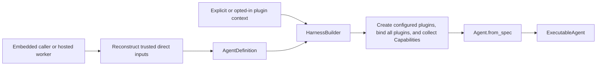
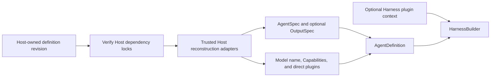

# Agent Definition and Build

## Design Position

`AgentDefinition` is the immutable process-local input used to build one reusable Harness executable. It is a Python composition boundary, not a durable document or wire format. It combines the Harness `AgentSpec`, a narrow subclass of native Pydantic AI `AgentSpec`, with one build-time output contract, a trusted native model, top-level Capabilities, Harness plugins, and named complete child definitions. Capability is the only top-level feature-behavior composition plane: function tools and Toolsets are owned by a Capability rather than supplied through peer `AgentDefinition` fields. A native Pydantic AI `AgentSpec` remains accepted when no Harness model configuration is needed.

The Harness does not compile, serialize, reload, or discover Agent definitions. A hosted system owns its serializable Agent definition and dependency-lock schemas, then reconstructs the trusted Python objects required by `AgentDefinition` inside the execution process. Direct plugins remain such inputs. Separately, one builder may apply the narrow [Harness-owned plugin configuration](05-plugin-system.md#configuration-document) after definition construction; this removes plugin reconstruction from the Host without turning the document into an Agent format. Python objects, factory classes, and import targets never pass through a hosted API or durable record.



Preset materialization, provider configuration, artifact installation, revision locking, and rollout remain Host concerns. The Harness owns only process-local validation and construction.

## AgentDefinition

```python
@dataclass(frozen=True, slots=True)
class AgentDefinition[OutputT]:
    agent: AgentSpec
    output_type: OutputSpec[OutputT] | None
    definition_id: str = <process-local UUID>
    model: Model | KnownModelName | str | None = None
    capabilities: tuple[AbstractCapability[AgentContext], ...] = ()
    plugins: tuple[AbstractHarnessPlugin, ...] = ()
    subagents: tuple[SubagentDefinition, ...] = ()
    self_healing: bool = True
    model_recovery: ModelRecoveryPolicy = ModelRecoveryPolicy()
```

| Field            | Meaning                                                                                                          |
| ---------------- | ---------------------------------------------------------------------------------------------------------------- |
| `agent`          | Harness or native Pydantic AI declarative Agent configuration                                                    |
| `output_type`    | Explicit native process-local `OutputSpec`, or `None` to select the object schema in `AgentSpec.output_schema`   |
| `definition_id`  | Non-blank logical correlation value; it grants no authority                                                      |
| `model`          | Optional native Model or model name overriding the `AgentSpec` selection                                         |
| `capabilities`   | The only top-level feature plane; each native Capability owns its tools, Toolsets, guidance, settings, and hooks |
| `plugins`        | Trusted concrete Harness middleware instances supplied directly with this definition                             |
| `subagents`      | Named complete process-local child definitions and authored edge ceilings                                        |
| `self_healing`   | Enables narrow one-shot provider-history repairs on each resolved native Model                                   |
| `model_recovery` | Optional bounded `ModelAttempt` policy for recoverable model interruption inside one logical Harness Run         |

Construction deep-copies `AgentSpec` and freezes the collection fields as tuples. Child names are unique within one parent. The finite acyclic child graph and its exact `SubagentDefinition` contract are owned by [Delegation and Subagents](11-delegation-and-subagents.md#child-definitions-and-built-collection). The Harness does not require every trusted Python object to be serializable, hashable, deeply immutable, or reconstructible from metadata. Reentrancy remains the responsibility of native objects and Agent-bound extensions whose instances are shared by concurrent runs.

`AgentSpec` remains the owner of instructions, request settings, output retry behavior, declarative Capability specs, optional object `output_schema`, and its own model selection. The Harness subclass adds only `model_config`, a resolved `ModelConfiguration` describing model characteristics that native provider `ModelProfile` does not own. Exactly one build-time output source is selected: an explicit `AgentDefinition.output_type`, or native `AgentSpec.output_schema` when `output_type is None`. The latter produces `dict[str, JsonValue]`; `None` without a schema and an explicit output together with a schema are rejected. Native `OutputSpec`, Model profiles, Capability-owned tools and Toolsets, and explicit Capability instances retain their upstream Pydantic AI semantics. The Harness does not mirror those types in a second schema.

```python
class ModelConfiguration(BaseModel):
    context_window: int | None = None
    proactive_context_management_threshold: float | None = 0.65
    compact_threshold: float = 0.90

class AgentSpec(PydanticAgentSpec):
    model_configuration: ModelConfiguration | None = Field(
        default=None,
        alias="model_config",
    )
```

`ModelConfiguration` is the resolved per-model value, not a provider request setting or a replacement for native `ModelProfile`. `context_window=None` means the Harness cannot derive context thresholds. When known, the builder derives the summarize reminder threshold as `int(context_window * proactive_context_management_threshold)` and the compaction trigger as `int(context_window * compact_threshold)`. A `None` proactive threshold disables the automatic summarize reminder. The defaults are 65% and 90%, matching the context lifecycle rather than a provider wire contract.

A Host or preset layer may select and materialize `ModelConfiguration`, but the Harness does not infer it from a model name and does not yet ship concrete model declarations. Model configuration parameterizes an explicitly selected `HandoffCapability` or `CompactionCapability`; it never enables either feature implicitly. Explicit Capability token settings take precedence. `CompactionCapability()` without an explicit policy requires a known model context window and is resolved once at build time.

## Build API

```python
class HarnessBuilder:
    def __init__(
        self,
        *,
        capability_type_catalog: CapabilityTypeCatalog | None = None,
        build_context: HarnessBuildContext | None = None,
        configured_plugins_enabled: bool | None = None,
    ) -> None: ...

    def build[OutputT](
        self,
        definition: AgentDefinition[OutputT],
    ) -> ExecutableAgent[OutputT]: ...

    @overload
    def build_code[OutputT](
        self,
        agent: AgentSpec,
        *,
        output_type: OutputSpec[OutputT],
        definition_id: str | None = None,
        model: Model | KnownModelName | str | None = None,
        capabilities: Sequence[
            AbstractCapability[AgentContext]
        ] = (),
        plugins: Sequence[AbstractHarnessPlugin] = (),
        subagents: Sequence[SubagentDefinition] = (),
        self_healing: bool = True,
        model_recovery: ModelRecoveryPolicy | None = None,
    ) -> ExecutableAgent[OutputT]: ...

    @overload
    def build_code(
        self,
        agent: AgentSpec,
        *,
        output_type: None,
        definition_id: str | None = None,
        model: Model | KnownModelName | str | None = None,
        capabilities: Sequence[
            AbstractCapability[AgentContext]
        ] = (),
        plugins: Sequence[AbstractHarnessPlugin] = (),
        subagents: Sequence[SubagentDefinition] = (),
        self_healing: bool = True,
        model_recovery: ModelRecoveryPolicy | None = None,
    ) -> ExecutableAgent[dict[str, JsonValue]]: ...
```

Builder construction and both build methods are synchronous. `capability_type_catalog=None` selects the canonical empty catalog; a supplied catalog is exact, immutable, and builder-local. An explicit `build_context` bypasses ambient discovery. With `build_context=None`, `configured_plugins_enabled=None` follows the environment enable switch, while `True` or `False` provides a trusted call-site override without reading that switch. Enabled construction performs synchronous JSON/file loading and package discovery. For an explicit context, the override changes only its application state and never consults ambient sources; enabling requires that context to contain a configuration. The detailed source, bounds, run-time immutability, and failure contract belongs to [Harness Plugin System](05-plugin-system.md#build-context-and-source-resolution). `build_code()` creates an `AgentDefinition` and delegates to `build()`; it is not a second construction path.

The build flow is:

01. Validate the finite child graph and unique names, recursively build children before their parent, and freeze one immediate-child `SubagentCollection`.
02. Create fresh configured plugin instances for the current definition, append them after direct definition plugins, and validate and deterministically order the combined tuple.
03. Call each plugin's `for_agent()` and validate stable concrete type, ID, and ordering.
04. Collect the Agent-bound plugins' ordinary Pydantic `AbstractCapability[AgentContext]` contributions.
05. Resolve automatic Handoff and Compaction thresholds once from the copied Harness `AgentSpec.model_config`; explicit Capability token settings remain unchanged.
06. Install one thin `ResolveModelId` Capability, exactly one mandatory `ToolSurfaceCapability`, exactly one outer `ToolExecutionBoundaryCapability`, and exactly one innermost `MessageIntegrityFilterCapability` for every Agent. Tool ordering places ordinary candidates inside tool-surface resolution, optional CodeAct outside the effective surface, and the execution boundary outermost.
07. Wrap a concrete build-time Model in `SelfHealingModel` when self-healing is enabled.
08. Resolve exactly one build-time business output. Prepare an explicit `OutputSpec`, or construct native `StructuredDict` from a detached `AgentSpec.output_schema` and clear that field only on the temporary construction copy.
09. Form the complete native output contract as `[business_output, DeferredToolRequests]`; the reserved control type is outside every business output marker.
10. Call `Agent.from_spec()` once with `deps_type=AgentContext`, the copied `AgentSpec`, the complete output contract, the selected model, the exact authorized custom Capability types, explicit Capabilities, and plugin contributions. No top-level `tools` or `toolsets` argument is supplied, and runs do not override output type.
11. Build the matching business-output validator and return an `ExecutableAgent` owning the immutable child collection.

`defer_model_check=True` is always used so a logical string can reach the run-scoped resolver after fresh `RunBindings` exist. The resolver delegates to native Pydantic inference when the run has no `ModelRunBinding`; this is ordinary embedded behavior, not a second settings or registry system. The exact resolution and recovery contract is owned by [Input, Model, and Output Boundaries](16-input-model-and-output.md).

The builder does not accept a general class registry, externally mutable plugin factory catalog, Agent compiler, serialized Agent spec, resolved-component envelope, or Host lifecycle object. It may receive the exact immutable custom Capability type catalog authorized for declarative `AgentSpec` reconstruction and one immutable `HarnessBuildContext`. The plugin context selects only the narrow Harness configuration contract and bounded namespaced JSON extensions; it cannot construct unrelated Python values or configure run-scoped Environment topology.

## Executable Ownership

An `ExecutableAgent` owns:

- the copied process-local `AgentDefinition`;
- the one constructed Pydantic AI `Agent`;
- the ordered Agent-bound plugin tuple;
- the output validator;
- its immutable immediate-child `SubagentCollection`.

The ordinary zero value for child topology is the canonical empty collection. Child construction and delegation semantics are owned by [Delegation and Subagents](11-delegation-and-subagents.md); they do not introduce a serialized Harness definition layer.

Every invocation creates a fresh `AgentContext`, fresh run-bound plugin replacements, and fresh run bindings. The executable can serve concurrent runs only when its native Model, Agent-bound Capabilities and their owned tools/Toolsets, and Agent-bound plugins satisfy their upstream or documented reentrancy contracts.

`close()` is idempotent and prevents future invocations. Per-run resources belong to each `HarnessRunStream`; construction does not invent another provider lifecycle.

## Host Reconstruction

A hosted worker reconstructs the process-local definition from its own immutable revision and installed trusted adapters:



The Host may use typed Presets, provider integration revisions, or artifact locks under its own contracts. It may persist or generate the exact Harness plugin document and pass an explicit context, or let deployment environment variables opt the builder in; it need not own a plugin factory adapter. The Harness neither verifies a Host artifact digest nor derives Python import paths from untrusted definition data.

Fresh current-run authority does not belong in `AgentDefinition`. Identity, the Environment aggregate, run-scoped model resolution, policy, credentials, and other invocation collaborators enter through `RunBindings` or their narrowly owning fresh Pydantic Capabilities. `AgentDefinition` deliberately has no `environment`, provider selector, desired topology, or `environment.operations` field. Environment consumers declare and enforce scoped readiness at the operation or owning feature boundary; the optional `DynamicEnvironmentCapability` configures only model projection.

## Failure Semantics

| Failure                                                                   | Outcome                                                                                        |
| ------------------------------------------------------------------------- | ---------------------------------------------------------------------------------------------- |
| Blank `definition_id`                                                     | `DefinitionError(code="definition_id_invalid")`                                                |
| Invalid, duplicate, or cyclic child topology                              | `DefinitionError` before the affected parent executable is returned                            |
| Invalid plugin configuration, factory, type, ID, ordering, or replacement | Plugin or builder construction fails before an affected executable is returned                 |
| Invalid plugin Capability contribution                                    | Build fails before Pydantic Agent construction                                                 |
| Explicit output and `AgentSpec.output_schema` are both present            | `DefinitionError(code="output_contract_conflict")` before Pydantic construction                |
| Neither explicit output nor `AgentSpec.output_schema` is present          | `DefinitionError(code="output_contract_missing")` before Pydantic construction                 |
| Business output directly or transitively includes `DeferredToolRequests`  | `DefinitionError(code="output_contract_reserved")` before Pydantic construction                |
| Invalid `AgentSpec`, model, Capability-owned tool/Toolset, or output      | `DefinitionError(code="agent_build_failed")` with the original exception retained as the cause |
| Host revision or artifact cannot be reconstructed                         | Host failure before calling the Harness                                                        |
| Run-scoped model cannot be resolved                                       | Typed run failure owned by the model boundary                                                  |

Errors do not serialize arbitrary Python object representations, credentials, or private installation paths.

## Boundaries

| Concern                                                         | Owner                                                                    |
| --------------------------------------------------------------- | ------------------------------------------------------------------------ |
| Native `AgentSpec`, Model, profile, output, Toolset, Capability | Pydantic AI                                                              |
| Process-local `AgentDefinition` and executable build            | This specification                                                       |
| Plugin ordering, Agent/run binding, and middleware              | [Harness Plugin System](05-plugin-system.md)                             |
| Run bindings, execution, results, and cleanup                   | [Execution Context and Lifecycle](06-execution-context-and-lifecycle.md) |
| Hosted schemas, Presets, immutable revisions, and locks         | Host                                                                     |
| Durable execution, checkpoint selection, and delivery           | Host                                                                     |

## Trade-offs

### Code-first Python Composition vs. a Harness Wire Language

Code-first composition preserves native Pydantic objects and keeps construction direct. A hosted system must own explicit reconstruction adapters and cannot treat arbitrary Python objects as durable data. This is preferable to a second compiler, class registry, or lossy universal schema.

### One `Agent.from_spec()` Path vs. Constructor Mirroring

Using one authoritative upstream construction call avoids field-by-field translation. The Harness must track compatible public Pydantic AI behavior, but it does not maintain a parallel Agent language.
