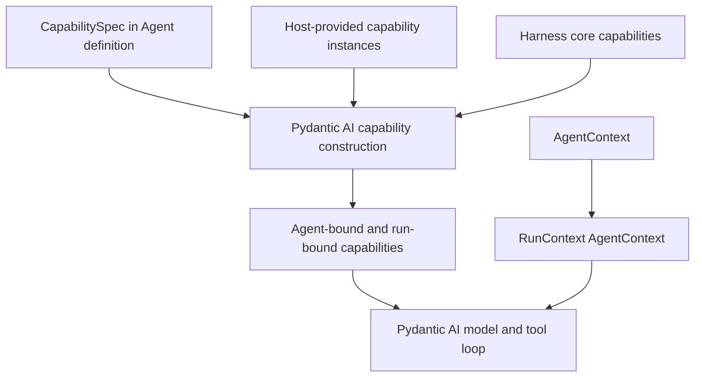
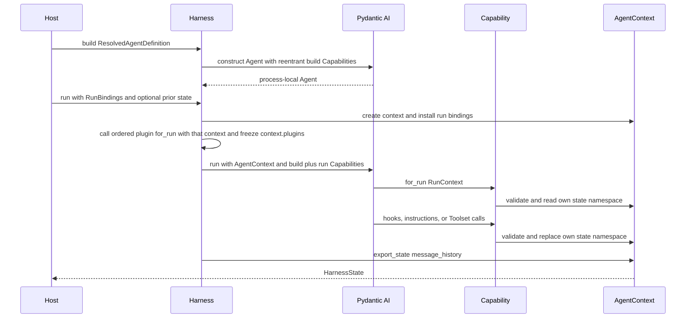
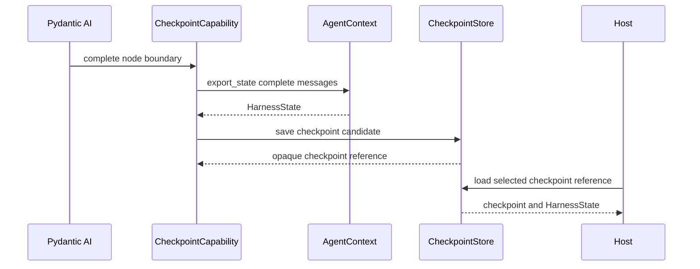

# Capability and Agent Context Model

## Design Position

Every reusable component whose behavior is inside a Pydantic Agent run is a Pydantic AI `AbstractCapability[AgentContext]`. This is the concrete generic specialization used by core, optional, plugin-contributed, and host-integration Capabilities; the Harness does not accept `AbstractCapability[Any]` or a second Pydantic dependency type. Immediate input and the semantic pre-run `RunInputFactory` remain input-boundary values. A first-class Harness plugin can wrap the semantic-input-to-complete-result boundary and contribute ordinary Capabilities, but it does not duplicate model-, node-, request-, or tool-level Capability hooks. Trusted native Pydantic model, tool, and Toolset objects can enter `ResolvedAgentDefinition` as direct process-local build inputs. A Capability can contribute instructions, model selection and settings, Toolsets, validation, Pydantic lifecycle behavior, state transitions, events, or host integration.

`AgentContext` is the single dependency supplied through `RunContext[AgentContext]`. Every Capability hook, instruction provider, Toolset, and run binding therefore observes the same trusted Identity, stable multi-Environment facade, ordered run-bound plugin context, and mutable continuation state. `EnvironmentCapability` contributes Environment lifecycle and state behavior over that exact facade; it does not own a second binding collection. Pydantic AI remains responsible for Capability composition and execution.



The Harness does not define a second per-node hook system, Toolset lifecycle, or Capability registry. Its separate plugin middleware chain governs only the outer input-to-result boundary and is owned by [Harness Plugin System](05-plugin-system.md). Pydantic AI public run and per-node hooks remain available to Capability authors. Direct native tools and Toolsets retain their upstream lifecycle and trusted-process boundary; portable declarative tool features use the owning Capability spec. The Harness adds only the semantic pre-run input-factory seam owned by the input contract because it must execute after Environment binding and compatible state restore and before a Pydantic run receives its prompt. An input factory that needs a provisioned Environment operation explicitly awaits the typed readiness contract rather than relying on a global ready-all barrier.

## Native Composition

| Pydantic AI primitive      | Harness use                                                                 |
| -------------------------- | --------------------------------------------------------------------------- |
| `AbstractCapability`       | Core behavior, optional features, plugins, and host integrations            |
| `Capability`               | Declarative instructions, tools, Toolsets, model settings, and simple hooks |
| `CombinedCapability`       | Capability aggregation                                                      |
| `CapabilityOrdering`       | Required dependencies and middleware ordering                               |
| `AbstractToolset`          | Tool discovery and dispatch contributed by a Capability                     |
| `WrapperToolset`           | Authorization, approval, result safety, and tool instrumentation            |
| `RunContext[AgentContext]` | Current messages, usage, run metadata, tools, and run-bound capabilities    |

Capability IDs, `for_agent`, `for_run`, deferred loading, hook ordering, wrapper nesting, and cleanup follow Pydantic AI semantics. Harness code does not inspect or advance the private Agent graph.

## Lifecycle Integration

Hosts do not receive a list of generic callback slots. Agent-affecting lifecycle work uses these existing seams:

| Need                                                      | Integration                                                                 |
| --------------------------------------------------------- | --------------------------------------------------------------------------- |
| Create input from entered Environment resources           | Semantic `RunInputFactory` from the input contract                          |
| Transform semantic input or the complete Harness result   | Harness plugin `wrap_run` around the canonical run path                     |
| Create an isolated Capability instance for one run        | Pydantic Capability `for_run`; no sibling setup dependency                  |
| Validate or observe before Agent nodes                    | Pydantic Capability `before_run` and `CapabilityOrdering`                   |
| Acquire and scope run resources with teardown             | Pydantic Capability `wrap_run` or Toolset async context manager             |
| Observe or act before and after public Agent nodes        | Pydantic Capability per-node hooks                                          |
| Check authority or publish checkpoints at safe boundaries | Dedicated Capability that translates nodes into its semantic boundary model |
| Observe model, tool, and enqueue activity                 | Pydantic events and `HarnessRunStream`                                      |
| Transform stream events before terminal delivery          | Harness plugin `wrap_run`; already emitted events are irreversible          |
| Transform history or a model request                      | Pydantic history and request Capabilities                                   |

Per-node hooks remain an advanced Capability-author surface because checkpointing, safe suspension, usage collection, and host authority checks can require exact execution boundaries. A host collaborator passed to such a Capability receives semantic values such as a checkpoint boundary or authority decision request, not a raw graph node. The public `run()` and `stream()` methods therefore do not reproduce the former `pre_node_hook`, `post_node_hook`, `pre_event_hook`, or `post_event_hook` argument set.

Pydantic may call sibling `for_run()` methods concurrently, so `for_run()` derives a run-bound copy or binding and must not wait for another Capability's setup. Harness preparation has already bound and entered the Environment before the Pydantic run. An Environment-dependent Capability can directly await `ctx.deps.environment.ensure_ready(requirement)` in its own `for_run()`, then return an immutable run-bound replacement containing the instructions, Toolsets, or other model-surface values materialized from that ready resource. Pydantic re-extracts those contributions from the replacement before its first model request. The replacement performs no later discovery I/O, and its model-visible values remain stable for the run.

`before_run()` remains an ordered observe-only seam for validation, state acceptance, and notifications that acquire no run-scoped resource. It is too late to select instructions or tool definitions because run contributions have already been assembled. A Capability that acquires a connection, lease, task, or other scoped collaborator uses `wrap_run()` or its Toolset context manager, with `CapabilityOrdering` controlling wrapper nesting and teardown. Input production uses `RunInputFactory` because a prompt must exist before Pydantic can start the Agent run; a factory that needs readiness calls the same `BoundEnvironment.ensure_ready()` contract itself because it runs before Capability `for_run()`. Completion behavior inside the Pydantic run uses Capability lifecycle. Complete-result transformation or observation uses the ordered Harness plugin chain; the Harness does not add independent `on_agent_start` and `on_agent_complete` callback registries beside those paths.

## Capability Categories

The categories describe ownership, not subclasses.

| Category             | Examples                                                        | Typical contribution                                        |
| -------------------- | --------------------------------------------------------------- | ----------------------------------------------------------- |
| Core                 | Identity, invocation authorization, context state, events       | Always-active Pydantic hooks and wrapper Toolsets           |
| Agent feature        | Compaction, delegation, working state, media, code execution    | Instructions, Toolsets, hooks, optional feature-owned state |
| Provider integration | Environment, model gateway, MCP, skill source                   | Provider binding plus instructions or Toolsets              |
| Host integration     | Checkpoint storage, policy, credential broker, telemetry export | Typed collaborator and lifecycle hooks                      |

A concrete feature can retain a narrow provider interface internally. That provider interface is not another Harness component model.

## AgentContext

```python
@dataclass
class AgentContext:
    run_id: str
    instance: AgentInstanceContext
    state: AgentContextState
    environment: BoundEnvironment
    plugins: BoundPluginContext
    events: HarnessEventEmitter
    metadata: Mapping[str, JsonValue]

    async def export_state(
        self,
        message_history: Sequence[ModelMessage],
    ) -> HarnessState: ...


@dataclass
class EnvironmentCapability(AbstractCapability[AgentContext]):
    """Lifecycle and state integration for AgentContext.environment."""

    capability_id: str = "foundation.environment"
```

`AgentContext` is created for one process-local harness run and is never reused by another run. Its fields are limited to data used across several capabilities or needed by ordinary tools:

- `instance` is the trusted Agent Identity and lineage binding;
- `state` is the complete recoverable Agent Context state, including capability namespaces and Environment state;
- `environment` is the run-bound multi-Environment facade used by filesystem, shell, process, port, and Environment-state operations;
- `plugins` is the read-only stable handle whose ordered index becomes available after this run's plugin binding phase;
- the internal `events` emitter is a small run-local facade installed by its core capability;
- `metadata` is non-authoritative correlation data.

The `plugins` property cannot be reassigned. Its `BoundPluginContext` handle exists when `AgentContext` is created, rejects reads while ordered `for_run(context)` binding is in progress, and atomically exposes the complete immutable index before middleware or Pydantic Capability behavior starts. The corresponding Environment and event components are still `AbstractCapability[AgentContext]` implementations. Their facades and `BoundPluginContext` are placed on `AgentContext` because tools and contributed Capabilities need them and the values form one cohesive run dependency. `EnvironmentCapability` is a public core Capability class so another Capability can declare a real lifecycle dependency through Pydantic ordering or capability lookup. Ordinary filesystem, shell, process, and port access does not require that lookup: tools and Capabilities use `ctx.deps.environment`, which is the same `BoundEnvironment` instance observed by `EnvironmentCapability`.

The Harness enters `EnvironmentRunBinding` before the Pydantic run, obtains one stable facade, places it on `AgentContext`, and installs the run-bound `EnvironmentCapability` over it. The Capability handles imported Environment state acceptance, export, bounded model context, and topology-change notices. Neither side exposes or mutates a shared Python list. The facade's private routing coordinator publishes immutable topology snapshots, while the Host-retained controller replaces those snapshots atomically.

Pydantic `RunContext.usage` remains the sole live usage accumulator, `RunContext.usage_limits` exposes the native limits selected for the run, and `RunContext.enqueue()` and `RunContext.cancel()` are the internal active-run control primitives; none needs a second `AgentContext` field. The Harness constructs the event emitter and a run-specific `ActiveRunCapability` for the canonical `HarnessRunStream`; its run-local bridge connects the wrapper to the live `RunContext` without becoming an `AgentContext` field. The host does not inject an event, usage sink, or generic control object. `BoundEnvironment` always represents a set of bindings; a single Environment is the one-binding case. Provider clients, credential material, storage clients, model wrappers, callbacks, and host lifecycle objects remain private to the owning Capability.

`AgentContext` is not a general service locator. Capability-specific interaction inside a run uses the public Pydantic AI `RunContext.capabilities` mapping and an explicit Capability ID. A Capability contributed by a Harness plugin resolves the same run-bound plugin used by middleware through `ctx.deps.plugins.require(plugin_id, ExpectedPluginType)`; the ID-and-type lookup is intentionally limited to first-class plugins and is not a generic services or Capability registry. A host that constructs a Capability retains its typed instance or collaborator.

## Capability State

State is stored by Capability ID so feature fields do not accumulate on `AgentContext`.

```python
class CapabilityState(BaseModel):
    version: str
    data: JsonValue


class AgentContextState(BaseModel):
    entries: dict[str, CapabilityState] = Field(default_factory=dict)

    def read[T: BaseModel](
        self,
        capability_id: str,
        state_type: type[T],
        *,
        version: str,
    ) -> T | None: ...

    def write[T: BaseModel](
        self,
        capability_id: str,
        value: T,
        *,
        version: str,
    ) -> None: ...
```

The owning Capability defines its state model and version. A stateful Capability has an explicit stable Pydantic Capability ID; an automatically derived process-local ID is not a continuation key. It reads only its configured ID and replaces a validated value atomically; it does not mutate another Capability's entry. Stateless capabilities create no entry.

Core and optional features use the same namespace model. The Environment Capability stores the current multi-binding `EnvironmentState` under its stable Capability ID; Working State, compaction, discovery, and other stateful Capabilities store their own typed entries. The Delegation Capability stores bounded complete inline-child continuation snapshots under its own stable ID. A Host-owned background Capability either owns another explicit state entry or keeps its scheduler, delivery, and lifecycle data outside `HarnessState`; it cannot write another Capability's entry. `AgentContextState` therefore remains extensible without adding a field for every feature.

| Continuation concern                                               | Owning Capability entry  |
| ------------------------------------------------------------------ | ------------------------ |
| Per-binding Environment and provider recovery data                 | Environment              |
| Local task snapshot or provider cursor, plus notes and TODOs       | Working State            |
| Prior-response reference and compaction metadata                   | Compaction               |
| Loaded tool and namespace IDs                                      | Tool Discovery           |
| Pending explicit file references                                   | File Reference           |
| Complete inline-child identities and continuation snapshots        | Delegation               |
| Trusted deferred authorization correlation not already in messages | Invocation Authorization |

Pydantic messages remain in `HarnessState.message_history`, outside the namespace map. Run usage, external API usage, queues, callbacks, locks, clients, configuration, host delivery records, and host lifecycle fields are either process-local observations or host state; they are not copied into `AgentContextState`.

Messages remain Pydantic AI messages. `await AgentContext.export_state(message_history)` verifies envelope limits and JSON encodability and combines message history with the current namespace values. Before returning, it asks the bound Environment facade for its current state and replaces the Environment Capability entry. Other stateful Capabilities update their entries at the semantic transitions they own. Before first iteration, their imported entries are preserved as pending values rather than reported as refreshed or accepted; after run binding, every included entry has been accepted or produced by its owner. Entry replacement and snapshot copy use the same short process-local state lock. Entry validation occurs when the owning Capability reads or writes its typed state, so `AgentContext` does not maintain a second codec registry.

Capability entries are reserved for continuation semantics that messages cannot express, including loaded tool discovery, working notes, a local task snapshot or non-authoritative provider cursor, compaction metadata, and complete inline-child snapshots. Provider-backed task contents, scope authority, clients, and mutation receipts remain with the Host task provider and fresh run binding; imported cursor metadata never seeds that provider. Delegation State contains no active child task, running status, lock, partial parent tool batch, Host receipt, scheduler record, or delivery fact. A child snapshot becomes part of exported parent state only at a complete parent semantic boundary. Environment state can contain opaque references only to backend-local objects reachable after any required Host attachment and fresh binding construction; the owning backend codec treats them as non-authoritative and revalidates them. Provider-adapter lifecycle records, credentials, policy decisions, live clients, bearer handles, host delivery records, and durable lifecycle values are excluded.

## Capability Interaction

Capabilities use one of five interaction paths:

1. Pydantic AI composition for instructions, models, Toolsets, and hooks.
2. `RunContext[AgentContext]` for messages, usage, usage limits, tools, and shared run bindings.
3. `RunContext.capabilities[id]` when one Capability explicitly depends on another run-bound Capability.
4. `ctx.deps.plugins.require(id, type)` when a plugin-contributed Capability needs its owning run-bound Harness plugin.
5. A typed collaborator passed to a host-integration Capability constructor.

`CapabilityOrdering.requires` declares required Capability types. Direct Capability lookup is appropriate only when behavior genuinely depends on a peer Capability; shared data does not justify a new interface by itself. Harness plugin ordering and typed plugin lookup follow their separate outer-boundary contract and do not change Capability ordering. In particular, a Capability reads the shared Environment through `ctx.deps.environment`; it depends on or looks up `EnvironmentCapability` only when it needs that Capability's lifecycle behavior rather than file or shell access.

Application dependencies follow the same rule without extending `AgentContext`. A tool used in one place closes over its typed client or repository. A coordinated group of tools is contributed by an application Capability that captures those collaborators in its constructor. Another Capability reads that dependency through the public run-bound Capability mapping only when there is a real Capability dependency. The Harness provides examples and type-checkable helpers for these patterns but no `services: Mapping[str, Any]`, arbitrary context subclass, or dynamically populated dependency container.



## Checkpoint Integration

`CheckpointCapability` is the host-integration Capability for semantic checkpointing. It observes Pydantic AI node boundaries and uses a host-provided `CheckpointStore` port. Embedded applications, CLI hosts, and hosted execution services implement the same port with the durability appropriate to their environment.

```python
class CheckpointStore(Protocol):
    async def save(
        self,
        checkpoint: HarnessCheckpoint,
    ) -> str: ...

    async def load(
        self,
        checkpoint_ref: str,
    ) -> HarnessCheckpoint | None: ...


@dataclass
class CheckpointCapability(AbstractCapability[AgentContext]):
    store: CheckpointStore
```

At a tool-consistent public node boundary, the Capability asks `AgentContext` to export message history and complete Agent Context state, then passes a `HarnessCheckpoint` candidate to `CheckpointStore.save`. The store returns an opaque checkpoint reference owned by the host. The candidate contains `HarnessState` and process-local boundary metadata; it is not itself a committed host version.

The host constructs the store with its checkpoint namespace, concurrency policy, and durability behavior. A hosted service can wrap `HarnessState` in a larger durable record and apply its own ownership or fencing rules. An embedded application or CLI can use a memory, file, or database implementation.

The host selects a checkpoint reference and calls `load()` before `run()` or `stream()`. `CheckpointCapability` depends only on the save behavior during Agent execution; it never invokes `load()`. The combined `CheckpointStore` protocol is retained because embedded and hosted adapters commonly implement both operations, rather than splitting a second pair of storage interfaces without a demonstrated need. `CheckpointCapability` does not choose an implicit latest version, establish durable execution ownership, acquire a lease, or make a failed save fatal unless the store policy requests that behavior.



This design makes checkpoint production a reusable Capability while leaving storage authority and recovery policy with the host.

## Deferred Capabilities

Pydantic AI deferred loading is used directly for model-visible optional behavior. Loading a deferred Capability can reveal its instructions and tools; it cannot install code, replace host-selected infrastructure, restore credentials, or widen Agent Identity authority.

Identity, invocation authorization, context state, and any Capability needed to interpret imported state are eagerly active.

## Failure Semantics

| Failure                                           | Result                                                                                    |
| ------------------------------------------------- | ----------------------------------------------------------------------------------------- |
| Capability configuration is invalid               | Agent build fails with Pydantic validation details                                        |
| Capability ID is duplicated                       | Agent build or run setup fails                                                            |
| Required Capability is absent or ordering cycles  | Pydantic AI composition fails                                                             |
| Imported state version is unsupported             | Run creation fails before model or tool work                                              |
| A Capability `for_run` or hook fails              | The run fails and entered resources close                                                 |
| Required Environment readiness fails or times out | The owning preparation or `for_run()` path fails before exposing dependent model behavior |
| Optional checkpoint write fails                   | Host writer policy determines retry, warning, or run failure                              |

## Boundaries

| Concern                                                                        | Owner                                                    |
| ------------------------------------------------------------------------------ | -------------------------------------------------------- |
| Capability lifecycle, ordering, and Toolset composition                        | Pydantic AI                                              |
| `AgentContext`, capability state namespaces, and Environment state aggregation | Harness                                                  |
| Harness plugin discovery, binding, ordering, middleware, and typed context     | [`05-plugin-system.md`](05-plugin-system.md)             |
| Harness state envelope                                                         | [`10-snapshot-and-resume.md`](10-snapshot-and-resume.md) |
| Durable checkpoint selection, storage generation, fencing, and recovery        | Host                                                     |

## Trade-offs

### High-cohesion Context vs. Fully Isolated Dependencies

Common Identity, Environment, event, and state access keeps tool code small and makes `AgentContext` a cohesive run dependency. Tools and Capabilities use native active-run operations on `RunContext` and read usage and limits from `RunContext.usage` and `RunContext.usage_limits`; Capability-owned state prevents the context class from growing with every optional feature.

### Native Capability Access vs. Harness Facade

Using `RunContext.capabilities` avoids a duplicate registry and follows the upstream run-bound lifecycle. It couples Capability authors to the supported Pydantic AI 2 public API, which is already the Harness foundation.

### Candidate Checkpoint vs. Harness Durability

The Checkpoint Capability makes checkpoint production composable and reusable. Treating its output as a candidate leaves selection, storage generation, and fencing with the host, so the Harness does not become a partial workflow engine.
