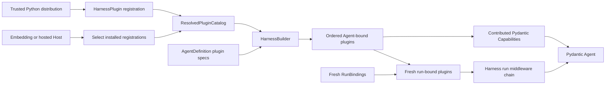
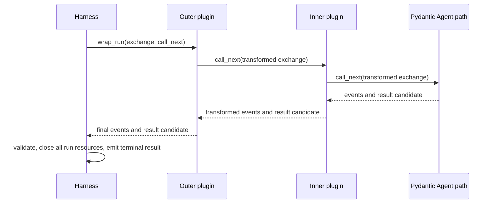

# Harness Plugin System

## Design Position

A Harness plugin is a trusted first-class component that can wrap the complete process-local Harness run and contribute native Pydantic AI `AbstractCapability[AgentContext]` values to the Agent build. It is not merely a distribution wrapper around a Capability. Pydantic Capabilities remain the extension point inside the Agent loop; Harness plugins own behavior at the input-to-result boundary that begins after run preparation and ends before public terminal delivery.



The Host installs, verifies, and selects plugin artifacts and faithfully supplies the selected catalog, materialized plugin specs, resolved native build inputs, and fresh run bindings. The Harness validates and constructs plugins, orders their graph, derives Agent- and run-bound replacements, builds the middleware chain, and adds plugin-contributed Capabilities to Pydantic Agent construction.

The system adds no package manager, remote-plugin RPC protocol, generic mutable context bag, durable plugin-state namespace, or second per-node hook framework. Untrusted or separately governed behavior stays behind a feature-specific tool or provider protocol. Model-, node-, tool-, and request-level middleware remains native Pydantic Capability behavior.

## Definition and Export

`AgentDefinition.plugins` is an ordered tuple of typed `PluginSpec` values outside the nested Pydantic `AgentSpec`. The concrete plugin type owns its spec schema and construction.

```python
class PluginSpec(BaseModel):
    """Conceptual tagged base for a concrete plugin-owned spec."""


class PluginFactory(Protocol):
    def __call__(
        self,
        spec: PluginSpec,
    ) -> AbstractHarnessPlugin: ...


@dataclass(frozen=True)
class HarnessPluginRegistration:
    export_id: str
    plugin_type: type[AbstractHarnessPlugin]
    factory: PluginFactory | None = None


@dataclass(frozen=True)
class ResolvedPluginCatalog:
    registrations: tuple[HarnessPluginRegistration, ...] = ()

    def plugin_types(
        self,
    ) -> tuple[type[AbstractHarnessPlugin], ...]: ...
```

The schemas are conceptual Python contracts, not a serialized universal plugin wire format. Each concrete plugin type provides a stable serialization name, typed `from_spec` construction, and a stable instance `plugin_id`. The definition stores portable behavior configuration and typed logical references, never a Python import path, distribution location, live client, credential, or current-run authority.

`export_id` identifies one selected package export for diagnostics and Host policy. Distribution name, version, wheel digest, signature, installation source, artifact lock, and rollout remain Host metadata. One distribution can export multiple plugin registrations and ordinary Pydantic Capability types. A self-hosted deployment installs those distributions in its image and includes only operator-selected registrations in the catalog passed to the Harness. With no custom factory, the Harness calls `plugin_type.from_spec()`. A Host-resolved factory can capture a typed authority-neutral provider collaborator, but the Harness still invokes it and validates its output. A factory cannot retain current-run Identity, credentials, policy decisions, or another live authority.

Catalog assembly validates that every advertised value is an `AbstractHarnessPlugin` type, every serialization name is non-empty and unique, export IDs are unique, and each registration has at most one factory. Construction validates that the factory or `from_spec()` returns the declared concrete type with the expected serialization name and stable configured ID. The Harness rejects an unknown plugin spec, duplicate plugin ID, or spec/type mismatch before an executable becomes visible. Catalog presence makes construction possible; it does not activate a plugin absent from the exact definition.

The base API accepts explicit registrations. A packaging adapter can read a standard Python entry-point group, but discovery never scans a working directory, imports arbitrary module paths from Agent input, fetches packages, installs code, or automatically activates every installed entry point.

## Plugin Contract

The public contract intentionally borrows the proven Pydantic Capability lifecycle and ordering vocabulary while governing a different boundary.

```python
type PluginPosition = Literal["outermost", "innermost"]
type PluginRef = type[AbstractHarnessPlugin] | AbstractHarnessPlugin


@dataclass(frozen=True)
class PluginOrdering:
    position: PluginPosition | None = None
    wraps: Sequence[PluginRef] = ()
    wrapped_by: Sequence[PluginRef] = ()
    requires: Sequence[type[AbstractHarnessPlugin]] = ()


class AbstractHarnessPlugin(ABC):
    @classmethod
    def get_serialization_name(cls) -> str: ...

    @classmethod
    def from_spec(cls, spec: PluginSpec) -> Self: ...

    @property
    def plugin_id(self) -> str: ...

    def get_ordering(self) -> PluginOrdering: ...

    def for_agent(self) -> Self: ...

    async def for_run(
        self,
        context: AgentContext,
    ) -> Self: ...

    def get_capabilities(
        self,
    ) -> Sequence[AbstractCapability[AgentContext]]: ...

    async def wrap_run(
        self,
        exchange: PluginRunExchange,
        call_next: PluginRunNext,
    ) -> PluginRunResponse: ...


@dataclass(frozen=True)
class PluginRunExchange:
    input: SemanticRunInput
    context: AgentContext

    async def export_current_state(self) -> HarnessState: ...


type PluginRunItem = HarnessEvent | HarnessRunResult


class PluginRunResponse(Protocol, AsyncIterator[PluginRunItem]):
    async def aclose(self) -> None: ...
```

`PluginRunNext` is a single-call async protocol from one exchange to one `PluginRunResponse`. `PluginRunResponse` is an async iterator of non-terminal Harness events followed by one internal result candidate, with an idempotent `aclose()` method. It never yields the public terminal result event. On every exit path, the Harness first cancels, closes, and drains the innermost `AgentRunEvents` and Pydantic resources when that inner path exists; it then closes entered plugin responses from inner to outer, followed by the Environment and remaining outer resources. This one order applies to normal completion, short-circuit, early consumer exit, cancellation, inner error, transform error, and final-validation failure. Typed helpers construct context parts, events, and valid result combinations without exposing the internal `HarnessRunScope`, event sink, cleanup stack, or Pydantic handle. `exchange.export_current_state()` uses the Harness-owned current complete message view with `AgentContext.export_state()`. Before the inner Agent starts, that view preserves imported history and pending entries while excluding unconsumed semantic input; during execution it uses only the latest complete boundary, never partial stream or tool-batch state.

`for_agent()` returns the reentrant instance owned by one built executable. `for_run()` returns a fresh run-bound replacement whenever the plugin has mutable or scoped run state. The Harness never shares a mutable run-bound plugin between concurrent runs. An immutable plugin may return itself only when its implementation is reentrant and carries no current-run authority.

`PluginOrdering` follows middleware semantics. Definition order is the deterministic outer-to-inner tiebreaker. `position`, `wraps`, and `wrapped_by` refine nesting; `requires` declares a required plugin type without implying an additional edge. Type references remain stable when `for_run()` returns a replacement; identity references are valid only when the referenced object is retained. Missing requirements, ambiguous duplicate IDs, and cycles fail deterministically before execution.

The Harness computes and freezes the Agent-bound graph before Pydantic Agent construction. For each run it creates the one `AgentContext`, calls plugin `for_run(context)` sequentially in the final outer-to-inner graph order, verifies that replacement IDs and types still match the built graph, and freezes `context.plugins` before middleware or Pydantic Capability behavior begins. The same `AgentContext` then reaches plugin middleware, plugin-contributed Capabilities, Toolsets, and ordinary Agent code. A replacement cannot add, remove, reorder, or change the type identity of a definition plugin.

## Capability Contribution

An Agent-bound plugin can contribute ordinary `AbstractCapability[AgentContext]` instances to final Agent construction. Those values participate in Pydantic `for_agent`, `for_run`, `CapabilityOrdering`, Toolset composition, model/request hooks, and cleanup exactly like other build Capabilities.

A contributed Capability that needs its owning plugin follows this binding pattern:

1. the Agent-bound Capability records the stable `plugin_id`, not the mutable plugin object;
2. in its own `for_run()`, it resolves `ctx.deps.plugins.require(plugin_id, ExpectedPluginType)`;
3. it can return a run-bound Capability replacement holding that exact run-bound plugin.

Capturing an Agent-bound plugin prototype inside a Capability and using it directly during concurrent runs is invalid. The lookup ensures that middleware and contributed Capabilities observe the same run-bound object.

Plugin-contributed Capabilities do not bypass other build rules. In hosted execution they cannot compete with the locked model integration, introduce undeclared native tools, retain current-run credentials, or silently change behavior absent from the materialized definition and dependency locks. A plugin can contribute a Capability-owned Toolset when the definition and artifact closure select that behavior. Direct native model, tool, and Toolset values remain explicit `ResolvedAgentComponents` inputs rather than plugin middleware products.

## BoundPluginContext

Every `AgentContext` contains the current run's immutable plugin index:

```python
class BoundPluginContext:
    @property
    def ordered(self) -> tuple[AbstractHarnessPlugin, ...]: ...

    def get(
        self,
        plugin_id: str,
    ) -> AbstractHarnessPlugin | None: ...

    def require[PluginT: AbstractHarnessPlugin](
        self,
        plugin_id: str,
        expected_type: type[PluginT],
    ) -> PluginT: ...
```

Lookup requires both the stable ID and expected type. An ID is not authority, and a type-only search cannot choose among several configured instances. Cross-plugin collaboration uses the same typed lookup plus explicit ordering or `requires` declarations after run binding completes. The chain invokes each layer in deterministic nesting order. A plugin owns synchronization only for concurrency it deliberately creates or exposes through contributed Capabilities or Toolsets.

The run-local `BoundPluginContext` has two Harness-owned states: `binding` and `frozen`. During `binding`, all public reads (`ordered`, `get`, and `require`) fail with `PluginError(code="plugins_not_bound")`; no plugin can observe an empty, partial, or prototype/replacement-mixed graph. Plugin `for_run(context)` therefore uses the other shared `AgentContext` fields and does not perform peer lookup. After every ordered replacement succeeds, the Harness atomically freezes the complete index. Middleware and plugin-contributed Capabilities can then use typed lookup. The `AgentContext.plugins` property refers to this one stable object and is not reassignable by plugin or Capability code.

`BoundPluginContext` is not a mutable `dict[str, Any]` and does not contain provider registries, credentials, cleanup callbacks, stream controls, or durable state. Plugin-specific collaborators remain typed constructor inputs, typed Capabilities, or narrow provider protocols. `ContextVar` is not a correctness, selection, or authority mechanism; it may carry only observability correlation such as a run ID or trace span.

The middleware chain, cleanup stack, stream state, input cursor, event sink, controls, and current result candidate belong to an internal per-run `HarnessRunScope` owned by `HarnessRunStream`. They are not fields on `AgentContext`. `scope.context.plugins` and the middleware chain always refer to the same ordered bound instances.

## Run Middleware

`wrap_run(exchange, call_next)` is the expressive Harness plugin primitive. It has HTTP-style nesting around the canonical stream path: declaration order is outer-to-inner, input flows toward `call_next`, and result or error processing unwinds in reverse order.



The exchange exposes the canonical semantic input, current `AgentContext`, and typed helpers for event and result construction. The response represents an ordered stream of ordinary Harness events plus one eventual `HarnessRunResult` candidate; it is not the public terminal event. The exact iterator plumbing remains an implementation detail, but these observable rules are fixed:

- an outer plugin sees input before inner plugins and sees inner events, results, and errors on unwind;
- a plugin can transform input, add bounded `ContextInputPart` values, map or suppress non-terminal events, replace the complete result candidate, or translate an explicitly handled error;
- a plugin can short-circuit by not invoking `call_next` and producing a typed event/result response;
- a plugin invokes `call_next` at most once for one exchange;
- already emitted events cannot be retracted, so a later result replacement does not rewrite prior observations;
- the Harness retains final structural validation and public terminal-event authority.

Convenience APIs such as `transform_input`, `transform_event`, `transform_result`, and `on_error` can be implemented on top of `wrap_run`; they are not independent callback registries and do not create additional ordering rules.

A trusted plugin may replace the complete `HarnessRunResult`, including status, output, deferred values, state, usage, and safe failure. The replacement's `state`, when present, must be either the inner candidate's immutable state or a fresh snapshot returned by `exchange.export_current_state()`; arbitrary replacement of Capability entry bytes is rejected. A plugin changes recoverable state through the owning contributed Capability's typed state API and then requests a fresh exchange export. A short-circuit export uses the same pre-start semantics as `HarnessRunStream.export_state()`: restored non-Environment Capability entries remain pending and value-preserved rather than being reported as accepted. The final value must pass result-combination, Harness-state-envelope, message-codec, correlation, and size validation. A plugin cannot forge Identity, widen Environment or provider authority, mutate a committed Host fact, or make already emitted events disappear. A short-circuit result remains a process-local candidate and acquires no Host durability.

## Input Placement

Plugin input middleware runs after all of the following:

1. the single-use `EnvironmentRunBinding` is bound and entered;
2. compatible Environment state is restored;
3. the optional `RunInputFactory` has executed exactly once;
4. immediate and factory-produced values are normalized into the canonical semantic input.

It runs before `ContentRefInputPart` resolution, native Pydantic `UserContent` mapping, deferred-result mapping, and lazy Pydantic run creation. A plugin can therefore inspect the actual semantic user request, perform query-dependent retrieval through its typed collaborators or current Environment, modify the ordered parts, and append a bounded `ContextInputPart` while preserving explicit provenance and classification.

Input middleware cannot replace `AgentInstanceContext`, policy, credentials, Environment bindings, or any other authority with model-authored or retrieved data. Content reference authorization still runs on the final transformed input. Invalid placement, unknown provenance, disallowed references, or an empty transformed input fail under the normal input contract.

Live `HarnessRunStream.enqueue()` is not retroactively inserted into the initial middleware chain. It uses the live-input mapping and content policy owned by the input contract. A plugin that needs per-model-request or enqueued-message behavior uses a contributed Pydantic Capability and its native hooks.

## Result, Error, and Cleanup Placement

The inner Pydantic path produces a `HarnessRunResult` candidate. Result middleware sees that candidate before any public `HarnessRunResultEvent`. The Harness then revalidates the final candidate, closes the middleware responses and every run-scoped resource, and only after successful teardown publishes the terminal event or returns from `run()`.

If plugin middleware or cleanup fails after an inner candidate exists, the Harness raises `RunCleanupError` with that immutable candidate and bounded cleanup uncertainty; it emits no terminal success event. If failure occurs before a candidate exists, all entered resources still close and the original typed or trusted-code failure propagates according to the run error contract. An `on_error` convenience may translate only an error it explicitly handles and must produce a structurally valid candidate.

A plugin acquires run-scoped resources while its `PluginRunResponse` is entered or iterated and releases them through `aclose()` or an equivalent iterator `finally` path. `wrap_run()` itself does not acquire a resource whose lifetime extends beyond returning the response. That cleanup participates in the same reverse-order async resource stack as Pydantic run resources, contributed Capabilities and Toolsets, model streams, temporary provider leases, and the Environment binding; `for_run()` does not create a second unscoped cleanup lifecycle. Context exit remains idempotent after normal terminal delivery or a cleanup failure.

## State and Continuation

A Harness plugin has no generic durable state namespace. Run-bound plugin instances are process-local and disappear at teardown. Continuation data belongs to one of these explicit owners:

- a plugin-contributed Capability entry in `AgentContextState`, keyed by that Capability's stable ID and codec;
- a Host or provider record outside `HarnessState`;
- Pydantic message history when the value is model conversation state.

This rule prevents the middleware layer from becoming a second state system. A plugin that owns resumable behavior contributes a Capability with typed, versioned state and performs the same import validation and migration as any other stateful Capability.

## Child Agents

A child Agent never inherits a live parent plugin instance, `BoundPluginContext`, middleware chain, cleanup stack, or mutable run state. Each exact child `AgentDefinition` carries its own plugin specs. Its `ResolvedAgentDefinition` uses the Host-selected catalog and dependency locks for that child, its executable owns a separately constructed Agent-bound plugin graph, and every child run receives fresh bound replacements.

Parent and child plugin packages can share immutable configuration and authority-neutral provider pools when their definitions select them. They cannot share live run-bound plugin state. Inline and Host-managed asynchronous children follow the same rule; each child gets fresh `RunBindings` and its own Harness run scope.

## Trust and Discovery Boundary

Imported plugin code runs with Harness process authority. Typed specs, ordering checks, result validation, and state codecs do not sandbox arbitrary Python. Direct filesystem, network, subprocess, or native-tool activity performed by a plugin remains trusted in-process behavior. Operations routed through `BoundEnvironment` and metadata-aware managed tools still undergo their owning Identity and provider enforcement.

Strict isolation uses a small trusted plugin or Capability adapter that calls an external feature-specific service. The core defines no universal remote-plugin protocol.

Importing `converge-agent-harness` performs no plugin scan, provider initialization, credential lookup, network access, or global instrumentation. Catalog refresh affects only later builds; an existing `ExecutableAgent` retains its exact Agent-bound plugin graph and contributed Capabilities until closed.

## Failure Semantics

| Failure                                                           | Result                                                                      |
| ----------------------------------------------------------------- | --------------------------------------------------------------------------- |
| Selected distribution is unavailable, unverified, or incompatible | Host resolution stops before catalog assembly                               |
| Export contains an invalid or duplicate type/name                 | Catalog assembly fails deterministically                                    |
| Definition names a plugin absent from the selected catalog        | Agent build fails with a plugin-scoped definition error                     |
| Plugin spec or `from_spec` construction is invalid                | Owning plugin schema or construction reports the error                      |
| Plugin IDs duplicate, requirement is absent, or ordering cycles   | Build fails before an executable becomes visible                            |
| `for_agent` or Capability contribution fails                      | Build fails and the incomplete executable graph is discarded                |
| `for_run` changes identity/type or fails                          | Run setup fails before plugin or model work                                 |
| Plugin produces invalid input or event before a candidate exists  | Harness validation rejects the value and the original error propagates      |
| Plugin returns an invalid replacement after a valid candidate     | `RunCleanupError` retains the last valid candidate; no terminal event emits |
| Middleware or cleanup fails after a result candidate exists       | `RunCleanupError` retains the last valid candidate and withholds delivery   |

Errors expose safe plugin, export, and definition identifiers. They do not expose credentials, private artifact paths, arbitrary object representations, or installation metadata.

## Boundaries

| Concern                                                                                                                       | Owner                                        |
| ----------------------------------------------------------------------------------------------------------------------------- | -------------------------------------------- |
| Plugin spec codec, behavior, typed collaborators, and contributed Capability state                                            | Concrete plugin package and Capability types |
| Catalog validation, plugin construction, graph ordering, run binding, middleware composition, and final structural validation | Harness                                      |
| Pydantic Capability lifecycle and per-node/model/tool hooks                                                                   | Pydantic AI                                  |
| Distribution verification, installation, artifact lock, catalog selection, and rollout                                        | Host                                         |
| Immutable definition revision and exact root/child plugin dependency closure                                                  | Host                                         |
| Identity, Environment, policy, credentials, and other current-run authority                                                   | Fresh `RunBindings` and owning providers     |
| Durable execution, checkpoint selection, and result commit                                                                    | Host                                         |

## Trade-offs

### First-class Boundary Middleware vs. Capability-only Plugins

A Harness middleware layer can transform semantic input and the complete result without forcing those concerns into a model-request hook. It adds one explicit lifecycle outside Pydantic AI, so inner model, node, and tool behavior stays exclusively on native Capabilities rather than being duplicated.

### Typed Shared Plugin Context vs. Generic Data Bag

Stable ID-and-type lookup lets contributed Capabilities and peer plugins reach the same run-bound object. It requires explicit dependencies and plugin-owned synchronization, but avoids undocumented shared mutable state.

### Trusted In-process Code vs. Universal Isolation

In-process construction and middleware preserve ordinary Python and Pydantic composition. Deployments that cannot trust a plugin must put the behavior behind a protocol boundary rather than expecting schemas or ordering checks to sandbox it.
