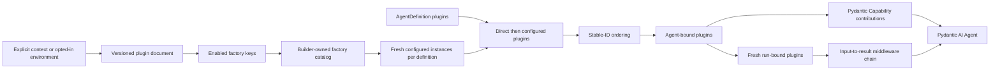

# Harness Plugin System

## Design Position

A Harness plugin is trusted, code-first Python middleware around the complete process-local Harness run. It can transform semantic input, observe or transform stream events, short-circuit execution, replace a complete result candidate, and contribute ordinary Pydantic AI `AbstractCapability[AgentContext]` instances at Agent construction.

Plugins always become concrete Python objects before Agent composition. A caller may supply them directly in `AgentDefinition.plugins`, or opt one `HarnessBuilder` into the Harness-owned plugin configuration boundary. That boundary reads a small versioned preferred YAML or supported JSON document, selects installed factory entry points, and appends freshly created plugin instances to every definition built by that builder. The Host need not understand plugin factories or perform this reconstruction itself.

Automatic configuration is disabled by default. Importing the package never reads environment variables or files, scans package metadata, imports a plugin target, or enables middleware. A builder with no explicit `HarnessBuildContext` inspects only the enable environment variable; it performs further loading only when that switch explicitly enables the feature. An explicit context bypasses ambient discovery entirely.

This narrow document is not a serialized Agent definition, general object compiler, arbitrary import mechanism, process-global registry, or Environment configuration language. The separately owned [Environment Provider catalog](../agent-environment-provider/01-provider-specs-and-catalog.md#catalog) and [Environment Run inputs](08-environment-integration.md#run-inputs) remain caller-controlled because Provider selection, current state, and fresh adapter construction require Host authority. Pydantic Capabilities remain the extension point inside the Agent loop; Harness plugins exist only for the wider semantic-input-to-complete-result boundary.



## Configuration Document

The Harness owns one strict versioned data document for optional plugin construction. YAML is the preferred human-authored file form; JSON is the exact machine-oriented equivalent:

```yaml
schema_version: "1"
plugins:
  - plugin_id: audit-1
    plugin_key: acme.audit
    enabled: true
    configuration:
      mode: metadata
```

| Field                     | Contract                                                                                                              |
| ------------------------- | --------------------------------------------------------------------------------------------------------------------- |
| `schema_version`          | Required exact string `"1"`; unsupported versions fail explicitly                                                     |
| `plugins`                 | Required ordered array with at most 128 entries                                                                       |
| `plugins[].plugin_id`     | Required unique bounded non-blank instance ID; it must equal the created plugin's `plugin_id`                         |
| `plugins[].plugin_key`    | Required bounded non-blank installed entry-point key; several instances may use the same key                          |
| `plugins[].enabled`       | Required boolean; a disabled entry is validated structurally but is neither selected, imported, nor created           |
| `plugins[].configuration` | Required finite JSON object copied into the factory context; package-owned code validates its plugin-specific meaning |

Unknown fields, non-finite numbers, non-JSON data values, duplicate plugin IDs, oversized input, excessive nesting, and unsupported versions fail before package discovery. The complete UTF-8 source and each programmatic data value are bounded to 1 MiB. IDs and keys are bounded to 200 characters. Configuration order is significant and becomes the configured-plugin tie-breaker after direct plugins.

This document deliberately contains no Python import target, artifact URL, credential, Agent definition, Capability, Environment provider mount definition, or Host lifecycle value. A Host may persist or generate this exact Harness-owned document, but it retains responsibility for artifact installation and trust. Factory-specific configuration schemas remain owned by each plugin package.

## Build Context and Source Resolution

```python
HARNESS_PLUGIN_CONFIG_ENABLED_ENV = "A13N_HARNESS_PLUGIN_CONFIG_ENABLED"
HARNESS_PLUGIN_CONFIG_JSON_ENV = "A13N_HARNESS_PLUGIN_CONFIG_JSON"
HARNESS_PLUGIN_CONFIG_FILE_ENV = (
    "A13N_HARNESS_PLUGIN_CONFIG_FILE"
)
DEFAULT_HARNESS_PLUGIN_CONFIG_FILE = "harness-plugins.yaml"


@dataclass(frozen=True, slots=True)
class HarnessPluginConfigurationEntry:
    plugin_id: str
    plugin_key: str
    enabled: bool
    configuration: Mapping[str, JsonValue]


@dataclass(frozen=True, slots=True)
class HarnessPluginConfiguration:
    schema_version: Literal["1"]
    plugins: tuple[HarnessPluginConfigurationEntry, ...]


@dataclass(frozen=True, slots=True)
class HarnessBuildContext:
    configured_plugins_enabled: bool = False
    plugin_configuration: HarnessPluginConfiguration | None = None
    extensions: Mapping[str, JsonValue] = {}

    @classmethod
    def from_configuration(
        cls,
        configuration: Mapping[str, JsonValue],
        *,
        extensions: Mapping[str, JsonValue] | None = None,
    ) -> HarnessBuildContext: ...

    @classmethod
    def from_json(
        cls,
        value: str | bytes,
        *,
        extensions: Mapping[str, JsonValue] | None = None,
    ) -> HarnessBuildContext: ...

    @classmethod
    def from_yaml(
        cls,
        value: str | bytes,
        *,
        extensions: Mapping[str, JsonValue] | None = None,
    ) -> HarnessBuildContext: ...

    @classmethod
    def from_file(
        cls,
        path: str | PathLike[str],
        *,
        extensions: Mapping[str, JsonValue] | None = None,
    ) -> HarnessBuildContext: ...

    @classmethod
    def from_environment(
        cls,
        *,
        enabled: bool | None = None,
        environ: Mapping[str, str] | None = None,
        extensions: Mapping[str, JsonValue] | None = None,
    ) -> HarnessBuildContext: ...
```

`extensions` is a detached, finite JSON object with bounded non-blank top-level namespace keys for a downstream embedding layer. For example, Foundation may pass `{"foundation": {...}}`. It is copied into every factory context, but it is non-authoritative: it cannot carry live clients, credentials, import targets, lifecycle handles, or arbitrary Python objects. Namespace meaning and compatibility belong to the producer and consuming plugin; the Harness only owns the bounded JSON envelope. Subclassing the context is not the extension mechanism.

An explicit `HarnessBuildContext` passed to `HarnessBuilder` is the authoritative source and causes no environment lookup. A call-site `configured_plugins_enabled` value may still override whether that explicit source is applied for the executable being created; `True` requires the context to contain a configuration, while `False` ignores its entries without metadata discovery. The class constructors select exactly one explicit programmatic mapping, inline JSON or restricted YAML value, or file. `from_environment(enabled=None)` behaves as follows:

1. When `enabled` is `True` or `False`, that trusted call-site override decides application without reading `A13N_HARNESS_PLUGIN_CONFIG_ENABLED`. This lets a Host keep the deployment default false while explicitly enabling one Agent construction path. `False` returns the disabled context without inspecting any configuration source.
2. When `enabled` is `None`, read `A13N_HARNESS_PLUGIN_CONFIG_ENABLED`. Missing or a recognized false value returns the disabled context without reading either configuration variable, resolving the current directory, opening a file, or scanning package metadata. A recognized true value enables loading; invalid boolean text fails explicitly.
3. If `A13N_HARNESS_PLUGIN_CONFIG_JSON` is present, parse it as strict inline JSON. It takes precedence even when the file variable is also present.
4. Otherwise, if `A13N_HARNESS_PLUGIN_CONFIG_FILE` is present, read the `.yaml`, `.yml`, or `.json` path according to its suffix.
5. Otherwise, read the preferred `harness-plugins.yaml` from the current working directory at call time.
6. If the selected source is absent, unreadable, malformed, unsupported, or oversized, fail closed. Enabling configuration never silently becomes an empty plugin set because a source is missing.

Boolean parsing is case-insensitive and accepts `1`, `true`, `yes`, and `on` as true and `0`, `false`, `no`, and `off` as false. Surrounding whitespace and every other value are invalid. YAML uses a restricted safe loader: it accepts exactly one mapping document and rejects aliases, anchors, merge keys, explicit tags, duplicate keys, custom objects, and values outside the finite JSON data model. Composition stops before object construction above 10,000 nodes, 64 document nesting levels, or 256 Ki characters in one scalar; these failures use `plugin_configuration_too_large`. TOML and unknown file suffixes are unsupported. Configuration and file boundaries suppress standard chaining of raw parser, I/O, metadata, import, and factory exceptions so ordinary traceback logging cannot render source content, credentials, raw exception text, or private paths. Configuration loading uses stable `PluginError` codes: `plugin_configuration_enablement_invalid`, `plugin_configuration_source_missing`, `plugin_configuration_read_failed`, `plugin_configuration_format_unsupported`, `plugin_configuration_invalid`, `plugin_configuration_version_unsupported`, `plugin_configuration_too_large`, and `plugin_configuration_plugin_id_duplicate`.

## Package Factory Catalog

A trusted distribution may register a no-argument Harness plugin factory class under `a13n_harness.plugins`:

```toml
[project.entry-points."a13n_harness.plugins"]
"acme.audit" = "acme_harness.plugin:AuditPluginFactory"
```

The entry-point name is the stable plugin factory key. It selects installed integration code; the configured `plugin_id` identifies one concrete instance.

```python
HARNESS_PLUGIN_ENTRY_POINT_GROUP = "a13n_harness.plugins"


@dataclass(frozen=True, slots=True)
class HarnessPluginFactoryReference:
    plugin_key: str
    import_target: str
    distribution_name: str | None
    distribution_version: str | None


@dataclass(frozen=True, slots=True)
class HarnessPluginFactoryRegistration:
    plugin_key: str
    class_module: str
    class_qualname: str
    import_target: str | None
    distribution_name: str | None
    distribution_version: str | None


@dataclass(frozen=True, slots=True)
class HarnessPluginFactoryContext:
    plugin_key: str
    plugin_id: str
    configuration: Mapping[str, JsonValue]
    extensions: Mapping[str, JsonValue]


class HarnessPluginFactory(ABC):
    @classmethod
    @abstractmethod
    def plugin_key(cls) -> str: ...

    @abstractmethod
    def create_plugin(
        self,
        context: HarnessPluginFactoryContext,
    ) -> AbstractHarnessPlugin: ...


class HarnessPluginFactoryCatalog(
    Mapping[str, HarnessPluginFactory]
):
    def create_plugin(
        self,
        context: HarnessPluginFactoryContext,
    ) -> AbstractHarnessPlugin: ...


def discover_harness_plugin_factory_references(
) -> tuple[HarnessPluginFactoryReference, ...]: ...


def build_harness_plugin_factory_catalog(
    *,
    plugin_keys: Iterable[str] = (),
    explicit_factories: Iterable[HarnessPluginFactory] = (),
) -> HarnessPluginFactoryCatalog: ...
```

The public reference, registration, discovery, and catalog-construction values remain the explicit API defined by [Public API and Packaging](14-public-api-and-packaging.md). Metadata discovery does not import target code. Catalog construction validates every requested key and explicit factory, preflights missing names, duplicates, and collisions before loading a target, imports only explicitly selected names, requires a concrete `HarnessPluginFactory` subclass with a no-argument constructor, instantiates it once, and requires its non-blank `plugin_key()` to equal the entry-point name. Explicit factories support embedding and tests without distribution metadata. The immutable catalog records class module and qualified name plus optional entry-point target, distribution, and version provenance. There is no global mutable registration.

Discovery and catalog construction evaluate the interpreter's current package-metadata search path on each call. A trusted Host may publish a complete newly installed distribution to a long-lived process, invalidate Python's import caches, and then discover it or construct a new enabled builder without restarting the process. An existing catalog or builder retains the factory selection made during its construction; later `build()` calls still invoke those retained factories to create fresh plugin instances. An existing executable retains its already constructed concrete plugin graph. The contract supports adding a previously unavailable distribution; it does not define module unloading, reloading, or in-place replacement after an import target has loaded.

Installed metadata is availability, not authorization. The explicit catalog API imports only caller-selected keys. Automatic Builder configuration selects only distinct keys referenced by enabled entries, in first-enabled-entry order. Disabled entries are not authorization and cannot cause target import. An Agent definition, API request, model value, state payload, plugin configuration object, or database row cannot provide an arbitrary `module:object` target.

`HarnessPluginFactoryCatalog.create_plugin()` validates and detaches the complete `HarnessPluginFactoryContext`, requires the context key to select that catalog factory, calls it exactly once, and requires an `AbstractHarnessPlugin` whose exact `plugin_id` equals the requested context ID. It does not bind, order, or globally register the result. Catalog failures use stable `PluginError` codes: `plugin_factory_key_invalid`, `plugin_factory_missing`, `plugin_factory_duplicate`, `plugin_factory_target_invalid`, `plugin_factory_load_failed`, `plugin_factory_context_invalid`, `plugin_factory_failed`, and `plugin_factory_result_invalid`. Safe details contain only bounded keys, IDs, and distribution fields, never configuration or extension values, object representations, credentials, raw exception text, or private installation paths. These catalog errors suppress standard chaining of the raw target, metadata, constructor, and factory exceptions; callers receive the stable stage code rather than a traceback path to untrusted content.

A factory owns its configuration semantics and must return a plugin suitable for ordinary Agent binding and concurrent executable use. Mutable per-Agent or per-run state still follows `for_agent()` and `for_run()`; package construction does not weaken those lifecycle requirements.

## Builder Application

`HarnessBuilder(build_context=None, configured_plugins_enabled=None)` calls `HarnessBuildContext.from_environment(enabled=configured_plugins_enabled)` once during synchronous builder construction. `None` follows the deployment switch; `True` or `False` is the trusted Host call-site override. When configuration is disabled it performs no other ambient work. When enabled, it resolves and validates the document, builds one immutable catalog from distinct enabled keys, and retains the context and catalog for that builder. `HarnessBuilder(build_context=<explicit>)` uses only that source; the optional application override replaces the context's apply state without consulting ambient sources. Enabling an explicit context with no configuration fails, while disabling one imports and creates nothing.

The decision is fixed for the resulting executable graph. `run()` and `stream()` do not expose a later plugin toggle: configured plugins may contribute Agent-bound Capabilities, tools, instructions, settings, or hooks, so bypassing only their outer middleware would be a partial and unsafe disable, while a previously disabled executable cannot acquire those contributions at run time. A Host that offers create-and-run or create-and-stream operations applies its per-operation override when it constructs the builder/executable and includes the resolved plugin context in any executable-cache identity.

For every root or nested `AgentDefinition` recursively built by the builder:

1. create a fresh concrete plugin for each enabled entry in document order, using a fresh detached `HarnessPluginFactoryContext`;
2. append those values after the definition's direct `plugins` tuple;
3. run the ordinary stable-ID validation, ordering, `for_agent()`, Capability contribution, and executable construction path.

A factory is therefore selected once per builder but invoked once per enabled entry per definition. Separate definitions never share the same factory-created plugin prototype. Direct plugins precede configured plugins only as the stable topological tie-breaker; explicit ordering constraints still determine the final middleware graph. An ID collision between direct and configured plugins fails through ordinary plugin validation. Any configuration, discovery, factory, or result failure aborts construction before the affected executable is returned.

Automatic configuration is builder-local, not definition-local. The same configured entries apply to root and nested definitions because one builder owns their process-local construction. A caller that needs a different plugin set constructs a different builder or supplies plugins directly. Environment Providers are not auto-applied: already constructed `Environment` adapters remain fresh Run inputs with Host-owned desired definitions, current state, lifecycle, authority, and reconciliation.

## Plugin Contract

```python
@dataclass(frozen=True, slots=True)
class PluginOrdering:
    position: Literal["outermost", "innermost"] | None = None
    wraps: tuple[str, ...] = ()
    wrapped_by: tuple[str, ...] = ()
    requires: tuple[str, ...] = ()


class AbstractHarnessPlugin(ABC):
    @property
    def plugin_id(self) -> str: ...

    def get_ordering(self) -> PluginOrdering: ...

    def for_agent(self) -> AbstractHarnessPlugin: ...

    async def for_run(
        self,
        context: AgentContext,
    ) -> AbstractHarnessPlugin: ...

    def get_capabilities(
        self,
    ) -> Sequence[AbstractCapability[AgentContext]]: ...

    def wrap_run(
        self,
        exchange: PluginRunExchange,
        call_next: PluginRunNext[Any],
    ) -> PluginRunResponse[Any]: ...
```

A stable non-blank `plugin_id` identifies one configured middleware instance. It is an ordering and lookup key, not authority. Several instances of the same concrete plugin type are allowed when their IDs differ.

`for_agent()` returns the reentrant instance owned by the executable. `for_run()` returns the instance used by one invocation. An immutable reentrant plugin may return itself; mutable or scoped behavior returns a fresh replacement. Each replacement must preserve the exact concrete type, ID, and effective ordering of its source. This prevents a run from changing the built graph while allowing normal internal state binding.

## Ordering

The Harness orders plugins once at build time:

1. Validate every value as `AbstractHarnessPlugin` and require unique non-blank IDs.
2. Validate `wraps`, `wrapped_by`, and `requires` references against the complete configured set.
3. Add outermost and innermost tier edges.
4. Add explicit wrapper edges; `requires` asserts presence without adding an edge.
5. Perform a stable topological sort using definition order as the tie-breaker.
6. Reject self references, unknown references, contradictions, and cycles.
7. Call `for_agent()` in final outer-to-inner order and validate every replacement.

Plugin ordering is independent from Pydantic `CapabilityOrdering`. Capability contributions enter Pydantic's ordinary composition and are ordered by Pydantic AI.

## Capability Contribution

Each Agent-bound plugin may contribute zero or more ordinary `AbstractCapability[AgentContext]` instances. The Harness validates the values and appends them after explicit `AgentDefinition.capabilities`, preserving outer-to-inner plugin order and per-plugin contribution order.

A contributed Capability that needs its run-bound plugin stores only the stable `plugin_id`. During its own Pydantic run binding it resolves the plugin through:

```python
ctx.deps.plugins.require(plugin_id, ExpectedPluginType)
```

It must not retain a mutable Agent-bound plugin prototype for concurrent use. A plugin contributes Agent-loop tools, Toolsets, guidance, settings, or hooks only through its ordinary Capability contribution; those values do not become hidden peer `AgentDefinition` inputs.

## Run Binding and BoundPluginContext

For each invocation the Harness creates one empty `BoundPluginContext`, places it on the fresh `AgentContext`, and sequentially calls plugin `for_run(context)` in final outer-to-inner order. Reads are unavailable during this phase, so no plugin can observe a partial mixture of Agent- and run-bound instances. After all replacements pass validation, the Harness atomically freezes the index.

```python
class BoundPluginContext:
    @property
    def ordered(self) -> tuple[AbstractHarnessPlugin, ...]: ...

    def get(
        self,
        plugin_id: str,
    ) -> AbstractHarnessPlugin | None: ...

    def require[PluginT: AbstractHarnessPlugin](
        self,
        plugin_id: str,
        expected_type: type[PluginT],
    ) -> PluginT: ...
```

Lookup checks both stable ID and expected public type. The context is not a service locator and contains no credentials, provider registry, cleanup callbacks, durable state, or stream control.

## Middleware Contract

```python
@dataclass(frozen=True, slots=True)
class PluginRunExchange:
    input: SemanticRunInput
    context: AgentContext

    def with_input(
        self,
        value: SemanticRunInput,
    ) -> PluginRunExchange: ...

    async def export_current_state(self) -> HarnessState: ...


class PluginRunNext[OutputT]:
    def __call__(
        self,
        exchange: PluginRunExchange,
    ) -> PluginRunResponse[OutputT]: ...


class PluginRunResponse[OutputT](
    AsyncIterator[HarnessEvent | HarnessRunResult[OutputT]]
):
    async def aclose(self) -> None: ...
```

`PluginRunNext` is one-shot. A plugin may call it at most once or short-circuit by returning its own response. `PluginRunResponse` has one consumer and an idempotent `aclose()`.

Input flows outer-to-inner. Events and the complete result candidate flow inner-to-outer. A plugin may:

- replace semantic input while preserving the trusted `AgentContext`;
- map or suppress non-terminal events;
- short-circuit before the Pydantic Agent starts;
- translate an explicitly handled error;
- replace the complete `HarnessRunResult` candidate.

Already emitted events cannot be retracted. At each response boundary, the Harness checks the `HarnessEvent` envelope, root or registered-child correlation, preserved child provenance and sequence, and a non-blank `event_kind` for events satisfying the open `AgentStreamEventProtocol`. It does not reconstruct or schema-validate trusted Pydantic AI or plugin-transformed Agent event payloads. Harness-owned `HarnessExtensionEvent` values are revalidated for their schema, redaction, finite-JSON, and payload-size invariants after plugin transformation. Complete result candidates remain subject to output typing, message suffix, state schema, run correlation, and result-combination validation before public terminal delivery.

## Trusted Result and State Composition

Plugins are trusted in-process code. A plugin may intentionally transfer, replace, remove, or synthesize a well-formed `HarnessState` as part of a complete result replacement. The Harness validates the result's public structure and state schema, but it does not prove where state bytes came from, require identity with the inner candidate, require use of `export_current_state()`, or require `state.message_history` to equal `result.all_messages()`.

`exchange.export_current_state()` is the convenience for obtaining the Harness-owned latest complete live boundary. It is not a provenance token or mandatory authorization path. A plugin that composes state directly owns the semantic correctness of that transfer under the trusted-plugin boundary.

`AgentContextState` remains the typed convenience for Capability-owned namespaces during normal execution. The Harness does not add cryptographic fingerprints, candidate allowlists, state-origin registries, or malicious-plugin defenses around trusted Python code.

## Input Placement

Plugin middleware starts after the run Environment is entered, the optional `RunInputFactory` has completed, semantic input is normalized, and fresh run plugins are bound. It runs before the inner Pydantic Agent invocation.

A plugin can inspect the actual semantic input and use trusted collaborators or `AgentContext.environment`. It cannot replace the `AgentContext`, Agent Identity, or entered Environment. The current code-first input contract is owned by [Input, Model, and Output Boundaries](16-input-model-and-output.md).

## Result and Cleanup Placement

The inner path yields ordinary Harness events followed by one result candidate. Each response boundary validates a candidate before an outer plugin can observe it, so a later outer failure retains the nearest valid inner outcome.

On normal completion, the Harness closes registered plugin responses from inner to outer and then closes remaining run resources before publishing `HarnessRunResultEvent`. Cleanup occurs in the task that entered the async scopes. External cancellation remains pending across cleanup even if cleanup code suppresses an injected `CancelledError`.

If middleware or cleanup fails after a valid candidate exists, `RunCleanupError.outcome` retains that nearest immutable candidate and no terminal event is published. If no candidate exists, the original error propagates after cleanup.

## State and Continuation

Plugins have no separate generic durable state system. A plugin may:

- contribute a Capability that uses a stable `AgentContextState` namespace;
- transform the complete `HarnessState` at the trusted result boundary;
- keep durable provider or Host state outside the Harness.

Run-bound plugin objects disappear at teardown. Process-local mutable state is never resumed by object identity.

## Trust Boundary

Imported plugin code executes with Harness process authority. Type checks, stable ordering, and result validation protect composition mistakes; they do not sandbox Python. A plugin can access process resources directly and can intentionally violate higher-level policy unless the deployment isolates that process.

Untrusted or separately governed behavior belongs behind a tool, Environment, model, or other feature-specific protocol. The Harness defines no universal remote-plugin RPC layer.

## Failure Semantics

| Failure                                            | Outcome                                                                    |
| -------------------------------------------------- | -------------------------------------------------------------------------- |
| Invalid enable value or missing enabled source     | Builder/context construction fails before metadata discovery               |
| Invalid, unsupported, or oversized configuration   | Builder/context construction fails before target import                    |
| Missing, duplicate, or invalid selected factory    | Catalog construction fails before Agent composition                        |
| Factory failure, invalid result, or mismatched ID  | Build fails before the affected executable is returned                     |
| Invalid plugin value, blank/duplicate ID           | Build fails                                                                |
| Unknown ordering reference or cycle                | Build fails deterministically                                              |
| Agent/run replacement changes type, ID, or order   | Build or run setup fails                                                   |
| Invalid Capability contribution                    | Build fails                                                                |
| Reused continuation or response iterator           | `PluginError`                                                              |
| Replaced trusted context or invalid semantic input | Inner path fails before Pydantic work                                      |
| Invalid event or result candidate                  | `PluginError`; nearest earlier valid candidate is retained when one exists |
| Middleware or cleanup failure after a candidate    | `RunCleanupError` retains the candidate and withholds terminal delivery    |

## Boundaries

| Concern                                                | Owner                                  |
| ------------------------------------------------------ | -------------------------------------- |
| Direct concrete plugin construction                    | Trusted embedding code or Host adapter |
| Versioned plugin configuration envelope and loading    | Harness                                |
| Context extensions and their namespaced meaning        | Producing Host and consuming plugin    |
| Selected package factory loading and result validation | Harness catalog and selecting caller   |
| Factory-specific configuration semantics               | Owning plugin package                  |
| Ordering, binding, middleware, and validation          | Harness                                |
| Agent-loop hooks and Capability lifecycle              | Pydantic AI                            |
| Configuration persistence and artifact trust/locks     | Host or embedding deployment           |
| Desired Environment mounts and provider lifecycle      | Host and owning Environment provider   |
| Durable completion and checkpoint selection            | Host                                   |

## Trade-offs

### Narrow Configuration vs. a Serialized Extension Framework

The Harness-owned document removes repetitive plugin loading logic from Hosts while keeping one intentionally small envelope: instance identity, selected installed key, enable state, and package-owned JSON. Direct objects and configured factories still end in the same concrete Python composition. Hosts may persist the document but still own artifact authorization and cannot treat plugin objects, factory classes, import targets, or Environment lifecycle values as wire data.

### Opt-in Ambient Loading vs. Implicit Behavior

An explicit enable switch makes file- and environment-based deployment convenient without making ordinary library use depend on ambient process state. This adds one synchronous I/O path to opted-in builder construction; disabled construction remains inert, and explicit contexts provide deterministic embedding and testing.

### Complete-result Freedom vs. Provenance Enforcement

Trusted plugins can implement caching, state migration, handoff, and policy transformations without artificial state-origin restrictions. This means state semantics are part of the plugin's trusted contract rather than something the Harness can prove structurally.
