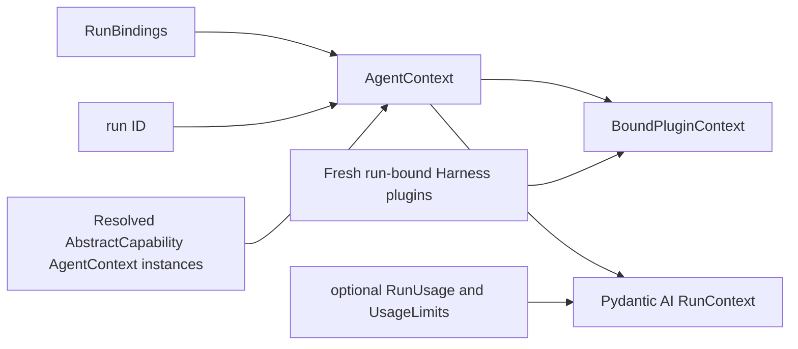
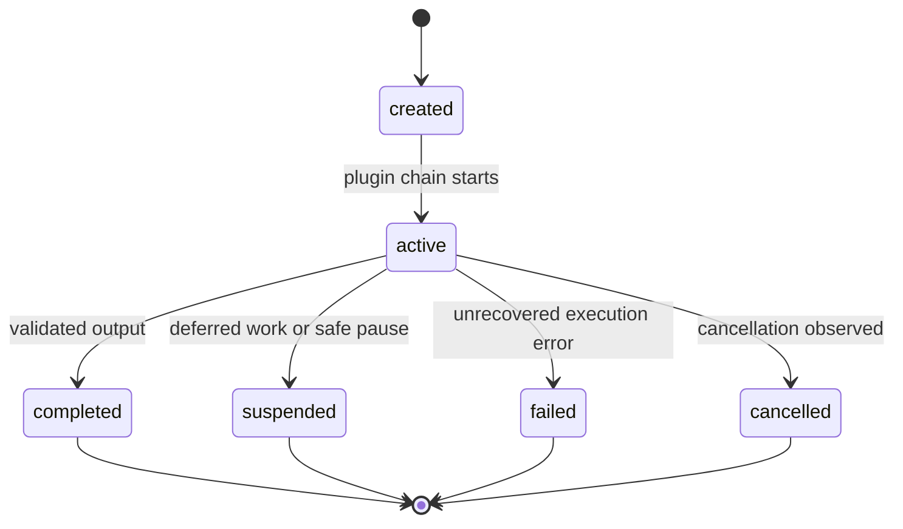
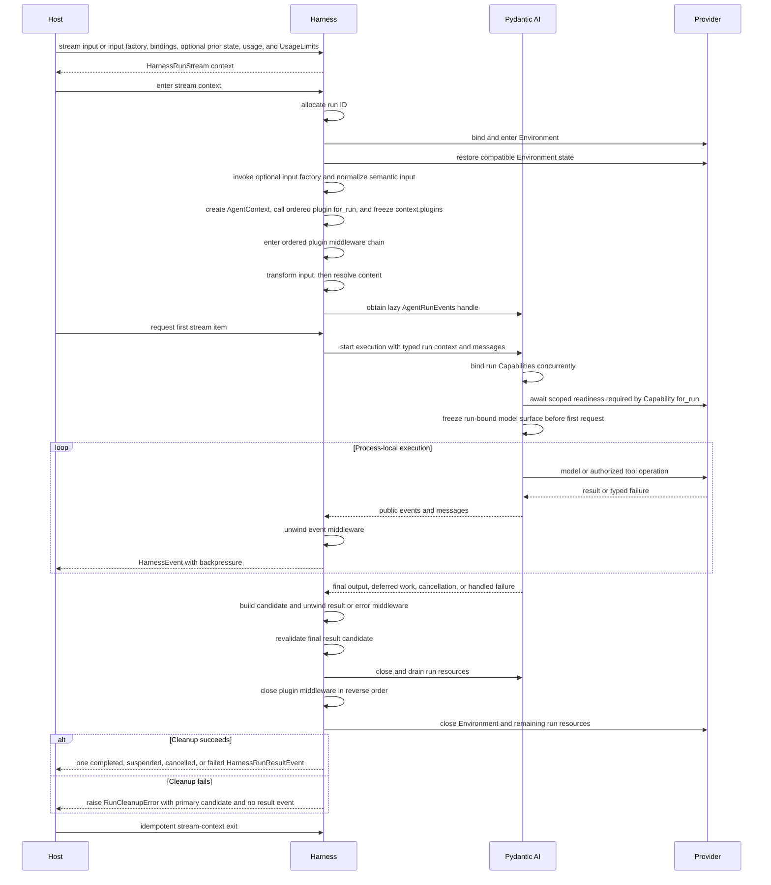

# Execution Context and Lifecycle

## Design Position

A harness run is one process-local ordered Harness plugin chain around at most one Pydantic AI Agent invocation. The normal inner path invokes the Agent exactly once; a valid plugin short-circuit invokes it zero times. Resume creates another run from exported `HarnessState`; durable execution identity, scheduling, recovery, and hosted lifecycle stay with the host.

Pydantic AI owns the model/tool loop, `RunContext`, `AgentRunEvents`, event iteration, enqueue behavior, cancellation, deferred-tool values, per-node Capability hooks, and message codecs. The harness wraps that native event handle as `HarnessRunStream`, its single-consumer observation and control facade, and contributes `HarnessRunResult` as the normalized terminal process-local outcome plus a high-cohesion `AgentContext` used as `RunContext` dependencies and as the center for run state and Capability interaction. The Harness also owns the first-class plugin lifecycle around that path: fresh run binding, one ordered `BoundPluginContext`, semantic-input middleware after optional `RunInputFactory` resolution, stream/result unwind, final validation, and cleanup before terminal delivery. Typed Environment readiness is awaited only by the input factory, Capability, or operation that requires it.

## Boundary

| Concern                                                            | Owner                                                      |
| ------------------------------------------------------------------ | ---------------------------------------------------------- |
| Model and tool loop, enqueue, cancellation, deferred values        | Pydantic AI                                                |
| Process-local plugin chain, run stream, `AgentContext`, and result | Harness                                                    |
| Agent instance and resolved-definition inputs                      | Trusted host                                               |
| Environment operations                                             | `BoundEnvironment` and its provider                        |
| Durable acceptance, attempts, leases, retries, and recovery        | Host                                                       |
| Continuation bytes                                                 | Harness defines `HarnessState`; host stores and selects it |

Host definition records, durable executions, attempts, queues, scheduler records, and lease types do not enter this model except as opaque correlation attached by the host.

## RunBindings and AgentContext

The public API accepts `RunBindings` from the trusted host. The harness combines them with run-local metadata and resolved capabilities to create one `AgentContext`, which becomes `RunContext[AgentContext].deps`.

[`Capability and Agent Context Model`](04-capability-model.md) owns the `AgentContext` fields and state API. The context derives `identity` from `instance.identity`; no second identity value can diverge from the instance binding.

`AgentInstanceContext` is the only Identity and lineage carrier. The complete `ResolvedAgentDefinition` is consumed while building the Pydantic Agent; executable definition types and instances do not enter `AgentContext`. A permitted `ClientToolRunBinding` is resolved during run assembly into native per-run external Toolsets and likewise does not become an `AgentContext` service or authority.

`AgentContextState` imports previous Capability state, accepts versioned state contributions, and exports every recoverable namespace alongside Pydantic AI `message_history`. Environment, working state, compaction, discovery, and inline delegation are state owners under their Capability IDs. Delegation State stores only bounded complete child snapshots and selectors; it contains no active task or partial parent tool batch. Host-managed asynchronous child lifecycle and delivery remain Host-owned. The state is part of `AgentContext`, not an independently injected persistence service.

Core event, Environment, state, and active-run binding behavior is installed by `AbstractCapability[AgentContext]` implementations. Separately, the Harness creates the same `AgentContext` used by the Agent, calls the ordered Agent-bound plugins' `for_run(context)` methods, freezes their replacements in `context.plugins`, and uses those same objects for the outer run middleware chain. Native enqueue, cancellation, usage, and limits remain on Pydantic `RunContext.enqueue()`, `RunContext.cancel()`, `AgentRunEvents.cancel()`, `RunContext.usage`, and `RunContext.usage_limits`. `metadata` is safe correlation and grants no authority. Long-lived credentials, provider clients, previous state, and host lifecycle objects are absent. Policy, credential, checkpoint, and other host integrations enter as Capabilities rather than generic services on the context.

Capability-to-capability interaction uses Pydantic AI's public run-bound `RunContext.capabilities` mapping. A plugin-contributed Capability reaches its owning run-bound plugin through the separate typed `AgentContext.plugins` ID-and-type lookup. A host retains the typed Capability instances and collaborators it constructs; `HarnessRunStream` exposes neither registry.

## Run Lifecycle

The lifecycle exposes only process-local states that affect callers.

Steering, provider dispatch, compaction, state export preparation, cleanup, and cancellation propagation are observations inside `active`, not additional public states. The host maps the final result into its own lifecycle.

## Execution Flow

## Preparation and Semantic Hooks

Entering `HarnessRunStream` establishes the trusted run binding after any Host adapter lifecycle attachment, binds and enters run-scoped Environment resources, validates the state envelope and messages, installs pending Capability entries, and restores backend-local Environment state. Environment entry establishes trusted identity, descriptors, operation families, routing, and a readiness path; it need not wait for every provider operation to finish provisioning. The Harness then invokes the optional `RunInputFactory` exactly once and normalizes its result or the immediate value into canonical semantic input. It creates the one `AgentContext`, calls each Agent-bound plugin's `for_run(context)` sequentially in final chain order, freezes `context.plugins` with those replacements, and enters the ordered plugin chain. Only after input middleware calls the inner path does the Harness authorize content references, map Pydantic input, and enter `Agent.run_stream_events()` to obtain an `AgentRunEvents` handle. A valid plugin short-circuit skips those inner steps entirely. Factory and resolution use restricted `RunPreparationContext` with the entered Environment and no pending Capability state. A factory that requires a ready operation calls `BoundEnvironment.ensure_ready()` explicitly. A failure closes all resources already entered and no Pydantic Agent run is started.

The upstream handle remains lazy: no Pydantic `RunContext`, model request, or tool call exists until first iteration. At first iteration, non-Environment stateful Capabilities validate their own pending entries before model or tool work. Pydantic calls sibling Capability `for_run()` methods concurrently. An Environment-dependent Capability can await a scoped readiness requirement directly and return an immutable replacement containing its run-frozen model surface; Pydantic re-extracts that surface before the first request. `for_run()` never waits for sibling Capability setup, and ordinary provider operations retain their own lazy readiness checks. This ordering lets pre-start cancellation delegate directly to `AgentRunEvents.cancel()` without a Harness cancellation token while preserving Environment-backed semantic input preparation.

Harness plugin middleware is not a per-node hook. It wraps the canonical semantic-input, event, error, and complete-result path and can contribute Capabilities for behavior inside the Agent loop. Per-node behavior is not exposed as arguments on `run()` or `stream()`; a Capability that needs exact boundaries implements Pydantic AI's public node hooks. First-party checkpoint, authority, safe-pause, context, and usage Capabilities translate those nodes into their own semantic collaborator calls, so a host storage or policy adapter does not inspect node classes. Model and tool event observation uses the event stream rather than pre-event and post-event callbacks.

## Steering, Safe Pause, and Cancellation

`HarnessRunStream` wraps the canonical plugin response whose inner execution, when reached, directly wraps `AgentRunEvents` returned by `Agent.run_stream_events()`. This preserves lazy Pydantic start, one public event consumer, live messages and usage, cancellation, and deterministic `aclose()` cleanup. Plugin event transforms use the same backpressured path and do not create another public stream, background event task, replay buffer, or control authority.

Steering is `HarnessRunStream.enqueue()` over Pydantic AI `RunContext.enqueue()`, not a separate Harness control path. Because `AgentRunEvents` exposes cancel but not enqueue, a run-specific `ActiveRunCapability` binds the live `RunContext` to a stream-owned run-local bridge only while the run is active; the bridge is invalid before the terminal outcome is exposed. The wrapper resolves and validates `RunInput`, then linearizes terminal revalidation and the synchronous native enqueue: terminal wins with `run_not_active`, while enqueue wins with an ID whose delivery remains separate. Pydantic AI owns its pending queue, priorities, drain boundaries, and `EnqueuedMessagesEvent`. The host owns durable acceptance, target selection, and deduplication. A Capability or tool steering its own run uses `RunContext.enqueue()` directly.

`HarnessRunStream.request_suspend()` sets the run-local bridge's idempotent safe-pause signal. Using the public `before_node_run` hook, `ActiveRunCapability` observes the signal only before executing a `ModelRequestNode` and is ordered before request-preparation hooks for that node. Pydantic does not reach this hook until the preceding node's complete `after_node_run` chain and any tool batch have finished. State export normally combines completed `RunContext.messages` with the public pending `ModelRequestNode.request`, preserving the initial input or completed tool returns without applying transient next-request preparation or starting the model request. Provider-suspended continuation is the explicit exception: when public history ends in `ModelResponse(state="suspended")` and the next public request has no parts, that request is a continuation placeholder and is not appended to the export view. This rule uses only public message and node fields and preserves the suspended response as the history tail. The Capability atomically commits that `HarnessState` and safe-suspend origin to the binding, then calls `RunContext.cancel()`. The resulting native `RunCancelled` becomes `status="suspended"` with `suspend_reason="host_pause"` only when that committed record is present.

A safe-suspend request received during a model response or tool-call batch waits for the entire batch, including inline children and parallel sibling tools, to finish. Inline child state can advance process-locally when that child returns, but the Harness does not export it as part of a resumable parent checkpoint while the parent batch remains incomplete. If Pydantic produces `End` instead of another `ModelRequestNode`, completion or deferred work wins and is not rewritten. No private exception, independent task cancellation, or persisted control state is involved. Pydantic deferred work produces `status="suspended"` with `suspend_reason="deferred"` and `DeferredToolRequests`, keeping the two reasons distinct while sharing the same new-run resume model. External client calls remain in `.calls`, approvals remain in `.approvals`, and neither retains a Python handler or task.

`HarnessRunStream.cancel()` delegates directly to `AgentRunEvents.cancel()`; authorization and durable command correlation remain host concerns. Native pre-start cancellation prevents the run from starting; active cancellation drains model, tool, and supported server-side work. Pre-start normalization has no bound context or exported state and snapshots the Harness-owned input accumulator. After start, the Harness observes `RunCancelled` without a committed safe-suspend record, exports the latest valid state from its complete messages, and emits the normalized `cancelled` result with terminal usage when the caller continues consuming. A Capability or tool cancels its own run with `RunContext.cancel()`. If native cancellation takes effect before safe-suspend commit it wins; after a terminal Harness result commits, later calls cannot rewrite it. External cancellation of the consumer task continues to raise normal async cancellation and takes precedence.

Neither native cancellation nor safe pause implies provider rollback after dispatch. When no authoritative provider receipt exists, the operation remains unknown and a later run relies on provider reconciliation.

## State Boundary

[`Harness State and Resume`](10-snapshot-and-resume.md) owns the sole `HarnessState` schema. It contains Pydantic AI `message_history` plus versioned values collected by `AgentContext.state` from Capabilities that carry resumable state. Environment state is included through the Environment Capability, while topology, credentials, clients, live objects, bearer handles, sockets, and live async tasks are excluded.

State export occurs only at a consistent semantic boundary. A suspended result carries the exported state needed for a later run; the host decides whether that value becomes durable and whether it is later selected.

On resume, the host supplies the selected state separately from `RunBindings`. The host selects the definition and any exact frozen client-tool surface to use, while the new run validates the message codec, configured capability state entries, and deferred result correlation before executing model or tool work.

## Result and Cleanup

[`Public API and Packaging`](14-public-api-and-packaging.md) owns `HarnessRunStream`, `HarnessRunResultEvent`, and `HarnessRunResult`. The result's run correlation, terminal status, Pydantic output or deferred values, terminal usage snapshot, safe failure, and optional continuation state describe this process-local outcome. Usage normally covers only this run; explicit inline sharing also includes its complete inline descendant tree. Host-managed asynchronous children and later resumed runs remain separate Host-aggregated records.

Cleanup follows one global reverse-acquisition order. The Harness first cancels, closes, and drains the innermost `AgentRunEvents`, Pydantic run resources, model streams, Capability and Toolset context managers, and inline child tasks when that inner path exists. It then calls idempotent `PluginRunResponse.aclose()` from inner to outer, followed by input-factory or resolver resources, temporary credential leases, the entered `EnvironmentRunBinding`, and remaining outer resources. A short-circuit has no inner Pydantic layer and starts at plugin-response cleanup. Leaving the stream context before its terminal item uses native quiet cancellation and drain before the remaining cleanup.

For a normal consumed outcome, the inner path freezes output, state, usage, and failure data as a primary result candidate. Plugin middleware can replace the complete candidate during reverse unwind, after which the Harness revalidates status combinations, state provenance, the `HarnessState` envelope and message codec, run correlation, and limits. A fresh plugin state snapshot comes through `PluginRunExchange.export_current_state()`, which supplies the Harness-owned complete message view without exposing mutable history. Capability-private entry bytes can change only through their owning typed state path before a fresh context export; the Harness does not duplicate those codecs. It then completes plugin and all other run-scoped cleanup before publishing `HarnessRunResultEvent` or returning from `run()`. Cleanup success makes terminal delivery final and later context exit idempotent. Plugin or other cleanup failure raises `RunCleanupError` instead of publishing the result event; the exception retains the last immutable valid primary candidate when one exists plus bounded cleanup uncertainty. It neither rewrites a validated output nor lets the host mistake the run for a clean terminal boundary.

## Trade-offs

- A class-based run stream gives embedded and hosted callers one API with natural backpressure and explicit cleanup without reproducing Pydantic graph state.
- A new run on resume rebuilds providers and capabilities but keeps state portable.
- Four public terminal states leave detailed retry, timeout, and interruption policy to the host that owns it.

## Invariants

01. One `HarnessRunStream` represents the observation and active-run control facade of one process-local Pydantic AI execution.
02. The stream has one consumer and starts on first iteration; each Harness-handled outcome whose run-scoped teardown succeeds ends with exactly one result event, while early exit, cleanup failure, or an unhandled exception does not synthesize one.
03. `AgentContext` is the single Pydantic AI dependency and run-state center; its `plugins` field indexes the same fresh bound instances used by the outer middleware chain.
04. Resume creates a new run from host-selected `HarnessState` and fresh bindings.
05. Environment binding does not imply every operation is provisioned; scoped model-surface readiness completes before the dependent first request, while ordinary operation readiness remains lazy.
06. Steering and cancellation delegate to `RunContext.enqueue()` and `AgentRunEvents.cancel()`; the Harness owns no duplicate queue, background event task, or cancellation token.
07. Safe pause waits for a complete parent boundary, commits state, and uses `RunContext.cancel()` plus an internal origin marker to produce a suspended result; resume creates a new run.
08. Cancellation does not imply provider rollback.
09. The plugin chain cannot retract emitted events, bypass final result/state validation, or publish a terminal event before teardown succeeds.
10. Public contracts contain no Pydantic AI private graph state.
