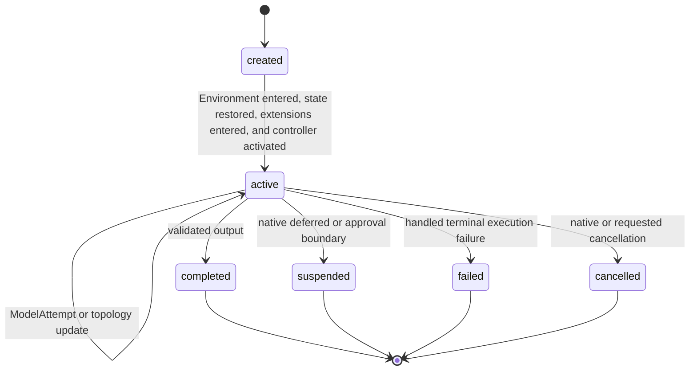
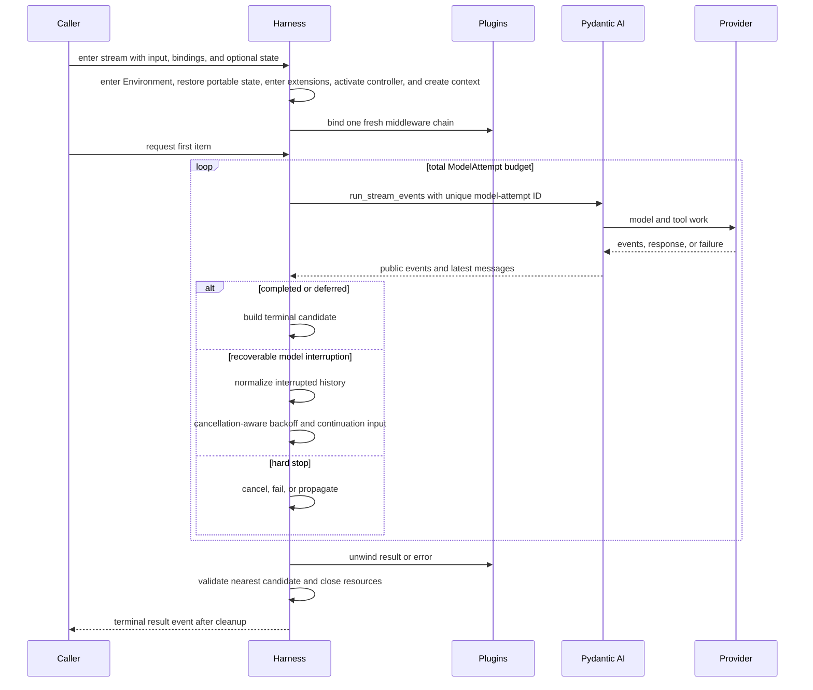

# Execution Context and Lifecycle

## Design Position

One Harness run is one process-local logical invocation of an `ExecutableAgent`. It enters one Environment aggregate and activates its paired Host-retained topology controller, creates one outer `AgentContext`, binds one plugin chain, owns one shared `RunUsage` accumulator, and produces at most one terminal Harness result.

A logical Harness Run may contain several sequential `ModelAttempt` values when `ModelRecoveryPolicy` is enabled. A `ModelAttempt` is one Pydantic AI Agent-loop invocation used for bounded semantic recovery. These values are an internal recovery mechanism, not separate Harness runs, Foundation `ExecutionAttempt` values, plugin invocations, contexts, Environments, controller lifetimes, or usage ledgers. Each `ModelAttempt` receives a unique model-attempt ID passed through Pydantic AI's upstream `run_id` parameter, while the public Harness `run_id` remains stable.

Pydantic AI owns each inner Agent loop, model/tool execution, native deferred and approval boundaries, output validation retries, messages, and provider-suspended continuation. The Harness owns outer preparation, plugin middleware, bounded `ModelAttempt` coordination, terminal normalization, and cleanup.

## Boundary

| Concern                                                     | Owner                                      |
| ----------------------------------------------------------- | ------------------------------------------ |
| Model/tool loop and native deferred values                  | Pydantic AI                                |
| Provider transport retry                                    | Provider client and Pydantic `RetryConfig` |
| Narrow provider-history repair                              | `SelfHealingModel`                         |
| Logical Run and `ModelAttempt` recovery                     | Harness                                    |
| Durable execution, worker `ExecutionAttempt`, lease, replay | Host                                       |
| Continuation persistence and selection                      | Host                                       |

A Host may map one logical Harness run to one durable worker `ExecutionAttempt`. It does not create a new durable `ExecutionAttempt` for every internal `ModelAttempt`.

## RunBindings and AgentContext

```python
@dataclass(frozen=True, slots=True)
class RunBindings:
    instance: AgentInstanceContext
    environment: EnvironmentRunBinding
    model_resolver: RunModelResolver | None = None
    capabilities: tuple[
        AbstractCapability[AgentContext], ...
    ] = ()
    metadata: Mapping[str, JsonValue] = {}
    model_context: ModelContextRunBinding | None = None
```

The trusted caller supplies fresh bindings for every logical run. The Harness:

01. allocates the public Harness `run_id`;
02. binds and enters `EnvironmentRunBinding` with that ID and Agent instance, publishing the initial topology while its paired controller remains non-active;
03. restores present portable Environment state into that fixed set of already selected compatible bindings;
04. enters ordered Environment run extensions only after restore succeeds or no state was supplied;
05. activates the paired controller only after every extension enters successfully;
06. invokes an optional `RunInputFactory` exactly once;
07. normalizes semantic input;
08. generates a `thread_id` for new State or restores it from the selected `HarnessState`;
09. creates one `AgentContext` with that read-only ID, imported `AgentContextState`, the entered Environment, optional model and model-context bindings, immutable metadata, and executable-owned child collection;
10. binds fresh run plugin replacements and freezes `BoundPluginContext`;
11. creates the outer plugin response.

The same context and entered Environment aggregate are reused by every internal `ModelAttempt`. Current Identity, Environment facade, controller lifetime, plugins, Capability-state coordinator, model resolver, model-context binding, and metadata therefore remain stable across recovery. The Host can apply topology changes during input preparation, an active attempt, tool work, or recovery backoff; publication changes immutable routing snapshots without replacing the facade or context. `RunBindings.capabilities` are passed to every `ModelAttempt` and follow upstream per-run Capability binding semantics.

The logical Run receives one `run_id`, and each internal `ModelAttempt` receives a transient model-attempt ID, but they do not define the provider model session or prompt-cache scope. All attempts read the same State-owned `AgentContext.thread_id`. A later continuation creates a new Harness run and fresh bindings while restoring that ID from the selected State; a new root or child State and an explicit `HarnessState.fork()` use distinct IDs. No `RunBindings`, metadata, or invocation argument can override it. [Input, Model, and Output Boundaries](16-input-model-and-output.md#thread-affinity) owns the provider mapping contract.

`RunBindings.local()` creates a process-local Agent instance, uses a zero-binding no-operation Environment aggregate when none is supplied, and accepts the same optional model resolver, model-context binding, Capabilities, and metadata. It does not create a model registry or hidden provider configuration.

## Logical Lifecycle



The public states describe the logical run. Internal attempt count, backoff, provider request retries, and self-healing replay are not additional lifecycle states. Bounded `ModelRequestNode` observations expose request-boundary progress without adding logical-run or provider-transport states; [`Events, Observability, and Usage`](12-events-observability-and-usage.md#first-party-event-contracts) owns that event contract.

## Execution Flow



The stream is lazy: entering it performs preparation but no model or tool work. First iteration drives the plugin response and, if middleware reaches the inner path, starts the first `ModelAttempt`. A plugin short-circuit starts no `ModelAttempt`.

## Model Attempt Recovery

`ModelRecoveryPolicy` is disabled by default. When enabled, `max_attempts` is the total number of `ModelAttempt` values, including the first one. Its upper bound defaults to five. The policy owns:

- the total attempt budget;
- a fixed continuation input or sync/async prompt factory;
- full-jitter exponential backoff bounded by configured initial and maximum delays.

On a recoverable model interruption, the Harness:

1. captures the latest complete public Pydantic message view;
2. normalizes only an explicitly interrupted terminal tool-call boundary;
3. leaves previously emitted Harness events visible because they cannot be retracted;
4. waits using cancellation-aware backoff;
5. builds the next semantic input;
6. starts another Pydantic run with the normalized history, same outer context and bindings, same shared usage accumulator, and a fresh model-attempt ID.

The default continuation text says that the previous stream ended before completion, asks the model to continue from available history without repeating completed work, and warns that a side-effecting tool may have partially or fully completed even when no result was recorded.

A tool call missing a result at an explicitly interrupted boundary receives a failed `ToolReturnPart` stating:

> No tool result was recorded because execution was interrupted. The operation may have partially or fully completed. Check the current state before deciding whether to retry it.

This preserves a valid conversation shape without claiming rollback, non-execution, or exactly-once behavior.

Recovery is limited to model-boundary failures. It does not restart after:

- explicit or external cancellation;
- `UsageLimitExceeded`;
- exhausted Pydantic output-validation retries;
- tool execution failure;
- Harness, plugin, state, Environment, or input failure;
- native deferred external-tool or approval output;
- normal provider-suspended continuation.

Provider transport retries remain below this layer. `SelfHealingModel` may replay one request after an exact history repair before the `ModelAttempt` recovery loop observes the failure. These budgets are independent and are not multiplied into a second unbounded retry framework.

When the `ModelAttempt` budget is exhausted, the logical run returns `status="failed"` with `failure.code="model_recovery_exhausted"`. When recovery is disabled, recognized Pydantic execution failure returns `failure.code="agent_run_failed"`.

## Native Deferred and Provider Continuation

A Pydantic result whose output is `DeferredToolRequests` ends the logical run with:

- `status="suspended"`;
- `suspend_reason="deferred"`;
- the native deferred value;
- complete current `HarnessState` and usage.

External calls and approval requests retain their upstream distinct maps. The Harness does not execute them, convert one kind into the other, or start another `ModelAttempt`.

Provider-suspended continuation remains native Pydantic message behavior. The Harness preserves public message history and does not create a route-pin schema, duplicate provider job state, or reinterpret suspension as stream recovery. A later logical run receives fresh bindings and the Host-selected prior `HarnessState`; the selected model integration is responsible for any provider-specific ability to continue those public messages.

## Cancellation

`HarnessRunStream.cancel()` is idempotent. It records cancellation for pre-start and backoff phases and delegates to the active `AgentRunEvents.cancel()` when a `ModelAttempt` exists.

Cancellation fences semantic recovery:

- pre-start cancellation prevents model work;
- cancellation during an attempt uses native Pydantic cancellation;
- cancellation interrupts recovery backoff immediately;
- cancellation observed after a recoverable failure prevents the next attempt;
- calls after close or terminal delivery are no-ops.

A normalized cancelled result uses the latest complete messages and usage available. External cancellation of the consumer task remains `asyncio.CancelledError`; it is not translated into a normal result and cannot be suppressed by cleanup.

Cancellation does not prove provider rollback. Any dispatched side effect without authoritative completion evidence remains unknown.

## State Boundary

`HarnessState` combines its stable `thread_id`, the latest complete Pydantic message view, a detached snapshot of `AgentContextState`, and optional portable Environment state. `AgentContext.export_state()` preserves the context's ID. The outer context, Environment aggregate, and state coordinator remain shared across internal `ModelAttempt` values. The previous state is copied when the stream is created, so caller mutation cannot change an active run.

`export_state()` is valid only while the stream context is active. Before a `ModelAttempt` starts it returns imported messages plus current Capability and Environment snapshots. During execution it returns the latest complete public message view and an Environment export linearized with topology publication; partial token deltas are not reconstructed into synthetic messages.

The detailed state schema and interrupted-history rules are owned by [Harness State and Resume](10-snapshot-and-resume.md).

## Result and Cleanup

The inner path produces one `HarnessRunResult` candidate. Plugin middleware can replace it under the trusted-plugin contract. The Harness validates candidates at every response boundary so the nearest valid inner outcome remains available if an outer layer later fails.

The Harness establishes the logical run's terminal fence before cleanup. A topology apply that linearizes after that fence is rejected even though provider scopes have not all closed yet. Cleanup then follows reverse acquisition order and stays in the task that entered the async scopes:

1. close registered plugin responses from inner to outer;
2. cancel or drain supervised Environment preparation and maintenance work;
3. drain operation leases, retire provider bindings, close the Environment, and permanently close its controller;
4. close remaining outer resources and preserve any pending external task cancellation;
5. publish the terminal result event only when cleanup succeeds.

Every registered response is closed at most once. Cleanup continues after an individual close failure and collects secondary causes. A plugin or cleanup failure after a valid candidate raises `RunCleanupError` with that candidate and no terminal event. External cancellation takes precedence and receives cleanup failures as notes.

## Invariants

01. One public Harness `run_id`, context, Environment aggregate/controller pair, plugin graph, and usage accumulator span the complete logical run.
02. Every internal `ModelAttempt` has a unique upstream run ID.
03. The State-owned Thread ID is stable across continuation and read-only in `AgentContext`; Harness IDs, model-attempt IDs, Host bindings, and metadata cannot override it.
04. Recovery never creates a new Host execution fact or rebinds current authority; dynamic topology uses the existing Host-retained controller.
05. Events already delivered by an earlier attempt remain observations and are never retracted.
06. Explicit cancellation, usage limits, output retry exhaustion, tool failures, and deferred/HITL boundaries stop semantic recovery.
07. Interrupted tool history records uncertainty rather than exactly-once claims.
08. A terminal event is delivered only after successful cleanup.
09. External async cancellation cannot be converted into success or suppressed by cleanup.
10. Environment topology mutation is accepted only before the logical terminal fence and never depends on a Pydantic Capability being present.

## Trade-offs

### One Logical Run with Several ModelAttempts

Keeping recovery inside the existing outer context preserves plugin and Environment continuity and one usage budget. It means event consumers can observe activity from an attempt that later restarts, so terminal state rather than event absence determines completion.

### Bounded Recovery vs. General Workflow Replay

The Harness repairs narrow model interruption only. Durable replay, side-effect reconciliation, and worker recovery remain Host/provider concerns, preventing a local retry mechanism from becoming an orchestration engine.
