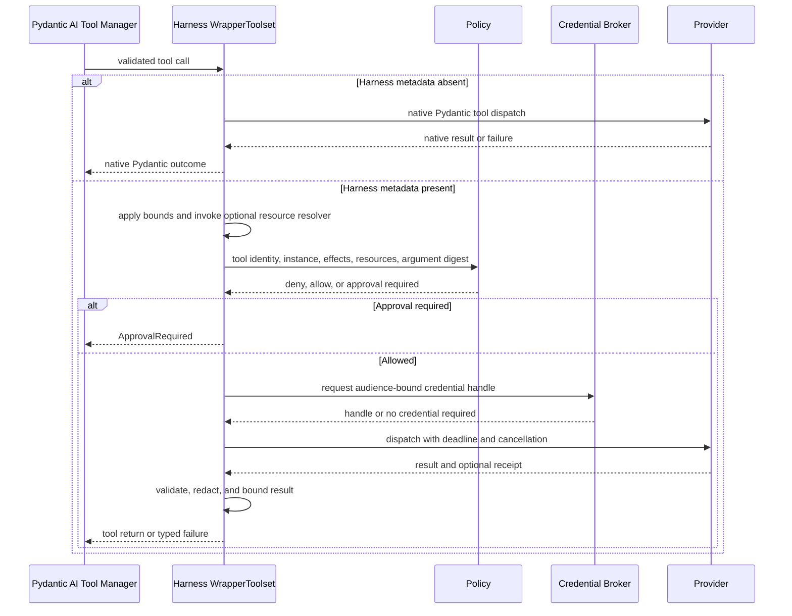

# Tool Execution

## Design Position

Pydantic AI owns function-tool schema validation, Toolset composition, the Tool Manager, native external and approval deferral, and result integration. Its public deferred contract validates message-level call identity and completeness, but it does not validate `ExternalToolset` arguments against the declaration's JSON Schema, preserve request categories in message history, authenticate results, or prove exact remounted surface identity. Native Pydantic function tools and Toolsets run directly without adopting a Harness base class or metadata schema. Function tools that opt into Harness-managed identity, authorization, credentials, side-effect, retry, and result-safety behavior attach `HarnessToolMetadata`; one Harness-owned outer `WrapperToolset` recognizes that metadata and performs the additional preparation and dispatch checks.

Client-side tools use Pydantic AI `ToolDefinition`, `ExternalToolset`, `DeferredToolRequests.calls`, and `DeferredToolResults.calls` directly. They are model-visible schemas whose implementation and authority remain outside the Agent process. They do not pass through the function-tool invocation pipeline, execute through `agent-envd`, or reuse approval semantics.

The function-tool wrapper is an Agent invocation boundary, not Python isolation. An unannotated native function tool is treated like other trusted in-process plugin code: it keeps Pydantic AI semantics but is outside Harness-managed authorization and side-effect guarantees. Installing or supplying that code grants process authority, whether or not it is model-visible.

## Boundary

| Concern                                                            | Owner                                                    |
| ------------------------------------------------------------------ | -------------------------------------------------------- |
| Function-tool definition/validation, tool manager, deferred values | Pydantic AI                                              |
| Optional Harness tool metadata and managed invocation wrapper      | Harness                                                  |
| Agent policy and credential decisions for managed tools            | Harness boundary plus fresh `InvocationPolicyCapability` |
| Remote operation and side-effect evidence                          | Tool provider                                            |
| Grant signing and authenticated transport                          | Host security or provider adapter                        |
| Direct I/O by trusted Python plugins                               | Plugin process trust boundary                            |
| Client-side tool declaration and external deferral                 | Client Tools Capability and Pydantic AI                  |
| Client-side execution, authorization, and result production        | External executor or Foundation Client                   |
| Durable client-call waiting, delivery, and feedback correlation    | Host                                                     |

## Tool Metadata

```python
type ToolEffect = Literal[
    "read",
    "write",
    "delete",
    "execute",
    "external_communication",
]

type IdempotencySemantics = Literal[
    "none", "read_only", "provider_key"
]


class CanonicalResource(BaseModel):
    namespace: str
    kind: str
    identifier: str


class ToolOutputPolicy(BaseModel):
    model_config = ConfigDict(frozen=True)

    max_inline_bytes: int
    max_output_bytes: int
    overflow: Literal[
        "fail", "truncate", "environment_reference"
    ] = "environment_reference"
    redact: bool = True


@runtime_checkable
class ToolResourceResolver(Protocol):
    async def __call__(
        self,
        arguments: Mapping[str, object],
        *,
        context: AgentContext,
    ) -> tuple[CanonicalResource, ...]: ...


@dataclass(frozen=True)
class HarnessToolMetadata:
    tool_id: str
    effects: frozenset[ToolEffect]
    credential_audiences: tuple[str, ...]
    idempotency: IdempotencySemantics
    output_policy: ToolOutputPolicy
    resource_resolver: ToolResourceResolver | None = None
```

The value is stored under a reserved key in Pydantic AI `ToolDefinition.metadata`; there is no parallel tool binding object. Pydantic fields retain ownership of name, schema, kind, strictness, timeout, sequential execution, deferred loading, and the optional runtime `toolset_id`. `tool_id` is the stable policy identity before model-visible renaming or prefixing. It is unique within one assembled run: a second function-tool definition with the same ID fails before either definition enters a model request, even when visible names differ. Intentional aliases therefore use distinct policy IDs and can share a host-owned implementation reference outside this contract.

`ToolEffect` is a small conservative policy hint, not an execution result or authorization grant. `read` observes state; `write` creates or changes state; `delete` removes state; `execute` starts code or a process; and `external_communication` sends data or a message outside the selected Environment. A tool declares every applicable value, so a shell command commonly declares `execute` plus `write`, and an HTTP-post tool commonly declares `external_communication` plus `write`. The actual provider receipt remains the evidence of what occurred. The former `create` and `update` distinction is intentionally collapsed because generic policy cannot classify upsert, patch, append, and replacement consistently before provider resolution.

`CanonicalResource` compares by the exact `(namespace, kind, identifier)` tuple after provider-aware resolution and contains no credential or display-only alias. `IdempotencySemantics` distinguishes no replay guarantee, non-mutating replay, and mutation replay under the same provider key. `ToolOutputPolicy` defines per-tool inline and total retained byte bounds, explicit overflow behavior, and whether the managed redaction pass is required. It is frozen, and Toolset preparation defensively normalizes metadata so a caller cannot mutate nested policy after validation. `max_inline_bytes` must be positive and no greater than `max_output_bytes`; both are narrowed by finite Harness hard ceilings that cannot be disabled by tool metadata or Host configuration. Positive bounds and non-empty identity/resource fields are validated at Toolset preparation. Harness metadata supplies only semantics absent upstream and grants no authority. The metadata and optional resolver are trusted process objects rather than durable definition state; the resolver receives the same schema-validated, type-converted argument mapping that Pydantic will dispatch plus trusted `AgentContext`, not credentials or raw model text.

`HarnessTool` is an optional thin subclass of Pydantic AI `Tool[AgentContext]` that attaches complete Harness metadata for first-party or policy-managed tools. Using that subclass is not required: any Toolset that places a structurally valid `HarnessToolMetadata` instance or mapping under the reserved key participates through duck typing. The Harness does not infer identity, effects, credentials, resources, or idempotency from function names, Python annotations, JSON schemas, or module origin. A reserved key with an invalid or incomplete value fails toolset assembly instead of silently downgrading the tool to unmanaged dispatch.

An ordinary function-tool definition without the reserved metadata remains callable and is not assigned guessed metadata. When `resource_resolver` is absent, managed authorization is explicitly tool- and action-level and `resources` is empty; provider-specific resource enforcement still applies. The current run's `InvocationPolicyCapability` can select a strict profile that rejects unannotated model-visible function tools. Static, dynamic, and deferred definitions are checked at their run-time Toolset preparation boundary before they can enter a model request; strictness is not a hidden builder option or immutable executable field. This is an explicit run policy rather than the base behavior. Availability, tags, and instruction helpers do not define another tool lifecycle.

The Harness always installs exactly one code-owned `InvocationAuthorizationCapability`. Its `get_wrapper_toolset()` contribution is ordered outermost around Pydantic's complete assembled non-output Toolset, after per-step preparation; Host code cannot replace its preparation or dispatch algorithm. It declares `CapabilityOrdering(position="outermost", wraps=(AbstractCapability,))`, so it sorts before AgentSpec, definition, plugin, run, instrumentation, and other same-tier Capabilities regardless of contribution order. An incompatible Capability that attempts to wrap this boundary creates an ordering cycle and fails run setup before tool exposure rather than weakening the boundary. The wrapper therefore sees function, unapproved, and external definitions, branches on `ToolDefinition.kind`, and never intercepts output or provider-native tools. It normalizes managed function metadata, enforces final client-tool names, and delegates ordinary external deferral to Pydantic without calling an external function body.

Current managed authority enters through exactly one fresh `InvocationPolicyCapability` in `RunBindings.capabilities`; feature-specific setup and dispatch require its documented public type and stable Capability ID and reject incompatible values before model exposure. The policy Capability can retain a typed evaluator, approval broker, credential broker, and result-safety collaborator, but those grant nothing without the current run's Identity and invocation context. When no policy provider is supplied, managed metadata-aware tools are denied while unmanaged native tools retain their ordinary trusted semantics. An embedded caller can explicitly select `LocalBoundEnvironmentPolicyCapability` for allowed managed Environment operations within the already supplied binding ceilings. No class-free role registry, serialized component bundle, or model-authored ID can create this authority.

Pydantic output tools remain part of output validation, not general side-effect dispatch, and provider-native server-side tools remain model/provider configuration. A deployment that needs Harness invocation policy for a provider-native operation exposes a metadata-aware function-tool adapter instead of pretending the function wrapper intercepts provider-internal execution.

Pydantic Toolset composition owns collision handling and final model-visible names. Dynamic discovery changes visibility, not registration or authorization. First-party Environment and remote-provider tools attach Harness metadata because the platform claims identity and policy enforcement for those surfaces.

## Client-Side External Tools

Client-side tools are declared by a concrete first-party `ClientToolsCapability` in `AgentDefinition.capabilities`. It is a code-first Harness Capability rather than a custom `AgentSpec.capabilities` serialization type, so the Harness needs no custom Capability registry or class-name resolution. The Capability's portable argument model is conceptually:

```python
class ClientToolDefinition(BaseModel):
    name: str
    description: str
    parameters_json_schema: Mapping[str, JsonValue]
    instruction: str | None = None
    metadata: Mapping[str, JsonValue] = Field(default_factory=dict)


class ClientToolsetDefinition(BaseModel):
    toolset_id: str
    tools: tuple[ClientToolDefinition, ...]


class ClientToolsSpec(BaseModel):
    default_toolsets: tuple[ClientToolsetDefinition, ...] = ()
    allow_run_override: bool = False


@dataclass(frozen=True)
class ClientToolsRunCapability(AbstractCapability[AgentContext]):
    toolsets: tuple[ClientToolsetDefinition, ...]
```

`ClientToolsRunCapability` is a typed fresh run attachment carried in `RunBindings.capabilities`; it contributes no independent tools or authority. The definition-selected Client Tools Capability resolves exactly zero or one instance by its stable Capability ID and expected public type, applies the replacement policy below, and contributes the resulting native Toolsets. This uses Pydantic's finalized run Capability mapping rather than adding a feature field or class-free role registry to `RunBindings`.

The declaration codec is not a second executable Toolset API. For each run, the Capability converts each effective definition one-to-one into an upstream `ToolDefinition` and groups it in an upstream `ExternalToolset(id=toolset_id)`. Optional instructions become bounded native Pydantic instruction parts. The declared name is the required final model-visible name; the outer Harness wrapper rejects another wrapper's attempted prefix or rename of a marked client definition instead of silently changing Host correlation.

Toolset IDs and model-visible names are unique in the effective client surface. The Harness validates bounded JSON Schema objects with `type="object"`, while upstream `ExternalToolset` deliberately uses an unconstrained local validator and treats that schema as model-facing guidance. Descriptions, instructions, and metadata are bounded JSON-safe content. Final collision detection remains Pydantic-owned across the complete assembled surface, including native, Capability, MCP, Environment, external, discovered, and output tools. Client metadata is non-authoritative public data. It cannot contain a credential, invocation grant, policy claim, server-only correlation value, or reserved `HarnessToolMetadata`; external tools never masquerade as Harness-managed function tools.

For each run, `ClientToolsRunCapability` has deterministic whole-list semantics:

| Definition and run attachment                      | Effective client surface                                                        |
| -------------------------------------------------- | ------------------------------------------------------------------------------- |
| Client Tools Capability absent; attachment absent  | No client tools                                                                 |
| Client Tools Capability absent; attachment present | Run setup fails                                                                 |
| Capability present; attachment absent              | `default_toolsets`                                                              |
| Attachment present; `allow_run_override=false`     | Run setup fails                                                                 |
| Attachment present; `allow_run_override=true`      | Attachment toolsets replace the complete default list; an empty tuple clears it |
| Duplicate or incompatible typed run attachments    | Run setup fails                                                                 |

The run attachment is trusted Host input for one run, but its descriptions, schemas, instructions, and metadata remain untrusted model content. It carries no Python handler, client credential, connection, callback, or side-effect authority. The effective surface is fixed before the first model request and cannot change through enqueue or topology updates. A child receives no client surface from its parent unless the child definition independently enables the Capability and the Host supplies the child's fresh typed run attachment.

When the effective list is non-empty, the Client Tools Capability contributes the resulting `ExternalToolset` values and declaration-owned instruction parts through native Pydantic Capability/Toolset composition. Every Harness run widens the process-local Pydantic output contract with `DeferredToolRequests`, while retaining `AgentDefinition.output_type` as the business-output contract. Pydantic marks every external definition `kind="external"` and places selected calls in `DeferredToolRequests.calls` without invoking a function body. The Harness does not recreate `CallDeferred`, an external-tool dispatcher, a prompt language, or a client callback protocol. The invocation-policy strict profile applies to function tools; it neither converts an external tool into a managed function tool nor authorizes its external side effect.

The resulting `HarnessRunResult` is suspended with `suspend_reason="deferred"`, complete `DeferredToolRequests`, and `HarnessState`. Ordinary tool-call and deferred events are observations only. The terminal result and any Host-accepted durable record determine whether external execution may proceed.

Resume is a new run. The Host supplies the prior state, the exact effective client surface that produced the pending calls, fresh `RunBindings`, and a `DeferredToolResume` containing the authoritative terminal `DeferredToolRequests` plus its `DeferredToolResults`. Before model or tool work, the Harness rejects duplicate or category-overlapping pending IDs, unknown, wrong-kind, already completed, incomplete, or message-mismatched results and verifies that every pending external name is present as an external definition on the current assembled surface. Calling `DeferredToolRequests.build_results(...)` is the normal construction path but does not replace this preflight because native result objects remain directly constructible and partial.

Exact surface identity is a Host obligation. Pydantic message history retains call identity and arguments, not the complete prior schema, instruction, metadata, category, or toolset declaration, and `HarnessState` intentionally excludes the client attachment. The Harness detects request/result category and current assembled-name/kind inconsistencies from the supplied authoritative pending value, but cannot prove that a same-named remounted declaration is byte-for-byte or semantically identical. A durable Host compares its frozen attachment or digest before calling the Harness; an embedded Host that wants this guarantee retains and compares the same value itself.

Argument schemas guide the model but do not authorize a client action. Because upstream `ExternalToolset` does not execute the function body, the external executor validates the received arguments against the accepted schema before any side effect and applies its own authentication, user confirmation, timeout, audit, and rollback policy. The Harness never claims that an external result proves how the client produced it.

Foundation Service durability, delivery, idempotent feedback, and exact-parent fencing are owned by [Client-Side Tools](../foundation-service/02-client-side-tools.md). Embedded Hosts can implement the same stop-and-resume contract without a service.

## Invocation Context

```python
class ToolInvocationContext(BaseModel):
    invocation_id: str
    tool_call_id: str
    run_id: str
    instance: AgentInstanceContext
    tool_id: str
    toolset_id: str | None
    tool_name: str
    normalized_arguments: Mapping[str, JsonValue]
    arguments_digest: str
    resources: tuple[CanonicalResource, ...]
    idempotency_key: str | None
    deadline: datetime | None
```

`tool_call_id` follows Pydantic AI messages. `invocation_id` identifies one provider dispatch and receipt. `tool_id` comes from validated Harness metadata; `toolset_id` and `tool_name` retain the assembled Pydantic location and visible name for diagnostics. Agent Identity comes from `instance`; model arguments cannot replace any of these values. The context is derived inside the authorization Capability and is not accepted as model input.

## Execution Pipeline



Pydantic structural validation precedes every dispatch. For a managed tool, the wrapper creates a bounded Pydantic JSON projection of the type-converted arguments for policy, digest, events, and state; a value that cannot be projected fails before authorization. Harness declaration-level bounds and the optional resource resolver then precede policy and provider work. The resolver sees the typed arguments, while `ToolInvocationContext.normalized_arguments` contains only their safe JSON projection. Resolver failure stops before authorization or dispatch. Providers remain responsible for canonicalization that depends on remote state; a central policy that requires such a canonical value uses an explicit provider resolution operation before its final decision. An unmanaged tool receives no implied Harness authorization, credential broker, idempotency, or output-safety behavior.

Approval is validated again on resume. Credentials resolve only after validation, authorization, and approval, immediately before dispatch. Live deny and cancellation are checked at that boundary.

## Authorization and Grants

In-process tools are trusted code. The wrapper governs metadata-aware calls made through the assembled tool surface but cannot prevent installed code, including an unmanaged native tool, from using Python libraries, local files, or captured clients directly.

Out-of-process operations can receive an opaque reference to a host-issued invocation grant:

```python
class InvocationGrantRef(BaseModel):
    grant_id: str
    audience: str
    claims_digest: str
    expires_at: datetime
```

The host security adapter defines claims, signing, authenticated transport, and verification. The harness binds the request to the current instance, canonical action/resource inputs, argument digest, approval reference, and constraints before asking for the grant. Provider transport credentials, invocation grants, and business credentials remain distinct.

## Approval and Deferred Calls

Approval uses Pydantic AI `ApprovalRequired`, `DeferredToolRequests.approvals`, `DeferredToolResults.approvals`, `ToolApproved`, and `ToolDenied` directly. Client-side execution uses the separate `DeferredToolRequests.calls` and `DeferredToolResults.calls` collections. A result for one category is invalid for the other.

The host-owned approval record binds stable tool identity, effective argument digest, any resolved semantic resources, effect classes, approver provenance, scope, expiry, and constraints. Overrides pass through schema validation, optional resource resolution, policy, and credential resolution again.

Approval does not reserve a credential or override a current deny. Definition, argument, resource, or relevant Environment changes can invalidate the prior decision. An approved function tool later executes under fresh server authority; an external client tool never becomes server-executable merely because another deferred entry was approved.

## Discovery, Proxying, and Programmatic Dispatch

Pydantic AI deferred Capability loading and tool-search primitives are the default progressive-disclosure path. Loaded Capability IDs and discovered tool names use upstream message-derived state and are persisted only when their continuation semantics require it.

A fixed-catalog proxy Capability remains available for deployments that expose a stable search/execute pair, cache remote definitions, or hide provider tools from direct model invocation. It preserves the underlying tool identity and any Harness metadata; discovery or proxy ownership never upgrades an unmanaged tool into a managed one or bypasses authorization for a managed tool.

Programmatic dispatch, including sandboxed code orchestration and proxy execution, uses Pydantic AI `RunContext.tool_manager`. It crosses the same validation, Capability hook, managed-or-native dispatch choice, event, and Pydantic tool-call accounting path as model-selected calls. A proxy-only grant is scoped to its owning wrapper and target managed tool and is not a general host-call bypass.

## Credentials

The broker returns an opaque, audience-bound lease or injection handle. Credential material is absent from prompts, model arguments, results, `HarnessState`, events, traces, and normal logs. Redirects do not forward it to another audience, and failure does not fall back to ambient host credentials.

Environment-variable projection is an explicit compatibility mode for a specific dispatch adapter, not a default tool behavior.

## Dispatch, Retry, and Results

Local tools execute through the Pydantic AI toolset interface. Remote adapters receive validated input, the optional grant reference, a credential handle, cancellation, and deadline.

Read and mutation retry behavior comes from declared provider semantics. A mutation repeats only when the provider supports the same idempotency key and semantic request. Timeout, cancellation, or transport loss after dispatch is unknown without provider evidence and is reconciled rather than assumed failed. A non-cancelled run receives a bounded safe `unknown_outcome` tool failure plus an `invocation` observation. When external task cancellation must propagate, the wrapper emits the same bounded observation before re-raising when the dispatch boundary is known, but that event remains best-effort process-local telemetry rather than a durable receipt. Provider receipts or a Host-owned dispatch/idempotency ledger are the durable reconciliation authority; cancellation and event loss never cause `HarnessState` to fabricate one.

Parallel model tool calls do not imply safe parallel effects. Effect metadata, semantic resources, and provider limits determine concurrency.

Managed-tool results pass through declared output validation, redaction, size policy, bounded reference indirection, and event emission. Truncation remains explicit. Effective limits are the minimum of implementation hard ceilings, Host runtime ceilings, provider-advertised limits, and `ToolOutputPolicy`; no layer can widen an upstream ceiling.

The safety contract applies while bytes are produced, not after an unbounded value has been collected. First-party Environment tools, `LocalShell`, `LocalFileOperator`, EIP adapters, and `agent-envd` use chunked counting and bounded retention. Up to `max_inline_bytes` can remain inline. With `environment_reference`, overflow is spooled through a selected binding's bounded retained-output facility up to `max_output_bytes`, and the model receives a bounded head/tail preview plus a logical reference. If no safe sink with the required lifetime is available, the required fallback is explicit bounded truncation rather than unbounded buffering. `truncate` skips the reference; `fail` returns a bounded typed failure. Every non-complete result reports that it is truncated or incomplete and, where known, captured and dropped byte counts.

Per-call limits are not the only floor. Every entered direct-local or EIP binding also has finite non-disableable aggregate retained-byte and retained-object ceilings covering retained result bytes, cursors, and equivalent spool objects visible to that binding authority. A producer reserves aggregate capacity atomically before retaining bytes or creating a cursor. Exhaustion follows the effective overflow rule without evicting a still-valid reference or exceeding quota. References support explicit release and finite expiry. Direct-local run-owned spools live under a private bounded retention root and are removed on normal or failed binding close. EIP output belongs to the current envd generation instead: binding or protocol-session close does not release it, while explicit release, expiry, process-record release, or daemon shutdown does. EIP selectors never enter a continuation checkpoint and cannot survive daemon restart. Another backend can checkpoint a reference only when its own explicit durable-retention contract keeps that object charged and reauthorizes it later; otherwise the checkpoint must inline a bounded incomplete value or reject resumability. Expiry, release, provider detach, or quota loss is reported as a retention gap rather than `complete=true`.

`ToolOutputPolicy` is a Harness model-result policy and is not copied into EIP as tool metadata. When the effective Harness decision is no narrower than the descriptor's generous truncating default, the EIP adapter omits `output_policy`; otherwise it maps the inline limit, total limit, and overflow choice to the protocol-native [`OutputPolicy`](../agent-envd/06-output-retention.md#eip-outputpolicy). Harness `environment_reference` becomes explicit EIP `retain` only when the selected binding advertises `output.read`, while managed `redact` remains in the Harness. EIP also owns aggregate retention budgets, release/expiry, cursors, and explicit result dispositions; `agent-envd` enforces those hard ceilings at the producer. Direct-local backends implement the same semantics without JSON-RPC. This keeps envd aware of output safety without coupling it to Pydantic tool definitions.

`ResultSafetyCapability` contributes the reusable safe-result wrapper for metadata-aware tools. It avoids secondary unbounded serialization, but an in-process Python function can allocate an oversized object before returning, so the wrapper cannot retroactively prevent that allocation. Unmanaged tools retain native Pydantic result semantics, and the application accepting them owns their size, content, and side-effect risk. A Host that requires the guarantee uses the strict managed-tool profile and streaming first-party providers.

Direct provider calls and unmanaged tool calls by trusted code are outside this guarantee and remain attributable to plugin process trust.

## Failure Surface

Stable harness categories cover invalid input, unavailable tool, denied, approval required, invalid external-tool declaration or result correlation, credential unavailable, provider failure, timeout, cancellation, unknown outcome, invalid result, duplicate managed identity, and internal wrapper failure. Duplicate `tool_id` values, invalid Harness metadata, invalid client declarations, and assembled name collisions fail at their owning static or per-run Toolset preparation boundary before model exposure. Provider-specific codes and protected causes remain safe extensions rather than expanding the core taxonomy.

## Trade-offs

- Reusing Pydantic AI tools avoids a second execution framework, while Harness metadata and its optional authoring helper remain additive.
- Metadata-aware wrapping makes policy consistent for managed tools without pretending to sandbox or govern arbitrary trusted plugin code.
- Opaque grant and credential references keep transport security outside model-controlled data.
- Deferred approval and client-side execution create another run boundary instead of retaining live tasks and credentials.
- Reusing `ExternalToolset` avoids the former custom client Toolset and result-correlation state machine, while durable Hosts still own authenticated delivery and feedback.

## Invariants

01. Every model-selected function-tool call resolves to one Pydantic AI `ToolDefinition`; Harness metadata is optional and never inferred.
02. Every valid Capability graph sorts the authorization boundary outside all other wrappers; every function-tool call therefore crosses that dispatcher, which preserves native semantics for unmanaged tools and applies the managed pipeline only when valid Harness metadata is present.
03. Managed `tool_id` values are unique within one assembled run and are checked again whenever dynamic or deferred Toolsets prepare definitions.
04. A host that requires all model-visible function tools to be managed rejects each unannotated definition at the authoritative per-run or per-step Toolset preparation boundary before model exposure; eager checks of direct static `Tool` inputs are only an optimization.
05. Approval for a managed tool binds effective input and never overrides live deny policy.
06. Managed credentials are audience-bound and never fall back to ambient authority.
07. Managed remote retry follows provider idempotency or reconciliation evidence.
08. Trusted plugin code, unmanaged tool dispatch, and direct Python I/O are not represented as wrapper-enforced isolation.
09. Every client-side tool is an upstream external tool: no handler runs in the Harness process, its declared name survives final assembly exactly, and external calls never share approval semantics.
10. A run-specific client-tool replacement is accepted only when the materialized Client Tools Capability permits it; the effective whole surface is fixed for that run and remounted exactly for deferred resume.
11. External results correlate through `DeferredToolResume` to the authoritative pending `.calls` batch and start a new run with fresh bindings; the Host verifies exact surface identity, while stream events, metadata, and client-held history grant no result authority.
12. Every managed output is subject to finite per-call inline and total bounds; producer-side streaming or retention applies those bounds before full materialization whenever the provider controls production.
13. Every first-party retained-output facility also enforces finite aggregate bytes and object count with atomic reservation, release, expiry, and bounded exhaustion behavior.
14. The adapter omits EIP `OutputPolicy` for the advertised default or maps an explicitly narrower Harness output decision without serializing `HarnessToolMetadata`, Pydantic objects, or managed redaction policy into protocol payloads.
