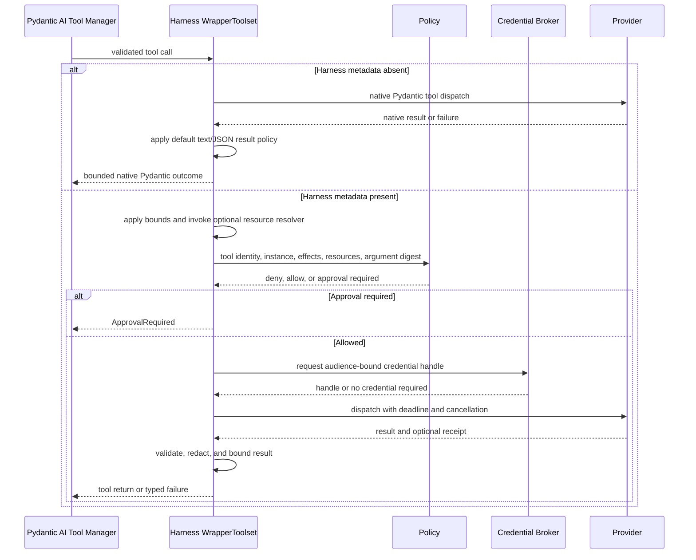

# Tool Execution

## Design Position

Pydantic AI owns function-tool schema validation, Toolset composition, the Tool Manager, native external and approval deferral, and result integration. Its public deferred contract validates message-level call identity and completeness, but it does not validate `ExternalToolset` arguments against the declaration's JSON Schema, preserve request categories in message history, authenticate results, or prove exact remounted surface identity. Native Pydantic function tools and Toolsets run directly without adopting a Harness base class or metadata schema. Function tools that opt into Harness-managed identity, authorization, credentials, side-effect, retry, and result-safety behavior attach `HarnessToolMetadata`; one Harness-owned outer `WrapperToolset` recognizes that metadata and performs the additional preparation and dispatch checks.

Client-side tools use Pydantic AI `ToolDefinition`, `ExternalToolset`, `DeferredToolRequests.calls`, and `DeferredToolResults.calls` directly. They are model-visible schemas whose implementation and authority remain outside the Agent process. They do not pass through the function-tool invocation pipeline, execute through `agent-envd`, or reuse approval semantics.

The function-tool wrapper is an Agent invocation boundary, not Python isolation. An unannotated native function tool is treated like other trusted in-process plugin code: it keeps Pydantic AI semantics but is outside Harness-managed authorization and side-effect guarantees. Installing or supplying that code grants process authority, whether or not it is model-visible.

## Boundary

| Concern                                                            | Owner                                                    |
| ------------------------------------------------------------------ | -------------------------------------------------------- |
| Function-tool definition/validation, tool manager, deferred values | Pydantic AI                                              |
| Optional Harness tool metadata and effective-surface resolution    | Harness                                                  |
| Managed invocation wrapper and final tool-surface recording        | Harness                                                  |
| Agent policy and credential decisions for managed tools            | Harness boundary plus fresh `InvocationPolicyCapability` |
| Remote operation and side-effect evidence                          | Tool provider                                            |
| Grant signing and authenticated transport                          | Host security or provider adapter                        |
| Direct I/O by trusted Python plugins                               | Plugin process trust boundary                            |
| Client-side definition/run selection and Toolset composition       | Client Tools Capability                                  |
| Client-side model schemas, instructions, and external deferral     | Client Tools Toolset and Pydantic AI                     |
| Client-side execution, authorization, and result production        | External executor or Foundation Client                   |
| Durable client-call waiting, delivery, and feedback correlation    | Host                                                     |

## Tool Metadata

```python
type ToolEffect = Literal[
    "read",
    "write",
    "delete",
    "execute",
    "external_communication",
]

type IdempotencySemantics = Literal[
    "none", "read_only", "provider_key"
]


class CanonicalResource(BaseModel):
    namespace: str
    kind: str
    identifier: str


class ToolOutputPolicy(BaseModel):
    model_config = ConfigDict(frozen=True)

    max_inline_bytes: int
    max_output_bytes: int
    overflow: Literal["fail", "truncate", "spill"] = "spill"
    redact: bool = True


@runtime_checkable
class ToolResourceResolver(Protocol):
    async def __call__(
        self,
        arguments: Mapping[str, object],
        *,
        context: AgentContext,
    ) -> tuple[CanonicalResource, ...]: ...


@dataclass(frozen=True)
class HarnessToolMetadata:
    tool_id: str
    effects: frozenset[ToolEffect]
    credential_audiences: tuple[str, ...]
    idempotency: IdempotencySemantics
    output_policy: ToolOutputPolicy
    resource_resolver: ToolResourceResolver | None = None
    superseded_by_tool_ids: frozenset[str] = frozenset()
```

`HarnessToolMetadata` is stored under a reserved key in Pydantic AI `ToolDefinition.metadata`; there is no parallel tool binding object. Pydantic fields retain ownership of name, schema, kind, strictness, timeout, sequential execution, deferred loading, and the optional runtime `toolset_id`. `tool_id` is the stable policy identity before model-visible renaming or prefixing. It is unique within one prepared candidate surface: a second function-tool definition with the same ID fails before surface resolution, even when visible names differ. Intentional aliases therefore use distinct policy IDs and can share a host-owned implementation reference outside this contract.

`ToolEffect` is a small conservative policy hint, not an execution result or authorization grant. `read` observes state; `write` creates or changes state; `delete` removes state; `execute` starts code or a process; and `external_communication` sends data or a message outside the selected Environment. A tool declares every applicable value, so a shell command commonly declares `execute` plus `write`, and an HTTP-post tool commonly declares `external_communication` plus `write`. The actual provider receipt remains the evidence of what occurred. The former `create` and `update` distinction is intentionally collapsed because generic policy cannot classify upsert, patch, append, and replacement consistently before provider resolution.

`CanonicalResource` compares by the exact `(namespace, kind, identifier)` tuple after provider-aware resolution and contains no credential or display-only alias. `IdempotencySemantics` distinguishes no replay guarantee, non-mutating replay, and mutation replay under the same provider key. `ToolOutputPolicy` defines the final per-tool serialized text/JSON safety boundary, explicit overflow behavior, and whether the managed redaction pass is required. It is not the normal presentation budget for a first-party Toolset. It does not meter or rewrite native multimodal content; the definition-selected request content filter owns model compatibility, validation, and media limits at the later model-request boundary. The policy is frozen, and Toolset preparation defensively normalizes metadata so a caller cannot mutate nested policy after validation. `max_inline_bytes` must be at least 512 and no greater than `max_output_bytes`; both are narrowed by finite Harness hard ceilings that cannot be disabled by tool metadata or Host configuration. Positive bounds and non-empty identity/resource fields are validated at Toolset preparation. Harness metadata supplies only semantics absent upstream and grants no authority. The metadata and optional resolver are trusted process objects rather than durable definition state; the resolver receives the same schema-validated, type-converted argument mapping that Pydantic will dispatch plus trusted `AgentContext`, not credentials or raw model text.

`HarnessTool` is an optional thin subclass of Pydantic AI `Tool[AgentContext]` that attaches complete Harness metadata for first-party or policy-managed tools. Using that subclass is not required: any Toolset that places a structurally valid `HarnessToolMetadata` instance or mapping under the reserved key participates through duck typing. The Harness does not infer identity, effects, credentials, resources, or idempotency from function names, Python annotations, JSON schemas, or module origin. A reserved key with an invalid or incomplete value fails toolset assembly instead of silently downgrading the tool to unmanaged dispatch.

An ordinary function-tool definition without the reserved metadata remains callable and is not assigned guessed authorization metadata. Its native JSON and `ToolReturn` textual fields still cross the code-owned default truncating output boundary; arbitrary non-JSON native return values retain Pydantic semantics. This includes dynamically discovered locally executable tools from Pydantic AI `MCPToolset`; the Harness neither guesses managed metadata from MCP provenance nor adds an MCP-only result path. When `resource_resolver` is absent, managed authorization is explicitly tool- and action-level and `resources` is empty; provider-specific resource enforcement still applies. The current run's `InvocationPolicyCapability` can select a strict profile that rejects unannotated model-visible function tools. Static, dynamic, and deferred definitions are checked at their run-time Toolset preparation boundary before they can enter a model request; strictness is not a hidden builder option or immutable executable field. This is an explicit run policy rather than the base behavior.

Capability authors assign any required timeout on their owned `Tool`, `FunctionToolset`, or custom Toolset. `AgentSpec.tool_timeout` configures native Agent-level tools and does not implicitly propagate into Capability-owned Toolsets; because the Harness exposes no top-level Agent tools, a feature must not rely on that field for its dispatch deadline.

### Tool Surface Resolution

Every run-step has a **candidate tool surface** produced after Pydantic prepares all ordinary contributing Toolsets. The Harness-owned `ToolSurfaceCapability` wraps that complete candidate surface exactly once and produces the **effective tool surface** consumed by later wrappers, CodeAct, the final Tool Manager, and model requests. Feature Toolsets contribute candidates declaratively and never coordinate visibility through mutable `AgentContext` state or preparation order.

For a managed function or unapproved tool, `superseded_by_tool_ids` names exact stable managed `tool_id` values whose prepared presence makes the declaring candidate redundant. Resolution performs these steps over one complete prepared candidate mapping:

1. normalize every candidate's reserved managed metadata and reject invalid kinds or duplicate candidate `tool_id` values;
2. collect the complete set of prepared managed tool IDs without considering authorization outcomes;
3. validate that no declaration targets its own ID and that present declarations do not form a directed supersession cycle; and
4. omit each managed candidate whose `superseded_by_tool_ids` intersects the prepared ID set, preserving every other candidate unchanged.

A target does not need to be present or known to the current executable; an absent target has no effect. Presence means that the target survived its owning Toolset's normal run-step preparation and appears in the same candidate surface. It does not mean that invocation policy will authorize the target, that an Environment currently has a ready binding, or that the target will succeed. Supersession is therefore a schema and routing simplification, not fallback selection, authorization, capability discovery, name-collision handling, or runtime health checking.

Only managed function and unapproved tools participate. External client tools, provider-native tools, output tools, and unmanaged native tools neither declare nor satisfy this relation. A candidate visible-name collision remains owned by Pydantic Toolset composition and fails independently; supersession never chooses a winner by name. Toolsets must keep any guidance required to invoke a supersedable tool in that tool's own description or schema rather than publishing unconditional standalone instructions that become false when the tool is absent.

Wrapper ordering is part of the contract:


When CodeAct is absent, the execution boundary directly wraps surface resolution. CodeAct builds and validates its catalog only from the effective surface, then adds its runner tools. The execution boundary normalizes, authorizes, bounds, and records only that final effective surface. `AgentContext` may retain the resulting managed surface snapshot for resume validation and diagnostics, but that snapshot is an output of resolution and never an input used by sibling Toolsets.

### Passive Tool Runtime Metadata

A Toolset may define a public `ToolMetadataKey[T]` and immutable value class when another built-in or external Capability needs to contribute passive run-specific interpretation. Capabilities publish those values through `AgentContext.tool_metadata`; the owning Toolset reads them and remains solely responsible for matching, validation, conflict semantics beyond owner identity, and clamping to implementation hard limits. Keys accept any external runtime class and require no Harness registration. Publication is typed with `isinstance`, owner-bound, idempotent for the same value, and reused across all internal `ModelAttempt` values of the logical run.

This registry is not Pydantic `ToolDefinition.metadata`, which describes one assembled tool to the execution boundary. It does not add a Capability lifecycle, ordering graph, tool lookup, dispatch path, callable hook, authorization grant, provider client, or portable state channel. A feature that needs active behavior or another live collaborator still uses a Capability, Toolset, fixed `AgentContext` field, or typed plugin/run binding as appropriate.

The Harness always installs exactly one code-owned `ToolExecutionBoundaryCapability`. Its `get_wrapper_toolset()` contribution is a `ToolExecutionBoundaryToolset` ordered outermost around the effective non-output Toolset after per-step preparation, mandatory surface resolution, and optional CodeAct composition; Host code cannot replace its preparation, dispatch, or textual-result algorithm. It declares `CapabilityOrdering(position="outermost", wraps=(AbstractCapability,))`, so it sorts before AgentSpec, definition, plugin, run, instrumentation, and other same-tier Capabilities regardless of contribution order. An incompatible Capability that attempts to wrap this boundary creates an ordering cycle and fails run setup before tool exposure rather than weakening the boundary. The wrapper therefore sees function, unapproved, and external definitions, branches on `ToolDefinition.kind`, and never intercepts output or provider-native tools. It normalizes managed function metadata, enforces final client-tool names, and delegates ordinary external deferral to Pydantic without calling an external function body.

Current managed authority enters through exactly one fresh `InvocationPolicyCapability` in `RunBindings.capabilities`; feature-specific setup and dispatch require its documented public type and stable Capability ID and reject incompatible values before model exposure. The policy Capability can retain a typed evaluator, approval verifier, credential broker, and invocation-grant broker, but those grant nothing without the current run's Identity and invocation context. When no policy provider is supplied, managed metadata-aware tools are denied while unmanaged native tools retain their ordinary trusted semantics. An embedded caller that enables managed Environment tools supplies the same `InvocationPolicyCapability` with its explicit local evaluator; after that allow decision, the live `BoundEnvironment` independently narrows the call through captured Identity, binding ceilings, readiness, and provider policy. There is no specialized local-policy Capability, class-free role registry, serialized component bundle, or model-authored ID that can create this authority.

Pydantic output tools remain part of output validation, not general side-effect dispatch, and provider-native server-side tools remain model/provider configuration. A deployment that needs Harness invocation policy for a provider-native operation exposes a metadata-aware function-tool adapter instead of pretending the function wrapper intercepts provider-internal execution.

Pydantic Toolset composition owns collision handling and final model-visible names. Dynamic discovery changes visibility, not registration or authorization. First-party Environment and remote-provider tools attach Harness metadata because the platform claims identity and policy enforcement for those surfaces.

## Client-Side External Tools

Client-side tools are declared by a concrete first-party `ClientToolsCapability` in `AgentDefinition.capabilities`. It is a code-first Harness Capability rather than a custom `AgentSpec.capabilities` serialization type, so it is never present in the declarative custom-type catalog and requires no class-name resolution. The Capability's portable argument model is conceptually:

```python
class ClientToolDefinition(BaseModel):
    name: str
    description: str
    parameters_json_schema: Mapping[str, JsonValue]
    instruction: str | None = None
    metadata: Mapping[str, JsonValue] = Field(default_factory=dict)


class ClientToolsetDefinition(BaseModel):
    toolset_id: str
    tools: tuple[ClientToolDefinition, ...]


class ClientToolsSpec(BaseModel):
    default_toolsets: tuple[ClientToolsetDefinition, ...] = ()
    allow_run_override: bool = False


@dataclass(frozen=True)
class ClientToolsRunCapability(AbstractCapability[AgentContext]):
    toolsets: tuple[ClientToolsetDefinition, ...]
```

`ClientToolsRunCapability` is a typed fresh run attachment carried in `RunBindings.capabilities`; it contributes no independent tools or authority. The definition-selected Client Tools Capability resolves exactly zero or one instance by its stable Capability ID and expected public type, applies the replacement policy below, and contributes the resulting native Toolsets. This uses Pydantic's finalized run Capability mapping rather than adding a feature field or class-free role registry to `RunBindings`.

The declaration codec is not a second executable Toolset API. For each run, the Capability resolves the complete effective declaration list and composes one Client Tools Toolset. That Toolset converts each effective definition one-to-one into an upstream `ToolDefinition`, groups it in an upstream `ExternalToolset(id=toolset_id)`, and supplies optional bounded native Pydantic instruction parts. The declared name is the required final model-visible name; the outer Harness wrapper rejects another wrapper's attempted prefix or rename of a marked client definition instead of silently changing Host correlation.

Toolset IDs and model-visible names are unique in the effective client surface. The Harness validates bounded JSON Schema objects with `type="object"`, while upstream `ExternalToolset` deliberately uses an unconstrained local validator and treats that schema as model-facing guidance. Descriptions, instructions, and metadata are bounded JSON-safe content. Final collision detection remains Pydantic-owned across the complete assembled surface, including native, Capability, MCP, Environment, external, discovered, and output tools. Client metadata is non-authoritative public data. It cannot contain a credential, invocation grant, policy claim, server-only correlation value, or reserved `HarnessToolMetadata`; external tools never masquerade as Harness-managed function tools.

For each run, `ClientToolsRunCapability` has deterministic whole-list semantics:

| Definition and run attachment                      | Effective client surface                                                        |
| -------------------------------------------------- | ------------------------------------------------------------------------------- |
| Client Tools Capability absent; attachment absent  | No client tools                                                                 |
| Client Tools Capability absent; attachment present | Run setup fails                                                                 |
| Capability present; attachment absent              | `default_toolsets`                                                              |
| Attachment present; `allow_run_override=false`     | Run setup fails                                                                 |
| Attachment present; `allow_run_override=true`      | Attachment toolsets replace the complete default list; an empty tuple clears it |
| Duplicate or incompatible typed run attachments    | Run setup fails                                                                 |

The run attachment is trusted Host input for one run, but its descriptions, schemas, instructions, and metadata remain untrusted model content. It carries no Python handler, client credential, connection, callback, or side-effect authority. The effective surface is fixed before the first model request and cannot change through enqueue or topology updates. A child receives no client surface from its parent unless the child definition independently enables the Capability and the Host supplies the child's fresh typed run attachment.

When the effective list is non-empty, the Client Tools Capability contributes the Client Tools Toolset through native Pydantic composition; the Toolset contributes the resulting `ExternalToolset` values and declaration-owned instruction parts. Every built Harness Agent includes `DeferredToolRequests` beside its fixed business output in the construction-time Pydantic output contract; runs do not widen or override it. Pydantic marks every external definition `kind="external"` and places selected calls in `DeferredToolRequests.calls` without invoking a function body. The Harness does not recreate `CallDeferred`, an external-tool dispatcher, a prompt language, or a client callback protocol. The invocation-policy strict profile applies to function tools; it neither converts an external tool into a managed function tool nor authorizes its external side effect.

The resulting `HarnessRunResult` is suspended with `suspend_reason="deferred"`, complete `DeferredToolRequests`, and `HarnessState`. Ordinary tool-call and deferred events are observations only. The terminal result and any Host-accepted durable record determine whether external execution may proceed.

Resume is a new run. The Host supplies the prior state, the exact effective client surface that produced the pending calls, fresh `RunBindings`, and a `DeferredToolResume` containing the authoritative terminal `DeferredToolRequests` plus its `DeferredToolResults`. Before model or tool work, the Harness rejects duplicate or category-overlapping pending IDs, unknown, wrong-kind, already completed, incomplete, or message-mismatched results and verifies that every pending external name is present as an external definition on the current assembled surface. Calling `DeferredToolRequests.build_results(...)` is the normal construction path but does not replace this preflight because native result objects remain directly constructible and partial.

Exact surface identity is a Host obligation. Pydantic message history retains call identity and arguments, not the complete prior schema, instruction, metadata, category, or toolset declaration, and `HarnessState` intentionally excludes the client attachment. The Harness detects request/result category and current assembled-name/kind inconsistencies from the supplied authoritative pending value, but cannot prove that a same-named remounted declaration is byte-for-byte or semantically identical. A durable Host compares its frozen attachment or digest before calling the Harness; an embedded Host that wants this guarantee retains and compares the same value itself.

Argument schemas guide the model but do not authorize a client action. Because upstream `ExternalToolset` does not execute the function body, the external executor validates the received arguments against the accepted schema before any side effect and applies its own authentication, user confirmation, timeout, audit, and rollback policy. The Harness never claims that an external result proves how the client produced it.

Foundation Service durability, delivery, idempotent feedback, and exact-parent fencing remain Host-owned as summarized by [Foundation Service](../foundation-service/README.md). Embedded Hosts can implement the same stop-and-resume contract without a service.

## Invocation Context

```python
class ToolInvocationContext(BaseModel):
    invocation_id: str
    tool_call_id: str
    run_id: str
    instance: AgentInstanceContext
    tool_id: str
    toolset_id: str | None
    tool_name: str
    normalized_arguments: Mapping[str, JsonValue]
    arguments_digest: str
    resources: tuple[CanonicalResource, ...]
    idempotency_key: str | None
    deadline: datetime | None
```

`tool_call_id` follows Pydantic AI messages. `invocation_id` identifies one provider dispatch and receipt. `tool_id` comes from validated Harness metadata; `toolset_id` and `tool_name` retain the assembled Pydantic location and visible name for diagnostics. Agent Identity comes from `instance`; model arguments cannot replace any of these values. The context is derived inside the authorization Capability and is not accepted as model input.

## Execution Pipeline



Pydantic structural validation precedes every dispatch. Every locally executable function or unapproved tool return crosses the same outer result boundary. Managed metadata selects authorization, dispatch retry, events, strict JSON validation, and a per-tool `ToolOutputPolicy`; metadata-absent tools receive the finite code-owned default truncation policy for native JSON values and textual/JSON fields of `ToolReturn`, while arbitrary non-JSON return objects remain native. For a managed tool, the wrapper creates a bounded Pydantic JSON projection of the type-converted arguments for policy, digest, events, and state; a value that cannot be projected fails before authorization. Harness declaration-level bounds and the optional resource resolver then precede policy and provider work. The resolver sees the typed arguments, while `ToolInvocationContext.normalized_arguments` contains only their safe JSON projection. Resolver failure stops before authorization or dispatch. Providers remain responsible for canonicalization that depends on remote state; a central policy that requires such a canonical value uses an explicit provider resolution operation before its final decision. An unmanaged tool receives no implied Harness authorization, credential broker, idempotency, semantic retry, or invocation event; only the mandatory default text/JSON result boundary applies.

Approval is validated again on resume. Credentials resolve only after validation, authorization, and approval, immediately before dispatch. Live deny and cancellation are checked at that boundary.

## Authorization and Grants

In-process tools are trusted code. The wrapper governs metadata-aware calls made through the assembled tool surface but cannot prevent installed code, including an unmanaged native tool, from using Python libraries, local files, or captured clients directly.

Out-of-process operations can receive an opaque reference to a host-issued invocation grant:

```python
class InvocationGrantRef(BaseModel):
    grant_id: str
    audience: str
    claims_digest: str
    expires_at: datetime
```

The host security adapter defines claims, signing, authenticated transport, and verification. The harness binds the request to the current instance, canonical action/resource inputs, argument digest, approval reference, and constraints before asking for the grant. Provider transport credentials, invocation grants, and business credentials remain distinct.

## Approval and Deferred Calls

Approval uses Pydantic AI `ApprovalRequired`, `DeferredToolRequests.approvals`, `DeferredToolResults.approvals`, `ToolApproved`, and `ToolDenied` directly. Client-side execution uses the separate `DeferredToolRequests.calls` and `DeferredToolResults.calls` collections. A result for one category is invalid for the other.

The host-owned approval record binds stable tool identity, effective argument digest, any resolved semantic resources, effect classes, approver provenance, scope, expiry, and constraints. Overrides pass through schema validation, optional resource resolution, policy, and credential resolution again.

Approval does not reserve a credential or override a current deny. Definition, argument, resource, or relevant Environment changes can invalidate the prior decision. An approved function tool later executes under fresh server authority; an external client tool never becomes server-executable merely because another deferred entry was approved.

### Structured User Questions

Structured user interaction is a narrow client-side deferred tool rather than a live callback into the Host. Its Capability contributes a bounded question contract and answer schema, while Pydantic deferred-call identity and the Harness resume envelope provide correlation. The Host owns presentation, authenticated answer collection, persistence, expiry, and delivery. Before Pydantic integration, the User Interaction Capability validates the untrusted answer value against the exact pending question schema; generic deferred-resume preflight continues to validate message identity, category, call coverage, and the current external-tool surface.

A question suspends the originating run and therefore retains no task, socket, credential, or user-interface handle in the Harness process. An answer is untrusted user-supplied data carried in a correlated `DeferredToolResults.calls` value, not `RunInputValue` or ordinary user-message content. It cannot serve as approval, Identity, policy, or Environment authority merely because it arrived through the correlated question surface.

## Discovery, Proxying, and Programmatic Dispatch

Pydantic AI deferred Capability loading and tool-search primitives are the default progressive-disclosure path. Loaded Capability IDs and discovered tool names use upstream message-derived state and are persisted only when their continuation semantics require it.

A fixed-catalog proxy Capability remains available for deployments that expose a stable search/execute pair, cache remote definitions, or hide provider tools from direct model invocation. It preserves the underlying tool identity and any Harness metadata; discovery or proxy ownership never upgrades an unmanaged tool into a managed one or bypasses authorization for a managed tool.

Programmatic dispatch uses Pydantic AI `RunContext.tool_manager`. It crosses the same prepared definition, validation, Capability hooks, managed-or-native dispatch choice, owning Toolset, event, and successful-call accounting path as model-selected calls. A proxy-only grant is scoped to its owning wrapper and target managed tool and is not a general host-call bypass.

The optional restricted Python orchestration surface is owned by [Restricted CodeAct Orchestration](18-codeact.md). CodeAct adds typed deny-by-default eligibility, run-local Monty sessions, bounded nested dispatch, and inline/file runner semantics without creating another tool router or widening the authority defined here.

## Credentials

The broker returns an opaque, audience-bound lease or injection handle. Credential material is absent from prompts, model arguments, results, `HarnessState`, events, traces, and normal logs. Redirects do not forward it to another audience, and failure does not fall back to ambient host credentials.

Environment-variable projection is an explicit compatibility mode for a specific dispatch adapter, not a default tool behavior.

## Dispatch, Retry, and Results

Local tools execute through the Pydantic AI toolset interface. Remote adapters receive validated input, the optional grant reference, a credential handle, cancellation, and deadline.

Read and mutation retry behavior comes from declared provider semantics. A mutation repeats only when the provider supports the same idempotency key and semantic request. Timeout, cancellation, or transport loss after dispatch is unknown without provider evidence and is reconciled rather than assumed failed. A non-cancelled run receives a bounded safe `unknown_outcome` tool failure plus an `invocation` observation. When external task cancellation must propagate, the wrapper emits the same bounded observation before re-raising when the dispatch boundary is known, but that event remains best-effort process-local telemetry rather than a durable receipt. Provider receipts or a Host-owned dispatch/idempotency ledger are the durable reconciliation authority; cancellation and event loss never cause `HarnessState` to fabricate one.

Parallel model tool calls do not imply safe parallel effects. Effect metadata, semantic resources, and provider limits determine concurrency.

Managed-tool results pass through declared output validation, text/JSON redaction, final size policy, optional controlled spill, and event emission. Metadata-absent function results receive the same textual/JSON redaction and finite default final policy with `overflow="truncate"`, but no managed identity, authorization, credential, retry, invocation event, or spill file is fabricated. Truncation and managed spill failure remain explicit. Effective limits are the minimum of implementation hard ceilings, Host runtime ceilings, provider-advertised limits, and the selected per-tool or code-owned default policy; no layer can widen an upstream ceiling. Provider-native tools do not execute through this local function-tool boundary; their provider request and result integration remain upstream behavior.

First-party Toolsets own normal model-facing progressive disclosure because only the semantic owner knows whether to page complete entries, preserve whole lines, retain a continuous process-output prefix, keep log head and tail, or direct the model to a narrower follow-up operation. A shared public Toolset helper supplies strict serialized JSON character measurement, redacted best-effort run-private file writing, exact field/collection fitting, consistent guidance, and a typed disclosure value. Its ordinary semantic target is 12,000 serialized JSON characters; UTF-8 byte ceilings remain separate transport, provider, and spill constraints.

```python
class ToolOutputDisclosure(TypedDict):
    truncated: Literal[True]
    output_chars: int
    output_bytes: int
    output_file_path: str | None
    content_complete: bool
    hint: str
```

`output_chars` and `output_bytes` measure the same strict serialized fullest-available redacted value as Python Unicode characters and UTF-8 bytes, respectively. `content_complete` states whether that value covers the complete producing operation, not merely whether the temporary write succeeded. `output_file_path` names a model-readable file containing that fullest-available value or is `None` when writing was unavailable. Tools with a reliable continuation, such as file pages or retained process output, can prefer that continuation and omit a file. Named Toolset results include `disclosure` only when their ordinary inline projection omits additional content. They do not return a universal model-visible result wrapper.

The helper returns an ordinary JSON mapping carrying a Harness-owned process-local acknowledgement type. This acknowledgement is not serialized as a flag, grants no authority, and cannot disable validation, redaction, or the finite hard ceiling. It only tells the outer boundary not to replace an already bounded semantic result at the smaller generic inline byte threshold. Acknowledged output remains shape-preserving only while it is at most 20,000 serialized characters and within `max_output_bytes`; otherwise the final safety ceiling returns the bounded generic preview regardless of the ordinary unacknowledged overflow mode. Arbitrary booleans or model-controlled fields never create the acknowledgement.

The tool execution boundary remains the sole mandatory final result boundary. After redaction, it measures both serialized characters and UTF-8 bytes for an ordinary JSON result and the textual/JSON fields of a native `ToolReturn`. Model-visible text/JSON never exceeds the code-owned 20,000-character hard ceiling, and a narrower `max_inline_bytes` or applicable `max_output_bytes` still applies. Native `BinaryContent`, URL media, `UploadedFile`, `CachePoint`, and other non-text content parts are preserved as native values and excluded from this text/JSON policy; the content compatibility filter processes them when the resulting history is next sent to a model. The result boundary does not recursively rebuild, inspect, redact, upload, or meter those multimodal parts.

An unacknowledged textual result within both the 20,000-character final ceiling and `max_inline_bytes` remains inline with its semantic shape. When it exceeds either boundary, `fail` returns a bounded tool failure, `truncate` returns an explicit bounded structure-preserving preview, and `spill` first writes the complete redacted text/JSON value when it is no larger than `max_output_bytes`. Spill eligibility and the code-owned 16 MiB proactive Toolset spill ceiling are byte policies independent of the character budgets. Spill uses the current `AgentContext.environment.files` facade and a Harness-controlled run-private logical path beneath the default workspace. The model receives a preview bounded by both 20,000 characters and `max_inline_bytes`, with `truncated=true`, complete serialized character and byte counts, and `output_file_path`; it reads the file later through ordinary Environment file tools. There is no model-visible retained-output selector, second Environment result projector, or cumulative budget shared across independent tool calls.

The shared spill owner registers one bounded logical-run cleanup collaborator and serves both proactive Toolset disclosure and the final fallback. Spill files never enter `HarnessState`, survive run close by contract, grant provider authority, or become durable artifacts. A read-only, unavailable, or topology-incompatible file sink leaves `output_file_path=null` and returns the bounded preview rather than converting an already completed side effect into a retry-shaped failure. A value beyond the caller's finite spill ceiling is never written and follows the bounded preview or failure outcome. The generic fallback preserves object/list structure by shortening string leaves when that structure fits; if structural overhead alone cannot fit, it falls back to an explicit serialized head/tail preview.

The safety contract applies while bytes are produced or incrementally read, not only after an unbounded value has been collected. First-party Environment providers capture command output into bounded memory and private spools under their own hard ceilings. Their Toolsets materialize at most their declared finite result ceiling, proactively construct a smaller semantic page or preview, preserve recoverability through a continuation or disclosure file, and release no-longer-needed provider references. Every entered provider also bounds aggregate private spool storage and never evicts a valid reference to admit another producer. These provider references remain trusted programmatic values; they are not the model-facing spill format.

`ToolOutputPolicy` remains a Harness final model-result policy and is not serialized as EIP command policy. Envd captures raw command output under its advertised finite ceiling and returns bounded previews plus explicit-offset references; the Harness adapter reads a finite page and the owning Toolset performs semantic progressive disclosure before final boundary validation. Direct Local uses its own finite raw-capture spool and the same layered contract. A Harness `fail`, Toolset spill failure, or final fallback never changes command termination or rolls back side effects after provider dispatch.

The code-owned `ToolExecutionBoundaryCapability` applies this reusable final path after every locally executable function-tool dispatch; no Filter or second result-safety Capability wraps or bypasses it. The path avoids secondary unbounded serialization, but an in-process Python function can allocate an oversized object before returning, so the wrapper cannot retroactively prevent that allocation. First-party streaming producers enforce provider hard capture bounds during production and semantic Toolset bounds before model materialization. Metadata-absent arbitrary non-JSON objects retain native Pydantic semantics and are outside textual spill; a Host requiring strict JSON results and managed authority uses the strict managed-tool profile and streaming first-party providers.

Direct provider calls and unmanaged side effects by trusted code are outside authorization, even though function-tool text/JSON returns still cross the output boundary, and remain attributable to plugin process trust.

## Failure Surface

Stable harness categories cover invalid input, unavailable tool, denied, approval required, invalid external-tool declaration or result correlation, credential unavailable, provider failure, timeout, cancellation, unknown outcome, invalid result, duplicate managed identity, and internal wrapper failure. Duplicate `tool_id` values, invalid Harness metadata, invalid client declarations, and assembled name collisions fail at their owning static or per-run Toolset preparation boundary before model exposure. Provider-specific codes and protected causes remain safe extensions rather than expanding the core taxonomy.

## Trade-offs

- Reusing Pydantic AI tools avoids a second execution framework, while Harness metadata and its optional authoring helper remain additive.
- Metadata-aware wrapping makes policy consistent for managed tools without pretending to sandbox or govern arbitrary trusted plugin code.
- Opaque grant and credential references keep transport security outside model-controlled data.
- Deferred approval and client-side execution create another run boundary instead of retaining live tasks and credentials.
- Reusing `ExternalToolset` avoids the former custom client Toolset and result-correlation state machine, while durable Hosts still own authenticated delivery and feedback.

## Invariants

01. Every model-selected function-tool call resolves to one Pydantic AI `ToolDefinition`; Harness metadata is optional and never inferred.
02. Every valid Capability graph sorts the tool execution boundary outside all other wrappers; every locally executable function-tool call therefore crosses that dispatcher, which always applies the text/JSON result boundary and applies authorization, managed retry, and invocation events only when valid Harness metadata is present.
03. Managed `tool_id` values are unique within one assembled run and are checked again whenever dynamic or deferred Toolsets prepare definitions.
04. A host that requires all model-visible function tools to be managed rejects each unannotated definition at the authoritative per-run or per-step Toolset preparation boundary before model exposure; eager checks of direct static `Tool` inputs are only an optimization.
05. Approval for a managed tool binds effective input and never overrides live deny policy.
06. Managed credentials are audience-bound and never fall back to ambient authority.
07. Managed remote retry follows provider idempotency or reconciliation evidence.
08. Trusted plugin code, unmanaged tool dispatch, and direct Python I/O are not represented as wrapper-enforced isolation.
09. Every client-side tool is an upstream external tool: no handler runs in the Harness process, its declared name survives final assembly exactly, and external calls never share approval semantics.
10. A run-specific client-tool replacement is accepted only when the materialized Client Tools Capability permits it; the effective whole surface is fixed for that run and remounted exactly for deferred resume.
11. External results correlate through `DeferredToolResume` to the authoritative pending `.calls` batch and start a new run with fresh bindings; the Host verifies exact surface identity, while stream events, metadata, and client-held history grant no result authority.
12. Every locally executed function tool's native JSON or `ToolReturn` textual/JSON output is subject to finite per-call inline and total bounds; producer-side streaming or retention applies a finite capture bound before full materialization whenever the provider controls production.
13. Every first-party output spool enforces finite aggregate storage; Direct Local charges actual bytes until release or binding close, while envd reserves finite command-output records and bytes until explicit release or daemon shutdown.
14. First-party Toolsets own semantic progressive disclosure and can share the one run-local spill owner; the mandatory outer boundary always retains validation, redaction, and a larger finite hard fallback, and no second model-visible result wrapper exists.
15. A Toolset acknowledgement is a process-local Harness type, never a model-authored flag; it bypasses only the ordinary generic inline projection and cannot bypass the final hard ceiling.
16. Native multimodal tool-return parts cross the tool execution boundary unchanged and are owned by the definition-selected content compatibility filter at model-request time.
17. The EIP adapter never serializes Harness output policy or metadata into command requests; it enforces finite provider reads over envd's bounded raw output before Toolset-owned semantic projection and final boundary validation.
