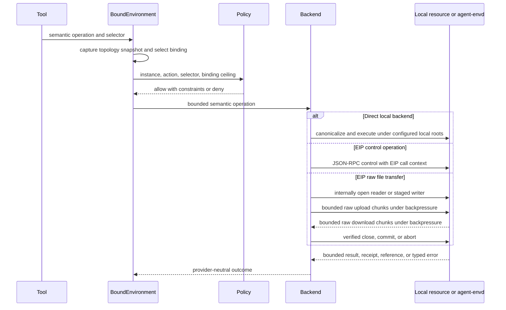

# Environment Integration

## Design Position

Environment is a Harness-managed, run-scoped resource. It is not a Pydantic Capability. An embedded caller supplies no Environment, one `EnvironmentProvider` or entered `EnvironmentResource` through `environment=`, or a named mapping through `environments=`. The Harness normalizes every form into one single-use internal aggregate, enters it before input production, publishes one stable `Environment` through `AgentContext.environment`, and closes it after the logical run reaches its terminal fence and all run-local scopes unwind.

Source type defines lifecycle ownership. For a Provider input, the Harness owns an ephemeral Resource: it creates, enters, attaches, exits, and destroys that Resource before terminal result delivery. For an entered Resource input, the Host retains lifecycle ownership: the Harness acquires and releases one fresh attachment but does not exit, pause, or destroy the Resource. One mapping can mix both forms. A continuation that requires reuse of the same Resource therefore uses the Host-owned form; a suspended run still destroys every Harness-owned ephemeral Resource.

An advanced Host can instead place one single-use `EnvironmentRunBinding` in `RunBindings` and retain its paired `EnvironmentTopologyController`. High-level inputs and that advanced binding are mutually exclusive. Both routes enter the same aggregate lifecycle and operation engine; there is no second Environment execution path.

A trusted Host may register ordered `EnvironmentRunExtension` objects when constructing an advanced aggregate. Each extension enters once after portable Environment state restoration and before controller activation, receives the complete stable `Environment`, and exits in reverse order while that Environment remains open. This is the narrow process-local lifecycle seam for resources that span the complete Environment aggregate rather than one provider binding.

The aggregate can contain zero, one, or several provider bindings. Each provider binding establishes trustworthy Environment identity, generation, descriptor, routing, and an enforceable readiness path before publication. Concrete file, shell, process, or port resources may continue preparing asynchronously inside the entered binding scope. Operations wait only for their selected operation family and fail with typed availability rather than relying on a global `ping()` or requiring every backend resource to be ready at run entry.

A Host using the advanced route retains the paired `EnvironmentTopologyController` for the complete entered logical Harness run. `HarnessRunStream.environment_controller` exposes the controller associated with either route when trusted code needs its lifecycle state. Advanced code can add, refresh, or remove bindings without replacing `AgentContext.environment`, rebuilding the Agent, changing tool schemas, or waiting for another Harness run. The controller accepts only trusted process-local provider bindings. It prepares replacements before atomic publication, fences stale handles, drains operation leases, and retires removed resources under the same aggregate lifecycle.

`Environment` owns the provider-neutral current-topology Model Context Projection. `DynamicEnvironmentCapability` is the optional first-party model adapter: it owns stable guidance, topology observation and enqueue notices, run hooks, and composition of the pure `FileToolset` and `ShellToolset`; those Toolsets expose stable filesystem, shell, process, retained-output, and optional port operations over provider-neutral ports. The Capability does not own provider bindings, readiness tasks, routing snapshots, the current-topology projection, the controller, Environment state, authority, or cleanup. Callers that need only static tools can compose either Toolset directly; a Capability is justified when Agent-loop behavior or notices are required.

Environment operations are provider-neutral. Direct Local is the first-party implementation for an embedding process that intentionally grants local roots and commands; its concrete binding plus file and shell facets remain package internals behind the public attachment adapter. The Harness also owns the EIP adapter over generated `a13n-envd-client` APIs for daemon-governed resources. Local execution is never forced through a daemon, and a Direct Local binding makes no sandbox claim.

## Developer-facing inputs

The conceptual public values are:

```python
type EnvironmentSource = EnvironmentProvider | EnvironmentResource

type EnvironmentEntry = EnvironmentSource | EnvironmentMount


class EnvironmentAccess(StrEnum):
    READ_ONLY = "read_only"
    FULL = "full"


@dataclass(frozen=True, slots=True)
class EnvironmentMount:
    source: EnvironmentSource
    access: EnvironmentAccess | EnvironmentPermissionSet = EnvironmentAccess.FULL
    working_directory: str | None = "/"
```

`EnvironmentAccess` is a convenience ceiling, not another authorization system. `FULL` selects the complete current `EnvironmentAction` catalog. `READ_ONLY` selects non-mutating file observations plus process, output, port, and state observations and the release operations required to retire observation resources. Advanced callers can supply an exact `EnvironmentPermissionSet`. A provider descriptor can always narrow the requested ceiling. `working_directory` is `None` or a canonical absolute provider path and never permits `.` or `..` segments.

`ExecutableAgent.run()` and `stream()` expose the same Environment arguments:

```python
run(
    input=None,
    *,
    environment: EnvironmentEntry | None = None,
    environments: Mapping[str, EnvironmentEntry] | None = None,
    default_environment: str | None = None,
    bindings: RunBindings | None = None,
    ...,
)
```

The rules are:

1. `environment` and `environments` are mutually exclusive.
2. `default_environment` is valid only with `environments` and must name one supplied alias.
3. Singular input uses alias `workspace`, logical binding ID `environment-workspace`, and is the default.
4. A one-entry mapping automatically selects its alias as default.
5. A mapping with several entries has no default unless `default_environment` is explicit. Mapping insertion order never chooses authority.
6. Each alias deterministically maps to logical binding ID `environment-{alias}` so compatible continuation state matches across runs.
7. An empty mapping, invalid alias, invalid mount, or high-level/advanced binding conflict fails before stream entry and before provider effects.
8. Omitting `bindings` creates fresh embedded `RunBindings`; omitting all Environment inputs creates the same zero-binding aggregate used by advanced Hosts.

A default binding serves `/workspace`; every binding is addressable at `/environment/{alias}`. The high-level mapping is prepared atomically. The Harness does not publish a partial topology: if one entry fails, it releases already prepared entries in reverse order. During teardown it drains operation leases, releases attachments, exits and destroys only Provider-owned Resources, leaves borrowed Resources entered, and reports cleanup failure through the normal `RunCleanupError` boundary. Terminal result delivery occurs only after this cleanup succeeds.

## Boundary

| Concern                                                                                                                                                             | Owner                                                                                                                                 |
| ------------------------------------------------------------------------------------------------------------------------------------------------------------------- | ------------------------------------------------------------------------------------------------------------------------------------- |
| Desired topology, provider selection, logical resource identity, and lifecycle policy                                                                               | Host                                                                                                                                  |
| Provider specifications, catalogs, Providers, resource state, and fresh runtime attachments                                                                         | [`a13n-environment-provider`](../agent-environment-provider/README.md) and selecting Host                                             |
| Installed Environment run-extension metadata, explicit entry-point loading, and validated process-local extension factory catalog                                   | Harness Environment run-extension factory boundary and selecting Host                                                                 |
| Ordered aggregate-wide extension selection and extension-specific resource ownership                                                                                | Host and entered `EnvironmentRunExtension`                                                                                            |
| Run-scoped aggregate binding, immutable topology, virtual routing, readiness coordination, operation leases, retirement, and portable Environment-state aggregation | Harness Environment core                                                                                                              |
| Provider-neutral bounded current-topology Model Context Projection                                                                                                  | Entered `BoundEnvironment`                                                                                                            |
| Model-visible tools, stable guidance, and topology-change enqueue notices                                                                                           | Optional `DynamicEnvironmentCapability`                                                                                               |
| Monitored-process waiting, wake-up, accepted completion retention, and later delivery                                                                               | Fresh Host collaborator selected by the monitored-process Capability                                                                  |
| Provider create, resume, pause, destroy, resource state, and Resource lifetime                                                                                      | Host and [`EnvironmentProvider`](../agent-environment-provider/02-resource-management-and-attachments.md)                             |
| Generation observation, operation execution, run-local session ownership, and binding-local cleanup                                                                 | Entered provider binding                                                                                                              |
| Direct local path and process enforcement                                                                                                                           | Direct Local provider binding and embedding OS                                                                                        |
| EIP canonical resources, handles, explicit output offsets, generations, command-output spool, and side-effect evidence                                              | `agent-envd` and its [resource](../agent-envd/04-resource-operations.md) and [output](../agent-envd/06-output-retention.md) contracts |
| Generated EIP models, codecs, typed stubs, and transport/session runtime                                                                                            | [`a13n-envd-client`](../agent-envd/08-protocol-source-client-and-generation.md)                                                       |
| Provider lifecycle selection and optional resource-state storage                                                                                                    | Host                                                                                                                                  |
| Envd inner command isolation                                                                                                                                        | [Execution Isolation](../agent-envd/07-execution-isolation.md)                                                                        |
| Outer container, VM, and provider resource enforcement                                                                                                              | Selected provider                                                                                                                     |

Provider denial always narrows a Harness allow decision. Binding IDs, paths, handles, cursors, topology versions, and saved state are selectors or observations, never bearer credentials.

The Harness depends on `a13n-environment-provider` and the low-level client. It owns direct conversion from shared runtime attachments and generated EIP values to provider-neutral operations, but it does not implement provider management, JSON-RPC, framing, transport authentication, or generated wire models. Docker and E2B integrations live in the provider package and use vendor SDKs only for lifecycle and bootstrap, never as alternate Environment operation backends. Provider credentials remain inside the Provider. EIP transport credentials remain inside the session source and client session. None appear in a published descriptor, model context, operation result, or `EnvironmentState`.

For an EIP-backed binding, trusted stdio, Host-dialed HTTP, and envd-initiated reverse WebSocket are carrier profiles for one EIP method contract, not separate Environment types. An explicit `EIPSessionSource` acquires the selected carrier and returns a fresh initialized session when the binding enters. In every profile the low-level client is the requester and envd is the responder. Reconnect within the same trusted Environment identity and generation creates a fresh EIP session and can be private provider recovery; it never resumes a file transfer or automatically replays a mutation. A generation change requires a fresh binding revision and topology publication and never retargets an operation, provider-neutral cursor, or handle. Direct Local bindings have no carrier negotiation.

Harness `BoundOutputCursor` remains a provider-neutral, process-local facade value. The EIP adapter implements it with the bound reference or process stream plus the returned `next_offset`; requests send explicit offsets and never require an envd cursor selector.

## Identity and Core Values

The four identifiers have distinct meanings:

| Value            | Meaning                                                                     | Visibility                                           |
| ---------------- | --------------------------------------------------------------------------- | ---------------------------------------------------- |
| `provider_key`   | Host-owned key selecting an installed provider integration                  | Host definition and reconstruction only              |
| `environment_id` | Provider/Host identity of one logical resource across attachment attempts   | Trusted provider binding only                        |
| `binding_id`     | Stable identity of one logical slot in this run topology and portable state | Harness and Host; model tools normally use the alias |
| `alias`          | Bounded model-facing selector unique in one topology                        | Model-visible                                        |

`provider_type` is a stable namespaced discriminator for provider-neutral compatibility and portable state codecs. It is not a provider factory key, import path, credential, endpoint, or resource identity. `EnvironmentPermissionSet.operations` contains exact provider-neutral `EnvironmentAction` members from one selected catalog version; operation families are only the coarser readiness and surface-discovery categories.

The following Python-like schemas are conceptual process-local contracts, not serialized Host schemas:

```python
type EnvironmentOperationFamily = Literal[
    "files", "shell", "processes", "ports", "outputs", "state"
]


ENVIRONMENT_ACTION_CATALOG_VERSION = "environment-actions/2"


class EnvironmentAction(StrEnum):
    FILE_STAT = "environment.file.stat"
    FILE_READ_TEXT = "environment.file.read_text"
    FILE_READ_BYTES = "environment.file.read_bytes"
    FILE_WRITE_TEXT = "environment.file.write_text"
    FILE_PATCH_TEXT = "environment.file.patch_text"
    FILE_LIST = "environment.file.list"
    FILE_QUERY = "environment.file.query"
    FILE_SEARCH_TEXT = "environment.file.search_text"
    FILE_MKDIR = "environment.file.mkdir"
    FILE_MOVE = "environment.file.move"
    FILE_REMOVE = "environment.file.remove"
    FILE_WRITE_BYTES = "environment.file.write_bytes"
    FILE_COPY_SOURCE = "environment.file.copy_source"
    FILE_COPY_DESTINATION = "environment.file.copy_destination"
    SHELL_EXEC = "environment.shell.exec"
    PROCESS_START = "environment.process.start"
    PROCESS_INSPECT = "environment.process.inspect"
    PROCESS_READ_OUTPUT = "environment.process.read_output"
    PROCESS_WRITE_STDIN = "environment.process.write_stdin"
    PROCESS_CLOSE_STDIN = "environment.process.close_stdin"
    PROCESS_SIGNAL = "environment.process.signal"
    PROCESS_WAIT = "environment.process.wait"
    PROCESS_KILL = "environment.process.kill"
    PROCESS_RELEASE = "environment.process.release"
    OUTPUT_READ = "environment.output.read"
    OUTPUT_RELEASE = "environment.output.release"
    PORT_INSPECT = "environment.port.inspect"
    PORT_WAIT = "environment.port.wait"
    STATE_EXPORT = "environment.state.export"
    STATE_RESTORE = "environment.state.restore"


class EnvironmentTopologyLimits(BaseModel):
    model_config = ConfigDict(frozen=True)

    max_bindings: int
    max_committed_changes: int


class EnvironmentStateLimits(BaseModel):
    model_config = ConfigDict(frozen=True)

    max_binding_entries: int
    max_binding_encoded_bytes: int
    max_aggregate_encoded_bytes: int
    export_timeout_seconds: float
    restore_timeout_seconds: float


class EnvironmentPermissionSet(BaseModel):
    model_config = ConfigDict(frozen=True)

    operations: frozenset[EnvironmentAction]


class EnvironmentMountDescriptor(BaseModel):
    model_config = ConfigDict(frozen=True)

    name: str
    path: str
    read_only: bool


class EnvironmentDescriptor(BaseModel):
    model_config = ConfigDict(frozen=True)

    generation: str
    operation_families: frozenset[EnvironmentOperationFamily]
    permissions: EnvironmentPermissionSet
    limits: Mapping[str, JsonValue]
    mounts: tuple[EnvironmentMountDescriptor, ...] = ()


class EnvironmentAvailability(BaseModel):
    model_config = ConfigDict(frozen=True)

    status: Literal["available", "preparing", "degraded", "unavailable"]
    ready_families: frozenset[EnvironmentOperationFamily] = frozenset()
    reason_code: str | None = None


@dataclass(frozen=True, slots=True)
class EnvironmentBindingRequest:
    binding_id: str
    binding_revision: int
    alias: str
    permission_ceiling: EnvironmentPermissionSet
    default_working_directory: str | None
    provider_binding: EnvironmentProviderBinding | None


@dataclass(frozen=True, slots=True)
class EnvironmentTopologyRequest:
    topology_version: int
    bindings: tuple[EnvironmentBindingRequest, ...]
    default_binding_id: str | None


class EnvironmentBinding(BaseModel):
    model_config = ConfigDict(frozen=True)

    binding_id: str
    binding_revision: int
    alias: str
    provider_type: str
    descriptor: EnvironmentDescriptor
    permission_ceiling: EnvironmentPermissionSet
    default_working_directory: str | None


class EnvironmentBindingObservation(BaseModel):
    model_config = ConfigDict(frozen=True)

    binding: EnvironmentBinding
    availability: EnvironmentAvailability


class EnvironmentTopology(BaseModel):
    model_config = ConfigDict(frozen=True)

    topology_version: int
    bindings: tuple[EnvironmentBinding, ...]
    default_binding_id: str | None
```

`environment-actions/2` is the stable first-party authorization compatibility domain. Each action has one exact family and provider-neutral dispatch mapping:

| Action                              | Family      | Facet and semantic method                         |
| ----------------------------------- | ----------- | ------------------------------------------------- |
| `environment.file.stat`             | `files`     | `FileOperator.stat`                               |
| `environment.file.read_text`        | `files`     | `FileOperator.read_text`                          |
| `environment.file.read_bytes`       | `files`     | `FileOperator.read_bytes` and `read_bytes_stream` |
| `environment.file.write_text`       | `files`     | `FileOperator.write_text`                         |
| `environment.file.patch_text`       | `files`     | `FileOperator.patch_text`                         |
| `environment.file.list`             | `files`     | `FileOperator.list`                               |
| `environment.file.query`            | `files`     | `FileOperator.query`                              |
| `environment.file.search_text`      | `files`     | `FileOperator.search_text`                        |
| `environment.file.mkdir`            | `files`     | `FileOperator.mkdir`                              |
| `environment.file.move`             | `files`     | `FileOperator.move`                               |
| `environment.file.remove`           | `files`     | `FileOperator.remove`                             |
| `environment.file.write_bytes`      | `files`     | `FileOperator.write_bytes_stream`                 |
| `environment.file.copy_source`      | `files`     | `FileOperator.copy` source authorization          |
| `environment.file.copy_destination` | `files`     | `FileOperator.copy` destination authorization     |
| `environment.shell.exec`            | `shell`     | `ProviderShellOperations.exec`                    |
| `environment.process.start`         | `processes` | `ProviderProcessOperations.start`                 |
| `environment.process.inspect`       | `processes` | `ProviderProcessOperations.inspect`               |
| `environment.process.read_output`   | `processes` | `ProviderProcessOperations.read_output`           |
| `environment.process.write_stdin`   | `processes` | `ProviderProcessOperations.write_stdin`           |
| `environment.process.close_stdin`   | `processes` | `ProviderProcessOperations.close_stdin`           |
| `environment.process.signal`        | `processes` | `ProviderProcessOperations.signal`                |
| `environment.process.wait`          | `processes` | `ProviderProcessOperations.wait`                  |
| `environment.process.kill`          | `processes` | `ProviderProcessOperations.kill`                  |
| `environment.process.release`       | `processes` | `ProviderProcessOperations.release`               |
| `environment.output.read`           | `outputs`   | `ProviderOutputOperations.read`                   |
| `environment.output.release`        | `outputs`   | `ProviderOutputOperations.release`                |
| `environment.port.inspect`          | `ports`     | `ProviderPortOperations.inspect`                  |
| `environment.port.wait`             | `ports`     | `ProviderPortOperations.wait`                     |
| `environment.state.export`          | `state`     | `BoundEnvironmentProvider.export_state`           |
| `environment.state.restore`         | `state`     | `BoundEnvironmentProvider.restore_state`          |

Every facade dispatch requires its exact action in the effective intersection of Host policy, requested permission ceiling, observed provider descriptor, and current provider policy. File copy requires both source and destination actions, independently authorized against their selected bindings and canonical resources, even when one backend performs a native same-binding copy. A byte stream remains inside the captured operation scope; iteration cannot switch target, action, binding revision, or generation.

A compound file operation captures one `FileScopeSelection` before execution and can open one scoped `FileOperator` only if that exact binding revision and generation are still current. The scope then holds that revision through completion, routes every participating logical path to it, applies each operation's exact permission independently, and rejects another binding or revision. Work performed outside a scope revalidates the selection before publication. A topology change therefore produces a typed stale-binding result or leaves the operation on its already captured revision, never silently splits one publication across revisions.

The core compares complete action values only. An operation family, prefix, wildcard, model tool name, `HarnessToolMetadata.tool_id`, EIP method availability, or provider method name never implies another action. First-party Environment Toolsets attach stable managed metadata for the outer invocation decision, then their semantic adapters call the exact actions above; the later `BoundEnvironment` decision always narrows the earlier allow. Trusted direct Python callers enter the same exact-action boundary without manufacturing managed-tool metadata.

Unknown `environment.*` strings and every action absent from the selected catalog version fail before descriptor publication, ceiling persistence, or dispatch. A provider-specific extension must use a separately namespaced value owned by an explicitly locked compatibility contract and must define its family, typed facet, dispatch, policy, and migration semantics there; the core v1 facade accepts no such extension by string convention or prefix matching. Adding a core action or changing a mapping creates another Environment action catalog version rather than silently changing a persisted ceiling.

A request is trusted, process-local desired input. It is not Pydantic JSON, a durable provider configuration, or model input. `provider_binding` is required for an initial, newly added, or higher-revision binding and is absent only when a dynamic complete request retains the exact currently published `binding_id` and `binding_revision`. A retained entry must repeat the same alias, ceiling, and default directory. Any desired change requires a higher positive `binding_revision` and a fresh provider binding. Revisions are monotonic per `binding_id` within one entered run.

A published `EnvironmentBinding` contains only run routing values and bounded observed provider facts. It contains no `EnvironmentProviderBinding`, `provider_key`, `environment_id`, endpoint, client, callback, credential, launch record, lifecycle authority, or model-rendered text. All request and published values are defensively copied and recursively normalized; `frozen=True` alone does not establish deep immutability.

## Provider and Aggregate Contracts

```python
class EnvironmentReadinessRequirement(BaseModel):
    model_config = ConfigDict(frozen=True)

    operations: frozenset[EnvironmentOperationFamily]
    binding_ids: frozenset[str] | None = None
    timeout_seconds: float | None = None


@dataclass(frozen=True, slots=True)
class EnvironmentProviderOperations:
    files: "FileOperator | None" = None
    shell: "ProviderShellOperations | None" = None
    processes: "ProviderProcessOperations | None" = None
    ports: "ProviderPortOperations | None" = None
    outputs: "ProviderOutputOperations | None" = None


@dataclass(frozen=True, slots=True)
class FileScopeSelection:
    logical_path: str
    resolved_path: EnvironmentPath
    observed_generation: str


class FileScopeProvider(Protocol):
    def select_files(self, path: str) -> FileScopeSelection: ...

    def open_files(
        self,
        selection: FileScopeSelection,
    ) -> AbstractAsyncContextManager[FileOperator]: ...


class BoundEnvironmentProvider(Protocol):
    @property
    def provider_type(self) -> str: ...

    @property
    def environment_id(self) -> str: ...

    @property
    def descriptor(self) -> EnvironmentDescriptor: ...

    @property
    def availability(self) -> EnvironmentAvailability: ...

    @property
    def operations(self) -> EnvironmentProviderOperations: ...

    async def ensure_ready(
        self,
        operations: frozenset[EnvironmentOperationFamily],
    ) -> None: ...

    async def export_state(
        self,
        *,
        max_bytes: int,
    ) -> EnvironmentBindingState | None: ...
    async def restore_state(self, state: EnvironmentBindingState) -> None: ...


class EnvironmentProviderBinding(Protocol):
    @property
    def provider_type(self) -> str: ...

    @property
    def environment_id(self) -> str: ...

    def bind(
        self,
        *,
        run_id: str,
        instance: AgentInstanceContext,
        binding_id: str,
        binding_revision: int,
    ) -> AbstractAsyncContextManager[BoundEnvironmentProvider]: ...

    async def discard(self) -> None: ...


class EnvironmentTopologyObserver(Protocol):
    @property
    def initial_topology_version(self) -> int: ...

    async def read(
        self,
        *,
        after_version: int,
        wait: bool = False,
    ) -> tuple["EnvironmentTopologyChange", ...]: ...


class BoundEnvironment(Protocol):
    @property
    def topology(self) -> EnvironmentTopology: ...

    @property
    def restored_state_topology_version(self) -> int | None: ...

    @property
    def topology_observer(self) -> EnvironmentTopologyObserver: ...

    @property
    def files(self) -> VirtualFileOperator: ...

    def select_files(self, path: str) -> FileScopeSelection: ...

    def open_files(
        self,
        selection: FileScopeSelection,
    ) -> AbstractAsyncContextManager[FileOperator]: ...

    @property
    def shell(self) -> BoundShellOperations: ...

    @property
    def processes(self) -> BoundProcessOperations: ...

    @property
    def ports(self) -> BoundPortOperations: ...

    @property
    def outputs(self) -> BoundOutputOperations: ...

    async def describe(
        self,
        binding_id: str,
    ) -> EnvironmentBindingObservation: ...
    async def project_model_context(
        self,
        request: ModelContextProjectionRequest,
    ) -> ModelContextProjection: ...
    async def ensure_ready(
        self,
        requirement: EnvironmentReadinessRequirement,
    ) -> None: ...
    async def export_state(self) -> EnvironmentState: ...
    async def restore_state(self, state: EnvironmentState) -> None: ...


@dataclass(frozen=True, slots=True)
class EnvironmentRunExtensionContext:
    run_id: str
    instance: AgentInstanceContext
    environment: Environment


@runtime_checkable
class EnvironmentRunExtension(Protocol):
    @property
    def extension_id(self) -> str: ...

    def bind(
        self,
        *,
        context: EnvironmentRunExtensionContext,
    ) -> AbstractAsyncContextManager[None]: ...


class EnvironmentRunBinding(Protocol):
    @property
    def controller(self) -> EnvironmentTopologyController: ...

    @property
    def topology_limits(self) -> EnvironmentTopologyLimits: ...

    @property
    def state_limits(self) -> EnvironmentStateLimits: ...

    def bind(
        self,
        *,
        run_id: str,
        instance: AgentInstanceContext,
    ) -> AbstractAsyncContextManager[BoundEnvironment]: ...


class EnvironmentTopologyBindingChange(BaseModel):
    model_config = ConfigDict(frozen=True)

    kind: Literal["added", "removed", "refreshed"]
    binding_id: str
    previous_revision: int | None
    current_revision: int | None
    previous_alias: str | None
    current_alias: str | None


class EnvironmentTopologyChange(BaseModel):
    model_config = ConfigDict(frozen=True)

    previous_version: int
    current_version: int
    request_digest: str
    bindings: tuple[EnvironmentTopologyBindingChange, ...]


class EnvironmentTopologyController(Protocol):
    async def wait_until_active(self) -> None: ...

    async def apply(
        self,
        request: EnvironmentTopologyRequest,
    ) -> EnvironmentTopologyChange: ...


class CompositeEnvironmentRunBinding(EnvironmentRunBinding): ...


class NoopEnvironmentRunBinding(EnvironmentRunBinding): ...


class NoopBoundEnvironment(BoundEnvironment): ...


def create_environment_run_binding(
    *,
    initial_topology: EnvironmentTopologyRequest,
    topology_limits: EnvironmentTopologyLimits,
    state_limits: EnvironmentStateLimits,
    extensions: Sequence[EnvironmentRunExtension] = (),
) -> EnvironmentRunBinding: ...


def create_noop_environment_run_binding(
    *,
    topology_version: int = 0,
    topology_limits: EnvironmentTopologyLimits | None = None,
    state_limits: EnvironmentStateLimits | None = None,
) -> EnvironmentRunBinding: ...
```

`create_environment_run_binding()` is the public constructible aggregate boundary. It validates and defensively captures one complete initial request, positive finite limits, and an ordered tuple of uniquely identified Environment run extensions; returns a fresh single-use `CompositeEnvironmentRunBinding`; and exposes its paired controller through the `EnvironmentRunBinding` protocol. An embedding Host can therefore assemble zero, one, or many provider bindings plus aggregate-wide lifecycle extensions without constructing coordinator internals.

`create_noop_environment_run_binding()` returns the public `NoopEnvironmentRunBinding`, whose entered value is `NoopBoundEnvironment`. It uses the same aggregate coordinator and complete facade with an initially empty binding tuple, deterministic typed selection/unsupported failures, an empty state contribution, and a full paired controller until run close; it is not a second execution path. A Host can later publish a binding through that controller, after which the same stable facade is no longer empty. Omitted limits select finite package defaults, while explicit values can only narrow them. Run normalization uses this constructor when neither high-level inputs nor an advanced binding are supplied. Callers observe no `is_noop` flag; `bound.topology.bindings == ()` is the canonical test.

`EnvironmentProviderBinding` is trusted, process-local, single-use input. A custom process-local integration can implement it directly in trusted code; first-party Direct Local and EIP bindings are package-owned results of the exhaustive runtime-attachment adapter. It is not an `AbstractHarnessPlugin`, Capability, serialized factory description, or arbitrary import reference. Entering it authenticates or validates the selected logical resource, establishes one immutable observed generation and descriptor, exposes provider-neutral operation implementations, and creates an enforceable readiness path.

`discard()` is idempotent and closes a binding that was never entered or whose entry failed. The context manager returned by `bind()` must unwind every resource acquired by a partial `__aenter__()` before propagating its error; the Harness still calls `discard()` so candidate cleanup does not depend on how far entry progressed. Once an initial request is transferred into `EnvironmentRunBinding` entry, or a dynamic request is passed to `controller.apply()`, the aggregate owns every supplied candidate. It exits every successfully entered scope and discards every candidate that did not successfully enter. These cleanup calls run in bounded cancellation-shielded aggregate cleanup so a primary failure or cancellation cannot orphan the next candidate; cleanup failures are aggregated without replacing the primary outcome. The caller must not enter, discard, or reuse a transferred binding.

A provider can prepare family-specific resources after entry. All preparation, TTL refresh, session keepalive, liveness observation, bounded reconnect, and cleanup tasks are children of the entered provider scope and the aggregate's supervised async lifetime. They cannot escape binding close or mutate a published descriptor in place. Direct local can have no maintenance task. The Harness defines no universal `ping()` because provider liveness and session semantics differ. A maintenance failure updates typed availability and readiness; it never grants fallback authority.

Environment operations and provider callbacks are always finite. A request- or operation-specific semantic deadline remains the provider-owned behavior deadline. When no narrower owner supplies one, first-party Environment adapters use a generous 600-second fallback; when a semantic deadline exists, the aggregate watchdog permits at most one additional fallback interval for the provider to return its terminal result and bounded cleanup. A defective provider therefore cannot hold a run forever, while the aggregate does not cancel a valid provider exactly at its process deadline. This watchdog is not installed as a Harness-wide Pydantic `Agent.tool_timeout`, does not widen the provider's effective process/port/state limit, and does not override a provider's stricter declared limit. Teardown uses its separately bounded cleanup policy and continues attempting every owned resource.

Pydantic AI remains the sole owner of model tool argument and output retry accounting through `AgentSpec.retries`, per-Toolset limits, and native `ModelRetry` handling. Environment Toolsets do not wrap those calls in another generic retry loop. Provider transport retry remains below the semantic operation and mutations repeat only with affirmative idempotency or reconciliation evidence. Exhausting tool or output retries is terminal for that inner Agent attempt and does not activate Harness model-interruption recovery.

Before publication, the aggregate captures one descriptor and one recursively detached `EnvironmentProviderOperations` value for the entered scope, then verifies that descriptor operation families, exact catalog permissions, operation facets, and readiness behavior agree. Every advertised `files`, `shell`, `processes`, `ports`, or `outputs` family has its corresponding non-null facet, every non-null facet is advertised, `state` has a valid state codec path, descriptor and live-ready families contain no unknown or facet-less family, and every advertised action maps to that exact executable family and method. `ensure_ready()` must reject an unadvertised family. Descriptor and facet selection cannot change in place after publication; only typed availability and readiness observations remain live. A mismatch is provider failure, not a partially usable binding.

`EnvironmentRunBinding` is a paired single-use aggregate and controller. It captures positive immutable topology and state limits before entry. The aggregate validates the supplied Agent instance, enters initial provider scopes, obtains trustworthy identities and descriptors, intersects requested ceilings with provider capabilities and current policy, and publishes one immutable topology. Initial entry transfers every supplied candidate to the aggregate. Failure closes every scope already opened, discards every other candidate, and publishes nothing. Rebinding the aggregate, reusing a transferred provider binding, or applying through a controller paired with another run fails before publication.

A zero-binding aggregate is the no-operation Environment used when a run supplies neither high-level Environment input nor an advanced binding. The same internal `BoundEnvironment` contract covers zero, one, and many bindings. Its facade objects remain stable for the run and resolve each call through the current immutable topology snapshot.

### Environment Run Extensions

An `EnvironmentRunExtension` is trusted process-local code bound to one complete entered `EnvironmentRunBinding`. The aggregate captures the supplied sequence as an immutable tuple during construction, validates every `extension_id` as a bounded non-blank string without surrounding whitespace, and rejects duplicate IDs before any run begins. The ID is stable process-local correlation and diagnostics, not authority or an ordering dependency.

After initial provider entry and optional `EnvironmentState` restoration complete, aggregate activation creates one `EnvironmentRunExtensionContext` containing the public run ID, immutable Agent instance context, and stable `BoundEnvironment`. It enters extension scopes strictly in registration order and activates the topology controller only after every extension has entered successfully. A dynamic `controller.apply()` changes provider revisions within that already entered aggregate and never rebinds an extension. One logical Harness run therefore enters each registered extension at most once, including across inner model-recovery attempts.

At the terminal fence, extension scopes exit in reverse registration order before the Environment is marked closed, operation leases are drained, or provider scopes are closed. Higher Harness response and run-Capability resources have already stopped using the Environment. Extension cleanup can still use ordinary provider-neutral `BoundEnvironment` operations, but the controller has begun closing and cannot publish new topology. Extension exit is not part of portable state export, and mutations performed during exit are not retroactively included in an earlier `HarnessState` value.

Extension setup is fail-fast. If one scope fails to enter, every earlier entered extension exits in reverse order, the controller never activates, and normal aggregate teardown still closes all provider resources. Cleanup attempts every entered extension even when one exit fails, then aggregates those failures with provider and controller cleanup without replacing an active primary failure. Aggregate cleanup is cancellation-shielded and waits for extension scopes in strict nesting order. The Harness imposes no generic extension timeout: trusted extension code owns finite entry, exit, and any domain-specific deadline.

The extension receives no `AgentContext`, model, plugin context, topology controller, arbitrary metadata, or Capability registry. It is not Harness middleware, a model-visible Capability, an Environment provider, or a provider-binding contributor. Provider integrations do not implicitly register extensions: a Host selects each aggregate extension explicitly. Extensions own only the resource scope they enter and cannot widen provider or Host authority merely by receiving the facade.

### Environment Run Extension Factories

A trusted distribution can register a factory class in the distinct entry-point group `a13n_harness.environment_run_extensions`:

```toml
[project.entry-points."a13n_harness.environment_run_extensions"]
"acme.audit" = "acme_environment.run_extension:AuditExtensionFactory"
```

The entry-point name is the stable Host-facing `extension_key`. A key identifies installed construction code; `extension_id` identifies one configured extension instance, so one selected factory may create several differently configured instances.

```python
ENVIRONMENT_RUN_EXTENSION_ENTRY_POINT_GROUP = (
    "a13n_harness.environment_run_extensions"
)


@dataclass(frozen=True, slots=True)
class EnvironmentRunExtensionFactoryReference:
    extension_key: str
    import_target: str
    distribution_name: str | None
    distribution_version: str | None


@dataclass(frozen=True, slots=True)
class EnvironmentRunExtensionFactoryRegistration:
    extension_key: str
    class_module: str
    class_qualname: str
    import_target: str | None
    distribution_name: str | None
    distribution_version: str | None


@dataclass(frozen=True, slots=True)
class EnvironmentRunExtensionFactoryContext:
    extension_key: str
    extension_id: str
    configuration: Mapping[str, JsonValue]


class EnvironmentRunExtensionFactory(ABC):
    @classmethod
    def extension_key(cls) -> str: ...

    @abstractmethod
    def create_extension(
        self,
        context: EnvironmentRunExtensionFactoryContext,
    ) -> EnvironmentRunExtension: ...


class EnvironmentRunExtensionFactoryCatalog(
    Mapping[str, EnvironmentRunExtensionFactory]
):
    @property
    def registrations(
        self,
    ) -> tuple[EnvironmentRunExtensionFactoryRegistration, ...]: ...

    def require(
        self,
        extension_key: str,
    ) -> EnvironmentRunExtensionFactory: ...

    def create_extension(
        self,
        context: EnvironmentRunExtensionFactoryContext,
    ) -> EnvironmentRunExtension: ...


def discover_environment_run_extension_factory_references(
) -> tuple[EnvironmentRunExtensionFactoryReference, ...]: ...


def build_environment_run_extension_factory_catalog(
    *,
    extension_keys: Iterable[str] = (),
    explicit_factories: Iterable[EnvironmentRunExtensionFactory] = (),
) -> EnvironmentRunExtensionFactoryCatalog: ...
```

The frozen factory context validates bounded non-blank key and instance ID values and recursively detaches one finite JSON configuration object before package code receives it. The Harness does not impose a generic encoded-size limit on that Host-owned object; the Host schema and package-specific validator own appropriate resource ceilings. The Harness owns no YAML or JSON Environment-extension configuration document; a Host reconstructs these contexts from its own trusted schema. Directly constructed `EnvironmentRunExtension` objects and factory-produced objects enter the same aggregate tuple.

Discovery, selection, provenance, and loading follow the same fail-closed package rules as the Environment provider catalog: metadata discovery imports nothing; an empty selection performs no metadata scan; catalog construction preflights collisions, imports only selected entry points, requires safe no-argument factory construction, and supports explicit factory instances. An API or persisted value selects only a Host-approved installed key and never supplies an arbitrary import target. Catalogs are immutable and process-local.

`EnvironmentRunExtensionFactoryCatalog.create_extension()` creates one fresh pre-entry-inert extension and validates its exact `extension_id` against the requested factory context. Factory construction performs no provider operation, network or filesystem I/O, or cleanup-producing acquisition; those actions belong inside `EnvironmentRunExtension.bind()`. Factory, import, metadata, constructor, key, and result failures suppress raw standard exception chaining and expose only bounded key, instance ID, and distribution provenance. Stable codes are `environment_extension_factory_key_invalid`, `environment_extension_factory_context_invalid`, `environment_extension_factory_missing`, `environment_extension_factory_duplicate`, `environment_extension_factory_target_invalid`, `environment_extension_factory_load_failed`, `environment_extension_factory_failed`, and `environment_extension_factory_result_invalid`. Aggregate validation and lifecycle use `environment_extension_id_invalid`, `environment_extension_duplicate`, `environment_extension_bind_failed`, and `environment_extension_cleanup_failed`.

### Provider Package and Attachment Adaptation

Provider specification, factory discovery, built-in keys, resource management, provider resource state, and EIP session-source construction belong to [`a13n-environment-provider`](../agent-environment-provider/README.md). That package imports no Harness type. A Host uses its `EnvironmentProvider` to create or resume one Resource and acquire a fresh single-use `EnvironmentRuntimeAttachment`.

The Harness owns the exhaustive attachment-to-binding adapter:

```python
def create_environment_provider_binding(
    attachment: EnvironmentRuntimeAttachment,
) -> EnvironmentProviderBinding: ...
```

A `DirectLocalEnvironmentAttachment` creates one fresh Direct Local binding. An `EIPEnvironmentAttachment` creates one fresh EIP-backed binding whose entry opens a fresh initialized client session through the attachment's `EIPSessionSource`. An unknown or already claimed attachment fails before aggregate transfer. Adaptation performs no provider create, resume, pause, destroy, or durable state operation.

The Host places one or more returned binding candidates in an ordinary `EnvironmentTopologyRequest` and calls `create_environment_run_binding()`. The aggregate remains the sole owner of transferred binding entry, topology, routing, portable state, fencing, operation leases, retirement, and binding-local cleanup. Selecting a provider or acquiring an attachment never grants model behavior, contributes a Capability, or installs tools; `DynamicEnvironmentCapability` remains an explicit definition Capability.

Provider-package failures retain their stable safe provider classification when mapped to `EnvironmentError`. Safe details can contain bounded provider key, lifecycle action, and attachment correlation, but never provider configuration, resource state, credentials, endpoint, SDK object representation, or raw vendor exception text.

### Direct Local Binding

Direct Local is the first-party Harness operation backend for a `DirectLocalEnvironmentAttachment`. The provider package owns its desired configuration, existing-root validation, logical managed scope, and fresh attachment. The Harness binding owns provider-neutral file, shell, process, output, and port semantics plus run-local processes, staging, retained output, cancellation, and cleanup. Neither layer creates, removes, pauses, or otherwise owns the configured Host directory.

All paths are explicit trusted Host values and are canonicalized at binding entry. The Direct Local Provider has already validated the exact existing root before issuing the attachment. The binding uses that shared root and never removes it. `read_only` removes every file-mutation action from the published descriptor and independently rejects any attempted mutation through the binding. Because Direct Local does not sandbox arbitrary child filesystem effects, a read-only configuration must have no allowed executables or shell profiles; otherwise attachment or binding entry rejects it instead of claiming the root is protected.

Direct Local intentionally permits several Agents, attachments, and ordinary Host processes to use the configured directory concurrently. It provides the documented atomicity of each individual operation but no cross-process transaction, snapshot, exclusive lease, or serializable workspace view. It rejects observed traversal and symlink escape, but it is not a race-hardened filesystem broker against a hostile same-account process replacing ancestor directory entries between observation and use. This does not widen the stated Direct Local process boundary: any allowed child already runs with the embedding OS account and can have ambient filesystem reach. A Host that needs hostile-workload isolation uses an EIP provider rather than presenting Direct Local sharing as that security boundary.

Direct Local separates limits by the resource they actually bound. `max_value_bytes` limits a text value, patch target and result, ordinary `read_bytes()` result, or one search line materialized in process memory. Raw file reads and writes, append staging, copy, and eligible search files are processed incrementally under backpressure and have no arbitrary provider-wide byte ceiling. Query and search traverse across directories incrementally in deterministic path order; one directory's entries can be materialized for deterministic sorting, but the complete tree is never precollected. A request still selects a finite list, query, or search result page, and a large append source does not have to fit the value ceiling.

Direct Local publishes a complete staged write through one native `link` or `replace` commit point. Cancellation during that irreversible step waits for its known outcome: a completed publication returns its succeeded receipt, while a pre-commit failure remains a failure and aborts the staged candidate. Removing a create-mode staging link after successful publication is best-effort cleanup; cleanup failure cannot turn an already visible destination into a failed or retry-shaped publication outcome.

The process policy caps active owned process trees and supplies the finite fallback wall time and termination grace. A request can select a narrower wall time, cumulative stdin limit, and result-projection ceiling through `EnvironmentOutputPolicy.max_output_bytes`; omitted `stdin_bytes` remains incrementally backpressured without a Direct Local cumulative provider cap. Output projection policy does not change command termination: even `overflow="fail"` keeps draining under finite storage and reports projection overflow only after or while reading the completed producer result. Direct Local rejects every non-`None` `process_count`, memory, or CPU-time request because it does not enforce those ceilings. It supports `tree_cleaned` wait and rejects `initial_terminal` rather than treating the two conditions as equivalent. The descriptor publishes the effective wall-time ceiling so the aggregate installs it in a command that omitted a request deadline and carries the same value through the foreground operation lease.

The output policy bounds the in-memory preview for each stdout or stderr stream and the aggregate actual bytes in the private binding-owned spool. Opening a retained-output writer reserves no worst-case bytes. Each write atomically claims only currently available aggregate capacity, failed or aborted writes return the bytes they actually claimed, and release returns the committed object's actual size. Once a capture cannot accept one complete producer chunk, it permanently stops spooling later bytes and only drains the producer, so every retained object remains one continuous prefix from offset zero. Exhaustion reports original produced, captured, and dropped counts plus explicit incompleteness on every paginated read; reaching the retained prefix's EOF never changes that producer provenance. The store never evicts another reference. Lightweight objects have no Direct Local count or TTL ceiling. A reference remains readable until explicit output release or binding close, and `expires_at` is absent. Process release detaches its outputs without deleting them. The spool is separate from caller workspace files and is always removed on binding close. A file-only binding creates and advertises no output facet or private spool.

Executables and shell profiles use canonical configured absolute paths. `allowed_executables` authorizes only an `ArgvCommand`; each configured shell profile independently authorizes its own executable, fixed arguments, and optional login mode. Request input cannot select another shell binary, wrapper, search path, environment key, or login mode. Direct Local always has ambient process networking and therefore rejects `network="deny"` as unsupported instead of exposing a one-value network configuration field. Port observation is absent when `allowed_ports` is empty and otherwise remains restricted to those loopback ports, so separate enablement and fixed-address fields are unnecessary. Workspace content survives binding close, while binding-owned staging, retained output, and every owned process are cleaned. Unknown configuration fields fail validation rather than being silently ignored.

The provider package's configuration and attachment models are the public Host/Harness construction seam for these policies. The Harness exports the attachment adapter and provider-neutral binding types; concrete local file, shell, process, staging, spool, and native port implementation objects remain package-owned. Constructing a Direct Local binding grants only the attachment's configured root and operation ceiling; the aggregate still intersects its descriptor with the request ceiling and live invocation policy.

## Scoped Readiness and Recovery

`EnvironmentReadinessRequirement` names operation families and optionally exact current binding IDs. `binding_ids=None` selects every binding in the captured topology that advertises at least one requested family. `timeout_seconds` is an optional positive finite semantic readiness deadline; `None` selects the 600-second first-party fallback. An empty family set or explicitly empty ID set is invalid. Every explicitly selected ID must exist and advertise at least one requested family; an explicit zero-intersection binding is an invalid requirement rather than a silently ignored target. The selected bindings must collectively cover every requested family. No wait succeeds vacuously.

`ensure_ready()` captures one topology snapshot and waits only for each selected binding's non-empty intersection with the requirement. Equivalent and overlapping waits share provider preparation while at least one active waiter owns that worker. Timeout or cancellation releases only that waiter's ownership; the last departing waiter cancels unfinished preparation so it cannot pin a retired revision indefinitely, while another active waiter keeps the shared worker and captured revision alive. Success is bound to the selected binding revision and observed generation. An admitted wait may finish against that captured revision while removal or replacement retires it; stale admission, generation change, timeout, cancellation, provider failure, or aggregate teardown returns a typed Environment error and never retargets the wait.

Every concrete file, shell, process, port, retained-output, and portable-state operation performs scoped readiness after selecting its immutable binding revision and before dispatch. Consumers with earlier dependencies use the same contract directly: a `RunInputFactory` receives the entered Environment in `RunPreparationContext`; Skills or other run-bound Capabilities wait only for the exact data they need. The Harness does not define `AgentDefinition.environment.operations`, a global readiness barrier, a provider task handle, or Capability-to-Capability setup events.

Recovery is layered:

- a provider binding may reconnect or refresh a session while authenticated identity and generation remain unchanged;
- an observed generation change marks that binding unavailable and requires a fresh higher binding revision through the controller;
- Host process loss creates a new Harness run and a fresh `EnvironmentRunBinding`;
- provider resource loss is recreated or resumed only through the EnvironmentProvider according to Host policy and Host-selected provider resource state;
- an ambiguous mutation is reconciled through provider idempotency or receipt evidence and is never replayed merely because readiness or transport recovered.

Readiness and live availability are observations, not authority or continuation state. They are not stored in `HarnessState`.

## Dynamic Topology

Initial aggregate entry publishes its topology but keeps the controller non-active while a present imported `EnvironmentState` is validated and restored against that fixed snapshot. Successful restore, or confirmation that no state was supplied, then enters every registered Environment run extension before activating the controller and invoking `RunInputFactory`. A Host apply therefore never overlaps initial restore, while updates remain possible throughout input factory execution, plugin binding, all inner `ModelAttempt` values, tool work, recovery backoff, and result middleware. A Host reconciliation task can call `wait_until_active()` before stream entry; it returns when the paired aggregate is ready for apply, returns immediately when already active, and fails if the aggregate closes without becoming active. This gives a Host an explicit non-polling activation seam before `HarnessRunStream.__aenter__()` finishes its input factory. The logical run establishes a terminal fence before cleanup. An apply linearized before that fence can commit; one linearized after it fails with `EnvironmentError(code="run_not_active")`. Aggregate teardown permanently closes the controller, wakes activation waiters with `EnvironmentError(code="environment_closed")`, and makes later calls fail with the same code.

`apply()` calls are serialized from request admission through publication. A request is defensively normalized and receives a canonical digest over its complete topology version, binding IDs and revisions, aliases, ceilings, default directories, and default binding. The digest excludes process-local provider-object identity and provider observations. A version lower than current is stale. A request at the current version returns the stored `EnvironmentTopologyChange` receipt only when its digest exactly matches the committed request; the same version with another digest fails with `topology_conflict`. This replay carries no provider object for an already current binding revision.

A newer complete request validates unique IDs and aliases, a valid default, monotonic binding revisions, virtual-root disjointness, immutable retained entries, permission ceilings, provider compatibility, historical selector ownership, and the aggregate's binding and committed-change limits. The aggregate retains a bounded run-local `alias -> binding_id` ownership map for every alias ever published. An alias can remain on or return to that same logical `binding_id`, including after removal or a higher-revision refresh, but it can never identify another binding in the entered run. Removal therefore tombstones routing without freeing the alias.

The aggregate similarly records the first non-null `default_binding_id` as the run's `/workspace` owner. A later topology can remove the default and can restore `/workspace` only to that same binding ID; another binding cannot become default in the same run. If the initial topology has no default, the first later non-null default establishes ownership. Alias-history and default-history growth are bounded by the aggregate's binding/change ceilings and are discarded only when the logical run closes.

For every added or refreshed entry the aggregate then:

1. consumes a fresh process-local provider binding;
2. enters its supervised scope;
3. establishes trustworthy logical identity, generation, descriptor, facets, readiness path, and effective ceiling;
4. restores no authority from model input or topology state;
5. prepares the complete immutable snapshot and bounded change receipt without exposing either.

Validation and preparation may await. Failure or caller cancellation before commit propagates only after bounded cancellation-shielded cleanup closes every newly entered scope and discards every other transferred candidate; the old snapshot and selector histories remain active. Publication then runs as one no-await linearization section that rechecks the logical terminal fence, extends historical alias/default ownership for the request, swaps the complete snapshot, appends the change to the observer journal, and stores its replay receipt. There is no cancellation point after that commit and before `apply()` returns the receipt. There is no partially published selector ownership, topology, journal entry, or receipt.

An operation acquires a lease on one binding revision and generation from one captured snapshot before policy evaluation. Publication switches new routing atomically while in-flight operations finish against their captured provider. Removed or replaced scopes retire in supervised aggregate work after commit and close only after their operation leases drain; caller cancellation cannot abandon retirement. Opaque handles remain bound to their originating `binding_id`, revision, and generation. They never retarget: a provider can support a bounded retired-handle drain path for wait, signal, release, or cleanup, otherwise an update that cannot safely fence an active handle fails before publication with `topology_in_use`. A retired binding is not selectable by new alias or path operations. `apply()` does not wait for every family to become ready, retirement to finish, or a model notice to be delivered.

The controller is Host-only. It never appears on `AgentContext`, in a Toolset, in model context, or in portable state. A Host that accepts an external mount command authenticates and authorizes that command, materializes fresh provider bindings, and applies the complete request itself. The Harness controller is the process-local mutation seam, not a public durable command API. A distributed Host separately owns command durability, desired-topology revision, `ExecutionAttempt` fencing, retry, and unknown-outcome reconciliation.

The observer journal is process-local, append-only for the entered run, and non-draining: one immutable `EnvironmentTopologyChange` is appended in the same no-await section as every publication. The captured `max_committed_changes` is both the hard apply count and journal-entry ceiling, and each entry contains at most the captured `max_bindings` binding changes. Once the change limit is reached, a newer apply fails before publication. The journal therefore never drops or overwrites a committed entry.

`initial_topology_version` is the immutable version published by aggregate entry and gives late-bound consumers a valid first cursor even when `BoundEnvironment.topology` has already advanced. `read(after_version=..., wait=False)` immediately returns every journal entry whose `current_version` is greater than `after_version`, in commit order. `wait=True` waits until at least one such entry exists or the aggregate closes. Callers hold independent version cursors; one read never consumes another caller's observations. Cancellation removes only that wait. Close wakes waiters: a caller first receives any remaining matching entries, and a caught-up or future cursor receives `EnvironmentError(code="environment_closed")`. A version older than the initial cursor, not present in the initial-or-committed version chain, or greater than current fails without waiting.

The run's Environment event adapter starts at `initial_topology_version`, reads its own cursor, and emits one bounded Harness context extension for every committed entry. Because entries are not drained, an adapter created after `RunInputFactory` or Capability binding still observes changes committed since the initial topology. Event emission and optional `DynamicEnvironmentCapability` notification are independent consumers; failure of either never rolls back a committed Host topology. The Capability coalesces only model notices, not observer entries or Harness events. Terminal transition can therefore prevent a later model notice without making the topology update ambiguous.

## Model Projection

`BoundEnvironment.project_model_context()` is the Environment core's provider-neutral terminal projection described by [Context and Memory](09-context-and-memory.md#model-context-projection-contract). For every `INPUT` request it returns one bounded `INPUT_PREAMBLE` block that describes the current topology; for `TOOL_RESULTS` it returns no block. Availability, readiness, permission, generation, mount, alias, or topology changes are therefore reflected at the next eligible input even when the topology version itself is unchanged. It does not edit a model request, observe changes, enqueue notices, or depend on `DynamicEnvironmentCapability`. `AgentContext.project_model_context()` composes this block into the terminal projection, and the mandatory coordinator alone commits it to the eligible request. The optional `WorkspaceOutlineCapability` described by [Context and Memory](09-context-and-memory.md#runtime-context-workspace-outline-file-context-and-handoff) separately scans file metadata through the public revision-pinned file scope; it does not expand this core topology projection or run on `TOOL_RESULTS`.

`DynamicEnvironmentCapability` is the recommended optional model adapter for Environment tools, stable guidance, and change notices. Its public construction contract is one frozen code-first configuration:

```python
class DynamicEnvironmentConfiguration(BaseModel):
    model_config = ConfigDict(frozen=True)

    file_tools: bool = True
    shell_tools: bool = True
    process_tools: bool = True
    port_tools: bool = False
    max_reference_entries: int


class DynamicEnvironmentCapability(AbstractModelContextCapability):
    def __init__(
        self,
        configuration: DynamicEnvironmentConfiguration,
    ) -> None: ...
```

The finite context and reference limits are mandatory and can be narrowed by Host runtime policy. The configuration, `FileToolset`, and `ShellToolset` are public; their named result contracts stay with their Toolset surfaces, while the reference table and cross-Capability projectors remain package-owned. Emitted tool names, JSON schemas, compact-reference syntax, bounded semantic results, and failure behavior are compatibility surfaces. Internal projection classes are not alternate programmatic Environment APIs.

The Capability uses public Pydantic AI surfaces:

- stable `get_instructions()` output for routing syntax and operation semantics;
- pure `FileToolset` and `ShellToolset` adapters whose schemas accept ordinary alias and path strings;
- `RunContext.enqueue()` for a coalesced trusted topology-change notice when an inner Agent run is active and can accept native enqueue input.

The Capability reads `restored_state_topology_version` for diagnostic continuity and starts its observer cursor at `initial_topology_version`. Every new logical Harness run receives one bounded fresh topology projection at its first eligible ordinary input boundary because the terminal Environment projection is recomputed from the entered binding, even when imported state reports the same topology version as the prior run. This prevents a replacement `ExecutionAttempt` from inheriting a stale rendered descriptor, permission, availability, or routing projection merely because the Host reused a durable desired version.

When a change occurs before the first `ModelAttempt`, during recovery backoff, or while no enqueue-capable request exists, the Capability retains only the latest observed topology version in process-local notification state and enqueues one bounded fresh change notice when an inner run can accept it. It does not create a second durable event queue or modify provider-suspended continuation. The next eligible accepted enqueue input receives the Environment's fresh current-topology preamble through the normal projection path. On every tool call, routing and policy use the live `BoundEnvironment`, not the last model notice.

Current topology, aliases, virtual roots, effective operation families, and bounded availability are dynamic user content. Credentials, provider keys, environment IDs, endpoints, launch state, internal diagnostics, and controller methods are never rendered. Tool schemas and stable instructions do not change when bindings are added or removed. With no current binding, stable tools can remain present and return typed `unavailable`, allowing a later Host mount without rebuilding the Agent.

The Capability owns no continuation namespace. Topology version and portable backend state are exported by the Environment core. A caller that composes `FileToolset` or `ShellToolset` independently gets no automatic dynamic context or notice behavior; a Capability is an Agent-loop module, not a more prestigious Toolset.

### Compact Operation References

The provider-neutral Python facade returns `BoundProcessHandle`, `BoundOutputReference`, and `BoundOutputCursor` so trusted code can preserve exact binding revision, provider generation, and opaque provider values. The model projection never serializes provider values. On first exposure of a background process, `ShellToolset` assigns one `process-{N}` reference from a monotonic positive sequence. Repeated exposure of the same exact scoped handle returns the same reference. File observations use explicit line or item offsets and allocate no compact reference.

The Toolset keeps one concurrency-safe bounded process-reference table for the logical Harness run. A process entry stores the exact `BoundProcessHandle` plus independent stdout/stderr next-unread offsets. Process control resolves the compact string through that table and then calls the live `BoundEnvironment`, which revalidates binding revision, generation, Agent identity, ownership, permission ceiling, readiness, and provider policy. Release or expiry tombstones the entry for the remainder of the run. Removal, refresh, generation change, request mismatch, or retired-handle fencing makes later use fail explicitly. A compact reference never retargets by alias or allocation order, and a freed suffix is never reused.

Model-facing output is a one-time drain attached to the process reference rather than another reference domain. Process start exposes one finite aggregate stdout/stderr page and atomically advances both next-unread offsets only through the contiguous raw prefixes present in that typed result. Each later read or wait serializes against that process entry, starts at the stored offsets, constructs its complete bounded typed page before committing offsets, and advances them only for bytes delivered through that model surface. The result states when additional retained output remains and directs the model to call the same read tool again. A completion notification is only a wake hint and consumes no output. A terminal drain can return no bytes after all output has already been consumed. These consuming read and wait tools are not declared replay-safe. Provider cursors, references, offsets, and private spool lifetime remain available to trusted programmatic callers but never appear as `output-N`, a model cursor, or an output release tool.

The standard model-facing file projection uses task-oriented `view`, `write`, `edit`, `multi_edit`, `mkdir`, `move`, `copy`, `delete`, `ls`, `glob`, and `grep` tools over ordinary logical paths; exact-string edits are translated to bounded Environment operations without requiring the model to author provider-level patches. `mkdir`, `move`, and `delete` declare supersession by the prepared managed tool `environment.shell_exec`, because that shell surface already provides those same-binding operations. `copy` remains effective when Shell is present because `FileOperator.copy` supports independently authorized cross-binding streaming that a command in one selected shell binding cannot reproduce. One model tool call pins every selected file binding revision across its sub-operations. Text view is line-paged. `ls`, `glob`, and `grep` expose provider-neutral `offset` and `next_offset` values so filtering or a short provider page never makes later eligible results unreachable. A large one-shot file or foreground-command result uses the shared typed Toolset disclosure contract and, when possible, writes its fullest available redacted representation to a run-private model-readable file. Retained background-process output instead uses its reliable repeated-read continuation and does not create a redundant workspace copy. Direct programmatic callers continue to use the full provider-neutral values and bypass no Environment authorization by doing so.

`EnvironmentOperationReceipt`, binding identity, generation, operation ID, provider digest, native PID, output reference, provider cursor, and raw offset are internal result, event, or reconciliation evidence. A model tool result projects only `process-N` plus bounded semantic fields such as path, counts, completion, status, text, safe preview, or unknown outcome. It never serializes the programmatic result model wholesale merely because that model is provider-neutral.

The process table is process-local model projection, not `HarnessState`, provider state, topology state, or lifecycle ownership. References and unread offsets therefore remain stable across inner model attempts of one logical run but do not survive run close, deferred resume, or Host recovery. Counter or table exhaustion fails before exposing another process and never falls back to an opaque provider value, binding ID, native PID, or longer secret-bearing value.

A monitored-process Capability requires `DynamicEnvironmentCapability` and resolves its exact finalized run replacement before exposing a model tool. It composes `MonitoredProcessToolset` over that replacement's package-internal process projector, sole compact-reference table, live `BoundEnvironment`, and the fresh Host monitor. The Toolset owns per-call command construction, process start, projection, and monitor registration; the Capability owns run binding, pending-completion lifecycle, request hooks, and cleanup registration. Neither owns another process backend or reference registry. A missing or incompatible Environment projection, or a missing or incompatible fresh `MonitoredProcessRunCapability`, fails before the monitored tool reaches the model.

The monitored Toolset starts through `BoundEnvironment`, receives its `process-N` from that sole projector, and passes the exact bound process value to the fresh Host collaborator for observation. The collaborator cannot widen Environment lifetime or authority: live monitoring is cancelled and drained before the entered Environment closes. A later run can receive only a detached bounded completion record already accepted by its Host, never the prior `BoundProcessHandle` or `process-N` value. Process listing in the model surface is limited to references known to this logical run and is not ambient provider or operating-system process enumeration.

## Model-facing Routing

`binding_id` is the stable Harness and portable-state key. `alias` is the bounded model-facing selector and is unique within one topology. Aliases are non-empty single path segments and cannot be `.` or `..`. Tool schemas accept aliases as ordinary strings rather than enums, so live topology does not alter schemas or the cacheable prefix.

The standard filesystem projection is deterministic:

- the default binding's provider root is projected at `/workspace`;
- each non-default binding's provider root is projected at `/environment/{alias}`;
- a relative path selects the default binding and resolves from its binding-local default working directory, or provider root when no default is configured;
- `/workspace` and descendants select the default binding;
- `/environment/{alias}` and descendants select that non-default binding;
- an absolute path outside these virtual roots fails rather than falling back;
- a topology without a default rejects `/workspace` and relative paths.

Each binding exposes one Harness-visible root. Provider-internal mounts beneath that root remain described and enforced by the provider. A shell operation can select an alias explicitly; its working directory must be absent, binding-relative, or inside that binding's virtual root. An alias and absolute working directory that select different bindings are rejected. The Harness resolves model selectors to an internal `EnvironmentPath(binding_id, binding_revision, path)` before policy and dispatch. Providers never receive alias text as authority.

An unavailable binding retains its last immutable published descriptor while `describe()` reports bounded live availability; it is not a dispatch target. A newly requested binding is not published when entry cannot establish trustworthy identity and capability. Historical alias ownership makes a removed alias permanently unavailable to every other binding in that run, while refreshed or restored routing for the same `binding_id` never retargets old handles. Historical `/workspace` ownership applies the same rule to the default selector.

## Environment State

Environment continuation captures only explicitly portable backend-local data. Vendor provisioning, attachment, Docker container identity authority, E2B sandbox identity authority, recreate policy, credentials, endpoints, EIP sessions, provider leases, and lifecycle records belong to Host launch or resource state and are consumed before a fresh `EnvironmentRunBinding` is constructed.

```python
type EnvironmentStateResourceCompatibility = Literal[
    "same_logical_resource", "portable"
]


class EnvironmentBindingState(BaseModel):
    model_config = ConfigDict(frozen=True)

    provider_type: str
    state_version: str
    resource_compatibility: EnvironmentStateResourceCompatibility
    observed_generation: str | None = None
    data: JsonValue


class EnvironmentState(BaseModel):
    model_config = ConfigDict(frozen=True)

    observed_topology_version: int
    bindings: Mapping[str, EnvironmentBindingState] = Field(
        default_factory=dict
    )
```

The map key is `binding_id`. `observed_topology_version` records the complete snapshot against which export was linearized; it is diagnostic and does not recreate topology. Entries can contain a provider-defined workspace snapshot, durable cursor, or opaque reference whose authority is revalidated through a freshly selected binding. They cannot contain credentials, live objects, lifecycle authority, readiness, sessions, handles, pending operations, or Host launch state.

`resource_compatibility="same_logical_resource"` means the codec can restore only when the entered provider validates its current private Environment identity or non-authoritative fingerprint as the same logical resource. `portable` means the codec explicitly supports importing the payload into another freshly authorized compatible resource. Neither value grants attachment, construction, or access authority. A provider owns this declaration, exact codec-version validation, migration, and the private resource check; changing these semantics requires a compatibility change.

EIP 1.0 contributes no binding entry: its file-transfer handles, process handles, operations, receipts, output references, explicit-offset spool data, and cleanup evidence are volatile within one daemon generation, while files remain native provider Environment state. A Docker or E2B integration contributes state only through a separate provider-specific portable workspace codec that satisfies this contract; it never serializes container or sandbox attachment authority. Direct Local normally contributes no entry.

`HarnessState.environment_state` is the sole Harness envelope field for this aggregate; Environment data is not disguised as a Capability namespace. After entering the fresh Environment, while the paired controller is still non-active, and before invoking `RunInputFactory`, the Harness passes a present imported value to `BoundEnvironment.restore_state()`. Before any provider callback, restore defensively decodes and validates the complete detached value against `EnvironmentStateLimits`, including entry count, canonical per-binding encoded bytes, aggregate encoded bytes, and timeout. It then matches only already authorized current bindings by `binding_id`, checks `provider_type` and provider codec version, enforces the declared resource-compatibility mode through the provider, and invokes provider restore under scoped readiness. It never creates a binding or expands access. A current binding without state starts fresh. An entry absent from current Host topology is ignored with a bounded diagnostic; incompatible state fails unless the Host explicitly migrates or removes it before the run. A finite deadline returns `EnvironmentError(code="state_timeout")`; invalid or oversized input returns `state_invalid` or `state_too_large`. External cancellation stops remaining callbacks and propagates without a partial state result or a claim that a provider restore already completed was rolled back. Only a fully successful aggregate restore sets `restored_state_topology_version` to the imported `observed_topology_version`; absence leaves it `None`. This read-only observation grants no authority and exists so late-bound model projections can distinguish fresh, same-topology, and changed-topology continuation without owning Environment state.

`AgentContext.export_state()` and stream export ask the Environment core for a fresh aggregate state and snapshot Capability namespaces. Environment export and topology replacement are linearized so one `HarnessState` observes one complete topology version. For each binding that advertises `state`, the aggregate calls `export_state(max_bytes=...)` with no more than the per-binding limit or remaining aggregate budget. The provider must apply that bound before allocating or serializing its payload. The Harness then recursively detaches the result and verifies its canonical JSON encoding, per-entry size, entry count, and complete aggregate size. Returning `None` explicitly means that binding contributes no portable entry. A finite deadline returns `EnvironmentError(code="state_timeout")`; invalid canonical JSON or oversize data returns `state_invalid` or `state_too_large`; provider failure remains attributed. External cancellation propagates without a partial state value. None of these outcomes is converted into silent omission. Export and restore use their captured finite deadlines.

Export is an observation, not provider provisioning, checkpoint persistence, or side-effect reconciliation. Host storage can apply a stricter generic encryption, size, retention, and deletion policy while treating provider payloads as opaque.

## Multi-Environment Routing

Every operation selects a binding by the deterministic alias, virtual-path, or default rules above. A multi-Environment run without a default rejects omission rather than guessing from paths, capabilities, or registration order.

```python
class EnvironmentPath(BaseModel):
    model_config = ConfigDict(frozen=True)

    binding_id: str
    binding_revision: int
    path: str
```

`path` is absolute within the selected provider root; it is never a host filesystem path. The harness validates selector shape, virtual-root membership, relative-path syntax, declared limits, and obvious traversal. It does not resolve provider-internal mounts, symlinks, provider aliases, case folding, or remote filesystem state.

Cross-Environment copy captures one topology snapshot, resolves and independently authorizes both endpoints from it, and passes the source async byte iterator directly into the destination's staged stream write under backpressure. Normal source exhaustion permits destination publication; a source exception aborts the candidate and leaves the target unchanged. A provider adapter may use handles, frame acknowledgements, counts, or digests inside its own transport, but none becomes Harness completion evidence. The two-Environment operation is not globally atomic, and an ambiguous destination publication is reconciled through that provider's receipt rather than replaying the source blindly.

## Route, Authorize, Execute



The Harness performs lexical routing and policy checks over the selected binding and logical path; it never pretends that lexical text is a native canonical identity. Public operation requests and results defensively copy and recursively normalize nested collections before dispatch or publication; frozen outer models do not make caller-owned mappings immutable. The backend canonicalizes and revalidates the resource atomically as part of the requested operation. EIP 1.0 deliberately defines no separate canonical-resolution or invocation-grant round trip. Policies that require a durable provider-native canonical identity use a provider contract that explicitly owns that stronger boundary rather than inferring it in the Harness.

## File Surface

The public semantic protocols retain the useful SDK split:

- `FileOperator` is the provider-neutral async file contract;
- the Direct Local binding maps configured logical roots directly to host files with canonical containment and symlink-escape checks;
- the Harness-owned EIP file adapter maps the same contract through `a13n-envd-client` to an EIP-backed binding;
- `VirtualFileOperator` is the stable mount-and-routing facade used by `BoundEnvironment.files`;
- the provider shell and process protocols are the provider-neutral command contracts;
- Direct Local and EIP-backed bindings are first-class implementations whose concrete facets remain package-owned.

The file contract separates Agent-oriented text operations from provider byte transport. The following values are Harness-owned immutable provider-neutral models, not aliases or imports from generated EIP wire types:

```python
type FileWriteMode = Literal["create", "replace", "upsert", "append"]
type FileKind = Literal["file", "directory", "symlink", "other"]


class FileTextResult(BaseModel):
    model_config = ConfigDict(frozen=True)

    path: str
    text: str
    line_offset: int
    lines_read: int
    has_more: bool
    truncated_lines: tuple[int, ...] = ()


class EnvironmentOperationReceipt(BaseModel):
    model_config = ConfigDict(frozen=True)

    binding_id: str
    binding_revision: int
    observed_generation: str
    operation_id: str
    stage: Literal[
        "accepted", "dispatched", "exec_confirmed", "completed", "unknown"
    ]
    outcome: Literal[
        "succeeded", "failed", "cancelled", "timed_out", "unknown"
    ] | None


class FileWriteResult(BaseModel):
    model_config = ConfigDict(frozen=True)

    path: str
    bytes_written: int
    receipt: EnvironmentOperationReceipt


class FilePatchResult(BaseModel):
    model_config = ConfigDict(frozen=True)

    path: str
    hunks_applied: int
    receipt: EnvironmentOperationReceipt


class FileCopyResult(BaseModel):
    model_config = ConfigDict(frozen=True)

    path: str
    bytes_copied: int
    receipt: EnvironmentOperationReceipt


class FileMetadata(BaseModel):
    model_config = ConfigDict(frozen=True)

    path: str
    kind: FileKind
    size: int | None
    writable: bool


class FileEntriesResult(BaseModel):
    model_config = ConfigDict(frozen=True)

    entries: tuple[FileMetadata, ...]
    offset: int
    has_more: bool


class FileQueryRequest(BaseModel):
    model_config = ConfigDict(frozen=True)

    root: str
    pattern: str
    recursive: bool = True
    include_hidden: bool = False
    kinds: frozenset[FileKind] | None = None
    offset: int = 0
    max_results: int


class FileTextMatch(BaseModel):
    model_config = ConfigDict(frozen=True)

    path: str
    line: int
    text: str
    text_truncated: bool = False


class FileTextSearchRequest(BaseModel):
    model_config = ConfigDict(frozen=True)

    root: str
    pattern: str
    regex: bool = False
    case_sensitive: bool = True
    include_hidden: bool = False
    offset: int = 0
    max_matches: int
    max_line_length: int = 2_000


class FileTextSearchResult(BaseModel):
    model_config = ConfigDict(frozen=True)

    matches: tuple[FileTextMatch, ...]
    offset: int
    has_more: bool


class FileMutationResult(BaseModel):
    model_config = ConfigDict(frozen=True)

    path: str
    receipt: EnvironmentOperationReceipt


class FileOperator(Protocol):
    async def read_text(
        self,
        path: str,
        *,
        line_offset: int = 0,
        line_limit: int = 200,
        max_line_length: int = 2_000,
    ) -> FileTextResult: ...

    async def read_bytes(
        self,
        path: str,
        *,
        offset: int = 0,
        length: int | None = None,
    ) -> bytes: ...

    def read_bytes_stream(
        self,
        path: str,
        *,
        chunk_size: int = 65_536,
    ) -> AsyncIterator[bytes]: ...

    async def write_bytes_stream(
        self,
        path: str,
        stream: AsyncIterable[bytes],
        *,
        mode: FileWriteMode,
    ) -> FileWriteResult: ...

    async def write_text(
        self,
        path: str,
        text: str,
        *,
        mode: FileWriteMode,
    ) -> FileWriteResult: ...

    async def patch_text(
        self,
        path: str,
        patch: str,
    ) -> FilePatchResult: ...

    async def stat(self, path: str) -> FileMetadata: ...

    async def list(
        self,
        path: str,
        *,
        offset: int = 0,
        max_results: int,
        include_hidden: bool = False,
    ) -> FileEntriesResult: ...

    async def query(self, request: FileQueryRequest) -> FileEntriesResult: ...
    async def search_text(
        self, request: FileTextSearchRequest
    ) -> FileTextSearchResult: ...

    async def mkdir(
        self,
        path: str,
        *,
        parents: bool = False,
        exist_ok: bool = False,
    ) -> FileMutationResult: ...

    async def move(
        self,
        source: str,
        destination: str,
        *,
        replace: bool = False,
    ) -> FileMutationResult: ...

    async def remove(
        self,
        path: str,
        *,
        recursive: bool = False,
    ) -> FileMutationResult: ...

    async def copy(
        self,
        source: str,
        destination: str,
        *,
        replace: bool = False,
    ) -> FileCopyResult: ...
```

`read_text`, `write_text`, and `patch_text` are strict UTF-8, NUL-free conveniences for Agent and editor semantics; malformed or NUL-containing selected text is unsupported rather than exposed as an implementation exception. Direct Local and EIP define a line identically: LF ends a line, CRLF remains part of that LF-terminated line, other separators remain content, and a non-empty final suffix is one line. A text read always has a finite positive `line_limit`. `max_line_length` bounds each returned line without making an oversized source line unreadable; the retained prefix preserves its LF terminator when present, and `truncated_lines` identifies affected one-based source line numbers. The implementation scans incrementally and stops after it can determine `has_more`; it does not require loading or hashing the complete file. Text append requires an existing strict UTF-8, NUL-free file and reports only supplied payload bytes as written.

The file surface defines no portable file-version concept, and mutations make no provider-global compare-and-swap claim. `read_text` skips a zero-based number of lines; `list`, `query`, and `search_text` skip a zero-based number of deterministically ordered items. Results return the starting offset, returned count or collection length, and `has_more`; callers compute the next offset directly. A bare query glob such as `*.py` matches basenames recursively; patterns containing `/` match complete root-relative paths, and a leading `/` anchors the pattern at the query root. Every call observes current provider state independently, so concurrent mutation can shift later results and no cursor, traversal snapshot, or stability promise exists. If a provider traversal safety ceiling prevents it from determining the bounded result honestly, the call fails explicitly rather than returning `has_more=false` over an unvisited suffix.

`search_text` emits at most one result for each matching LF-delimited line. Invalid UTF-8 or NUL-containing files are skipped, while a provider scan ceiling that prevents examining an otherwise eligible file fails explicitly. Search exposes the one-based line number and a bounded preview, not raw byte offsets or one result per occurrence. `text_truncated` states when the preview omits a suffix. `mkdir`, `move`, and `remove` express explicit replacement and recursion intent; provider root removal and cross-binding move are rejected. A cross-binding move is composed only as explicit copy plus separately authorized remove and is never presented as atomic.

`read_bytes` is an at-most byte read: `length` is the maximum number of bytes to return, not an exact-length assertion. EOF before that maximum, zero length, and an offset at or beyond EOF all complete successfully with the available bytes. `read_bytes_stream` ends normally at source EOF; normal iterator exhaustion means success, while an iterator exception means failure. `write_bytes_stream` consumes one async byte stream and publishes the complete staged destination only after normal exhaustion. The provider handles its own transaction, transfer handles, digest verification, commit, and abort. Those mechanisms never become Harness reader/writer lease objects or completion evidence.

`VirtualFileOperator` captures one topology snapshot and routes both copy paths. A same-binding backend may implement native copy. Cross-binding copy passes the source byte iterator directly to the destination's staged stream write under backpressure; normal source exhaustion is sufficient and no Harness-level range, digest, source-EOF proof, or atomic-strategy flag exists. Destination publication is always complete-candidate publication, but the operation never promises global atomicity across source and destination.

The model-facing projection is narrower than the provider contract. Text view exposes `line_offset`, finite `line_limit`, and `max_line_length`. Text write exposes `mode="w" | "a"`, mapping `w` to provider `upsert` and `a` to provider append. `edit` and `multi_edit` expose bounded exact-string replacement, with an empty first `old_string` as create intent. There is no model-facing copy tool; trusted programmatic callers use `FileOperator.copy`. Model tools never receive byte ranges, transfer handles, digests, frame offsets, or completion records.

`VirtualFileOperator` also preserves longest-prefix virtual mount routing, read-only mounts, explicit backend availability, path-escape rejection, and stable-instance topology replacement from the prior SDK. It deliberately drops native-absolute fallback, exposed mutable mount lists, and instruction rendering from the low-level operator. Mount snapshots are immutable; an operation captures one snapshot before routing. Empty, one-mount, and mixed local/remote configurations use the same type.

The facade exposes only operations negotiated by the descriptor and permitted by the binding ceiling. Unsupported operations stop before backend dispatch. File mutations express create, replace, append, or upsert intent, bounds, and provider idempotency identity; they do not imply exclusive ownership or a total order with commands and external native writers. Text and structured file results are bounded; raw reads, writes, and cross-binding copy are streamed end to end. A default implementation cannot collect an unbounded stream to emulate streaming or copy. File operations create no continuation state; EIP raw transfer handles remain inside the low-level client and never enter Harness state or model-visible values.

## Command, Process, and Retained-output Surface

Command and process execution use one provider-neutral contract. Structured executable and argument arrays are the default. Shell text selects an explicit trusted shell profile; a request never supplies a native shell path or wrapper arguments. Working directory, environment projection, network narrowing, deadlines, resource ceilings, stdin, and output-result projection policy are explicit bounded data.

```python
type EnvironmentOutputOverflow = Literal[
    "fail", "truncate", "retain"
]


class EnvironmentOutputPolicy(BaseModel):
    model_config = ConfigDict(frozen=True)

    max_inline_bytes: int
    max_output_bytes: int
    overflow: EnvironmentOutputOverflow


class _ExactOpaqueProviderValue:
    """Package-private exact-instance value base; not a data model."""

    __slots__ = ("__payload",)

    @classmethod
    def __get_pydantic_core_schema__(
        cls,
        source_type: object,
        handler: GetCoreSchemaHandler,
    ) -> CoreSchema:
        """Exact type(value) validation, with no JSON schema or serializer."""
        ...


@final
class OpaqueProcessHandle(_ExactOpaqueProviderValue): ...


@final
class OpaqueOutputReference(_ExactOpaqueProviderValue): ...


@final
class OpaqueOutputCursor(_ExactOpaqueProviderValue): ...


class BoundOutputReference(BaseModel):
    model_config = ConfigDict(
        frozen=True,
        arbitrary_types_allowed=True,
    )

    binding_id: str
    binding_revision: int
    observed_generation: str
    reference: OpaqueOutputReference


class BoundOutputCursor(BaseModel):
    model_config = ConfigDict(
        frozen=True,
        arbitrary_types_allowed=True,
    )

    binding_id: str
    binding_revision: int
    observed_generation: str
    cursor: OpaqueOutputCursor


class EnvironmentOutputSegment(BaseModel):
    model_config = ConfigDict(frozen=True)

    start_offset: int
    data: bytes


type EnvironmentOutputKind = Literal[
    "empty", "inline", "retained", "truncated"
]


class EnvironmentOutputCapture(BaseModel):
    model_config = ConfigDict(frozen=True)

    kind: EnvironmentOutputKind
    producer_complete: bool
    content_complete: bool
    produced_bytes: int
    captured_bytes: int
    dropped_bytes: int
    inline: bytes | None = None
    preview: tuple[EnvironmentOutputSegment, ...] = ()
    reference: BoundOutputReference | None = None
    cursor: BoundOutputCursor | None = None
    available_start: int = 0
    available_end: int = 0
    expires_at: datetime | None = None


class EnvironmentOutputReadResult(BaseModel):
    model_config = ConfigDict(frozen=True)

    chunks: tuple[EnvironmentOutputSegment, ...]
    next_cursor: BoundOutputCursor | None
    capture: EnvironmentOutputCapture


class ProviderOutputOperations(Protocol):
    async def read(
        self,
        reference: BoundOutputReference,
        *,
        cursor: BoundOutputCursor | None = None,
        start_offset: int | None = None,
        policy: EnvironmentOutputPolicy,
    ) -> EnvironmentOutputReadResult: ...

    async def release(
        self,
        *,
        reference: BoundOutputReference | None = None,
        cursor: BoundOutputCursor | None = None,
    ) -> EnvironmentOperationReceipt: ...


class BoundOutputOperations(ProviderOutputOperations, Protocol): ...
```

The package-private base is a custom exact-instance value object, not a dataclass, Pydantic model, `RootModel`, `str` subclass, mapping, iterable, or `asdict`-compatible record. Its only payload slot is private. Provider-adapter construction rejects empty or over-limit strings; the package-private unwrap helper requires the expected exact concrete class. Equality and hashing require both the same final wrapper class and exact private payload, while repr and str are redacted.

Pydantic integration is Python-instance-only. The custom type-level core schema checks `type(value) is expected_type`; it does not rely on Pydantic's ordinary dataclass traversal or subclass-accepting arbitrary-type validator. The three final types accept only an already constructed exact instance and never parse a string, mapping, subclass, or JSON value. Their containing process-local models permit these custom exact types and preserve the opaque object itself in Python-mode dumps rather than expanding its slot. The opaque types expose no JSON serializer or JSON schema: `model_dump(mode="json")`, `model_dump_json()`, `TypeAdapter.dump_json()`, JSON schema generation, and the same operations through nested containers fail deterministically. Canonical JSON, state export, event conversion, model DTO conversion, and public Host transport therefore reject them. Tests cover every one of these paths and ensure a Python-mode dump contains the same opaque object by identity, never its payload.

Only the owning provider adapter unwraps a value after the aggregate has revalidated binding revision, generation, identity, action, and policy. `BoundProcessHandle`, `BoundOutputReference`, and `BoundOutputCursor` are process-local models whose explicit owning adapters construct any safe event or model projection field by field.

Provider facets are selected-binding surfaces: they never route an alias or virtual path. The aggregate validates binding revision and generation, converts virtual selectors to binding-local values, and then dispatches. `ProviderShellOperations.exec()` and `ProviderProcessOperations.start()` therefore have no alias parameter; provider port calls receive `PortTarget.alias=None`. Provider output and process-control values remain binding-scoped so the aggregate and provider can both reject a foreign or stale handle.

Exactly one of `cursor` or `start_offset` selects an output read, and exactly one reference or cursor selects release. `EnvironmentOutputPolicy.max_output_bytes` bounds Harness result projection and follow-up reads; it is not a payload-execution limit. `overflow="fail"` can reject the requested projection but never signals or terminates the producer. Counts describe raw producer bytes before model encoding. Inline data is complete only when `content_complete=true`. A preview retains explicit offsets and never conceals a gap. References and cursors are opaque, non-authoritative, lifetime-scoped, and bound to one binding revision, generation, producer, request shape, and current authorization. Reads are bounded again and never materialize a complete retained object by default.

`retain` is valid only when a sink enforces a finite provider capture and aggregate storage ceiling while bytes are produced. A provider can reserve finite capacity before production or claim actual bytes incrementally, but one reference always describes a continuous available range and explicitly preserves raw producer counts and incompleteness across read pages. Provider hard capture exhaustion reports explicit bounded incompleteness and can terminate a command only under that provider's execution contract. Harness `overflow="fail"` instead returns a bounded result-projection failure when the requested projection would cross `max_output_bytes`; it never changes command termination or rolls back side effects. `truncate` reports explicit projection truncation, and `retain` exposes an eligible logical reference. No mode buffers without a bound, invents a workspace file, chooses another binding, or evicts an unrelated live object. Failed creation, abort, release, process-record reclamation, expiry where supported, and provider teardown return charged capacity exactly once.

Direct Local output lives in a private binding-owned spool, has no TTL, and is removed on explicit release or binding close. EIP stdout/stderr live in separate generation-private disk spool files and remain until explicit output release or daemon-generation end. EIP process release only detaches a terminal process record; its two output references stay readable and charged until independently released. Both provider kinds can survive a Harness run or protocol session only while their owning provider resource remains alive. Neither kind is portable Environment state.

The EIP adapter maps every live output to `available_start=0`, `available_end=retained_bytes`, and `expires_at=None`. It maps EIP `next_offset` into a process-local `BoundOutputCursor` only when the provider-neutral caller requests cursor pagination; envd receives an explicit offset and never creates a cursor selector. The adapter never emits a retention gap for EIP output. It maps retained and dropped counts from `retained_bytes` and `produced_bytes`, while complete bytes remain in the spool rather than the operation ledger.

For a managed model tool, the selected binding receives an equal or narrower `EnvironmentOutputPolicy` as finite capture/read policy. Direct Local and EIP first capture under their own finite provider hard ceilings; the reusable Toolset then reads no more than its declared result ceiling and releases output references it no longer needs. The EIP adapter never serializes Harness `ToolOutputPolicy` into the command request. Provider `overflow="retain"` remains a trusted programmatic retention mode and does not expose a model reference. Generic function-result redaction, inline limits, and controlled file spill occur later at the tool execution boundary; managed metadata additionally selects strict validation, authorization, retry, and events.

```python
class ArgvCommand(BaseModel):
    model_config = ConfigDict(frozen=True)

    kind: Literal["argv"] = "argv"
    executable: str
    arguments: tuple[str, ...] = ()


class ShellCommand(BaseModel):
    model_config = ConfigDict(frozen=True)

    kind: Literal["shell"] = "shell"
    profile_id: str
    script: str
    login: bool = False


type CommandSpec = ArgvCommand | ShellCommand


class CommandEnvironment(BaseModel):
    model_config = ConfigDict(frozen=True)

    set: Mapping[str, str] = Field(default_factory=dict)
    unset: tuple[str, ...] = ()


class CommandLimits(BaseModel):
    model_config = ConfigDict(frozen=True)

    wall_time_seconds: float | None = None
    stdin_bytes: int | None = None
    process_count: int | None = None
    memory_bytes: int | None = None
    cpu_time_seconds: float | None = None


class CommandRequest(BaseModel):
    model_config = ConfigDict(frozen=True)

    command: CommandSpec
    cwd: str | None = None
    environment: CommandEnvironment = CommandEnvironment()
    network: Literal["configured", "deny"] = "configured"
    limits: CommandLimits = CommandLimits()
    initial_stdin: bytes | None = None
    keep_stdin_open: bool = False
    output_policy: EnvironmentOutputPolicy


type ProcessPhase = Literal[
    "starting",
    "running",
    "exited",
    "signaled",
    "timed_out",
    "cancelled",
    "failed",
]

type ProcessCleanupOutcome = Literal[
    "pending", "complete", "residual_confined", "failed"
]

type ProcessTerminationReason = Literal[
    "exit",
    "signal",
    "timeout",
    "cancelled",
    "output_limit",
    "backend_lost",
]


class ProcessStatus(BaseModel):
    model_config = ConfigDict(frozen=True)

    phase: ProcessPhase
    termination_reason: ProcessTerminationReason | None
    exit_code: int | None
    signal: Literal["interrupt", "terminate", "kill"] | None
    started_at: datetime | None
    ended_at: datetime | None
    cleanup: ProcessCleanupOutcome


class ProcessOutputSnapshot(BaseModel):
    model_config = ConfigDict(frozen=True)

    stdout: EnvironmentOutputCapture
    stderr: EnvironmentOutputCapture


class BoundProcessHandle(BaseModel):
    model_config = ConfigDict(
        frozen=True,
        arbitrary_types_allowed=True,
    )

    binding_id: str
    binding_revision: int
    handle: OpaqueProcessHandle
    observed_generation: str


class ProcessInfo(BaseModel):
    model_config = ConfigDict(frozen=True)

    handle: BoundProcessHandle
    status: ProcessStatus
    stdin_open: bool
    output: ProcessOutputSnapshot


class ShellExecResult(BaseModel):
    model_config = ConfigDict(frozen=True)

    status: ProcessStatus
    output: ProcessOutputSnapshot
    receipt: EnvironmentOperationReceipt


class ProcessStartResult(BaseModel):
    model_config = ConfigDict(frozen=True)

    process: ProcessInfo
    receipt: EnvironmentOperationReceipt


class ProcessControlResult(BaseModel):
    model_config = ConfigDict(frozen=True)

    process: ProcessInfo
    receipt: EnvironmentOperationReceipt


class ProcessStreamRead(BaseModel):
    model_config = ConfigDict(frozen=True)

    chunks: tuple[EnvironmentOutputSegment, ...]
    next_cursor: BoundOutputCursor | None
    capture: EnvironmentOutputCapture


class ProcessReadOutputResult(BaseModel):
    model_config = ConfigDict(frozen=True)

    process: ProcessInfo
    stdout: ProcessStreamRead
    stderr: ProcessStreamRead


class ProcessWriteStdinResult(BaseModel):
    model_config = ConfigDict(frozen=True)

    accepted_bytes: int
    stdin_open: bool
    receipt: EnvironmentOperationReceipt


class ProcessSignalResult(BaseModel):
    model_config = ConfigDict(frozen=True)

    accepted: bool
    process: ProcessInfo
    receipt: EnvironmentOperationReceipt


class ProviderShellOperations(Protocol):
    async def exec(
        self,
        request: CommandRequest,
    ) -> ShellExecResult: ...


class BoundShellOperations(Protocol):
    async def exec(
        self,
        request: CommandRequest,
        *,
        alias: str | None = None,
    ) -> ShellExecResult: ...

    async def exec_captured(
        self,
        request: CommandRequest,
        *,
        alias: str | None = None,
    ) -> ShellExecResult: ...


class ProviderProcessOperations(Protocol):
    async def start(
        self,
        request: CommandRequest,
    ) -> ProcessStartResult: ...
    async def inspect(
        self,
        handle: BoundProcessHandle,
    ) -> ProcessInfo: ...
    async def read_output(
        self,
        handle: BoundProcessHandle,
        *,
        stdout_cursor: BoundOutputCursor | None = None,
        stderr_cursor: BoundOutputCursor | None = None,
        stdout_start_offset: int | None = None,
        stderr_start_offset: int | None = None,
        wait_seconds: float = 0,
        policy: EnvironmentOutputPolicy,
    ) -> ProcessReadOutputResult: ...
    async def write_stdin(
        self,
        handle: BoundProcessHandle,
        data: bytes,
        *,
        close_after_write: bool = False,
    ) -> ProcessWriteStdinResult: ...
    async def close_stdin(
        self,
        handle: BoundProcessHandle,
    ) -> EnvironmentOperationReceipt: ...
    async def signal(
        self,
        handle: BoundProcessHandle,
        signal: Literal["interrupt", "terminate"],
    ) -> ProcessSignalResult: ...
    async def wait(
        self,
        handle: BoundProcessHandle,
        *,
        condition: Literal["initial_terminal", "tree_cleaned"],
        timeout_seconds: float,
    ) -> ProcessInfo: ...
    async def kill(
        self,
        handle: BoundProcessHandle,
    ) -> ProcessControlResult: ...
    async def release(
        self,
        handle: BoundProcessHandle,
    ) -> EnvironmentOperationReceipt: ...


class BoundProcessOperations(ProviderProcessOperations, Protocol):
    async def start(
        self,
        request: CommandRequest,
        *,
        alias: str | None = None,
    ) -> ProcessStartResult: ...
```

All command strings, argument counts, environment entries, stdin values, limits, and output policies are finite and intersect provider and binding ceilings. `stdin_bytes` bounds the cumulative initial and later stdin bytes accepted for one process, not merely one write. `kind="argv"` is never reparsed by a shell and never uses request-controlled executable search paths. `kind="shell"` resolves only a descriptor-advertised trusted profile. The provider constructs a minimal payload environment; it never inherits the Harness or daemon process environment wholesale. Ambient credentials are not fallback input. A separately authorized compatibility projection is action-, audience-, and lifetime-bound and remains subject to redaction.

`cwd` is absent, binding-relative, or within the selected alias's virtual root. The aggregate resolves it to a binding-local path before dispatch. `network="deny"` can only narrow provider policy; a backend that cannot enforce it returns unsupported before start. Missing requested resource limits use finite effective provider ceilings, not infinity.

Foreground execution returns only after the initial command is terminal and backend cleanup has a terminal outcome, unless provider evidence is lost and the operation returns unknown outcome. Non-zero exit is an ordinary typed result. Timeout and cancellation request the backend's strongest cleanup, continue bounded output drain, and never claim rollback of earlier effects. `exec_captured` is the model-Toolset path: before dispatch it requires shell execution plus any output read/release actions needed by the captured result, pins the exact selected binding revision through execution and output materialization, and returns inline bounded captures with no later output-facade dependency. Once command completion is known, a retained-output read failure falls back to the bounded contiguous capture preview with `content_complete=false`; neither that failure nor best-effort output cleanup can replace the completed command result with a retry-shaped failure.

A background start returns a handle only after the provider has committed ownership and established that the requested executable started. Inspect, output read, stdin, signal, wait, kill, and release are separately authorized. They revalidate binding revision, generation, Agent identity, ownership, and provider policy on every call. No API accepts a native PID or arbitrary signal.

Initial-command status and backend-specific cleanup evidence are independent. Envd's [macOS isolation contract](../agent-envd/07-execution-isolation.md#macos-seatbelt-backend) provides inherited Seatbelt confinement and managed process-group cleanup rather than Linux- or Windows-style adversarial whole-tree ownership. Releasing an active or cleanup-pending process is a conflict; a terminal `cleanup="failed"` record is still explicitly releasable after the provider has confirmed that the native process ended. Direct Local returns the active-process slot when tree cleanup becomes terminal but retains the lightweight terminal record, status, and output references until explicit process release or binding close; a terminal record therefore does not consume active OS-process capacity. Provider process release removes only that record and detaches its output objects. Their references remain readable and charged until independently released or provider teardown, so process release never requires an atomic multi-file deletion. The model compound release treats an already missing output as already cleaned, remains retryable after any partial output cleanup, and completes process detach plus compact-reference tombstoning under cancellation-safe owned cleanup. Provider operation evidence, rather than a retained native handle after successful release, supports response-loss reconciliation. Provider session loss does not prove process termination. A process can outlive a Harness run only when the selected provider and Host lifecycle keep its Environment runtime alive; its handle still remains non-portable. Refresh or removal never adopts the process under another binding revision or generation.

## Port Observation

```python
type PortAddress = Literal["loopback", "any"]
type PortStatus = Literal[
    "listening", "not_listening", "unknown"
]


class PortTarget(BaseModel):
    model_config = ConfigDict(frozen=True)

    alias: str | None = None
    address: PortAddress = "loopback"
    port: int


class PortObservation(BaseModel):
    model_config = ConfigDict(frozen=True)

    target: PortTarget
    status: PortStatus
    observed_at: datetime


class ProviderPortOperations(Protocol):
    async def inspect(
        self,
        target: PortTarget,
    ) -> PortObservation: ...
    async def wait(
        self,
        target: PortTarget,
        *,
        desired: Literal["listening", "not_listening"],
        timeout_seconds: float,
    ) -> PortObservation: ...


class BoundPortOperations(ProviderPortOperations, Protocol): ...
```

Port values are in `1..65535`; `0` is invalid observation input. Omitted alias requires a default binding. `inspect` observes once. `wait` performs bounded asynchronous observation until the desired status or timeout. `unknown` preserves inability to distinguish absence from unsupported or denied observation and never satisfies either desired state.

The contract observes only policy-authorized TCP listeners within the selected Environment. It does not scan remote hosts, reveal host PIDs or native socket records, allocate a socket, expose ingress, construct a public URL, or change firewall/provider routing. Provider ingress remains a separate Host/provider lifecycle operation.

### Media consumers

File transfer and retained output are not model-media APIs. A consumer that wants to supply an Environment image to a model reads through `read_bytes_stream`, applies a separate bounded spool or buffer limit, sniffs and validates media type, decodes or compresses under its own policy, and only then constructs provider-supported `BinaryContent` or a trusted URL. Small media can be collected within the model/provider ceiling; larger media remains in bounded spool storage while transformed or uploaded. Envd never receives model capability, prompt, MIME-trust, vision, or token-budget semantics, and the Harness never asks it to base64 a complete file into JSON.

## Failure Surface

The Harness exposes a compact set of categories: invalid request, denied, unsupported, stale binding, invalid topology, topology in use, unavailable, timeout, invalid state, state too large, unknown outcome, and provider failure. Cross-binding alias or `/workspace` reassignment is an invalid-topology failure before candidate entry or publication; the prior snapshot and historical ownership remain unchanged. EIP method codes and provider diagnostics remain bounded extensions. Transport-specific framing and authentication failures are normalized without erasing whether a valid JSON-RPC method error was received.

Carrier loss after a mutation is unknown unless `agent-envd` can replay the same operation ID and semantic digest or reconcile its receipt. Closing stdio, an HTTP request/session, or a reverse-WebSocket session is not proof of cancellation. The Harness does not translate ambiguity into success or blind retry; [EIP retry and unknown-outcome semantics](../agent-envd/02-eip-protocol.md#retry-and-unknown-outcomes) own the detailed boundary.

## Trade-offs

- Explicit aliases and virtual mounts add routing metadata but prevent ambient cross-Environment selection.
- Atomic topology replacement keeps a live Agent usable as bindings change, at the cost of operation leases and explicit rejection when active handles make a change unsafe.
- Dynamic topology through public request hooks and native enqueue preserves the cacheable instruction prefix, while each affected request carries bounded current routing context.
- Provider-side canonicalization prevents the Harness from pretending to understand remote filesystem semantics; EIP performs it inside each operation rather than exposing a separate authority token.
- Opaque handles keep ownership authoritative at the provider, at the cost of provider-dependent reattachment.
- A stable facade gives trusted code and optional Capabilities one interface without reproducing EIP lifecycle or transport internals.
- Scoped readiness lets providers overlap provisioning with input and Capability setup, but any model-surface dependency still blocks the first dependent request and every operation must preserve typed failure and cancellation.
- Supporting direct-local and EIP-backed implementations adds two backend packages, but one provider-neutral semantic contract and shared virtual routing prevent their tool behavior from diverging. Direct Local stays lightweight by trusting Host-controlled namespace structure and the embedding OS account; race-hardened resource brokerage and sandbox enforcement remain beside sandbox resources.
- A dedicated Environment envelope field keeps lifecycle data out of Capability namespaces, at the cost of a separate provider state-codec compatibility axis.

## Invariants

01. Every operation selects one immutable binding revision and observed provider generation from one complete topology snapshot.
02. Topology replacement is atomic, monotonic, host-authorized, and never exposed as a model tool.
03. Alias and `/workspace` ownership never move to another `binding_id` within an entered run; removal tombstones routing while the same logical binding can return only at a higher valid revision.
04. Live topology changes do not mutate static instructions or tool schemas; every new logical run's optional model projection emits one fresh snapshot at its first eligible ordinary boundary, then uses public request hooks and native enqueue for later changes.
05. `BoundEnvironment` closes over trusted Identity rather than accepting it from callers.
06. Harness validation is lexical; provider canonicalization and native enforcement remain authoritative.
07. Programmatic process, output, and transfer selectors are exact-type opaque scoped values; model tools expose bounded run-local compact references only for processes, while file tools use explicit offsets and process output uses internal next-unread offsets.
08. Every process-control action re-authorizes with the provider.
09. Mutating retry uses provider idempotency or reconciliation evidence.
10. Host launch state is consumed before binding construction; `EnvironmentState` restores only explicitly portable backend-local data into fresh, already reachable bindings and never restores authority or topology. EIP daemon-generation selectors are never included.
11. Desired topology requests contain no observed descriptor; only successful provider entry publishes a new `EnvironmentBinding`, while later authenticated observation can mark that immutable binding unavailable.
12. Direct Local and EIP-backed sandbox or remote bindings are first-class peers behind provider-neutral facets; neither is a compatibility fallback for the other, and concrete backend facets are not public construction APIs.
13. `VirtualFileOperator` routes recursively immutable mount snapshots without native-path fallback; direct and EIP operations preserve one provider-neutral file and shell contract with separate bounded text conveniences and raw async readers/writers.
14. Direct Local output obeys a finite actual-byte spool ceiling and explicit-release/binding lifetime; EIP reserves finite per-stream and daemon-wide disk-spool capacity and retains output until explicit release or generation end. No provider can bypass its aggregate storage ceiling or evict a valid reference silently.
15. For EIP-backed bindings, trusted stdio, Host-dialed HTTP, and outbound reverse WebSocket do not change method semantics; every later carrier/session initializes fresh without automatic mutation replay or transfer resume.
16. Binding entry establishes trustworthy identity, descriptors, routing, and readiness paths; it does not imply that unrelated operation resources are already provisioned.
17. Scoped readiness is typed, idempotent, binding-revision- and generation-bound, requires non-empty aggregate operation coverage across a non-empty selected binding set, and never restores or grants authority.
18. The Harness owns exhaustive runtime-attachment adaptation but delegates generated wire models, JSON-RPC, raw-transfer carrier mapping, requester session correlation, integrity bookkeeping, and carrier cleanup to `a13n-envd-client`; the Environment Provider package owns session sources, while the Host/control service owns reverse-WebSocket listener authentication and attachment routing.
19. Environment file transfer is client-neutral and model-agnostic; model media conversion and product browser delivery are downstream policies, not envd behavior.
20. Command and retained-output producers apply finite in-memory, per-capture, active-resource, and aggregate-spool ceilings during incremental production; streamable file, stdin, and search inputs are not converted into arbitrary whole-object provider caps. References, cursors, and process handles are never portable state.
21. Port operations only observe authorized local TCP state and never imply provider ingress or public exposure.
22. Provider descriptors, permissions, facets, availability, and readiness paths agree before publication; a facet-less advertised operation never enters routing.
23. A transferred provider candidate is owned exactly once by the aggregate, which exits entered scopes and idempotently discards every unentered or failed-entry candidate.
24. Historical selector extension, topology publication, observer append, and replay-receipt creation are one serialized no-await commit; cancellation can occur before it or after the receipt returns, never between those facts.
25. Topology changes and portable state obey immutable aggregate limits; observer delivery is non-draining, while state timeout, invalid encoding, or oversize fails explicitly rather than omitting data.
26. Portable state declares whether it requires the same logical resource or supports cross-resource import, and neither mode grants Host lifecycle authority.
27. Initial state restore runs against the fixed initial snapshot before ordered Environment run-extension entry and controller activation; `apply()` can begin only after successful restore and extension entry, or confirmation that no state was supplied followed by extension entry.
28. Environment run extensions enter once in registration order and exit in reverse order before aggregate operations and provider scopes close; dynamic topology changes never rebind them.
29. Late-bound consumers use the observer's immutable initial version and the aggregate's read-only successfully restored state version; neither observation owns state or grants topology authority.
30. `process-N` references are concurrency-safe, monotonically allocated model projections within one logical run; they are never persisted, reused, exposed to provider APIs, or resolved without exact-scope and live Environment revalidation.
31. Each process entry atomically advances independent stdout/stderr next-unread offsets only for bytes delivered through the model surface; completion notices consume no output and later drains never replay delivered bytes.
32. Provider output references, cursors, and explicit offsets remain trusted programmatic values and never become model references; oversized model text follows the managed tool-return spill contract.
33. Public aggregate construction and Direct Local configuration fully determine resource scope, immutable local authority, finite limits, and no-operation behavior without requiring callers to instantiate coordinator internals.
34. `environment-actions/2` uses exact catalog values and one action-to-family/facet mapping; unknown actions, prefixes, families, Toolset IDs, and provider capabilities never widen a ceiling or dispatch.
