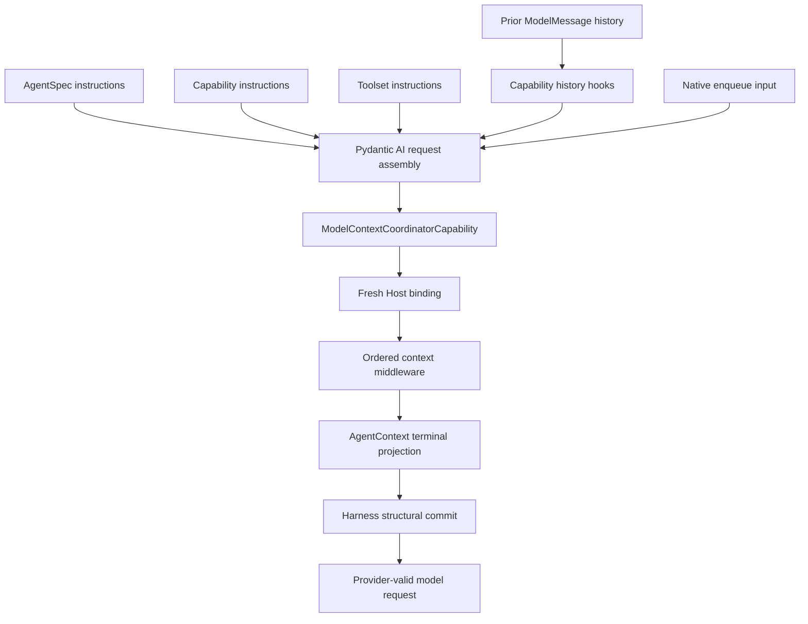
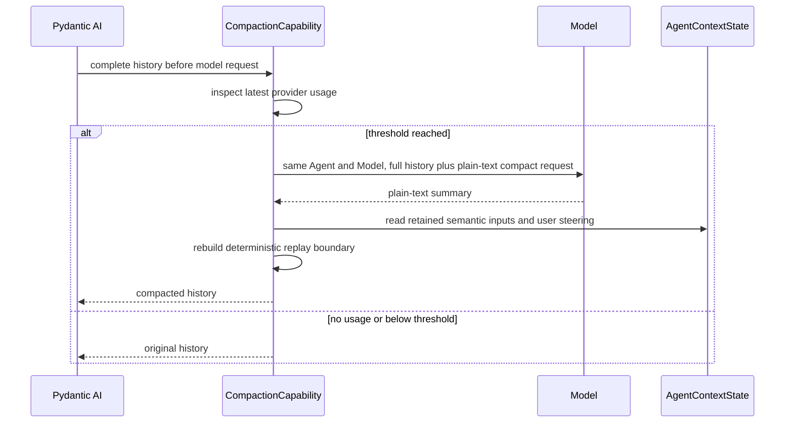

# Context, Working State, Resource Acquisition, and Memory

## Design Position

Pydantic AI assembles the stable model prefix from Agent, Capability, and Toolset instructions and owns active `ModelMessage` history. The Harness adds one typed request-overlay mechanism for dynamic model context. It does not define another instruction language, allow context middleware to edit messages directly, or treat rendered context as authoritative state.

The mandatory `ModelContextCoordinatorCapability` is the only Harness Capability that commits a `ModelContextProjection` to `ModelRequestContext` as a request overlay. Before ordinary history hooks run, it removes prior Harness-owned overlays from the active view. At the final model-request wrapper boundary, after those hooks and content filters, it recognizes an eligible request kind, evaluates one middleware chain, validates the result, and places the resulting blocks. The terminal source is `AgentContext.project_model_context()`, which combines the default Agent runtime/conversation projection with `BoundEnvironment.project_model_context()`. A fresh Host binding is semantically outermost; selected or plugin-contributed `AbstractModelContextCapability` instances compose between the Host and terminal source in Pydantic's already-finalized Capability order.

Working state, file context, skills, memory, and other Agent-loop behavior remain ordinary `AbstractCapability[AgentContext]` implementations. A feature that augments dynamic context implements the narrow model-context subtype rather than independently appending `UserPromptPart` values. `DynamicEnvironmentCapability` still owns the optional model tools, stable Environment guidance, and topology-change enqueue behavior; the Environment resource owns its provider-neutral current-topology projection and no Capability owns Environment lifecycle or authority. Query-dependent retrieval that must transform the complete semantic run input remains a Harness plugin concern, and that plugin may also contribute an ordinary model-context Capability.

## Context Layers



| Layer                    | Owner                                                                           | Representation                                           |
| ------------------------ | ------------------------------------------------------------------------------- | -------------------------------------------------------- |
| Authored Agent behavior  | `AgentSpec`                                                                     | Pydantic instructions                                    |
| Feature guidance         | Owning Capability                                                               | Capability instructions                                  |
| Tool usage guidance      | Owning Toolset or Capability                                                    | Toolset or Capability instructions                       |
| Interaction continuation | Pydantic AI                                                                     | `ModelMessage` history                                   |
| Trusted follow-up input  | Harness/Host through Pydantic                                                   | Native enqueue input                                     |
| Dynamic request overlay  | Harness coordinator, Host, AgentContext, Environment, and owning Capabilities   | Typed `ModelContextProjection` committed as user content |
| Provider compatibility   | Native `ModelProfile` and adapter; scoped Capability only for residual behavior | Profile rendering or bounded public-hook transformation  |

Instruction and context-middleware ordering both inherit Pydantic AI's finalized Capability composition. `CapabilityOrdering.wraps` and `wrapped_by` determine nesting, while `requires` only guarantees presence. The Harness does not introduce a context-specific priority, registration order, or second topological sort.

## Request Preparation

The standard Capability set performs the following semantic work without creating a global stage API:

1. validate imported message structure and apply the mandatory message-integrity Filter without rewriting provider semantics;
2. apply handoff, accepted enqueue content, completed background work, and explicit file references;
3. compact history when the configured budget requires it;
4. resolve current Environment projection, working-state, memory, and skill guidance;
5. finalize media and verify tool-call/result integrity before provider dispatch.

The list defines expected ordering relationships for first-party Capabilities. Native model adapters and `ModelProfile` own ordinary provider reasoning, tool-argument, and history projection compatibility. Only while the latest upstream lacks a required public seam may an exact-model-integration-scoped Capability apply a tested public-hook repair; it carries typed configuration and an upstream-removal condition and never becomes a standard global normalization stage. Third-party Capabilities compose through Pydantic ordering constraints rather than registering a named stage.

Dynamic content is data under the trust level of its source. Retrieved text, file content, tool output, topology notice, or a skill document cannot establish Identity, policy, credentials, or Environment authority.

## Model Context Projection Contract

The public values are immutable and detached from `ModelRequestContext`:

```python
class ModelContextRequestKind(StrEnum):
    INPUT = "input"
    TOOL_RESULTS = "tool_results"


class ModelContextInputOrigin(StrEnum):
    USER = "user"
    ENQUEUE = "enqueue"


class ModelContextPlacement(StrEnum):
    INPUT_PREAMBLE = "input_preamble"
    REQUEST_EPILOGUE = "request_epilogue"


@dataclass(frozen=True, slots=True)
class ModelContextProjectionRequest:
    kind: ModelContextRequestKind
    input_origin: ModelContextInputOrigin | None = None
    tool_call_ids: tuple[str, ...] = ()


@dataclass(frozen=True, slots=True)
class ModelContextBlock:
    source_id: str
    placement: ModelContextPlacement
    content: str


@dataclass(frozen=True, slots=True)
class ModelContextProjection:
    blocks: tuple[ModelContextBlock, ...] = ()


type ModelContextNext = Callable[
    [ModelContextProjectionRequest],
    Awaitable[ModelContextProjection],
]


class AbstractModelContextCapability(
    AbstractCapability[AgentContext],
):
    async def wrap_model_context(
        self,
        ctx: RunContext[AgentContext],
        request: ModelContextProjectionRequest,
        handler: ModelContextNext,
    ) -> ModelContextProjection: ...


class ModelContextMiddleware(Protocol):
    async def wrap_model_context(
        self,
        ctx: AgentContext,
        request: ModelContextProjectionRequest,
        handler: ModelContextNext,
    ) -> ModelContextProjection: ...
```

A model-context Capability normally awaits `handler(request)` and returns a transformed immutable projection. It can append its own stable source block, replace selected blocks, or intentionally short-circuit the inner chain. A Host binding has the same call-next, transform, replace, and short-circuit semantics and occupies the semantic outermost position. It is a fresh single-run collaborator in `RunBindings.model_context`, not a Capability, declarative value, persisted callback, or message hook. Plugin context contribution uses the existing `AbstractHarnessPlugin.get_capabilities()` path and the explicit Capability subtype; plugins receive no parallel context hook or ordering plane.

Pydantic's finalized run Capability mapping is the only source of middleware order. The coordinator selects values with `isinstance(value, AbstractModelContextCapability)` without dynamic method discovery, preserves that finalized order, and constructs the native wrapper nesting. The fixed semantic chain is:

1. fresh Host binding, when present;
2. finalized model-context Capabilities in native wrapper order;
3. `AgentContext.project_model_context(request)` as the terminal projection.

The terminal projection calls `BoundEnvironment.project_model_context(request)` and combines its ordered blocks with the bounded default Agent run/conversation projection. Environment contributes `INPUT_PREAMBLE` blocks only for an `INPUT` request. Agent run/conversation context contributes one `REQUEST_EPILOGUE` block for both `INPUT` and ordinary `TOOL_RESULTS` requests, using a more compact tool-results form. Current time, request usage, selected Host metadata, working tasks, notes, and other Capability-owned state remain projected by their owning model-context Capabilities rather than exposing opaque `AgentContextState` namespaces to the terminal source.

`ModelContextBlock.source_id` is stable, non-blank, bounded provenance, not ordering or authority. Contents are bounded text and retain the trust level of their source. Middleware never receives mutable messages. The final Harness commit, which no Host or Capability can bypass, validates source IDs, block counts, per-block and aggregate UTF-8 byte limits, and the two fixed placements; records Harness ownership metadata; and rejects malformed output before model dispatch. Limits apply after the complete outer chain, so replacement or short-circuit cannot bypass them.

## Eligible Requests and Placement

The coordinator classifies the complete final `ModelRequest`, after ordinary history transformation and content filtering, into one of these cases:

| Request kind                                  | Projection behavior                                                                              |
| --------------------------------------------- | ------------------------------------------------------------------------------------------------ |
| Ordinary user input                           | `INPUT`, `input_origin=USER`; both placements eligible                                           |
| Harness-accepted enqueue or startup notice    | `INPUT`; `input_origin=ENQUEUE` only with explicit producer provenance; both placements eligible |
| Ordinary complete tool-result batch           | `TOOL_RESULTS`; only `REQUEST_EPILOGUE` is eligible                                              |
| Output validation/tool retry                  | No projection and no message mutation                                                            |
| Deferred-tool exact resume                    | No projection or cleanup before the exact continuation advances                                  |
| Provider-suspended exact continuation         | No projection or cleanup before the exact continuation advances                                  |
| Any ambiguous or structurally invalid request | Fail through the existing request-integrity boundary rather than guessing a context request kind |

For `INPUT`, every `INPUT_PREAMBLE` block is inserted immediately before the first original input part and every `REQUEST_EPILOGUE` block is appended after the complete original request content. For `TOOL_RESULTS`, every original tool-result part in the batch remains contiguous and in original order; `REQUEST_EPILOGUE` blocks are appended only after the final result. Context is never inserted between tool calls and results, between sibling tool results, or into a provider-suspended/deferred exact tail. An `INPUT_PREAMBLE` result for `TOOL_RESULTS` is invalid.

On each non-exact preparation, the coordinator removes every previously committed Harness-owned overlay from the active message view before handoff, compaction, and other history transformation, without recognizing text markers or deleting caller content. At the final eligible boundary it resolves and commits one fresh projection. This cleanup is centralized: Environment, default, first-party, plugin, and Host middleware never scan or rewrite messages themselves. Dynamic context therefore behaves as a request overlay, is omitted from compaction summaries, is not exported as authoritative state, and is recomputed from fresh run bindings after resume.

Pydantic's ordinary text request shape does not reliably distinguish user input from enqueue input. When no producer-owned provenance is present, the coordinator classifies that shape as `input_origin=USER`; `USER` and `ENQUEUE` have identical placement and eligibility semantics. Implementations do not infer origin from text, timestamps, or run identifiers.

## Cache-stable Context Projection

Model-facing data has three cache classes:

- build-static behavior, including tool purpose, generic routing syntax, safety constraints, and provider-independent usage guidance, remains in the stable instruction and tool prefix;
- run-frozen model surface, such as an Environment-backed skill catalog required for the first request, is materialized once by the owning Capability's `for_run()` after scoped readiness, deterministically ordered, and immutable for that Harness run;
- request-dynamic context, including current Environment aliases, mounts, availability, runtime and working state, file references, background results, and topology changes, enters only through the typed overlay or native enqueue input after the stable prefix.

A run-frozen Capability returns a replacement whose `get_instructions()` and tool discovery read only frozen in-memory values and perform no provider, filesystem, or registry I/O. Pydantic re-extracts that replacement's contributions before the first model request. A provider cache breakpoint can separate the build-static prefix from a run-frozen catalog when the provider supports one; readiness and deterministic ordering prevent placeholder-to-real or mid-run mutations but do not claim a cross-run cache hit when catalog bytes differ.

Request-dynamic data never mutates instructions or tool schemas. A Capability that intentionally supports hot reload observes an explicit dynamic revision and enqueues one bounded trusted notice; the next eligible boundary receives a fresh overlay. Ordinary operation readiness stays inside the selected Environment operation and does not force unrelated model-surface preparation. Content that transforms history for correctness, including compaction and handoff, remains in the owning native history/model-request hook and executes before the coordinator's structural commit.

Every logical Harness run projects fresh Agent and Environment context at its first eligible input boundary even when restored and live topology versions match. A replacement `ExecutionAttempt` can materialize different descriptors, permissions, availability, generations, runtime usage, or working state under the same durable version, so cross-run equality never reuses rendered context. Within one entered run, every eligible input receives the current Environment block; later topology changes can additionally cause a coalesced trusted enqueue notice before that fresh projection. Provider-suspended and deferred exact continuations remain untouched until they advance, after which the first ordinary eligible boundary receives current context.

`DynamicEnvironmentCapability` can be omitted or configured by its Host. Environment lifecycle and the bounded provider-neutral Environment block remain available through the default terminal projection; the Capability adds model tools, stable routing guidance, live observation, and coalesced topology-change notices. With no model-visible binding, stable tools can report typed unavailability and later become usable after a Host mount. There is no global callback list, source priority, or arbitrary prompt-rewriting switch.

## Active Messages

Active history is the Pydantic AI `ModelMessage` sequence required to continue the Agent interaction. It is distinct from application conversation, display, audit, and analytics history.

Messages are appended only at complete semantic boundaries. Tool calls and results remain paired or use Pydantic deferred-tool semantics. Native model adapters produce provider-specific request projections and do not silently rewrite stored history. An owning Capability replaces history only for its actual Agent behavior, such as validated compaction, or under the narrow temporary integration-scoped repair rule above.

`HarnessState.message_history` uses the public Pydantic message codec. Imported metadata never restores Identity, approval, provider ownership, or Capability state.

## Runtime Context, Workspace Outline, File Context, and Handoff

Runtime context, workspace outline, and file context are optional definition-selected model-context Capability contributions. Authored guidance remains in stable instructions, while values that can change between logical runs enter as bounded request context. Each Capability owns its immutable configuration and projection switch; the Host enables, omits, and composes Capabilities rather than configuring a Harness-global context switch.

`WorkspaceOutlineCapability` projects a metadata-only file outline at `INPUT_PREAMBLE` on `INPUT` requests and contributes nothing to `TOOL_RESULTS`. Its default logical root is `.` and therefore resolves through the default binding and that binding's default working directory, never the Harness process working directory. Configuration bounds traversal depth, returned entries, UTF-8 bytes, provider calls, hidden-file inclusion, and whether an unavailable root is fatal. One projection uses `BoundEnvironment.select_files()` and `open_files()` to hold one exact binding revision for the compound scan, traverses directories in deterministic breadth-first order, stops as soon as any configured budget is reached, and marks the result truncated. It includes only logical path, file kind, and available size metadata; it never reads or embeds file content. A relevant route or generation change during the scan fails as stale rather than publishing a mixed-revision outline.

`FileContextCapability` projects bounded file contents at `REQUEST_EPILOGUE` on `INPUT` requests and contributes nothing to `TOOL_RESULTS`. By default it best-effort reads `AGENTS.md` relative to the default binding's default working directory. Its configuration can disable that conventional file and can add an ordered tuple of other logical paths; explicit paths continue to resolve through `BoundEnvironment`, including `/workspace`, `/environment/{alias}`, and relative forms. The conventional `AGENTS.md` is optional when absent, while `required=True` makes every explicit path mandatory. Files are materialized once in `for_run()`, detached and bounded before the first model request, and frozen for that logical run. Package installation and the Harness process working directory grant no ambient discovery authority.

An explicit file reference carries only a model-facing logical path and a bounded inspection reminder. It carries no file bytes, revision, digest, native path, provider handle, or claim that the file still exists. Pending references can use one versioned Capability namespace so replacement runs can remind the Agent to inspect them through the fresh Environment. Inspection never restores access that the new binding does not authorize.

`RuntimeContextCapability` emits one bounded `REQUEST_EPILOGUE` block on eligible requests. Its tool-results form is deliberately lightweight and can include elapsed logical-run time, configured model context-window size, and latest model-request token usage. The context-window size is explicit Runtime Capability configuration because the Harness has no provider-neutral guarantee that a native Model profile exposes it. Current time, cumulative run usage, and selected Host metadata remain independently configurable fields for input projections. Runtime context reports context facts only; it does not own summary-tool guidance.

`HandoffCapability` owns both the `summarize` tool guidance and its concise `TOOL_RESULTS` reminder. Its frozen configuration can disable that reminder or defer it until latest model-request usage reaches an explicit token threshold selected by the Host; a zero threshold reminds after every ordinary tool-result batch. When neither reminder field is explicitly set and Harness `AgentSpec.model_configuration` is present, the builder derives the threshold as `int(context_window * proactive_context_management_threshold)`; the default ratio is 65%, and `None` disables the automatic reminder. The reminder neither triggers compaction nor implies that the provider has accepted a larger request. Keeping this policy with the summary tool avoids coupling generic runtime projection to one optional context-management behavior.

An explicit `summarize` handoff uses its own validated history-replacement path. It preserves the original request as native structured `UserContent`, including multimodal values, rather than extracting only plain text; the continuation summary and file reminders remain separately identifiable context. A pending `DeferredToolRequests` boundary is not part of the replaceable prefix: its exact suspended message tail, call IDs, categories, and message identity remain unchanged through authoritative resume validation until matching results are incorporated. Provider-suspended continuation receives the same protection. Only after those exact continuations advance can a validated replacement become ordinary active messages and reintroduce pending handoff guidance once.

Handoff reminder thresholds consult only the latest provider-reported usage and never replace provider enforcement. Automatic plain-text compaction is the independent Capability contract below. [Events and Usage](12-events-observability-and-usage.md#first-party-event-contracts) owns the bounded context observations for both paths.

## Working State Capability

Tasks and notes form one optional Working State Capability. It owns their model tools, bounded request-time presentation, and one versioned `AgentContextState` namespace; it is coordination context rather than execution authority, a scheduler, or a durable business workflow.

Task references use concise scope-local `task-{N}` values allocated monotonically by the authoritative task store. Creation, claims, dependencies, and updates share one internal revision boundary so concurrent Agents cannot reuse an ID or silently overwrite newer state. Ordinary model tools expose intent-level create, start, update, and complete operations without requiring the Agent to orchestrate claims or compare-and-swap revisions. Completed tasks remain available through explicit task reads but leave bounded request-time context. Notes remain private to one Agent instance. Committed task changes produce only the bounded deltas owned by [Events and Usage](12-events-observability-and-usage.md#first-party-event-contracts).

The definition fixes one task mode:

- `embedded` stores the complete immutable task snapshot in Capability state and is the default;
- `provider` requires a fresh typed `TaskStateRunCapability` whose identity-bound cell owns reads and linearizable mutations. Only bounded non-authoritative cursor metadata may enter Harness State; provider clients, credentials, scopes, and fences do not.

Inline children receive either an explicit identity-bound shared task view or an isolated task scope according to delegation policy. A borrowed child view never copies the parent's task state or broader `AgentContext` into the child snapshot. Process-local Hosts may deliberately retain an embedded cell for background children; distributed Hosts use a provider with equivalent compare-and-swap, idempotency, and stale-owner reconciliation semantics.

Missing, duplicate, source-incompatible, or mode-incompatible run collaborators fail before task tools are exposed. Restored state cannot select a provider, scope, or current authority.

## Structured User Interaction

Structured questions use the native client-side deferred-tool boundary owned by [Tool Execution](07-tool-execution.md#structured-user-questions). This document adds no second interaction lifecycle or answer representation.

## Operational Context Capabilities

Small operational behaviors remain separate when their state and lifecycle differ:

| Capability          | Behavior                                                                 | State                                                                                                          |
| ------------------- | ------------------------------------------------------------------------ | -------------------------------------------------------------------------------------------------------------- |
| Enqueue/messaging   | Uses Pydantic enqueue to deliver accepted steering or follow-up input    | The Harness retains accepted user steering when compaction is enabled; native enqueue owns active-run delivery |
| Monitored process   | Starts through `BoundEnvironment` and delivers a bounded completion      | Live observation and completion routing stay with a fresh Host collaborator                                    |
| File reference      | Tells the Agent which explicit files require inspection                  | Bounded pending logical paths only                                                                             |
| Workspace outline   | Projects a bounded metadata-only view of one Environment file root       | Recomputed from one revision-pinned `BoundEnvironment` scan; no continuation state                             |
| Dynamic Environment | Composes File/Shell tools with current topology context and live notices | Recomputed from `BoundEnvironment`; owns no continuation namespace                                             |
| Skill               | Supplies selected skill instructions and resources                       | Loaded skill IDs only when needed for continuation                                                             |
| Media               | Normalizes media count, size, format, and provider representation        | No raw provider URL credential state                                                                           |

These Capabilities use native instructions, history/request hooks, native enqueue, Model Context Projection, or Toolsets. A global projection switch is unnecessary; a Host enables, disables, or configures the owning Capability without rewriting other instruction sources.

A monitored-process Capability requires the finalized `DynamicEnvironmentCapability`, shares its single run-local compact-reference domain, and composes `MonitoredProcessToolset` to start work only through the live `BoundEnvironment`. One fresh `MonitoredProcessRunCapability` supplies the typed Host collaborator; a missing or incompatible projection or collaborator fails before model exposure. The Toolset gives the exact bound process value to that collaborator, which owns waiting, wake-up, bounded completion retention, duplicate suppression, and accepted delivery. The Capability owns run binding, lifecycle hooks, and delivery of accepted completions rather than duplicating per-call tool semantics. Process status exposes only processes already started or observed in that scoped model surface and is not provider-wide or operating-system process discovery.

Live observation cannot outlive the entered Environment. Run termination cancels and drains process-local monitoring before Environment close. A Host can deliver an already completed bounded record to a later Harness run, but it cannot restore or reattach a run-local compact reference from `HarnessState`. A durable Host that deliberately owns work beyond one run must also own a separate provider attachment and completion ledger outside the Harness.

## Skills and Discovery

Selecting `SkillsCapability()` installs one canonical optional Environment source and no others. It scans only the logical root `/workspace/.agents/skills`, corresponding to `.agents/skills` in the default workspace binding. The root itself can be one skill package, and each immediate child directory can be one skill package; discovery is not recursive beyond that level. A missing or unsupported default root produces an empty catalog, while an existing but unauthorized or invalid root fails explicitly.

`SkillManager` is the public Host-reusable scanning boundary inside `a13n-harness`. Selected `SkillSource` values discover bounded metadata through the public `FileOperator` contract, and selected `SkillMaterializer` values can populate their declared target through the same contract before scanning. The manager owns frontmatter parsing, source ordering, identity conflicts, catalog limits, path containment, and regular `SKILL.md` validation; it has no `AgentContext`, Pydantic AI, or model-instruction dependency. A materializer is trusted Host code; `target_root` is a composition and provenance declaration, not a sandbox. The materializer contract requires writes to remain beneath that root, while actual write authority remains the supplied FileOperator or entered Environment.

The manager exposes two explicit scan modes. `scan(files=...)` operates directly in the caller-supplied FileOperator namespace and returns immutable `SkillCatalogItem` values. It is appropriate when a CLI or another Host owns a stable local FileOperator and controls concurrent retargeting itself; the Harness adds no virtual path or topology semantics to that mode. Roots are absolute paths in that operator's namespace, so a root-confined local operator can use `/.agents/skills` without constructing an Environment. `scan_environment(environment=...)` uses `BoundEnvironment.select_files()` and `open_files()` to hold every selected root on one exact binding revision while materialization, listing, frontmatter reads, and final validation run. Multiple roots can cross bindings and are routed through private revision-pinned scopes. Before returning, the manager reselects every configured scan root, including empty and conflict-overridden roots, so a relevant route change cannot produce a silently incomplete catalog.

The Environment-aware result is a `BoundSkillCatalog`. Every `BoundSkillCatalogItem` retains its logical path, source provenance, resolved directory and `SKILL.md` `EnvironmentPath`, and observed provider generation. `BoundSkillCatalog.require_current(environment)` reselects only catalog-bearing logical paths and fails with `skill_catalog_stale` when a default route, alias, binding revision, provider generation, or resolved provider path no longer matches. Unrelated topology changes remain valid. A stale catalog is never silently rescanned or retargeted because instructions, provenance, and provider cache input remain frozen for the logical run.

A Host can construct `SkillManager.default(additional_sources=...)` to retain the canonical Environment source first and append ordered sources with independent provenance and normal conflict precedence. Passing an explicit `SkillManager` to `SkillsCapability` replaces the default composition completely. The default's `/workspace/.agents/skills` path is an Environment selector; a direct FileOperator caller supplies an explicit manager whose roots use that operator's namespace. No home directory, package metadata, sibling workspace directory, or other filesystem location is scanned merely because the Skills Capability is installed.

A `FileSkillSource` exposes its exact canonical absolute `roots` in the selected FileOperator namespace. With `required=True`, every declared root is required. With `required=False`, each missing, unroutable, or unsupported root is skipped independently, so another explicitly declared and available root in the same source can still contribute skills. Permission denial, a malformed path, malformed skill content, and provider failures remain errors in either mode.

The two scan modes are explicit and have no fallback dispatch. `scan(files=...)` never constructs or probes an Environment. `scan_environment(environment=...)` never retries through the unpinned `BoundEnvironment.files` facade or direct scan mode. A source never substitutes the process working directory, home directory, package location, or another workspace root for a declared root. A stale bound route fails explicitly and never causes automatic rescan or retargeting. The first-version public contract exposes only `FileSkillSource`, `SkillSource.roots`, and `SkillManager.roots`; no compatibility aliases exist.

An Environment-aware Host such as Agent UI calls `scan_environment(environment=...)` against an entered Environment to scan, preview, or import Skill packages without constructing an Agent or starting a Harness run. A CLI-style Host that directly controls a non-virtual FileOperator calls `scan(files=...)`. Host resource CRUD, source configuration, immutable revision manifests, content digests, package copying, and persistence remain Host concerns rather than `SkillManager` behavior.

For a Harness run, `SkillsCapability` invokes `scan_environment()`, applies the fresh Host selection, requires the selected bound catalog to remain current, and publishes the bounded deterministic run catalog. It repeats the relevant-path fence before each model request and before and after each tool execution, so a concurrent relevant retarget fails rather than exposing content under a different revision. By default, the complete resolved catalog becomes the model-facing catalog for that logical run. A Host can instead provide one fresh `SkillSelectionRunCapability` in `RunBindings.capabilities`; its exact set of final skill names replaces that default for the run. A non-empty set injects only those names, an empty set injects no skills or routing instructions, and any name absent from the conflict-resolved discovered catalog fails run preparation. The override is an allowlist, not a pattern language, exclusion list, source selector, or durable setting.

Selection occurs after source discovery and identity-conflict resolution but before model instructions, `SkillPath` publication, access observation, or continuation reconciliation. It therefore narrows model exposure without changing source readiness or catalog validation. It never grants a source, materializes an unselected source on its own, expands Environment access, or makes an unselected skill path receive skill-specific file treatment. Absence of the run Capability preserves the definition-selected default rather than meaning an empty selection.

Each skill has stable identity, source provenance, instructions, and bounded resources. Conflicting identities fail preparation unless the authored source composition selects an explicit precedence. Activation and resource loading remain inside the selected source boundary, preserve provenance, and do not mutate the built Agent or grant tools, credentials, Environment access, or package authority. Skill text is untrusted context under the authority of its selected source.

Every built-in or external skill owner publishes its selected directories as resolved `SkillPath` values on the logical-run `AgentContext`. The publication records skill and source identity but grants no Environment access; the current binding remains authoritative. The reusable File Toolset classifies Markdown beneath those exact resolved directories without inspecting a Skills Capability type. An ordinary initial `view` of such a file raises its finite provider page request so the Toolset attempts a complete read, and it uses the 20,000-character final result ceiling rather than the ordinary 12,000-character semantic target. A document that still does not fit returns only complete leading lines plus `next_line_offset`; later `view` calls continue from that exact source line without bypassing validation, redaction, byte policy, or the final character ceiling. Markdown outside published skill directories receives ordinary file disclosure behavior.

The File Toolset also exports `FILE_VIEW_RULES: ToolMetadataKey[FileViewRule]`. An external Capability may publish resolved-root and suffix selectors with finite requested line, page, semantic-output, and complete-line behavior. Matching rules only widen the ordinary profile; the File Toolset clamps every requested value to its own provider-page and 20,000-character final hard limits. The key is an open typed extension contract, not a registry of approved Capability classes, and a rule carries no callable selector or file authority.

Loaded skill identities enter versioned Capability state only when continuation needs to avoid losing an accepted activation. On every resumed run, each restored identity must resolve against the fresh Host-selected run catalog with the same stable provenance; state never triggers ambient package/workspace discovery, restores an earlier Host allowlist, or mounts a source. A missing, provenance-changed, ambiguous, or newly unauthorized activation fails before model exposure by default. An explicitly configured permissive policy may deactivate it with a bounded diagnostic instead, but never resolves outside the selected catalog. Resource contents, provider clients, filesystem revisions, discovery handles, and Host selection do not enter portable state. Root and child runs receive independent fresh selections; delegation does not inherit a parent allowlist unless the Host deliberately supplies the same names in the child's complete `RunBindings`. Optional tool discovery or proxying uses the native Tool Manager path described in [Tool Execution](07-tool-execution.md) and does not create a second dispatch or authorization path.

## Media, Documents, and Web Resources

Media, document conversion, and web acquisition are separate optional Capabilities, each composing a reusable feature Toolset rather than contributing a catch-all Toolset. The Toolset owns model-visible schemas and per-call semantics directly over its natural provider ports; the Capability selects and binds fresh run collaborators, preserves provenance, and owns only Agent-loop lifecycle or hooks. Media inputs preserve supported native Pydantic content where possible. Document conversion produces bounded text and explicitly owned extracted assets. Unavoidable blocking parsers run outside the event loop, and every temporary asset has one cleanup owner.

Web search is backed by an explicitly selected provider. The Web Toolset applies an explicitly selected async network client and live policy with finite redirects, deadlines, and byte limits. Every redirect is re-evaluated under current policy, and credentials remain audience-bound. A download reaches the workspace only through `BoundEnvironment` streaming operations and current Environment authorization; a URL never becomes Environment authority.

Remote content, converted text, metadata, and skill resources retain provenance and remain untrusted model context. Raw credentials, provider clients, temporary native paths, and live response objects never enter model results or `HarnessState`. Optional providers and conversion dependencies are inert until a Host selects the corresponding Capability.

## Compaction Capability

Compaction replaces an eligible history with a cache-friendly plain-text summary and a deterministic replay boundary.

```python
class CompactionPolicy(BaseModel):
    trigger_tokens: int

class CompactionCapability:
    def __init__(self, policy: CompactionPolicy | None = None) -> None: ...
```

An explicit `trigger_tokens` remains an absolute Host-selected threshold and takes precedence. `CompactionCapability()` without a policy asks the builder to derive the absolute trigger from Harness `AgentSpec.model_configuration` as `int(context_window * compact_threshold)`; the default ratio is 90%. Automatic resolution requires a known context window and does not infer one from the model name. The Capability consults only the most recent `ModelResponse.usage` reported by the provider and triggers when its input-plus-output token count reaches the resolved threshold. A history with no provider usage does not compact; the Harness does not serialize messages to estimate tokens.



The nested compact run is implemented by the same Pydantic Capability and a shallow copy of the current Agent. It keeps the effective Model, system prompts, instructions, and tool definitions cache-compatible, requests `str` output, disables provider tool selection for the nested request, and permits only one additional model request within all outer usage ceilings. The mandatory execution boundary also rejects any function-tool dispatch if a provider violates that request. It does not call or depend on the `summarize` tool or Handoff Capability. A run-local recursion guard prevents nested compaction.

A successful replacement has this fixed order:

1. one synthetic compact request preserving the stable system and instruction prefix;
2. one plain-text summary response marked as compact-retained content;
3. one restored-context request with any immediately preceding visible assistant response needed to resolve references;
4. the run's initial semantic inputs and every user steering input accepted through `HarnessRunStream.steer()`.

Retained user inputs preserve native structured `UserContent`, including multimodal values, rather than flattening them to text. They live in one versioned Capability-state namespace so repeated compaction and a later Harness run can reconstruct the same user context. The ledger is append-only: compaction does not clear it. It records only semantic run inputs and public user steering; internal topology, process, or other Capability calls to `RunContext.enqueue()` are not retained as user intent. Retention favors not losing accepted context over exact-once replay, so a rare boundary race may cause an accepted steering input to appear once through native delivery and again in a later compact replay.

The compact summary replaces tool traffic only after the nested request succeeds. Transient Environment and working-state projections are resolved again at the next ordinary request. Native multimodal compatibility remains owned by [Input, Model, and Output Boundaries](16-input-model-and-output.md#request-and-history-filters), and oversized tool results remain owned by [Tool Execution](07-tool-execution.md#dispatch-retry-and-results); compaction creates no estimator, spill, target-size trimmer, or durable message bus.

Ordinary compact-run failures, including an empty plain-text summary, emit a bounded `compaction_failed` observation and leave the original history unchanged. Cancellation propagates. This fail-open rule does not turn the compact summary into an authoritative durable fact and does not conceal provider context-limit failures if the original request still exceeds its actual window.

## Memory Integration

Long-term memory is an optional integration backed by a narrow provider. Its placement follows the boundary it needs rather than forcing retrieval, model tools, and observation into one lifecycle type.

```python
class MemoryProvider(Protocol):
    async def recall(
        self,
        request: MemoryRecallRequest,
    ) -> Sequence[MemoryItem]: ...

    async def observe(
        self,
        observation: MemoryObservation,
    ) -> None: ...
```

A query-dependent recall plugin derives memory scope from trusted Agent Identity and actor bindings, inspects the canonical semantic input after `RunInputFactory`, asks the provider for bounded relevant items, and appends provenance-preserving user content through the plugin's semantic-input boundary before content resolution. Its selected catalog registration can capture an authority-neutral `MemoryProvider` port; every provider call receives the trusted scope derived from the shared `AgentContext`, while the provider remains responsible for live policy and credentials. The factory itself carries no current-run authority. Its plugin-contributed Capability or Toolset can expose explicit model-directed memory search and update tools, request-level context behavior, or versioned continuation metadata. Result middleware or a Capability can observe validated output, pre-compaction history, a validated summary, or terminal messages according to the selected policy.

Memory items retain source and scope metadata. They are untrusted context and cannot carry grants, credentials, delegation authority, or Environment handles.

Provider writes can be inline when required for consistency or emitted as host work. A plugin result hook observes only a process-local result candidate and does not make the write durable by observation alone. Durable extraction, consolidation, retention, and scheduling belong to the host or memory provider. No background memory task is allowed to outlive a process-local harness run without explicit host ownership.

## State Ownership

| State                                        | Owner                                                                                             |
| -------------------------------------------- | ------------------------------------------------------------------------------------------------- |
| Active Pydantic messages                     | `HarnessState.message_history`                                                                    |
| Embedded task snapshot and notes             | Working State Capability; inline children can receive an explicit task view                       |
| Provider-backed task data and scope          | Host task provider; Working State exports only an optional observed cursor                        |
| Pending handoff and logical file references  | Owning context Capabilities                                                                       |
| Loaded skills or discovered tools            | Owning discovery Capability                                                                       |
| Retained semantic inputs and user steering   | Mandatory steering bridge namespace when automatic compaction is enabled                          |
| Monitored-process tasks and completion route | Host collaborator; Capability state can retain only incorporated completion IDs                   |
| Temporary media/document/web content         | Owning Capability or selected provider until bounded projection and cleanup                       |
| Long-term memory records                     | Memory provider; plugin instances own no durable namespace                                        |
| Portable multi-Environment backend state     | Explicit `HarnessState.environment_state`; launch and native resources remain Host/provider-owned |
| Host delivery, counters, and scheduler work  | Host                                                                                              |

## Resume and Delegation

A resumed run enters fresh Host-selected Environment bindings, restores only compatible portable Environment data, imports messages and Capability state, and then resolves working-state, skill, memory, and model-facing Environment content through fresh run-bound behavior. Rendered topology context is not restored as authority. The first eligible ordinary model boundary receives a fresh request-hook snapshot regardless of durable topology-version equality; if execution begins without ordinary input, one trusted startup boundary can carry it. A provider-suspended tail remains untouched until a later ordinary boundary. Fresh policy can remove access that existed in an earlier run.

A child run receives an explicit context seed and a fresh `AgentContext`. Parent messages or summaries transfer only when delegation policy selects them. The Delegation Capability stores each child's private `HarnessState`, including its independent message history, for later resume. Parent and child never share mutable message lists, a whole `AgentContextState`, or a whole `AgentContext`; only the Working State task cell can cross the inline state boundary.

## Failure Semantics

| Failure                                                                | Result                                                                                                               |
| ---------------------------------------------------------------------- | -------------------------------------------------------------------------------------------------------------------- |
| Imported messages are invalid                                          | Run creation fails before provider work                                                                              |
| Optional dynamic guidance is unavailable                               | Owning Capability omits it and emits a diagnostic                                                                    |
| Required guidance or memory fails                                      | Model step fails                                                                                                     |
| Shared task binding is missing or incompatible                         | Inline child dispatch fails before child model/tool work                                                             |
| Task claim conflicts or uses a stale revision                          | Typed conflict; the existing task owner and state remain unchanged                                                   |
| Structured question cannot be correlated or validated                  | Deferred resume fails under [Tool Execution](07-tool-execution.md#structured-user-questions)                         |
| Skill catalog is invalid or ambiguous                                  | Run preparation fails before model exposure                                                                          |
| Host skill selection names no discovered skill                         | Run preparation fails before instructions or skill-path publication                                                  |
| A catalog-bearing Environment route changes during scanning or run use | The bound scan or next model/tool boundary fails with `skill_catalog_stale`; unrelated topology changes remain valid |
| Monitor binding is missing or no longer live                           | Process start or completion attachment fails explicitly                                                              |
| Resource exceeds policy or conversion fails                            | Owning tool returns a bounded typed failure and cleans its partial assets                                            |
| Compaction output is invalid                                           | Original history remains active                                                                                      |
| Context exceeds the provider limit after policy                        | Model step fails with a bounded context error                                                                        |
| Memory observation fails                                               | Owning policy chooses run failure or Host retry; history remains valid                                               |

## Boundaries

| Concern                                             | Owner                                        |
| --------------------------------------------------- | -------------------------------------------- |
| Semantic-input memory recall and result observation | [Harness Plugin System](05-plugin-system.md) |
| Instruction and history composition                 | Pydantic AI and owning Capabilities          |
| Active messages and namespaced run state            | Harness                                      |
| Long-term memory storage and consolidation          | Memory provider or host                      |
| Application conversation and display history        | Host                                         |
| Provider context limits and request acceptance      | Model provider                               |

## Trade-offs

### Direct Pydantic Composition vs. Context Framework

Direct instructions, public model-request hooks, native enqueue, and Capability composition keep one ordering and lifecycle model. Cross-cutting context inspection is less centralized, so first-party Capabilities provide bounded events and observations for diagnostics. Keeping run-specific topology out of `get_instructions()` preserves the provider-cache prefix at the cost of repeating a bounded snapshot on relevant user turns.

### One Working State Capability vs. Independent Managers

Tasks and notes share tool presentation and one state owner without turning `AgentContext` into a collection of managers. A typed task cell supports atomic parent/child coordination, while notes, messages, and unrelated Capability state remain isolated.

### Host-owned Memory Work vs. Automatic Background Tasks

Host scheduling survives process loss and supports provider retries. Embedded applications that need only recall can use an in-process provider without installing a scheduler.
