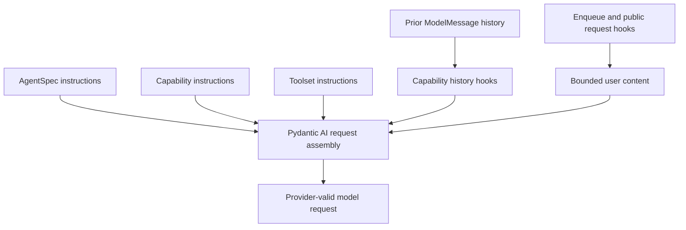
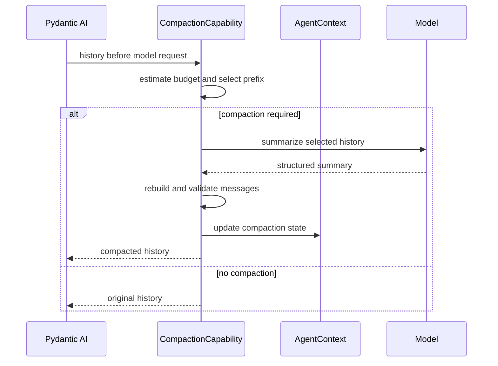

# Context, Working State, Resource Acquisition, and Memory

## Design Position

Model context is assembled by Pydantic AI from Agent instructions, Capability instructions, Toolset instructions, prior messages, ordinary user content, native enqueue input, and public Capability history/model-request hooks. The Harness defines no parallel prompt language or custom user-content part. Dynamic first-party context uses the public `before_model_request(ctx, ModelRequestContext)` boundary or `RunContext.enqueue()` according to whether it augments an eligible request or creates trusted follow-up input.

Working state, compaction, skills, media normalization, and behavior inside the Pydantic Agent loop are ordinary `AbstractCapability[AgentContext]` implementations. `DynamicEnvironmentCapability` is the optional model projection of the fixed Harness Environment resource; it is not the resource owner. Query-dependent context retrieval that must inspect and modify the complete semantic run input can instead be a first-class Harness plugin, which may contribute Capabilities. Each plugin or Capability owns its typed configuration, ordering, and failure behavior; portable Environment state remains core-owned, ordinary feature state remains Capability-owned, and durable provider launch state remains Host-owned.

## Context Layers



| Layer                    | Owner                                                                           | Representation                                          |
| ------------------------ | ------------------------------------------------------------------------------- | ------------------------------------------------------- |
| Authored Agent behavior  | `AgentSpec`                                                                     | Pydantic instructions                                   |
| Feature guidance         | Owning Capability                                                               | Capability instructions                                 |
| Tool usage guidance      | Owning Toolset or Capability                                                    | Toolset or Capability instructions                      |
| Interaction continuation | Pydantic AI                                                                     | `ModelMessage` history                                  |
| Dynamic run context      | Owning Capability or Environment projection                                     | Public model-request hook or native enqueue input       |
| Provider compatibility   | Native `ModelProfile` and adapter; scoped Capability only for residual behavior | Profile rendering or bounded public-hook transformation |

Instruction ordering follows Pydantic AI Capability composition. A Capability declares only the dependencies required for correctness through `CapabilityOrdering`.

## Request Preparation

The standard Capability set performs the following semantic work without creating a global stage API:

1. validate imported message structure and apply the mandatory message-integrity Filter without rewriting provider semantics;
2. apply handoff, accepted enqueue content, completed background work, and explicit file references;
3. compact history when the configured budget requires it;
4. resolve current Environment projection, working-state, memory, and skill guidance;
5. finalize media and verify tool-call/result integrity before provider dispatch.

The list defines expected ordering relationships for first-party Capabilities. Native model adapters and `ModelProfile` own ordinary provider reasoning, tool-argument, and history projection compatibility. Only while the latest upstream lacks a required public seam may an exact-model-integration-scoped Capability apply a tested public-hook repair; it carries typed configuration and an upstream-removal condition and never becomes a standard global normalization stage. Third-party Capabilities compose through Pydantic ordering constraints rather than registering a named stage.

Dynamic content is data under the trust level of its source. Retrieved text, file content, tool output, topology notice, or a skill document cannot establish Identity, policy, credentials, or Environment authority.

## Cache-stable Context Injection

Model-facing data has three cache classes:

- build-static behavior, including tool purpose, generic routing syntax, safety constraints, and provider-independent usage guidance, remains in the stable instruction and tool prefix;
- run-frozen model surface, such as an Environment-backed skill catalog required for the first request, is materialized once by the owning Capability's `for_run()` after scoped readiness, deterministically ordered, and immutable for that Harness run;
- request-dynamic context, including current Environment aliases, mounts, availability, working state, background results, and topology changes, enters through native enqueue or an owning public history/model-request hook after the stable prefix.

A run-frozen Capability returns a replacement whose `get_instructions()` and tool discovery read only frozen in-memory values and perform no provider, filesystem, or registry I/O. Pydantic re-extracts that replacement's contributions before the first model request. A provider cache breakpoint can separate the build-static prefix from a run-frozen catalog when the provider supports one; readiness and deterministic ordering prevent placeholder-to-real or mid-run mutations but do not claim a cross-run cache hit when catalog bytes differ.

Request-dynamic data never mutates instructions or tool schemas. A Capability that intentionally supports hot reload observes an explicit dynamic revision and injects a bounded notice; it does not silently rescan and alter a cacheable prefix. Ordinary operation readiness stays inside the selected Environment operation and does not force unrelated model-surface preparation.

For an eligible request containing ordinary user content, `DynamicEnvironmentCapability.before_model_request()` appends bounded current topology through `ModelRequestContext` after the caller's content without changing the stable instruction/tool prefix. When topology changes while an inner run can accept input, the Capability uses native `RunContext.enqueue()` for one coalesced trusted notice. Working state, file references, and similar Capabilities can use the same public request hook when their data belongs to a user turn; content that transforms history for correctness remains in an owning Pydantic history Capability.

Context injection runs only on a request containing ordinary user content or a trusted semantic notice. It does not append the full Environment snapshot to tool-return-only or output-retry requests, which would destabilize provider caching and repeat unchanged content. The Environment core exposes the successfully imported value only as `BoundEnvironment.restored_state_topology_version`; the optional projection reads that non-authoritative observation without owning an Environment state namespace.

Every new logical Harness run contributes one fresh bounded Environment snapshot at its first eligible ordinary model boundary, even when the restored and live topology version numbers match. A replacement worker can materialize different effective descriptors, permissions, availability, or provider generations under the same durable desired version, so cross-run version equality never suppresses current context. A fresh no-input run can create one trusted startup boundary for this snapshot. Within that entered run, unchanged same-version boundaries do not repeat it, and later topology changes produce bounded notices. Provider-suspended history is the exception: it resumes without inserting a request ahead of the suspended provider continuation. The first later ordinary turn receives the latest fresh live snapshot rather than persisted rendered instructions from `HarnessState`.

`DynamicEnvironmentCapability` can be omitted or configured by its Host. Environment lifecycle, programmatic operations, and dynamic topology remain available without it; only model tools, rendered routing context, and notices disappear. With no model-visible binding its stable tool surface can report typed unavailability and later become usable after a Host mount. There is no global boolean that mutates unrelated Toolset instructions and no callback list for arbitrary prompt rewriting.

## Active Messages

Active history is the Pydantic AI `ModelMessage` sequence required to continue the Agent interaction. It is distinct from application conversation, display, audit, and analytics history.

Messages are appended only at complete semantic boundaries. Tool calls and results remain paired or use Pydantic deferred-tool semantics. Native model adapters produce provider-specific request projections and do not silently rewrite stored history. An owning Capability replaces history only for its actual Agent behavior, such as validated compaction, or under the narrow temporary integration-scoped repair rule above.

`HarnessState.message_history` uses the public Pydantic message codec. Imported metadata never restores Identity, approval, provider ownership, or Capability state.

## Runtime Context, File References, and Handoff

Runtime context and file context are optional definition-selected Capability contributions. Authored guidance remains in stable instructions, while values that can change between logical runs enter as bounded request context. File context reads only explicitly selected files through an authorized source such as the current `BoundEnvironment`; package installation or the process working directory does not grant ambient discovery authority.

An explicit file reference carries only a model-facing logical path and a bounded inspection reminder. It carries no file bytes, revision, digest, native path, provider handle, or claim that the file still exists. Pending references can use one versioned Capability namespace so replacement runs can remind the Agent to inspect them through the fresh Environment. Inspection never restores access that the new binding does not authorize.

Compaction and explicit `summarize` requests use the same validated history-replacement path. A handoff preserves current user intent, relevant file references, and enough provenance to distinguish summarized history from new input. A pending `DeferredToolRequests` boundary is not part of the replaceable prefix: its exact suspended message tail, call IDs, categories, and message identity remain unchanged through authoritative resume validation until matching results are incorporated. Provider-suspended continuation receives the same protection. Only after those exact continuations advance can a validated replacement become ordinary active messages and reintroduce pending handoff guidance once.

Context-window estimates guide compaction but never replace provider enforcement. A configured recent-turn tail is protected continuation context, not an optional trimming pool. If validated compaction cannot produce a provider-valid request within the configured budget while retaining that tail, the request fails explicitly rather than silently dropping current intent or unresolved work.

## Working State Capability

Tasks and notes form one optional Working State Capability. It owns their model tools, bounded request-time presentation, and one versioned `AgentContextState` namespace; it is coordination context rather than execution authority, a scheduler, or a durable business workflow.

Task references use concise scope-local `task-{N}` values allocated monotonically by the authoritative task store. Creation, claims, dependencies, and updates share one internal revision boundary so concurrent Agents cannot reuse an ID or silently overwrite newer state. Ordinary model tools expose intent-level create, start, update, and complete operations without requiring the Agent to orchestrate claims or compare-and-swap revisions. Completed tasks remain available through explicit task reads but leave bounded request-time context. Notes remain private to one Agent instance.

The definition fixes one task mode:

- `embedded` stores the complete immutable task snapshot in Capability state and is the default;
- `provider` requires a fresh typed `TaskStateRunCapability` whose identity-bound cell owns reads and linearizable mutations. Only bounded non-authoritative cursor metadata may enter Harness State; provider clients, credentials, scopes, and fences do not.

Inline children receive either an explicit identity-bound shared task view or an isolated task scope according to delegation policy. A borrowed child view never copies the parent's task state or broader `AgentContext` into the child snapshot. Process-local Hosts may deliberately retain an embedded cell for background children; distributed Hosts use a provider with equivalent compare-and-swap, idempotency, and stale-owner reconciliation semantics.

Missing, duplicate, source-incompatible, or mode-incompatible run collaborators fail before task tools are exposed. Restored state cannot select a provider, scope, or current authority.

## Structured User Interaction

Structured questions use the native client-side deferred-tool boundary owned by [Tool Execution](07-tool-execution.md#structured-user-questions). This document adds no second interaction lifecycle or answer representation.

## Operational Context Capabilities

Small operational behaviors remain separate when their state and lifecycle differ:

| Capability          | Behavior                                                                 | State                                                                                            |
| ------------------- | ------------------------------------------------------------------------ | ------------------------------------------------------------------------------------------------ |
| Enqueue/messaging   | Uses Pydantic enqueue to deliver accepted steering or follow-up input    | Delivery acceptance stays with Host; incorporated IDs only when needed for duplicate suppression |
| Monitored process   | Starts through `BoundEnvironment` and injects a bounded completion       | Live observation and completion routing stay with a fresh Host collaborator                      |
| File reference      | Tells the Agent which explicit files require inspection                  | Bounded pending logical paths only                                                               |
| Dynamic Environment | Composes File/Shell tools with current topology context and live notices | Recomputed from `BoundEnvironment`; owns no continuation namespace                               |
| Skill               | Supplies selected skill instructions and resources                       | Loaded skill IDs only when needed for continuation                                               |
| Media               | Normalizes media count, size, format, and provider representation        | No raw provider URL credential state                                                             |

These Capabilities use native instructions, history/request hooks, native enqueue, or Toolsets. A global context-injection switch is unnecessary; a Host enables, disables, or configures the owning Capability without rewriting other instruction sources.

A monitored-process Capability requires the finalized `DynamicEnvironmentCapability`, shares its single run-local compact-reference domain, and composes `MonitoredProcessToolset` to start work only through the live `BoundEnvironment`. One fresh `MonitoredProcessRunCapability` supplies the typed Host collaborator; a missing or incompatible projection or collaborator fails before model exposure. The Toolset gives the exact bound process value to that collaborator, which owns waiting, wake-up, bounded completion retention, duplicate suppression, and accepted delivery. The Capability owns run binding, lifecycle hooks, and injection of accepted completions rather than duplicating per-call tool semantics. Process status exposes only processes already started or observed in that scoped model surface and is not provider-wide or operating-system process discovery.

Live observation cannot outlive the entered Environment. Run termination cancels and drains process-local monitoring before Environment close. A Host can deliver an already completed bounded record to a later Harness run, but it cannot restore or reattach a run-local compact reference from `HarnessState`. A durable Host that deliberately owns work beyond one run must also own a separate provider attachment and completion ledger outside the Harness.

## Skills and Discovery

A Skills Capability receives an explicit ordered set of trusted sources selected by embedding code. Sources can be in-memory, package-backed, or Environment-backed, but installed packages and workspace contents are never scanned implicitly. The Capability resolves one bounded deterministic catalog after any required Environment readiness and freezes the model-facing catalog for that logical run.

Each skill has stable identity, source provenance, instructions, and bounded resources. Conflicting identities fail preparation unless the authored source composition selects an explicit precedence. Activation and resource loading remain inside the selected source boundary, preserve provenance, and do not mutate the built Agent or grant tools, credentials, Environment access, or package authority. Skill text is untrusted context under the authority of its selected source.

Every built-in or external skill owner publishes its selected directories as resolved `SkillPath` values on the logical-run `AgentContext`. The publication records skill and source identity but grants no Environment access; the current binding remains authoritative. The reusable File Toolset classifies Markdown beneath those exact resolved directories without inspecting a Skills Capability type. An ordinary initial `view` of such a file raises its finite provider page request so the Toolset attempts a complete read, and it uses the 20,000-character final result ceiling rather than the ordinary 12,000-character semantic target. A document that still does not fit returns only complete leading lines plus `next_line_offset`; later `view` calls continue from that exact source line without bypassing validation, redaction, byte policy, or the final character ceiling. Markdown outside published skill directories receives ordinary file disclosure behavior.

The File Toolset also exports `FILE_VIEW_RULES: ToolMetadataKey[FileViewRule]`. An external Capability may publish resolved-root and suffix selectors with finite requested line, page, semantic-output, and complete-line behavior. Matching rules only widen the ordinary profile; the File Toolset clamps every requested value to its own provider-page and 20,000-character final hard limits. The key is an open typed extension contract, not a registry of approved Capability classes, and a rule carries no callable selector or file authority.

Loaded skill identities enter versioned Capability state only when continuation needs to avoid losing an accepted activation. On every resumed run, each restored identity must resolve against the fresh run-frozen selected catalog with the same stable provenance; state never triggers ambient package/workspace discovery or mounts a source. A missing, provenance-changed, ambiguous, or newly unauthorized activation fails before model exposure by default. An explicitly configured permissive policy may deactivate it with a bounded diagnostic instead, but never resolves outside the selected catalog. Resource contents, provider clients, filesystem revisions, and discovery handles do not enter portable state. Optional tool discovery or proxying uses the native Tool Manager path described in [Tool Execution](07-tool-execution.md) and does not create a second dispatch or authorization path.

## Media, Documents, and Web Resources

Media, document conversion, and web acquisition are separate optional Capabilities, each composing a reusable feature Toolset rather than contributing a catch-all Toolset. The Toolset owns model-visible schemas and per-call semantics directly over its natural provider ports; the Capability selects and binds fresh run collaborators, preserves provenance, and owns only Agent-loop lifecycle or hooks. Media inputs preserve supported native Pydantic content where possible. Document conversion produces bounded text and explicitly owned extracted assets. Unavoidable blocking parsers run outside the event loop, and every temporary asset has one cleanup owner.

Web search is backed by an explicitly selected provider. The Web Toolset applies an explicitly selected async network client and live policy with finite redirects, deadlines, and byte limits. Every redirect is re-evaluated under current policy, and credentials remain audience-bound. A download reaches the workspace only through `BoundEnvironment` streaming operations and current Environment authorization; a URL never becomes Environment authority.

Remote content, converted text, metadata, and skill resources retain provenance and remain untrusted model context. Raw credentials, provider clients, temporary native paths, and live response objects never enter model results or `HarnessState`. Optional providers and conversion dependencies are inert until a Host selects the corresponding Capability.

## Compaction Capability

Compaction replaces an eligible history prefix with a smaller provider-valid message segment.

```python
class CompactionPolicy(BaseModel):
    trigger_tokens: int
    target_tokens: int
    preserve_recent_turns: int
    model: str | None = None
```



The Capability preserves:

- the current user intent and immediately preceding assistant references;
- unresolved or deferred tool work;
- provider-valid tool-call/result relationships;
- configured recent turns;
- provenance needed to distinguish summary content from new user input.

Transient Environment and working-state context is omitted from the summarized history prefix and resolved again after compaction. Native multimodal content is normalized by the request content compatibility filter owned by [Input, Model, and Output Boundaries](16-input-model-and-output.md#request-and-history-filters). Oversized function-tool text/JSON is already represented by the inline preview and optional run-local file path owned by [Tool Execution](07-tool-execution.md#dispatch-retry-and-results); compaction does not create another spill or retention mechanism.

The original history remains active until structured summary validation and message-integrity checks succeed. Compaction failure leaves history unchanged or stops the request according to the configured policy.

Compaction state contains only data not already represented by the compacted messages, such as a bounded prior-response reference or compaction counter. Model clients and callbacks remain process-local.

## Memory Integration

Long-term memory is an optional integration backed by a narrow provider. Its placement follows the boundary it needs rather than forcing retrieval, model tools, and observation into one lifecycle type.

```python
class MemoryProvider(Protocol):
    async def recall(
        self,
        request: MemoryRecallRequest,
    ) -> Sequence[MemoryItem]: ...

    async def observe(
        self,
        observation: MemoryObservation,
    ) -> None: ...
```

A query-dependent recall plugin derives memory scope from trusted Agent Identity and actor bindings, inspects the canonical semantic input after `RunInputFactory`, asks the provider for bounded relevant items, and appends provenance-preserving user content through the plugin's semantic-input boundary before content resolution. Its selected catalog registration can capture an authority-neutral `MemoryProvider` port; every provider call receives the trusted scope derived from the shared `AgentContext`, while the provider remains responsible for live policy and credentials. The factory itself carries no current-run authority. Its plugin-contributed Capability or Toolset can expose explicit model-directed memory search and update tools, request-level context behavior, or versioned continuation metadata. Result middleware or a Capability can observe validated output, pre-compaction history, a validated summary, or terminal messages according to the selected policy.

Memory items retain source and scope metadata. They are untrusted context and cannot carry grants, credentials, delegation authority, or Environment handles.

Provider writes can be inline when required for consistency or emitted as host work. A plugin result hook observes only a process-local result candidate and does not make the write durable by observation alone. Durable extraction, consolidation, retention, and scheduling belong to the host or memory provider. No background memory task is allowed to outlive a process-local harness run without explicit host ownership.

## State Ownership

| State                                        | Owner                                                                                             |
| -------------------------------------------- | ------------------------------------------------------------------------------------------------- |
| Active Pydantic messages                     | `HarnessState.message_history`                                                                    |
| Embedded task snapshot and notes             | Working State Capability; inline children can receive an explicit task view                       |
| Provider-backed task data and scope          | Host task provider; Working State exports only an optional observed cursor                        |
| Pending handoff and logical file references  | Owning context Capabilities                                                                       |
| Loaded skills or discovered tools            | Owning discovery Capability                                                                       |
| Compaction-only metadata                     | Compaction Capability                                                                             |
| Monitored-process tasks and completion route | Host collaborator; Capability state can retain only incorporated completion IDs                   |
| Temporary media/document/web content         | Owning Capability or selected provider until bounded projection and cleanup                       |
| Long-term memory records                     | Memory provider; plugin instances own no durable namespace                                        |
| Portable multi-Environment backend state     | Explicit `HarnessState.environment_state`; launch and native resources remain Host/provider-owned |
| Host delivery, counters, and scheduler work  | Host                                                                                              |

## Resume and Delegation

A resumed run enters fresh Host-selected Environment bindings, restores only compatible portable Environment data, imports messages and Capability state, and then resolves working-state, skill, memory, and model-facing Environment content through fresh run-bound behavior. Rendered topology context is not restored as authority. The first eligible ordinary model boundary receives a fresh request-hook snapshot regardless of durable topology-version equality; if execution begins without ordinary input, one trusted startup boundary can carry it. A provider-suspended tail remains untouched until a later ordinary boundary. Fresh policy can remove access that existed in an earlier run.

A child run receives an explicit context seed and a fresh `AgentContext`. Parent messages or summaries transfer only when delegation policy selects them. The Delegation Capability stores each child's private `HarnessState`, including its independent message history, for later resume. Parent and child never share mutable message lists, a whole `AgentContextState`, or a whole `AgentContext`; only the Working State task cell can cross the inline state boundary.

## Failure Semantics

| Failure                                               | Result                                                                                       |
| ----------------------------------------------------- | -------------------------------------------------------------------------------------------- |
| Imported messages are invalid                         | Run creation fails before provider work                                                      |
| Optional dynamic guidance is unavailable              | Owning Capability omits it and emits a diagnostic                                            |
| Required guidance or memory fails                     | Model step fails                                                                             |
| Shared task binding is missing or incompatible        | Inline child dispatch fails before child model/tool work                                     |
| Task claim conflicts or uses a stale revision         | Typed conflict; the existing task owner and state remain unchanged                           |
| Structured question cannot be correlated or validated | Deferred resume fails under [Tool Execution](07-tool-execution.md#structured-user-questions) |
| Skill catalog is invalid or ambiguous                 | Run preparation fails before model exposure                                                  |
| Monitor binding is missing or no longer live          | Process start or completion attachment fails explicitly                                      |
| Resource exceeds policy or conversion fails           | Owning tool returns a bounded typed failure and cleans its partial assets                    |
| Compaction output is invalid                          | Original history remains active                                                              |
| Context exceeds the provider limit after policy       | Model step fails with a bounded context error                                                |
| Memory observation fails                              | Owning policy chooses run failure or Host retry; history remains valid                       |

## Boundaries

| Concern                                             | Owner                                        |
| --------------------------------------------------- | -------------------------------------------- |
| Semantic-input memory recall and result observation | [Harness Plugin System](05-plugin-system.md) |
| Instruction and history composition                 | Pydantic AI and owning Capabilities          |
| Active messages and namespaced run state            | Harness                                      |
| Long-term memory storage and consolidation          | Memory provider or host                      |
| Application conversation and display history        | Host                                         |
| Provider context limits and request acceptance      | Model provider                               |

## Trade-offs

### Direct Pydantic Composition vs. Context Framework

Direct instructions, public model-request hooks, native enqueue, and Capability composition keep one ordering and lifecycle model. Cross-cutting context inspection is less centralized, so first-party Capabilities provide bounded events and observations for diagnostics. Keeping run-specific topology out of `get_instructions()` preserves the provider-cache prefix at the cost of repeating a bounded snapshot on relevant user turns.

### One Working State Capability vs. Independent Managers

Tasks and notes share tool presentation and one state owner without turning `AgentContext` into a collection of managers. A typed task cell supports atomic parent/child coordination, while notes, messages, and unrelated Capability state remain isolated.

### Host-owned Memory Work vs. Automatic Background Tasks

Host scheduling survives process loss and supports provider retries. Embedded applications that need only recall can use an in-process provider without installing a scheduler.
