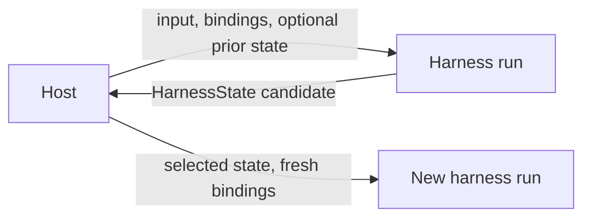
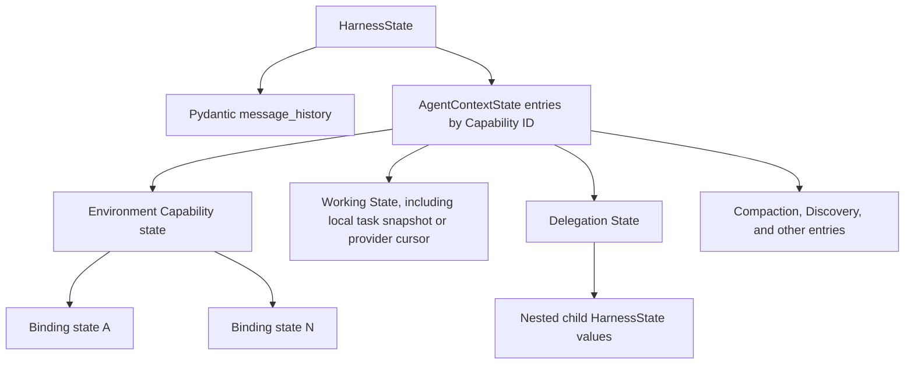
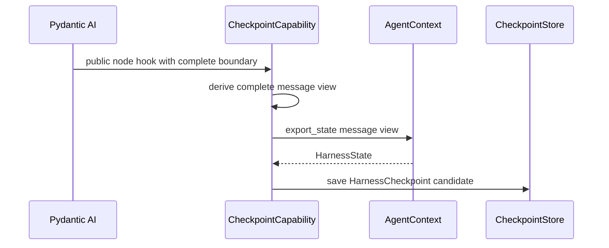
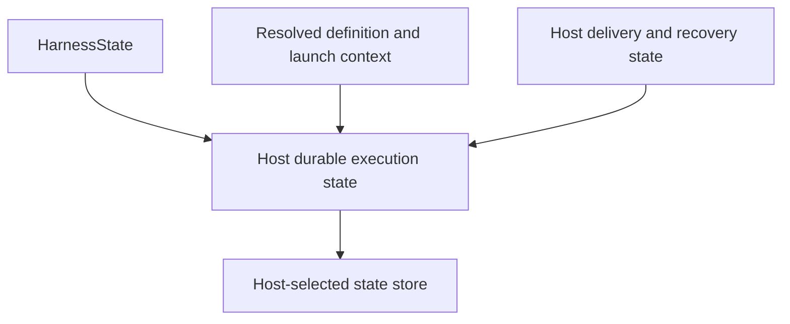

# Harness State and Resume

## Design Position

`HarnessState` is the portable continuation value produced by one process-local harness run. It stores Pydantic AI message history together with the complete recoverable `AgentContextState`. The state is namespaced by Capability ID and includes Environment, working-state, compaction, discovery, inline-delegation, or other configured continuation data. The Delegation Capability stores each inline child's latest complete nested `HarnessState`, including that child's independent message history, but exports it only as part of a complete parent boundary. It contributes no partial parent tool-batch ledger. Host-managed asynchronous child lifecycle and delivery state remain Host-owned. A Host may store Harness State, select it, or embed it in a larger durable execution record.

Resume creates a new harness run with fresh trusted bindings for Identity, Environment topology, providers, and Capabilities. Active-run control belongs to the new `HarnessRunStream` and its Pydantic AI run. No live run handle, pending queue, cancellation state, or safe-pause request is restored from state. The stable workload or Agent instance identity can be preserved by the host, but no authority is restored from state. The Harness does not model a durable logical execution.



## HarnessState

```python
class HarnessState(BaseModel):
    schema_version: Literal["1"]
    message_history: tuple[ModelMessage, ...]
    agent_context_state: AgentContextState
```

| Field                 | Meaning                                                                                     |
| --------------------- | ------------------------------------------------------------------------------------------- |
| `schema_version`      | Harness envelope codec                                                                      |
| `message_history`     | Provider-valid Pydantic AI continuation history                                             |
| `agent_context_state` | Versioned state entries owned by configured Capabilities, including multi-Environment state |



The envelope excludes host execution status, attempt numbers, leases, accepted input IDs, delivery bookkeeping, Pydantic's live run handles, pending-message queue, cancellation state, and safe-pause requests, plugin artifacts, plugin instances, `BoundPluginContext`, middleware state, resolved launch configuration, client-tool attachments and pending-batch delivery state, provider-adapter lifecycle records, provider-suspended model route pins, Environment topology, credentials, provider clients, live objects, bearer handles, `RunUsage` accumulators, usage ledgers, and audit history. Environment entries can contain an observed topology version, versioned backend-local data, or opaque references to objects reachable through an already selected binding, but never provider lifecycle identity, topology, or authority. Rendered Environment context and pending live topology notices are recomputed rather than persisted.

Message content can be sensitive and follows host storage policy. Credential secret material and executable Python objects are never valid state values.

## AgentContext Export

`AgentContext` is the state coordinator:

```python
async def export_state(
    self,
    message_history: Sequence[ModelMessage],
) -> HarnessState: ...
```

Export validates envelope limits and JSON encodability, encodes public Pydantic AI message types, and refreshes the Environment Capability entry from the current `BoundEnvironment`. After run start, each included Capability entry has been accepted or produced by its owner. Before first iteration, non-Environment imported entries are instead preserved as pending values without claiming owner acceptance; each Environment adapter still validates its binding state. The method has no persistence side effect.

Most Capabilities are stateless across runs. Toolsets, callbacks, caches, provider adapters, process-local locks, and clients are reconstructed. Working State and inline-child snapshots are continuation data. In local task mode, the parent Working State entry restores the one task cell; in provider mode, complete task data stays Host-owned and the entry can retain only a non-authoritative observed cursor while a fresh run binding supplies the cell. The Delegation entry restores each child's private nested `HarnessState`. A borrowed inline-child task view is never serialized again inside that nested child state. A Capability creates a state entry only for continuation data that messages cannot represent. An Environment binding creates an entry only when its provider has recoverable state.

## Nested Inline State

The Delegation Capability owns stable inline child IDs and bounded complete child snapshots under its own state version. The nested `HarnessState.message_history` is the child's conversation continuation; its nested `agent_context_state` remains private to that child and can itself contain finite descendant delegation state. On continuation, the record only selects the declared built child. The child executable applies its normal message and Capability codecs, while fresh run binding reauthorizes Identity, lineage, Environment, policy, credentials, client tools, and limits.

Shared task coordination is deliberately not nested. The parent Working State Capability owns one typed task cell. In local mode it keeps its own state entry current before completed mutations return and is the only export source for `TaskState`; in provider mode the Host provider is authoritative, the parent entry contains no task map, and a fresh binding selects the scope. Inline children receive explicit run-bound views over that cell, so a child can atomically claim or update parent-created tasks without copying task data into its private state. Process-local locks, provider bindings, and active-child guards are reconstructed and restore no authority.

A completed child result atomically replaces its prior nested snapshot process-locally. That replacement becomes portable only when a later complete parent semantic boundary exports the enclosing `HarnessState`. A crash before that parent boundary resumes from the previously accepted parent checkpoint and may replay the parent tool batch. Independent recovery, active-job state, and delivery require a Host-managed asynchronous child rather than another Harness State field.

## Consistent Boundaries

A checkpoint is exported only when the message view is semantically complete.

| Boundary                | Exported view                                                                                                           |
| ----------------------- | ----------------------------------------------------------------------------------------------------------------------- |
| Before Agent start      | Imported history, refreshed Environment state, and other entries preserved as pending; unconsumed input remains outside |
| Before a model request  | Existing history plus the complete request about to be sent, except a provider-suspended continuation placeholder       |
| After a tool-call batch | Model response plus every completed or Pydantic-deferred tool result, with current Working and Delegation State         |
| After compaction        | Validated compacted history                                                                                             |
| At terminal output      | Complete final history                                                                                                  |
| After stream recovery   | A normalized response containing only recoverable finalized parts                                                       |

Pydantic AI node hooks expose the current messages and the next node. When a complete next `ModelRequest` has not yet been appended to history, the checkpoint Capability builds an export-only view from the current messages and that request. It does not mutate or manually advance the graph.

A provider-suspended continuation has a distinct public shape: current history ends in `ModelResponse(state="suspended")` and the pending public `ModelRequest` has no parts. That empty request is a continuation placeholder rather than a message to send, so checkpoint and safe-pause export preserve the suspended response as the history tail and do not append the placeholder. The Harness candidate carries no provider authority. Before a later no-input run can use Pydantic's provider continuation path, the Host must atomically pair the accepted checkpoint with the locked integration's non-secret exact-target `ModelRoutePin`; the fresh integration Capability reconstructs that target or fails without ordinary rerouting. This classification reads no private node state; other empty requests follow ordinary Pydantic semantics.

State is not exported during an arbitrary active tool side effect, from half-validated tool arguments, from an incomplete model delta stream, or while an inline child or any sibling in its parent tool batch remains unresolved. A child checkpoint alone is not a complete parent boundary because completed sibling results do not enter public parent message history until Pydantic finishes the batch. A stream-recovery Capability can first convert finalized text, thinking, and tool-call parts into a valid partial response; other unresolved tool calls remain unknown or use Pydantic deferred semantics.



## HarnessCheckpoint

`HarnessCheckpoint` describes why a state candidate was emitted. It is process-local observation metadata, not durable snapshot identity.

```python
class HarnessCheckpoint(BaseModel):
    run_id: str
    boundary: Literal[
        "before_model_request",
        "after_tool_batch",
        "after_compaction",
        "terminal",
        "recovered_stream",
    ]
    state: HarnessState
```

The host assigns any durable version, timestamp, lineage, storage key, or acceptance status. Multiple candidates may be written, skipped, or superseded.

## Import and Acceptance

State acceptance finishes before model or tool work but has two phases because the Pydantic run remains lazy.

During outer stream preparation, the Harness validates:

- the envelope schema version;
- Pydantic AI message decoding and tool-call/result consistency;
- that every Capability entry ID belongs to the configured build or run Capability set;
- matching Environment binding IDs, provider types, and state versions against fresh bindings;
- configured envelope, message, and content limits.

The Harness creates a fresh `AgentContext`, installs non-Environment Capability entries as pending imported values, and supplies `message_history` as prior Pydantic AI history. Environment import is the deliberate preparation exception: before `RunInputFactory` and before the Pydantic run exists, the Harness uses the Environment Capability's versioned codec to validate its entry and calls public `BoundEnvironment.restore_state()` on the freshly selected bindings. The later Pydantic-bound Environment Capability observes that already-restored facade and does not restore it again.

On first stream iteration, each other stateful run Capability validates the version and typed data of its own pending entry during `for_run()` or ordered `before_run()` before model or tool work. The Delegation Capability validates child selectors, bounds, and compatibility with the current immutable `SubagentCollection`; each selected child later validates its nested state through the normal child run path before child model or tool work. The Working State Capability either restores its local parent-owned task cell or validates provider mode and obtains the cell from its fresh Host binding; it rejects mode mismatch, local task data in provider state, or an incompatible shared child binding rather than copying or seeding task data. An incompatible entry stops the run at that point. The preparation-only factory and content resolver receive `RunPreparationContext`, which excludes pending `AgentContextState`, so they cannot interpret or act on state that its owner has not accepted. This split preserves native lazy start without adding a second generic Capability codec registry.

Import never restores authority from message metadata or state data. Identity, policy, credentials, approvals, client-executor ownership, Environment generation, binding topology, and host ownership are evaluated from fresh trusted bindings. When prior messages contain a pending external call, the Host also remounts the exact frozen client-tool surface selected for that deferred chain and verifies it against the Host-owned attachment identity before entering the Harness. `HarnessState` stores neither the attachment nor enough prior declaration data for the Harness to prove same-name schema identity. After any required Host adapter attachment has produced that binding, the selected backend may use saved state to reattach a backend-local object only after those checks succeed.

## Resume Inputs

Continuation state and new work are separate inputs. New work can be:

- native Pydantic user content or a hosted `RunInput`;
- Pydantic AI `DeferredToolResults` built from the authoritative pending request, with external calls and approvals kept in their respective maps;
- a Host-routed asynchronous child completion represented as new semantic input, never as a deferred result for the earlier spawn call;
- a provider reconciliation result;
- host-selected steering content resubmitted as explicit input only after host reconciliation establishes non-delivery, or under an explicit at-least-once policy with duplicate suppression.

The host selects the exact prior state and passes new input or a `RunInputFactory` when new work is needed. It may omit both to continue from imported messages without manufacturing an empty prompt. When the selected history tail is provider-suspended, omission is valid only with the matching Host-owned route pin and same locked model integration; an ordinary newly routed Model is not a compatible continuation. For deferred client-side execution, it also supplies the same effective client-tool declarations through the definition defaults or a fresh `ClientToolRunBinding`; a current Preset edit or unrelated run replacement cannot reinterpret the pending call. Exact declaration or digest comparison occurs in the Host because the public Harness resume values carry no prior surface identity. A factory runs only after fresh, already reachable Environment bindings have restored their compatible backend-local state and receives no pending non-Environment Capability entries. There is no implicit latest-state, pending-call, or client-attachment lookup in the Harness.

## Fork

Fork is a host operation that derives a new run input from selected messages and Capability state. The target definition accepts the derived state only through explicit codecs or migration supplied by the owning Capabilities.

Identity lineage, durable fork lineage, Environment clone or share policy, and storage selection remain host-owned. No credential or live operation transfers. Environment state or opaque provider references transfer only when the fork policy explicitly selects compatible bindings.

## Host Durable Envelope

A host can store a larger state value because complete recovery may need more than Agent continuation:

```python
class HostExecutionState(BaseModel):
    harness: HarnessState
    definition_ref: ResolvedDefinitionRef
    launch: HostLaunchContext
    continuation: HostContinuationState
```

`HostContinuationState` can include the exact model route pin required by a provider-suspended tail and any Host-managed asynchronous child execution, delivery, or duplicate-suppression facts; those values remain outside `HarnessState`. The route pin is validated by the locked model integration. The shape is illustrative of ownership, not a Harness API. A Host maps the Harness portion through its `CheckpointStore` implementation.



## External Effects

State export does not make a tool effect exactly once. A provider result that was not authoritatively observed remains unknown. Retry and reconciliation follow the tool or provider contract; the Harness does not fabricate a successful tool result to make history look complete.

## Compatibility

The Harness envelope, Pydantic message codec, and each Capability state version evolve independently. The host selects the definition used for resume. The harness accepts the state only when public messages decode correctly and every stored Capability entry is understood by the active Capability set. Cross-definition restore or fork requires any necessary message and Capability-state migration before run creation.

Unknown required state, unsupported versions, or invalid messages fail without mutating the supplied state.

## Boundaries

| Concern                                                           | Owner                                  |
| ----------------------------------------------------------------- | -------------------------------------- |
| Message, Capability, and Environment continuation export          | Harness and `AgentContext`             |
| Capability state codec                                            | Owning Capability                      |
| Inline child identity and nested continuation snapshots           | Delegation Capability and child codecs |
| Local shared-task snapshot and process-local coordination         | Parent Working State Capability        |
| Provider-backed shared-task data, scope, fencing, and CAS         | Host task provider and fresh binding   |
| Environment binding state codec and native recovery               | Owning Environment provider            |
| Durable version, selection, retention, lineage, and fencing       | Host                                   |
| Async child execution, scheduling, result retention, and delivery | Host                                   |
| External effect reconciliation                                    | Tool provider and Host                 |

## Trade-offs

### Portable Continuation vs. Complete Host Recovery

Messages plus complete recoverable Agent Context state are portable across embedded and hosted use. A host still retains delivery, launch, and durable lifecycle state in its own envelope.

### Complete Boundaries vs. Maximum Checkpoint Frequency

Checkpointing only complete semantic views avoids corrupt resume history. A crash during an in-flight side effect can still leave an unknown outcome that requires provider reconciliation.

### Host Definition Selection and State Compatibility

The host controls definition selection, semantic compatibility, and migration policy; the harness enforces only the message and Capability-state codecs it owns. This keeps deployment versioning outside the library while making incompatible stored state fail explicitly.
