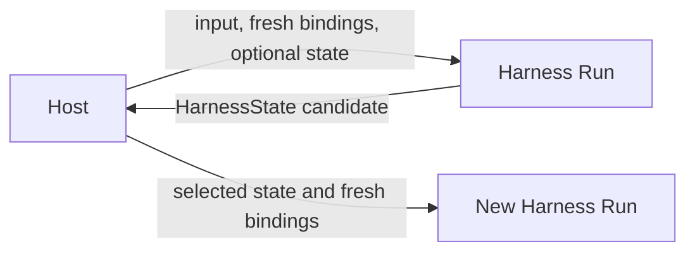

# Harness State and Resume

## Design Position

`HarnessState` is the complete portable continuation value understood by the process-local Harness. It contains only:

- one stable `thread_id` for the independently advancing message history;
- detached public Pydantic AI message history;
- detached JSON state namespaced by stable Capability ID;
- portable provider-owned Environment states under one direct mount-name mapping.

It contains no executable definition, plugin object, model, Toolset, provider client, Environment mount definition, desired mount set, provider launch state, current authority, usage ledger, event log, Host execution record, lease, queue, or delivery state. A Host may persist the value or embed it in a larger durable record, but the Harness does not choose or commit a durable checkpoint.

Resume creates a new logical Harness Run with fresh `RunBindings`. State preserves Thread identity, messages, explicitly stored Capability data, and provider-defined portable data for already authorized mounts; it never restores authority, desired mounts, or a live Python resource.



## State Schema

```python
class CapabilityState(BaseModel):
    version: str
    data: JsonValue


class AgentContextStateSnapshot(BaseModel):
    entries: dict[str, CapabilityState]


class HarnessState(BaseModel):
    schema_version: Literal["1"]
    thread_id: str
    message_history: tuple[ModelMessage, ...] = ()
    agent_context_state: AgentContextStateSnapshot = (
        AgentContextStateSnapshot()
    )
    environment_states: Mapping[str, EnvironmentState] = {}

    @classmethod
    def new(*, thread_id: str | None = None, ...) -> HarnessState: ...

    def fork(*, thread_id: str | None = None) -> HarnessState: ...
```

`HarnessState` and its nested values are frozen detached envelopes. Pydantic message history is round-tripped through `ModelMessagesTypeAdapter`; Capability and Environment payload data are round-tripped through Pydantic `JsonValue`. Public accessors decode fresh copies, so mutable aliases do not cross the state boundary.

`thread_id` is an opaque provider-neutral correlation value for one independently advancing history. A generated value consists of the `thread-` prefix and 32 lowercase hexadecimal characters. A trusted Host may instead select a stable Foundation object ID in `<kind-prefix>_<lowercase-alphanumeric-suffix>` form, up to 256 characters. `HarnessState.new(thread_id=...)` selects that identity explicitly; omitting it generates one. Serialization, ordinary copies, exports, and resume preserve the value exactly; `RunBindings`, metadata, and run arguments do not duplicate or override State-owned identity.

`HarnessState.fork(thread_id=...)` copies messages and Capability state into a new envelope under the distinct Host-selected identity and resets `environment_states` to an empty mapping. Omitting the argument derives a fresh generated ID. Passing the source identity is invalid. A fork is a new Thread and does not inherit backing-target selection by default. This is the required core path for intentionally creating an independently advancing history or changing identity from an existing checkpoint; a fresh binding cannot silently retarget prior State. The ID is not cryptographic integrity or authority.

`schema_version` versions only the Harness envelope and is `1` for this contract. Import requires the exact supported envelope version and a valid required `thread_id`; validation never invents a replacement identity for malformed input. Each Capability entry has an independent non-blank version owned by that Capability's codec; each `environment_states` value has an independent provider-owned codec version. [Environment Integration](08-environment-integration.md#portable-environment-state) owns the direct mapping and its authority boundary.

## AgentContextState

`AgentContextState` is the run-local mutable coordinator:

```python
class AgentContextState:
    async def read[T: BaseModel](
        self,
        capability_id: str,
        state_type: type[T],
        *,
        version: str,
    ) -> T | None: ...

    async def write(
        self,
        capability_id: str,
        value: BaseModel,
        *,
        version: str,
    ) -> None: ...

    async def snapshot(
        self,
    ) -> AgentContextStateSnapshot: ...
```

A read validates the requested namespace, exact entry version, and the owning Pydantic state model. A write atomically replaces one namespace with detached JSON. A snapshot atomically copies all namespaces.

The coordinator does not maintain a Capability registry and does not reject an entry merely because no active Capability reads it in the current run. Unknown or transferred namespaces remain opaque and survive snapshotting. This permits trusted plugin handoff, optional Capability removal and reintroduction, and Host-controlled state migration without a second global codec system. A Capability accepts a namespace only by reading it through its own expected ID, version, and model.

The removed namespace `a13n.dynamic-environment.processes` is the one direct-cut exception. Import rejects any snapshot containing that namespace before Environment entry or another Run effect. It is never treated as opaque unknown state because preserving and re-exporting its obsolete operator backend IDs and output cursors would imply a continuation contract that no longer exists.

Namespace isolation is otherwise a composition convention backed by the typed API, not a sandbox against trusted Python. A trusted plugin or Capability can intentionally replace another entry or the complete `HarnessState`; the Harness does not enforce provenance or ownership allowlists.

Dynamic Environment stores no process namespace. The process controller is Run-local and closes with the Run after killing and releasing every remaining process. A process reference retained in message history is historical model content rather than restored authority. [Environment Integration](08-environment-integration.md#run-owned-shell-processes) owns process admission, explicit-offset polling, active readiness, and cleanup.

Async `SubagentCapability` stores no execution projection in parent `HarnessState`. Public execution references, exact child correlation, status, failure, resumability, bounded closed activity, and child `HarnessState` remain owned by the Host operator and child Thread records. `subagent_info` and `wait_subagent` query that current authority and expose no separate raw child output; the normal managed-tool boundary spills an oversized valid wait result to a run-private file. Completion after a parent Run closes never mutates its exported state, and Host wake or delivery remains independent of Harness continuation. Inline mode separately stores complete nested child `HarnessState` under the Subagent Capability namespace, with borrowed Environment state removed as defined by [Delegation and Subagents](11-delegation-and-subagents.md#inline-execution).

## Export

`AgentContext.export_state(message_history)` preserves `AgentContext.thread_id` and combines it with a detached message sequence, the current `AgentContextState` snapshot, and a fresh mount-name-to-state Environment snapshot:

```python
async def export_state(
    self,
    message_history: Sequence[ModelMessage],
) -> HarnessState: ...
```

The method calls provider-defined `dump_state()` but performs no persistence side effect. Each call is an infallible synchronous process-local read of the adapter's last validated cache; it performs no target refresh. The method captures the current mount set under the aggregate operation fence, so `environment_states` contains entries from one complete mount-set observation rather than a mixture before and after mutation. Values are imported `a13n-environment-provider` `EnvironmentState` envelopes; mounts that return `None` are omitted. Export cancellation, an adapter contract violation, invalid canonical JSON, an invalid state envelope, or a Host-admitted size violation fails the complete export rather than silently dropping a stateful mount. Host unconditional finalization can still read each adapter cache independently from this continuation export. `HarnessRunStream.export_state()` selects the latest complete message view owned by the stream and delegates to this method.

State export does not require `HarnessState.message_history` to equal a result object's private message view. Normal inner execution produces aligned values, but trusted result middleware may intentionally transfer or replace state. Structural validity is enforced; semantic provenance is part of the trusted plugin contract. A plugin that replaces `environment_states` remains trusted code but cannot make the mapping authorize or construct an Environment on resume.

## Complete Message Boundaries

The Harness stores only public Pydantic `ModelMessage` values. It never serializes raw stream deltas or private graph nodes. When a streamed model response is interrupted, the Harness uses public part lifecycle events to derive one explicitly interrupted response containing only parts that are safe to replay; it never marks an unfinished part complete.

| Time                             | Exported messages                                                              |
| -------------------------------- | ------------------------------------------------------------------------------ |
| Before first `ModelAttempt`      | Imported message history                                                       |
| During model or tool work        | Latest complete public message view exposed by `AgentRunEvents`                |
| Between `ModelAttempt` values    | Normalized interrupted history used by the next `ModelAttempt`                 |
| At completion or deferred output | `AgentRunResult.all_messages()`                                                |
| After normalized cancellation    | Complete messages supplied by `RunCancelled` or the latest observable boundary |

A new semantic continuation prompt is input to the next `ModelAttempt`, not retroactively inserted into an earlier completed message.

## Interrupted History Normalization

Recovery normalizes only a terminal message explicitly marked `state="interrupted"`.

Before tool-call closure, the Harness observes `PartStartEvent`, `PartDeltaEvent`, and `PartEndEvent` values for the current model response and applies these replay rules. Observations are scoped to the exact response boundary established by the preceding public message count; part indices are local to a response and never identify a boundary. If the raw interrupted tail has no lifecycle event observed for that exact response, the Harness discards the complete tail rather than trusting unobserved internal parts. A tool-return part that is atomic and has no delta form is complete at `PartStartEvent`; streamed tool-call parts still require `PartEndEvent`.

| Interrupted response part                        | Replay rule                                                                             |
| ------------------------------------------------ | --------------------------------------------------------------------------------------- |
| Non-empty `TextPart`                             | Retain all append-only text already emitted, whether or not the part ended              |
| `ThinkingPart`                                   | Retain only after `PartEndEvent`; preserve the finalized content and provider signature |
| Unfinished `ThinkingPart`                        | Exclude without discarding surrounding safe text or finalized parts                     |
| Finalized ordinary tool-call or tool-return part | Retain with its complete identity and payload                                           |
| Matched finalized native call/return pair        | Retain one call followed by one same-name return for one unique provider-native ID      |
| Unmatched native call or return                  | Reject the complete partial response; no portable synthetic native result is invented   |
| Unfinished tool-call or tool-return part         | Reject the complete partial response and fall back to the preceding canonical history   |
| Other unfinished or unsupported response part    | Do not reconstruct it into continuation history                                         |

The finalization observation is process-local and is applied before state export. It is not inferred later from text, provider metadata, or the presence of a signature. Consequently, a Host that selects a Harness-produced state can replay partial visible text and finalized reasoning while never replaying an unfinished thinking block. Raw live events remain non-authoritative observations and may already have been displayed; the Harness cannot retract them.

After that filtering, if the tail is an interrupted `ModelResponse`, the Harness appends one `ModelRequest` containing failed `ToolReturnPart` values for finalized ordinary tool calls that have no recorded result. Provider-native calls and returns must already form strict one-to-one pairs inside the response: each unique `tool_call_id` identifies exactly one call followed later by exactly one return with the same `tool_name`. A duplicate ID, return before its call, name mismatch, or otherwise unmatched native part causes the interrupted response to be discarded because the Harness has no portable synthetic native-result representation. If the tail is an interrupted `ModelRequest`, the Harness finds the preceding response and appends missing failed tool returns to that request. Existing `ToolReturnPart` and `RetryPromptPart` results remain authoritative and are not duplicated.

Each synthesized failed result says:

> No tool result was recorded because execution was interrupted. The operation may have partially or fully completed. Check the current state before deciding whether to retry it.

This transformation closes the public conversation shape. It does not claim that the external operation failed, did not execute, rolled back, or is safe to repeat.

No interrupted-history normalization occurs for ordinary complete history or for a provider-suspended response. Provider-suspended continuation remains native Pydantic behavior.

## System Prompt Reconciliation

The current Harness `AgentSpec` owns the complete ordered static system prompt. `HarnessState` retains public Pydantic messages, including the system-prompt parts materialized for the definition that produced its selected checkpoint, but those historical parts do not override the definition selected for a later model request.

Before passing non-empty imported history into a new Pydantic model request, the Harness creates a detached canonical history projection. It removes every `SystemPromptPart` from every `ModelRequest`, then inserts the current definition's normalized system-prompt blocks at the beginning of the first request. A definition with no system prompt removes historical blocks without replacement. All non-system parts, request instructions, metadata, timestamps, responses, and ordering remain unchanged. The normalized messages become the Pydantic history for the run, so a successful exported checkpoint carries the current definition's prompt rather than requiring a permanent model-bound overlay.

Empty history uses Pydantic AI's native `Agent.from_spec(system_prompt=...)` construction path. System-prompt reconciliation does not reinterpret or merge `ModelRequest.instructions`: static and dynamic instructions retain their native per-request lifecycle.

A provider-suspended response is continuation of an already issued model request rather than a new request. The Host must resume that response with its compatible definition and provider integration; a changed system prompt takes effect only on a later new model request. The Harness does not rewrite a provider-suspended request in place.

## Import and Resume

A new run receives `previous_state` separately from fresh `RunBindings`. Stream construction deep-copies the supplied state. Entry then:

1. receives fresh Environment instances already constructed from Host-selected state and atomically enters/publishes the initial mount set;
2. validates that portable `environment_states` is observation only and does not restore or replace adapter state after entry;
3. invokes the optional `RunInputFactory` against that entered Environment;
4. restores the selected `thread_id` into a read-only field on the fresh `AgentContext`;
5. creates one `AgentContextState` initialized from the imported Capability snapshot;
6. creates the remaining fresh `AgentContext` dependencies and plugin graph;
7. reconciles non-empty imported history with the current definition-owned system prompt before a new model request, while leaving provider-suspended continuation unchanged;
8. passes the resulting messages to the first `ModelAttempt`;
9. lets each Capability read and validate only the namespaces it understands.

Initial Environment entry and complete mount publication finish before input production and never overlap mount mutation. Harness does not apply saved Environment state to an entered adapter: the Host must select state before constructing each Environment. An unmatched portable mapping entry is inert; an explicit unmanaged/import flow can adopt it only before Run construction. The Harness does not require every Capability entry to be consumed before model work. A stateful Capability that requires validation before its own behavior must perform that validation in its Pydantic lifecycle or before invoking the dependent operation.

Identity, policy, credentials, model resolution, Environment authority, desired mounts, tool grants, provider sessions, and Host ownership always come from fresh trusted bindings. Message metadata, Thread identity, Capability state, and portable Environment state grant none of them.

State restores both the independently advancing message history and its provider-neutral `thread_id`; it does not carry a provider session, route, credential, or prompt-cache setting. The fresh model integration reads the restored ID from `AgentContext` and derives or restores matching provider affinity under [the Thread-affinity contract](16-input-model-and-output.md#thread-affinity). If a provider uses an additional opaque selector that cannot be derived, the Host retains it beside the matching `HarnessState`; transient Harness and model-attempt IDs never replace the State-owned key.

Omitting new input is valid when the selected message history is sufficient for native Pydantic continuation. Supplying deferred tool results uses Pydantic AI's own input contract and the exact pending call or approval correlation owned by the integrating Host.

## Host Durable Envelope

A Host can store additional facts beside `HarnessState`:

```python
class HostExecutionState(BaseModel):
    harness: HarnessState
    definition_revision_ref: str
    launch: HostLaunchState
    pending_delivery: HostDeliveryState | None
```

This is an ownership illustration, not a Harness API. Definition selection, desired Environment mounts, `ExecutionAttempt` generation, artifact locks, Provider selection, current state authority, runtime collaborators, client-tool pending state, asynchronous child lifecycle, and delivery fencing remain Host-owned. `HarnessState.environment_states` is a portable observation and fallback for explicit unmanaged/import flows; it is not the managed Host's current state or authority.

The Harness does not define or require a generic provider route pin. Provider-specific continuation facts that cannot be derived from `thread_id` and public Pydantic messages, including an opaque model-session selector, belong to the selected model integration or Host envelope rather than the Harness schema. A broader product-conversation routing key does not replace the distinct prompt-cache affinity required for each independently advancing Agent message history.

## External Effects

State export records observations; it does not make a side effect exactly once. An operation with no authoritative result remains unknown. Resume policy must inspect provider or Environment state before repeating a side-effecting action unless the provider offers a matching idempotency or reconciliation contract.

## Compatibility

Four compatibility axes remain independent:

| Axis                             | Owner                |
| -------------------------------- | -------------------- |
| Harness envelope version         | Harness              |
| Pydantic message codec           | Pydantic AI          |
| Capability entry version         | Owning Capability    |
| `EnvironmentState.state_version` | Environment Provider |

Invalid messages, unsupported envelope versions, blank namespace IDs or versions, and invalid Capability or Environment payloads fail without mutating the supplied value. A Host that changes process-local Agent composition or provider integration decides whether to retain, migrate, or remove incompatible opaque data before resume. Definition-owned system-prompt replacement is the explicit exception for a new model request: the Harness reconciles public prompt parts from the current definition without treating them as opaque Capability or provider state.

## Boundaries

| Concern                                            | Owner                          |
| -------------------------------------------------- | ------------------------------ |
| Envelope, detached encoding, and state coordinator | Harness                        |
| One Capability namespace and semantic migration    | Owning Capability              |
| Environment state mapping and provider value codec | Harness core and Provider      |
| Trusted complete-state transformation              | Harness plugin or Host adapter |
| Durable selection, launch, retention, and fencing  | Host                           |
| External effect reconciliation                     | Provider and Host              |

## Trade-offs

### Opaque Namespace Preservation vs. Active-set Validation

Preserving unknown namespaces supports code-first composition, plugin handoff, and independent Capability evolution. The Harness cannot claim that every stored entry was produced or accepted by the current Agent; only the owning typed read establishes that fact.

### Portable Continuation vs. Durable Recovery

Messages, Capability JSON, and portable Environment state envelopes remain process-portable. Complete crash recovery still needs the Host definition, desired mounts, current Environment authority, fresh runtime collaborators, pending-delivery state, and reconciliation evidence outside Harness.
