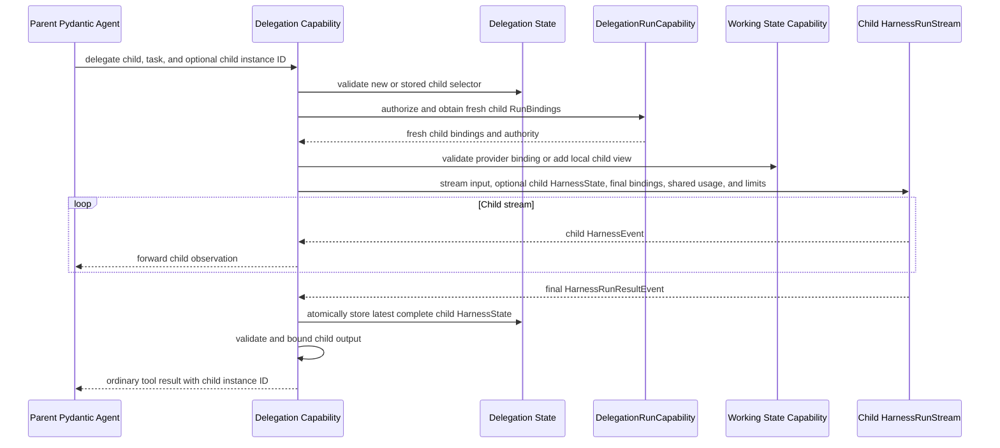
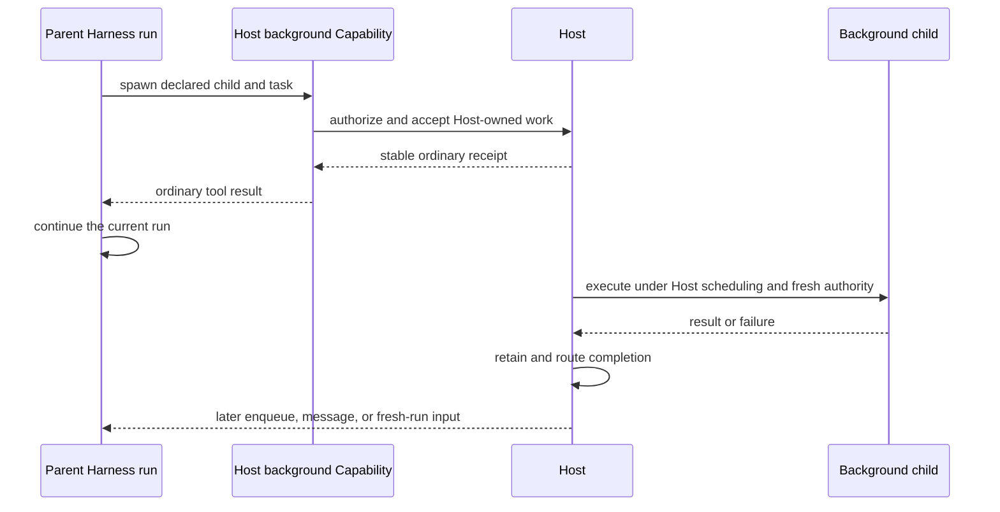

# Delegation and Subagents

## Design Position

Subagents are complete child Agent definitions built into an immutable `SubagentCollection`. The collection is authority-neutral build output: it describes the immediate children of one `ExecutableAgent` and gives trusted Harness or Host Capabilities access to their reusable executables without choosing how they are scheduled.

The first-party `DelegationCapability` provides the standard blocking inline tool-as-subagent execution path. It owns stable inline child identities and each child's latest complete `HarnessState` in its namespaced `DelegationState`. Every invocation still receives fresh run authority, and the parent waits for the ordinary tool result. Multiple delegation calls in one Pydantic tool batch can run concurrently when they target different child instances.

Asynchronous or durable background subagents are Host behavior. A Host Capability can consume the same `SubagentCollection`, return an ordinary spawn receipt immediately, and own scheduling, tasks or workers, persistence, delivery, wake-up, retries, cancellation, and cross-run accounting. Background completion is later input, not a deferred result for the spawn tool call. Pydantic deferred values remain available for approvals and external tools whose current run must suspend, but they are not the Harness subagent protocol.

There is no separate subagent Agent builder, Agent loop, plugin system, hook system, event queue, or Capability inheritance mechanism. Every child uses the same `ResolvedAgentDefinition`, `ExecutableAgent`, fresh plugin binding, `RunBindings`, run stream, state, event, output, and cleanup contracts as a root Agent.

## Child Definitions and Built Collection

```python
class SubagentDefinition(BaseModel):
    model_config = ConfigDict(frozen=True)

    name: str
    description: str
    agent: AgentDefinition
    context: DelegationContextPolicy = DelegationContextPolicy()
    usage_limits: UsageLimits | None = None


@dataclass(frozen=True)
class BuiltSubagent:
    declaration: SubagentDefinition
    definition: ResolvedAgentDefinition
    executable: ExecutableAgent[Any]


class SubagentCollection(Mapping[str, BuiltSubagent]):
    """Immutable immediate-child collection in authored order."""

    def require(self, name: str) -> BuiltSubagent: ...
```

The materialized parent contains a unique finite set of named, complete child Agent definitions. Each child has its own model, instructions, output, Capabilities, Environment requirements, and nested subagents. Repeating parent configuration through inheritance flags is avoided. `context` and `usage_limits` are portable ceilings on work performed through that authored edge; any Host-specific execution policy can narrow but not widen them.

Before Harness build, the Host recursively resolves every child's selected plugin catalog, model, native tool and Toolset, permitted custom Capability type, reentrant build Capability instance, output type, and process-local provenance. It produces exactly one `ResolvedSubagentDefinition` for each authored edge, in authored order. The resolved declaration equals the authored declaration, and the nested resolved definition's logical definition equals that declaration's `agent`; resolution cannot add, omit, replace, or mutate a child edge.

The Harness validates the finite resolved graph and builds children before their parent. The resulting `SubagentCollection` contains only immediate children; each child executable exposes its own collection recursively. The parent owns the built children and closes them in reverse acquisition order. The collection, entries, nested definitions, and values used as selectors are recursively immutable by behavior. Build takes defensive copies, normalizes Harness-owned containers to tuples and read-only mappings, and never exposes the mutable upstream `AgentSpec` object used internally by `Agent.from_spec()` through a `BuiltSubagent`. A public declaration or definition is an immutable projection or defensive copy, so mutating original input or an upstream nested object cannot change collection keys, child behavior, context ceilings, or usage limits after validation. `dataclass(frozen=True)`, `ConfigDict(frozen=True)`, and the read-only `Mapping` interface are not treated as sufficient on their own.

The collection contains no current Identity, credential, Environment binding, policy decision, live state, scheduler, task, queue, Host job, receipt, or execution mode. A process-local child executable is reusable build output; it never becomes durable payload. A distributed Host persists its own target reference and reconstructs the exact child build on a worker instead of serializing the executable.

Host resolution rejects unavailable child artifacts and produces the complete recursive build plan. Harness build rejects duplicate names, authored/resolved edge mismatch, output-schema mismatch, incompatible delegation result contracts, and structural definition cycles. The Harness does not resolve registry keys, Presets, or opaque Host references. Self-like delegation is represented by a finite materialized child definition whose delegation surface is removed or explicitly narrowed.

## Collection Presentation

The collection and its execution presentation are separate. First-party helpers support these ordinary compositions:

- one unified `delegate` tool that selects a child by stable name;
- one named tool per child for a small fixed roster;
- a custom Capability or Toolset factory that consumes `SubagentCollection`;
- no Harness delegation tool, leaving the collection available only to trusted Host composition.

The first-party Delegation Capability defaults to the unified form:

```python
class DelegateInput(BaseModel):
    subagent: str
    task: JsonValue
    child_instance_id: str | None = None
```

`child_instance_id=None` creates a new inline child instance. Supplying an existing ID continues that exact child using its stored state. The returned ordinary tool value includes the stable child instance ID and the bounded validated response so the parent can refer to the same child later. An unknown ID, a child name that does not match the stored record, or an ID already active in another invocation fails before dispatch.

Separate named tools remove the `subagent` selector but preserve the same state, binding, authorization, usage, result, and concurrency semantics. A custom presentation must not claim first-party inline semantics unless it preserves those contracts. Tool discovery can hide children while retaining stable names; discovery grants no invocation authority.

Portable model-visible presentation configuration belongs to the first-party Delegation Capability configuration. A Host that replaces it with a custom Capability locks and resolves that Capability like any other model-visible Agent behavior. `SubagentCollection` itself is not placed on `AgentContext`, exposed as a model tool, or recovered from state.

## Inline Child State

The Delegation Capability has one stable Capability ID and owns the following conceptual state entry:

```python
class InlineSubagentState(BaseModel):
    child_instance_id: str
    subagent_name: str
    child_definition_id: str
    state: HarnessState


class DelegationState(BaseModel):
    children: dict[str, InlineSubagentState] = Field(default_factory=dict)
```

`children` is keyed by `child_instance_id`. Each nested `HarnessState.message_history` is the authoritative inline-child conversation continuation, while its `agent_context_state` contains that child's private Capability state. The parent does not need to inject child messages into its own prompt, and a later call can resume the exact child by passing its ID. The Delegation entry otherwise stores only complete child continuation snapshots and non-authoritative selectors. It contains no live `AgentInstanceContext`, `RunBindings`, credential, provider object, Environment binding, `RunUsage`, active task, lock, event queue, running status, retry counter, Host receipt, worker lease, or delivery record.

On import, the Delegation Capability validates its state version, bounded child count and encoded size, unique IDs, and that every record names a current immediate child with a compatible logical definition ID. Cross-definition restore requires Host selection and any explicit Capability-state migration; a stale child record never selects another child merely because its name or position is similar. Each nested `HarnessState` is then passed to the selected child executable, whose own message and Capability-state codecs perform their normal validation. Nested delegation state is finite by the definition graph and remains subject to the Harness envelope and Capability-specific bounds.

For a new invocation, the run binding provider allocates or approves a stable child instance ID. After the child stream enters successfully and before first iteration, the Delegation Capability captures its complete pre-start `HarnessState` as a fallback baseline; that state contains no consumed child input or model/tool work and remains process-local unless a handled failure needs it. Baseline export failure stops dispatch before child model or tool work. For continuation, the State-provided ID is only a selector: fresh Host policy must reauthorize that exact parent, edge, child instance, and lineage before creating a new `AgentInstanceContext`. State never restores Identity or authority.

After a child reaches a complete delivered Harness result, the Delegation Capability atomically selects the next child record before delivering the parent tool outcome. A valid latest complete state replaces a new or existing record. When a handled failure has no result state, an existing record remains unchanged while a new child stores its pre-start fallback baseline. The sanitized `ToolFailed` content for a new child includes the stable child instance ID so the parent can address the retained identity and reconcile current task state. The fallback does not claim that failed child input or effects were incorporated. An unhandled exception, cleanup uncertainty, or consumer cancellation leaves a prior record unchanged and creates no new record; any provider-backed task effect outside that record follows the Host reconciliation rule below rather than being treated as rolled back.

Different child instance IDs can advance concurrently. The Capability maintains a process-local active-invocation guard and rejects or serializes a second invocation of the same ID so two runs cannot overwrite one state baseline. That guard is not continuation state and disappears when the parent run closes.

A child-state replacement is process-local until a complete parent semantic boundary exports it in the parent's `HarnessState`. State-backed child continuity therefore does not create a partial parent tool-batch ledger or independent durable child execution.

The same-child active guard is scoped to one parent Harness run. Two independent parent runs receive independent State copies and cannot merge competing child advances through the Harness. A Host that treats them as one durable continuation must serialize checkpoint selection with its own fence; otherwise it explicitly creates forks with separate lineage and State.

## Shared Task State

Inline parent and child Agents share the Working State Capability's task state by default. They do not share the complete `AgentContextState` or a shallow copy of `AgentContext`. [`Context, Working State, Compaction, and Memory`](09-context-and-memory.md#working-state-capability) owns the conceptual `TaskState`, identity-bound `TaskStateCell`, and `TaskStateRunBinding` contracts.

A local cell linearizes every mutation with a short lock and monotonically advances `revision`; a provider-backed cell supplies equivalent durable linearization and idempotency. Before a successful local mutation returns, the parent Working State Capability replaces its own `WorkingState.tasks` entry with the resulting immutable snapshot. Provider mode keeps `tasks=None` and can export only its bounded non-authoritative observed cursor. An identity-bound cell derives claim ownership and update attribution from its trusted Agent instance, so model tools never supply an owner or actor. Claims enforce current status, dependencies, eligibility, and same-owner idempotency; general updates require the expected revision; task IDs are allocated under the same mutation boundary.

`DelegationContextPolicy.task_state="shared"` asks for the same task store. In local mode, the parent Working State Capability creates a child-identity-bound view over its cell and the Delegation Capability places `TaskStateRunBinding(source="local_borrowed", cell=...)` in the child's final `RunBindings`. The child does not serialize a duplicate task map into its private nested `HarnessState`; the parent Working State entry remains the sole local snapshot owner and stays current after each completed mutation. In provider mode, the trusted Host returns a fresh child `RunBindings.task_state` whose provider cell is bound to the same durable scope as the parent. The provider remains the sole task-data authority, and neither parent nor child State contains its task map.

`task_state="isolated"` passes no parent task view. A local child owns task state in its nested `HarnessState` and receives no task binding. A provider-mode child receives a fresh Host binding to a distinct child scope. A child without task tools needs no binding, and isolation never falls back to the parent store because a provider is unavailable.

The Harness validates only contracts it owns: both sides participating in shared tasks use compatible Working State modes, local borrowing uses the exact parent-owned view, and provider-mode task tools receive a provider binding. The trusted Host is responsible for selecting the same provider scope for `shared` and a distinct scope for `isolated`. A missing or incompatible required binding fails before child dispatch rather than silently copying, seeding, or dropping tasks. When both definitions omit task tools, task sharing is a no-op.

Notes, TODOs, messages, and every non-task Capability state remain private to one Agent instance. Context policy can copy bounded content into child input, but it does not share mutable Capability state. A shared task cell contains coordination data, not authorization: every mutation still applies current tool and Host policy, and restored owner IDs grant no execution authority.

For a Host-managed asynchronous child, a process-local Host may retain a local task store under its own lifetime rules. A distributed Host selects provider mode and gives each worker a fresh identity-bound cell for the selected durable scope with equivalent claim, operation-idempotency, compare-and-swap, and stale-owner fencing semantics; it cannot share a Python cell across workers. That Host state is not copied into parent or child Harness State.

## Context and Fresh Run Bindings

```python
class DelegationContextPolicy(BaseModel):
    model_config = ConfigDict(frozen=True)

    include_task: bool = True
    history: Literal["none", "summary", "selected"] = "none"
    task_state: Literal["shared", "isolated"] = "shared"


class DelegationRunCapability(AbstractCapability[AgentContext]):
    async def bind_inline(
        self,
        child: BuiltSubagent,
        input: RunInput,
        requested_child_instance_id: str | None,
        usage_limits: UsageLimits,
    ) -> RunBindings: ...
```

This is a conceptual public Capability contract, not a wire schema. It has one Harness-reserved Capability ID and can enter only through fresh `RunBindings.capabilities`. Run assembly recognizes it with an explicit type check and rejects duplicates before model or tool work. Omitting it is valid for an Agent that never delegates, but an attempted inline delegation fails closed before child dispatch. It cannot enter `ResolvedAgentComponents`, be constructed from model-authored `CapabilitySpec`, or be recovered from `HarnessState`.

`DelegationRunCapability` evaluates the exact built edge against the current parent `AgentContext.instance`, requested new or existing child identity, context seed, effective limits, and Host policy. It returns complete fresh child `RunBindings`: an authorized `AgentInstanceContext` with parent/delegation lineage, a new single-use `EnvironmentRunBinding`, an independently selected optional `ClientToolRunBinding`, narrowed run Capabilities, and any required provider-backed `task_state` binding. The Delegation Capability validates that binding against the child's Working State mode, adds the parent-owned child-bound local view when local sharing requires it, and produces the final immutable bindings passed through the ordinary `ExecutableAgent.stream(..., bindings=...)` API; there is no extra task-view argument. For continuation, the returned workload identity, instance ID, and lineage must reproduce the same stable `AgentInstanceRef` and parent edge as the requested stored child; the State ID remains only a selector, while the Host's trusted derivation or records establish that continuity. For creation, the returned instance supplies a new stable ref. It cannot return the consumed parent binding, implicitly copy the parent's client-tool surface, or copy authority-bearing Capability instances.

The host policy chooses:

- whether the child uses the same workload Identity or an authorized child Identity;
- which fresh Environment bindings and mounts are available;
- narrowed tool, credential, and budget authority;
- which parent messages or summary become child input;
- which fresh run-specific Capabilities and optional client-tool attachment are supplied.

The Delegation Capability creates bounded child input under `DelegationContextPolicy`. A provider can reject the request but cannot widen the context or limit ceilings. The child always receives a fresh `AgentContext`; no live parent plugin instance or chain, `BoundPluginContext`, mutable message list, whole `AgentContextState`, provider handle, credential, or event queue is shared. Its exact definition selects its own plugin specs, its executable owns a separately constructed Agent-bound graph, and each invocation derives fresh run-bound replacements. When task sharing is enabled, only the Working State Capability's typed task cell crosses the state boundary through its explicit child binding. Every other Capability state remains child-private.

An embedded application supplies a local `DelegationRunCapability` with an explicit child-binding factory when it enables delegation. `RunBindings.local()` does not derive child filesystem, shell, provider, model, or client-tool authority from the parent binding.

## Child Usage Limits

For inline execution, the Delegation Capability resolves the child's effective `UsageLimits` as a field-by-field stricter intersection of the parent's effective limits, `SubagentDefinition.usage_limits`, and current Host policy. An omitted child declaration adds no child-specific override, so the child inherits the parent's effective limits. Each numeric ceiling uses the smallest non-`None` value; `None` adds no edge constraint. `count_tokens_before_request` is enabled when any input requires it. The result is passed to `child.executable.stream()` and Pydantic AI remains responsible for native checks.

The child receives the parent's live `RunUsage` accumulator. Pydantic AI therefore evaluates cumulative request, tool-call, token, and cost limits against the aggregate visible at each run's check boundaries. Such a limit is not a fresh child-local allowance. `per_request_input_tokens_limit` remains local to each individual request.

A shared `RunUsage` is an accumulator, not an atomic distributed budget coordinator. Concurrent inline runs can pass checks before either updates the aggregate, and an enclosing delegation tool call can be counted after its child completes. Deployments requiring strict aggregate admission serialize or reserve budget through Host policy. `RunUsage` and Host budget facts do not enter Delegation State.

A Host-managed asynchronous child starts a separate run with fresh usage unless that Host explicitly performs in-process sharing. When the Host presents execution as an authored subagent edge, it independently applies the edge's `usage_limits` as a ceiling and can narrow it under current policy. Cross-run and lineage budgets remain Host facts.

## Inline Execution

Inline execution calls the same `ExecutableAgent.stream()` path used for root Agents, including the child's own input-to-result plugin chain. The Delegation Capability is the child stream's sole consumer; it does not bypass, inherit, or splice the parent's middleware.



Native parent cancellation cancels and drains the active delegation tool task. That task closes the child `HarnessRunStream`, whose underlying `AgentRunEvents.aclose()` cancels and drains the child run. Child output is validated and bounded before entering the parent result. Raw exceptions, private messages, and state are not returned to the model.

Parent and child events use separate run IDs and Agent instance lineage. `forward_child()` projects validated child events into the parent stream while the Delegation Capability consumes the terminal child result internally. Passing the parent's live `RunContext.usage` makes the root result accumulate usage from the complete inline descendant tree. Child results contain cumulative snapshots rather than child-only deltas; child-correlated messages, events, and telemetry retain per-response attribution.

## Parent Checkpoint and Crash Boundary

An inline child remains part of its parent delegation tool call, even though complete child state is retained for later calls. The Harness does not publish or retain a parent checkpoint while that tool call or any sibling in the same Pydantic tool batch remains incomplete. Pydantic keeps completed results for an active batch outside public parent message history until the complete batch forms the next `ModelRequest`; exporting only the unresolved parent response would lose sibling results and could replay side effects.

After the complete parent tool batch, the ordinary parent checkpoint contains every sibling tool result and the Delegation Capability entry containing each advanced child snapshot. The child state supports future calls after that boundary; it does not make the unresolved batch resumable.

If the process stops during child work or before the parent boundary is durably selected, recovery uses the last complete parent checkpoint. The parent model request or tool batch can run again, and any process-local child-state replacement after that checkpoint is lost. A local shared-task mutation after that checkpoint is lost with the parent snapshot. A provider-backed task mutation can already be durable; its operation receipt and originating Attempt make it Host reconciliation input, and a replacement child must not blindly override an owner whose child selector was never checkpointed. Work requiring independent crash recovery, retries, scheduling, or result retention uses a Host-managed asynchronous child rather than adding partial Pydantic tool-batch state to the Harness.

## Host-Managed Asynchronous Subagents

`SubagentCollection` is the composition seam for Host-specific async behavior. A Host can construct an ordinary `AbstractCapability[AgentContext]` that captures the collection and a typed scheduler or service collaborator. Its tools can be named `spawn`, `status`, `wait`, `steer`, `cancel`, or use another Host-specific contract; the Harness does not standardize their wire schema or lifecycle.

A spawn tool completes normally when the Host accepts work:



The spawn result is not `CallDeferred`. Child completion does not satisfy the original tool-call ID and does not resume a suspended parent tool call. If the parent is active, the Host may deliver through native enqueue or another Capability-owned message seam. If no eligible run is active, it can retain the result for a later turn or start a fresh parent run. Delivery acceptance, incorporation, duplicate suppression, and the decision not to run two parent executions concurrently are Host policies.

The Host owns child target identity, execution or task records, persistence, queues, leases, retries, cancellation, steering, result retention, wake-up, active-parent routing, fresh-run creation, and cross-run accounting. It obtains fresh child authority when execution starts. No live parent `RunBindings`, `BoundPluginContext`, plugin instance or chain, Environment, client connection, or credential is retained as durable child authority.

A process-local Host such as a CLI selects a child from `SubagentCollection`, creates fresh child bindings, and calls that child's ordinary `ExecutableAgent.stream()` inside a Host-owned background job. It stores the resulting child `HarnessState` in its own bounded job record and owns synchronization, retention, result routing, and any serialized later mapping into parent Delegation State; it never lets the first-party blocking inline tool task outlive its parent run or retain that run's usage, borrowed cell, or authority. A durable service instead gives each child its own execution and checkpoint records while storing the child's `HarnessState` inside those records. Both choices reuse Harness execution and state without making the Harness a scheduler.

## Authority and Nesting

Every invocation is authorized from trusted parent Identity, the exact child definition, requested new or existing child identity, context policy, lineage depth, current native limits, Host budget policy, and Environment request. Child authority is equal to or narrower than the policy result.

Nesting uses the same evaluation. There is no separate nesting policy language. A child cannot widen authority through prompt text, transferred messages, tool arguments, State selectors, or stored `HarnessState`.

## Result and Failure

The successful inline result uses the child's Pydantic output contract and includes its stable child instance ID. Denial, cancellation, timeout, invalid output, and child failure never become synthetic success. A handled child failure, including `failure.code="usage_limit_exceeded"`, is projected through public `pydantic_ai.exceptions.ToolFailed` with sanitized bounded content; for a newly created child, that content also carries the stable instance ID retained under the State rules above.

| Failure                                                      | Result                                                                                  |
| ------------------------------------------------------------ | --------------------------------------------------------------------------------------- |
| Unknown child                                                | Tool validation failure before dispatch                                                 |
| Unknown, mismatched, or incompatible child instance ID       | Tool failure before binding                                                             |
| Same child instance already active                           | Bounded busy/conflict failure; no second run starts                                     |
| Missing or duplicate `DelegationRunCapability`               | Fail-closed delegation error before dispatch                                            |
| Invalid or reused child binding                              | Dispatch stops before child stream entry                                                |
| New-child fallback baseline export fails                     | Dispatch stops before child model/tool work                                             |
| Policy denial                                                | Typed authorization failure                                                             |
| Imported Delegation State or nested child state incompatible | Run or invocation stops before child model/tool work                                    |
| Required task binding missing or incompatible                | Dispatch fails before child model/tool work                                             |
| Concurrent task claim or stale task revision                 | Typed conflict; no owner or state is silently overwritten                               |
| Inline child fails with valid complete state                 | Child record advances; bounded `ToolFailed` includes its stable instance ID             |
| New child has a handled failure without result state         | Pre-start baseline and ID are retained; failed input is not claimed as incorporated     |
| Native usage limit exceeded                                  | Failed child result with terminal usage; parent projection is `ToolFailed`              |
| Child cleanup uncertainty                                    | Prior stored child state remains selected; provider task effects require reconciliation |
| Host background submission failure                           | Owning Host Capability returns its ordinary classified tool failure                     |
| Host background child failure or delivery race               | Host lifecycle and delivery contract owns retention and later notification              |

## Boundaries

| Concern                                                                                            | Owner                                                                                |
| -------------------------------------------------------------------------------------------------- | ------------------------------------------------------------------------------------ |
| Child declaration and recursive resolved build plan                                                | Agent definition contract and Host resolver                                          |
| Immutable built child collection and executable ownership                                          | Harness build                                                                        |
| Inline tool presentation, context shaping, child-private State, dispatch, and result normalization | Delegation Capability                                                                |
| Shared task state, atomic claim, and parent export                                                 | Working State Capability                                                             |
| Fresh child Identity, Environment, plugin graph, and run authority                                 | Child executable, Harness plugin binding, `DelegationRunCapability`, and Host policy |
| Child Agent loop and native per-run checks                                                         | Same Harness and Pydantic AI path as a root Agent                                    |
| Complete parent tool-batch checkpoint boundary                                                     | Pydantic AI and Harness                                                              |
| Async scheduling, durable lifecycle, wake-up, and delivery                                         | Host Capability and Host services                                                    |

## Trade-offs

### Complete Child Definitions vs. Inheritance Flags

Complete materialized definitions make child behavior inspectable and reproducible. Shared authoring configuration is handled by Host Presets before definition-revision commit; the Harness receives no runtime template or inheritance system.

### State-backed Child Continuity vs. Stateless Calls

Keeping complete child snapshots in one namespaced Delegation State supports stable child identities and multi-turn specialization without injecting child history into the parent prompt. Unlike a message-only registry, the nested `HarnessState` preserves every child-private Capability continuation. It increases parent state size and requires bounded retention, compatibility validation, and same-child serialization.

### Explicit Task Cell vs. Shallow Context Sharing

A typed shared task cell lets children atomically claim parent-created work without aliasing unrelated State, message history, clients, or authority. Local mode keeps one parent snapshot; provider mode keeps authoritative task data entirely behind a fresh Host binding. Both require the Working State Capability to define child binding and conflict semantics, but avoid races, stale-snapshot seeding, and accidental coupling caused by shallow-copying an entire context.

### Complete Parent Boundaries vs. Mid-child Recovery

Restarting from the last complete parent boundary can repeat inline work after process loss. Avoiding that replay requires a durable ledger for every sibling result in the active Pydantic tool batch, not merely a child snapshot. The Harness deliberately omits that partial-batch protocol; independently recoverable work belongs to a Host execution.

### Host Capability vs. Core Async Protocol

Leaving background scheduling with the Host preserves true parent/child parallelism and lets a CLI use in-process Host jobs while a service uses durable executions. Hosts must define delivery and wake-up behavior explicitly, but the Harness avoids imposing one queue, receipt, persistence, or session model.

## Invariants

01. Every built collection is a defensively copied, recursively immutable one-to-one realization of the immediate authored child definitions; no exposed nested value aliases mutable build input.
02. The Harness defines one blocking inline subagent execution primitive and no hosted or deferred subagent mode.
03. Every inline invocation receives fresh authority; stored child state restores no Identity, Environment, credential, or policy.
04. Delegation State contains bounded complete reachable child `HarnessState` snapshots and selectors, including child message history, but never active work or Host lifecycle facts; a retained failed new child is reachable through the ID delivered in `ToolFailed`.
05. Different child instances may run concurrently; one child instance has at most one active transition within a parent run, while cross-run continuation serialization or forking belongs to the Host.
06. Inline parent and children can share only the Working State task cell; it has atomic trusted-identity claim semantics, while plugin instances, child messages, and every other Capability state remain private.
07. Parent state is exported only at a complete parent semantic boundary, never from an unresolved child or sibling tool batch.
08. Inline descendants share the parent usage accumulator but not mutable message lists, whole `AgentContext`, or run bindings.
09. A Host async spawn returns an ordinary tool result; later completion is new Host-routed input and never a deferred result for the spawn call.
10. Host-managed child execution obtains fresh authority and owns durability, delivery, wake-up, retries, cancellation, and cross-run accounting.
