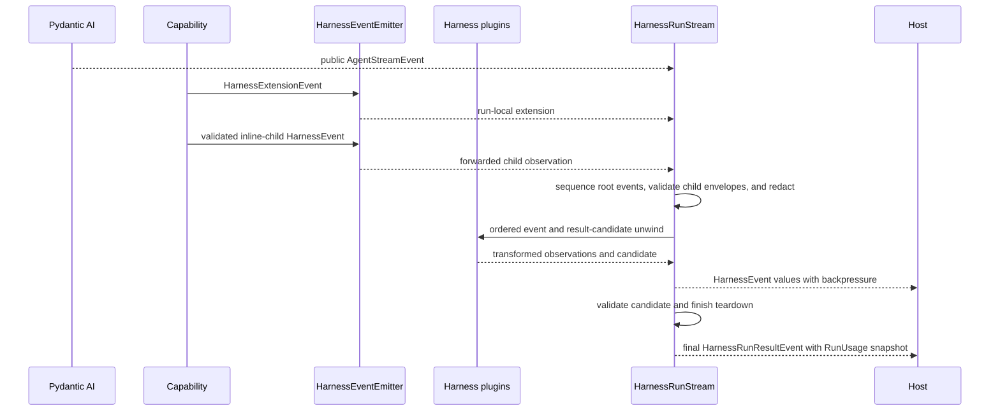
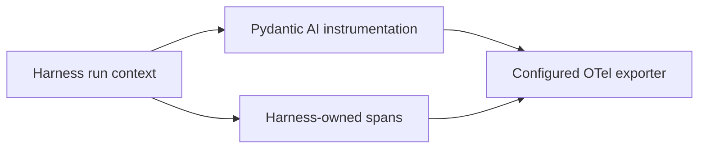

# Events, Observability, and Usage

## Design Position

`HarnessEvent` and `HarnessRunResultEvent` are stable process-local output seams. `AbstractCapability[AgentContext]` adapters produce Harness-owned observations, ordered Harness plugin middleware can transform or suppress non-terminal events and replace the complete result candidate, and one single-consumer `HarnessRunStream` preserves ordering and produces a terminal result event only after final validation and complete run-scoped teardown succeed.

Pydantic AI public events remain the source for model and tool execution and enqueue delivery; its `RunCancelled` is the source terminal signal for both explicit native cancellation and complete-boundary safe pause. The Harness classifies it as suspended only when safe-pause state was committed before native cancellation; every other first-party `RunCancelled` remains cancelled. It adds only context, state, active-run wrapper, safe-suspend, delegation, model-usage observation, and diagnostic events that Pydantic AI does not own. Pydantic AI `RequestUsage`, `RunUsage`, and `UsageLimits` remain authoritative for model-request usage, accumulation, and supported limits.

OpenTelemetry uses Pydantic AI's `Instrumentation` Capability plus spans for Harness-owned operations. Durable event delivery, cross-run usage aggregation, valuation, billing, and lifecycle facts belong to the host.

Event and observability behavior inside model, node, or tool execution uses Pydantic Capability hooks with `RunContext[AgentContext]`. A first-class Harness plugin can observe the outer canonical stream and result through `wrap_run`, but it does not install a background event broker, second public stream, usage accumulator, durable log, or broadcast system.

## Boundary

The harness does not define host lifecycle events, a broker, SSE, webhook, durable replay, cross-process delivery guarantee, observability backend, generalized resource meter, usage sink, price catalog, invoice, or payment system.

## Event Model

```python
class HarnessEvent(BaseModel):
    run_id: str
    sequence: int
    occurred_at: datetime
    event: AgentStreamEvent | HarnessExtensionEvent
```

`sequence` is strictly increasing within one run. The root run's sequence includes the final `HarnessRunResultEvent`. Resume starts another run and sequence domain. Forwarded inline-child events retain the child's run ID and sequence; the Delegation Capability consumes the child's result event internally. Concurrent runs have causal correlation through their `AgentInstanceContext`; timestamps do not establish a total order.

```python
class HarnessExtensionEvent(BaseModel):
    schema_version: str
    kind: Literal[
        "context",
        "state",
        "control",
        "delegation",
        "usage",
        "diagnostic",
    ]
    payload: JsonValue
```

Extension payloads are small discriminated schemas owned by their subsystem. The event envelope does not duplicate definition, lineage, policy, or host lifecycle fields already available from run context. [`Public API and Packaging`](14-public-api-and-packaging.md) owns `HarnessRunResultEvent` and the `HarnessStreamItem` union.

## Adaptation



Model and tool events preserve their public Pydantic AI types. This includes native `DeferredToolRequestsEvent` and `DeferredToolResultsEvent` observations for approval and external execution. The Harness does not recreate model-request, response-delta, tool, or client-call lifecycle state machines and does not add a second `DEFERRED_TOOLS` control event. A transport can project a convenience client-tools payload, but only the terminal `HarnessRunResult.deferred` and a Host's accepted durable pending record have continuation meaning. High-frequency Pydantic deltas may be coalesced by a consumer without changing complete messages or `HarnessState`. A live Environment topology update emits one bounded Harness `context` extension only after atomic application; any model-facing notification is separately delivered through native Pydantic enqueue and remains observable through the ordinary `EnqueuedMessagesEvent`.

`HarnessEventCapability` adapts Pydantic events and emits Harness extensions through the run-local emitter. Extensions cover:

| Kind         | Meaning                                                                                                                                       |
| ------------ | --------------------------------------------------------------------------------------------------------------------------------------------- |
| `context`    | Context contribution, omission, compaction, or successfully applied Environment-topology observation                                          |
| `state`      | State import or export observation, not durable snapshot status                                                                               |
| `control`    | Wrapper acceptance, committed safe-suspend, or normalized cancellation observation; never a duplicate pending queue or cancellation lifecycle |
| `delegation` | Inline child or Host-managed asynchronous submission observation                                                                              |
| `usage`      | One bounded, attributed `ModelUsageObservation` for a newly committed response; not provider billing proof                                    |
| `diagnostic` | Safe implementation/provider detail without lifecycle authority                                                                               |

## Run Stream and Content

```python
class HarnessEventEmitter(Protocol):
    async def emit(
        self,
        event: HarnessExtensionEvent,
    ) -> None: ...

    async def forward_child(
        self,
        event: HarnessEvent,
    ) -> None: ...
```

The Harness creates one emitter for each process-local run and places it on `AgentContext` for Capability authors. `emit()` creates a run-local extension event and assigns its envelope fields. `forward_child()` accepts only an event from a validated inline-child stream, preserves its child run correlation, and verifies lineage before forwarding. The emitter feeds the same ordered internal path as adapted Pydantic events. Harness plugin middleware sees those values before public delivery; already delivered values cannot be retracted. The emitter is not supplied by the host and is not a general delivery service.

`HarnessRunStream` is class-based, lazily starts on first iteration, has exactly one consumer, and applies natural backpressure. It provides no replay or fan-out. An embedded application consumes it directly. A hosted worker consumes it once and projects events to any broker, SSE connection, WebSocket, log, or durable store selected by the host. Foundation Service's replayable lifecycle log is a separate Host contract: it atomically records bounded committed lifecycle facts and can selectively reference Harness observations without making every process-local delta durable.

Leaving the stream context before its terminal item cancels and drains the process-local run. A host that wants execution speed to be independent of a downstream client consumes the Harness stream into its own bounded delivery mechanism rather than asking the Harness to buffer unbounded events.

The harness redacts extension payloads before emission. Credentials, grants, transient prompt overlays, quarantined content, and provider-native secret fields are absent. Prompt, argument, and result bodies are excluded by default and included only under explicit content policy.

A state event or terminal `HarnessRunResultEvent` remains a process-local observation. Plugin middleware can replace a candidate but cannot grant Host durability, forge external side-effect evidence, or retract prior events. The result event is emitted only after final candidate validation and run-scoped teardown succeed, but it is still not a committed host lifecycle transition or durable checkpoint. Teardown failure raises `RunCleanupError` with any frozen primary outcome and produces no terminal event.

## OpenTelemetry

Pydantic AI's public `Instrumentation` Capability owns Agent-run, model-request, tool-execution, enqueue, and cancellation spans where provided. Harness observability capabilities add attributes to the active run span and create spans only for Harness-owned context, state, wrapper validation, safe suspend, and delegation operations.



One operation has one owning span path. Harness code enriches upstream spans rather than wrapping them with duplicate model/tool spans. Safe attributes include run ID, Agent instance, capability/tool identifiers, Environment provider and generation, and opaque host correlation. Credentials, grants, prompts, arguments, and results follow content policy. Pydantic instrumentation content capture is disabled unless the same content policy explicitly enables it.

### Vendor Enrichment

The default profile emits standard OpenTelemetry and has no vendor SDK dependency. A vendor Capability can configure an exporter and propagate vendor attributes without replacing Pydantic instrumentation.

The Langfuse profile maps host-approved values to Langfuse `user_id`, `session_id`, tags, metadata, version, environment, and trace naming through the Langfuse OTel-native SDK or equivalent documented attributes. The mapping occurs on the enclosing run observation so Pydantic child spans inherit it.

Inline subagent executions are represented as nested `agent` observations containing their model and tool spans. A visible child Agent does not also receive a sibling dispatch span for the same work. Host-managed asynchronous submission has only a dispatch observation in the parent trace; the independently scheduled child starts its own trace and is correlated by safe Host metadata.

Exporter failure follows OpenTelemetry policy and does not change run outcome. A required audit sink is a host facility, not an OTel exporter mode.

## Run Usage

Pydantic AI `RunUsage` is the sole process-local usage accumulator. The Harness defines no parallel token accumulator, contribution ledger, sink, or meter taxonomy. It adds one narrow pricing hook and one attributed observation per newly committed response because aggregate usage cannot preserve model, provider, timestamp, lineage, pricing coverage, or stable response identity.

A top-level `run()` or `stream()` call normally omits `usage` and receives a fresh accumulator. A caller can instead supply `usage: RunUsage` to share an explicit in-process aggregate, matching Pydantic AI's public run API. `HarnessRunStream.usage` exposes that live accumulator. Every terminal `HarnessRunResult.usage` is a copy taken at the terminal boundary, so an already returned result never changes when a shared accumulator receives later increments.

Pydantic AI adds each model response's `RequestUsage`, including its best-effort USD `cost`, to the accumulator. Finalized `ModelResponse` values in Pydantic message history retain per-request usage, provider, model, timestamp, and cost attribution; Pydantic instrumentation can project the same request-level facts to telemetry. The Harness emits a narrow `usage` extension only to preserve that existing request fact with stable run-local identity and pricing coverage. It does not count usage again or create another accumulator. Aggregate token counts cannot reconstruct per-model pricing after attribution is discarded, and an aggregate cost can be partial when some responses cannot be priced.

### Cost Calculation

```python
@dataclass(frozen=True)
class ModelCostInput:
    model_name: str | None
    provider_name: str | None
    provider_url: str | None
    timestamp: datetime
    usage: RequestUsage


class ModelCostCalculator(Protocol):
    @property
    def revision(self) -> str: ...

    def calculate(self, value: ModelCostInput) -> Decimal | None: ...
```

`RunBindings.model_cost_calculator` optionally supplies a Host-owned calculator with a non-empty immutable `revision` identifying its complete custom-and-fallback policy. The core usage-pricing Capability occupies the final normal `after_model_request` position after declared response transforms and before native cost fill and `RunUsage` accumulation. It passes only pricing inputs; `usage` is a copy whose existing `cost` is cleared, and prompt, response content, credentials, and arbitrary provider payloads are absent.

A returned finite non-negative `Decimal` is the estimated USD cost for that complete logical response and replaces any provider-populated value. Returning `None` declines the response: an existing provider cost remains, otherwise Pydantic AI performs its normal `genai-prices` lookup and leaves the cost unknown when no price exists. Invalid numbers and calculator exceptions emit bounded diagnostics and follow the same decline path. This custom-first normal path lets a Foundation Service catalog override selected models while retaining broad built-in coverage. Timestamp-aware calculators can implement peak/off-peak rates without putting a pricing-table schema in the Harness.

This hook is not misrepresented as a universal response-commit seam. An earlier sibling hook can reject with `ModelRetry`, a later incompatible hook can supersede the priced object, and Pydantic can finalize an interrupted partial stream without running `after_model_request`. Those responses retain provider or `genai-prices` pricing and their usage observation reports `custom_pricing_status="not_reached"`; the Harness does not rewrite an already accumulated cost after the fact. Provider continuation segments can also receive native pricing before Pydantic merges them; the custom calculator sees and can override only the final logical response, so segment-specific or cross-time-window valuation requires a future upstream segment-commit seam or provider receipts.

The calculator is synchronous, deterministic for its immutable selected catalog revision, and performs no network or storage I/O on the model path. A Host refreshes or resolves catalog data before the run and injects a ready calculator. The Harness validates but does not interpret the revision; a durable Host retains it with its usage records. Optional price estimation never fails model execution. Currency conversion, discounts, credits, invoices, and financially authoritative settlement stay outside this USD estimate.

The Harness does not serialize the calculator or catalog revision into `HarnessState`. `RunUsage.cost` remains the public live and terminal estimate and participates in native Pydantic `UsageLimits.cost_limit` for costs available on the path Pydantic is checking; there is no second `CostEstimate` accumulator. A response observation makes custom coverage explicit rather than implying that the selected revision priced every request.

### Per-response Observation

```python
type CostSource = Literal[
    "custom",
    "provider",
    "genai_prices",
    "provider_or_genai_prices",
    "unknown",
]
type CustomPricingStatus = Literal[
    "applied", "declined", "failed", "not_configured", "not_reached"
]


class ModelUsageObservation(BaseModel):
    schema_version: str
    harness_run_id: str
    response_ordinal: int
    lineage_ref: str | None
    response_state: str | None
    model_name: str | None
    provider_name: str | None
    response_timestamp: datetime
    request_usage: RequestUsage
    pricing_revision: str | None
    cost_source: CostSource
    custom_pricing_status: CustomPricingStatus
```

The core usage Capability assigns `response_ordinal` monotonically from zero only when a response is proven to be a model-node commit that entered Pydantic `RunUsage`, or the exact interrupted response committed by Pydantic's handled partial-response path. It uses public model-node hooks to capture the message boundary before that node and the exact node result or post-node delta after it; handled outcome normalization uses the same captured boundary for the exact partial response. A private run-local provenance set prevents a response from receiving another ordinal after history processing, replacement, or repeated boundary inspection.

`run_id` and message position alone are explicitly insufficient evidence. A synthetic `ModelResponse` supplied through `RunContext.enqueue()`, imported history, or a history processor is excluded unless it independently traverses the native model commit path and increments usage. A `SkipModelRequest` response that does traverse that path remains eligible even when its model name is absent. The compatibility suite pins these distinctions against the supported Pydantic minor.

The Capability emits exactly one bounded `usage` extension for each eligible committed response with reported usage. The observation copies the supported final `RequestUsage` fields under fixed detail-count, key-length, numeric, and encoded-size bounds; unsupported provider detail is omitted with a diagnostic rather than copied as arbitrary metadata. It does not increment `RunUsage`. Its run ID and ordinal remain stable after compaction and across event redelivery.

A missing `model_name` remains `None`; the Harness never attributes a skipped or synthetic response to the currently selected model. A calculator may explicitly price such input or return `None`, while `genai-prices` fallback normally remains unavailable without a model name.

The Capability tracks whether the exact committed response passed its pricing hook. `applied`, `declined`, and `failed` report the calculator outcome. `not_configured` means no Host calculator was selected. `not_reached` covers an interrupted partial response, an earlier hook short-circuit, or a priced response later superseded before commit. `cost_source` says which value actually remains: custom, provider-reported, `genai-prices`, an indistinguishable provider-or-`genai-prices` value, or no known cost. On a bypassed path, Pydantic AI may have run its `genai-prices` fill before the Harness can observe whether the provider had already set cost, so a present value is honestly reported as `provider_or_genai_prices` rather than guessed. A selected `pricing_revision` therefore records policy context without falsely claiming custom coverage or source.

Inline child observations retain the child's run ID, sequence, ordinal, and lineage when `forward_child()` projects them into the parent stream. This is the narrow public evidence a Host needs even though `DelegationCapability` consumes the child terminal result and the parent's message history does not contain the child's model history. If another hook, the stream consumer, or the worker fails before an observation is delivered or durably accepted, usage can remain missing; the Harness does not claim a provider-grade accounting guarantee.

### Inline Delegation

`DelegationCapability` passes the parent's live `RunContext.usage` to every inline child. A nested inline tree therefore accumulates into one object, and the root result includes the root run plus all inline descendants. The internally consumed child result contains a cumulative snapshot at the child's terminal boundary, not a child-only delta; per-child durable attribution comes from forwarded child `ModelUsageObservation` values rather than subtraction from the shared total, while Pydantic messages and telemetry remain diagnostic observations.

Because inline descendants share `RunUsage`, their fresh child bindings use the same `ModelCostCalculator` selection as the root; mixing catalog policies inside one shared accumulator is rejected. Host-managed asynchronous children have independent runs and can select another catalog revision. The child receives the fieldwise stricter intersection of the parent's effective `UsageLimits`, any explicit `SubagentDefinition.usage_limits`, and current delegation policy. Pydantic AI checks cumulative limit fields against the shared aggregate visible at that run's own request and tool boundaries; `per_request_input_tokens_limit` remains local to each request. The limits are not a fresh allowance measured from child entry, but the checks are also not atomic across independent inline runs. Parallel children can race before usage updates, and enclosing delegation tool calls can be counted after child work. Native enforcement therefore constrains each run from current shared usage without promising a hard tree-wide budget. Strict aggregate admission requires separate host serialization or reservation policy.

### Host-Managed Asynchronous Children and Resume

A Host-managed asynchronous child, resumed run, retry, or later programmatic run executes with a fresh accumulator unless an in-process caller explicitly shares one. An asynchronous child with no declared `UsageLimits` starts from Pydantic AI's effective defaults; an explicit object preserves explicit field values, including `None`, before Host policy narrows it for that child run. No `RunUsage` enters `HarnessState` or `AgentContextState`, and a host does not inject its durable cumulative total as the next run's starting usage.

The Host derives durable records only from `ModelUsageObservation` values emitted by each root or inline run; imported history is never reattributed to a resumed run. Root and inline terminal `RunUsage` copies are cumulative observations and are not additional records to sum. Host-managed asynchronous children, retries, and resumed Attempts have independent root scopes and fresh accumulators. Foundation Service's idempotent record, coverage, and pricing-revision semantics are defined by [Usage Recording and Cost Estimation](../foundation-service/05-usage-accounting.md).

Pydantic `RunUsage` covers model usage, best-effort calculated model cost, and Pydantic's tool-call count. Environment CPU, storage, provider-specific non-model resources, invoices, credits, and financial reconciliation are outside the Harness usage contract and can be metered by their owning Host or provider.

## Failure Boundary

Missing provider usage is not fabricated. A handled failed, suspended, or cancelled result candidate snapshots the usage known at its outcome boundary; it becomes a delivered result only after run-scoped teardown succeeds. Pydantic AI `UsageLimitExceeded` is normalized as `status="failed"` with `SafeFailure.code="usage_limit_exceeded"`, `retry_hint="dependency_change"`, bounded normalized limit details, the terminal usage snapshot, and any latest complete state. Its output and deferred fields are absent. For inline delegation, `DelegationCapability` projects that failed child result through `pydantic_ai.exceptions.ToolFailed` with sanitized bounded content. External consumer cancellation still raises with ordinary async semantics; teardown does not invent usage. Consumer cancellation and early context exit follow the run-stream cleanup contract. OTel failure remains diagnostic.

Event delivery outside the process is a projection made by the single Harness stream consumer. A `CheckpointCapability` publishes an exported checkpoint candidate through its `CheckpointStore`; it never becomes authority for live `AgentContextState` or mutates another Capability's state.

## Compatibility

The event envelope and extension-event schemas evolve independently. Pydantic event and usage changes remain visible through the supported public types. Semantic changes to an extension kind use a new schema version.

## Trade-offs

- Passing through Pydantic events avoids a second model/tool vocabulary, while consumers must understand the supported public event union.
- A single-consumer stream gives bounded lifecycle and backpressure semantics, while hosts perform any replay or fan-out.
- Minimal harness extensions preserve cohesion but leave durable lifecycle projection to the host.
- Native `RunUsage` keeps upstream accumulation and limit semantics, while durable cross-run totals and non-model metering remain host concerns.

## Invariants

01. One event sequence belongs to one process-local run; each Harness-handled root outcome whose teardown succeeds ends with exactly one result event, while early exit, external cancellation, cleanup failure, and unhandled errors do not synthesize one.
02. Forwarded inline-child events preserve child correlation and never grant child result or control authority to the outer consumer.
03. Each `HarnessRunStream` has one consumer; replay and fan-out belong to the host.
04. Model-, node-, and tool-level event extensions are `AbstractCapability[AgentContext]` implementations; outer stream/result transforms are ordered Harness plugins.
05. Pydantic public events remain authoritative for model/tool event shape.
06. Harness events and OTel are not host lifecycle authority.
07. `RunUsage` is the only process-local usage accumulator; the Harness result stores a terminal copy.
08. A Host calculator overrides a normally committed response only when it returns a finite non-negative cost; decline and failure fall back without failing the run, while bypassed paths are reported as `not_reached` rather than falsely attributed.
09. Each proven native model or handled-partial commit with reported usage emits one stable run-local `ModelUsageObservation`; enqueue, imported history, and history processing cannot create usage records merely by placing a response in messages.
10. Inline descendants share the root accumulator and calculator selection, but retain child-correlated response observations; Host-managed asynchronous children and later runs use fresh accumulators.
11. Imported message history never becomes new usage for a resumed run, and no usage accumulator or calculator enters `HarnessState` or `AgentContextState`.
12. Sensitive and transient content is absent from pricing input, usage observations, default events, and telemetry.
