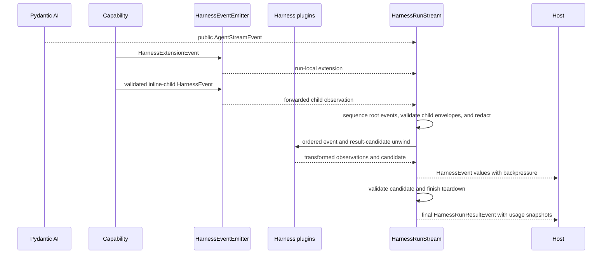
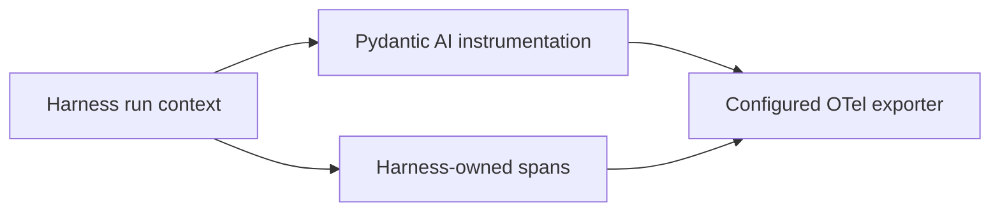

# Events, Observability, and Usage

## Design Position

`HarnessEvent` and `HarnessRunResultEvent` are stable process-local output seams. `AbstractCapability[AgentContext]` adapters produce Harness-owned observations, ordered Harness plugin middleware can transform or suppress non-terminal events and replace the complete result candidate, and one single-consumer `HarnessRunStream` preserves ordering and produces a terminal result event only after final validation and complete run-scoped teardown succeed.

Pydantic AI public events remain the source for model output and tool execution, and `RunCancelled` is the source terminal signal for native cancellation. The Harness adds only bounded model-request boundary observations plus correlation, context, state, recovery, managed-invocation, delegation, usage-attribution, and diagnostic events that Pydantic AI does not own. Pydantic AI `RequestUsage`, `RunUsage`, and `UsageLimits` remain authoritative for model-request usage, accumulation, and supported limits. When semantic recovery starts another `ModelAttempt`, events already delivered by the earlier attempt remain observations in the same logical Harness stream and cannot be retracted.

OpenTelemetry uses Pydantic AI's `Instrumentation` Capability plus spans for Harness-owned operations. Durable event delivery, cross-run usage aggregation, valuation, billing, and lifecycle facts belong to the host.

Event and observability behavior inside model, node, or tool execution uses Pydantic Capability hooks with `RunContext[AgentContext]`. A first-class Harness plugin can observe the outer canonical stream and result through `wrap_run`, but it does not install a background event broker, second public stream, usage accumulator, durable log, or broadcast system.

## Boundary

The Harness does not define Host lifecycle events, a broker, SSE, webhook, durable replay, cross-process delivery guarantees, an observability backend, a universal resource taxonomy, a durable usage sink, a price catalog, invoices, or payment.

## Event Model

```python
class HarnessEvent(BaseModel):
    thread_id: str
    run_id: str
    sequence: int
    occurred_at: datetime
    event: AgentStreamEvent | HarnessExtensionEvent
```

`thread_id` identifies the independently advancing Thread; `run_id` identifies the process-local Harness Run. Both are present on ordinary and terminal events, including failures that have no returned State. `sequence` is strictly increasing within one Run. The root Run's sequence includes the final `HarnessRunResultEvent`. Resume preserves `thread_id` while starting another `run_id` and sequence domain. Forwarded inline-child events retain the child's run ID and sequence; the Delegation Capability consumes the child's result event internally. Concurrent runs have causal correlation through their `AgentInstanceContext`; timestamps do not establish a total order.

```python
class HarnessExtensionEvent(BaseModel):
    schema_version: str
    kind: Literal[
        "context",
        "state",
        "recovery",
        "invocation",
        "delegation",
        "usage",
        "lifecycle",
        "diagnostic",
    ]
    payload: JsonValue
```

Extension payloads are small discriminated schemas owned by their subsystem. First-party producers construct a frozen typed Pydantic payload and pass only `model_dump(mode="json")` output to the open envelope; they do not assemble payload dictionaries ad hoc. The event envelope does not duplicate definition, lineage, policy, or host lifecycle fields already available from run context. [`Public API and Packaging`](14-public-api-and-packaging.md) owns `HarnessRunResultEvent` and the `HarnessStreamEvent` union.

## Adaptation



Model output and tool events preserve their public Pydantic AI types. This includes native `ThinkingPart`, `TextPart`, function-tool call and result events, `DeferredToolRequestsEvent`, and `DeferredToolResultsEvent`. The Harness observes the public `ModelRequestNode` boundary but does not recreate provider transport, response-delta, thinking, generation, tool, client-call, or run-terminal lifecycle state machines and does not add a second `DEFERRED_TOOLS` control event. A transport can project a convenience client-tools payload, but only the terminal `HarnessRunResult.deferred` and a Host's accepted durable pending record have continuation meaning. High-frequency Pydantic deltas may be coalesced by a consumer without changing complete messages or `HarnessState`.

### First-party Event Contracts

One code-owned mandatory lifecycle observer emits `lifecycle` payloads at the public Pydantic `ModelRequestNode` boundary. `request_index` is the zero-based node ordinal within the logical Harness run, including internal recovery attempts, and `request_id` is `model-request-{request_index + 1}`. `model_request_started` is emitted before the node handler and includes `message_count`. Successful handler return emits `model_request_completed`; handler failure emits `model_request_failed` with a bounded stable `error_code`. The observation means that Harness entered or left the node boundary; it does not claim that a provider accepted, transmitted, or generated bytes. Raw exceptions and provider error bodies are excluded.

The Compaction Capability emits one `context_snapshot` immediately before each eligible ordinary model request's threshold decision. It uses the same estimator as that decision and contains `request_index`, `estimated_tokens`, optional configured `trigger_tokens`, `target_tokens`, and `preserve_recent_user_turns`, `compaction_pending`, and `estimation_method="harness_context_estimator"`. Exact deferred/provider-suspended boundaries do not emit a snapshot, and one eligible request emits at most one. The estimate guides Harness behavior but is not provider accounting or a guaranteed context-window measurement.

Handoff and compaction share persisted replacement machinery but have disjoint event types:

| Operation  | Event sequence                                                                                  |
| ---------- | ----------------------------------------------------------------------------------------------- |
| Handoff    | `handoff_started`, `handoff_prepared`, then `handoff_completed` or `handoff_failed`             |
| Compaction | `compaction_started`, `compaction_prepared`, then `compaction_completed` or `compaction_failed` |

Each payload contains one concise kind-prefixed `operation_id`. The pending Handoff state persists that ID across model boundaries and continuation runs. A normal `summarize` call allocates and persists the handoff ID before `handoff_started`; compaction allocates and persists its ID after the threshold decision succeeds and before forcing `summarize`. A resumed pending operation reuses the persisted ID rather than emitting another start event.

`*_prepared` is emitted only after the validated summary is durably written to Capability state and includes only `summary_size` and `files_count`, never summary or file content. `*_completed` is emitted only after restored history is built, protected recent turns and the target budget are validated, pending state is durably cleared, and the replacement request context exists. A successful `summarize` tool result is therefore not completion. `*_failed` contains only `failed_phase`, stable `error_code`, and `retryable`; raw exceptions are excluded. A retryable failure retains the pending operation and its ID, while a non-retryable failure durably clears the pending operation before emission so a later boundary can start a fresh operation. A provider-suspended boundary that preserves a resumable pending operation is not failure. Compaction emits only `compaction_*`, never duplicate `handoff_*` observations.

Working State emits bounded revisioned committed deltas rather than snapshots. A `state` payload with `type="task_changed"` contains one `operation_id`, authoritative `state_revision`, reason `created`, `updated`, `claimed`, `completed`, `dependency_updated`, or `provider_observed`, and one task projection containing only `id`, `revision`, `subject`, `active_form`, `status`, `owner`, `blocks`, and `blocked_by`. Description, metadata, notes, and the full task map are excluded. Emission occurs only after authoritative persistence and the run's in-memory view both commit. One mutation that changes reciprocal dependency tasks emits one delta per changed task with the same operation ID and state revision. Failed and semantic no-op mutations emit nothing. A provider without a watch API guarantees observations only at Harness mutation and read boundaries.

Inline delegation emits typed `inline_delegation` payloads with action `started`, `completed`, or `failed`. Every action carries the same invocation ID, compact child instance ID, selected subagent name, bounded status, parent run and Agent-instance correlation, optional originating parent tool-call ID, and the child run ID whenever a child stream was created. `started` is emitted on the child run before child model work so it is forwarded in real time; terminal actions are emitted on the parent run after the complete child result or dispatch failure is classified. Uniform payload correlation, rather than envelope order or subagent-name matching, joins those observations. A pre-stream rejection has no child run ID and never fabricates one.

Each `usage_report` is likewise a typed payload containing its stable report ID, reporting reason, optional trigger record ID, valid chunk position and count, and one non-empty bounded record batch. Record schemas remain owned by the usage subsystem. First-party delegation and usage producers do not assemble free-form payload dictionaries.

Event delivery failure never rolls back committed Capability state. These process-local observations retain the backpressure, middleware, redaction, payload-size, and non-durability rules of the enclosing event stream.

The run-local Environment adapter reads an independent cursor from the bounded non-draining topology journal and emits exactly one bounded Harness `context` extension for every committed change, in publication order. It starts from `EnvironmentTopologyObserver.initial_topology_version`, so changes committed during `RunInputFactory` remain observable after `AgentContext` and Capabilities bind. Adapter cancellation or emitter/plugin failure can suppress later process-local delivery but cannot consume another observer cursor or roll back topology. Optional model-facing notification is a separate consumer delivered through native Pydantic enqueue or the next eligible public model-request hook; it can coalesce notices without coalescing Harness events. An enqueued notice remains observable through the ordinary `EnqueuedMessagesEvent`, while topology commit never depends on event or notice delivery.

`HarnessEventCapability` adapts Pydantic events and emits Harness extensions through the run-local emitter. Extensions cover:

| Kind         | Meaning                                                                                                                                     |
| ------------ | ------------------------------------------------------------------------------------------------------------------------------------------- |
| `context`    | Context contribution, omission, compaction, or successfully applied Environment-topology observation                                        |
| `state`      | State import or export observation, not durable snapshot status                                                                             |
| `recovery`   | Bounded inner-attempt interruption, backoff, restart, exhaustion, or normalized cancellation observation; never a durable Host retry fact   |
| `invocation` | Managed-tool preparation, authorization, approval, dispatch, retry, result-safety, or unknown-outcome observation; never a grant or receipt |
| `delegation` | Inline child or Host-managed asynchronous submission observation                                                                            |
| `usage`      | One bounded mixed-source `usage_report` emitted at a model-request or terminal reporting boundary; not durable billing proof                |
| `lifecycle`  | Bounded `ModelRequestNode` entry, completion, or safe failure observation; never provider transport or Host lifecycle authority             |
| `diagnostic` | Safe implementation/provider detail without lifecycle authority                                                                             |

## Run Stream and Content

```python
class HarnessEventEmitter(Protocol):
    async def emit(
        self,
        event: HarnessExtensionEvent,
    ) -> None: ...

    async def forward_child(
        self,
        event: HarnessEvent,
    ) -> None: ...
```

The Harness creates one emitter for each process-local run and places it on `AgentContext` for Capability authors. `emit()` creates a run-local extension event and assigns its envelope fields. `forward_child()` accepts only an event from a validated inline-child stream, preserves its child run correlation, and verifies lineage before forwarding. The emitter feeds the same ordered internal path as adapted Pydantic events. Harness plugin middleware sees those values before public delivery; already delivered values cannot be retracted. The emitter is not supplied by the host and is not a general delivery service.

`HarnessRunStream` is class-based, lazily starts on first iteration, has exactly one consumer, and applies natural backpressure. It provides no replay or fan-out. An embedded application consumes it directly. A hosted worker consumes it once and projects events to any broker, SSE connection, WebSocket, log, or durable store selected by the host. Foundation Service's replayable lifecycle log is a separate Host contract: it atomically records bounded committed lifecycle facts and can selectively reference Harness observations without making every process-local delta durable.

Leaving the stream context before its terminal item cancels and drains the process-local run. A host that wants execution speed to be independent of a downstream client consumes the Harness stream into its own bounded delivery mechanism rather than asking the Harness to buffer unbounded events.

The harness redacts extension payloads before emission. Credentials, grants, transient prompt overlays, quarantined content, and provider-native secret fields are absent. Prompt, argument, and result bodies are excluded by default and included only under explicit content policy.

A state event or terminal `HarnessRunResultEvent` remains a process-local observation. Plugin middleware can replace a candidate but cannot grant Host durability, forge external side-effect evidence, or retract prior events. The result event is emitted only after final candidate validation and run-scoped teardown succeed, but it is still not a committed host lifecycle transition or durable checkpoint. Teardown failure raises `RunCleanupError` with any frozen primary outcome and produces no terminal event.

## OpenTelemetry

Pydantic AI's public `Instrumentation` Capability owns Agent-run, model-request, tool-execution, and cancellation spans where provided. Harness observability capabilities add attributes to the logical run and create spans only for Harness-owned context, state, plugin validation, semantic recovery, and delegation operations.



One operation has one owning span path. Harness code enriches upstream spans rather than wrapping them with duplicate model/tool spans. Safe attributes include run ID, Agent instance, capability/tool identifiers, Environment provider and generation, and opaque host correlation. Credentials, grants, prompts, arguments, and results follow content policy. Pydantic instrumentation content capture is disabled unless the same content policy explicitly enables it.

### Vendor Enrichment

The default profile emits standard OpenTelemetry and has no vendor SDK dependency. A vendor Capability can configure an exporter and propagate vendor attributes without replacing Pydantic instrumentation.

The Langfuse profile maps host-approved values to Langfuse `user_id`, `session_id`, tags, metadata, version, environment, and trace naming through the Langfuse OTel-native SDK or equivalent documented attributes. The mapping occurs on the enclosing run observation so Pydantic child spans inherit it. This telemetry `session_id` is an observability grouping value: it does not define or override the provider model-session and prompt-cache affinity derived from each root or child State's `thread_id`.

Inline subagent executions are represented as nested `agent` observations containing their model and tool spans. A visible child Agent does not also receive a sibling dispatch span for the same work. Host-managed asynchronous submission has only a dispatch observation in the parent trace; the independently scheduled child starts its own trace and is correlated by safe Host metadata.

Exporter failure follows OpenTelemetry policy and does not change run outcome. A required audit sink is a host facility, not an OTel exporter mode.

## Run Usage

Pydantic AI `RunUsage` remains the sole process-local accumulator for model requests, tokens, best-effort model cost, tool-call count, and native `UsageLimits`. The Harness adds a run-local append-only attribution ledger, not a second accumulator. Its immutable `UsageRecord` union preserves where independently produced usage came from:

- `ModelUsageRecord` captures one model response proven to have entered native `RunUsage`, including bounded request usage, model/provider attribution, response state, lineage, and pricing coverage;
- `ProviderUsageRecord` captures a stable provider receipt contributed by a managed tool or Capability, with provider-neutral measures and optional currency-denominated cost.

Provider records do not modify model token totals or native limits. Capability-owned paths record them through `AgentContext.record_provider_usage()`; raw provider metadata, credentials, content, and private provider enums are not part of the contract. Reusing the same provider/product/usage ID is idempotent, while conflicting semantic usage or attribution fails closed.

### Reporting Boundary

Every committed model request is a reporting boundary. After recording that request, the mandatory Usage Capability emits bounded `usage_report` extensions containing every record not included in an earlier report, including mixed provider usage produced since the previous boundary. Large batches may be split into deterministic chunks. A terminal flush reports provider records produced after the final model request, and `HarnessRunResult.usage_records` contains a detached complete run-local snapshot.

Report and record identities are stable for delivery retry and deduplication. Model identity is run-and-ordinal based; provider receipt identity is stable across Harness runs. Reports are process-local observations, not proof of durable ingestion or financial settlement. A Host consumes the canonical stream once and owns persistence, retry, cross-run aggregation, reconciliation, and billing.

The model commit observer uses public Pydantic node, message, and usage boundaries. Normal responses, handled interrupted partial responses, retry-producing requests, and requests that commit before a usage-limit failure remain attributable. Imported history, enqueued or synthetic responses, and history-only processing are not attributed merely because a `ModelResponse` is present.

### Cost Calculation

A fresh optional `ModelCostRunCapability` carries one synchronous deterministic Host calculator. On the normal model-response path, a finite non-negative USD result replaces provider-populated cost before native accumulation; decline, invalid output, or failure falls back without failing the Agent run. The resulting model record names the selected pricing revision, actual cost source, and whether custom pricing was applied, declined, failed, absent, or not reached.

Pricing input contains only model/provider identity, safe provider URL when available, timestamp, and a copy of request usage with cost cleared. Prompt and response content, credentials, and arbitrary provider payloads are excluded. Catalog storage, refresh, currency conversion, discounts, invoices, and settlement remain Host concerns. Interrupted or short-circuited paths that bypass the calculator retain the cost actually available and are not retroactively rewritten.

### Delegation, Resume, and Limits

Inline children share the parent's live `RunUsage` and calculator selection but retain child-correlated attribution records. Their effective limits are narrowed by delegation policy; native checks do not promise an atomic tree-wide budget across concurrent children. The root terminal `HarnessRunResult.usage` therefore covers the complete inline descendant tree, while `HarnessRunResult.usage_records` is the local logical run's attribution snapshot only. Child records remain observable as child-correlated `usage_report` events and are not copied into the parent's local ledger or priced again. A Host that needs a tree-wide attribution view joins those immutable records by run lineage and stable record identity. Host-managed asynchronous children and later or resumed root runs normally use fresh accumulators and ledgers.

Neither `RunUsage`, the attribution ledger, provider receipts, nor a calculator enters `HarnessState`. Imported messages remain historical, so a resumed run reports only newly committed usage. Terminal cumulative `RunUsage` snapshots and child snapshots can overlap and are never summed as independent contributions; durable projections use immutable usage records instead.

## Failure Boundary

Missing provider usage is not fabricated. A handled failed, suspended, or cancelled result candidate snapshots the usage known at its outcome boundary; it becomes a delivered result only after run-scoped teardown succeeds. Pydantic AI `UsageLimitExceeded` is normalized as `status="failed"` with `SafeFailure.code="usage_limit_exceeded"`, `retry_hint="dependency_change"`, bounded normalized limit details, the terminal usage snapshot, and any latest complete state. Its output and deferred fields are absent. For inline delegation, `DelegationCapability` projects that failed child result through `pydantic_ai.exceptions.ToolFailed` with sanitized bounded content. External consumer cancellation still raises with ordinary async semantics; teardown does not invent usage. Consumer cancellation and early context exit follow the run-stream cleanup contract. OTel failure remains diagnostic.

Event delivery outside the process is a projection made by the single Harness stream consumer. A `CheckpointCapability` publishes an exported checkpoint candidate through its `CheckpointStore`; it never becomes authority for live `AgentContextState` or mutates another Capability's state.

## Compatibility

The event envelope and extension-event schemas evolve independently. Pydantic event and usage changes remain visible through the supported public types. Semantic changes to an extension kind use a new schema version.

## Trade-offs

- Passing through Pydantic events avoids a second model/tool vocabulary, while consumers must understand the supported public event union.
- A single-consumer stream gives bounded lifecycle and backpressure semantics, while hosts perform any replay or fan-out.
- Minimal harness extensions preserve cohesion but leave durable lifecycle projection to the host.
- Native `RunUsage` keeps upstream accumulation and limit semantics, while the attribution ledger preserves mixed-source facts for Host-owned persistence and reconciliation.

## Invariants

01. One event sequence belongs to one process-local run; each Harness-handled root outcome whose teardown succeeds ends with exactly one result event, while early exit, external cancellation, cleanup failure, and unhandled errors do not synthesize one.
02. Forwarded inline-child events preserve child correlation and never grant child result or control authority to the outer consumer.
03. Each `HarnessRunStream` has one consumer; replay and fan-out belong to the host.
04. Model-, node-, and tool-level event extensions are `AbstractCapability[AgentContext]` implementations; outer stream/result transforms are ordered Harness plugins.
05. Pydantic public events remain authoritative for model/tool event shape.
06. Harness events and OTel are not host lifecycle authority.
07. `RunUsage` is the only process-local usage accumulator; the Harness result stores a terminal copy.
08. A Host calculator overrides a normally committed response only when it returns a finite non-negative cost; decline and failure fall back without failing the run, while bypassed paths are reported as `not_reached` rather than falsely attributed.
09. Each proven native model or handled-partial commit creates one stable model record and flushes all pending mixed records in bounded reports; enqueue, imported history, and history processing cannot create model records merely by placing a response in messages.
10. Provider receipt identity is stable and idempotent; provider usage does not alter native model totals or limits, and conflicting receipt reuse fails closed.
11. Inline descendants share the root accumulator and calculator selection but retain child-correlated records; Host-managed asynchronous children and later runs use fresh accumulators and ledgers.
12. Imported message history never becomes new usage for a resumed run, and no usage accumulator, ledger, provider receipt, or calculator enters `HarnessState` or `AgentContextState`.
13. Sensitive and transient content is absent from pricing input, usage records, default events, and telemetry.
