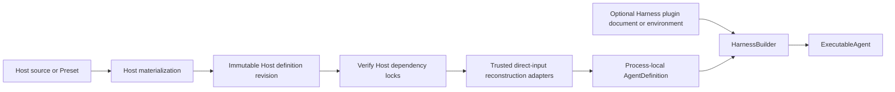
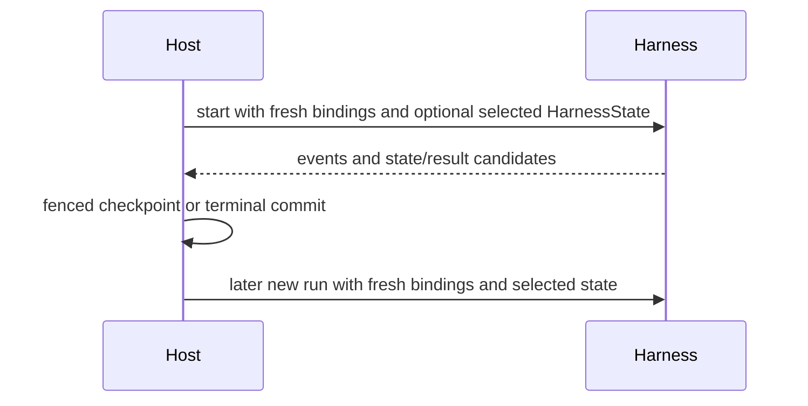

# Harness Hosting Contract

## Design Position

Embedded applications and hosted execution workers use the same code-first Harness API. The Harness does not expose a separate hosted Agent format. A hosted service owns durable Agent definition schemas, Presets, immutable revisions, dependency locks, and reconstruction adapters; the worker reconstructs one process-local `AgentDefinition` and calls `HarnessBuilder`. Plugin middleware may instead use the narrow Harness-owned configuration document and Build Context, so the Host need not expose or implement plugin factory concepts.

The Host also owns durable acceptance, worker lease generations, leases, checkpoint selection, deferred delivery, recovery, and terminal commit. The Harness returns only process-local observations and state candidates.

## Boundary

| Concern                                     | Host                                           | Harness                                 |
| ------------------------------------------- | ---------------------------------------------- | --------------------------------------- |
| Authoring schema, Presets, revision, locks  | Owns                                           | No durable schema                       |
| Trusted direct Python object reconstruction | Owns                                           | Validates process-local composition     |
| Optional plugin configuration/loading       | Persists or supplies deployment input          | Owns document, loading, and application |
| Agent Identity and provider policy          | Issues/evaluates                               | Carries through fresh bindings          |
| Environment and model binding               | Constructs fresh values and retains controller | Enters/uses and owns run resource scope |
| Agent loop and outer middleware             | Delegates                                      | Owns process-locally                    |
| Internal model semantic attempts            | Observes one logical run                       | Owns bounded recovery                   |
| Worker crash and durable replay             | Owns                                           | Exports portable state only             |
| Durable completion and delivery             | Owns                                           | Returns a candidate                     |

## Definition Mapping

The Host revision stores only Host-owned serializable values and exact dependencies. It can include logical model IDs, model settings, plugin/provider configuration, tool declarations, output schema, and artifact locks under Foundation schemas. It does not store a Harness compiler document, catalog manifest, Python class, plugin instance, Model, Toolset, Capability, callable, credential, or live client.

At execution time trusted installed adapters create:

- native `AgentSpec` and, for code-first output, a process-local `OutputSpec`;
- optional Model or logical model name;
- Agent-bound Capabilities that own all function tools, Toolsets, guidance, settings, and hooks;
- optional direct concrete Harness plugin instances;
- self-healing and semantic recovery policy.

Configured plugin instances are created by `HarnessBuilder` from an explicit `HarnessBuildContext` or the ambient source. The deployment switch remains false by default, while a trusted create-and-run or create-and-stream Host path can pass `configured_plugins_enabled=True` when constructing that operation's executable. They need not be reconstructed by a Host adapter, and the choice cannot change after Agent construction.

A declarative object JSON Schema remains in native `AgentSpec.output_schema` and is the build-time output source when no process-local `OutputSpec` is supplied. The worker never changes output type per run.

The resulting value is an ordinary `AgentDefinition`. An operator may pass an explicit Harness Build Context from the Harness plugin document or opt deployment environment loading in. The builder imports only enabled `converge_agent_harness.plugins` keys, creates fresh instances for each root and nested definition, and merges them after direct plugins. Entry-point availability never grants trust, and configuration identifies a key rather than an import target. The Harness does not verify Host artifact digests or inspect Preset provenance.

## Run Mapping

For each logical run the Host constructs `RunBindings` with:

- the trusted `AgentInstanceContext`;
- one fresh `EnvironmentRunBinding` and its paired `EnvironmentTopologyController` retained by the Host;
- an optional fresh `ModelRunBinding`;
- fresh run Capabilities;
- bounded non-authoritative metadata.

The Host assigns a distinct stable `AgentInstanceRef` to every independently advancing root, child, or fork message history and preserves that reference when it selects a continuation of the same history. A new Harness run or worker lease generation changes transient run correlation, not the selected Agent instance.

The Harness enters the Environment aggregate and activates the paired controller for the complete logical run. A Host reconciliation task can start before stream entry and await `controller.wait_until_active()` without polling, so an authorized Host path can materialize fresh provider bindings and add, refresh, or remove bindings during input preparation, model attempts, tool work, or recovery backoff. The controller is a process-local mutation handle: it is never put in metadata, `AgentContext`, a Capability namespace, a model tool, or a durable record, and it cannot be reused after the run terminal fence.

An operator may populate its Environment provider registry from explicitly selected `converge_agent_harness.environments` entry-point metadata after verifying the exact dependency/artifact lock. As with Harness plugin factories, entry-point availability never authorizes a definition, and a durable row never carries an import target. A provider that allocates before Harness entry still implements the stronger Host materialization, launch-state, reconciliation, and unentered-discard contract rather than using the simple pre-entry-inert factory path.

A hosted model integration normally implements `ModelRunBinding`, resolves its own trusted configuration, current policy, credentials, and route selection, and returns a native Model or raises. It also derives or restores provider model-session and prompt-cache affinity from the stable `AgentInstanceRef` and selected model/provider namespace. A product-conversation routing key may remain broader, but it cannot be reused as the prompt-cache key for the root and all children because those Agents own different message histories. The Harness applies no special catalog role validation and, if a Host omits the binding for a string model, deliberately delegates to native Pydantic inference. A fail-closed hosted profile therefore requires its worker adapter to supply and test the binding; this is a Host invariant, not a different Harness API.

The Host passes optional `HarnessState`, native input or an input factory, one `RunUsage` accumulator, and optional native `UsageLimits`. One logical run can contain several inner Pydantic attempts while retaining the same Host worker lease generation, bindings, context, Environment, plugins, state coordinator, and usage accumulator.

## State and Resume Mapping

The Host stores and selects `HarnessState`. It separately stores definition revision, desired Environment topology, provider launch/lifecycle data, any opaque non-derivable model-session continuation selector, accepted client-tool pending data, asynchronous child state, delivery ledgers, and durable reconciliation evidence.

`HarnessState` restores public Pydantic messages, JSON Capability namespaces, and optional provider-defined portable Environment data for already selected fresh bindings. It does not restore topology, provider reachability, or launch authority. Plugin objects, Model bindings, Environment bindings, controllers, credentials, policy, usage, active attempts, and delivery facts are rebuilt.

The Harness defines no mandatory model route pin or provider-session schema. If one provider requires an additional durable continuation selector beyond public messages, the Host and that model integration own it as provider-specific state and associate it with the stable Agent instance. It is not a generic Harness recovery condition, and the Host never substitutes a fresh Harness or inner run ID for it.

## Recovery Mapping

The Host distinguishes:

- internal Harness semantic attempts inside one live logical run;
- a new durable worker lease generation after process loss, lease loss, or selected recovery.

A new Host worker lease generation always creates a new Harness run with fresh bindings and a new controller. It reconstructs desired topology from Host state, consumes selected provider launch state before Harness entry, uses only an authoritative selected checkpoint, and does not blindly replay a possible external mutation. The interrupted-tool normalization text explicitly preserves unknown outcome and tells the next model to inspect current state.

Provider transport retry and Harness Model self-healing do not advance the Host worker lease generation. Usage observations from all inner semantic attempts remain in the one logical run accumulator and must not be double-counted with terminal snapshots.

## Deferred and Client-side Tools

Native Pydantic `DeferredToolRequests` end the Harness run as `status="suspended"`. The Host owns durable pending-call/approval records, authentication, external execution, idempotent feedback, and selection of a later continuation state. A continuation starts a new Harness run with that prior state, fresh `RunBindings`, the exact remounted tool surface, and `DeferredToolResume` containing the authoritative pending request plus its complete native results.

External calls and approvals remain distinct. A Host reconstructs exact tool surfaces from its own revision and pending attachment and verifies their identity before resume; those surfaces and the resume envelope are not encoded in `HarnessState`.

## Asynchronous Children

The executable-owned `SubagentCollection` is process-local topology and grants no scheduling authority. A Host-defined Capability can use a fresh typed service collaborator to accept independent child work. The Host owns child Thread and Turn identity, stable child Agent instance and model-conversation affinity, worker leases, checkpointing, cancellation, result retention, and delivery.

A successful asynchronous spawn is an ordinary tool result, not `DeferredToolRequests`. Child completion becomes later Host-selected semantic input and does not satisfy the original spawn tool call.

## Events and Completion

The Host consumes one `HarnessRunStream` and may persist, coalesce, or fan out events. Earlier attempt events remain observations even if a later semantic attempt succeeds. The terminal result determines the logical run outcome.

A normal result becomes durable only through a fenced Host transaction. `RunCleanupError.outcome` is an uncertain candidate and cannot be reported as a clean Harness terminal delivery.

## Embedded Profile

An embedded caller can construct `AgentDefinition` directly, use `RunBindings.local()`, accept native Pydantic inference when no `ModelRunBinding` is present, retain the optional Environment controller when dynamic mounts are needed, and keep state in memory or application-selected storage. It follows the same Environment lifecycle, plugin, model recovery, result, and cleanup semantics.

## Compatibility

Compatibility is evaluated separately for:

- the Host definition/revision schema;
- trusted reconstruction adapters and installed artifacts;
- the Harness public Python API;
- the selected Pydantic AI public surface;
- Harness and Capability state codecs;
- provider-specific launch/continuation data.

A Host rejects an incompatible revision or adapter before building process-local direct objects. The Harness rejects an incompatible plugin document before importing selected targets and does not turn an unknown Host schema into a generic Python import or fallback configuration.

## Invariants

01. Hosted and embedded callers use the same `AgentDefinition`, builder, bindings, stream, result, and state contracts.
02. Durable Agent schemas and dependency locks belong to the Host; the optional plugin document schema belongs to the Harness even when the Host persists it.
03. Python objects are reconstructed in-process and never stored in Host records.
04. Fresh authority enters every logical run through typed bindings and narrowly owned run Capabilities; Environment authority never enters through `DynamicEnvironmentCapability`.
05. Internal model attempts do not advance the Host worker lease generation.
06. New durable recovery uses a fresh Harness run and fresh bindings.
07. Process-local completion is only a candidate for Host durable completion.
08. State restores data, not authority, desired topology, controller handles, or live resources.
09. A Host can mutate Environment topology only through the controller paired with the currently entered logical run.
10. Every independent root, child, or fork history has its own stable Agent instance and model-conversation affinity; continuation reconstructs that affinity from fresh bindings rather than transient run IDs.

## Trade-offs

### Host-owned Agent Reconstruction vs. Narrow Plugin Configuration

Host-owned Agent schemas keep broad durable compatibility where it belongs and allow native Python composition in the worker. The Harness-owned plugin envelope removes repetitive middleware loading adapters without becoming an Agent compiler, Environment lifecycle format, or universal configuration language.
