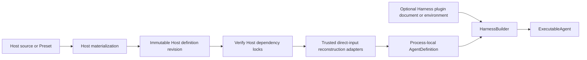
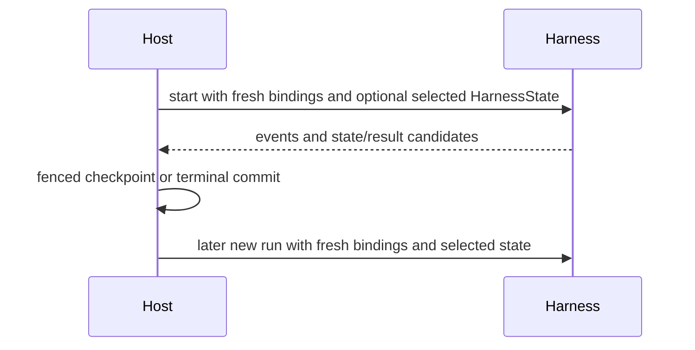

# Harness Hosting Contract

## Design Position

Embedded applications and hosted execution workers use the same code-first Harness API. The Harness does not expose a separate hosted Agent format. A hosted service owns durable Agent definition schemas, Presets, immutable revisions, dependency locks, and reconstruction adapters; the worker reconstructs one process-local `AgentDefinition` and calls `HarnessBuilder`. Plugin middleware may instead use the narrow Harness-owned configuration document and Build Context, so the Host need not expose or implement plugin factory concepts.

The Host also owns durable acceptance, worker `ExecutionAttempt` values, leases, checkpoint selection, deferred delivery, recovery, and terminal commit. The Harness returns only process-local observations and state candidates.

## Boundary

| Concern                                                    | Host                                          | Harness                                             |
| ---------------------------------------------------------- | --------------------------------------------- | --------------------------------------------------- |
| Authoring schema, Presets, revision, locks                 | Owns                                          | No durable schema                                   |
| Trusted direct Python object reconstruction                | Owns                                          | Validates process-local composition                 |
| Optional plugin configuration/loading                      | Persists or supplies deployment input         | Owns document, loading, and application             |
| Agent Identity and provider policy                         | Issues/evaluates                              | Carries through fresh bindings                      |
| Environment Providers and Resources                        | Chooses source and durable ownership policy   | Owns only explicitly ephemeral inputs               |
| Environment and model resolution                           | Supplies optional sources/bindings and policy | Normalizes, enters, and closes run scope            |
| Agent loop and outer middleware                            | Delegates                                     | Owns process-locally                                |
| Internal `ModelAttempt` values                             | Observes one logical run                      | Owns bounded recovery                               |
| Worker crash and durable replay                            | Owns                                          | Exports portable state only                         |
| Durable completion and delivery                            | Owns                                          | Returns a candidate                                 |
| Observation providers, signal policy, and export lifecycle | Owns                                          | Uses independently selected providers when supplied |

## Definition Mapping

The Host revision stores only Host-owned serializable values and exact dependencies. It can include logical model IDs, concrete Harness model characteristics, concrete native model settings, plugin/provider configuration, tool declarations, output schema, and artifact locks under Host-owned schemas. A Host authoring surface may accept Harness or deployment-specific aliases in either model plane, but it resolves them before revision materialization; the immutable revision and worker adapter never receive alias names. The revision does not store a Harness compiler document, alias catalog, Python class, plugin instance, Model, Toolset, Capability, callable, credential, or live client.

At execution time trusted installed adapters create:

- native `AgentSpec` containing only concrete `HarnessModelCharacteristics`, concrete native `ModelSettings`, and, for code-first output, a process-local `OutputSpec`;
- optional Model or logical model name;
- Agent-bound Capabilities that own all function tools, Toolsets, guidance, settings, and hooks;
- optional stable Host operator implementations passed to the exact Capabilities that own async subagent or background-process presentation;
- optional direct concrete Harness plugin instances;
- self-healing and semantic recovery policy.

An operator is a trusted process-local interface object, not persisted Agent content or a Toolset contribution. The Capability fixes the model-visible mode and Toolset when the definition is reconstructed. The operator receives explicit current-run correlation on each call and owns canonical work without storing mutable current-run authority in the reusable Capability.

Configured plugin instances are created by `HarnessBuilder` from an explicit `HarnessBuildContext` or the ambient source. The deployment switch remains false by default, while a trusted create-and-run or create-and-stream Host path can pass `configured_plugins_enabled=True` when constructing that operation's executable. They need not be reconstructed by a Host adapter, and the choice cannot change after Agent construction.

A declarative object JSON Schema remains in native `AgentSpec.output_schema` and is the build-time output source when no process-local `OutputSpec` is supplied. The worker never changes output type per run.

The resulting value is an ordinary `AgentDefinition`. An operator may pass an explicit Harness Build Context from the Harness plugin document or opt deployment environment loading in. The builder imports only enabled `a13n_harness.plugins` keys, creates fresh instances for each root and nested definition, and merges them after direct plugins. Entry-point availability never grants trust, and configuration identifies a key rather than an import target. The Harness does not verify Host artifact digests or inspect Preset provenance.

## Run Mapping

For each logical run the Host can construct `RunBindings` with:

- the trusted `AgentInstanceContext`;
- an optional advanced `EnvironmentRuntime` when it needs an explicit initial mount set, live mount mutation, or run extensions;
- an optional fresh `RunModelResolver`;
- optional model-context middleware;
- fresh run Capabilities;
- bounded non-authoritative metadata.

An embedded caller can omit `RunBindings`; the Harness creates fresh embedded bindings. Environment selection is independent from the remaining bindings: the caller passes one Provider or entered Resource through `environment=`, a mixed alias mapping through `environments=`, or an advanced aggregate through `RunBindings.environment`. High-level and advanced inputs cannot be combined.

The Host supplies `AgentInstanceRef` as workload identity and policy correlation. Thread identity is independent: the Harness generates `HarnessState.thread_id` for new history and restores it into fresh `AgentContext` from the State selected for continuation. A new Harness run or worker `ExecutionAttempt` changes transient run correlation but does not change the State-owned ID, and no fresh binding can override it.

The Harness enters and activates the normalized Environment runtime for the complete logical run. An advanced Host retains that same `EnvironmentRuntime`; a reconciliation task can start before stream entry and await `runtime.wait_until_active()` without polling, then mount, replace, unmount, or select a default during input preparation, model attempts, tool work, or recovery backoff. The runtime is never put in metadata, `AgentContext`, a Capability namespace, a model tool, or a durable record, and its mutation methods reject every call after the run terminal fence.

Provider specification validation, built-in and third-party factory selection, create/resume/pause/destroy behavior, resource state, and fresh attachment acquisition use the separate [Environment Provider contract](../agent-environment-provider/README.md). Provider availability and schema validity never authorize a run. Passing a Provider to the high-level API explicitly selects one ephemeral Resource lifetime. Passing an entered Resource selects attachment only: the Host retains its outer scope and can reuse it across runs while the Harness holds one fresh attachment for each run and never selects pause or destroy. Durable Hosts use the entered Resource or advanced runtime form when the Resource must survive suspension or continuation. Provider resource state and import targets never enter `RunBindings` or `HarnessState`.

A hosted model integration normally supplies an async callable satisfying `RunModelResolver`; it resolves its own trusted configuration, current policy, credentials, and route selection, then returns a native Model or raises. It reads `ModelResolutionContext.deps.thread_id` and derives or restores provider model-session and prompt-cache affinity from that State-owned value and the selected model/provider namespace. A Session or `AgentInstanceRef` routing key may remain broader, but it cannot replace the prompt-cache key for the root and all children because those Agents own different message histories. The Harness applies no special catalog role validation and, if a Host omits the resolver for a string model, uses Harness `infer_model()` with the builder's optional gateway Provider factory. A fail-closed hosted profile therefore requires its worker adapter to supply and test the resolver; this is a Host invariant, not a different Harness API.

The Host passes optional `HarnessState`, native input or an input factory, one `RunUsage` accumulator, and optional native `UsageLimits`. One logical run can contain several inner `ModelAttempt` values while retaining the same durable Host attempt, bindings, context, Environment, plugins, state coordinator, and usage accumulator.

## State and Resume Mapping

The Host stores and selects `HarnessState`, including its stable Thread ID. If the Host persists provider resources, it separately stores desired Environment mounts and `EnvironmentProviderResourceState`, along with definition revision, any additional opaque non-derivable provider continuation selector, accepted client-tool pending data, asynchronous child state, delivery ledgers, and durable reconciliation evidence.

`HarnessState` restores public Pydantic messages, JSON Capability namespaces, and optional provider-defined portable Environment data for already selected fresh mounts. It does not restore the current mount set, provider reachability, or launch authority. Plugin objects, Model resolvers, Environment runtimes and bindings, credentials, policy, usage, active attempts, and delivery facts are rebuilt.

The Harness defines no mandatory model route pin or provider-session schema. If one provider requires an additional durable continuation selector beyond public messages and `thread_id`, the Host and that model integration own it as provider-specific state and associate it with the selected Harness State. It is not a generic Harness recovery condition, and the Host never substitutes a fresh Harness or model-attempt ID for the State-owned ID.

## Recovery Mapping

The Host distinguishes:

- internal Harness `ModelAttempt` values inside one live logical run;
- a new durable worker `ExecutionAttempt` after process loss, lease loss, or selected recovery.

A new durable Host attempt always creates a new Harness run with fresh bindings and a new `EnvironmentRuntime`. It reconstructs desired mounts from Host state, resumes or creates provider Resources through the selected Provider before Harness entry, passes fresh attachments or provider candidates to the run, uses only an authoritative selected checkpoint, and does not blindly replay a possible external mutation. The interrupted-tool normalization text explicitly preserves unknown outcome and tells the next model to inspect current state.

Provider transport retry and Harness Model self-healing do not create durable Host attempt records. Usage observations from all inner `ModelAttempt` values remain in the one logical run accumulator and must not be double-counted with terminal snapshots.

## Deferred and Client-side Tools

Native Pydantic `DeferredToolRequests` end the Harness run as `status="suspended"`. The Host owns durable pending-call/approval records, authentication, external execution, idempotent feedback, and selection of a later continuation state. A continuation starts a new Harness run with that prior state, fresh `RunBindings`, the exact remounted tool surface, and `DeferredToolResume` containing the authoritative pending request plus its complete native results.

External calls and approvals remain distinct. A Host reconstructs exact tool surfaces from its own revision and pending attachment and verifies their identity before resume; those surfaces and the resume envelope are not encoded in `HarnessState`.

## Async Operators

The executable-owned `SubagentCollection` is process-local topology and grants no scheduling authority. A first-party `SubagentCapability(execution="async", operator=...)` fixes the standard async Toolset and owns one parent Agent's compact references and portable projection. The configured `SubagentOperator` owns fresh child authority and canonical execution. The default `SubagentManager` retains tasks, streams, latest child state, steering, cancellation, and results in memory; a custom operator may map work to an independently managed real Thread.

A successful async spawn is an ordinary tool result, not `DeferredToolRequests`. While the parent Run is active, Harness enqueue tells the model to wait or inspect. Independently, the operator always dispatches stable Host hooks; after Run closure a Host may use the hook to wake the parent Thread. Completion does not satisfy the original spawn call, mutate an already selected continuation, or itself create another Harness Run. A later Run rebinds the opaque backend ID through the same operator or marks it lost. The parent projection stores no child `HarnessState`.

`DynamicEnvironmentCapability` follows the same composition rule for shell work. Its configured `ShellOperator.supports_background` declaration fixes the shell Toolset. The default foreground operator uses the current Environment; `ProcessManager` owns detached in-memory background processes and stable hooks. No `RunBindings` field selects subagent mode, supplies either operator, or changes background shell availability.

A Host requiring durable child or process executions, attempts, retries, checkpoints, result delivery, or wake-up owns those resources behind the operator interface. The Harness does not generalize them into a Job, Session child, or distributed workflow model.

## Events and Completion

The Host consumes one `HarnessRunStream` and may persist, coalesce, or fan out events. Earlier `ModelAttempt` events remain observations even if a later `ModelAttempt` succeeds. The terminal result determines the logical run outcome.

A normal result becomes durable only through a fenced Host transaction. `RunCleanupError.outcome` is an uncertain candidate and cannot be reported as a clean Harness terminal delivery.

## Observation Integration

The Host independently constructs or auto-configures the OpenTelemetry SDK tracer and meter providers, `Resource`, sampler, span processors, metric readers, exporters, and vendor profiles. It either passes exact provider objects through `HarnessInstrumentation` or configures the global providers before the builder's default environment selection. Tracing is either off or complete and remains independently selectable from standard metrics. The Host owns W3C context extraction and injection, span links for independently scheduled work, trusted processor or collector sanitization, bounded shutdown flush, and process shutdown. The Harness configures no global provider and remains inert when both Harness signals are off or instrumentation is explicitly disabled.

A Host may make one generic OpenTelemetry, Langfuse, or Logfire span current before entering the Harness. The Harness accepts that parent through standard current context only and creates `harness.run` beneath it; no live span or vendor object enters `RunBindings` or another Harness argument. Combined backends retain exactly one Host root and attach multiple processors/exporters to the same provider. If Langfuse does not own that root, its export predicate must retain the root's instrumentation scope.

The builder's default environment selection reads `A13N_HARNESS_TRACE_LEVEL`, `A13N_HARNESS_TRACE_CONTENT`, and `A13N_HARNESS_METRICS` once and selects Host-configured global providers. Explicit provider configuration wins, and explicit `None` disables Observation. The official OpenTelemetry Python distro and exporters may configure those providers and collector targets before application startup; standard `OTEL_*` configuration continues to own SDK/export behavior. Telemetry grouping, including a Langfuse product session, never selects Harness State, provider model session, prompt-cache affinity, durable execution, or delivery. The Host supplies a conforming non-throwing provider stack; the Harness guards its own telemetry boundaries, while a provider that raises through Pydantic-owned instrumentation is trusted Host composition failure rather than an Agent outcome. A fail-closed audit requirement uses a separate Host-owned durable facility. The complete contract belongs to [Harness Observation](19-observation-model.md).

## Embedded Profile

An embedded caller can construct `AgentDefinition` directly or use the `AgentSpec` overload of `HarnessBuilder.build()`, use Harness model inference when no `RunModelResolver` is present, retain an advanced `EnvironmentRuntime` when dynamic mounts are needed, and keep state in memory or application-selected storage. It follows the same Environment lifecycle, plugin, model recovery, result, and cleanup semantics.

## Compatibility

Compatibility is evaluated separately for:

- the Host definition/revision schema;
- trusted reconstruction adapters and installed artifacts;
- the Harness public Python API;
- the selected Pydantic AI public surface;
- Harness and Capability state codecs;
- provider-specific launch/continuation data.

A Host rejects an incompatible revision or adapter before building process-local direct objects. The Harness rejects an incompatible plugin document before importing selected targets and does not turn an unknown Host schema into a generic Python import or fallback configuration.

## Invariants

01. Hosted and embedded callers use the same `AgentDefinition`, builder, bindings, stream, result, and state contracts.
02. Durable Agent schemas and dependency locks belong to the Host; the optional plugin document schema belongs to the Harness even when the Host persists it.
03. Python objects are reconstructed in-process and never stored in Host records.
04. Fresh authority enters every logical run through typed bindings and narrowly owned run Capabilities; Environment authority never enters through `DynamicEnvironmentCapability`.
05. Internal `ModelAttempt` values do not create additional durable Host attempt generations.
06. New durable recovery uses a fresh Harness run and fresh bindings.
07. Process-local completion is only a candidate for Host durable completion.
08. State restores data, not authority, desired mounts, runtime mutation authority, or live resources.
09. A Host mutates the current mount set only through the `EnvironmentRuntime` bound to that logical run.
10. Every independent root, child, or fork history has its own State-owned Thread ID; continuation restores it into `AgentContext`, and fresh model resolvers derive affinity from it rather than from workload or transient run IDs.
11. The Host owns Observation provider, propagation, export, sanitization, flush, and shutdown lifecycle and supplies a conforming provider whose telemetry callbacks do not raise into instrumented application code.

## Trade-offs

### Host-owned Agent Reconstruction vs. Narrow Plugin Configuration

Host-owned Agent schemas keep broad durable compatibility where it belongs and allow native Python composition in the worker. The Harness-owned plugin envelope removes repetitive middleware loading adapters without becoming an Agent compiler, Environment lifecycle format, or universal configuration language.
