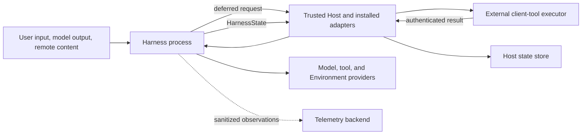

# Harness Security, Compatibility, and Trade-offs

## Design Position

The Harness executes model-controlled work inside a trusted Python process. Security comes from fresh trusted run context, explicit typed policy and provider adapters, metadata-aware managed-tool dispatch, provider-side enforcement, action-scoped credentials, bounded output, and Host-controlled durable state.

Concrete Harness plugins, Environment run extensions, native Models, tools, Toolsets, and Capabilities are trusted in-process code. Type checks and schemas protect composition mistakes; they do not sandbox Python. Untrusted or separately governed behavior stays behind a tool, model, Environment, or other feature-specific protocol.

## Trust Boundaries



| Boundary                              | Contract                                                                                    |
| ------------------------------------- | ------------------------------------------------------------------------------------------- |
| Host to Harness                       | Host reconstructs trusted code-first objects and supplies fresh typed bindings              |
| Model to native tool                  | Pydantic dispatch under trusted process composition                                         |
| Model to managed tool                 | Metadata-aware authorization, credentials, result safety, and provider enforcement          |
| Harness to Environment                | Identity-bound `BoundEnvironment`; provider repeats native checks                           |
| Restricted CodeAct to Host            | No ambient authority; only typed eligible callbacks through the current final `ToolManager` |
| Host to external client-tool executor | Durable pending fact, authenticated action/result, exact continuation correlation           |
| Harness to state store                | Harness exports detached state; Host owns persistence, encryption, retention, and selection |
| Harness to telemetry                  | Sanitized observation only; never lifecycle or billing authority                            |

## Identity and Authority

`AgentInstanceContext` is supplied by the trusted Host before model-controlled work. User input, model output, tool arguments, plugin-transformed input/results, metadata, restored state, and environment variables cannot replace it.

`BoundPluginContext` contains only the concrete plugin instances selected at build and freshly bound for the logical run. Plugin ID is lookup correlation, not authority. `HarnessState` cannot add a plugin, Capability, provider, Environment binding, topology entry, controller, or current-run collaborator.

For an allowed managed operation, effective authority is the intersection of:

```text
Host policy
∩ Agent Identity policy
∩ delegation scope
∩ Environment binding
∩ provider capability and policy
∩ approval decision
```

A native unmanaged tool does not acquire these guarantees merely because it can access `AgentContext`; selecting it is an explicit trusted-code decision.

## Code-first Build Trust

A Host owns its durable Agent definition schemas and artifact locks. The worker verifies those locks and uses trusted adapters to reconstruct native Python values. The Harness does not deserialize import paths or compile Agent specs. Its narrow plugin document contains only IDs, installed entry-point keys, enable state, and bounded JSON. An explicit or opted-in ambient Build Context loads only enabled keys and produces concrete plugins before Pydantic Agent composition. The separate Environment provider and run-extension catalogs remain Host-selected because run topology and aggregate lifecycle require current authority. The narrow custom Capability catalog contains only exact Host-trusted classes and performs no package discovery.

A mismatch between Host revision and installed adapter fails before the Host calls `HarnessBuilder`. Invalid plugin configuration or an incompatible installed package fails during context or builder construction before model work. Installed, enabled, loaded, and deployment-trusted are separate states: package presence alone imports no code and grants no behavior. Missing, duplicate, colliding, wrongly typed, lock-incompatible, factory-invalid, or ID-mismatched entries fail closed. Factory configuration and extensions are detached, bounded JSON but remain untrusted input to trusted in-process package code. Configuration, metadata, import, constructor, and factory failures suppress raw standard exception chaining so normal traceback logging cannot disclose those inputs or private installation paths. An API request, model value, durable row, state payload, plugin configuration, extension map, or provider parameter map cannot name an arbitrary import target.

Once supplied or loaded, concrete Python objects execute with process authority. Enabling an ambient plugin document or selecting an Environment extension factory therefore trusts the deployment-controlled installed key selection, not merely valid JSON shape. A hostile plugin or Environment run extension can bypass managed tool policy by performing direct Python I/O; deployments that do not trust it must isolate it outside the process.

## Plugin Result and State Trust

A trusted plugin can inspect or transform semantic input, events, errors, output, usage, and complete continuation state. The Harness revalidates result structure, run correlation, message suffix, output type, and state schema, but does not prove state provenance, require identity with an inner candidate, or force `PluginRunExchange.export_current_state()`.

This permits legitimate cache, migration, handoff, and state-transfer behavior. It also means semantic correctness of a plugin-supplied state is part of that plugin's trusted contract. Cryptographic fingerprints, origin allowlists, and malicious-plugin defenses are not added inside the same trust domain.

## Tool and Side-effect Safety

Managed tool execution distinguishes:

1. model-selected name and arguments;
2. canonical tool identity and resources;
3. policy/approval decision;
4. provider acceptance or execution;
5. observed result.

Only the receiver owns the external side effect. A timeout or interruption after dispatch remains unknown without an authoritative receipt. Retry of a mutation requires the same provider idempotency key or reconciliation evidence.

Interrupted-history normalization states that no result was recorded and that the operation may have partially or fully completed. It never claims non-execution or rollback.

Client-side external tools have a separate boundary: the Harness produces native deferred values; the Host commits and authenticates pending/result facts; the external client authorizes and performs the action. Model arguments remain untrusted even when schema-valid.

Optional CodeAct executes model-authored source in Monty's restricted Python runtime rather than the trusted Harness interpreter. The sandbox receives no filesystem mount, network/process/environment/credential/clock callback, or arbitrary Python object. A typed owner policy selects eligible tools, and every nested call returns through the active final Pydantic `ToolManager`, so ordinary validation, Capability hooks, managed policy, owning Toolset, output safety, and usage accounting remain authoritative. Eligibility alone is not approval, idempotency, or a replay guarantee.

CodeAct does not sandbox trusted tool implementations after dispatch. An eligible native tool still runs with its normal in-process authority, and an Environment tool still relies on the current Environment/provider policy. Resource limits bound the interpreter and bridge, while the deployment boundary remains responsible for a hostile or non-cooperative trusted callback. Timeout, cancellation, and failure do not roll back completed or possibly accepted effects; unresolved deferred work terminates the runner without retaining an interpreter frame. The complete contract belongs to [Restricted CodeAct Orchestration](18-codeact.md).

## Environment Enforcement

Routing selects a binding; it does not grant access. The Host alone retains the process-local topology controller, and model content cannot invoke it. Every added or refreshed entry is a fresh trusted provider binding prepared before atomic publication. Environment providers own logical resource authentication, path normalization, mount policy, symlink behavior, resource ceilings, handle visibility, process ownership, port policy, generation fencing, output retention, and native command isolation.

Client-side validation improves errors but never replaces provider enforcement. Environment authorization intersects exact values from the selected action catalog; an operation family, prefix, wildcard, managed tool ID, EIP available-method name, or unknown provider string never grants a core action. Operations and handles are revalidated against current binding revision, Identity, policy, and provider generation. Removal or refresh never retargets an old handle; in-flight leases drain against the captured provider and unsafe active handles fence publication.

Direct Local is an explicit embedding trust choice, not native command isolation or a race-hardened filesystem broker. Its file facet rejects observed traversal and symlink escape under a Host-controlled namespace, but a hostile same-account process can race native directory replacement, and an allowed child executable already has the embedding OS account's ambient filesystem or network reach beyond its working directory. Direct Local therefore rejects `network="deny"` and rejects read-only roots combined with any shell profile or allowed executable rather than claiming enforcement it does not provide. A Host that needs command confinement or adversarial concurrent filesystem isolation uses an Environment provider, such as `agent-envd`, whose resource boundary enforces it beside the governed resources.

## Remote Content and Network Authority

Trusted definition composition gives a selected web Capability an explicit async client/provider and a live network-policy collaborator; that deliberate collaborator selection is the Harness-process network grant. A URL in model content, package installation, or an Environment binding grants nothing by itself. The Capability holds no portable credential or static allow decision: the collaborator evaluates every initial target and redirect under current policy, response bodies are consumed under finite time and byte limits, and credentials remain audience-bound. Revocation is therefore observed by the live policy/client without a fresh run attachment. A download enters an Environment only through ordinary file operations and current authorization.

Search results, remote pages, media, converted documents, and skill resources are untrusted content with provenance. They cannot contribute Identity, policy, credentials, tool authority, or provider attachment. Live clients, response handles, temporary native paths, and raw credential-bearing URLs are excluded from model projections and portable state. Optional parser and provider packages remain inert until trusted code explicitly composes their owning Capability.

## Credential Boundary

Credentials and current credential resolvers are absent from `AgentDefinition`, instructions, model input, plugin metadata, events, results, and `HarnessState`. A fresh model binding, managed invocation policy, or provider adapter requests action- and audience-scoped credentials under current Identity and policy.

The default shell path projects no credential. A provider that must inject one owns final environment/file injection and prevents caller override.

## Output Resource Safety

Managed tools and first-party Environment operations enforce finite inline and per-capture output ceilings, explicit incompleteness, and provider-owned aggregate storage bounds. Direct Local bounds actual private-spool bytes. Envd reserves separate finite stdout/stderr allowances under a daemon-wide private disk-spool ceiling and retains valid references until explicit release or generation end. Harness model-facing limits can narrow what is read or projected but never widen provider capture ceilings.

This does not prevent trusted Python from allocating an oversized object before the wrapper receives it. OS/container limits remain the final process-memory boundary.

## State Integrity

`HarnessState` stores detached public Pydantic messages, detached JSON Capability entries, and optional detached provider-defined Environment data in an explicit aggregate field. The envelope validates its version and message codec. Each Capability validates only the namespace it reads through exact ID, version, and typed model; each selected Environment provider validates its own compatible binding entry after fresh binding authority exists.

Unknown Capability namespaces can remain opaque and survive a run. The Harness does not require every entry to belong to the active Capability set or to be accepted before unrelated model work. An Environment entry that is not selected by current Host topology cannot mount or authorize itself. A Host or trusted plugin can migrate or remove opaque data before resume.

State restores no Identity, credential, policy decision, desired topology, Environment binding, provider launch state, provider client, controller, route authority, readiness, execution lease, pending command, or external side-effect fact. Hosts may encrypt, sign, content-address, bound, retain, or delete stored state without becoming the semantic owner of Capability or provider payload data.

## Model and Recovery Safety

A concrete Model bypasses logical-ID resolution. A string model reaches the thin `ResolveModelId`; a fresh `ModelRunBinding` returns a native Model or raises. When no binding exists, the Harness deliberately returns `None` and Pydantic native inference continues. A hosted profile that requires fail-closed aliases must enforce presence of its binding during worker setup.

Provider model-session and prompt-cache affinity are correlation and performance inputs, not authority. The Harness isolates every independently advancing root, child, or fork history with `HarnessState.thread_id`, restores it as a read-only `AgentContext` value, and accepts no run-binding or metadata override. The model integration derives affinity from that value rather than transient run IDs, `AgentInstanceRef`, or a broader product-conversation key shared across parent and child histories. Rendered provider affinity remains absent from `HarnessState`; an additional non-derivable opaque selector is protected and retained by the Host like other provider-specific continuation data. The State-owned ID itself is not a credential, checkpoint authority, or cryptographic integrity mechanism; trusted plugins and Host State transformations remain inside the existing trust boundary.

Recovery layers remain bounded and separate:

- provider transport retry under provider/client policy;
- at most one exact `SelfHealingModel` replay after an effective repair;
- a finite total Harness semantic-attempt budget, disabled by default;
- Host durable recovery only from authoritative checkpoints.

Cancellation, usage limits, output retry exhaustion, tool failure, native deferred/HITL boundaries, and non-model Harness failures stop semantic recovery. Backoff is cancellation-aware.

## Data and Telemetry

The design distinguishes public configuration, correlation metadata, user/business content, sensitive model/tool content, credential metadata, and secret material. Secrets are absent from general Harness schemas. Content enters events, state, logs, or telemetry only under its owning policy.

Telemetry export is an observation. Exporter availability does not determine run success unless a Host explicitly adds a separate fail-closed audit requirement.

## Compatibility Model

| Axis                                     | Owner                         |
| ---------------------------------------- | ----------------------------- |
| Harness public Python API                | Harness                       |
| Native Agent/Model/Capability behavior   | Pydantic AI                   |
| Host definition/revision schema          | Host                          |
| Reconstruction adapter and artifact lock | Host integration/operator     |
| Harness state envelope                   | Harness                       |
| Capability state entry                   | Owning Capability             |
| Portable Environment binding-state codec | Owning Environment provider   |
| Provider launch/reattachment state       | Host and provider integration |
| Durable lifecycle/events                 | Host                          |

Matching logical IDs or definition digests do not prove artifact or state compatibility. A Host selects a mutually compatible revision and adapter set before construction and performs any explicit state migration before run creation.

## Failure Semantics

| Failure                                                          | Outcome                                                          |
| ---------------------------------------------------------------- | ---------------------------------------------------------------- |
| Missing/invalid trusted binding                                  | Stop before dependent dispatch                                   |
| Policy denial                                                    | Typed denial; no broader fallback                                |
| Invalid client feedback                                          | Reject without changing pending state                            |
| Invalid plugin ID/order/replacement                              | Build or run setup fails                                         |
| Invalid plugin document, Harness factory, or Environment catalog | Context/build/setup fails before affected provider or model work |
| Invalid plugin event/result                                      | Reject; retain nearest earlier valid candidate when available    |
| State version/payload mismatch on typed read                     | Fail the owning operation without mutating stored state          |
| Provider timeout after possible dispatch                         | Unknown until idempotent reconciliation                          |
| Cleanup failure after a candidate                                | `RunCleanupError` carries the candidate; no terminal event       |
| External task cancellation                                       | Propagate after cleanup; cannot be suppressed                    |

## Trade-offs

### Trusted In-process Composition

Native Python composition is expressive and efficient. It cannot isolate malicious code, so trust and artifact selection are Host responsibilities and strict isolation uses protocol boundaries.

### Opaque State Namespaces

Independent namespaces support optional Capabilities and trusted handoff. The Harness cannot globally attest that every stored entry matches the current Agent composition.

### Live Deny with Immutable Revision

An immutable definition preserves authored behavior, while fresh policy and credentials can deny or narrow current authority. This sacrifices replay of historical authorization decisions in favor of revocation and incident response.

### Provider-side Enforcement

Repeating checks at the provider costs implementation effort but prevents a compromised or buggy in-process adapter from becoming the only security boundary.
