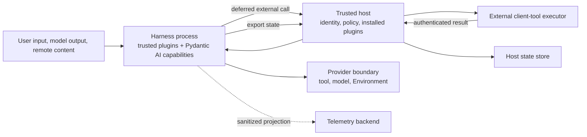

# Harness Security, Compatibility, and Trade-offs

## Design Position

The harness runs model-controlled work inside a trusted Python process. Security for Harness-managed Agent surfaces comes from trusted execution context, metadata-aware Pydantic AI tool wrapping, provider-side Environment enforcement, action-scoped credential resolution, and verified resumable state.

In-process plugins and unannotated native Pydantic tools share the harness trust domain. They remain usable without Harness metadata, but the Harness makes no authorization, credential, idempotency, or result-safety claim for their direct behavior. Code that is not trusted at that level stays behind a managed tool, model, or Environment provider protocol.

## Trust Boundaries



| Boundary                                  | Design                                                                                                                                                                                                                                          |
| ----------------------------------------- | ----------------------------------------------------------------------------------------------------------------------------------------------------------------------------------------------------------------------------------------------- |
| Host to Harness                           | The Host supplies one `ResolvedAgentDefinition` with the selected plugin catalog for build, then fresh `RunBindings` carrying Agent Identity, Environment, policy, credentials, any provider-backed task-state cell, and opaque run references. |
| Model to tool                             | Every tool uses Pydantic dispatch; metadata-aware tools additionally cross the Harness-managed authorization and result path.                                                                                                                   |
| Harness to Environment                    | `BoundEnvironment` carries the selected binding and execution identity; the provider rechecks native resource policy.                                                                                                                           |
| Tool authorization to credential provider | The authorization capability uses a narrow collaborator to request an audience-scoped lease for one action.                                                                                                                                     |
| Host to external client-tool executor     | The Host exposes only a durably committed pending external call; the client separately authorizes its action and returns an exact-parent result.                                                                                                |
| Harness to state store                    | The harness exports `HarnessState`; the host decides durability, encryption, retention, and checkpoint ownership.                                                                                                                               |
| Harness to telemetry                      | Events and spans are sanitized projections, not execution or billing facts.                                                                                                                                                                     |

## Identity and Authority

`AgentIdentityRef` identifies the workload principal. `AgentInstanceContext` adds the current root or child instance, delegation lineage, actor, and opaque host references.

The host constructs this context before the run. User input, model output, tool arguments, plugin specs, plugin-transformed input or results, plugin-returned metadata, restored state, and shell environment variables cannot replace it. `BoundPluginContext` contains only Harness-validated run-bound instances from the selected definition and catalog; an ID or restored value cannot add a plugin or grant authority.

The fixed invocation dispatcher is always present, but authority is not implicit. Run assembly accepts exactly one reserved-role invocation-policy Capability; if the host supplies none, `DenyManagedToolsCapability` rejects every metadata-aware function-tool invocation. The Harness constructs its Environment Capability from the entered `EnvironmentRunBinding`, so a host cannot accidentally install a second Environment authority path.

Client-side external tools do not cross that function dispatcher because no function body executes in the Harness process. Their separate safety boundary is definition opt-in, exact per-run schema acceptance, durable pending-call commit, authenticated Host delivery and feedback, and the external executor's own action authorization. The external executor treats model arguments as untrusted even when they satisfy the advertised JSON Schema. Neither an external tool definition nor a `tool_call_id` grants Environment, server-tool, or business authority.

For an allowed Harness-managed operation, effective authority is the intersection of:

```text
host policy
∩ Agent Identity policy
∩ delegation scope
∩ Environment binding
∩ provider capability and local policy
∩ approval decision
```

The identity is stable; authority remains contextual. This avoids encoding policy into IDs and allows current deny or revocation policy to narrow a previously created execution. An unmanaged native tool does not enter this claimed intersection merely because it can read `AgentContext`; selecting that trusted tool is itself a host trust decision.

## Tool and Side-effect Safety

For a metadata-aware managed tool, the tool pipeline separates five facts:

1. the model selected a tool name and arguments;
2. the harness resolved a canonical tool implementation;
3. policy and approval allowed a specific action;
4. the receiver accepted or executed the operation;
5. the harness observed a result.

Only the receiver owns the side effect. A timeout after dispatch can therefore produce an `unknown` outcome rather than a fabricated failure or success.

Automatic retry is limited to operations with an idempotency key or a receiver-declared read-only/retry-safe contract. Approval and deferred results remain bound to the exact tool call, arguments digest, Agent instance, and resumed state. For client-side tools, transport loss after a local side effect but before result acknowledgement is unknown; the client caches the completed result and retries idempotent submission instead of rerunning the handler.

## Environment Enforcement

The harness first routes an operation to an Environment binding, then evaluates authorization for that selected binding. Routing does not grant access.

The provider owns path normalization, mount policy, symlink behavior, resource limits, handle visibility, port policy, and generation fencing. An EIP-backed envd also owns its [inner command-isolation posture](../agent-envd/07-execution-isolation.md): `required` applies fail-closed bubblewrap or Seatbelt, while explicit `disabled` delegates OS command containment to an outer sandbox without disabling daemon authentication, resource policy, process ownership, output bounds, or cleanup. Client-side checks improve error quality but do not replace provider enforcement.

Process handles include Environment identity, generation, binding, and Agent ownership in provider-private state. Later input, signal, wait, kill, and release operations repeat authorization. A handle never migrates silently to another Environment after reconnect or fallback.

## Plugin Trust

The plugin model treats selected Python plugin distributions and directly supplied native Toolsets as operator-trusted code. The Host verifies installation and artifact identity and passes the selected catalog and exact materialized specs; a catalog registration factory may capture only a typed authority-neutral provider collaborator. The Harness invokes the factory, validates its output, and constructs, orders, and freshly binds plugins. Current-run authority still derives from the shared `AgentContext`, fresh `RunBindings`, and provider enforcement rather than factory possession. Package metadata, Harness tool metadata, typed plugin specs, ordering checks, result validation, and Pydantic schemas describe or constrain boundary values but do not make arbitrary Python safe.

A plugin can inspect or transform semantic input, stream events, errors, and the complete process-local result candidate. That access does not authorize external side effects, make a result durable, override Host Identity or provider policy, or retract already emitted events. Run-bound instances and `BoundPluginContext` are never restored from `HarnessState`, inherited by a child, or reused across sibling runs.

This design avoids an in-process sandbox abstraction that Python cannot reliably provide. A host can require Harness metadata for every model-visible function tool as an explicit strict profile, but metadata does not constrain direct Python behavior. Output tools remain output validation, while provider-native tools require provider policy or a managed function-tool adapter. Remote or user-authored extensions use an out-of-process managed provider surface and receive only the scoped context required by that protocol.

## Output Resource Safety

Managed tool results and first-party Environment operations always have finite per-call inline and total output ceilings plus finite aggregate retained bytes and object counts. Direct-local providers and the EIP [`OutputPolicy`](../agent-envd/06-output-retention.md) path reserve quota while reading producer streams, use bounded previews and retention, and report truncation, quota exhaustion, expiry, or dropped bytes explicitly. Effective limits can only narrow from Harness hard ceilings through Host, tool, binding, and provider limits. This prevents normal shell, search, and file operations from forcing the worker to hold unbounded memory, protocol frames, retained files, or cursors.

The guarantee cannot retroactively prevent trusted in-process Python code from allocating an oversized return object before the wrapper receives it. Such code is part of the plugin process trust boundary. A strict deployment requires metadata-aware tools and streaming provider APIs but still uses OS or container resource limits as the final process-memory boundary.

## Credential Boundary

The materialized definition can contain typed non-secret credential references, but neither it nor the process-local build plan contains credential material or a collaborator that selects credentials for a current run. Durable model settings also exclude raw header maps and provider-specific secret-bearing fields. Client-tool declarations, instructions, metadata, arguments, and results are model-visible or externally supplied content and cannot carry a Foundation credential, client bearer token, invocation grant, or authorization claim. Fresh run Capabilities resolve references and short-lived leases from the current Agent Identity, policy, audience, action, and resource; hosted model resolution that needs credentials follows the same run-bound rule. `HarnessState` contains neither credential bindings nor secret material.

For shell operations, the default is no credential projection. When compatibility requires environment variables or files, the Environment provider owns final injection and prevents caller override. A local credential broker is preferable for long-running processes because it supports rotation without putting a durable token in process state.

## State Integrity

`HarnessState` contains versioned entries for the Capabilities that persist continuation data. Preparation verifies that every entry ID belongs to the active resolved Capability set and validates Environment state before the input factory; each other owner accepts its typed version on first iteration before model or tool work. Delegation State stores bounded complete child `HarnessState` values, including child message history, but no active job or authority. The parent Working State entry is the sole snapshot owner for a task cell explicitly shared with inline children, whose claims derive the actor from trusted child Identity and linearize under the Capability's process-local mutation boundary. Definition selection and migration policy remain Host concerns.

Recoverable Environment data is stored in the Environment Capability's versioned `AgentContextState` entry only after any required provider attachment and fresh binding construction. It can contain backend-local snapshots or opaque references to objects reachable through that selected Environment, but not provider-adapter lifecycle records, credentials, live clients, authorization decisions, or raw bearer handles. Files and processes remain provider-owned, and every restored reference is checked against the current binding, Identity, policy, and Environment generation.

The host may sign, encrypt, or content-address the state envelope and applies generic size, retention, and deletion controls. Those storage-custody controls do not transfer schema, validation, migration, or lifecycle ownership from the provider codec and do not change Harness restore semantics.

## Data and Telemetry

The design distinguishes:

- public configuration metadata;
- internal identifiers and correlation references;
- user and business content;
- sensitive model or tool content;
- credential binding metadata;
- secret material.

Secret material is absent from general harness schemas. Sensitive content enters logs, events, `HarnessState`, or telemetry only through the owning content policy. Telemetry exporters receive sanitized attributes and optional content; exporter availability does not determine run success.

## Compatibility Model

### Pydantic AI

The harness depends on documented Pydantic AI public APIs. Compatibility is evaluated by observable Agent, capability, toolset, event, output, and resume behavior rather than by a broad version range alone. Private graph methods and node types stay outside the design.

### Agent definitions and plugins

The Host pins an immutable materialized definition revision and its selected Preset and plugin dependency locks, while the Harness consumes one process-local build plan containing the selected plugin catalog plus the resolved model, tools, Toolsets, and Capabilities. Plugin compatibility has independent spec-codec, registration-factory, artifact, ordering, run-binding, contributed-Capability, and result/state-envelope axes. Semantic equivalence between Host definition revisions remains a Host concern; a matching logical definition digest does not make different executable artifact locks equivalent.

Behaviorally incompatible plugin or Capability changes require a Host-selected definition revision, compatible artifact closure, or explicit owning state migration. Logical plugin, Preset, or Capability names do not imply artifact, middleware, binding, or state compatibility.

### Harness state

The envelope has a top-level version and stateful Capabilities own their entry versions. An unknown, unconfigured, or incompatible entry stops restore and leaves the original state unchanged. When a host selects a different definition, any required state migration is explicit and owned by the affected Capability or host adapter.

### Events

Event type meaning is stable. Additive payload fields are safe for consumers that ignore unknown fields. Host lifecycle events and Harness events remain different namespaces even if a projection maps between them.

## Failure Semantics

| Failure                                                     | Design outcome                                                                                                        |
| ----------------------------------------------------------- | --------------------------------------------------------------------------------------------------------------------- |
| Missing trusted identity or binding                         | Run or invocation stops before dispatch.                                                                              |
| Policy denial                                               | Typed denied outcome; no broader fallback.                                                                            |
| Invalid or unauthorized client feedback                     | Reject without changing the pending batch or starting a continuation.                                                 |
| Plugin catalog, spec, ID, requirement, or ordering conflict | Agent construction fails before an executable becomes visible.                                                        |
| Plugin run binding or replacement mismatch                  | Run setup fails before middleware or model work.                                                                      |
| Invalid plugin-transformed input, event, or result          | Harness structural validation rejects it; no invalid terminal event is delivered.                                     |
| `HarnessState` incompatibility                              | Restore fails without mutating the stored state.                                                                      |
| Provider timeout before dispatch                            | Retry follows provider policy.                                                                                        |
| Provider timeout after possible dispatch                    | Outcome remains unknown unless idempotent reconciliation is available.                                                |
| Cleanup failure                                             | `RunCleanupError` retains any frozen primary outcome and cleanup uncertainty; no normal terminal result is delivered. |
| Telemetry failure                                           | Execution continues unless the host has selected a fail-closed audit adapter.                                         |

## Trade-offs

### Trusted plugins and native tools

Trusted first-class Harness plugins and native Pydantic Toolsets keep the programming model direct and fast. Plugin packages can contribute ordinary Capabilities and tools that opt into Harness-managed invocation metadata, but neither the plugin base contract, metadata, nor wrappers isolate malicious Python code. Out-of-process providers are the isolation boundary rather than a second plugin runtime.

### Frozen definition, live deny

An immutable materialized definition revision plus dependency locks makes configured behavior inspectable and reproducible, while live providers and authority are rebound. Allowing current deny or revocation to narrow access sacrifices perfect replay of authorization decisions but supports incident response and credential revocation.

### Provider-side enforcement

Repeating checks in the provider adds protocol and implementation work. It prevents a compromised or buggy harness adapter from turning client-side validation into the only security boundary.

### External client execution

Using native deferred external tools keeps browser and application handlers out of the Harness trust domain. It adds a durable waiting and authenticated feedback boundary in hosted mode; disconnect and cancellation cannot prove whether a client-side effect occurred.

### Cohesive state envelope

Persisting message history with explicitly stateful Capability entries keeps resume understandable and prevents a Host from assembling parallel Harness, inline-child, and Environment blobs. The envelope is larger when nested child, Environment, or other optional feature state is present. It preserves the last complete inline-child continuation but cannot reproduce an active child, a partial parent tool batch, arbitrary live Python objects, Host asynchronous lifecycle, or OS processes; every owner restores only versioned data under fresh authority checks.
