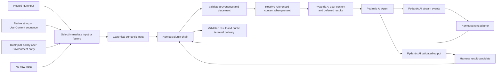
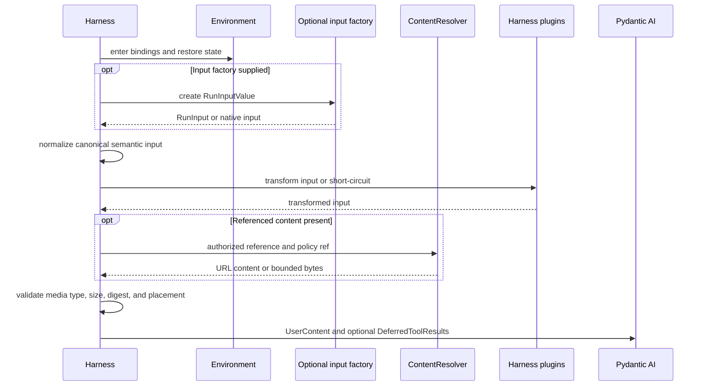
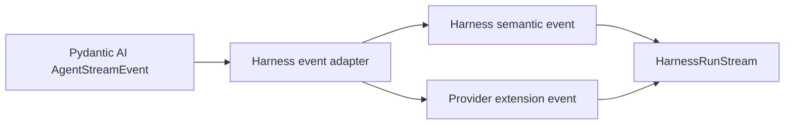

# Input, Model, and Output Boundaries

## Design Position

The harness adapts code-first native Pydantic AI input or a Host `RunInput` envelope into one canonical semantic input, lets ordered Harness plugins transform that value before content resolution, lets Pydantic AI own model selection, profile-aware request preparation, and execution, and lets the same plugin chain transform stream events and the complete result candidate before public terminal delivery. A semantic `RunInputFactory` can create input after the current Environment is entered and can explicitly await only the scoped Environment operations it needs. The Harness adds no parallel model request state machine, model-profile system, prompt language, or output type system.



Caller authentication, trusted actor identity, durable input acceptance, host commands, and media storage remain host concerns. The trusted actor comes from `AgentInstanceContext`, never from model input.

## Input Envelope

```python
class RunInput(BaseModel):
    input_id: str
    parts: tuple[InputPart, ...]
    metadata: Mapping[str, JsonValue] = {}
    content_policy_ref: str | None = None
```

`RunInput` is a transport-neutral batch of content for one process-local harness run. `input_id` supports host correlation without granting idempotency or authority. Metadata is non-authoritative and does not replace Agent Identity, Environment binding, resolved definition, policy, or tracing context.

Code-first callers may pass the native Pydantic AI shape, a `str` or `Sequence[UserContent]`, directly. The sequence form supports ordered multimodal input such as text followed by an `ImageUrl`; a single non-string media item is passed as a one-item sequence, matching upstream typing. The Harness assigns process-local input correlation and ordinary local provenance while preserving the same resolution, context-injection, Agent, result, and cleanup pipeline. A hosted caller uses `RunInput` when durable correlation, references, classification, or deferred tool results matter. Client-tool declarations are not input parts; their default or explicitly permitted whole-run replacement enters through the typed Client Tools Capability and `RunBindings.client_tools` before model exposure.

### Semantic Input Factory

```python
type NativeRunInput = str | Sequence[UserContent]
type RunInputValue = RunInput | NativeRunInput


@dataclass(frozen=True)
class RunPreparationContext:
    run_id: str
    instance: AgentInstanceContext
    environment: BoundEnvironment
    metadata: Mapping[str, JsonValue]


class RunInputFactory(Protocol):
    async def __call__(
        self,
        preparation: RunPreparationContext,
    ) -> RunInputValue: ...
```

`run()` and `stream()` accept an immediate input value or `input_factory`; supplying both fails before resource entry. Omitting both is valid and passes no new user content to Pydantic AI, which is useful when imported message history already contains the request to continue. During stream context entry, the Harness invokes a supplied factory exactly once after the current run binding is entered and compatible imported Environment state is restored, but before input reference resolution and before the lazy Pydantic event handle is created. Binding entry establishes trustworthy identities, descriptors, routing, and readiness paths; it does not globally await every advertised operation resource. The restricted preparation context exposes trusted Identity, correlation metadata, and the entered Environment, so a factory that needs an operation calls `ensure_ready(EnvironmentReadinessRequirement(...))` for that scope. It exposes no `AgentContextState`, Harness events, run-bound Capabilities, or active-run control. Non-Environment Capability entries are accepted by their owners only when the Pydantic run starts, so a factory cannot inspect or act on an entry that has not passed its owning Capability's version check. `run()` consumes this same prepared stream path internally.

The factory is an input-production seam, not a general callback lifecycle. After it returns, the Harness normalizes the selected value and invokes the ordered Harness plugin chain; the factory itself neither selects nor invokes plugins. A Capability whose initial instructions or tool surface depends on Environment content awaits its scoped readiness in `for_run()`, materializes the model-visible value once, and returns an immutable run-bound replacement before the first request. Ordered validation or observation that acquires no resource uses `before_run()`; resource acquisition and its teardown use `wrap_run()` or a Toolset context manager, and per-node work remains a Pydantic Capability hook. The Harness adds no generic prepare lifecycle or sibling-Capability readiness event. A factory failure becomes an `InputError` with the original exception retained as a protected cause, and every resource already entered for preparation still closes.

### Canonical Semantic Input

Before reference resolution or Pydantic mapping, the Harness normalizes an immediate value or the optional factory result into one immutable `SemanticRunInput`. This is a process-local plugin-authoring value, not another durable input envelope. It preserves the source `input_id`, metadata, content policy, provenance, classification, ordered Harness `InputPart` values, and any already-native Pydantic `UserContent` values through typed native-content parts. Omitting new input remains distinct from an empty `RunInput`.

The ordered Harness plugin chain receives this value after Environment entry and compatible Environment-state restore. A plugin can inspect or replace parts and use typed helpers to append a bounded `ContextInputPart`; it cannot erase provenance requirements or convert metadata into authority. The final transformed value is revalidated, then content references are authorized and resolved and ordinary parts are mapped to Pydantic values. A plugin can instead short-circuit with a typed `HarnessRunResult` candidate, in which case no content resolver, Pydantic run, model request, or tool call occurs.

`SemanticRunInput` exists so immediate input, factory-produced input, and plugin transforms share one ordering and validation boundary. It is not serialized in `HarnessState`, and live enqueue continues to use its explicitly narrower mapping rather than replaying the initial plugin chain.

### Part Mapping

| Input part            | Meaning                                                                    | Pydantic AI mapping                                                            |
| --------------------- | -------------------------------------------------------------------------- | ------------------------------------------------------------------------------ |
| `TextInputPart`       | UTF-8 user text with provenance                                            | `str` or `TextContent` in `UserContent`                                        |
| `ContentRefInputPart` | Authorized reference to image, audio, video, document, or another artifact | `ImageUrl`, `AudioUrl`, `VideoUrl`, `DocumentUrl`, or resolved `BinaryContent` |
| `BinaryInputPart`     | Bounded inline bytes with media type and digest                            | `BinaryContent`                                                                |
| `ToolResultInputPart` | Result for an exact Pydantic AI deferred external call or approval         | `DeferredToolResults`, outside ordinary `UserContent`                          |
| `ContextInputPart`    | Bounded host context placed at `user_prefix` or `user_suffix`              | `UserContent` at the corresponding edge of the current user request            |

Product controls such as cancel, interrupt, steer, approval, and hosted delivery are not input parts. Live steering and cancellation target `HarnessRunStream`, which wraps the active Pydantic AI run; other controls enter through their owning host or subsystem. Only content that becomes model input enters `RunInput`.

Each part carries its type, provenance, classification, and a bounded payload or reference. “Hidden from display”, “hidden from model”, and “excluded from telemetry” are separate content policy decisions. `ContextInputPart` cannot select system instructions, historical messages, or a Capability hook; trusted behavior and persistent context use the owning Capability instead of elevating input data into another authority class.

### Initial Input Combination

The Harness resolves all ordinary parts into one ordered Pydantic `UserContent` sequence. `user_prefix` context precedes text and media; `user_suffix` context follows them. Multiple `ToolResultInputPart` values are merged into one `DeferredToolResults` value only after duplicate, unknown, wrong-kind, already completed, and incomplete pending-call correlation is rejected. External results populate `.calls`; approval decisions populate `.approvals`; one category never coerces into the other. A hosted adapter starts from its authoritative persisted `DeferredToolRequests` and uses `build_results(...)` before producing this input rather than trusting client-held deferred metadata. The native Agent run receives ordinary user content and deferred tool results through their separate Pydantic parameters, so either or both may be present in one initial `RunInput`.

A supplied `RunInput` is invalid when it contains neither resolved user content nor a deferred result. This does not prohibit omitting new input entirely and continuing directly from imported Pydantic messages. A context-only `RunInput` is valid only when at least one bounded context part becomes user content. Metadata never becomes content implicitly, and combining parts does not change their provenance or policy classification.

### Live Enqueue Mapping

`HarnessRunStream.enqueue()` accepts `RunInput` for shared provenance and content-policy validation, but its live mapping is intentionally narrower than initial-run input:

| Input part            | Live enqueue behavior                                                                                             |
| --------------------- | ----------------------------------------------------------------------------------------------------------------- |
| `TextInputPart`       | Accepted and mapped to the same Pydantic `UserContent` representation as initial input                            |
| `ContentRefInputPart` | Accepted after authorization and resolution to a supported Pydantic URL content object or bounded `BinaryContent` |
| `BinaryInputPart`     | Accepted after size, media-type, and digest validation and mapped to `BinaryContent`                              |
| `ContextInputPart`    | Accepted for `user_prefix` or `user_suffix` and mapped to ordinary `UserContent` at that edge                     |
| `ToolResultInputPart` | Rejected; Pydantic `DeferredToolResults` start a new run and never enter the live pending-message queue           |

The wrapper resolves the entire batch before one native `RunContext.enqueue()` call. It never partially enqueues a batch. An unsupported part or combination raises `InputError(code="input_not_enqueueable")`; an empty input or a batch that resolves to no content raises `InputError(code="input_empty")`. `RunInput.metadata` remains correlation and policy data and is not silently converted into model content. These rules guarantee a non-empty Pydantic `EnqueueContent` sequence ending in a request, so the public method returns an enqueue ID rather than the upstream empty-call `None`.

## Content Resolution

Referenced content resolves before the model request that consumes it through one narrow run binding:

```python
class ContentResolver(Protocol):
    async def resolve(
        self,
        part: ContentRefInputPart,
        *,
        preparation: RunPreparationContext,
        content_policy_ref: str | None,
    ) -> ImageUrl | AudioUrl | VideoUrl | DocumentUrl | BinaryContent: ...
```

The host supplies `ContentResolver` on `RunBindings` only when referenced content is supported. The resolver combines source authorization, policy selection, and representation materialization behind one semantic port; the Harness does not impose a second policy callback chain. An absent resolver rejects `ContentRefInputPart` while direct text, inline binary, deferred results, and native string or `Sequence[UserContent]` input continue to work.



Initial input and live enqueue use the same resolver instance and validation rules while the Environment is entered. A resolver may use `RunPreparationContext.environment`; it receives no unaccepted Capability state or active-run authority during initial preparation. For live enqueue, the Harness derives the same restricted view from the already active `AgentContext`. The Harness closes temporary run resources if resolution fails. The resolver returns a Pydantic AI-supported URL content object or `BinaryContent`. A temporary provider URL remains a delivery representation rather than durable content authority. The host retains stable source provenance when later runs need the same artifact.

Document extraction, transcription, image transformation, and provider upload are explicit capabilities or resolver-internal provider operations. They are not implicit coercions performed by the base input parser.

Unsupported media, invalid digests, expired references, and disallowed content fail before the affected model request. Resolution errors retain the source part ID without exposing credentials or private URLs.

## Model Resolution

Embedded code-first execution retains ordinary Pydantic AI semantics: it can use model inference, explicit native Models, `get_model()` contributions, or custom ID resolvers under the embedding application's trust boundary.

Hosted execution is deliberately narrower. Every authored root or child `AgentSpec.model` is a logical ID covered by the selected definition revision's exact model-integration lock. Build resolution verifies that lock and compiles its authority-neutral construction and routing plan; it does not construct a credential-bearing Model. A credential-free concrete `ResolvedAgentComponents.model` is permitted only when it is an attested realization of that same lock and possession grants no tenant or current-run authority. Otherwise the concrete component remains `None`, `Agent.from_spec()` receives `defer_model_check=True`, and executable entry does not call native `Agent.__aenter__()` for that node. These guards keep the logical ID out of ambient inference until a fresh integration-owned `ResolveModelId` Capability constructs the native Model after `AgentContext`, current policy, route pin, and credentials are available.

```python
async def resolve_locked_model_id(
    ctx: ModelResolutionContext[AgentContext],
    model_id: str,
) -> Model: ...

model_resolution = ResolveModelId(resolve_locked_model_id)
```

The hosted integration resolver occupies one reserved model-selection role with fixed ordering. For every logical ID in its lock, it returns an allowed native `Model` or raises a typed model-resolution error; it never returns `None`. This is required because upstream `ResolveModelId` treats `None` as delegation and ultimately falls back to ambient `infer_model()`. Unknown route, policy denial, unavailable credential, invalid profile, and target failure therefore fail closed before provider dispatch.

A hosted definition, build Capability set, and `RunBindings.capabilities` cannot add another `resolve_model_id` or `get_model()` contributor, and the hosted run API exposes no explicit model argument or `Agent.override(model=...)` path. Model fallback, target health selection, and per-step switching, when supported, are owned by the locked integration and remain inside its permitted routing envelope; they are not independent Capability overrides. Hosted-compatible request hooks cannot replace `ModelRequestContext.model`. The integration validates the selected target and effective profile before returning the Model, and a violation of these rules is a trusted integration/plugin contract failure rather than permission to continue with Pydantic inference.

Authority-neutral shared transports or pools can live outside the executable and be referenced by the fresh integration Capability, but the immutable Agent, build plan, and build Capabilities cannot retain credential material, a credential resolver, tenant selection, or current-run policy. The materialized definition always retains the logical selection used for provenance.

### Model Settings, Profile, and Capability

The model path deliberately preserves three layers:

1. `ModelSettings` expresses request intent and tuning. Pydantic owns its native Model-default, Agent, Capability, and run-setting merge order. Hosted integrations keep the Model-default layer empty, and the hosted Harness API exposes no arbitrary per-run model-settings bag, so durable static defaults remain visible in the definition.
2. The resolved native `Model.profile` expresses stable model/provider/adapter compatibility facts and drives request and response rendering.
3. A Capability expresses Agent-, Host-, or run-specific policy, dynamic transformation, recovery, or a narrowly scoped compatibility repair that the native profile and adapter do not yet support.

A Capability can contribute ordinary `ModelSettings` as behavior configuration without taking ownership of compatibility facts; Pydantic AI's `Thinking` Capability is one such convenience. For example, the unified `ModelSettings.thinking` value asks for reasoning. `ModelProfile.supports_thinking`, `thinking_always_enabled`, and `thinking_tags`, together with provider-specific profile fields and adapter code, determine whether and how that request is represented and how prior thinking parts are sent back. This includes Pydantic AI's native OpenAI-compatible field-or-tag round trip and adapter-native replay of same-provider signed or encrypted reasoning; “keep thinking” is not duplicated as a Harness Capability.

Pydantic resolves an effective profile from `DEFAULT_PROFILE`, `Provider.model_profile(model_name)`, and an optional explicit `Model(profile=...)` contribution, with later dict layers overriding earlier ones. The callable form receives the already merged default and returns the final profile. A concrete adapter can further narrow client- or implementation-specific facts, and the effective native-tool set is intersected with what that model class implements. The Harness reads this behavior through the native Model and does not perform another merge.

`AgentSpec` has no serialized profile field, and Pydantic `ModelProfileSpec` is intentionally not copied into `AgentDefinition`: its callable form and some values are process-local Python objects, while provider-specific subclasses evolve with upstream. A typed Model Preset therefore materializes the logical model ID and complete default non-secret `model_settings`; the exact Host model-integration registration constructs the native Model with its provider, adapter, and any profile contribution. Embedded code-first callers can pass that Model directly. A custom OpenAI-compatible or other deployment profile is typed and revisioned by its owning model integration, not stored as an arbitrary Agent-level mapping; changing it changes the integration revision and dependency lock. The lock fixes construction and allowed-routing semantics rather than a live endpoint: a run-specific resolver may choose any permitted target, but every returned native Model carries the effective profile for that actual target.

A compatibility fact already modeled by Pydantic AI belongs in `ModelProfile` and its adapter, not in a Capability. If the latest Pydantic AI lacks a required fact or public adapter seam, the project contributes that seam upstream first. A temporary Capability patch is permitted only through public model-request hooks, is scoped to the exact affected model integration, has typed configuration and tests, and is removed after the upstream profile/adapter path is available. It cannot mutate a cached profile, monkey-patch private adapter methods, or become a global provider-wrapper stack.

### Provider-suspended Route Pin

Ordinary new runs may route one logical model within its locked integration envelope. A run that resumes history ending in `ModelResponse(state="suspended")` may not. The provider-side job belongs to the exact target that created it, including integration revision, provider, account or deployment, region or endpoint class, and any provider fencing identity.

When such a response becomes a checkpoint candidate, the integration exposes a bounded non-secret opaque route key and provider-ownership metadata to the Host's run-bound route recorder. The Host commits that `ModelRoutePin` atomically with its checkpoint launch state, outside `HarnessState`. On resume, it supplies the validated pin to the same locked integration, which reconstructs the original target and refreshes credentials without running ordinary health routing or fallback. A missing, incompatible, or unrecoverable target produces an explicit continuation failure; it never silently switches Model or provider. Prompts, message metadata, `ModelProfile`, and Agent Capability state carry no route authority.

Hosted durable model settings are recursively JSON-safe and validated, normalized, and canonicalized by the locked integration's strict schema before revision commit. The schema rejects unknown keys, arbitrary `extra_headers` or `extra_body` passthrough, non-JSON client objects, incompatible target-specific settings, and credential carriers. Every hosted native Model has `Model.settings=None`; live headers and credentials enter only through current run resolution. Model Presets also do not carry live clients, context-management feature policy, or arbitrary tool configuration. Pydantic AI still owns runtime setting merge, profile resolution, retries, integration-permitted fallback behavior, request streaming, and output-validation retry. Complete Pydantic `ModelResponse` messages retain resolved provider/model attribution and `RequestUsage`; Harness events add logical alias, route, retry, or fallback observations only where the Harness owns that context.

## Stream Boundary

Pydantic AI stream events are the source events. The harness event adapter adds `run_id` and stable event ordering, applies content policy, and emits the normalized envelopes defined by [`12-events-observability-and-usage.md`](12-events-observability-and-usage.md). Agent instance and host correlation remain available through the trusted run context without being duplicated into every event.



Text, reasoning, tool-call, provider-native, retry, cancellation, and final-output events keep their upstream ordering within one process-local harness run. Provider extensions preserve attribution and do not acquire harness lifecycle meaning merely by using a similar event name.

`HarnessRunStream` is the canonical single-consumer delivery path and applies natural backpressure. Host fan-out, replay, client buffering, and telemetry loss policy remain outside the Harness. Stream observation does not determine durable host completion.

### Stream Recovery

`StreamRecoveryCapability` handles a provider stream that terminates before Pydantic AI produces a complete response. It retains complete text and finalized parts, drops incomplete reasoning or tool-call fragments, marks the reconstructed response as partial, and validates the resulting message sequence before it can become a checkpoint.

A replay-safe provider error can start another model request through Pydantic Capability error hooks using the recovered messages and a bounded retry policy. A failure after an external tool dispatch is not a model-stream retry case. Main and inline child Agents use the same Capability and run path.

Provider-specific self-healing remains in a matching, narrowly scoped error-recovery Capability and is enabled only for tested errors whose request replay is safe. It is dynamic recovery rather than a `ModelProfile` compatibility fact and does not form a generic wrapper stack around every model.

## Output Boundary

Pydantic AI `AgentSpec.output_schema`, output types, validators, and `AgentRunResult` own output shape and validation. The harness adds no output modes or parallel validation policy.

The process-local result exposed by [`14-public-api-and-packaging.md`](14-public-api-and-packaging.md) contains the upstream validated output or deferred tool requests together with harness correlation, state, usage, and a normalized terminal error. The inner execution path first produces a `HarnessRunResult` candidate. Harness plugin middleware can observe or replace that complete candidate, including state and usage, and the Harness then revalidates all status combinations, state provenance, the Harness-state envelope and message codec, run correlation, and limits. A replacement state must come from the inner candidate or `PluginRunExchange.export_current_state()`, which supplies the Harness-owned current complete message view to `AgentContext.export_state()`, so Capability-private entry validation remains with its owner rather than being duplicated in the middleware layer. A replacement cannot retract already emitted events or establish a Host completion fact. Only after the middleware chain and every run-scoped resource close successfully does `stream()` emit the final `HarnessRunResultEvent` or `run()` return the result. `DeferredToolRequests.calls` represents external execution, including client-side tools, while `.approvals` represents permission to execute a separate server tool; their result maps remain distinct. A later run restores deferred results through the Pydantic AI deferred-tool contract, the previous `HarnessState`, the same selected definition, and any exact client-tool surface required by the pending call.

Absence of final output remains distinguishable from an empty valid output. Cancellation, failure, deferred work, short-circuit completion, and successful no-value output retain distinct terminal semantics supplied by the run API. Typed plugin result builders construct valid combinations, but trusted plugin freedom does not weaken final Harness validation.

## Failure Semantics

| Failure                                                                       | Boundary outcome                                                                                                     |
| ----------------------------------------------------------------------------- | -------------------------------------------------------------------------------------------------------------------- |
| Invalid input part or invalid plugin-transformed semantic input               | The run stops before content enters Pydantic AI                                                                      |
| Content reference denied or unavailable                                       | The affected input is not substituted with guessed text or another artifact                                          |
| Unsupported content for the selected model                                    | A typed content error identifies the source part                                                                     |
| Hosted logical model unresolved, denied, or outside its locked route envelope | The integration-owned resolver raises a typed failure before provider dispatch; ambient inference is never attempted |
| Provider or model failure                                                     | Pydantic AI retry and capability behavior applies; the harness normalizes the terminal error                         |
| Output validation failure                                                     | Pydantic AI output-validation behavior applies                                                                       |
| Deferred tool request                                                         | The run exports Pydantic deferred data and `HarnessState`; exact client-tool and Host waiting state remain external  |
| Plugin short-circuit or result replacement is structurally invalid            | Harness validation rejects it and emits no terminal result event                                                     |
| Plugin middleware or cleanup fails after an inner candidate exists            | `RunCleanupError` retains the immutable candidate and terminal delivery is withheld                                  |

Provider codes and safe details remain attached as attributed causes. Secret values, raw credential metadata, and private content URLs stay outside public errors and events.

## Boundaries

| Concern                                                                      | Owner                                                                          | Relationship                                          |
| ---------------------------------------------------------------------------- | ------------------------------------------------------------------------------ | ----------------------------------------------------- |
| Input part envelope and provenance mapping                                   | This specification                                                             | Adapts host content into Pydantic AI values           |
| Trusted actor and Agent Identity                                             | [`02-domain-model.md`](02-domain-model.md)                                     | Comes through `AgentInstanceContext`, not input       |
| Model selection, settings, profiles, adapters, requests, retries, and output | Pydantic AI                                                                    | Used through public Model, Capability, and Agent APIs |
| Hosted logical model integration and profile construction lock               | Host model-integration catalog                                                 | Produces the native Model; no Agent-level patch       |
| Harness semantic-input and complete-result middleware                        | [`05-plugin-system.md`](05-plugin-system.md)                                   | Wraps this document's canonical mapping path          |
| Context assembly and compaction                                              | [`09-context-and-memory.md`](09-context-and-memory.md)                         | Consumes mapped content                               |
| Deferred tools                                                               | [`07-tool-execution.md`](07-tool-execution.md) and Pydantic AI                 | Uses native deferred values                           |
| Events and usage                                                             | [`12-events-observability-and-usage.md`](12-events-observability-and-usage.md) | Adapts upstream observations                          |
| Run result and cancellation                                                  | [`14-public-api-and-packaging.md`](14-public-api-and-packaging.md)             | Exposes process-local outcome                         |
| Durable input, media, and completion                                         | Host                                                                           | Remain outside harness state                          |

## Trade-offs

### Host Envelope vs. Pydantic AI Values at the Boundary

`RunInput` preserves host correlation, provenance, content classification, and references before conversion. Accepting native string or `Sequence[UserContent]` input alongside it keeps code-first applications small; those callers deliberately omit the hosted envelope rather than forcing every embedded prompt through transport-oriented fields.

### Upstream Model Resolution vs. a Harness Model Layer

Using the one locked `ResolveModelId` role supports deployment aliases without duplicating native `ModelProfile` resolution, settings precedence, retries, or request lifecycle. Hosted routing policy remains inside the versioned model integration rather than becoming a generic Harness model layer or an open Capability competition.

### Referenced Content vs. Inline Bytes

References avoid copying large media and support provider-native URLs. Their validity can expire, so the host retains stable source provenance and each run revalidates the chosen representation.

### Upstream Output vs. Harness Output Modes

Pydantic AI output types and validators keep embedded typing and provider behavior aligned. Hosted definitions persist `AgentDefinition.agent.output_schema`; a code-first Host derives that schema from its explicit output type when it needs a durable representation. Neither path configures a second output contract.
