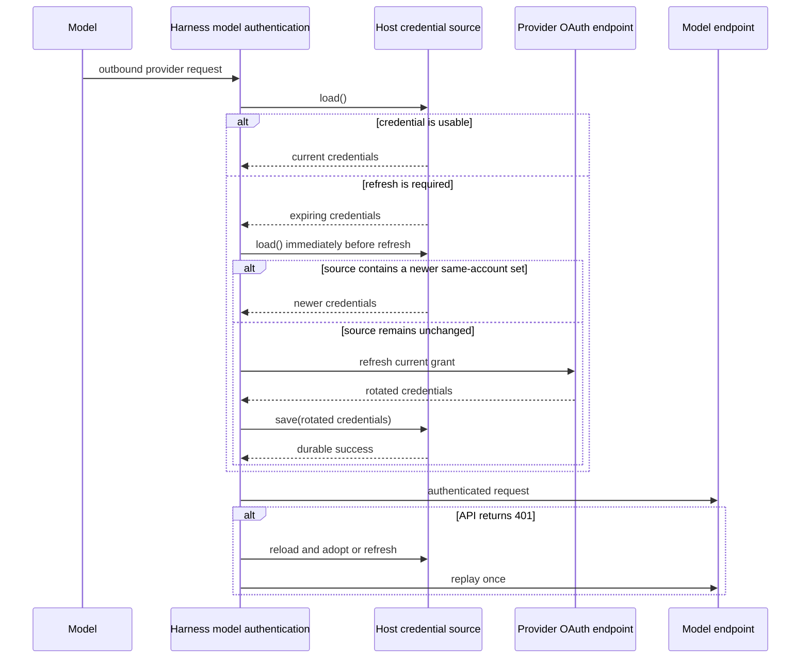

# Model Authentication

## Design Position

The Harness provides SDK-first process-local authentication for native Models whose providers use user OAuth credentials rather than API keys. The public `a13n_harness.model_auth` feature module owns provider-compatible credential values, application-owned credential-source protocols, OAuth exchange and refresh primitives, request authentication, and native Model construction for supported subscription providers.

This boundary is designed for embedded applications and hosted workers alike. It does not treat an installed CLI or a local credential file as the primary API. A Host can connect a local product-compatible file, an encrypted service store, or another authorized durable source by implementing the same asynchronous `load()` and `save()` protocol.

## Boundaries

| Concern                                                                            | Owner                    | Contract                                                                               |
| ---------------------------------------------------------------------------------- | ------------------------ | -------------------------------------------------------------------------------------- |
| Credential value and `load()`/`save()` source protocol                             | Harness                  | Defines the provider-specific process-local seam                                       |
| Expiry check, refresh, process-local single-flight, and one 401 replay             | Harness                  | Runs inside the Model provider integration                                             |
| Provider OAuth endpoints, public-client exchange, and request dialect              | Harness                  | Remains provider-specific rather than one generic OAuth JSON shape                     |
| Durable credential storage, encryption, account selection, and authorization       | Host                     | Implements a credential source and controls who may use it                             |
| Strict multi-process or multi-replica refresh exclusion                            | Host                     | May coordinate inside `load()` and `save()`; it is not implied by a process-local lock |
| Local product-store path, schema preservation, login/logout UI, and account status | Agent UI                 | Adapts Codex and Grok Build stores to the Harness source protocols                     |
| Model route and non-secret settings                                                | Host model configuration | Selects a supported Harness Model constructor or another native Model                  |

The Harness never discovers a Host account, selects a durable record, stores credential bytes in `HarnessState`, or defines a Model-account resource. MCP OAuth, Connector OAuth, and end-user sign-in are separate contracts.

## Public Credential Sources

The following Python-like definitions are conceptual public API, not serialized wire formats:

```python
@dataclass(frozen=True, slots=True, kw_only=True)
class CodexCredentials:
    account_id: str
    expires_at: datetime
    access_token: str
    refresh_token: str
    id_token: str | None = None


class CodexCredentialSource(Protocol):
    async def load(self) -> CodexCredentials: ...
    async def save(self, credentials: CodexCredentials) -> None: ...


@dataclass(frozen=True, slots=True, kw_only=True)
class GrokCredentials:
    account_id: str
    auth_mode: str
    create_time: datetime
    expires_at: datetime
    issuer: str
    client_id: str
    access_token: str
    refresh_token: str | None = None


class GrokCredentialSource(Protocol):
    async def load(self) -> GrokCredentials: ...
    async def save(self, credentials: GrokCredentials) -> None: ...
```

Credential representations exclude secret fields from `repr`. A source returns one complete current provider credential set. `save()` durably replaces that set or raises; it never reports success before the replacement meets the Host's durability policy.

The small protocol is intentionally structural. Provider lifecycle code needs no revision token or storage-specific snapshot. A Host that requires compare-and-swap, row locking, leases, or cross-replica exclusion implements that behavior behind `load()` and `save()`.

## Request Lifecycle



The source is consulted for every outbound provider request. This is a freshness check, not an unconditional refresh. One provider instance serializes its own refresh operation and lets concurrent requests adopt the completed result. Before spending a refresh token, it reloads the source and adopts a changed same-account credential set instead.

A refreshed credential is not installed for outbound use until `save()` succeeds. A failed save therefore fails the pending request and leaves the previously accepted in-memory set unchanged. This stricter ordering prevents an application from treating an unpersisted rotation as usable when refresh tokens can be single-use.

An HTTP 401 triggers at most one reload-or-refresh and one replay. The second response is returned without another authentication retry. Interactive authorization never starts from a Model request.

## Request Isolation and Affinity

OAuth headers are attached only to the exact HTTPS origin owned by the selected Model integration. Codex requests carry bearer authorization, the ChatGPT account identifier, and the Harness originator. Grok requests carry only their supported bearer authorization. Redirects or reuse of a client for another origin cannot forward these credentials.

A caller-supplied HTTP client must be dedicated to the Model integration and have no existing authentication; the builder installs its request authentication and does not close that client. When the builder creates the client, the native Model lifecycle closes it and can recreate it on a later entry.

Codex uses the native Responses streaming dialect, disables provider storage, removes settings the subscription endpoint does not support, and does not claim local token counting. It derives Codex `session-id`, `thread-id`, and `x-client-request-id` defaults from the effective Harness Thread affinity already supplied as `x-session-id`; explicit case-insensitive header values win. The standard `openai_prompt_cache_key` remains owned by the Harness request-affinity Capability. Root and child Threads therefore receive different provider thread affinity while each Thread retains stable affinity across its own continuation.

No OAuth token, authorization code, PKCE verifier, raw identity claim, or complete source record enters Model messages, `HarnessState`, event payloads, logs, or telemetry.

## OAuth Flows

The module exposes provider-specific authorization and refresh primitives. `CodexOAuthFlow` is an authorization-code plus PKCE context: construction performs no I/O, `authorization_url()` creates the provider URL, and `exchange_code()` exchanges a callback code for `CodexCredentials`. A convenience one-shot localhost callback receiver is process-local; opening a browser and deciding whether and where to save the returned credentials remain caller-owned.

Grok OIDC refresh follows the issuer and client identity in `GrokCredentials`, validates a secure discovered token endpoint, and returns another complete credential set. Codex and Grok do not share one token-response schema or one account identity rule.

## Failure Semantics

| Failure                                                   | Observable outcome                                                                                                       |
| --------------------------------------------------------- | ------------------------------------------------------------------------------------------------------------------------ |
| Source is absent, malformed, unauthorized, or unavailable | The Model interaction fails with bounded authentication-required or source-failure semantics                             |
| Reloaded credential belongs to another account            | The interaction fails; a live Model instance does not silently switch accounts                                           |
| OAuth refresh is rejected or malformed                    | The interaction fails; interactive login is not started                                                                  |
| Rotated credentials cannot be saved                       | The interaction fails before the rotated access token is sent                                                            |
| Another actor rotates the same account before refresh     | The provider adopts the reloaded set instead of spending its stale refresh token                                         |
| Another actor wins during `save()`                        | The Host source's conflict or coordination behavior determines the failure; Harness does not claim distributed exclusion |
| First Model request receives 401                          | Reload or refresh is attempted, then the request is replayed once                                                        |
| Replayed request receives 401                             | The second response is returned without another replay                                                                   |

## Compatibility

`a13n_harness.model_auth` is the canonical public import route; its values are not duplicated at the package root. Provider-specific credential fields, OAuth wire behavior, request headers, and Model dialects are release-owned compatibility surfaces and are tested against the supported upstream products.

Adding another provider is additive only when it has an explicit credential type, source protocol, OAuth behavior, and Model transport contract. A generic OAuth document that erases provider differences is not a compatible extension.

## Invariants

1. Model OAuth is SDK-first and does not require a CLI credential store.
2. The Harness owns process-local credential refresh, single-flight, request injection, and one 401 replay.
3. The Host owns durable credential authority, authorization, and distributed coordination.
4. Every outbound authenticated request consults its source, while refresh occurs only when needed or after rejection.
5. A rotated credential is saved successfully before it can authenticate a Model request.
6. Credentials are sent only to the selected provider's exact HTTPS origin.
7. A Model request never starts interactive login or silently changes account identity.
8. Credential bytes never enter Harness continuation, Model context, events, logs, or telemetry.
