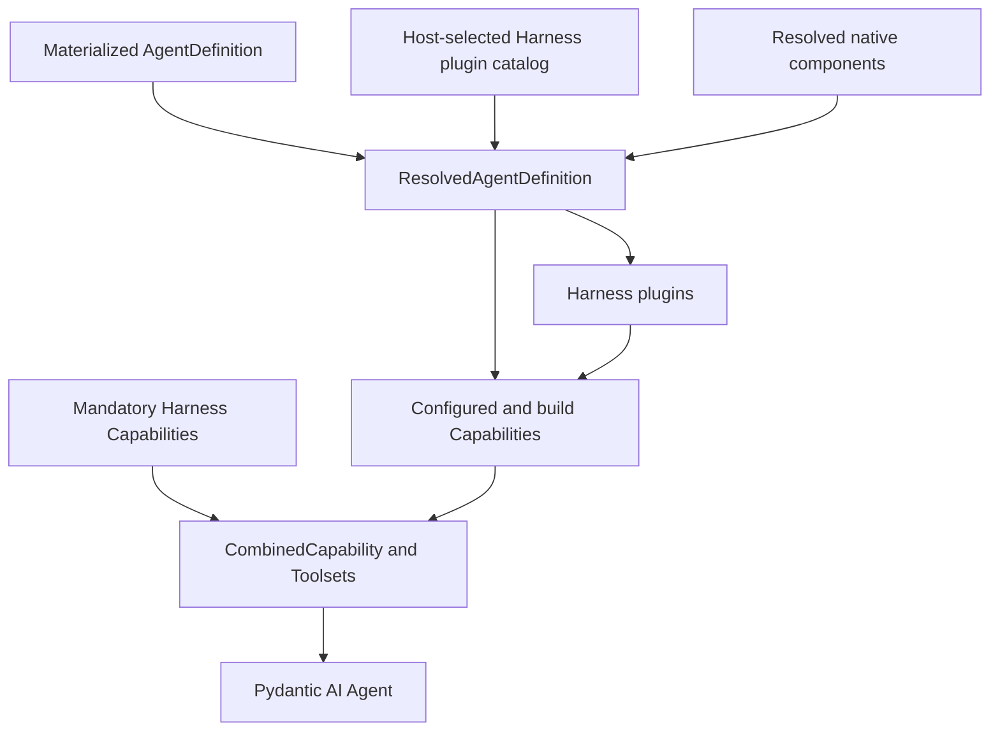
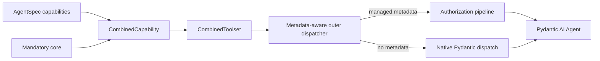

# Core Capability Catalog

## Design Position

First-party behavior inside the Pydantic Agent loop is packaged as ordinary Pydantic AI Capabilities and Toolsets. This catalog names those Capability entries, shows their upstream composition primitive, and points to the document that owns their semantics. It does not own the separate Harness plugin catalog, `PluginSpec`, input-to-result middleware lifecycle, descriptor, profile, or version system.

Capability identity comes from the configured Pydantic AI Capability `id`, its serialization type, and its resolved artifact source. Pydantic AI owns Capability construction, dependency resolution, ordering, deferred loading, and Pydantic-run middleware behavior. The Harness owns plugin construction, ordering, fresh run binding, and the outer run chain defined in [Harness Plugin System](05-plugin-system.md).

## Mandatory Core

The mandatory core contains only behavior shared by embedded and hosted execution and needed to preserve the harness security or observation boundary.

| Capability entry              | Upstream primitive                                                                | Owning document                                                                                                                            | State and security boundary                                                                                                                                              |
| ----------------------------- | --------------------------------------------------------------------------------- | ------------------------------------------------------------------------------------------------------------------------------------------ | ------------------------------------------------------------------------------------------------------------------------------------------------------------------------ |
| Context state                 | `AbstractCapability[AgentContext]` lifecycle plus `AgentContextState`             | [`04-capability-model.md`](04-capability-model.md), [`06-execution-context-and-lifecycle.md`](06-execution-context-and-lifecycle.md)       | Validates namespaced state and coordinates message-history plus state export through `AgentContext`                                                                      |
| Identity binding              | Outermost `AbstractCapability[AgentContext]` using `RunContext[AgentContext]`     | [`02-domain-model.md`](02-domain-model.md), [`15-security-compatibility-and-tradeoffs.md`](15-security-compatibility-and-tradeoffs.md)     | Run-local `AgentInstanceContext`; model data cannot replace it                                                                                                           |
| Invocation dispatcher         | Fixed outer `InvocationAuthorizationCapability` and `WrapperToolset`              | [`07-tool-execution.md`](07-tool-execution.md), [`15-security-compatibility-and-tradeoffs.md`](15-security-compatibility-and-tradeoffs.md) | Recognizes optional Harness metadata and preserves native Pydantic behavior for unannotated trusted tools                                                                |
| Invocation policy binding     | Exactly one reserved-role run Capability, with deny-all managed default           | [`07-tool-execution.md`](07-tool-execution.md), [`14-public-api-and-packaging.md`](14-public-api-and-packaging.md)                         | Supplies typed policy, approval, credential, and result-safety collaborators to the fixed dispatcher; duplicates fail and omission is fail-closed                        |
| Environment run binding       | Harness-entered `EnvironmentRunBinding` plus one run `EnvironmentCapability`      | [`08-environment-integration.md`](08-environment-integration.md)                                                                           | Publishes the entered multi-binding facade, owns its versioned state, and injects bounded current routing or live-change notices; a no-operation binding is valid        |
| Active-run bridge             | `AgentRunEvents`, run-specific `AbstractCapability`, and public node hooks        | [`06-execution-context-and-lifecycle.md`](06-execution-context-and-lifecycle.md)                                                           | Binds native `RunContext.enqueue`; exports the pending public model request and commits safe-pause state before native cancellation; owns no queue or cancellation token |
| Event adapter                 | Capability event hooks and Pydantic AI event values                               | [`12-events-observability-and-usage.md`](12-events-observability-and-usage.md)                                                             | Per-run ordering and child correlation; the stream does not become execution authority                                                                                   |
| Usage pricing and observation | Final normal `after_model_request` hook plus public-boundary response observation | [`12-events-observability-and-usage.md`](12-events-observability-and-usage.md)                                                             | Custom-first estimate where the hook is reached; every observed response reports stable identity, actual cost source, and pricing coverage without another accumulator   |

The builder installs fixed core behavior. At each run, the Harness constructs exactly one Environment Capability over the entered `EnvironmentRunBinding`, one usage-pricing and observation Capability over the optional run calculator, and exactly one invocation-policy provider: a host provider when supplied, otherwise `DenyManagedToolsCapability`. Reserved infrastructure roles cannot be selected by model-visible configuration, and duplicate host providers fail before the Pydantic run. Implementations remain ordinary Pydantic AI Capabilities with explicit `CapabilityOrdering`.

## Optional Capability Catalog

Portable optional Agent-loop features enter through `AgentDefinition.agent.capabilities`, a first-class plugin's Capability contribution, or explicit resolved build Capabilities. Trusted native tools or Toolsets that are intentionally process-local can enter through `ResolvedAgentComponents`; they remain upstream build inputs rather than another catalog or middleware framework. Reentrant build behavior whose possession grants no current-run authority can enter through resolved build Capabilities. Identity, Environment, invocation policy, credential, checkpoint, telemetry, and every other privileged or run-specific binding enter through `RunBindings` and run Capabilities. Deployments install only the packages they use.

| Capability entry                | Upstream primitive                                                                                | Owning document                                                                                                          | State and security boundary                                                                                                              |
| ------------------------------- | ------------------------------------------------------------------------------------------------- | ------------------------------------------------------------------------------------------------------------------------ | ---------------------------------------------------------------------------------------------------------------------------------------- |
| Filesystem                      | `AbstractToolset` or capability-owned toolset                                                     | [`08-environment-integration.md`](08-environment-integration.md)                                                         | Environment provider owns paths, generations, and native enforcement                                                                     |
| Shell and process               | `AbstractToolset` or capability-owned toolset                                                     | [`08-environment-integration.md`](08-environment-integration.md), [`07-tool-execution.md`](07-tool-execution.md)         | Process handles stay provider-owned and identity-bound                                                                                   |
| Tool search and proxy           | Pydantic AI tool-search capability and wrapper toolsets                                           | [`07-tool-execution.md`](07-tool-execution.md)                                                                           | Discovery state grants no invocation authority; underlying tool identity is preserved                                                    |
| Skills                          | Deferred `Capability` with instructions and resources                                             | [`04-capability-model.md`](04-capability-model.md), [`05-plugin-system.md`](05-plugin-system.md)                         | Skill content is data; executable capability code resolves separately as a trusted plugin                                                |
| Guidance and repository context | `Capability` instructions or history preparation                                                  | [`09-context-and-memory.md`](09-context-and-memory.md)                                                                   | Bounded content with provenance; file reads use `BoundEnvironment`                                                                       |
| Compaction                      | Pydantic AI compaction/history capability                                                         | [`09-context-and-memory.md`](09-context-and-memory.md), [`10-snapshot-and-resume.md`](10-snapshot-and-resume.md)         | Produces provider-valid message history; durable acceptance stays with the host                                                          |
| Memory integration              | Plugin-contributed Capability instructions and Toolset                                            | [`09-context-and-memory.md`](09-context-and-memory.md), [`05-plugin-system.md`](05-plugin-system.md)                     | Query-dependent recall can use plugin input middleware; external memory remains authoritative and scope derives from Agent Identity      |
| Planning and working state      | `Capability` plus owned state and optional fresh task-provider binding                            | [`09-context-and-memory.md`](09-context-and-memory.md), [`10-snapshot-and-resume.md`](10-snapshot-and-resume.md)         | Local task snapshots stay parent-owned; provider mode keeps task data and CAS authority Host-owned                                       |
| Delegation and subagents        | Capability-owned inline delegation toolset over `SubagentCollection`                              | [`11-delegation-and-subagents.md`](11-delegation-and-subagents.md)                                                       | Stable child IDs, nested child State, shared task projection, and fresh narrowed authority; async lifecycle belongs to Host Capabilities |
| Code orchestration              | Capability-owned toolset over an isolated evaluator                                               | [`07-tool-execution.md`](07-tool-execution.md)                                                                           | Only explicitly eligible tools; evaluator has no implicit harness-process authority                                                      |
| Media normalization             | Capability using Pydantic AI media content types                                                  | [`16-input-model-and-output.md`](16-input-model-and-output.md)                                                           | Preserves provenance and classification; temporary provider URLs are not durable authority                                               |
| Stream recovery                 | Capability event and error hooks                                                                  | [`16-input-model-and-output.md`](16-input-model-and-output.md), [`10-snapshot-and-resume.md`](10-snapshot-and-resume.md) | Keeps only finalized response parts and retries only replay-safe model work                                                              |
| Web and remote server tools     | Pydantic AI Web/MCP capabilities or ordinary Toolsets                                             | [`07-tool-execution.md`](07-tool-execution.md)                                                                           | Native Toolsets remain usable; metadata-aware adapters opt into Harness-managed authorization                                            |
| Client-side external tools      | Client Tools Capability plus per-run Pydantic `ExternalToolset`                                   | [`07-tool-execution.md`](07-tool-execution.md), [`14-public-api-and-packaging.md`](14-public-api-and-packaging.md)       | Exact schemas defer to an external executor; definition policy gates any whole-run replacement and grants no server authority            |
| A2A dispatch                    | Capability-owned Toolset over a host or provider adapter                                          | [`07-tool-execution.md`](07-tool-execution.md), [`13-hosting-contract.md`](13-hosting-contract.md)                       | Remote task lifecycle stays with the A2A provider or host                                                                                |
| Digest and title                | Capability, Harness result middleware, or application utility over structured output              | [`16-input-model-and-output.md`](16-input-model-and-output.md), [`05-plugin-system.md`](05-plugin-system.md)             | A plugin can replace a validated result candidate; Host durable completion remains separate                                              |
| Provider compatibility          | Native `ModelProfile` and adapter first; scoped Capability only for residual public-hook behavior | [`16-input-model-and-output.md`](16-input-model-and-output.md)                                                           | No duplicate profile facts or private adapter patching; retries only verified replay-safe failures                                       |
| Checkpoint storage              | `CheckpointCapability` with a host-provided `CheckpointStore`                                     | [`04-capability-model.md`](04-capability-model.md), [`13-hosting-contract.md`](13-hosting-contract.md)                   | Capability saves portable candidates; host calls `load()` and owns selection, generations, durability, and fencing                       |

This list defines stable documentation names, not a mandatory bundled distribution. A third-party capability can participate without being added to this catalog when it follows the public contracts in [`04-capability-model.md`](04-capability-model.md) and [`05-plugin-system.md`](05-plugin-system.md).

Provider compatibility is profile-first. Stable support and rendering facts use the resolved native Pydantic `ModelProfile` and its model adapter. A Capability is used only for Agent or run behavior, dynamic recovery, or a temporary model-integration-scoped repair expressible through public hooks while the missing profile or adapter seam is contributed upstream. It never duplicates an existing profile field, mutates a cached profile, or patches a private adapter method.

## Catalog Semantics

Catalog membership describes an intended first-party integration surface. It does not install a package, enable a capability, grant authority, or imply that every host supports the entry.

The materialized Agent definition records configured Capability specs and Harness plugin specs. The process-local resolved build plan supplies permitted Capability types, the selected Harness plugin catalog, and trusted native components and build Capability instances. The Harness constructs plugins and obtains their Capability contributions. Availability failures therefore appear during Host resolution or definition build, before model execution.

Catalog names are documentation labels. Serialized configuration uses the capability's Pydantic AI serialization name and explicit `id`; compatibility follows the capability type, resolved Agent definition, and capability-owned state versions rather than a catalog version.

## Composition

`CapabilityOrdering` expresses dependency and wrapper relationships. Pydantic AI rejects missing dependencies, ordering cycles, duplicate explicit capability IDs, and conflicting tool names. The Harness additionally rejects duplicate managed `tool_id` values before model exposure and adds only the fixed placement needed for Identity binding and the metadata-aware outer function-tool dispatcher. The fresh `InvocationPolicyCapability` can select strict metadata enforcement for its current run; static, dynamic, and deferred function definitions are checked at their Toolset preparation boundary before model exposure. Strictness is neither a hidden build option nor a durable Agent field, and the base dispatcher does not invent metadata or policy for native tools. Client-side tools remain `kind="external"`, are collision-checked with the same complete surface, and follow their separate definition-opt-in and external-result contract instead of being reclassified as managed functions.

Stateful optional capabilities use namespaced `AgentContextState` from [`04-capability-model.md`](04-capability-model.md) and the envelope in [`10-snapshot-and-resume.md`](10-snapshot-and-resume.md). Deferred capabilities resolve package and portable configuration before the run; current policy and authority enter through run Capabilities before activation. Activation changes model-visible behavior without installing new code.

## Boundaries

| Concern                                                  | Owner                                              | Catalog relationship                                                  |
| -------------------------------------------------------- | -------------------------------------------------- | --------------------------------------------------------------------- |
| Capability lifecycle and ordering                        | Pydantic AI                                        | Referenced directly, not redefined                                    |
| Capability descriptor and serialization                  | [`04-capability-model.md`](04-capability-model.md) | Supplies Capability identity and resolved type                        |
| Harness plugin catalog, construction, binding, and chain | [`05-plugin-system.md`](05-plugin-system.md)       | Can contribute entries from this catalog; lifecycle is not owned here |
| Host integrations                                        | Their owning subsystem and host                    | Injected as ordinary `AbstractCapability[AgentContext]` instances     |
| Capability-specific behavior                             | Linked owning document                             | Not repeated here                                                     |
| Host definition revision, Presets, and plugin selection  | Host                                               | Produces the materialized definition and process-local resolved plan  |
| Enterprise policy and audit                              | Host or enterprise extension                       | Outside the mandatory open-source core                                |

## Trade-offs

### Catalog vs. a Second Framework

This Capability catalog provides a shared vocabulary without adding factories, lifecycle hooks, dependency solvers, or catalog-level versions. The separate Harness plugin system has its own typed construction and middleware lifecycle; this document does not duplicate it. Detailed behavior remains in the linked owners.

### Small Mandatory Core vs. Uniform Feature Set

Identity, metadata-aware invocation authorization, events, native Pydantic enqueue, cancellation and usage exposure, and state export remain consistent across host modes. The active-run bridge only connects the stream wrapper to the bound `RunContext` and adds complete-boundary safe-suspend classification. Everything else is optional, which keeps base dependencies small but allows two Agent definitions to expose very different capabilities. Native unannotated Toolsets remain part of the trusted process surface rather than being forced into a parallel Harness tool class.

### Upstream Primitives vs. Harness Wrappers

Using native Pydantic AI `AgentRunEvents`, capabilities, and `RunContext` control methods makes upstream and third-party behavior composable. Harness wrappers add stable validation, observation, safe-pause classification, and result semantics without recreating the event task, pending-message queue, or cancellation machinery. Compatibility remains bounded to documented Pydantic AI public behavior.

### One Tool Path vs. Specialized Dispatch

Direct, discovered, proxied, delegated, Environment, and code-orchestrated managed tools retain one canonical authorization and event path. Native unannotated Toolsets retain Pydantic dispatch and event behavior without acquiring Harness security claims. Provider-native execution that requires Identity, credentials, grants, or retry safety uses metadata-aware adapters into the managed path.
