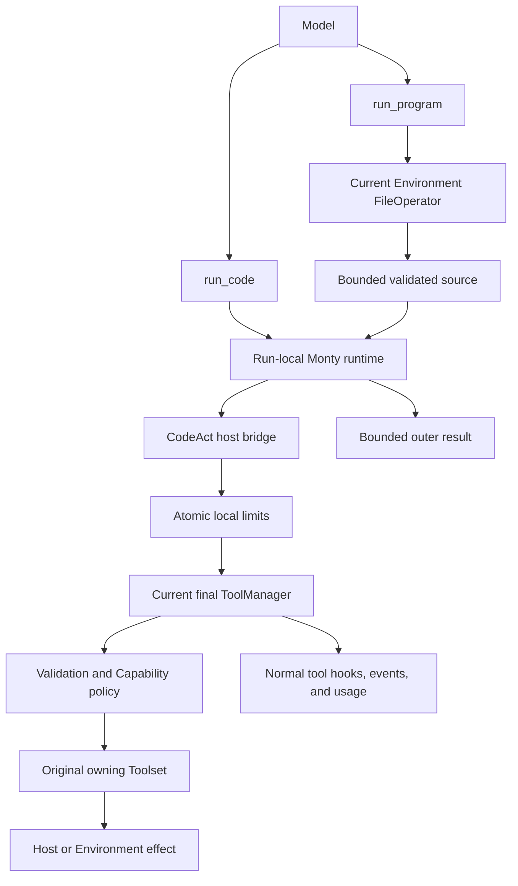

# Restricted CodeAct Orchestration

## Design Position

CodeAct lets model-authored restricted Python coordinate multiple tools in one model tool call. It provides an inline `run_code` surface and a file-backed `run_program` surface while preserving the executing Agent's final Pydantic tool policy.

CodeAct is an optional Harness Capability, not a second tool router, general CPython, Environment shell, or Environment mount. Sandboxed code has no ambient filesystem, network, process, environment-variable, credential, or clock authority. Every host action enters through an explicitly eligible tool and the current Pydantic `RunContext.tool_manager`.

A saved program is reusable source. Running it again executes current tools against current external state; it is not recorded-output replay, a transaction, exactly-once execution, or continuation from an earlier program counter.

## Ownership

| Concern                                                                                                                    | Owner                              |
| -------------------------------------------------------------------------------------------------------------------------- | ---------------------------------- |
| Configuration, Agent/run lifecycle, wrapper composition, runner isolation hooks, and instructions                          | `CodeActCapability`                |
| `run_code` and `run_program` schemas, source/program validation, sandbox bridge, limits, and complete per-call behavior    | `CodeActToolset`                   |
| Restricted Python execution, pure-compute memory/recursion/deadline enforcement, and interpreter session lifecycle         | Monty public API                   |
| Final tool directory, argument validation, Capability hooks, owning Toolset dispatch, and successful-call usage accounting | Pydantic AI `ToolManager`          |
| Logical files and path authorization for program source                                                                    | Current Environment `FileOperator` |
| Durable execution, scheduling, checkpointing, delivery, and replay policy                                                  | Host                               |

The Capability may create and bind the Toolset, but it does not act as the Toolset's Operations object or receive callbacks for complete model-tool execution. The Toolset owns each runner call over the narrow Monty, `ToolManager`, event, and `FileOperator` ports selected by the Capability.

## Architecture



`CodeActCapability` wraps each Agent's assembled non-output Toolset after that Agent's own filtering. A root Agent, named child, and self fork each receive an independent run-local wrapper, catalog, `ToolManager` view, interpreter state, and execution budget. A parent catalog is never copied into a child.

## Public Configuration

CodeAct is opt-in through a code-first `CodeActCapability(CodeActConfig(...))` in `AgentDefinition.capabilities`. Omitting the Capability exposes neither runner.

```python
@dataclass(frozen=True, slots=True, kw_only=True)
class CodeActConfig:
    inline: bool = True
    programs: bool = True
    max_source_bytes: int = 256 * 1024
    max_output_bytes: int = 10 * 1024 * 1024
    max_tool_calls: int = 128
    max_concurrency: int = 16
    timeout_seconds: float = 300.0
    max_memory_bytes: int = 100 * 1024 * 1024
    max_recursion_depth: int = 1000
```

At least one runner must be enabled. Integer limits and the finite deadline are positive. A configured limit must be enforced at its documented boundary; unsupported limits fail construction or execution rather than being ignored. A Host may lower these limits but cannot widen Monty, provider, Harness, or deployment ceilings.

Monty is a normal Harness dependency so installation shape does not change with runtime configuration. Importing the package still starts no sandbox process; the run-local runtime is initialized lazily on first execution and closed with the logical Harness run.

## Typed Eligibility

CodeAct eligibility is an owner-controlled typed policy, not arbitrary model-visible metadata.

```python
@dataclass(frozen=True, slots=True, kw_only=True)
class CodeActToolPolicy:
    default: bool = False
    tools: Mapping[str, bool] = {}


class CodeActPolicyToolset(WrapperToolset[AgentDepsT]):
    policy: CodeActToolPolicy
```

A Toolset author can expose the same typed policy protocol directly. `CodeActPolicyToolset` attaches an immutable prepared-tool sidecar while retaining the exact source `ToolsetTool`; transparent prefix and Harness wrappers preserve that sidecar or owner-local identity. Eligibility resolves from the effective owner-local policy before final names are projected. Unknown policy entries can be rejected by the wrapper when strict declaration checking is requested.

The selector never infers eligibility from final name, description, JSON Schema, apparent read-only behavior, model visibility, MCP origin, `HarnessToolMetadata`, or arbitrary `ToolDefinition.metadata`. Metadata may contain a diagnostic projection, but changing it cannot grant CodeAct authority.

An effective true policy means only that the owner supports programmatic invocation from restricted CodeAct subject to normal runtime checks. It does not imply bypassed approval, inheritance to another Agent, read-only behavior, idempotency, retry safety, determinism, or transactional behavior.

The effective execution catalog is the intersection of:

- tools present in the current run-step's final `ToolManager` directory;
- current Agent and Capability availability/filtering;
- effective typed CodeAct policy;
- ordinary function tools supported by the nested dispatch contract; and
- valid, collision-free sandbox callable names.

The two runner tools, output tools, external client tools, provider-native tools, deferred-loading controls, delegation, handoff/compaction, structured user interaction, and any tool requiring unresolved cross-turn continuation are never eligible. Other control tools remain denied unless their semantic owner deliberately publishes a typed true policy and the CodeAct Toolset's fixed exclusion rules allow the category.

Canonical names that are Python identifiers remain unchanged. Other valid final names are deterministically converted to sandbox identifiers. Canonical or sanitized collisions, reserved runner names, and an existing top-level `run_code` or `run_program` collision fail before runner exposure; no last-wins behavior is accepted. Calls are keyword-only. A valid object-schema tool with non-identifier property names remains callable through dictionary expansion such as `await tool(**mapping)`; Pydantic's prepared validator remains authoritative.

## Final Tool Directory and Nested Dispatch

For each execution, CodeAct derives one immutable name, schema, sequential-policy, and eligibility snapshot from the active run-step's final `ToolManager`. Execution stays on that same manager object. CodeAct does not construct a divergent manager, call an underlying Python function directly, call `BaseTool.call`, or maintain an independent route table.

Each sandbox callback:

1. resolves its sandbox name in the immutable execution catalog;
2. admits the call under the per-execution count and concurrency limits before host argument materialization;
3. validates the converted argument value against the CodeAct value boundary;
4. creates a fresh nested tool-call identity;
5. invokes `ToolManager.validate_tool_call(..., wrap_validation_errors=False)`;
6. classifies the call as started only after validation succeeds;
7. invokes `ToolManager.execute_tool_call(..., wrap_validation_errors=False)`; and
8. converts the completed result back through the bounded CodeAct value boundary.

This path preserves the current prepared tool, custom validators, Capability validation/execution hooks, managed authorization and credentials, owning wrappers such as the Harness execution boundary, approval handlers that resolve inline, tracing, business usage producers, and Pydantic successful-call accounting. It never fabricates a second managed invocation or usage record.

`CodeActConfig.max_tool_calls` limits admitted nested attempts in one runner execution. Pydantic `UsageLimits.tool_calls_limit` remains independently authoritative for the parent run. Each successful nested call is counted by `ToolManager`; the Harness does not directly mutate successful usage. The runner must reject work before dispatch when the current public Pydantic usage contract proves that the projected outer plus nested call cannot fit. Where an upstream version cannot safely reserve a concurrent projected parent slot, CodeAct serializes admission rather than allowing calls to exceed the parent limit.

`max_concurrency` covers conversion, validation hooks, and execution for admitted callbacks. A nested tool marked sequential is a barrier with respect to other nested calls in that execution, and a parent run-wide sequential execution policy remains authoritative.

## Runner Isolation

Both runner definitions are sequential parent tools. A model response containing either runner must contain exactly one executable tool call. A pre-execution Capability hook rejects a runner with any sibling function/output call or a second runner before any tool body begins. Nested calls inside that sole runner may execute concurrently within the configured and parent limits.

Only one `run_code` call can own its inline session at a time. A nonstandard overlapping entry fails as busy before evaluating source; it does not wait behind work with unknown side effects, race bindings, or let `restart=True` interrupt an active call. `run_program` always uses a fresh session, while the parent sequential barrier serializes ordinary runner calls in one Agent run.

## `run_code`

```python
async def run_code(
    code: str,
    restart: bool = False,
) -> JsonValue: ...
```

Inline source is strict Python text bounded by UTF-8 bytes. Successful calls may leave bindings for later `run_code` calls in the same logical Harness run. `restart=True` discards all prior inline state before evaluation.

Any unsuccessful inline feed discards the entire inline session before control returns. Partial interpreter mutation does not survive a failed source feed. Inline interpreter state is never exported through `HarnessState`, copied into a child, restored into a new Harness run, retained across deferred resume, or treated as a crash/takeover checkpoint.

The final expression is the return value. Printed output is captured under `max_output_bytes`; it is not an unbounded logging side channel.

## `run_program`

```python
async def run_program(
    path: str,
    inputs: dict[str, JsonValue] | None = None,
) -> JsonValue: ...
```

`run_program` reads source through `AgentContext.environment.files`. The current Environment performs logical-path resolution and authorization; CodeAct adds no lexical root, mount, provider handle, or `environment_alias` parameter. The Toolset reads at most `max_source_bytes + 1`, requires a `*.codeact.py` name and strict UTF-8, and hashes the exact source bytes that execute.

Every invocation uses a fresh Monty session. A program cannot observe inline state or state from an earlier program invocation. Inputs cross as validated data and are never interpolated into source. Existing file tools own create, edit, list, and delete behavior; CodeAct adds no duplicate program-management API. `.agents/codeact/` may be an authoring convention but is not an authorization root.

A program defines exactly one undecorated `async def main(inputs)` entrypoint. Module scope permits sandbox-supported imports, declarations, docstrings, and side-effect-free constants. Executable top-level statements, direct or recursive invocation of `main`, unsafe definition-time expressions, and reserved runtime-name collisions fail before execution.

Preflight rejects loaded references to `open`, `input`, `eval`, `exec`, `compile`, and `__import__`, even if source shadows a name. Imports rooted at `os`, `pathlib`, `socket`, and `subprocess` are rejected. These checks are deterministic authoring diagnostics; Monty's lack of ambient authority remains the security boundary.

## Sandbox and Value Boundary

Monty receives no Host filesystem mount, environment mapping, network/process callback, credential resolver, or clock API. It receives only validated program inputs and callbacks for the immutable eligible catalog. Pure sandbox-supported builtins and modules such as `asyncio` remain available.

The boundary value algebra is JSON null, boolean, integer, finite float, UTF-8 string, list, and string-keyed map. Non-finite numbers, non-string keys, bytes, cycles, and arbitrary Host objects fail closed. Values are measured by a cycle-safe bounded traversal before an unbounded complete JSON encoding is allocated.

`max_output_bytes` bounds each input object, nested argument set, nested return value, cumulative nested bridge values, printed output, and final outer value. The producer-specific and mandatory Harness tool-result boundaries may narrow the final model-visible result further. CodeAct does not weaken a nested tool's own output policy.

For a nested `ToolReturn`, `return_value` is the value visible to restricted code. Supported supplemental model content remains outside Monty and is appended to the successful outer `ToolReturn` in nested-call order. Nested metadata remains available to owning hooks and usage producers but is not exposed to Monty or merged into outer metadata. Unsupported supplemental content fails closed instead of being converted through object representation.

## Timeout, Cancellation, and Cleanup

`timeout_seconds` is the deadline that requests cancellation of the Monty feed and admitted Host calls. CodeAct cancels and drains its admitted callback tasks before releasing runtime ownership. Wall-clock completion may exceed the deadline when an in-process tool is slow to cooperate.

External task cancellation follows the same drain rule and then re-raises `asyncio.CancelledError`. Timeout returns a bounded typed tool failure. Neither outcome implies rollback. A provider may have accepted a side effect before cancellation became observable.

Memory, recursion, and pure-compute duration limits are passed through Monty's public `ResourceLimits`. The Capability closes failed inline sessions and all run-local Monty sessions at logical-run cleanup. No interpreter frame, callback, `ToolManager`, credential, catalog, or Context object enters a reusable global pool or portable state.

## Approval, Deferred Calls, and Retry

Approval may succeed only when the active Pydantic capability resolves it inline before the nested callback returns. An unresolved `ApprovalRequired` or `CallDeferred` terminates the current CodeAct execution. CodeAct does not export a Monty frame as deferred state, resume at the old program counter, or replay the whole source after feedback.

Syntax, entrypoint, static preflight, runner-input, missing-tool, and nested argument-validation failures discovered before any nested call starts may ask the model to correct the outer runner call under its normal retry budget. Raw nested validation does not consume the target tool's model-retry counter.

After the first nested call starts, any nested validation error, target `ModelRetry`, policy/result failure, timeout, or later program failure is terminal for that runner invocation. It becomes a bounded `ToolFailed` result and must not trigger automatic whole-source replay. Transport retries wholly inside the owning real tool remain governed by that owner's idempotency contract. A new attempt requires a new explicit runner call.

A completed earlier callback is never rolled back. Failure and timeout metadata therefore preserve a side-effect-uncertain flag once any nested call has started.

## Events and Data Safety

CodeAct emits typed Harness `diagnostic` extension payloads for execution start/completion and nested call start/completion. Correlation includes a fresh execution ID, the outer tool-call ID, nested call IDs and ordinals, canonical and sandbox names, execution kind, source digest and optional logical path, terminal status, durations, byte counts, error category, and side-effect uncertainty.

The default event, log, result metadata, and state projections contain no raw source, program inputs, nested arguments, nested return values, exception values, credential-bearing metadata, or content previews. Validation diagnostics omit input values. Events are process-local observations and may be missing after a hard crash; they are not a durable journal or replay authority.

## Compatibility

The Harness integrates only with public Pydantic AI `RunContext.tool_manager`, `ToolManager`, Toolset, Capability, usage, message, and deferred APIs and public Monty asynchronous session/snapshot APIs. The selected dependency versions must preserve nested validation/execution hooks, successful-call accounting, runner sequential behavior, cancellation, and configured resource limits in conformance tests.

CodeAct source is written for Monty's supported Python subset, not CPython. Changes in supported syntax or pure modules follow the selected Monty compatibility range. `*.codeact.py` distinguishes this contract from ordinary Python files, but source remains application data rather than a Harness state codec.

## Invariants

01. Omitting `CodeActCapability` exposes neither runner and starts no Monty resource.
02. A tool is unavailable to CodeAct unless its owning typed policy resolves true; arbitrary metadata cannot opt it in.
03. Every nested call validates and executes through the active final `ToolManager` and original owning Toolset.
04. Runner names, output/external/deferred/control surfaces, and sanitized-name collisions fail closed.
05. Root, child, fork, and independent Harness runs never share a catalog or interpreter state.
06. A failed inline feed clears its session; `restart=True` clears it before evaluation.
07. Each program invocation rereads bounded strict UTF-8 source through the current Environment and uses a fresh session.
08. Restricted code has no ambient Host filesystem, network, process, environment, credential, or clock authority.
09. Inputs, arguments, results, supplemental content, printed output, and final values cross finite explicit boundaries.
10. Call count, concurrency, parent usage, deadline, memory, and recursion limits fail closed before they can be bypassed.
11. A response containing a runner and another executable call is rejected before either begins.
12. Unresolved approval/deferred work exports no resumable interpreter frame and completed prior effects are not replayed or rolled back.
13. Failure after a nested call starts never becomes an automatic source replay.
14. Cancellation drains admitted callbacks before ownership release and then propagates cancellation.
15. Default diagnostics contain identities, status, timing, and sizes but no source or nested values.
