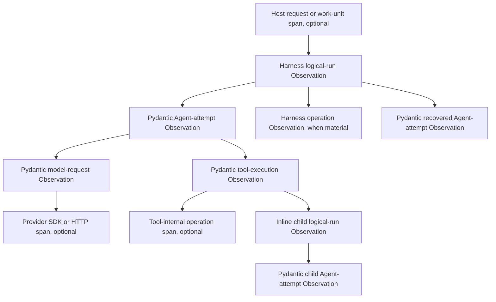

# Harness Observation Model

## Design Position

Harness Observation is the process-local OpenTelemetry projection of one logical Harness Run and its causal descendants. The Host owns the OpenTelemetry SDK, resource, sampling, processors, exporters, propagation, flush, and shutdown. The Harness remains inert unless the Host supplies explicit instrumentation providers.

Pydantic AI instrumentation is the sole owner of Agent-attempt, model-request, tool-execution, native usage, streaming, and cancellation spans. The Harness owns one outer logical-run span and creates child spans only for independently meaningful Harness operations. Langfuse v4 and Logfire are optional Host profiles over the same provider and span hierarchy, not separate Harness pipelines.

An Observation is never execution, continuation, side-effect, result, checkpoint, event-delivery, usage-settlement, billing, or authorization authority. [Events and Usage](12-events-observability-and-usage.md) owns the ordered event stream, usage attribution, reporting, and accounting boundary; this document owns only telemetry Observation semantics.

## Boundaries

| Concern                                                                                             | Owner                         | Contract                                                                                                  |
| --------------------------------------------------------------------------------------------------- | ----------------------------- | --------------------------------------------------------------------------------------------------------- |
| OpenTelemetry SDK, `Resource`, sampler, processors, exporters, batching, retry, flush, and shutdown | Host                          | The Harness receives explicit providers and configures no process-global telemetry.                       |
| logical Harness Run                                                                                 | Harness                       | One outer Observation covers the complete process-local lifecycle.                                        |
| Agent attempt, model request, tool execution, native usage, streaming, and cancellation             | Pydantic AI                   | One mandatory Harness-selected `Instrumentation` Capability owns these spans when Observation is enabled. |
| Provider SDK or HTTP request                                                                        | Provider or OTel instrumentor | Ordinary current-context propagation may create descendants; the Harness does not synthesize them.        |
| Harness context, state, recovery, delegation, handoff, compaction, and plugin-validation operations | Owning Harness component      | A child span exists only when the operation is independently meaningful and timed.                        |
| Process-local events and usage records                                                              | Event and usage owners        | They remain independent observations and do not become spans automatically.                               |
| Durable lifecycle, audit, delivery, accounting, and billing                                         | Host                          | A telemetry backend never commits these facts.                                                            |
| Vendor grouping and enrichment                                                                      | Host profile                  | Existing spans are enriched without replacing their owner or creating duplicates.                         |

A Harness component owns a span only when its operation remains independently meaningful after Pydantic model and tool execution are removed. Otherwise it enriches the current owning span or retains the existing event.

## Instrumentation Contract

`HarnessInstrumentation` is a frozen process-local public value. The following Python-like schema is conceptual and is not a wire format:

```python
@dataclass(frozen=True, slots=True)
class HarnessInstrumentation:
    tracer_provider: TracerProvider
    meter_provider: MeterProvider | None = None
    include_content: bool = False
    include_binary_content: bool = False
    include_model_request_parameters: bool = False
```

The Host supplies this value to `HarnessBuilder`; the builder applies it consistently to the root executable and every recursively built child. `None` disables Harness Observation. Disabled mode preserves execution, event, usage, state, cancellation, result, and cleanup behavior and also suppresses Pydantic AI's process-wide ambient instrumentation fallback.

The three content switches map to supported Pydantic AI instrumentation settings and default to `False`. They control Pydantic-owned capture only and do not broaden the Harness-owned attribute registry. The optional `MeterProvider` is forwarded to Pydantic instrumentation; this Observation contract defines no independent Harness metric series.

`HarnessInstrumentation` contains no exporter, endpoint, credential, API key, resource builder, sampler, processor, batch setting, retry policy, timeout, flush, shutdown, vendor SDK type, arbitrary span name, or unrestricted metadata map.

### Single Owner

The Harness rejects any competing instrumentation path:

- Pydantic AI `Instrumentation` supplied through `AgentSpec`, `AgentDefinition`, a Harness plugin, or `RunBindings`;
- a build-time or run-time resolved `InstrumentedModel`;
- the same conflict in any recursively built child definition.

Build validation covers authored and plugin contributions. Run validation covers fresh run Capabilities and models unavailable until resolution. Trusted custom Models remain responsible for any internal telemetry they emit; such telemetry is not Harness-managed Observation.

When Observation is enabled, the Harness installs exactly one mandatory Pydantic AI `Instrumentation` Capability using the supplied providers, selected content policy, and conventions supported by the repository's selected Pydantic AI release. Harness-authored spans use the stable OpenTelemetry instrumentation scope name `a13n-harness`; Pydantic spans retain their upstream scope. The built Pydantic Agent does not consult ambient `Agent.instrument_all()` state. When Observation is disabled, no authored, resolved, or ambient path becomes an uncontrolled fallback.

## Observation Hierarchy



Pydantic model-request and tool-execution spans remain descendants of their Pydantic Agent-attempt span. Provider and tool-internal instrumentation follows ordinary active-context parentage. The Harness does not create synonym model, generation, provider, tool, usage, streaming, or cancellation spans.

### Logical-Run Observation

The logical-run Observation uses the stable span name `harness.run`. It starts after allocation of the public Harness `run_id` and before Environment entry and run preparation. It remains open across:

- Environment entry and portable-state restore;
- Environment run-extension entry and controller activation;
- input preparation and semantic normalization;
- run-plugin binding and outer middleware;
- zero or more sequential `ModelAttempt` values;
- semantic recovery and cancellation-aware backoff;
- result and usage finalization;
- plugin unwind, Environment teardown, and remaining cleanup;
- terminal result construction before publication to the stream consumer.

A plugin short-circuit still has one logical-run Observation even when no Pydantic Agent attempt starts. After successful cleanup, the span ends at the terminal publication boundary immediately before the result event is yielded. On unhandled or cleanup failure, it ends after safe failure classification. It does not end at the first model response or before plugin and Environment cleanup.

The span is current during all causal run execution, including Harness, Pydantic, provider, tool, Environment, and inline-child work. The Harness detaches its context before every public stream yield, including non-terminal events, and restores it only when iteration resumes. The span remains open while the single consumer applies backpressure because the logical Run and its resources remain active, so that wait contributes to end-to-end span duration without making Host consumer work a descendant.

### Harness Operation Observations

A focused Harness child span uses the stable name `harness.operation` and one bounded `a13n.operation.kind`. The initial kinds are:

- `context`;
- `state`;
- `recovery`;
- `delegation`;
- `handoff`;
- `compaction`;
- `plugin_validation`.

A Capability hook, event, state access, or instantaneous lifecycle boundary does not justify a span by itself. Existing events remain events. A new operation kind is an observable compatibility addition and requires one documented semantic owner.

## Trace and Correlation Model

A Thread is not an OpenTelemetry trace. A Thread can continue across processes and many logical Runs, while a trace is one bounded causal execution graph.

- If the Host supplies a valid current span, the logical-run Observation is its child.
- Without a Host parent, the logical-run Observation starts a new trace.
- Resume normally starts a new trace while preserving Thread correlation.
- The Harness never keeps one trace open for the lifetime of a Thread.
- A string trace-ID attribute does not replace W3C Trace Context or an OpenTelemetry span link.

### Inline Children

A blocking inline child logical Run remains inside the active trace and receives one nested logical-run Observation containing its own Pydantic descendants. Its parent is the current owning span, normally the Pydantic delegation tool-execution span. The Harness does not reparent it directly to the outer logical-run span, and the same inline invocation does not also receive a sibling dispatch span.

### Host-Managed Asynchronous Children

The Host never persists or transmits a live span object. For a bounded distributed continuation, it may propagate W3C Trace Context. For independently scheduled, durable, or long-lived work, it starts a new trace and links its dispatch context with an OpenTelemetry span link. A link is the default for durable asynchronous child work. Safe Host metadata may supplement but cannot replace propagation or the link.

## Attribute Model

### Resource Attributes

The Host places process and deployment facts on the OpenTelemetry `Resource`, including `service.name`, `service.version`, the applicable standard deployment-environment attribute, and any bounded deployment or instance facts it selects. The Harness does not repeat resource facts on each span.

### Harness Attribute Registry

| Attribute                       | Placement                                                   | Meaning                                                                           |
| ------------------------------- | ----------------------------------------------------------- | --------------------------------------------------------------------------------- |
| `a13n.thread.id`                | logical run and correlation-relevant Harness descendants    | Stable independently advancing history correlation from `HarnessState.thread_id`. |
| `a13n.run.id`                   | logical run and selected Harness descendants                | One process-local logical Harness Run.                                            |
| `a13n.agent.instance.id`        | logical run and Pydantic Agent-attempt enrichment           | Trusted compact Agent-instance correlation.                                       |
| `a13n.agent.parent_instance.id` | child logical run, when present                             | Parent Agent-instance correlation.                                                |
| `a13n.model_attempt.index`      | Pydantic Agent-attempt enrichment                           | Zero-based bounded attempt ordinal.                                               |
| `a13n.capability.id`            | Harness operation span, when one Capability owns it         | Stable Capability correlation.                                                    |
| `a13n.operation.id`             | Harness operation span, when the subsystem already owns one | Existing concise operation correlation.                                           |
| `a13n.operation.kind`           | Harness operation span                                      | Bounded operation category from this contract.                                    |
| `a13n.run.outcome`              | logical run after terminal classification                   | `completed`, `suspended`, `failed`, or `cancelled`.                               |
| `a13n.run.failure.code`         | failed logical run, when present                            | Existing bounded Harness failure code.                                            |

These identifiers grant no authority, durability, provider access, or lifecycle truth. The Harness never projects arbitrary `RunBindings.metadata`, credentials, grants, provider-native state, prompt-cache selectors, opaque handles, native paths, raw URLs, content, or unbounded values into `a13n.*` attributes.

### Pydantic AI Fields

Pydantic AI owns its `gen_ai.*` model, provider, Agent, conversation, tool, request, response, and usage fields together with its `logfire.msg` and `logfire.json_schema` display hints. The Harness does not copy them into `a13n.*` synonyms.

Each `ModelAttempt` supplies:

- the unique model-attempt ID as Pydantic AI `run_id`;
- the stable `AgentContext.thread_id` as Pydantic AI `conversation_id`.

Pydantic's native Agent call field carries the supplied model-attempt ID. The Harness enriches the active Pydantic Agent-attempt span only with the bounded attempt index and Harness Agent-instance correlation needed by this registry. It does not add an `a13n.*` synonym for the attempt ID or recreate model, tool, message, usage, or exception fields. Pydantic `conversation_id` is telemetry correlation only; the provider model-session and prompt-cache affinity contract remains owned by [Thread Affinity](16-input-model-and-output.md#thread-affinity).

## Outcome and Failure Projection

The logical-run Observation records terminal meaning through `a13n.run.outcome`, including propagated external cancellation that produces no Harness result.

| Outcome                      | OTel status | Additional projection                                                                             |
| ---------------------------- | ----------- | ------------------------------------------------------------------------------------------------- |
| `completed`                  | `UNSET`     | No error is implied.                                                                              |
| `suspended`                  | `UNSET`     | Native deferred or approval suspension is not an Observation failure.                             |
| handled `cancelled`          | `UNSET`     | Cancellation is explicit terminal control, not automatically an error.                            |
| external task cancellation   | `UNSET`     | Set `a13n.run.outcome=cancelled`; this does not imply a returned result or terminal result event. |
| `failed`                     | `ERROR`     | Optional bounded `a13n.run.failure.code`.                                                         |
| unhandled or cleanup failure | `ERROR`     | Stable safe Harness classification only.                                                          |

If cleanup fails while external cancellation is primary, `a13n.run.outcome` remains `cancelled` and the span status is `ERROR` to record cleanup failure; cancellation still propagates and no terminal result event is emitted. Harness-owned span status descriptions and events contain no raw exception message, provider response body, input, output, credential, or path. Harness-owned code does not record raw exception objects on its spans. This safe projection does not alter independently owned Pydantic exception events.

## Events and Usage Boundary

`HarnessEvent`, Pydantic public events, usage records, and OTel spans are independent projections:

- the event stream owns ordered process-local semantic observations;
- Pydantic `RunUsage` remains the sole process-local model-usage accumulator;
- the Harness usage ledger preserves mixed-source attribution without becoming another accumulator;
- Observation supplies timing, hierarchy, and correlation only.

Instrumentation cannot change event ordering, state, usage, recovery, cancellation, result, or cleanup. Events already delivered by an earlier model attempt remain visible even when a later attempt succeeds. A telemetry backend does not become a replay log, usage ledger, billing source, or completion authority.

## Content and Information Boundary

### Harness-Owned Observations

Harness-owned span names, attributes, status descriptions, and span events are content-safe by default. They contain only the bounded registry and safe classifications defined here. They exclude:

- prompts, model output, tool arguments, and tool results;
- binary, document, and file content;
- native paths, provider state, opaque handles, and raw URLs;
- credentials, grants, authorization values, raw headers, and provider response bodies;
- arbitrary Agent metadata, `RunBindings.metadata`, raw exceptions, and stack traces.

Enabling Pydantic content capture does not expand this Harness-owned registry.

### Upstream Pydantic Fields

With all three `HarnessInstrumentation` content switches set to `False`, the supported Pydantic AI instrumentation omits normal prompt text, model text, tool arguments/results, binary content, and serialized model request parameters from its normal success-path projection. It can still emit structural and diagnostic values including:

- Agent descriptions;
- serialized Agent or run metadata;
- tool definitions, descriptions, parameter schemas, and defaults;
- exception messages and stack traces on failed Agent and tool spans.

The three switches are therefore not a complete sensitive-data boundary. The Harness does not monkey-patch Pydantic AI, mutate private OpenTelemetry span state, or present backend masking as a portable OpenTelemetry guarantee.

Before enabling Observation, the Host must treat these upstream fields as telemetry-visible. It must either ensure those definition and failure surfaces are safe for export, apply a tested sanitization policy in its trusted processor or collector path before data crosses the telemetry trust boundary, or leave Observation disabled for that execution profile. Opting into content, binary content, or model-request-parameter capture is an additional explicit Host decision. Vendor masking and scrubbing remain defense in depth, not authority to export unapproved data.

## Host Profiles

### Generic OpenTelemetry

The generic profile uses an ordinary Host-owned OpenTelemetry SDK provider and processors. The Host passes the exact tracer and optional meter providers to `HarnessInstrumentation`, owns W3C context extraction and injection at transport boundaries, and flushes at bounded worker shutdown rather than after every Run.

The Harness never calls `set_tracer_provider()`, selects an OTLP endpoint, creates an exporter, reads telemetry credentials, or owns processor lifecycle.

### Langfuse v4

Langfuse v4 is the primary optional vendor profile. The Host initializes the OTel-native Langfuse SDK against the same `TracerProvider` supplied to the Harness. When it supplies a custom Langfuse export predicate, that predicate composes Langfuse's documented default GenAI predicate with the `a13n-harness` instrumentation scope so both the Harness root and Pydantic descendants are retained.

The Host may use Langfuse's documented propagation context to add approved trace name, user ID, product session ID, bounded tags, typed allowlisted metadata, version, and environment values. Release selection uses the chosen Langfuse SDK's supported client or process configuration rather than being assumed to be a propagation-context field. Enrichment updates existing current spans and never creates duplicate Harness, model, or tool observations.

`langfuse.session.id` is product-level observability grouping. It never changes the State-owned Thread, Pydantic conversation correlation, provider model session, or prompt-cache affinity.

Pydantic model requests use Langfuse's supported GenAI generation mapping. Rich `agent` or `tool` presentation for externally created spans is used only through documented public mapping supported by the selected Langfuse SDK. When that mapping is unavailable, the existing span remains a generic Langfuse span; the Host does not add a duplicate SDK-created observation or private wrapper.

### Logfire

Logfire is an optional parallel Host profile. The Host calls `logfire.configure()`, retrieves the exact tracer and meter providers it established, and supplies those provider objects to `HarnessInstrumentation`. Pydantic-owned `logfire.msg` and `logfire.json_schema` fields remain unchanged. The Harness defines no Logfire-specific tracing API and does not require Logfire in its base package.

When Logfire and Langfuse are both enabled, both attach to one tracer provider through separate processors. Logfire is not a transport to Langfuse, and Langfuse is not a transport to Logfire. Sampling, scrubbing, console presentation, vendor tags, processor order, and provider shutdown remain Host configuration.

## Sampling, Export, and Lifecycle Failure

Sampling belongs to the Host provider. Parent-based sampling is the baseline because it keeps one causal subtree consistent; tail sampling is an explicit deployment decision.

Observation is best effort when the Host supplies a conforming provider stack whose telemetry callbacks do not raise into instrumented application code. The Harness guards its own span creation, enrichment, and finalization so failures at those Harness-owned boundaries cannot replace the Agent outcome, become a Harness terminal result, or change cleanup. Pydantic AI invokes the same Host provider through its public instrumentation path; a provider, processor, or exporter that raises through that path violates the Host profile contract and is treated as trusted Host composition failure rather than an Agent or exporter outcome.

Batching, queue pressure, retry, timeouts, exporter isolation, flush, and shutdown remain Host concerns. Compatibility tests inject failure at Harness- and Pydantic-owned span start/end boundaries for each supported Host profile. A Host that requires fail-closed audit delivery implements a separate durable audit facility rather than changing telemetry export into Harness lifecycle authority.

## Compatibility

The Harness Observation contract has four independently reviewed compatibility axes:

| Axis               | Compatibility requirement                                                                                                                                    |
| ------------------ | ------------------------------------------------------------------------------------------------------------------------------------------------------------ |
| Harness public API | `HarnessInstrumentation`, stable `a13n.*` meanings, span ownership, and trace boundaries evolve under Harness compatibility rules.                           |
| Pydantic AI        | A selected release change revalidates conventions version, hierarchy, fields, content switches, exception behavior, and ambient-instrumentation suppression. |
| OpenTelemetry      | The Harness consumes public provider, context, span, attribute, and link APIs and does not depend on private SDK span mutation.                              |
| Vendor profiles    | Each selected Langfuse or Logfire version is validated against its documented provider, filter, propagation, field, and shutdown behavior.                   |

Additive bounded attributes or operation kinds are compatible only when they do not change ownership or expose previously excluded content. A change that duplicates an upstream span, changes a correlation identity's meaning, weakens the information boundary, or makes telemetry affect execution is breaking.

## Trade-offs

### Native Pydantic Spans vs. Harness Wrappers

Native Pydantic instrumentation preserves model, tool, usage, streaming, and cancellation detail with one owner. The Harness accepts upstream field and version compatibility work instead of maintaining duplicate wrappers and semantic conventions.

### Host-Owned SDK vs. Turnkey Export

Host ownership supports generic OTLP, Langfuse, Logfire, self-hosted deployments, and process-specific sampling without vendor dependencies in the Harness. Embedded callers must configure provider lifecycle explicitly.

### Honest Upstream Boundary vs. Unsupported Sanitization

The Harness guarantees bounded content-safe fields only for observations it authors. It accepts that Hosts must govern upstream Pydantic structural and exception fields rather than using fragile monkey patches or claiming backend-specific masking as a universal guarantee.

### Bounded Traces vs. Thread-Lifetime Traces

One bounded execution trace supports independent sampling, process recovery, and durable scheduling. Queries that span resumed Runs join on Thread and Host correlation instead of relying on one unbounded trace.

## Invariants

01. Observation is disabled unless the Host supplies `HarnessInstrumentation`.
02. The Host owns the OpenTelemetry SDK, resource, sampling, processors, exporters, propagation, flush, and shutdown.
03. Exactly one Pydantic instrumentation owner exists; competing `Instrumentation`, `InstrumentedModel`, and ambient-global paths cannot bypass Harness policy.
04. One logical Harness Run has at most one `harness.run` Observation covering preparation through cleanup and terminal classification.
05. Pydantic AI alone owns Agent-attempt, model-request, tool-execution, native usage, streaming, and cancellation spans.
06. A Harness operation span represents independently meaningful Harness work and never duplicates an existing event or upstream operation span.
07. A Thread is not a trace; resume normally starts a new trace while preserving `a13n.thread.id`.
08. Inline child work is nested once in the active trace; durable asynchronous work uses standard context propagation or a new trace with a span link.
09. `a13n.*` identifiers are bounded correlation values and never authority.
10. Pydantic `run_id` receives the model-attempt ID, while Pydantic `conversation_id` receives the stable Harness Thread ID.
11. Harness-owned observations exclude content, credentials, provider state, paths, opaque handles, arbitrary metadata, and raw exceptions by default.
12. Pydantic structural and exception fields remain explicitly upstream-owned and telemetry-visible unless the Host validates or sanitizes its export path.
13. Langfuse and Logfire profiles reuse the exact Host provider and enrich existing spans without creating a second Harness pipeline.
14. A conforming Host provider does not raise telemetry callback failures into application code; the Harness guards its own telemetry boundaries, while a throwing provider on Pydantic-owned boundaries is trusted Host composition failure rather than an Agent outcome.
15. The logical-run span is current during causal run execution and is detached before every public stream yield so Host consumer work cannot become its descendant.
