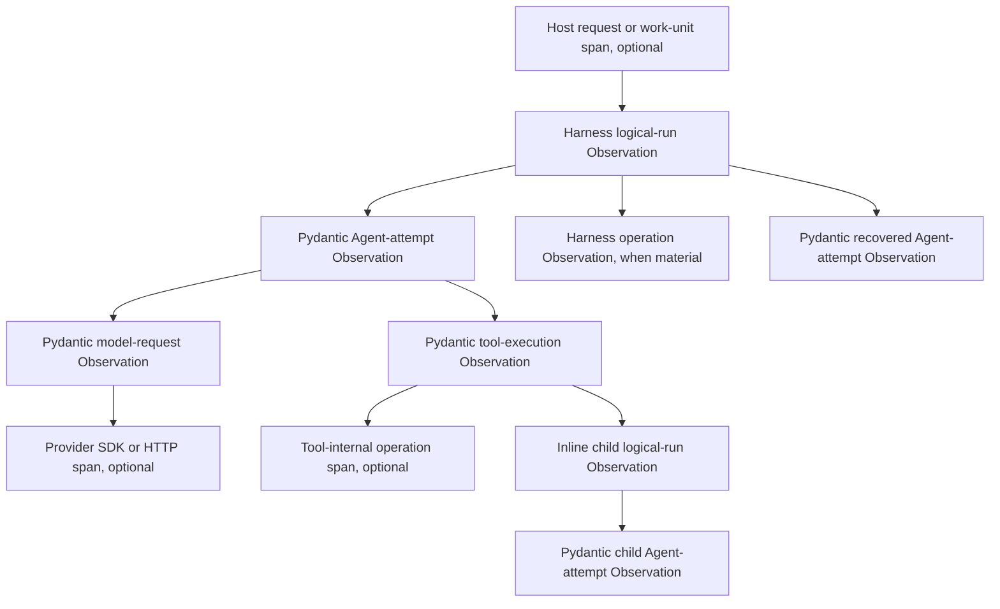

# Harness Observation Model

## Design Position

Harness Observation is the process-local OpenTelemetry trace and metric projection of one logical Harness Run and its causal descendants. The Host owns the OpenTelemetry SDK, resource, sampling, readers/processors, exporters, propagation, flush, and shutdown. The Harness remains inert unless bounded Harness environment policy selects a signal from Host-configured global providers or the Host supplies at least one explicit instrumentation provider.

Pydantic AI instrumentation is the sole owner of Agent-attempt, model-request, tool-execution, native usage, streaming, and cancellation spans and its native model metrics. The Harness owns one outer logical-run span, optional child spans for independently meaningful Harness operations, and a small low-cardinality metric registry. Langfuse v4 and Logfire are optional Host profiles over the same providers and telemetry hierarchy, not separate Harness pipelines.

An Observation is never execution, continuation, side-effect, result, checkpoint, event-delivery, usage-settlement, billing, or authorization authority. [Events and Usage](12-events-observability-and-usage.md) owns the ordered event stream, usage attribution, reporting, and accounting boundary; this document owns only telemetry Observation semantics.

## Boundaries

| Concern                                                                                                     | Owner                         | Contract                                                                                                               |
| ----------------------------------------------------------------------------------------------------------- | ----------------------------- | ---------------------------------------------------------------------------------------------------------------------- |
| OpenTelemetry SDK, `Resource`, sampler, readers/processors, exporters, batching, retry, flush, and shutdown | Host                          | The Harness receives explicit providers or selects Host-configured globals and configures no process-global telemetry. |
| logical Harness Run                                                                                         | Harness                       | One outer span and low-cardinality metrics cover the complete process-local lifecycle when their signals are enabled.  |
| Agent attempt, model request, tool execution, native usage, streaming, and cancellation                     | Pydantic AI                   | One Harness-selected `Instrumentation` Capability owns enabled native spans and model metrics.                         |
| Provider SDK or HTTP request                                                                                | Provider or OTel instrumentor | Ordinary current-context propagation may create descendants; the Harness does not synthesize them.                     |
| Harness recovery, inline-delegation binding, handoff persistence, and compaction operations                 | Owning Harness component      | A child span exists whenever tracing is enabled; bounded operation metrics remain independently selectable.            |
| Process-local events and usage records                                                                      | Event and usage owners        | They remain independent observations and do not become spans or metrics automatically.                                 |
| Durable lifecycle, audit, delivery, accounting, and billing                                                 | Host                          | A telemetry backend never commits these facts.                                                                         |
| Vendor grouping, filtering, and enrichment                                                                  | Host profile                  | Existing telemetry is selected or enriched without replacing its owner or creating duplicates.                         |

A Harness component owns a span only when its operation remains independently meaningful after Pydantic model and tool execution are removed. Otherwise it enriches the current owning span or retains the existing event.

## Instrumentation Contract

`HarnessInstrumentation` and its content-policy enum are frozen process-local public values. The following Python-like schema is conceptual and is not a wire format:

```python
HARNESS_TRACE_LEVEL_ENV = "A13N_HARNESS_TRACE_LEVEL"
HARNESS_TRACE_CONTENT_ENV = "A13N_HARNESS_TRACE_CONTENT"
HARNESS_METRICS_ENV = "A13N_HARNESS_METRICS"


class HarnessTraceContent(StrEnum):
    NONE = "none"
    STANDARD = "standard"
    FULL = "full"


@dataclass(frozen=True, slots=True)
class HarnessInstrumentation:
    tracer_provider: TracerProvider | None = None
    meter_provider: MeterProvider | None = None
    trace_content: HarnessTraceContent = HarnessTraceContent.STANDARD
```

The Host may supply this value to `HarnessBuilder`; the builder applies it consistently to the root executable and every recursively built child. At least one provider must be present. A missing tracer provider disables Harness-selected traces, and a missing meter provider disables both Harness and Pydantic metrics. Explicit `None` disables all Harness Observation regardless of environment. The default builder selection resolves the bounded Harness environment convention once and obtains the corresponding Host-configured global providers. Disabled Pydantic signals preserve execution, event, usage, state, cancellation, result, and cleanup behavior and receive explicit no-op providers rather than falling back to unrelated globals.

A supplied tracer provider always enables the complete Harness-selected structural trace: `harness.run`, native Pydantic Agent/model/tool spans, and material `harness.operation` spans. Trace content defaults to `standard`. When tracing is disabled, the content value is a dormant policy and does not make metrics-only instrumentation invalid. The content policies map to supported Pydantic settings as follows:

| Trace content | `include_content` | `include_binary_content` | `include_model_request_parameters` | Meaning                                                                                                              |
| ------------- | ----------------- | ------------------------ | ---------------------------------- | -------------------------------------------------------------------------------------------------------------------- |
| `none`        | `False`           | `False`                  | `False`                            | Do not opt into normal prompt, output, tool payload, binary, or serialized request-parameter data.                   |
| `standard`    | `True`            | `False`                  | `False`                            | Enable ordinary upstream content capture while leaving the dedicated binary and request-parameter switches disabled. |
| `full`        | `True`            | `True`                   | `True`                             | Opt into every upstream content switch; this is the highest-exposure profile.                                        |

These switches control Pydantic-owned capture only and never broaden the Harness-owned span or metric registries.

`HarnessInstrumentation` contains no exporter, endpoint, credential, API key, resource builder, sampler, processor, reader, batch setting, retry policy, timeout, flush, shutdown, vendor SDK type, arbitrary telemetry name, or unrestricted metadata map.

### Structural Tracing

Structural tracing has only two states:

| State    | Harness-selected spans                                                                                                                          |
| -------- | ----------------------------------------------------------------------------------------------------------------------------------------------- |
| disabled | No Harness or Pydantic spans are selected. Metrics composition uses an explicit no-op tracer provider when metrics remain enabled.              |
| enabled  | `harness.run`, native Pydantic Agent-attempt/model-request/tool-execution/streaming/cancellation spans, and material `harness.operation` spans. |

Provider presence expresses this state in the explicit Python API: no tracer provider means disabled, while a tracer provider means enabled. The environment convention names the enabled state `verbose` to make its complete structural detail explicit. There is no summary or intermediate structural mode.

Enabled tracing with `trace_content=none` remains structurally complete but does not opt into normal prompt, output, tool payload, binary, or request-parameter capture. Content settings never create or remove structural spans.

Provider SDK, HTTP, database, Environment, and other independently instrumented spans remain owned by their instrumentors. They can follow any active Host context independently of Harness selection. The Harness cannot suppress unrelated instrumentation attached to the shared process provider.

### Independent Signals

Trace and metrics are independently selectable:

| Tracer provider | Meter provider | Effective signals                                                         |
| --------------- | -------------- | ------------------------------------------------------------------------- |
| absent          | absent         | Invalid value; use `instrumentation=None` for fully disabled Observation. |
| present         | absent         | Trace only. Pydantic receives an explicit no-op meter provider.           |
| absent          | present        | Metrics only. Pydantic receives an explicit no-op tracer provider.        |
| present         | present        | Complete structural traces plus Harness and Pydantic metrics.             |

Metrics-only instrumentation gives Pydantic instrumentation an explicit no-op tracer together with the real meter provider. Trace-only instrumentation similarly supplies an explicit no-op meter. These no-op providers are required because omitted Pydantic provider arguments otherwise fall back to process-global providers.

### Host Environment Convention

`HarnessBuilder` defaults to environment selection. It resolves this stable convention once during builder construction and obtains the selected global providers already configured by the executable Host:

| Variable                     | Values                     | Default    | Mapping                                                                                            |
| ---------------------------- | -------------------------- | ---------- | -------------------------------------------------------------------------------------------------- |
| `A13N_HARNESS_TRACE_LEVEL`   | `off`, `verbose`           | `off`      | `off` withholds the tracer provider; `verbose` selects the Host-configured global tracer provider. |
| `A13N_HARNESS_TRACE_CONTENT` | `none`, `standard`, `full` | `standard` | Selects the Pydantic content policy; it remains dormant while tracing is off.                      |
| `A13N_HARNESS_METRICS`       | `off`, `standard`          | `off`      | `off` withholds the meter provider; `standard` selects the Host-configured global meter provider.  |

Unknown values fail before Agent construction. Both signals `off` resolve to disabled Observation even though content defaults to the dormant `standard` policy. Explicit `HarnessInstrumentation` wins over environment-derived values, and explicit `instrumentation=None` disables Observation regardless of environment.

The Harness does not construct or register an SDK provider, processor, reader, exporter, or collector client. The official OpenTelemetry Python distro and OTLP exporters may configure global providers before application startup. Standard `OTEL_*` variables own exporters, common or signal-specific collector endpoints, protocols, headers, TLS, sampling, resources, batching, timeout, compression, and temporality; the `A13N_HARNESS_*` variables select only Harness signal/detail policy and do not duplicate OpenTelemetry SDK configuration.

This convention preserves an inert environment default without separate development and production profiles. A Host that explicitly supplies a tracer provider directly enables complete structural instrumentation and receives the `standard` content default.

### Single Owner

The Harness rejects any competing instrumentation path:

- Pydantic AI `Instrumentation` supplied through `AgentSpec`, `AgentDefinition`, a Harness plugin, or `RunBindings`;
- a build-time or run-time resolved `InstrumentedModel`;
- the same conflict in any recursively built child definition.

Build validation covers authored and plugin contributions. Run validation covers fresh run Capabilities, every Capability replacement returned by `for_run()`, and models unavailable until resolution; a run-resolved Capability cannot introduce or replace Pydantic instrumentation before its hooks execute. Trusted custom Models remain responsible for any internal telemetry they emit; such telemetry is not Harness-managed Observation.

When tracing or metrics is enabled, the Harness installs exactly one mandatory Pydantic AI `Instrumentation` Capability using the selected real and no-op providers, content policy, and conventions supported by the repository's selected Pydantic AI release. Harness-authored spans and metrics use the stable OpenTelemetry instrumentation scope name `a13n-harness`; Pydantic telemetry retains its upstream scope. The built Pydantic Agent does not consult ambient `Agent.instrument_all()` state. When either signal is disabled, no authored, resolved, ambient, or global-provider path becomes an uncontrolled fallback.

## Observation Hierarchy

The diagram shows the complete enabled structural trace. Disabled tracing omits all Harness-selected nodes. Independently instrumented provider and tool-internal nodes remain Host-selected.



Pydantic model-request and tool-execution spans remain descendants of their Pydantic Agent-attempt span. Provider and tool-internal instrumentation follows ordinary active-context parentage. The Harness does not create synonym model, generation, provider, tool, usage, streaming, or cancellation spans.

### Logical-Run Observation

The logical-run Observation uses the stable span name `harness.run`. It starts after allocation of the public Harness `run_id` and before Environment entry and run preparation. It remains open across:

- Environment entry and portable-state restore;
- Environment run-extension entry and runtime activation;
- input preparation and semantic normalization;
- run-plugin binding and outer middleware;
- zero or more sequential `ModelAttempt` values;
- semantic recovery and cancellation-aware backoff;
- result and usage finalization;
- plugin unwind, Environment teardown, and remaining cleanup;
- terminal result construction before publication to the stream consumer.

A plugin short-circuit still has one logical-run Observation even when no Pydantic Agent attempt starts. After successful cleanup, the span ends at the terminal publication boundary immediately before the result event is yielded. On unhandled or cleanup failure, it ends after safe failure classification. It does not end at the first model response or before plugin and Environment cleanup.

The span is current during all causal run execution, including Harness, Pydantic, provider, tool, Environment, and inline-child work. The Harness detaches its context before every public stream yield, including non-terminal events, and restores it only when iteration resumes. The span remains open while the single consumer applies backpressure because the logical Run and its resources remain active, so that wait contributes to end-to-end span duration without making Host consumer work a descendant.

### Harness Operation Observations

When tracing is enabled, a focused Harness child span uses the stable name `harness.operation` and one bounded `a13n.operation.kind`. The initial kinds are `recovery`, `delegation`, `handoff`, and `compaction`. Delegation covers only the independently authorized child-binding phase; the nested child `harness.run` remains the execution owner.

Model-context projection, routine state export, plugin binding validation, Capability hooks, events, and instantaneous lifecycle boundaries do not justify spans or operation-duration measurements by themselves. Existing events remain events. Disabled tracing omits the child spans without omitting the corresponding execution. A new operation kind is an observable compatibility addition and requires one documented semantic owner.

## Trace and Correlation Model

A Thread is not an OpenTelemetry trace. A Thread can continue across processes and many logical Runs, while a trace is one bounded causal execution graph.

- If the Host supplies a valid current span, the logical-run Observation is its child.
- Without a Host parent, the logical-run Observation starts a new trace.
- Resume normally starts a new trace while preserving Thread correlation.
- The Harness never keeps one trace open for the lifetime of a Thread.
- A string trace-ID attribute does not replace W3C Trace Context or an OpenTelemetry span link.

### Host-Owned Current Parent

The Harness accepts an optional Host trace parent only through the standard current OpenTelemetry context. It does not accept a live span, Langfuse observation, Logfire span, trace ID, or vendor context object as a Harness argument. When the Host establishes one current parent before entering the Harness stream, `harness.run` becomes its child and selected Pydantic spans become descendants through the same current context. Without a current parent, `harness.run` is the OpenTelemetry root and its fresh `HarnessObservationContext` can carry the bounded name, product-session correlation, labels, and metadata needed by a Host profile; an otherwise redundant outer span is not required.

The Host may create that parent with the OpenTelemetry API or with one OpenTelemetry-native vendor SDK. A vendor-created parent conforms only when it is current for the complete Harness entry and uses the same tracer provider/export path selected for Harness traces. Exactly one component owns the parent span. Combining backends adds processors/exporters to the same hierarchy and does not wrap one Harness invocation in parallel Langfuse and Logfire roots.

For an incoming distributed request, the Host validates and extracts W3C Trace Context under its trust and sampling policy, then starts or activates the Host-owned current span. The Harness never treats an arbitrary incoming trace ID as an accepted parent. Context detachment at public stream yields applies only to the Harness-owned current context; the Host's outer span remains under Host lifecycle control.

### Inline Children

A blocking inline child logical Run remains inside the active trace and receives one nested logical-run Observation with its own Pydantic descendants. Its parent is normally the Pydantic delegation tool-execution span. The Harness does not force reparenting, and the same inline invocation does not also receive a sibling dispatch span.

### Host-Managed Asynchronous Children

The Host never persists or transmits a live span object. For a bounded distributed continuation, it may propagate W3C Trace Context. For independently scheduled, durable, or long-lived work, it starts a new trace and links its dispatch context with an OpenTelemetry span link. A link is the default for durable asynchronous child work. Safe Host metadata may supplement but cannot replace propagation or the link.

## Attribute Model

### Resource Attributes

The Host places process and deployment facts on the OpenTelemetry `Resource`, including `service.name`, `service.version`, the applicable standard deployment-environment attribute, and any bounded deployment or instance facts it selects. The Harness does not repeat resource facts on each span.

### Harness Attribute Registry

| Attribute                       | Placement                                                   | Meaning                                                                           |
| ------------------------------- | ----------------------------------------------------------- | --------------------------------------------------------------------------------- |
| `a13n.thread.id`                | logical run and correlation-relevant Harness descendants    | Stable independently advancing history correlation from `HarnessState.thread_id`. |
| `a13n.run.id`                   | logical run and selected Harness descendants                | One process-local logical Harness Run.                                            |
| `a13n.agent.identity.issuer`    | logical run and Pydantic Agent-attempt enrichment           | Trusted `AgentIdentityRef.issuer`.                                                |
| `a13n.agent.identity.subject`   | logical run and Pydantic Agent-attempt enrichment           | Trusted `AgentIdentityRef.subject`.                                               |
| `a13n.agent.id`                 | logical run and Pydantic Agent-attempt enrichment           | Conventional `agent_id` identity claim, when present.                             |
| `a13n.user.id`                  | logical run and Pydantic Agent-attempt enrichment           | Conventional `user_id` identity claim, when present.                              |
| `a13n.agent.instance.id`        | logical run and Pydantic Agent-attempt enrichment           | Trusted compact Agent-instance correlation.                                       |
| `a13n.agent.parent_instance.id` | child logical run and Agent-attempt enrichment              | Parent Agent-instance correlation, when present.                                  |
| `a13n.delegation.id`            | logical run and Pydantic Agent-attempt enrichment           | Trusted inline-delegation correlation, when present.                              |
| `a13n.actor`                    | logical run and Pydantic Agent-attempt enrichment           | Trusted Host-selected execution actor, when present.                              |
| `a13n.model_attempt.index`      | Pydantic Agent-attempt enrichment                           | Zero-based bounded attempt ordinal.                                               |
| `a13n.observation.name`         | logical run, when supplied                                  | Host-selected stable work-unit display and grouping name.                         |
| `a13n.observation.session.id`   | logical run, when supplied                                  | Host-selected product-session correlation.                                        |
| `a13n.observation.labels`       | logical run, when supplied                                  | Bounded Host-selected filtering labels.                                           |
| `a13n.observation.metadata.*`   | logical run, when supplied                                  | Bounded scalar Host metadata under validated keys.                                |
| `a13n.capability.id`            | Harness operation span, when one Capability owns it         | Stable Capability correlation.                                                    |
| `a13n.operation.id`             | Harness operation span, when the subsystem already owns one | Existing concise operation correlation.                                           |
| `a13n.operation.kind`           | Harness operation span                                      | Bounded operation category from this contract.                                    |
| `a13n.run.outcome`              | logical run after terminal classification                   | `completed`, `suspended`, `failed`, or `cancelled`.                               |
| `a13n.run.failure.code`         | failed logical run, when present                            | Existing bounded Harness failure code.                                            |

These identifiers grant no authority, durability, provider access, or lifecycle truth. Only the conventional `agent_id` and `user_id` claims are projected from `AgentIdentityRef.claims`; arbitrary claims and `AgentInstanceContext.host_refs` are never flattened into telemetry. Each projected identity or lineage value must contain no NUL, be UTF-8 encodable, and encode to at most 1024 bytes. An unsafe or over-limit value is omitted rather than truncated, so Observation cannot create a false correlation collision or change execution. The Harness never projects arbitrary `RunBindings.metadata`, credentials, grants, provider-native state, prompt-cache selectors, opaque handles, native paths, raw URLs, content, or unbounded values into `a13n.*` attributes.

`HarnessObservationContext` is a separate fresh run input rather than an alias for `RunBindings.metadata`. Its optional name and session ID are non-empty UTF-8 strings of at most 256 bytes. It accepts at most 16 unique non-empty labels of at most 64 UTF-8 bytes and at most 16 metadata entries. Metadata keys match `[a-z][a-z0-9_.-]*` and contain at most 64 characters; values are finite OpenTelemetry scalar strings, booleans, signed 64-bit integers, or finite floats, and strings contain no NUL and encode to at most 256 bytes. Invalid context fails before execution. The logical-run span alone receives this vendor-neutral projection; the context is not continuation state, model context, event data, usage, or authority.

### Pydantic AI Fields

Pydantic AI owns its `gen_ai.*` model, provider, Agent, conversation, tool, request, response, and usage fields together with its `logfire.msg` and `logfire.json_schema` display hints. The Harness does not copy them into `a13n.*` synonyms.

Each `ModelAttempt` supplies:

- the unique model-attempt ID as Pydantic AI `run_id`;
- the stable `AgentContext.thread_id` as Pydantic AI `conversation_id`.

Pydantic's native Agent call field carries the supplied model-attempt ID. The Harness enriches the active Pydantic Agent-attempt span only with the bounded attempt index and trusted identity and lineage values in this registry. It does not add an `a13n.*` synonym for the attempt ID or recreate model, tool, message, usage, or exception fields. Pydantic `conversation_id` is telemetry correlation only; the provider model-session and prompt-cache affinity contract remains owned by [Thread Affinity](16-input-model-and-output.md#thread-affinity).

Pydantic's model-request span remains the sole span owner for per-request token and cost data. Its native response projection owns `gen_ai.usage.input_tokens`, `gen_ai.usage.output_tokens`, first-class cache counters, bounded `gen_ai.usage.details.*` counters including audio and reasoning categories, and provider or `genai-prices` cost fields. The Usage Capability applies a selected Harness model-cost quote inside the active Pydantic model-request wrapper before native response finalization. When a response has a cost, it adds `gen_ai.usage.cost` for documented GenAI backend mapping and the following bounded provenance fields to that same span:

| Attribute                     | Meaning                                                        |
| ----------------------------- | -------------------------------------------------------------- |
| `a13n.usage.cost.source`      | `catalog`, `custom`, `provider_or_genai_prices`, or `unknown`. |
| `a13n.usage.pricing.status`   | `applied`, `declined`, `failed`, `disabled`, or `not_reached`. |
| `a13n.usage.pricing.revision` | Selected bounded pricing revision, when one was reached.       |
| `a13n.usage.pricing.rule.id`  | Selected bounded pricing rule, when one quote was applied.     |

This enrichment is gated by an explicit process-local marker established inside the Harness-selected Pydantic model-request wrapper and matched to that exact current span. Disabled Observation and metrics-only instrumentation through a no-op tracer have no eligible recording model span and receive no cost or pricing attributes on a Host root or another current span. The marker grants no authority and is cleared when the wrapper exits.

This enrichment creates no model, generation, usage, or metric duplicate. It does not copy the usage ledger, create token synonyms, calculate provider usage receipts, or make the span an accounting authority. `gen_ai.usage.cost` is a numeric USD projection because the Harness model-cost contract quotes USD; currency and full component attribution remain in the authoritative usage model rather than being inferred from this span.

## Outcome and Failure Projection

The logical-run Observation records terminal meaning through `a13n.run.outcome`, including propagated external cancellation that produces no Harness result.

| Outcome                      | OTel status | Additional projection                                                                             |
| ---------------------------- | ----------- | ------------------------------------------------------------------------------------------------- |
| `completed`                  | `UNSET`     | No error is implied.                                                                              |
| `suspended`                  | `UNSET`     | Native deferred or approval suspension is not an Observation failure.                             |
| handled `cancelled`          | `UNSET`     | Cancellation is explicit terminal control, not automatically an error.                            |
| external task cancellation   | `UNSET`     | Set `a13n.run.outcome=cancelled`; this does not imply a returned result or terminal result event. |
| `failed`                     | `ERROR`     | Optional bounded `a13n.run.failure.code`.                                                         |
| unhandled or cleanup failure | `ERROR`     | Stable safe Harness classification only.                                                          |

If cleanup fails while external cancellation is primary, `a13n.run.outcome` remains `cancelled` and the span status is `ERROR` to record cleanup failure; cancellation still propagates and no terminal result event is emitted. Harness-owned span status descriptions and events contain no raw exception message, provider response body, input, output, credential, or path. Harness-owned code does not record raw exception objects on its spans. This safe projection does not alter independently owned Pydantic exception events.

## Events and Usage Boundary

`HarnessEvent`, Pydantic public events, usage records, and OTel spans are independent projections:

- the event stream owns ordered process-local semantic observations;
- Pydantic `RunUsage` remains the sole process-local model-usage accumulator;
- the Harness usage ledger preserves mixed-source attribution without becoming another accumulator;
- Observation supplies timing, hierarchy, correlation, and low-cardinality operational aggregates only.

Instrumentation cannot change event ordering, state, usage, recovery, cancellation, result, or cleanup. Events already delivered by an earlier model attempt remain visible even when a later attempt succeeds. A telemetry backend does not become a replay log, usage ledger, billing source, or completion authority.

## Metric Model

A supplied meter provider enables one standard metric set. Harness metrics use the `a13n-harness` instrumentation scope and low-cardinality attributes only:

| Instrument                        | Type          | Unit        | Measurement and allowed attributes                                                                  |
| --------------------------------- | ------------- | ----------- | --------------------------------------------------------------------------------------------------- |
| `a13n.harness.run.duration`       | Histogram     | `s`         | One complete logical-run duration with only `a13n.run.outcome`.                                     |
| `a13n.harness.run.active`         | UpDownCounter | `{run}`     | Increment after the run becomes active and decrement exactly once after cleanup; no run attributes. |
| `a13n.harness.run.model_attempts` | Histogram     | `{attempt}` | Final number of model attempts with only `a13n.run.outcome`.                                        |
| `a13n.harness.operation.duration` | Histogram     | `s`         | Independently meaningful Harness operation duration with only `a13n.operation.kind`.                |

Metric recording is independent from tracing. Run duration and the active-run interval use the same start and end boundaries as the logical-run span: after public `run_id` allocation and before Environment entry through cleanup and terminal classification. Metrics-only instrumentation still records material Harness operation durations without creating operation spans. External cancellation records terminal duration and attempt count after cleanup before cancellation propagates. An operation that never starts records nothing; an active-run increment has exactly one matching decrement even when execution fails or is cancelled.

Thread, Run, Agent-instance, model-attempt, Capability, operation, tool-call, request, and response IDs are prohibited metric attributes. Failure codes, Agent names, prompt, output, tool content, paths, URLs, exception text, metadata, and arbitrary Host values are also prohibited. Only the closed run outcome and operation-kind sets owned by this document are metric dimensions in the initial registry.

Pydantic AI independently owns the selected release's native token-usage, operation-cost, and time-to-first-chunk instruments, currently `gen_ai.client.token.usage`, `operation.cost`, and `gen_ai.client.operation.time_to_first_chunk`, together with their model/provider/operation attributes. The Host treats those upstream dimensions as telemetry-visible. The Harness passes the real meter provider to that one instrumentation owner but does not recreate, rename, aggregate, or treat those instruments as Harness accounting authority.

## Content and Information Boundary

### Harness-Owned Observations

Harness-owned span names, attributes, status descriptions, and span events are content-safe by default. They contain only the bounded registry and safe classifications defined here. They exclude:

- prompts, model output, tool arguments, and tool results;
- binary, document, and file content;
- native paths, provider state, opaque handles, and raw URLs;
- credentials, grants, authorization values, raw headers, and provider response bodies;
- arbitrary Agent metadata, `RunBindings.metadata`, raw exceptions, and stack traces.

Enabling Pydantic content capture does not expand this Harness-owned registry.

### Upstream Pydantic Fields

With `trace_content=none`, the supported Pydantic AI instrumentation omits normal prompt text, model text, tool arguments/results, binary content, and serialized model request parameters from its normal success-path projection. It can still emit structural and diagnostic values including:

- Agent descriptions;
- serialized Agent or run metadata;
- tool definitions, descriptions, parameter schemas, and defaults;
- exception messages and stack traces on failed Agent and tool spans.

`none` therefore means "do not opt into ordinary execution payloads," not "every upstream field is guaranteed secret-free." For example, a tool parameter-schema default containing a real token or an exception message containing a provider response can still appear on an enabled Pydantic span. The Harness can strictly control fields it authors, but supported Pydantic APIs do not let it suppress every field Pydantic authors. The Harness does not monkey-patch Pydantic AI, mutate private OpenTelemetry span state, or present backend masking as a portable OpenTelemetry guarantee.

Enabled tracing exposes this Pydantic field surface; independently instrumented provider or tool spans retain their own Host-governed boundary. Before enabling tracing, the Host must ensure definition and failure values are safe for export, apply a tested sanitization policy in its trusted processor or collector path before data crosses the telemetry trust boundary, or keep the affected trace source out of that export target. `standard` and `full` content are additional exposure decisions. `standard` leaves Pydantic's dedicated binary switch disabled but is not a binary-redaction guarantee: binary values nested inside serialized custom models or dataclasses can remain visible through upstream content serialization. Vendor masking and scrubbing remain defense in depth, not authority to export unapproved data.

## Host Profiles

### Generic OpenTelemetry

The generic profile uses ordinary Host-owned OpenTelemetry SDK providers, readers, and processors. The Host passes the exact independently selected tracer and meter providers to `HarnessInstrumentation`, owns W3C context extraction and injection at transport boundaries, and flushes at bounded worker shutdown rather than after every Run.

An enabled trace exporter retains `a13n-harness` logical-run and material-operation spans together with the supported Pydantic GenAI descendants. The Host separately decides whether provider, HTTP, database, and other scopes enter that exporter. Metrics use the independently supplied meter provider and are not selected by a trace predicate.

The Harness never calls `set_tracer_provider()` or `set_meter_provider()`, selects an OTLP endpoint, creates an exporter or metric reader, reads telemetry credentials, or owns provider lifecycle.

### Langfuse v4

Langfuse v4 is the primary optional vendor profile. The Host initializes the OTel-native Langfuse SDK against the same `TracerProvider` supplied to the Harness. Its export predicate retains every `a13n-harness` span together with spans accepted by Langfuse's documented default GenAI predicate.

A Host-owned outer span that is intended to appear in Langfuse is retained through the default Langfuse predicate or an explicit predicate for its instrumentation scope. The Host composes any separately approved provider or transport scopes explicitly. It does not replace the default predicate with a Harness-only scope filter because that would drop Pydantic descendants.

For a Langfuse-first Host, `start_as_current_observation()` may own the outer Host span because it establishes the active OpenTelemetry context. The Langfuse client uses the same tracer provider supplied for Harness traces; `harness.run` and its selected Pydantic descendants then inherit that current observation. The Host does not pass the Langfuse observation object into the Harness.

The Host may use Langfuse's documented propagation context or an allowlisted SpanProcessor to map the root `HarnessObservationContext` and copy approved trace fields to every descendant span. The v4 OTLP profile maps only these documented fields: `langfuse.trace.name`, `langfuse.user.id`, `langfuse.session.id`, `langfuse.trace.tags`, `langfuse.trace.metadata.*`, `langfuse.version`, `langfuse.release`, and `langfuse.environment`. The Host may source `langfuse.user.id` from the conventional trusted `user_id` claim and maps observation context name, session, labels, and metadata to their corresponding trace fields, but it does not reinterpret issuer/subject, arbitrary claims, or `RunBindings.metadata`. Because Langfuse defines each flattened `langfuse.trace.metadata.*` OTLP attribute as a string, the profile deterministically string-encodes non-string Harness scalar metadata while retaining the original scalar type on `a13n.observation.metadata.*`. Release selection follows the selected Langfuse version's documented propagation or process configuration. Enrichment updates existing spans and never creates duplicate Harness, model, or tool observations.

`langfuse.session.id` is product-level observability grouping. A Host may intentionally map it from the Harness Thread or a broader product conversation, but that mapping is explicit profile policy. It never changes the State-owned Thread, Pydantic conversation correlation, provider model session, or prompt-cache affinity.

Langfuse v4 derives trace input and output from the root observation. A Host that intentionally needs trace-level input/output creates a meaningful bounded Host root and uses `langfuse.observation.input` and `langfuse.observation.output` JSON strings; it does not use deprecated trace input/output attributes or dump all bindings, state, events, or usage records. When `harness.run` is the root, the trace remains content-safe and carries only the bounded observation context, not prompt or output. Pydantic-owned model and tool input/output follow `HarnessTraceContent`; internal compaction, multimodal-understanding, and inline-child executions retain their ordinary causal parentage and do not receive duplicate Host observations solely to improve vendor presentation.

Pydantic model requests use Langfuse's supported GenAI generation mapping. Rich `agent` or `tool` presentation for externally created spans is used only through documented public mapping supported by the selected Langfuse SDK. When that mapping is unavailable, the existing span remains a generic Langfuse span; the Host does not add a duplicate SDK-created observation or private wrapper.

Pydantic usage uses inclusive parent/child buckets: input includes cache and input-audio tokens, output includes output-audio tokens, and provider reasoning counters may also overlap output. Langfuse v4 currently splits first-class cache counters correctly but treats arbitrary `gen_ai.usage.details.*` values as additive when deriving its displayed `usageDetails.total`. Consequently, a Langfuse total that includes audio or reasoning detail can exceed Pydantic `input_tokens + output_tokens`. The profile preserves the documented detail fields for inspection but does not claim that backend-derived total as Harness usage or accounting truth. A future profile normalization must use public processor/exporter APIs and must not mutate Pydantic's vendor-neutral owner fields globally.

### Logfire

Logfire is an optional parallel Host profile. The Host calls `logfire.configure()`, retrieves the exact tracer and meter providers it established through public OpenTelemetry access, and supplies either or both provider objects according to the selected signals. A Logfire-first Host may own the outer current span with `logfire.span()`; Harness and Pydantic spans inherit it through OpenTelemetry context. The Host does not pass a Logfire span object into the Harness and does not also enable `logfire.instrument_pydantic_ai()`, because the Harness-selected Pydantic `Instrumentation` remains the single owner.

Pydantic-owned `logfire.msg` and `logfire.json_schema` fields remain unchanged. A Logfire profile may map the root observation name to `logfire.msg` and labels to `logfire.tags` without setting `logfire.span_type`; absence already denotes a normal span. It relies on OpenTelemetry `ERROR` status for Logfire's error-level inference and does not synthesize `logfire.level_num` or `logfire.metrics`, which the selected Logfire provider owns. Host-side filtering through supported Logfire/OpenTelemetry configuration does not disable the selected meter provider. The Harness defines no Logfire-specific telemetry API and does not require Logfire in its base package.

When Logfire and Langfuse are both enabled, both attach to one tracer provider through separate processors and exactly one Host root owner is selected. If that root is not created by the Langfuse SDK, the Langfuse predicate also retains its instrumentation scope so the exported hierarchy does not lose its parent. Logfire is not a transport to Langfuse, and Langfuse is not a transport to Logfire. Sampling, scrubbing, console presentation, vendor tags, processor order, and provider shutdown remain Host configuration.

## Sampling, Export, and Lifecycle Failure

Sampling belongs to the Host provider. Parent-based sampling is the baseline because it keeps one causal subtree consistent; tail sampling is an explicit deployment decision.

Observation is best effort when the Host supplies a conforming provider stack whose telemetry callbacks do not raise into instrumented application code. The Harness guards its own span creation, enrichment, and finalization so failures at those Harness-owned boundaries cannot replace the Agent outcome, become a Harness terminal result, or change cleanup. Pydantic AI invokes the same Host provider through its public instrumentation path; a provider, processor, or exporter that raises through that path violates the Host profile contract and is treated as trusted Host composition failure rather than an Agent or exporter outcome.

Batching, queue pressure, metric temporality, retry, timeouts, exporter isolation, flush, and shutdown remain Host concerns. Compatibility tests inject failure at Harness- and Pydantic-owned trace and metric boundaries for each supported Host profile. A Host that requires fail-closed audit delivery implements a separate durable audit facility rather than changing telemetry export into Harness lifecycle authority.

## Compatibility

The Harness Observation contract has four independently reviewed compatibility axes:

| Axis               | Compatibility requirement                                                                                                                                            |
| ------------------ | -------------------------------------------------------------------------------------------------------------------------------------------------------------------- |
| Harness public API | `HarnessInstrumentation`, trace content, metric instruments, stable `a13n.*` meanings, ownership, and trace boundaries evolve under Harness compatibility rules.     |
| Pydantic AI        | A selected release change revalidates convention version, hierarchy, fields, content switches, native metrics, exception behavior, and ambient-provider suppression. |
| OpenTelemetry      | The Harness consumes public tracer/meter provider, context, span, metric, attribute, and link APIs and does not depend on private SDK mutation.                      |
| Vendor profiles    | Each selected Langfuse or Logfire version is validated against its documented providers, filters, propagation, fields, metrics, and shutdown behavior.               |

Additive bounded span attributes, metric attributes, or operation kinds are compatible only when they do not change ownership, materially increase metric cardinality, or expose previously excluded content. Removing or renaming a metric instrument, changing its unit or measurement point, duplicating upstream telemetry, changing a correlation identity's meaning, weakening the information boundary, or making telemetry affect execution is breaking.

## Trade-offs

### Native Pydantic Spans vs. Harness Wrappers

Native Pydantic instrumentation preserves model, tool, usage, streaming, and cancellation detail with one owner. The Harness accepts upstream field and version compatibility work instead of maintaining duplicate wrappers and semantic conventions.

### Host-Owned SDK vs. Turnkey Export

Host ownership supports generic OTLP, Langfuse, Logfire, self-hosted deployments, and process-specific sampling without vendor dependencies in the Harness. Embedded callers must configure provider lifecycle explicitly.

### Honest Upstream Boundary vs. Unsupported Sanitization

The Harness guarantees bounded content-safe fields only for observations it authors. It accepts that Hosts must govern upstream Pydantic structural and exception fields rather than using fragile monkey patches or claiming backend-specific masking as a universal guarantee.

### Bounded Traces vs. Thread-Lifetime Traces

One bounded execution trace supports independent sampling, process recovery, and durable scheduling. Queries that span resumed Runs join on Thread and Host correlation instead of relying on one unbounded trace.

## Invariants

01. Observation is disabled unless environment policy selects a Host-configured global provider or the Host supplies `HarnessInstrumentation` with at least one explicit provider.
02. The Host owns the OpenTelemetry SDK, resource, sampling, readers/processors, exporters, propagation, flush, and shutdown.
03. Traces and metrics are independently selectable, and every disabled Pydantic signal receives an explicit no-op provider rather than a global fallback.
04. Exactly one Pydantic instrumentation owner exists when native traces or metrics are selected; competing `Instrumentation`, `InstrumentedModel`, and ambient-global paths cannot bypass Harness policy.
05. One logical Harness Run has at most one `harness.run` span covering preparation through cleanup and terminal classification when tracing is enabled.
06. Tracing is either disabled or complete; any selected tracer provider creates the logical-run, Pydantic, and material Harness-operation hierarchy.
07. Trace content is independent from structural tracing, defaults to `standard`, and remains dormant while tracing is disabled.
08. Pydantic AI alone owns Agent-attempt, model-request, tool-execution, native usage, streaming, cancellation spans, and native model metrics.
09. Harness metric instruments and attributes are bounded, low-cardinality, content-free, and never duplicate Pydantic native metrics.
10. A Harness operation span or duration measurement represents independently meaningful Harness work and never duplicates an existing event or upstream operation.
11. A Thread is not a trace; resume normally starts a new trace while preserving `a13n.thread.id`.
12. Inline child work is nested once in the active trace; durable asynchronous work uses standard context propagation or a new trace with a span link.
13. `a13n.*` identifiers are bounded correlation values and never authority; identifiers are prohibited metric dimensions.
14. Only conventional `agent_id` and `user_id` claims are projected; arbitrary identity claims and Host references are excluded, and over-limit identity values are omitted without truncation.
15. Pydantic `run_id` receives the model-attempt ID, while Pydantic `conversation_id` receives the stable Harness Thread ID.
16. Pydantic model-request spans own native token fields; Harness pricing may enrich that same span with one numeric cost and bounded provenance but never creates usage synonyms or duplicate spans or metrics.
17. Harness-owned telemetry excludes content, credentials, provider state, paths, opaque handles, arbitrary metadata, and raw exceptions.
18. `trace_content=none` suppresses normal upstream payload capture but does not suppress all Pydantic structural and exception fields; enabled tracing requires Host validation or sanitization of those upstream surfaces.
19. A Host parent enters only as the current OpenTelemetry context; one generic OTel, Langfuse, or Logfire root owner may wrap the Harness, but vendor span objects never enter the Harness API.
20. Langfuse and Logfire profiles reuse one Host tracer provider and attach separate processors/exporters, so the same span hierarchy is written to both backends without a second Harness pipeline or root.
21. A conforming Host provider does not raise telemetry callback failures into application code; the Harness guards its own telemetry boundaries, while a throwing provider on Pydantic-owned boundaries is trusted Host composition failure rather than an Agent outcome.
22. The logical-run span is current during causal run execution and is detached before every public stream yield so Host consumer work cannot become its descendant.
