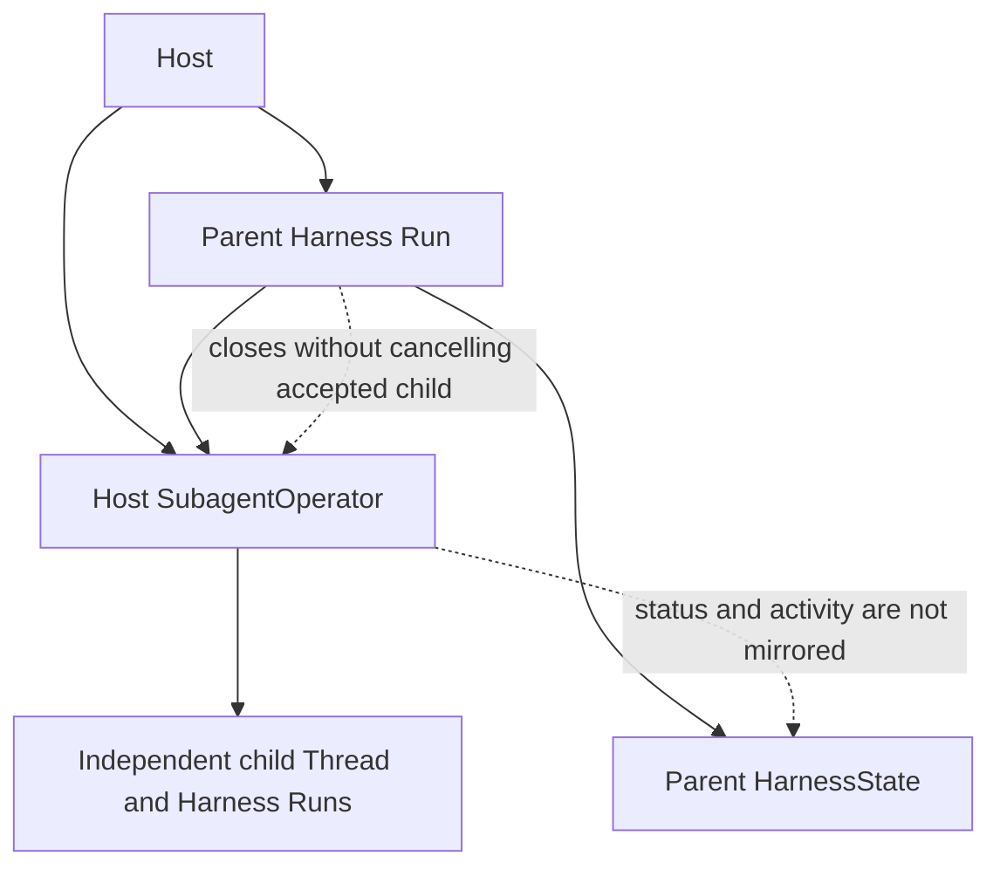
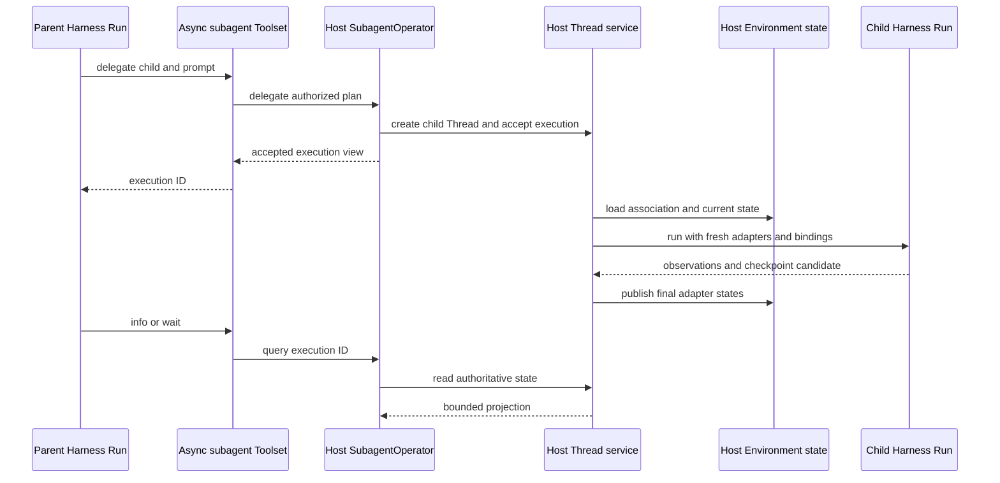

# Async Subagent Lifecycle

## Design Position

Asynchronous subagents are complete Host-owned child execution use cases behind `SubagentOperator`. Harness owns child resolution, immutable authorization plans, the standard model-facing Toolset, and bounded result validation. It owns no default async manager, execution registry, scheduler, child store, observer registry, wake mechanism, or shutdown operation.

This document owns the cross-Run lifecycle consequences of accepted async child work: admission, observation, parent closure, wake, restart, loss, retention, and Host shutdown. [Delegation and Subagents](11-delegation-and-subagents.md) owns child topology, exact operator operations, inline execution, and tool schemas. [Environment Integration](08-environment-integration.md#run-owned-shell-processes) separately owns Run-owned shell processes. The two features share no Manager, store, projection, observer registry, wake ledger, or shutdown framework.

Harness does not turn async children into a general Job, Session child, delivery ledger, or workflow engine. A Host can implement the operator with process-local tasks, durable child Threads, remote workers, or a workflow service without adapting its records to a Harness persistence protocol.

## Ownership

| Concern                                                                                 | Owner                                 |
| --------------------------------------------------------------------------------------- | ------------------------------------- |
| Authored immediate-child topology                                                       | Executable-owned `SubagentCollection` |
| Child resolution, identity and context ceilings, usage intersection                     | Harness                               |
| Standard async tool names, requests, and bounded results                                | `SubagentCapability`                  |
| Admission, scheduling, and recursive child execution                                    | Host `SubagentOperator`               |
| Child Thread identity, Environment association, and fresh Run authority                 | Host                                  |
| Checkpoints, status, bounded closed activity, steering, cancellation, and linked resume | Host operator                         |
| Wait, completion observation, wake, cleanup, loss, and retention                        | Host operator                         |
| Parent portable async projection                                                        | None                                  |
| Host durable delivery and terminal commit                                               | Host                                  |

An async `execution_id` is a bounded selector, not a credential. Child State, Environment state, Host-private record IDs, adapters, callbacks, storage clients, and credentials never enter model-facing results.

## Lifetime Topology

The Host chooses the operator lifetime. The operator can outlive one parent Run, one worker attempt, or one process when its own authority supports that scope. Harness never infers operator lifetime from an execution reference and never stores mutable current-Run authority in the reusable `SubagentCapability`.

## Admission and Execution

Async admission is one complete Host boundary:

1. Harness validates the model request and resolves one exact built child.
2. Harness constructs `SubagentDelegationPlan` with the derived child Identity, applied context, usage ceilings, and detached parent correlation, and separately forwards the originating tool-call correlation available from Pydantic AI.
3. The Host operator applies only narrower policy, optionally derives its own idempotency identity and replay scope, creates or resolves the child Thread, registers or persists the execution, and admits work according to its own acceptance guarantee.
4. The operator returns a validated `AsyncExecutionView` after acceptance.
5. Harness returns the public execution reference; execution continues under Host ownership.

An operator exception before its documented acceptance boundary is rejection. If a backend can accept work but lose the response, the Host preserves enough idempotency or correlation to reconcile that outcome and may use the supplied tool-call correlation. Harness does not assign an idempotency identity, automatically retry non-idempotent delegate or resume operations, or keep a compensating parent projection.

The Host independently selects child Environment association, loads current Host state, constructs fresh adapters and `RunBindings`, invokes Harness, stores observations, acknowledges checkpoints, and publishes Environment state. Accepted work never borrows the parent Run's entered Environment, mutable state coordinator, live context, credential, or callback.

Info and wait query current Host authority. Steering and cancellation return Host acknowledgements rather than invented completion. Resume resolves retained execution through the Host, requires resumability and the same stable roster name in the current parent collection, and then requests one linked continuation from the operator. The Host owns checkpoint-schema compatibility, current child authorization, and any separately authorized retained child-definition selection; Harness does not require equality with either the definition that produced the checkpoint or the current roster definition.

## Observation and Wake

The Host operator owns canonical child status, bounded closed activity, and completion observation. It records the ordered public items from each child `HarnessRunStream`; Harness imports no AG-UI or Host display type. It decides what to retain, how to compact it, and whether completion updates a product, enqueues input to an active parent Run, or starts a later Run for the parent Thread. Standard async views contain no raw child output field; final answer text appears as closed activity.

Harness async tools only query and validate bounded operator projections. Parent `HarnessState` contains no async execution mirror, completion receipt, observer, callback, wake fact, or delivery acknowledgement. Completion after parent closure never mutates an already exported continuation.

Wake is not execution authority. A durable Host persists accepted readiness through its normal input boundary before acknowledging delivery. A process-local Host can use a bounded pending queue when it makes no durability claim. In either case:

- duplicate completion observation does not create unbounded duplicate Runs;
- wake failure does not change child truth;
- explicit `subagent_info` and `wait_subagent` remain reconciliation paths;
- the Agent Stream Protocol transports events for a current Run but owns no child scheduling, retention, or idle wake.

## Parent Run Closure

Parent Run closure causes no ownership transfer:

- an inline child is already complete or is cancelled with the parent stack;
- an accepted async child remains owned by the Host operator;
- parent Environment closure does not close an independent child Environment;
- exported parent state includes inline continuation only and never async child state;
- Harness does not close the operator or invoke a global shutdown method.

The Host decides whether Session deletion, definition retirement, worker shutdown, operator replacement, or another owner boundary cancels child work. Scoped shutdown, draining, and cleanup use Host operations rather than a Harness Manager lifecycle.

## Restart, Fork, and Loss

Async restart, recovery, loss, and retention are Host-defined because parent state contains no mirror. A later parent Run queries a freshly supplied compatible operator using the retained public reference and restored parent Thread identity.

A Host never retargets a missing or expired execution reference to unrelated work. A parent Thread fork has a different `thread_id`; copied message text containing an execution reference grants no authority over source-Thread work. Operator replacement, record expiry, or unrecoverable worker loss returns a bounded unavailable, lost, or not-found result according to the Host contract.

## Independently Managed Child Thread

A durable Host can represent each accepted execution as a child Thread:

The Host owns acceptance, exact checkpoint selection, retries, wake, final state publication, steering, cancellation, linked continuation, loss, cleanup, and retention. The child is never an async `HarnessState` nested in the parent.

## Failure Semantics

| Condition                                     | Required outcome                                                  |
| --------------------------------------------- | ----------------------------------------------------------------- |
| Validation or authority rejection             | Tool fails before Host admission                                  |
| Acceptance response lost                      | Host-defined unknown outcome; Harness performs no automatic retry |
| Parent Run cancellation or closure            | Accepted child continues under Host policy                        |
| Observation or wake failure                   | Explicit info and wait remain authoritative                       |
| Checkpoint or final state publication failure | Host records failed, lost, or unknown according to its contract   |
| Missing retained record                       | Host returns bounded lost or not-found state without retargeting  |
| Host owner shutdown                           | Host performs scoped cancellation, draining, and cleanup          |
| Host process loss                             | Host performs its own recovery or marks the execution lost        |

## Invariants

1. Canonical async work belongs to its configured Host operator, never to the parent Run.
2. Harness provides no default async manager, execution store, observer registry, wake ledger, or shutdown lifecycle.
3. Async child status, bounded closed activity, and State are queried from Host authority and are not mirrored into parent `HarnessState`.
4. The operator receives an authorized detached plan and constructs fresh independent child authority and Environment adapters.
5. Parent closure never cancels accepted async work by implication and never closes its operator.
6. A later Run restores parent Thread identity but receives fresh bindings and operator authority.
7. Fork, restart, loss, and retention expiry never retarget a public execution reference.
8. Durable scheduling, checkpointing, delivery, wake, retries, cleanup, and retention remain Host responsibilities.
9. Background shell processes follow their independent Environment contract and share no async-subagent lifecycle infrastructure.
