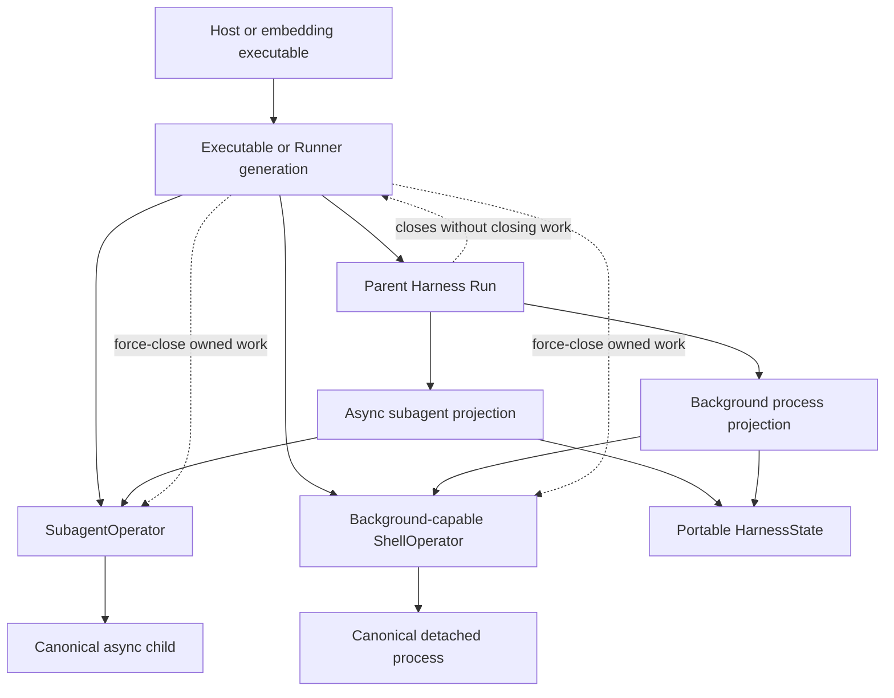
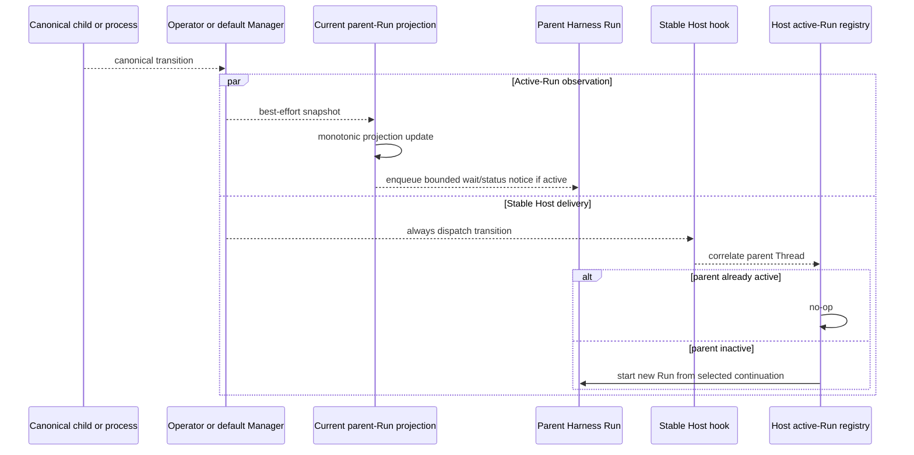
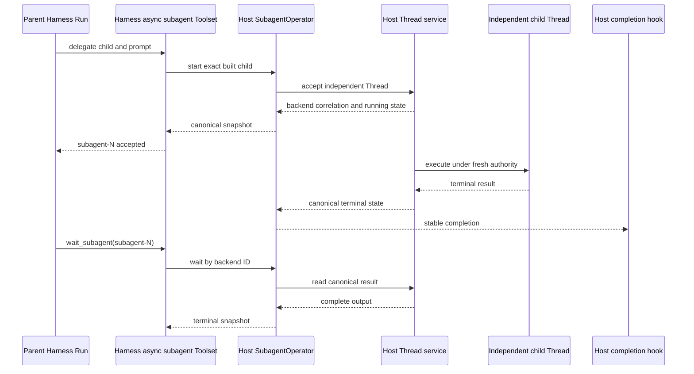

# Async Components and Lifecycle

## Design Position

Harness asynchronous components are process-local execution owners whose work can outlive the parent Harness Run that admitted it. The standard async-subagent and background-process Toolsets expose the same lifecycle shape: an operator owns canonical work, a parent Capability stores a compact portable projection, the active Run receives best-effort notices, and stable Host hooks remain available after that Run ends.

This document owns the shared lifecycle, observation, cleanup, loss, and Host-takeover contract. [Delegation and Subagents](11-delegation-and-subagents.md) owns child topology, subagent tools, `SubagentOperator`, and subagent projection schemas. [Environment Integration](08-environment-integration.md#command-and-background-process-operators) owns shell tools, `ShellOperator`, process operations, and process projection schemas. [Execution Context and Lifecycle](06-execution-context-and-lifecycle.md) owns the enclosing logical Harness Run.

The Harness does not turn either component into a durable Job, scheduler, delivery ledger, or workflow engine. A Host that needs durable or independently managed work supplies an operator that owns those semantics explicitly.

## Components and Boundaries

| Component                                                | Canonical owner                                           | Parent projection                                                                               | Default implementation                   |
| -------------------------------------------------------- | --------------------------------------------------------- | ----------------------------------------------------------------------------------------------- | ---------------------------------------- |
| Async subagent execution                                 | `SubagentOperator`                                        | `subagent-N`, backend ID, exact prompt, bounded status/failure/resumability/Thread observations | Process-local `SubagentManager`          |
| Detached background process                              | Background-capable `ShellOperator`                        | `process-N`, backend ID, output cursors, bounded status/input/output observations               | Process-local `ProcessManager`           |
| Current parent-Run observation                           | Capability projection bound to the current `AgentContext` | Mutable only until that Run exports state                                                       | Harness-owned Toolset integration        |
| Cross-Run completion notification                        | Stable operator hook plus Host correlation                | Never stored as a wake or delivery record                                                       | Host callback configured on the operator |
| Durable child, process, output, retry, or wake lifecycle | Custom Host, when required                                | Harness stores no durable authority                                                             | Not provided by the default Managers     |

The operator boundary owns canonical acceptance and execution. Compact IDs are model-facing selectors inside one parent Thread; opaque backend IDs correlate the projection with canonical operator state. Neither kind of ID grants authority by itself.

The parent projection is portable observation, not a replica of canonical work. It contains no task, stream, callback, process object, child `HarnessState`, authority scope, provider attachment, output buffer, storage client, or delivery state. Successful subagent output and retained process output remain with the operator until a standard wait or output tool reads them.

## Lifetime Topology

One embedding executable or Runner generation retains stable operator instances across all parent Runs that can address their work. A parent Run creates a fresh projection over those operators. Closing the Run detaches that projection but does not close accepted async work.

The default `SubagentManager` and `ProcessManager` retain canonical records only in their owning process. Their natural ownership scope is one stable executable or Runner generation. Constructing a new Manager for every parent Run would make accepted work unreachable as soon as that Run closed and therefore violates the lifecycle contract.

A custom operator can outlive a Runner generation when its own Host-owned authority and lookup remain valid. Harness does not infer that lifetime from an opaque backend ID; the Host must reconnect later Capability instances to the same operator authority explicitly.

The default Managers need no general `Host` object. `SubagentManager` receives one narrow `open_child` callback that returns a fresh child `RunBindings` scope. `ProcessManager` receives one narrow launcher that returns a self-contained `ManagedProcess`. The Host may use pinned definitions, provider state, credentials, and runtime collaborators while constructing those values, but after successful acceptance the Manager is their sole lifecycle owner. Construction must not retain or reuse the initiating parent Run's consumed bindings.

## Admission and Acceptance

Admission separates validation before acceptance from compensation after acceptance:

1. The Toolset validates the compact request, selected child or command, parent Thread ownership, and fixed Capability surface.
2. The operator validates current authority and either rejects the request or accepts canonical work.
3. Acceptance returns the initial canonical snapshot and opaque backend ID.
4. The Toolset commits one compact parent projection and returns an ordinary successful tool result.
5. The operator continues canonical work independently of the parent Run.

For the default `SubagentManager`, child admission also opens one fresh child `RunBindings` authority scope, validates exact parent and delegation lineage, and rejects any child `agent_instance_id` already used during that Manager lifetime. Inline delegation enforces the same no-reuse rule during its Toolset lifetime. A reserved authority identity is not released after completion or failed dispatch because later reuse would alias distinct executions.

Accepted work is a commit boundary. An optional observation refresh after acceptance cannot convert the initiating tool call into a failure. If local projection publication fails after acceptance, the Harness requests compensating cancellation or kill and waits for that owned compensation to reach a terminal outcome before propagating caller cancellation or failure. Repeated cancellation of the caller cannot cancel the shared cleanup task and leave accepted work unaccounted for.

A custom operator must define whether an exception means rejection or an unknown acceptance outcome. When acceptance may have occurred, it must expose enough canonical correlation for Host reconciliation; the Harness never retries a non-idempotent start merely because its response was lost.

## Canonical Execution and Projection

Canonical status moves monotonically. A terminal subagent status never becomes `running` again. A terminal process observation never regresses to running, and observed produced-byte counts never decrease. A stale process output page may advance exact output cursors when it is valid for the requested offsets, but it cannot overwrite a newer terminal lifecycle observation or newer produced-byte count.

The default `SubagentManager` publishes terminal child status only after the child stream and Host-provided fresh child authority scope have both exited. The Manager closes that scope because it owns the admitted child lifetime, but the Host-defined context manager decides what exit means for provider resources: it may release one attachment while retaining a broader resource, or close resources dedicated to that child. Harness does not infer provider pause, destroy, or parent-Environment cleanup. A provisional successful model result can therefore become canonical failure if the supplied scope fails to exit before publication. Waiters and hooks observe only the final canonical transition.

The default `ProcessManager` owns the detached process, its completion watcher, control operations, and retained output access independently of the parent Environment runtime. Its launcher must not return a process that borrows the parent Run's `BoundEnvironment`, provider attachment, or operation lease. Output reads for one compact process reference are serialized so stdout and stderr cursors cannot be consumed twice.

Projection state is reconciled from canonical snapshots at admission, current-Run attachment, explicit status/wait operations, and operator observations. A malformed snapshot, changed backend ID, invalid output page, or stale lifecycle update fails without retargeting the compact reference or regressing already observed terminal state.

## Active Observers and Stable Host Hooks

Current-Run observers and stable Host hooks are independent delivery paths:

- attaching or rebinding a current-Run observer replaces the prior observer and atomically returns the latest canonical snapshot;
- while that exact parent Run remains active, the projection applies canonical observations and uses native `RunContext.enqueue()` to add one concise notice directing the model to `wait_subagent`, `subagent_info`, `shell_wait`, or `shell_status`;
- the operator always dispatches configured stable Host hooks after the canonical transition, regardless of whether a parent Run is active;
- each stable event carries a detached snapshot of `AgentInstanceContext.host_refs` for Host-only correlation without requiring a side registry;
- the Host checks its own active-Run authority. It may no-op when the correlated parent is already running or start a new Run from its selected continuation when the parent is inactive;
- neither path mutates an already exported `HarnessState`.

Each callback is invoked inside its own isolated delivery task, including construction of the callback awaitable. A callback that raises synchronously, raises asynchronously, stalls, or is cancelled cannot delay canonical publication, strand owned work, or block another observer or hook. Delivery failure remains recoverable through explicit info, status, wait, output, and next-Run reconciliation.

Observers are replaceable process-local plumbing, not durable subscribers. Closing a Run removes its ability to enqueue or update that Run's exported continuation. Stable hooks are also best-effort notifications unless a custom Host independently establishes a durable delivery contract outside the Harness.

### Run-bounded Host Policy

A Host may deliberately enable the same async operators without starting later wake Runs. Its output validator checks the current Run's compact projections before accepting successful output. If any child or process is nonterminal, it raises `ModelRetry` with a bounded instruction to call `wait_subagent` or `shell_wait`; ordinary active-Run steering then exposes completion. This keeps successful execution inside one Run without changing Manager or Toolset semantics.

An output validator gates only successful output. Strict containment across cancellation, failure, suspension, or usage-limit termination additionally requires that Host to cancel or force-close the Run-scoped operator work. This is an alternative Host policy, not the Agent UI policy; Agent UI retains generation-memory work and inactive-Session wake.

## Run Closure, Generation Drain, and Cancellation

Parent Run closure performs only projection-local cleanup. It removes or invalidates the active observer and exports the latest bounded projection. It does not cancel accepted async children or detached processes.

Neither default Manager is entered under the parent Run or Environment context, and Environment exit never invokes Manager cleanup. `force_close()` is an explicit owner operation. An embedding Host decides whether and when the Manager lifetime ends; the Harness does not infer that decision from parent completion, cancellation, Environment teardown, or process terminal status.

The owning executable or Runner generation invokes `force_close()` on default Managers instead of waiting for their work to finish naturally:

1. stop accepting new canonical work;
2. immediately request cancellation of every owned child and force termination of every owned process;
3. await only cancellation, authority-scope cleanup, process cleanup, watchers, and already-dispatched delivery tasks;
4. clear Manager records and release resources;
5. report cleanup failure through the generation owner.

`ManagedProcess.force_close()` is the launcher-side contract that force-terminates a live process and releases its detached resources. `SubagentManager.force_close()` cancels each live stream or task. Neither operation is a graceful wait-all primitive.

Both default Managers also expose `force_close_matching(host_refs)`. A non-empty Host-selected correlation subset matches canonical records whose captured `AgentInstanceContext.host_refs` contain every supplied pair. The Manager cancels or terminates those records, completes their owned cleanup and already-dispatched delivery tasks, and forgets them without closing the Manager or affecting other records. Harness assigns no meaning to the keys and never invokes this operation from parent Run or Environment exit. It exists so a Host can make an explicit narrower lifecycle decision, such as deleting one Session, without force-closing a generation-wide Manager.

Cancellation is cooperative but cleanup is owned. Once forced cleanup or compensation begins, repeated cancellation of the awaiting caller is remembered and propagated only after the owned cleanup reaches a terminal outcome. This rule prevents a cancelled waiter from abandoning the task that establishes whether canonical work still exists.

A Host may apply its own timeout and kill the complete owner process if forced cleanup does not finish. Process termination loses default-Manager work and output. Harness does not synthesize completion, retry, or rollback after that loss.

## Restart, Fork, and Loss

Portable projections survive only as references. On a later Run:

- a matching parent `thread_id` permits reconciliation with the configured operator;
- a forked or otherwise mismatched owner Thread invalidates copied compact references;
- a missing backend record becomes `lost` and is never rebound to another record;
- default-Manager records disappear on process or generation loss;
- successful output, activity, process objects, and retained output cannot be reconstructed from `HarnessState`.

`lost` is a parent-projection status, not a canonical subagent status. Background process state represents loss with its projection's explicit lost marker. Loss does not prove that an externally owned effect never occurred; a custom operator remains authoritative for any work it manages outside the failed process.

## Complete Host Takeover

A Host can replace either default Manager without replacing Harness Toolsets or parent projection semantics.

### Independently Managed Child Thread

A custom `SubagentOperator` may represent each execution as a real Host Thread with independently managed lifecycle and storage. The operator:

- opens or resolves fresh child authority under the exact selected child definition;
- maps the opaque backend ID to the Host Thread without exposing Host authority to the model;
- returns canonical Harness statuses and complete output through the standard operator methods;
- supplies bounded activity only when the Host can project it safely;
- defines steering, cancellation, resume, retention, and missing-record semantics;
- dispatches stable hooks and supports replacement of the current Harness observer;
- keeps durable Thread acceptance, scheduling, retry, and delivery outside `HarnessState`.

The Host Thread is not an inline child `HarnessState` embedded in the parent and is not recovered by resuming the parent checkpoint. Its owner independently decides how a later operator instance resolves the backend ID.

### Independently Managed Process

A custom background-capable `ShellOperator` may start processes in a Host process service or another independently retained runtime. It:

- owns process admission, completion, controls, retained stdout/stderr, and retention bounds;
- returns snapshots and output pages that preserve backend identity, monotonic lifecycle, produced-byte counts, and exact cursor semantics;
- keeps the process independent of the parent Run's Environment lifetime;
- supports current observer replacement and stable Host hooks;
- treats missing retained state explicitly rather than retargeting `process-N`;
- keeps durable process, output, authorization, and cleanup records outside `HarnessState`.

In both takeover paths, the Harness continues to own standard tools, schemas, compact IDs, portable projection validation, active-Run enqueue, and managed-tool output disclosure. The Host owns every additional durability, scheduling, authorization, wake, and retention guarantee it introduces.

## Failure Semantics

| Failure                                                       | Observable outcome                                              | Owner response                                           |
| ------------------------------------------------------------- | --------------------------------------------------------------- | -------------------------------------------------------- |
| Validation or authority rejection before acceptance           | Initiating tool fails; no compact reference commits             | Harness or operator reports bounded failure              |
| Accepted work but parent projection cannot commit             | Harness compensates with cancel or kill and drains compensation | Operator remains canonical until compensation terminates |
| Start response lost after possible custom-operator acceptance | Outcome is unknown; Harness does not retry automatically        | Custom Host reconciles by its canonical correlation      |
| Active observer or enqueue failure                            | Canonical work and stable hooks continue                        | Later info/wait/status or next Run reconciles            |
| Stable hook failure                                           | Canonical work and active observer continue                     | Host may inspect operator state independently            |
| Child authority cleanup failure                               | Default Manager publishes canonical failure instead of success  | Waiters receive final failure                            |
| Stale or malformed process output page                        | Cursors and newer lifecycle observations remain unchanged       | Caller retries an explicit status/output operation       |
| Parent Run cancellation or closure                            | Accepted canonical work continues                               | Generation owner retains operator                        |
| Manager `force_close()` cancellation                          | Forced cleanup finishes before cancellation propagates          | Generation owner observes final cleanup outcome          |
| Default Manager process loss                                  | Restored projection becomes lost                                | Host resumes only from its selected parent continuation  |

## Invariants

01. Canonical async work belongs to the configured operator, not the parent Run or portable projection.
02. One stable default Manager lifetime spans every parent Run that can address its admitted work.
03. Acceptance commits canonical work before a compact parent reference is returned; optional refresh cannot revoke that acceptance.
04. Fresh child authority identities are never reused during the owning Manager or inline Toolset lifetime.
05. Parent closure detaches observation but does not cancel accepted async work.
06. Active-Run observers and stable Host hooks are independent, best-effort paths; stable hooks are always dispatched.
07. Callback invocation and awaiting are isolated from canonical work and from other delivery paths.
08. Projection lifecycle and produced-output observations never regress when stale updates race newer canonical snapshots.
09. Owned cleanup and compensation reach a terminal outcome before repeated caller cancellation propagates.
10. Manager `force_close()` and Host-selected `force_close_matching()` cancel or terminate selected work immediately and wait only for forced cleanup, never natural completion.
11. Restart, generation loss, and Thread fork never retarget compact references; missing default records become lost.
12. Default Managers provide process-local retention only and create no durable Job, Thread, process, output, or wake record.
13. A complete Host takeover retains Harness-owned standard Toolsets and compact projections while the custom operator owns every stronger lifecycle guarantee.
