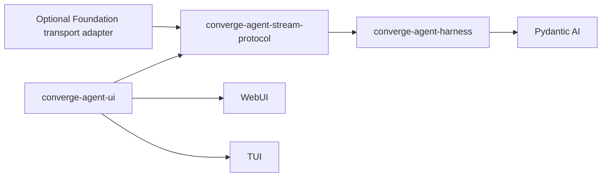
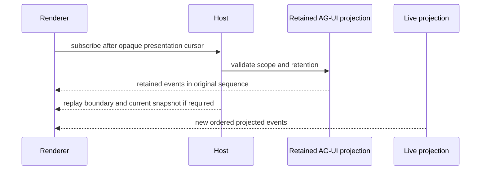

# Agent Stream Protocol Projection

## Design Position

`converge-agent-stream-protocol` is the shared protocol adapter between Agent Foundation execution observations and Agent User Interaction Protocol clients. It accepts validated public Harness events, Host-approved snapshots, and terminal outcomes; emits a strictly ordered standard AG-UI stream; validates supported client input; and provides replay-safe envelope utilities. It lets browser, terminal, and hosted presentation adapters share one interpretation of an Agent run.

The adapter is not an execution wrapper. It never calls a model, constructs an Agent, selects `HarnessState`, authorizes a tool, commits a session or Foundation `Execution`, or owns a transport. A Host supplies authoritative Session, Thread, Turn, and Run correlation and remains responsible for persistence, authorization, backpressure policy, and reconnection.

## Boundaries

| Concern                                      | Owner                            | Projection behavior                                                                                      |
| -------------------------------------------- | -------------------------------- | -------------------------------------------------------------------------------------------------------- |
| Pydantic messages, tools, run, and output    | Pydantic AI and Harness          | Projects only public normalized observations                                                             |
| Complete continuation state                  | Harness `HarnessState` and Host  | Never derives it from AG-UI messages, state snapshots, or replay                                         |
| Local session or durable Execution lifecycle | Owning Host                      | Receives opaque correlation and terminal facts; does not infer them                                      |
| AG-UI standard event semantics               | Upstream AG-UI protocol          | Preserves standard names and payload meaning for one declared compatibility profile                      |
| Harness-to-AG-UI mapping and extensions      | `converge-agent-stream-protocol` | Owns deterministic mapping, ordering validation, safe extension namespace, and replay envelope utilities |
| SSE, WebSocket, in-process iterator, or HTTP | Host transport adapter           | Carries the same validated event values without changing meaning                                         |
| Rendered components and ephemeral view state | WebUI or TUI renderer            | May filter or aggregate display, but cannot rewrite source protocol facts                                |
| Foundation durable event replay              | Foundation Service               | Remains authoritative; AG-UI is a live or retained presentation projection                               |

The [Harness event contract](../agent-harness/12-events-observability-and-usage.md) owns the source stream. [Agent UI local sessions](../agent-ui/02-local-sessions-and-state.md) own local retention, while [Foundation Service](../foundation-service/README.md) owns hosted durable replay.

## Dependency Direction



The Harness imports no AG-UI, UI, session, HTTP, or terminal type. `converge-agent-stream-protocol` depends on public Harness event and result types, the upstream AG-UI schema library, Pydantic, and the lightweight Pydantic AI runtime needed to classify public stream events. It imports no Agent UI session implementation or Foundation persistence model.

In source manifests, `converge-agent-stream-protocol` declares an unversioned dependency on `converge-agent-harness`, while `converge-agent-ui` declares unversioned dependencies on both packages. The root uv workspace resolves those local sources during repository development without turning workspace membership into a release group.

A `release/harness-v<version>` release assigns one version to Harness and Stream Protocol. Before building publishable artifacts, release automation rewrites the Stream Protocol dependency to `converge-agent-harness==<version>` using the normalized Python package version. The resulting sdist and wheel therefore install only the matching Harness version. Agent UI releases separately and its publishable artifacts pin both Harness and Stream Protocol to one manually reviewed Harness release version. Other consuming Hosts, including Foundation Service, select their own tested Harness release in their dependency management.

## Protocol Profile

A projection instance selects one explicit AG-UI compatibility profile before a run begins. The profile fixes:

- the supported upstream event schema and input schema versions;
- the standard event families enabled by the Host;
- content and metadata limits;
- the accepted set and versions of `converge.*` extension events;
- whether optional shared-state, activity, raw, or custom events are emitted.

The profile remains stable for the stream. A transport communicates it during endpoint negotiation or through its versioned API contract. Unknown standard event types, unsupported input fields that alter semantics, malformed JSON Patch, and unknown required extension versions fail validation rather than being coerced into another event.

Standard AG-UI event names and payload fields retain their upstream meaning. Project extensions use a namespaced custom event name such as `converge.subagent.status` with an independent schema version. An extension never claims that a standard `RUN_FINISHED`, `TOOL_CALL_RESULT`, `STATE_SNAPSHOT`, or other event has stronger durability or authority than AG-UI defines.

## Projection Context and Envelope

The following Python-like types are conceptual process-local contracts, not another wire format:

```python
@dataclass(frozen=True, slots=True)
class ProjectionContext:
    stream_id: str
    session_id: str | None
    execution_id: str | None
    thread_id: str
    turn_id: str | None
    run_id: str
    parent_run_id: str | None
    agent_instance_ref: str
    protocol_profile: str


@dataclass(frozen=True, slots=True)
class ProjectedEvent:
    sequence: int
    event_id: str
    item_id: str | None
    agui_event: AguiEvent
    source_observation_id: str | None
```

The Host provides correlation from trusted records. Optional `session_id`, optional `execution_id`, `thread_id`, optional `turn_id`, `run_id`, and `agent_instance_ref` are safe correlation values selected for the client; they are never bearer credentials. The shared [interaction model](../interaction-model.md) owns Session, Thread, Turn, and Item meaning. A projection requires one `thread_id`; `turn_id` is optional for embedded or non-interactive work. `session_id` and `execution_id` are independent because an interactive hosted Run can belong to both a Session and a durable Execution. A local projection can carry only `session_id`, standalone durable work can carry only `execution_id`, and a directly embedded projection can carry neither. `sequence` is strictly increasing within one projection stream. `event_id` is stable for one retained projection record and supports subscriber deduplication; it does not become a Foundation durable event ID unless a Foundation adapter explicitly maps and labels the two identities. `item_id` is present only when the event contributes to one materialized semantic Item.

A replay-capable Host stores the validated `ProjectedEvent` envelope or enough public semantic input to reproduce it under the same profile. It does not persist a renderer's DOM, terminal widget graph, unvalidated provider frame, private exception, or arbitrary Python object.

## Standard Event Mapping

The adapter projects source observations into the narrowest applicable standard AG-UI event family:

| Harness or Host observation                         | AG-UI projection                                                                                                               |
| --------------------------------------------------- | ------------------------------------------------------------------------------------------------------------------------------ |
| Run entered                                         | `RUN_STARTED` with Host-supplied correlation                                                                                   |
| Assistant text lifecycle                            | `TEXT_MESSAGE_START`, ordered content events, and `TEXT_MESSAGE_END`                                                           |
| Tool invocation lifecycle                           | `TOOL_CALL_START`, ordered argument fragments or complete arguments, `TOOL_CALL_END`, and `TOOL_CALL_RESULT` as applicable     |
| Host-approved complete message projection           | `MESSAGES_SNAPSHOT`                                                                                                            |
| Host-approved display/shared-state projection       | `STATE_SNAPSHOT` followed by valid RFC 6902 `STATE_DELTA` only when the selected profile defines that state                    |
| Host-approved activity observation                  | Standard activity snapshot or delta events when supported by the selected profile                                              |
| Child Harness observation                           | The same standard semantic event plus safe parent/child correlation; optional namespaced status metadata never changes meaning |
| Successful terminal Harness result                  | Remaining semantic events, then exactly one `RUN_FINISHED`                                                                     |
| Classified terminal run failure                     | Remaining safe observations, then exactly one `RUN_ERROR`                                                                      |
| Host interruption without a Harness terminal result | A Host-classified error or namespaced interruption observation under the selected profile; never synthetic `RUN_FINISHED`      |

Provider-native frames and private Harness internals are not automatically projected as `RAW` or `CUSTOM`. A Host must explicitly enable a bounded safe diagnostic projection. Tool arguments and results follow Harness visibility and redaction policy before they enter the adapter; AG-UI does not weaken that policy for a protocol inspector.

An inline child emits its own run correlation. A Host-managed background child also emits a distinct run stream if the Host exposes child details. A surface may collapse, hide, or group those details, but a background result routed into the parent is later parent input and is never projected as the delayed `TOOL_CALL_RESULT` of the original spawn call.

## Item Materialization and Identity

The projection layer materializes a semantic Item only when the Host supplies the owning `thread_id` and `turn_id`. A Run without Turn correlation can still produce AG-UI presentation events, but those events do not claim canonical Item identity. Child observations likewise become Items only when the Host supplies the child Thread and Turn correlation rather than inheriting the parent's Turn implicitly.

```python
@dataclass(frozen=True, slots=True)
class ProjectedItem:
    item_id: str
    thread_id: str
    turn_id: str
    kind: Literal[
        "user_message",
        "agent_message",
        "reasoning",
        "tool_call",
        "command",
        "file_change",
        "plan",
        "error",
    ]
    status: Literal["in_progress", "completed", "failed"]
    projection: JsonValue
```

The Host or projection adapter allocates `item_id` before publishing the first event for the unit. Every lifecycle event, retained snapshot, and later status replacement for that same semantic unit carries the same `item_id`; completion or failure updates the existing Item instead of allocating another identity. A new semantically distinct message, tool call, command, file change, plan update, reasoning unit, or error receives a new ID even when it is emitted by the same Run.

`ProjectedEvent.item_id` links transport observations to the materialized Item. One Item can produce many projected events, and events such as Run start, Run completion, replay gaps, or display-state synchronization can have no Item. `event_id`, projection `sequence`, replay cursor, Harness event sequence, provider message ID, and tool-call ID never substitute for `item_id`. A replay-capable Host retains the latest validated `ProjectedItem` value or enough validated lifecycle input to reproduce it with the same ID; replay and delta compaction do not renumber Items.

## Ordering and Terminal Rules

One projection instance consumes one source stream serially. It assigns sequence numbers after validation and before publishing. Concurrent producer activity is serialized by the owning Host at the adapter boundary; subscribers never race to assign order.

The adapter enforces at least these relationships:

1. `RUN_STARTED` precedes run content;
2. message and tool content belongs to an opened matching identity;
3. each opened standard lifecycle closes at most once;
4. deltas apply to the declared prior snapshot or revision;
5. exactly one terminal run event closes a started stream;
6. no semantic run event follows the terminal event;
7. replay preserves original sequence and event identity.

A source gap, duplicate conflicting identity, invalid lifecycle transition, or impossible terminal sequence is a projection failure. The adapter emits or returns one bounded safe protocol failure according to the Host transport contract and stops that projection; it does not invent missing tool results or success.

## Ingress Validation

AG-UI client input is presentation input, not continuation authority. The adapter validates the selected upstream request schema, bounded messages and attachments, advertised client tools, shared-state values, and protocol version. It returns a normalized value to the Host. The Host then:

- authenticates the caller where required;
- selects the profile, optional Session, optional Execution, Thread, optional Turn, checkpoint, and expected revision;
- decides which user-authored content enters `RunInput`;
- authorizes client-side tools through the Harness or Foundation owning contract;
- supplies fresh Identity, model, Environment, credential, and run Capabilities.

Caller-supplied message history cannot replace stored Pydantic history. Caller-supplied state cannot become `HarnessState` or Capability state. Client tool declarations cannot satisfy a pending Foundation call without the exact authenticated parent and result-correlation contract. Unknown correlation IDs are selectors to validate, not authority.

## Replay and Resynchronization



A Host cursor is opaque and scoped to its optional Session, optional Execution, Thread, optional Turn, projection profile, filter, and retention generation. Duplicate delivery is allowed; clients deduplicate by event ID. A cursor older than retained data returns an explicit gap and a fresh Host-approved message/state snapshot when available. It never silently starts at the newest event.

Presentation replay reconstructs visible messages, activities, and state. It does not rerun model or tool work, recreate a live run, prove that omitted deltas never occurred, or select a continuation checkpoint. A Host can discard token-level deltas after retaining complete semantic messages and still report the gap honestly.

## Backpressure, Cancellation, and Failure

The Host owns subscriber buffers and slow-consumer policy. It may coalesce only event forms whose upstream semantics permit it, such as replacing superseded display snapshots. It never drops lifecycle boundaries, terminal events, tool results, or a delta while retaining dependent later deltas without issuing a resynchronizing snapshot and explicit gap.

Transport disconnect is an observation failure and does not cancel execution. A client cancellation request is validated as a separate Host command and uses the Harness or Foundation cancellation owner. Projection cleanup closes subscriber resources but does not infer rollback of model or tool side effects.

| Failure                                | Observable outcome                                                    | Authority and retry                                                              |
| -------------------------------------- | --------------------------------------------------------------------- | -------------------------------------------------------------------------------- |
| Unsupported protocol profile           | Subscription or request rejected before run dispatch                  | Client negotiates a supported profile                                            |
| Invalid client input                   | Typed validation error; no Host acceptance implied                    | Client corrects input                                                            |
| Invalid source ordering                | Projection stops with bounded safe failure                            | Host retains execution truth and can rebuild only from valid public observations |
| Slow or disconnected subscriber        | Subscriber loses live delivery or receives an explicit replay gap     | Run continues unless a separate cancellation command is accepted                 |
| Retention cursor expired               | Typed gap plus reload/resnapshot instruction                          | Host snapshot and retained semantic data recover presentation, not execution     |
| Renderer failure                       | One surface fails without changing run or session state               | Renderer reconnects and replays                                                  |
| Terminal delivery acknowledgement lost | Terminal event may be delivered again with the same retained event ID | Subscriber deduplicates; Host completion is unchanged                            |

## Foundation Service Use

Foundation may use this package to project a live Harness stream and selected retained semantic data. Its durable lifecycle log, Execution snapshot, `ExecutionAttempt` fence, checkpoint, and replay cursor remain owned by Foundation. An AG-UI transport labels which envelopes are backed by Foundation durable events, retained semantic projections, or live-only observations. It never exposes an Agent UI local session type or claims that all token-level AG-UI events are durable.

## Compatibility

Harness event schema, AG-UI protocol profile, project extension schema, Host transport API, and retained cursor codec version independently. Additive upstream fields are accepted only when the selected profile permits unknown fields or the adapter has been updated to preserve their meaning. Changing event order, field meaning, state-patch base, redaction behavior, or terminal semantics requires a new compatible profile or extension version.

A retained projection stores its profile identifier. Replaying it through a newer renderer is allowed when that renderer supports the recorded profile. Re-encoding retained facts into another profile is a Host migration that must preserve event meaning and produce new projection identities; it is not transparent replay.

## Trade-offs

### Shared projection vs. surface-native Harness rendering

One projection makes WebUI, TUI, and hosted adapters agree on messages, tools, children, terminal failures, and replay. It constrains renderers to standard or namespaced protocol semantics and can omit private runtime details that a tightly coupled terminal renderer could inspect.

### Presentation replay vs. continuation state

Retaining AG-UI makes reconnect and UI inspection cheap without exposing private `HarnessState`. Hosts must persist both the authoritative checkpoint and the display projection when both resume and rich replay are required.

### Standard events with narrow extensions

Using upstream events preserves ecosystem interoperability. Some Agent Foundation concepts need namespaced metadata or custom events, which clients can ignore safely but must negotiate when required for their experience.

## Invariants

01. Agent Stream Protocol projects public observations and never executes or resumes an Agent.
02. The Harness has no dependency on AG-UI, Agent UI, transport, renderer, or session types.
03. Every stream declares one stable protocol profile and has strictly increasing projection sequence.
04. Standard AG-UI names and payloads retain upstream meaning; project behavior uses versioned `converge.*` extensions.
05. A terminal AG-UI event observes source completion or classified failure and never commits Host completion.
06. AG-UI messages, snapshots, deltas, cursors, and client input cannot replace `HarnessState`, Host checkpoint selection, or fresh run authority.
07. Replay preserves retained event identity and reports retention gaps explicitly.
08. A disconnect or renderer failure never implicitly cancels a Harness run or Foundation Execution.
09. Background spawn completion is later Host-routed input, not a deferred result for the original spawn tool call.
10. Redaction and visibility are applied before diagnostic, raw, custom, or inspector projections leave the trusted runtime boundary.
