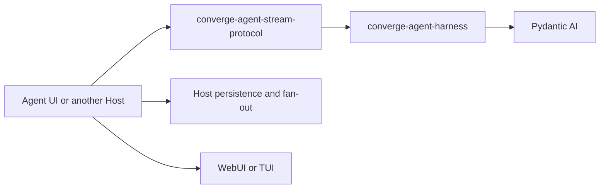

# Agent Stream Protocol Observation

## Design Position

`converge-agent-stream-protocol` is the shared process-local adapter from public Harness stream items to Agent User Interaction Protocol events. One `HarnessAguiObserver` converts the items for one Harness Run, uses standard AG-UI events where their semantics match directly, falls back to `CUSTOM` for every other public observation, applies an optional Host processor, and accumulates the resulting events in observation order.

The package does not define another execution or lifecycle layer. It does not run an Agent, manufacture missing Harness lifecycle observations, accept application commands, retain durable history, assign Host event identities, or own a transport. A Host consumes the Harness stream once, routes each Run to one observer, and decides whether and how to persist, broadcast, filter, compact, or render the returned AG-UI events.

## Boundaries

| Concern                                       | Owner                          | Relationship                                                                                             |
| --------------------------------------------- | ------------------------------ | -------------------------------------------------------------------------------------------------------- |
| Model, tool, and provider event semantics     | Pydantic AI                    | The observer maps its public events without redefining their lifecycle                                   |
| Process-local event correlation and lifecycle | Harness                        | Supplies ordered `HarnessEvent` and terminal `HarnessRunResultEvent` values with Thread and Run identity |
| Harness-to-AG-UI conversion                   | Agent Stream Protocol          | Uses standard AG-UI events where they apply directly and `CUSTOM` otherwise                              |
| Application visibility and filtering          | Host processor                 | May retain, replace declared content fields on, or drop each converted event                             |
| Process-local AG-UI accumulation              | Agent Stream Protocol observer | Retains post-processor events for one Run in observation order                                           |
| Persistence, event IDs, replay, and fan-out   | Host                           | Stores or delivers returned events under its own Session or Execution contract                           |
| HTTP, SSE, WebSocket, or in-process delivery  | Host transport                 | Serializes and carries AG-UI events without becoming their execution authority                           |
| Display state                                 | Renderer                       | Interprets AG-UI events for one surface                                                                  |

The [Harness event contract](../agent-harness/12-events-observability-and-usage.md) owns the source stream. [Agent UI local sessions](../agent-ui/02-local-sessions-and-state.md) own local retention. [Foundation Service](../foundation-service/README.md) owns any hosted durable lifecycle and event history.

## Dependency Direction



The Harness imports no AG-UI, UI, Session, HTTP, or terminal-rendering type. Agent Stream Protocol depends only on public Harness and Pydantic AI stream types plus the upstream AG-UI schema library. It imports no Agent UI session implementation, Foundation persistence model, or transport framework.

Harness and Agent Stream Protocol are one release group. A `release/harness-v<version>` release assigns both distributions the same version, and the published Protocol artifact requires that exact Harness version. This shared release defines the supported source event union; runtime protocol-profile negotiation is not part of the process-local observer.

## Observer Contract

The public contract is intentionally small:

```python
type AguiEventProcessor = Callable[
    [HarnessStreamEvent[Any], Event],
    Event | None,
]


class HarnessAguiObserver:
    def __init__(
        self,
        *,
        processor: AguiEventProcessor | None = None,
    ) -> None: ...

    @property
    def thread_id(self) -> str | None: ...

    @property
    def run_id(self) -> str | None: ...

    def observe(
        self,
        item: HarnessStreamEvent[Any],
    ) -> tuple[Event, ...]: ...

    def snapshot(self) -> tuple[Event, ...]: ...
```

The first successfully observed item binds the observer to the source `thread_id` and `run_id`. Later items must carry the same correlation. A root Run and each exposed child Run therefore use separate observers even when their source items were delivered through one parent Harness stream.

`observe()` performs one complete operation:

1. stage the multipart conversion state for the source item;
2. convert the source item to one or more AG-UI events;
3. call the optional processor once for each converted event;
4. omit only events for which the processor returns `None`;
5. commit the staged conversion state and accumulate retained events;
6. return detached copies of the events added by that call.

Without a processor, every converted event is retained unchanged. A replacement must preserve the AG-UI event type and source-derived Thread, Run, message, tool, and lifecycle correlation. A processor cannot turn another observation into a lifecycle event or expand one event into several.

All events produced from one source item are converted and processed before the observer changes its state or accumulator. A conversion failure, invalid processor replacement, or processor exception leaves the current source item unaccumulated. `snapshot()` returns detached copies of the complete post-processor event sequence. The observer does not compact chunks, remove lifecycle boundaries, create cursors, or apply a retention limit.

A Host persists incrementally from the values returned by `observe()` rather than injecting a storage callback into the observer. This keeps synchronous event conversion independent from asynchronous databases, brokers, and transports. The processor likewise performs no persistence or publication side effects.

## Standard Event Conversion

The observer uses standard AG-UI events for direct semantic matches:

| Public source observation                            | AG-UI representation                                                                    |
| ---------------------------------------------------- | --------------------------------------------------------------------------------------- |
| Assistant `TextPart` start, delta, and end           | `TEXT_MESSAGE_START`, `TEXT_MESSAGE_CONTENT`, and `TEXT_MESSAGE_END`                    |
| `ThinkingPart` start, delta, signature, and end      | Reasoning message events and `REASONING_ENCRYPTED_VALUE`                                |
| Completed `ToolCallPart` at its end observation      | `TOOL_CALL_START`, complete `TOOL_CALL_ARGS`, and `TOOL_CALL_END`                       |
| Successful function or output tool return            | `TOOL_CALL_RESULT`                                                                      |
| Completed terminal `HarnessRunResultEvent`           | `RUN_FINISHED` with success outcome and a JSON-safe result when available               |
| Failed or cancelled terminal `HarnessRunResultEvent` | `RUN_ERROR` with the Harness-owned public failure or cancellation code                  |
| Suspension, non-success tool return, or retry prompt | Namespaced `CUSTOM` preserving the authoritative Harness correlation and public payload |

The observer maintains only the state needed to translate multipart events consistently: the current Harness model-request index, open part identities, accumulated tool name, and whether text or reasoning content has already been emitted. Harness model-request lifecycle observations remain visible as `CUSTOM`; they also provide the request index used when a Pydantic part has no native identity.

Tool names and mapping-valued argument deltas can be incomplete during Pydantic streaming. Their start and delta observations therefore remain visible through `CUSTOM`, while the completed `PartEndEvent` produces one coherent standard tool-call lifecycle from the final public `ToolCallPart`. The observer never mixes AG-UI chunk convenience events with explicit start/end events or concatenates independently serialized mapping deltas.

A text or reasoning part delta or end without a preceding start is normalized into a valid standard lifecycle by emitting the missing start from the information present in that same public event. A conflicting part kind or identity is a conversion error rather than a reason to rewrite prior events.

## Complete Custom Fallback

An observation without a direct standard representation is never silently dropped. It becomes:

- `converge.harness.<kind>` for `HarnessExtensionEvent`; or
- `converge.pydantic_ai.<event_kind>` for another Pydantic AI event.

The `CUSTOM.value` is:

```python
{
    "thread_id": item.thread_id,
    "run_id": item.run_id,
    "sequence": item.sequence,
    "occurred_at": item.occurred_at.isoformat(),
    "event": public_source_representation,
}
```

A Harness extension uses `model_dump(mode="json", by_alias=True)`. A Pydantic AI event uses its public `AgentStreamEvent` serializer. The shared Harness/Protocol release defines these source fields; the fallback does not introduce a manual event allowlist, custom schema registry, or independent version negotiation.

A source item with a direct standard mapping is not duplicated as a second custom event. The processor receives both the source item and each converted event, and a Host can separately retain source records when its product requires them.

## Lifecycle Ownership

Agent Stream Protocol translates explicit lifecycle facts; it does not create them from local control flow. Constructing an observer, opening a subscriber, catching an exception, losing a transport, or committing Host state does not by itself emit a run lifecycle event.

Model-request lifecycle extensions emitted by the Harness use the generic custom fallback because they are not equivalent to AG-UI Run lifecycle. Completed, failed, and cancelled terminal results have direct standard AG-UI terminal mappings. A suspended result remains `converge.harness.run_result` with its exact deferred calls and approvals because one aggregate AG-UI interrupt would invent continuation correlation. If a reusable Run-start observation is required, the Harness must first expose that fact publicly; the Protocol does not infer `RUN_STARTED` from the first token or model request.

A Harness stream that ends through an unhandled exception or cleanup failure without a terminal item does not gain a synthetic terminal event. Host acceptance, persistence commit, cancellation request, reconnect, and external delivery remain separate Host facts.

## Host Processing and Persistence

The optional processor is the policy seam. It can drop observations or replace only declared standard-event content fields while preserving type, timestamp, role, lifecycle variant, custom name, identities, and source correlation. A `CUSTOM.value` is the public source representation and is therefore retained unchanged or dropped as a whole. Host-specific metadata belongs in the Host-owned retained or delivery envelope rather than a rewritten protocol structure. Agent Stream Protocol has no built-in allowlist that suppresses otherwise public Harness events and adds no second visibility policy over the public source stream.

Host persistence wraps AG-UI events in any IDs, sequence numbers, timestamps, transaction records, or replay cursors required by that Host. Those values are not part of the observer because their identity and durability depend on the owning Session, Execution, and store. The observer's in-memory accumulation is a convenience for process-local inspection and snapshot access, not a durable event log.

## Failure and Compatibility

An invalid source type, changed Run correlation, conflicting multipart identity, failed AG-UI construction, invalid processor replacement, or processor exception is reported to the caller. Completed output is normalized to JSON before accumulation; when a valid code-first output has no JSON representation, `RUN_FINISHED.result` is omitted and `rawEvent.result_omitted` records that presentation fact while the source Harness result remains available to the Host. The observer does not convert its own failure into a synthetic Harness or AG-UI lifecycle fact.

Standard AG-UI names and fields retain their upstream meaning. The selected Harness/Protocol release and its pinned AG-UI dependency define conversion compatibility. A Host pins that release with its renderer and owns migration or retention compatibility for events it stores. New public Harness event variants remain observable through `CUSTOM` even before a dedicated standard mapping is added.

## Invariants

1. Agent Stream Protocol observes public Harness stream items and never executes or resumes an Agent.
2. One observer binds to exactly one Harness Thread and Run.
3. Lifecycle facts originate in the Harness source stream; the observer does not infer them from Host or transport behavior.
4. A direct semantic match uses standard AG-UI meaning, and every other public observation falls back to `CUSTOM`.
5. No converted event is dropped by default; only the Host processor can explicitly omit one.
6. One source item is processed and accumulated atomically, and returned events and snapshots are detached from observer state.
7. The observer owns no durable identity, persistence, replay, fan-out, backpressure, cancellation, or transport behavior.
8. AG-UI observation never becomes Harness continuation state or strengthens a Host lifecycle fact.
