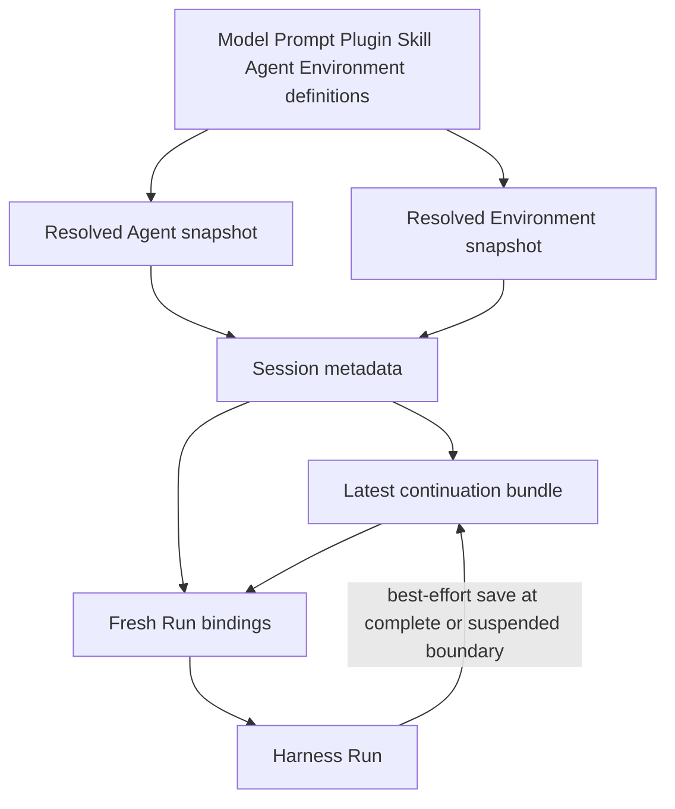
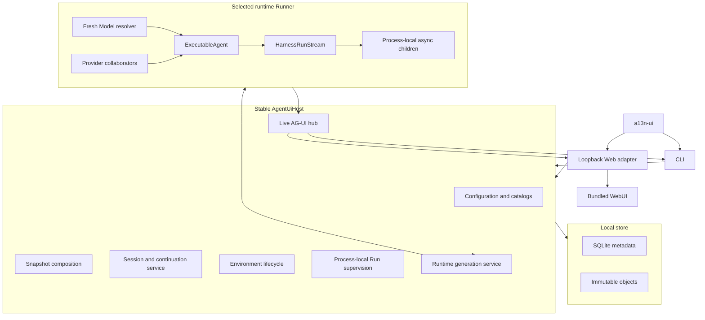

# Agent UI Overview

## Design Position

Agent UI is the local single-user workstation for composing and running `agent-harness` Agents. The `a13n-ui` distribution owns reloadable product configuration, exact Agent and Environment snapshots, local Sessions, Environment lifecycle, continuation persistence, one stable `AgentUiHost`, replaceable runtime Runners, an append-only CLI, and a bundled multi-Session WebUI.

The executable exposes these surface roots:

```text
a13n-ui
a13n-ui cli
a13n-ui run
a13n-ui sessions
a13n-ui web
a13n-ui runtime status
```

`a13n-ui` is an alias for `a13n-ui cli`. The CLI is an ordinary terminal frontend, not a separate full-screen TUI product. The WebUI reaches the same Host operations through a thin loopback HTTP/SSE adapter. Neither surface owns another Session model, Agent loop, scheduler, or storage authority.

Agent UI uses best-effort continuation persistence rather than durable workflow execution. At each complete or suspended Harness result, it attempts to store and select one complete continuation. A later Run starts from the latest successfully selected continuation. Input, partial output, model and tool work, live AG-UI events, and async-child tasks are process-local and can disappear when the owning process exits. Foundation Service remains the product for durable distributed acceptance, failover, remote workers, and retry.

## Product Model



A Session pins one exact Agent snapshot and one exact Environment snapshot. It selects one latest `StoredSessionContinuation`, which bundles the complete public `HarnessState`, optional exact `DeferredToolRequests`, Harness release, and creation time. A configuration reload creates new selectable revisions but does not rewrite an existing Session.

A Run is process-local. It uses the selected continuation, fresh Model authority, fresh provider collaborators, fresh attachments, one new `EnvironmentRuntime`, and current Host Capabilities. A complete or suspended Harness result can produce a new continuation. The Host attempts to publish that object and make it the Session's latest continuation. Session writes use ordinary last-write-wins behavior.

## Boundaries

| Concern                                              | Owner                                       | Agent UI relationship                                                                                  |
| ---------------------------------------------------- | ------------------------------------------- | ------------------------------------------------------------------------------------------------------ |
| Desired product definitions                          | Reloadable Agent UI files                   | Human- and agent-editable source of current Models, Prompts, Plugins, Skills, Agents, and Environments |
| Exact Session composition                            | Agent UI snapshot resolver                  | Publishes immutable Agent and Environment snapshots selected by Sessions                               |
| Native Agent construction and loop                   | Harness and Pydantic AI                     | Runs only through public build and stream contracts                                                    |
| Provider effects and attachments                     | Environment Provider package                | Agent UI selects desired lifecycle and persists provider state when needed                             |
| Current mount set                                    | Harness `EnvironmentRuntime`                | One fresh runtime per root or child Run                                                                |
| Session metadata and continuation selection          | Agent UI SQLite                             | Small local index with ordinary last-write-wins updates                                                |
| Continuation, snapshot, Skill, and provider payloads | Agent UI object store                       | Immutable content-addressed files published before SQLite selection                                    |
| Live presentation                                    | Agent Stream Protocol and Agent UI live hub | Best-effort process-local streaming; not recovery authority                                            |
| Web and terminal rendering                           | Surface adapters                            | Call detached Host commands and queries                                                                |
| Runtime process lifecycle                            | Agent UI runtime-generation service         | Starts, activates, drains, and stops replaceable Runner processes                                      |
| Distributed durable execution                        | Foundation Service                          | Not emulated by Agent UI                                                                               |

## Architecture



`AgentUiHost` is the only product boundary. A surface does not read configuration files, SQLite, continuation objects, provider state, native credentials, or Runner control channels directly. A Runner does not open Agent UI storage or select a continuation.

Multiple frontend invocations can open separate Host processes against the same data root. This is shared local storage, not a distributed execution system. SQLite transactions and atomic file replacement prevent malformed writes, while Session and resource updates use last-write-wins. Concurrent Runs against one Session are not merged; whichever complete continuation is written last becomes current.

## Main Run Flow

```mermaid
sequenceDiagram
    participant Surface as CLI or WebUI
    participant Host as AgentUiHost
    participant Runner
    participant Harness
    participant Store as Object store and SQLite

    Surface->>Host: run input against Session
    Host->>Host: load pinned snapshots and selected continuation
    Host->>Runner: execute with fresh authority
    Runner->>Harness: stream input and RunBindings
    loop public stream items
        Harness-->>Runner: Harness item
        Runner-->>Host: AG-UI event
        Host-->>Surface: best-effort live delivery
    end
    Harness-->>Runner: complete or suspended result and HarnessState
    Runner-->>Host: continuation bundle
    Host->>Store: atomically publish object
    Host->>Store: update latest continuation reference
    alt saved
        Host-->>Surface: saved result
    else publication or update fails
        Host-->>Surface: save failure; previous continuation remains current
    end
```

The Host does not insert a durable accepted-work row before dispatch. Process loss before continuation selection leaves the prior continuation as the next resume point. Partial output is not promoted into continuation state. External effects may have happened and may repeat when the user retries; Agent UI reports that limitation instead of maintaining a general effect journal.

A suspended result stores its complete deferred requests in the same continuation bundle. Resume loads that bundle, validates the pinned Agent snapshot, and starts another process-local Run. If the resume attempt fails before selecting a later continuation, the suspended continuation remains selected.

## Session and Environment Model

A Session stores only restart-relevant facts:

- identity and display metadata;
- pinned Agent and Environment snapshot references;
- exact Skill exposure selections;
- optional fork lineage;
- one latest continuation reference;
- Environment assignments and provider state needed to resume or clean up external resources.

Active Run state, pending input, partial output, subscriptions, async-child tasks, and delivery attempts stay in memory. Session history for CLI and WebUI is reconstructed from the latest `HarnessState` message history plus small terminal metadata where useful. Retained AG-UI segment chains and projection watermarks are not part of the product.

Environment resources can outlive one Run, so Agent UI retains provider state needed to reconnect or clean up. Lifecycle commands are serialized only within the current Host; persisted resource state uses last-write-wins. Agent UI does not persist attachments, clients, credentials, native provider objects, or `EnvironmentRuntime` values. [Sessions, Environments, and State](04-sessions-environments-and-state.md) owns this boundary.

## Runtime and Async Children

The stable Host can replace runtime Runners without restarting the surface. New work selects the active Runner generation; admitted work stays on its original Runner until completion, cancellation, or bounded drain. No work migrates between processes.

Async subagents are process-local tasks over exact Harness-built children. Their status, steering, cancellation, terminal output, and pending parent delivery exist only for the current Host lifetime. Once child output reaches the parent and the parent selects a continuation, ordinary parent `HarnessState` persistence carries the resulting continuation. Agent UI does not maintain a durable child job or delivery ledger.

[Runtime, Subagents, and Surfaces](05-runtime-subagents-and-surfaces.md) owns the detailed process and frontend contracts.

## Configuration and Storage

Configuration files remain the desired-state authority. A complete valid reload publishes one accepted generation; failure leaves the prior generation active. Exact snapshots and managed Skill packages remain immutable so existing Sessions continue after source edits.

The local store uses SQLite for small mutable indexes and content-addressed files for larger immutable values. Publication is file-first, then SQLite selection. The design does not claim cross-store ACID or device-level durability. SQLite uses WAL and short write transactions. A crash can lose an unselected continuation while leaving the previously selected one usable.

[Configuration and Resource Catalog](01-configuration-and-resource-catalog.md), [Agent Composition and Snapshots](02-agent-composition-and-snapshots.md), and [Local Storage and Recovery](03-local-storage-and-recovery.md) own these details.

## Application Lifetime

Each command opens one Host lifetime:

1. load process settings;
2. open and migrate the shared local store;
3. load one accepted configuration generation;
4. start and activate one runtime Runner;
5. attach the selected surface;
6. serve commands until the surface exits;
7. stop accepting new work, cancel or drain process-local tasks, stop Runners, and close local collaborators.

Startup validates values when they are selected or needed; it does not scan every retained Session, infer that another process died, repair active work, or claim another process's staging files. Shutdown does not synthesize durable interruption records for tasks that are about to disappear.

## Packaging

`a13n-ui` is both the Python distribution and console script. The bundled browser assets are private build input from `apps/harness-ui` and ship in both wheel and sdist. Building a wheel from the sdist does not require Node.js.

The supported no-install entrypoints are:

```console
uvx a13n-ui
uvx a13n-ui cli
uvx a13n-ui web
```

## Completion Boundary

Agent UI is complete when:

- configuration and exact snapshots reconstruct valid Harness executables;
- root Runs execute in the selected Runner with fresh Model and Environment authority;
- every complete or suspended continuation is saved on a best-effort basis, and every successfully selected continuation can resume;
- process loss cleanly falls back to the previous selected continuation;
- Environment resources resume and clean up through provider state;
- async children work within one Host lifetime without a durable job subsystem;
- `a13n-ui` and `a13n-ui cli` provide one append-only terminal experience;
- the bundled WebUI provides a complete multi-Session application over the same Host;
- multiple local processes can open the data root using ordinary SQLite and filesystem behavior, without leases, fencing, or distributed coordination.
